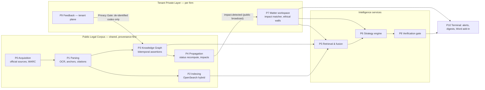

# Executive Summary: Indian Legal Intelligence Platform

*A Bloomberg Terminal for Indian law, plus an AI senior partner that reasons over a firm's live matters. Architecture blueprint v1.0, 30 September 2026.*

## The one-paragraph version

We are building a **paragraph-anchored, time-aware, provenance-first model of Indian law**. It covers:

- the Supreme Court, all High Courts and major tribunals;
- the Constitution, statutes, rules and notifications, each versioned point-in-time;
- a **proposition-level treatment graph**: who followed, distinguished, doubted or overruled *which holding*, when, and whether it binds *this* forum.

That graph is joined to a **tenant-isolated matter workspace**. When a notice arrives, the system produces a verified strategy memo, in which every sentence traces to a specific paragraph. When the law changes overnight, the affected paragraph in a firm's live memo or draft is flagged the next morning.

The model is not the moat, because general models are near parity on legal research ([20 §6.1](20_competitive_teardown.md)). The moat is the verified treatment ledger, the matter-level propagation of changes, and a consented evaluation and feedback flywheel with our partner firm.

## Why now, and why existing tools fall short

**Commercial legal-AI tools still hallucinate.**
- Stanford RegLab measured 17% hallucinated answers for Lexis+ AI and 33% for Westlaw AI-Assisted Research.
- A "hallucination" there includes *misgrounded* answers: a real citation that does not support the claim.
- The dominant causes were naive retrieval and inapplicable authority ([Magesh et al.](https://arxiv.org/abs/2405.20362); [10_P8 §3](10_P8_verification_evaluation.md)).

**Specialist tools barely beat general models.**
- Vals' October 2025 legal-research benchmark scored specialist tools at 74–78% and ChatGPT at 77%.
- Specialists led mainly on *authoritativeness* ([VLAIR](https://vals.ai/industry-reports/vlair-10-14-25)).

**The Indian market lacks the key capabilities.** No Indian product publicly shows typed treatment, point-in-time statutes, propagation into matters, or a published evaluation ([20 §3](20_competitive_teardown.md)).

**Indian law adds its own hard problems:**
- A three-code criminal law transition. BNS, BNSS and BSA commenced on 1 July 2024, and pending proceedings are saved under s.531 BNSS ([21 §6](21_india_specific_legal_data.md)).
- Bench-strength precedent doctrine ([21 §4](21_india_specific_legal_data.md)).
- Vernacular judgments and low-quality scans.
- Official portals behind CAPTCHAs with no public bulk API ([02_P0](02_P0_source_acquisition.md)).

**Global players are already inside tier-1 Indian firms.** Shardul Amarchand Mangaldas and AZB & Partners deployed Harvey firm-wide in 2025 ([20 §3](20_competitive_teardown.md)). We therefore position as the **Indian-law intelligence and matter-monitoring layer that complements**, and can feed, such workspaces.

## Architecture in brief (details: [01_master_architecture](01_master_architecture.md); interface rulings: [01a_spine_decision_record](01a_spine_decision_record.md))

Eleven atomic phases (P0–P10) communicate only through versioned events (CloudEvents on Kafka) and typed objects. The objects are `ParsedDocument`, `Assertion`, `AuthorityView`, `EvidenceBundle`, `MatterContext`, `Claim`, `VerificationReport` and `FeedbackEvent`. Each phase can therefore be built, tested and replaced on its own. Every claim resolves to an anchor such as `wrk_…/en#o1.p45` or, for a statute version, `wrk_…#sec-302@2023-12-31`.

## Top 10 decisions

| # | Decision | Chosen over | Why | Doc |
|---|---|---|---|---|
| 1 | **Paragraph anchors and a FRBR document model built only from official or open sources.** Stable, alias-tracked anchors; WARC provenance; `rights_class` on every manifestation. | Reporter-derived text; scraping by CAPTCHA-solving | Every claim must trace to a paragraph. Reporters' editorial layers are protected (*EBC v. D.B. Modak*, (2008) 1 SCC 1). A clean title is what lets us redistribute through an API. | [02](02_P0_source_acquisition.md), [03](03_P1_ingestion_parsing.md), [21](21_india_specific_legal_data.md) |
| 2 | **Knowledge graph = PostgreSQL 18 bitemporal store of reified assertions plus an in-memory graph projection** | Neo4j, Memgraph or Neptune as the system of record | Edges are evidence-carrying claims with valid time and record time. Hot queries are 1–3 hops. Graph-DB licensing and continuity risks (e.g. Kùzu archived). The store also runs on-prem. | [05](05_P3_knowledge_graph.md) |
| 3 | **Proposition-level treatment and a deterministic doctrine library** (Art. 141, bench strength, per incuriam, pending references, stays) compute `AuthorityView` and `binding_on_forum` as of any date | Case-level flags; letting an LLM judge authority | Partial overrulings are common. "A newer edge wins" is wrong in Indian law: a smaller bench cannot overrule a larger one. Rules are testable and citable. | [05](05_P3_knowledge_graph.md), [21 §4](21_india_specific_legal_data.md) |
| 4 | **Risk-weighted model allocation.** Your hypothesis "premium models for building the graph, cheap for serving" is refuted as a blanket rule. | Premium-for-construction / cheap-for-serving | Building the graph with a cheap cascade and ~5–12% premium escalation costs ≈$90K at 5M docs, versus ≈$285K all-premium. Serving graph facts needs zero LLM calls. Premium reasoning runs at serving time for the advocate, opponent and bench roles. | [13](13_cross_cutting.md), [05](05_P3_knowledge_graph.md) |
| 5 | **Hybrid retrieval with curated-graph operators, a separate "binding authority" search, and a mandatory adverse-authority sweep.** Rank fusion (RRF) only builds the candidate list; the final ranking is monotone-constrained and authority-aware. | Vector-only retrieval; GraphRAG built by open information extraction; fused scores taken at face value | On Indian prior-case retrieval, dense retrievers underperform BM25. Missing *binding adverse* authority is the costliest error. | [07](07_P5_retrieval_fusion.md) |
| 6 | **The "senior partner" is a deterministic workflow, not a free-form agent swarm.** It uses a closed-world citation ledger, constrained decoding, and a rules-based **Procedural Clock** for limitation periods and deadlines. One opposing-counsel pass and a bench assessor run on a different model family. | Multi-round debate; LLM-computed deadlines; judge profiling | Stanford's audit and TR's Deep Research experience show why stopping criteria and grounding must be hard-coded. Deadlines are computed from law, not predicted. No named-judge win-rates. | [08](08_P6_strategic_reasoning.md) |
| 7 | **Verify, then show.** Deterministic warrant checks come first: the cited paragraph exists, the quote matches, the pinpoint supports the claim, the speaker role is right, the status is good law, it binds this forum, and it was the law on the date. Then an NLI model, then a judge from a different model family. Confidence is shown as 4 calibrated bands with audited error rates. | Citation-existence checks only; a single LLM judge | Existence checks do not catch misgrounding, which the market's "zero hallucination" claims ignore. | [10](10_P8_verification_evaluation.md) |
| 8 | **Broadcast-and-match impact propagation.** Public `impact.detected` events carry no tenant ID; each firm's Impact Matcher runs inside its own boundary. Alerts have a lifecycle: provisional, confirmed, then retracted if wrong. | Registering each firm's dependency fingerprints centrally | A firm's reliance set is privileged strategy. The same design serves on-prem installs. | [06](06_P4_update_propagation.md), [09](09_P7_firm_matter_workspace.md) |
| 9 | **Isolation and residency by construction.** Tenancy uses a "bridge" model: each firm gets its own schema, indexes, keys and caches, and large firms are promoted to dedicated cells. OpenFGA enforces ethical walls. Every model call routes to a region that fails closed. Deployments D1 (pooled SaaS) to D4 (on-prem). | Pooled indexes behind filters; a single-provider LLM | As of September 2026 there is no in-India processing for Claude. Firms that require it are served by in-India OpenAI-on-Bedrock or Azure South India endpoints, or self-hosted open-weight models. | [09](09_P7_firm_matter_workspace.md), [13](13_cross_cutting.md) |
| 10 | **Two-plane learning with a Privacy Gate, plus eval-gated releases.** Only closed-vocabulary codes about *public* objects cross from firms to the shared layer; relevance signals cross only in aggregates of at least 5 firms. Releases must pass paired-bootstrap non-inferiority tests and zero-tolerance sentinel suites. | Training on customer data; ">1 point regression" rules of thumb | Protects privilege and DPDP obligations while still compounding quality. | [11](11_P9_feedback_learning.md), [10](10_P8_verification_evaluation.md) |

## India-specific capabilities (the differentiators)

- **Criminal-code transition engine.**
  - IPC/CrPC/IEA map to BNS/BNSS/BSA at clause level, many-to-many.
  - Each mapping carries a typed `change_type` and is reviewed by a human before display.
  - A `governing_code()` procedure decides applicability *per proceeding stage*: the offence date governs substantive law, and s.531 BNSS saves pending procedure.
  - Precedent interpreting IPC provisions is carried to the corresponding BNS provisions, with the change type made explicit ([21 §6](21_india_specific_legal_data.md), [05](05_P3_knowledge_graph.md)).
- **Point-in-time statutes** rebuilt from amending Acts and commencement notifications, with round-trip verification and territorial variants for state amendments ([03](03_P1_ingestion_parsing.md), [21 §7](21_india_specific_legal_data.md)).
- **Indian citator vocabulary and doctrine.**
  - Bench strength, per incuriam and sub silentio, pending references, SLP dismissals (not affirmances), and interim stays.
  - Encoded as 22 cited doctrine rules. Contested points return both views ([21 §4–5](21_india_specific_legal_data.md)).
- **Multilingual by default.**
  - Anchors and quotes stay in the original language.
  - Machine translation is used only for search and reading, never as citable text ([04](04_P2_enrichment_indexing.md)).

## The moat, stated honestly ([20 §6](20_competitive_teardown.md))

**Not moats**, because each is copyable within about 6 months: the model, the number of agents, raw corpus size, "citations retrieved, not generated", on-prem packaging, crosswalk *tables*, chat, digests and WhatsApp alerts.

**The durable moat is the combination of M2 × M4 × M5:**
- **M2:** a *verified*, proposition-level treatment ledger that grows only with reviewer-hours and time.
- **M4:** matter-linked propagation of changes, which creates compounding switching costs once firms load their matters.
- **M5:** a consented partner-firm gold set and feedback flywheel.

A public, reproducible Indian legal-AI benchmark (M6) turns trust into a go-to-market asset.

**Estimated lead:** 18–30 months if we execute. It falls to about 12 months if an incumbent such as SCC Online or Manupatra forms a content alliance with Harvey, mirroring the LexisNexis–Harvey deal. Our response is to lead with M4 and M5 and to offer our public corpus through an API/MCP to those assistants.

## Scale, cost and latency (planning estimates; [13](13_cross_cutting.md))

- **Corpus:** designed for **20M documents**. The open High Court dataset alone has 17.8M PDFs (≈1.25 TiB) and grows about 1.4M a year ([dataset stats](https://github.com/vanga/indian-high-court-judgments/blob/main/STATS.md)).
- **One-time build:** ≈$90K at 5M documents and ≈$360K at 20M, using the cascade.
- **Monthly run:** ≈$77K–$89K at 2,000 seats.
- **Unit costs** (tokenizer-corrected, the figures of record): ≈$0.105 per verified Q&A and ≈$2.16 per strategy memo.
- **Latency:**

| Operation | Target (p95) |
|---|---|
| Search | 800 ms |
| Evidence bundle | 2.5 s |
| Verified answer | 25 s |
| Full strategy memo (async, sections stream) | 15 min |
| Capture of priority sources (Supreme Court, extraordinary gazette, RBI/SEBI) | ≤30 min |
| Provisional alert for tier-1 negative treatment | ≤6 h |
| Human-verified alert | within 1 business day |

## Build plan ([22](22_build_roadmap.md)) and risks ([23](23_risk_register.md))

**Timeline, team and budget** (estimates, starting October 2026):

| Milestone | When | What |
|---|---|---|
| M0 Foundations | months 1–2 | legal opinions, partner papers, gold-set protocol, infrastructure |
| M1 Partner demo | month 6 | an honest but not-yet-calibrated vertical slice |
| M2 Pilot | months 7–12 | live matters at the partner; calibrated verification by month 12 |
| M3 GA | month 18 | pooled SaaS opens |
| M4 Full | month 30 | on-prem, PLC API/MCP, 20M-document corpus |

- **Team:** grows from about 19 to about 70 FTE.
- **Programme cost:** ≈$8.6–14M over 30 months, about 70% of it people.
- **Critical path:** runs through human-reviewed tier-1 edges and verification calibration, not through model choice.

**Build a thin vertical slice for the design partner first**, on a dedicated D2 cell running the same code as pooled SaaS. It covers:
- the Supreme Court, plus the High Courts and tribunals in the partner's practice areas, plus central Acts including the BNS/BNSS/BSA crosswalk;
- notice-to-memo for 2–3 Indian matter types;
- citator badges and cite-check;
- one end-to-end alert loop from a new Supreme Court or High Court decision to a partner matter;
- the benchmark harness.

**The five competitive minimums are hard gates** ([20 §7.2](20_competitive_teardown.md)):
1. human-reviewed typed negative treatment;
2. claim-level support verification;
3. per-issue adverse coverage;
4. one live alert loop;
5. the benchmark harness.

**Biggest open risks:**
1. **Lawful access to CAPTCHA-gated official portals**, and the derivative-data status of the open datasets. Counsel opinions are required before launch.
2. **Unmeasured quality of cheap models** on Indian treatment classification, and of verification on Hindi/regional-language text.
3. **Doctrinal edge cases that are still contested**, such as the weight of SC obiter, stayed HC judgments, and straddling offences under the criminal-code transition.
4. **Incumbent–Harvey alliance** risk.
5. **Human-review staffing** for tier-1 treatment edges, including reviewers who read Hindi.

Where a claim in this blueprint could not be verified, it is marked *(unverified)* or tagged `snippet` in the owning document ([24](24_bibliography.md)).
