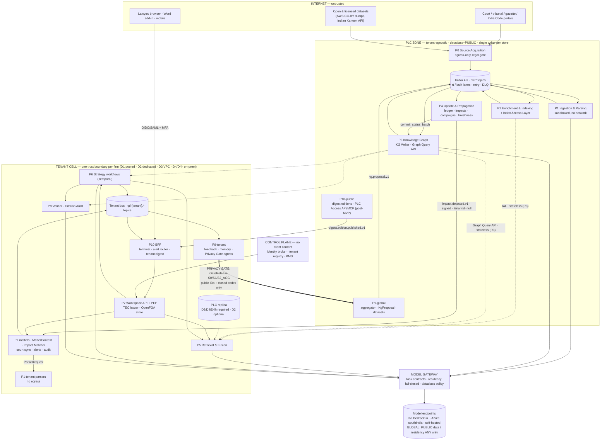
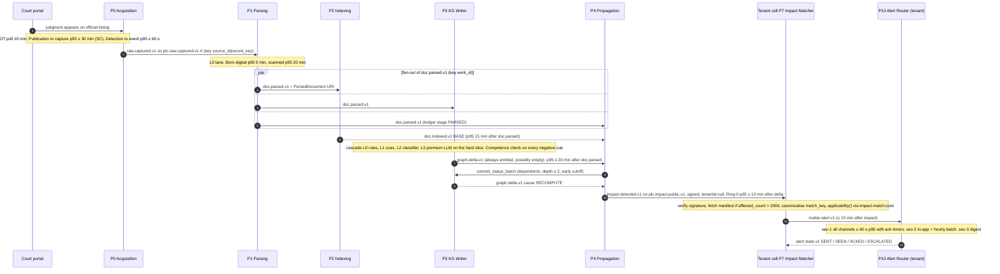
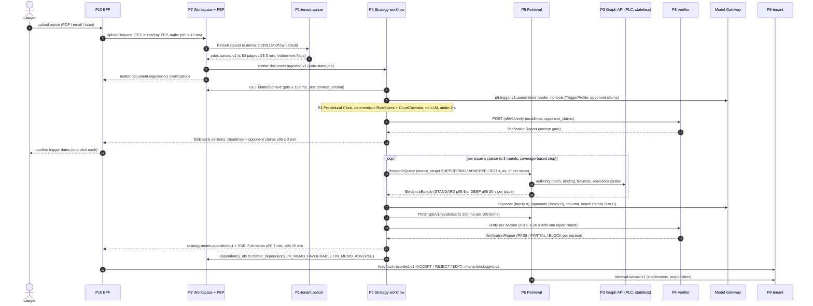
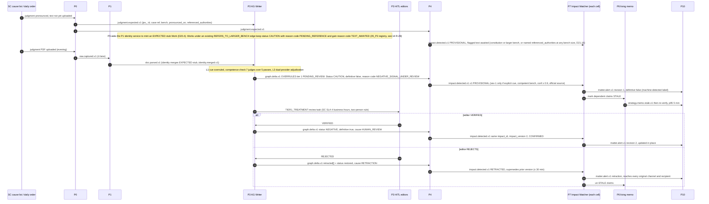
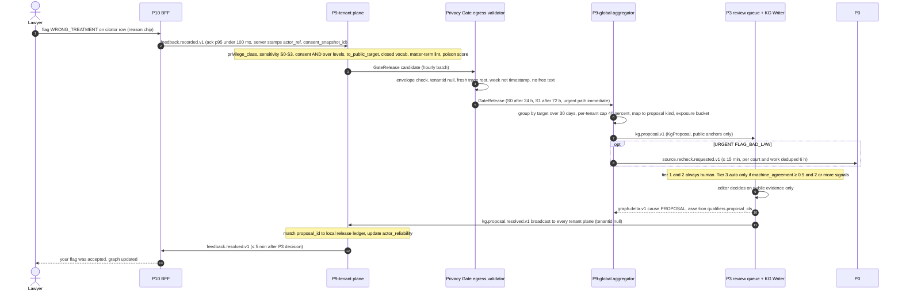
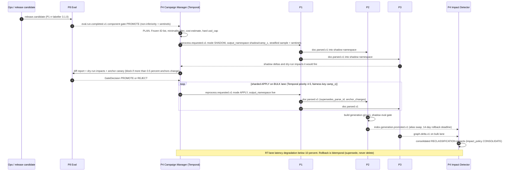
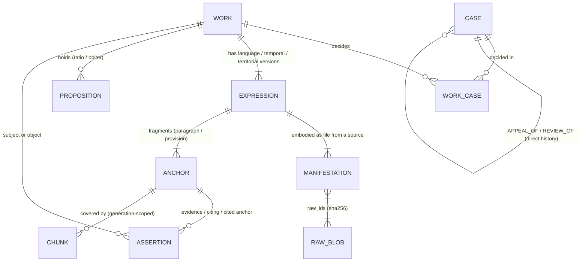

# 01 — Master Architecture: Integration of the Indian Legal-Intelligence Platform

**Abstract.** This is the integration document of the blueprint. It fixes the cross-phase contract baseline **v1.0**: layers and trust boundaries, the canonical identifier and anchor grammar, the event catalogue, the core object catalogue, the synchronous APIs, the technology and deployment posture, and the decision log. Its inputs are the architecture spine v0.1, the principal architect's decision record D1–D21 ([01a_spine_decision_record.md](01a_spine_decision_record.md)), and the §2 contracts of the eleven phase documents (02–12) and 13_cross_cutting. Where a phase document's §2 disagrees with v1.0, this document states the disagreement, names an owner and gives the resolution (§8.2, §14). The platform has four layers. The **Public Legal Corpus** (P0–P4) is tenant-agnostic. The **Intelligence services** (P5, P6, P8) run inside each firm's trust boundary whenever they touch private data. The **Tenant Private Layer** (P7 and tenant-side P9) holds each firm's data. The **Product surface** (P10) sits on top. The layers are joined by stable IDs, paragraph-level anchors, CloudEvents on Kafka, and one guarded path from tenant data to public data: the P9 **Privacy Gate**. Every legal claim the platform shows must trace to an anchor, meaning a specific paragraph or provision of a specific source text, and P8 verifies every claim before it is displayed.

---

## 1. Purpose; how to read the blueprint

### 1.1 Purpose and precedence
This document has five jobs:
1. State which component owns every shared object, event, identifier and store.
2. Show that the output of each phase is exactly the input of the next, and list every place where that is not yet true (§8.2, §14).
3. Publish the formal grammars that more than one phase parses: the ID registry, the anchor EBNF and the alias schemes (§5).
4. Give end-to-end flows with per-hop latency budgets (§4).
5. Record the 30 architecture decisions that shape the system, with the alternatives rejected (§12).

**Order of precedence for cross-phase contracts:**
1. The decision record [01a_spine_decision_record.md](01a_spine_decision_record.md) (D1–D21) **together with** this document's §5–§9. The two are one baseline: this document incorporates every ruling D1–D21. If a passage here still disagrees with a D-ruling, the D-ruling wins and the passage is an editorial defect to be fixed.
2. The resolutions marked ✱ in §14 that are still OPEN (not yet ruled in D1–D21).
3. Each phase document's §2 (its "Spine v1.0 conformance" subsection records its dispositions).
4. Spine v0.1 (reproduced as 01a Appendix A; historical).

Phase documents remain authoritative for their *internal* design (§5 of each).

**Notation.**
- "v1.0" is the contract baseline defined here.
- ✱ marks a resolution made in this synthesis that is not in the decision record. Each one is listed in §14 with an owner. Where D19–D21 later ratified a ✱ resolution, the ✱ is replaced by the D-number.
- Phase references look like "06_P4 §2.2". External facts carry `[MA-n]` tags (References at the end); most are re-cited from the phase documents' verified reference lists.
- **[NOVEL — unvalidated]** marks our own designs.

### 1.2 Document map (00–24)

| Doc | One-line scope |
|---|---|
| 00_executive_summary.md | Decision-maker summary: the moat, MVP scope, cost envelope, top risks, what to build first. |
| **01_master_architecture.md** | This document: contract baseline v1.0, flows, identifiers, events, objects, APIs, decisions, residual gaps. |
| **[01a_spine_decision_record.md](01a_spine_decision_record.md)** | The principal architect's rulings D1–D21 on every proposed interface change and cross-phase conflict; co-authoritative with §5–§9 of this document (§1.1). Appendix A reproduces the provisional spine v0.1. |
| 02_P0_source_acquisition.md | Lawful acquisition from court, tribunal, gazette and India Code portals. Covers the legal gate as code, WARC provenance, change detection, court-status and cause-list feeds, and `raw.captured.v1`. |
| 03_P1_ingestion_parsing.md | OCR consensus, layout, judgment and statute parsing, rhetorical roles, citation grammar and resolution, identity, anchors, and round-trip-verified point-in-time statutes. Produces `doc.parsed.v1` and `ParsedDocument`. |
| 04_P2_enrichment_indexing.md | Structure-aware chunks, anchored summaries, OpenSearch hybrid indexes and generations, and the Index Access Layer (IAL). Produces `doc.indexed.v1`. |
| 05_P3_knowledge_graph.md | Bitemporal reified-assertion KG on PostgreSQL 18, the extraction cascade, doctrine library `authority-core`, `AuthorityView`, the criminal-code crosswalk, and HITL. Produces `graph.delta.v1` and serves the Graph Query API. |
| 06_P4_update_propagation.md | Kafka backbone, propagation ledger and the "law current to" frontier, status recompute, impact detection and lifecycle, reprocess campaigns, and the Freshness API. Produces `impact.detected.v1`. |
| 07_P5_retrieval_fusion.md | Intent routing, issue decomposition, lexical, dense, graph and binding-set legs, authority-aware ranking, the mandatory adverse sweep, and authority packs. Produces `EvidenceBundle`. |
| 08_P6_strategic_reasoning.md | Durable strategy DAG, quarantined trigger analysis, the Procedural Clock, the Citation Ledger, advocate, opponent and bench roles, and drafting. Produces `StrategyMemo`, `Deadline` and `DraftArtifact`. |
| 09_P7_firm_matter_workspace.md | Tenant cells, private documents and anchors, `MatterContext`, OpenFGA walls, TEC, keys, audit, the Impact Matcher, and court tracking. Produces `matter.alert.v1`. |
| 10_P8_verification_evaluation.md | Warrant-based claim verification, calibrated display bands, Citation Audit, gold sets, the regression-gate policy, and the design-partner programme. |
| 11_P9_feedback_learning.md | Feedback capture, the S0–S3 Privacy Gate, KG proposals, LTR impression logging, eval-case harvesting, scoped memory, and the erasure cascade. |
| 12_P10_product_surface.md | Workspace-first terminal, citator badges, the alert router, two-stage digests, watchlists, the Word add-in, and the BFF. |
| 13_cross_cutting.md | Corpus sizing, cost model, Model Gateway, threat model, prompt-injection architecture, latency budgets, observability, DR, and topologies. |
| 14–19 | Unused (reserved numbering). |
| 20_competitive_teardown.md | Indian and global competitors, their failures and likely architectural causes, and the moat analysis. |
| 21_india_specific_legal_data.md | Sources and rights, citation formats, precedent doctrine rules (`rul_IN_PREC_01..24`, D20.8), criminal-code transition, temporal and territorial law, languages, and compliance. |
| 22_build_roadmap.md | Sequencing, MVP gates (the competitive minimums), team and milestones. |
| 23_risk_register.md | Consolidated risks with owners, mitigations and triggers. |
| 24_bibliography.md | Merged, de-duplicated reference list of all documents. |

### 1.3 Reading paths
- **Engineer building phase X.** Read §3 (your row), then §6 (events you produce and consume), §7 (objects), §8.2 (open mismatches that touch you), §9 (APIs you serve and call), then your phase document's §2 and §5.
- **Architect or reviewer.** Read §2, §4, §12, §13 and §14.
- **Security or compliance.** Read §2.3, §6.1 (envelope and dataclass), §10.3, §11.3 and 13_cross_cutting §5.

---

## 2. System context and layers

### 2.1 Layers and the rules that bind them

| Layer | Phases | Trust zone | What it holds | What it may read |
|---|---|---|---|---|
| **Public Legal Corpus (PLC)** | P0, P1, P2, P3, P4; P9-global; P10-public | PLC zone, `dataclass=PUBLIC` | Raw captures, Works, anchors, chunks, assertions, status, impacts | Official and licensed public sources, and Privacy-Gate releases |
| **Intelligence services** | P5, P6, P8 (+ Model Gateway) | Inside the tenant trust boundary when a TEC is present; PLC-only mode otherwise | Nothing durable except tenant-scoped artefacts written back to the TPL | PLC read APIs (stateless), TPL under a TEC |
| **Tenant Private Layer (TPL)** | P7, P9-tenant, P1-tenant, P10 tenant stage | One cell per firm (D1–D4h) | Matters, pdocs, private anchors, facts, memos, feedback, watches, audit | PLC IDs and public events, own tenant data |
| **Product** | P10 BFF and clients | Tenant cell (BFF); public edge for the PLC Access API | Presentation state only | Everything above, via APIs |

**Binding rules** (each is enforced by a test or a gate, cited in brackets):
- **R1 One-way reference.** TPL rows may hold PLC IDs. No PLC table, index, event, cache or log line holds a TPL ID, TPL text or a TPL-derived hash (09_P7 §5.1 INV-1; canary tenants per 13_cross_cutting §5.5).
- **R2 Single TPL→PLC path.** The only path is the P9 Privacy Gate. It releases closed-vocabulary codes about public objects only, in sensitivity classes S0/S1/S2_AGG; S3 never crosses (D9; 11_P9 §5.5). Gate-caused PLC events carry `tenantid=null`, a fresh trace root and a global `causationid` (D2).
- **R3 PLC read path is stateless for tenants.** The Graph Query API, IAL and Anchor Read API log no tenant-attributable IDs outside the tenant audit store; ops telemetry is tenant-redacted (D3). D1 and D2 cells read the shared PLC through this stateless read path in the same region (a local replica is optional for D2). D3, D4 and D4h deployments MUST read a local PLC replica, with a replica-lag SLO of ≤24 h (D19.7).
- **R4 Broadcast, never register.** P4 broadcasts impacts; each tenant matches locally. P4 never stores tenant dependency sets, and no PLC-side component knows which Works tenants rely on (D3). Anything PLC-side that needs "importance" uses public signals only, e.g. the real-time lane rule (§4.1; D19.4).
- **R5 TEC required.** Any access to TPL data by P5, P6, P8, the Model Gateway or index shards carries a signed Tenant Execution Context valid for ≤5 min (D9; 09_P7 §5.2).
- **R6 Single writer per store.** P0 writes raw and captures. P1 writes identity, anchors and aliases. P2 writes indexes. P3 writes assertions, propositions and AuthorityStatus; P4 writes status only through `commit_status_batch`. P4 writes the ledger and impacts. P7 writes TPL. P8 writes gold, eval and verification data. P9 writes feedback and gate releases (D4; 05_P3 §5.1).
- **R7 Anchors, not chunks, are durable.** Cross-phase records (claims, feedback, dependencies, gold items) persist `anchor_id`s. `chunk_id`s are generation-scoped (D8).
- **R8 All model access goes through the Model Gateway**, against a `ModelTaskContract`, with fail-closed residency (D1, D15).
- **R9 Verify-then-show.** No claim reaches a user or an export without a P8 `VerificationReport`. Only VERIFIED and PARTIAL claims leave the platform (10_P8 §2.4; 12_P10 export gate).

### 2.2 Component diagram with trust boundaries



The dashed arrows are read-only synchronous calls into the PLC. D1 and D2 cells call the shared PLC over the stateless read path (a D2 cell may add a replica); D3, D4 and D4h cells are served by their local replica (R3; D19.7). The thick arrow is the only data path from the TPL to the PLC (R2).

### 2.3 Storage map (what lives where)

| Store | Engine | Single writer | Contents | Plane | Key facts |
|---|---|---|---|---|---|
| Raw CAS + WARC | S3 ap-south-1, Object Lock (governance); MinIO on-prem | P0 | Fetched bytes by `sha256`; WARC request/response/metadata; daily WACZ + signed Merkle root; archived ToU/robots pages | PLC | Content-addressed and immutable; DR RPO 0 (CRR) (02_P0 §2.4; 13_cross_cutting §8.2) |
| Acquisition SoR | PostgreSQL | P0 | `source`, `legal_profile`, `crawl_run`, `source_record`, `capture`, `acquisition_request`, `suppression`, `expected_record`, outbox | PLC | `acquisition_request` has no tenant columns by design |
| Parse artefacts | S3 `plc-derived/`, `plc-parsed/` | P1 | Page images and OCR JSON; `ParsedDocument` (zstd JSON, immutable per `parse_id`) | PLC | |
| Identity & anchor store | PostgreSQL (anchor table hash-partitioned by `work_id`) | P1 | `work`, `legal_case`, `work_case`, `expression`, `manifestation`, `identifier_alias`, `anchor`, `anchor_alias`, `expression_alignment`, `parse_run`, `citation_mention`, `review_task` | PLC | ≈300M paragraph anchors at 5M docs (estimate; 03_P1 §5.14) |
| Chunk SoR + indexes | PostgreSQL (`expression_state`, `chunk`, `status_mirror`, outbox) + OpenSearch (BM25 + k-NN per `index_generation`, cards, `plc-status` mirror) | P2 | Chunks, summaries, embeddings refs, status projection | PLC | ≈36.5M chunks and ≈60M vectors at 5M works (04_P2 cost figures) |
| Assertion store | PostgreSQL 18, bitemporal, partitioned by predicate family; in-memory CSR projection | P3 (KG Writer) | Assertions, propositions, `provision_version`, `authority_status`, doctrine rules, method versions, review tasks | PLC | `WITHOUT OVERLAPS` temporal keys [MA-5]; ≈55M current assertions, ≈150–250 GB (05_P3 cost figures) |
| Propagation store | PostgreSQL + S3 `plc-impacts/` (closure manifests, Parquet) + Temporal | P4 | Ledger, frontier, impacts and versions, campaigns, scheduled legal events | PLC | Impact manifests are signed (06_P4 L4) |
| Event log | Kafka 4.x (KRaft) | each producer via outbox | Transport only; replay reads the SoRs, not the log (06_P4 §5.2) | both | Retention 7–365 d per topic (§6.2) |
| Eval store | PostgreSQL + S3, signed | P8 | Gold sets (`gld_`), eval cases (`evc_`), runs (`evr_`), gate decisions, audit samples | global + tenant-private suites | TENANT_PRIVATE cases stay in the cell |
| Global learning store | PostgreSQL + S3 | P9-global | `gate_release`, `kg_proposal`, `dataset_manifest`, `erasure_ledger` | PLC | No tenant IDs; `tenant_bucket_key` = HMAC with quarterly key (11_P9 §2.4) |
| Digest + tiles | S3 | P10-public | Digest editions, `DocCard`s, pre-rendered page tiles (SC/HC reportable only) | PLC | Tiles ≈4.5 TB if all pages were pre-rendered (estimate; 12_P10) |
| Tenant SoR | PostgreSQL: schema per tenant + FORCE RLS (D1 pooled) or dedicated cluster | P7 (+P6, P9-tenant, P10 schemas) | `matter`, `pdoc`, `pdoc_version`, `private_anchor` (encrypted text), `fact`, `issue`, `opponent_claim`, `private_assertion`, `matter_dependency`, `hearing`, `deadline`; P6 blackboard; P9 `fb_event`, `memory_item`, `lineage_edge`; P10 watchlists, notifications | TPL | Per-matter DEK (AES-256-GCM) under a per-tenant KEK; BYOK/HYOK (09_P7 §5.9) |
| Tenant objects | S3 tenant prefix / MinIO | P7 | Uploads, private ParsedDocuments, impression Parquet, LLM trace bodies (`inputs_ref`/`outputs_ref`) | TPL | Crypto-shred on erasure |
| Tenant indexes | Per-tenant OpenSearch index (own HNSW graph); pgvector for small on-prem | P2 (tenant mode) | Private chunks with `acl_principals`, `matter_id` | TPL | Never a shared ANN graph with a filter (13_cross_cutting §5.5) |
| AuthZ | OpenFGA, one store per tenant | P7 | Relation tuples: roles, walls, document readers | TPL | Deny-first; RLS as backstop (D1) |
| Audit | PostgreSQL hash chain per tenant + WORM anchor (5-min Merkle roots) | P7 | IDs and hashes only | TPL | ICT logs ≥180 days in India (CERT-In; 13_cross_cutting §5.8) |
| Gateway registry + call log | PostgreSQL | XC (Gateway) | `ModelEndpoint`, `ModelTaskContract`, `LLMCallRecord` metadata | ops | Bodies only by pointer into the tenant store |
| Observability | OTel Collector → Prometheus/Grafana; Langfuse (self-hosted, India); OpenLineage backend | XC | Metrics, traces, lineage | ops | Tenant bodies redacted; Langfuse receives PUBLIC bodies only (13_cross_cutting §7.4) |
| PLC replica | Read-only copy of P1/P2/P3 stores and indexes | bundle applier | Signed daily bundle per `index_generation`/`graph_watermark` | TPL cell: required in D3/D4/D4h; optional in D2 | Lag SLO ≤24 h for D3/D4/D4h (D19.7). Acks every `doc.redacted.v1` with `redaction.applied.v1` (consumer `REPLICA:<id>`; D19.3) |

---

## 3. Phase catalogue (P0–P10 + cross-cutting)

| Phase | Purpose | Consumes | Produces | Core tech | Doc |
|---|---|---|---|---|---|
| **P0** Source Acquisition | Lawful, provenance-grade capture of official legal publications, plus tenant-agnostic court feeds | `SourceDescriptor`, `LegalProfile`, `acquire.requested.v1`, `source.recheck.requested.v1`, `redaction.applied.v1` (redaction ledger), operator directives | `raw.captured.v1`, `source.health.v1`, `judgment.expected.v1`, `doc.redacted.v1` (source suppression, captured court orders), court feeds `case.status.observed.v1` / `court.causelist.published.v1` / `court.calendar.published.v1` (D20.1; daily orders flow as `raw.captured.v1`), raw read API | Temporal workflows; httpx + warcio fetchers; Playwright for ~10% of sources; declarative YAML adapters with WARC-fixture CI; S3 CAS + WARC; Postgres + outbox | 02_P0 §2, §5 |
| **P1** Ingestion & Parsing | Turn bytes into identified, anchored, structured documents | `raw.captured.v1`, `reprocess.requested.v1`, `doc.redacted.v1` (Anchor Read API masking), `ParseRequest` (tenant mode), EXPECTED-stub requests from P3 (D20.4), reference registries | `doc.parsed.v1`, `ParsedDocument`, `identity.merged/split.v1`, `acquire.requested.v1` (UNRESOLVED_CITATION, CORRIGENDUM_SUSPECTED, LOW_QUALITY_COPY; D20.2), `doc.redacted.v1` (statutory identity masking detected in parsing; D20.3), `redaction.applied.v1`, `pdoc.parsed.v1` (tenant), Anchor Read API | OCR-VLM + classical second reader (critical-token consensus); PEG grammars; InLegalBERT-class hierarchical RR + CRF; Hyperscan citation grammar; GBM resolver; Needleman–Wunsch anchor alignment | 03_P1 §2, §5 |
| **P2** Enrichment & Indexing | Searchable, consistent, generation-versioned representations | `doc.parsed.v1` + ParsedDocument, `graph.delta.v1` (status mirror, `binding_scope_tags`), `doc.redacted.v1`, `identity.*`, `reprocess.requested.v1`; tenant mode: `pdoc.parsed.v1`, `erasure.requested.v1` | `Chunk`, `Summary`, `doc.indexed.v1`, `index.generation.promoted.v1`, `redaction.applied.v1`, `erasure.applied.v1` (tenant mode), IAL (`IndexQuery`/`IndexHit`) | OpenSearch (BM25 + on-disk k-NN), Qwen3-Embedding-4B (legal fine-tune, MRL 1024-d), outbox + `doc_seq` external versioning, XOR-digest reconciliation | 04_P2 §2, §5 |
| **P3** Knowledge Graph | Provenanced, bitemporal legal knowledge; authority semantics | `doc.parsed.v1`, anchors, `identity.*`, `doc.redacted.v1`, `kg.proposal.v1`, `reprocess.requested.v1`, `training.dataset.published.v1`, `judgment.expected.v1`, `commit_status_batch` (from P4) | `graph.delta.v1`, `kg.proposal.resolved.v1`, `Assertion`, `Proposition`, `AuthorityView`, `Work.integrity_flags[]` (D19.5), `binding_scope_tags` values (D21.2), Graph Query API, `reprocess.requested.v1`, `source.recheck.requested.v1`, `acquire.requested.v1` (COVERAGE_GAP, LINEAGE_WATCH; D20.2), `redaction.applied.v1` | PostgreSQL 18 bitemporal store; CSR projection (traverse, PPR); cascade L0 rules → L1 cues → L2 classifier → L3 premium LLM (dual family for tier 1) → HITL; `authority-core@semver` | 05_P3 §2, §5 |
| **P4** Update & Propagation | Freshness, ripple effects, lifecycle of impacts, reprocessing | All PLC events, `source.health.v1`, `doc.redacted.v1`, Graph Query API, campaign requests, `eval.run.completed.v1` | `impact.detected.v1`, `reprocess.requested.v1` (schema owner, D21.15), `acquire.requested.v1` (COVERAGE_GAP, LINEAGE_WATCH), `redaction.applied.v1`, `Freshness`, `impact-match-core` library (incl. `tenant_severity()`, D21.14), status commits | Kafka 4.x + outbox/Debezium; Temporal campaigns and timers; propagation ledger; dirty-set recompute with early cutoff | 06_P4 §2, §5 |
| **P5** Retrieval & Fusion | Legally coherent, adverse-inclusive evidence per issue | `ResearchQuery`, `MatterContext`, IAL, Graph Query API, Anchor Read API, Freshness API, tenant index, `doc.indexed.v1`, `graph.delta.v1`, `index.generation.promoted.v1`, `identity.*`, `doc.redacted.v1`, `training.dataset.published.v1`, `erasure.requested.v1`, `PersonalizationProfile` | `EvidenceBundle`, `PublicEvidenceBundle`, `retrieval.served.v1`, `redaction.applied.v1`, `erasure.applied.v1`, `/revalidate`, `/lookup`, `/explain`. No PLC events from tenant contexts (D21.1) | Plan compiler; weighted RRF (k=60); cross-encoder (bge-reranker-v2-m3 / Qwen3-Reranker → fine-tuned); relevance-gated authority utility → monotone LambdaMART; stance model; BIND leg | 07_P5 §2, §5 |
| **P6** Strategic Reasoning | "Notice arrives → verified response strategy" | `StrategyJobRequest`, `matter.document.ingested.v1` (auto DEADLINES_ONLY job, D21.7), `MatterContext`, trigger ParsedDocument, `EvidenceBundle`, Graph Query API, `RuleSpec` + `court.calendar.published.v1`, court feeds, `VerificationReport`, `Freshness`, `impact.detected.v1` (RuleSpec registry), `erasure.requested.v1` (memory) | `Claim`, `StrategyMemo`, `Deadline`, `MaintainabilityCheck` (`mck_`), `DraftArtifact`, `strategy.memo.published/stale.v1`, `feedback.recorded.v1` (OUTCOME), `erasure.applied.v1`; owns the `procedural_events[].event_type` vocabulary (D21.7) | Temporal DAG S0–S10; typed MatterState blackboard; Citation Ledger with enum-constrained handles; Procedural Clock; two model families (advocate vs opponent/bench) | 08_P6 §2, §5 |
| **P7** Firm & Matter Workspace | Private, walled, audited per-firm layer linked to PLC by ID | Uploads, `MatterCommand`, `impact.detected.v1`, `doc.parsed.v1` (tracked cases), court feeds (D20.1), `identity.*`, `doc.redacted.v1`, `pdoc.parsed.v1`, `strategy.memo.*`, `erasure.applied.v1`, confirmations | `MatterContext`, `TEC`, `ConsentRecord` (`cns_`, D21.16), `matter.alert.v1`, `matter.document.ingested.v1`, `ParseRequest`, `feedback.recorded.v1`, `erasure.requested.v1`, `erasure.completed.v1` (sole producer, D21.3), `redaction.applied.v1`, private anchor API, authz decisions, audit stream (`adt_`) | Cell architecture (bridge model); OpenFGA; FORCE RLS; per-matter DEKs; hash-chain audit + WORM; `impact-match-core` | 09_P7 §2, §5 |
| **P8** Verification & Evaluation | Nothing unverified is shown; every change is gated | `VerifyRequest`, `AuditRequest`, Anchor Read API, Graph Query API, RuleSpec engine, `MatterContext`, `ConsentRecord`, `graph.delta.v1`, `identity.*`, `index.generation.promoted.v1`, `doc.redacted.v1`, `erasure.requested.v1`, `retrieval.served.v1`, `eval.case.proposed.v1`, `model.endpoint.candidate.v1` (D21.3), `release.candidate.v1`, `LLMCallRecord` (D19.9) | `VerificationReport` (incl. `degradations[]`, D19.2), `CitationAuditReport`, `EvalCase`/`EvalRun`/`GateDecision`, `verification.completed.v1`, `eval.run.completed.v1`, `eval.case.adjudicated.v1`, `redaction.applied.v1`, `erasure.applied.v1`, verification reason-code registry (D21.8) | Deterministic warrant checks → small self-hosted NLI → heterogeneous LLM judge → humans; isotonic + conformal band thresholds; paired-bootstrap non-inferiority | 10_P8 §2, §5 |
| **P9** Feedback & Learning | Turn lawyer signals into better graph, rankers, evals and personalization without leaking | `feedback.recorded.v1`, `retrieval.served.v1`, `interaction.logged.v1`, `alert.state.v1`, `verification.completed.v1`, `graph.delta.v1`, `kg.proposal.resolved.v1`, `doc.redacted.v1`, `erasure.requested.v1`, `ConsentRecord` (P7-owned, D21.16), `LLMCallRecord` (lineage/erasure, D19.9) | `kg.proposal.v1`, `GateRelease`, `eval.case.proposed.v1`, `training.dataset.published.v1`, `feedback.resolved.v1`, `source.recheck.requested.v1` (schema owner, D20.9), `acquire.requested.v1` (MATTER_WATCH via the gate, unattributed), `reprocess.requested.v1`, `redaction.applied.v1`, `erasure.applied.v1`, `PersonalizationProfile` | Two planes + Privacy Gate; Dawid–Skene-style label aggregation; IPS counterfactual LTR (full); CIPHER-style scoped memory | 11_P9 §2, §5 |
| **P10** Product Surface | Terminal experience for busy, sceptical lawyers | `matter.alert.v1`, `impact.detected.v1` (non-matter watches), `doc.indexed.v1`, `doc.parsed.v1`, `graph.delta.v1`, `identity.*`, `doc.redacted.v1`, court feeds, `judgment.expected.v1`, `strategy.memo.*`, `matter.document.ingested.v1`, `feedback.resolved.v1`, `source.health.v1`, `index.generation.promoted.v1`, sync APIs of P3/P4/P5/P6/P7/P8 | `feedback.recorded.v1`, `interaction.logged.v1`, `alert.state.v1`, `digest.edition.published.v1`, `StrategyJobRequest`, `ResearchQuery`, `UploadRequest`, BFF API, PLC Access API/MCP (post-MVP) | Web app + SSE; Office.js add-in; alert router (Temporal timers); WhatsApp Cloud API (MINIMAL content) | 12_P10 §2, §5 |
| **XC** Cross-cutting | Budgets, guard-rails, the Gateway, security | Every phase's telemetry and model calls | `ModelTaskContract`, `ModelEndpoint`, `LLMCallRecord`, `model.endpoint.candidate.v1` (D21.3), SLOs, the canonical cost model (D19.1), topology specs | Thin in-house Gateway; OTel, Langfuse, OpenLineage; AWS ap-south-1/ap-south-2 | 13_cross_cutting |
| **IN / CT** | Indian doctrine, sources and rights; the competitive frame | — | Doctrine rules `rul_IN_PREC_01..24` (D20.8), `governing_code()` spec, crosswalk enum (D16, D20.11), citation-format tables; moat analysis | — | 21_india, 20_competitive_teardown |

---

## 4. End-to-end flows with per-hop SLOs

All SLOs are design targets taken from the owning phase document. None is a measured value. Where a phase budget is tighter than the 13_cross_cutting envelope, the phase budget is the engineering target and the envelope is the external commitment.

### 4.1 Flow (a): official publication → matter alert



| Hop | Budget (p95) | Owner / source |
|---|---|---|
| Publication → `raw.captured.v1` | HOT ≤30 min; WARM ≤4 h; COOL ≤24 h (envelope: SC ≤1 h, HC ≤6 h, gazette ≤12 h) | 02_P0 §5.4; 13_cross_cutting §6.2 |
| `raw.captured` → `doc.parsed` | L0 5 min born-digital / 20 min scanned; L1 daily 2 h | 03_P1 cost/latency |
| `doc.parsed` → `doc.indexed` (BASE / FULL) | 15 min / 6 h | 04_P2 SLOs |
| `raw.captured` → searchable (envelope) | ≤4 h real-time path; ≤24 h batch | 13_cross_cutting §6.2 |
| `doc.parsed` → `graph.delta` | ≤20 min | 05_P3 SLOs |
| `graph.delta` → ring-0 `impact.detected` | ≤10 min | 06_P4 SLOs |
| `impact.detected` → `matter.alert` | ≤15 min | 09_P7 SLOs |
| sev-1 `matter.alert` → first channel send | ≤60 s | 12_P10 budgets |
| **Tier-1 capture → provisional tenant alert (envelope)** | **≤6 h** | 06_P4; 13_cross_cutting §6.2 |
| HITL-verified alert (envelope) / SC hard negative definitive | ≤1 business day / ≤4 business hours | 13_cross_cutting §6.2; 05_P3 SLOs |
| Retraction published | ≤30 min | 06_P4 SLOs |

**Real-time lane admission (D19.4).** P4 never knows tenant interest (D3), so the lane decision uses public signals only:
1. **Always real-time:** every impact_tier-1 impact, and every `judgment.expected.v1` for a larger or constitution bench (or one naming `referenced_authorities[]`, D21.18).
2. **Otherwise:** `significance` = the affected Work's public citation footprint (citation in-degree / PPR centrality). Impacts above a threshold take the `rt` lane; the threshold is **[NOVEL — unvalidated]** and is tuned against the target below.
3. **Capture pre-screen (P0/P1):** a capture enters the `rt` topic if it is an SC judgment, a larger-bench decision, or contains ≥1 candidate negative-treatment cue against any Work. 13_cross_cutting §6.2's "cites a Work referenced in an active matter" test is **not** used: it would need tenant reliance sets in the PLC.
4. **Post-GA optimisation, not MVP:** an unattributed union watch-list released through the P9 Privacy Gate (k≥5 tenants, decoy-padded) may add Works to the real-time set.

Tenants still get matter-level urgency from their own Impact Matcher, which applies `tenant_severity()` inside the cell (D21.14). Target: `rt` ≤15% of the daily delta (estimate).

### 4.2 Flow (b): notice arrives → strategy memo



Invariants on this path:
- The P6 planner sees only USER_INPUT, MatterContext structured fields and PLC_OFFICIAL metadata. Opponent text is read only by the quarantined reader (13_cross_cutting §5.4; 08_P6 §5.10).
- A tier-1 section that fails (deadline, limitation or maintainability) is BLOCKed. The memo then ships PARTIAL with a withheld list (D9).
- Every ADVERSE item that is BINDING or PERSUASIVE needs a disposition, otherwise the memo cannot PASS (08_P6 §5.2 S5).

### 4.3 Flow (c): "precedent overruled yesterday", including the retraction path



**Before our capture.** If a lawyer knows of the overruling before P0 has the text, the P9 urgent bad-law path applies (11_P9 §5.5.3):
1. `FLAG_BAD_LAW` releases a minimal S1 record with no delay.
2. `source.recheck.requested.v1` reaches P0 within 15 min.
3. A P3 `POSSIBLE_NEGATIVE_TREATMENT_UNSEEN` proposal enters the URGENT queue within 1 h.
4. Only the flagging tenant sees a CAUTION "flag under review" badge. Nothing changes globally until P3 decides.

**Readers in flight.** P5 `/revalidate` and P8 re-verification compare `graph_watermark`. A bundle or report older than a `status_changes[]` entry for any cited subject is stale and is re-run (07_P5 §2.3; 10_P8 §5.9). The memo prints `law_current_to` from P4 (08_P6 §2.3). A citing judgment newer than P4's `propagation_frontier` is shown by P5 as "treatment pending" (from the Freshness API); P5 never requests reprocessing from a tenant context, because P4 guarantees that P3 extracts every new judgment (D21.1).

Portal upload lag is outside our control. The frontier makes it visible instead of hiding it (06_P4 §8).

### 4.4 Flow (d): feedback → Privacy Gate → KG proposal → HITL → graph.delta → proposal resolved



The global plane never learns which tenant or actor raised the signal. The tenant plane never receives any other tenant's data (11_P9 §5.5–5.6).

### 4.5 Flow (e): parser-improvement reprocess campaign (shadow → P8 gate → promote)



Budgets:
- Generation rebuild ≤72 h at 5M works; full re-embed takes ≈1–2 days and a few thousand USD (04_P2).
- A full 5M re-run of LLM enrichment costs ≈$41K–285K, depending on the cascade share (06_P4; 13_cross_cutting §3.3).
- Campaigns avoid 09:00–19:00 IST unless they are priority 3 (06_P4 §5.11).

---

## 5. Canonical identifiers

### 5.1 Document model (FRBR / Akoma Ntoso-inspired)



| Level | ID | Identity rule | Owner |
|---|---|---|---|
| **Work** | `wrk_<ULID>` | The abstract legal item: a judgment or order, Act, Rule, Regulation, Notification, Ordinance, the Constitution or a constitutional amendment. Status `ACTIVE`, `PROVISIONAL`, `STUB` (unresolved citation target), `EXPECTED` (pronounced, text awaited; D16; minted by P1 at P3's request, D20.4) or `MERGED` (with `merged_into`). Carries `access_restriction{…}` (D16) and `integrity_flags[]` (D19.5; §7.1) | P1 mints (sole writer of Work/Case identity, D20.4); P3 annotates (`integrity_flags[]`) |
| **Case** | `cas_<ULID>` | A proceeding in a forum, keyed by CNR, case number or diary number. A Case has many decisions. Direct history (affirmed, reversed, etc.) lives on case lineage; citing treatment lives on Work/Proposition assertions | P1 |
| **Expression** | `expression_key` (§5.3) | A language version (+ corrigendum revision) of a judgment, or a `lang@valid_from[~territory]` version of a statute. Attributes: `authoritative`, `derived`, `verification ROUNDTRIP_OK\|UNVERIFIED`, `translation_of`, `authority_basis ORIGINAL\|OLA_S7_HC_TRANSLATION\|COURT_PUBLISHED_TRANSLATION\|OFFICIAL_CONSOLIDATION\|RECONSTRUCTED` (D16). **Machine translations are never Expressions** (D8, D16) | P1 |
| **Manifestation** | `man_<ULID>` | One concrete file from one source, pointing to ≥1 `raw_id`. Carries `rights_class` (D9) and `withdrawn_at` | P1 |
| **Raw blob** | `sha256:<hex>` | The exact fetched bytes; content-addressed and immutable | P0 |
| **Anchor** | `anchor_id` (§5.3) | The unit every claim must trace to. Stores `text`, `text_hash` (xxh3 of normalised text), `quote_selector{prefix, suffix}`, page + bbox spans, `rhetorical_role`, `speaker`, `opinion_role` (`MAJORITY\|CONCURRING\|DISSENT\|REFERENCE_ORDER\|UNKNOWN`; per curiam → MAJORITY; D21.4), `ocr_conf` | P1 |
| **Provision** | `{work_id}#{statute_frag}` | An expression-independent legal ID for crosswalk rows, `status_changes.target_id` and treatment of a provision across versions. Resolves to an anchor via `@date[~territory]` (D7) | P1 anchors; P3 versions (`provision_version`) |

### 5.2 ID prefix registry v1.0 (D12 + D16 + D19.3, D20.5, D21.5, D21.16)

**Form rules.**
- Entity IDs are `prefix_` + a 26-character Crockford ULID.
- Curated reference registries may use stable upper-snake mnemonics after the prefix. These are `crt_`, `ent_`, `rul_` and `ter_`, e.g. `crt_IN_HC_ALL_LKO`, `ent_GOV_IN_UP`, `rul_IN_PREC_07`.
- Works are **never** mnemonic (`wrk_ACT_NI` is invalid; 07_P5 §2.2).
- IDs are ASCII-only (09_P7 §2.5-4).
- A prefix is unique across the whole platform.

| Prefix | Object | Minted by | Plane | Notes / replaced forms |
|---|---|---|---|---|
| `wrk_` | Work | P1 | PLC | |
| `cas_` | Case / proceeding | P1 | PLC | |
| `man_` | Manifestation | P1 | PLC | |
| `sha256:` | Raw blob | P0 | PLC | content address, not a ULID |
| `par_` | Parse run (`parse_id`) | P1 | PLC | D20.5. **Replaces P1's `prs_` for parse IDs**; `prs_` is only the P6 procedural RuleSpec. P2/P3 examples showing `prs_` as a `parse_id` must change (§14 R-01) |
| `cap_`, `crun_`, `acq_`, `lp_`, `cal_` | Capture, crawl run, acquisition request, legal profile, court calendar | P0 | PLC | P0-internal; registered by D20.5 |
| `jex_` | Judgment-expected record (`judgment.expected.v1.expected_id`) | P0 | PLC | D20.5. **Replaces P0's `exp_`**, which read as "expression" |
| `cm_`, `sm_`, `em_`, `ai_`, `cc_` ✱ | Citation mention, statute mention, entity mention, amendment instruction, citation cluster | P1 | PLC | document-scoped; appear in ParsedDocument and CitationMention |
| `asr_` | Assertion | P3 | PLC | |
| `prp_` | Proposition | P3 | PLC | |
| `lga_` | Legislative action | P3 | PLC | |
| `crt_` | Court / bench seat (registry) | P3 registry (P1 references) | PLC | canonical form `crt_IN_SC`, `crt_IN_HC_DEL`, `crt_IN_HC_ALL_LKO` (03_P1 S8). Short forms `crt_sc`, `crt_dhc` and `crt_HC_DEL` in examples are non-canonical (§14 R-09) |
| `bnc_` | Bench (a coram instance) | P3 | PLC | |
| `jdg_` | Judge (person) | P1 → P3 registry | PLC | |
| `ent_` | Recurring institutional party only (UoI, States, PSUs) | P1 | PLC | no global IDs for individuals (D16) |
| `itp_` | Public issue-topic taxonomy node | P3 | PLC | **P3/P10 must rename public `iss_` → `itp_`** (D12) |
| `rvw_` | HITL review task | P1, P3 review consoles | PLC | |
| `rul_` | Doctrine rule (authority-core) | P3; canon in 21_india | PLC | `rul_IN_PREC_01..24`, all canonical (D20.8) |
| `prs_` | Procedural RuleSpec | P6 (stored in PLC registry) | PLC | **only** RuleSpecs; never a parse ID (D12, D20.5) |
| `ter_` | Territory node | P3 | PLC | anchors use ISO 3166-2:IN codes, not `ter_` IDs |
| `xrn_` | Crosswalk row | P3 (canon in 21_india) | PLC | D12, confirmed by D20.5. A crosswalk row is materialised as one or more `CORRESPONDS_TO` assertions (`asr_`) whose qualifiers carry the `xrn_` row ID and `group_id` `xwg_` ✱ (§14 R-02) |
| `xtr_` | Extraction run (`Assertion.extraction_run_id`) | P3 | PLC | D20.5. P3 examples using `xrn_` for extraction runs must change |
| `gdl_` ✱ | Graph delta | P3 | PLC | used in 05_P3 O1 and 06_P4 O1 |
| `sum_` | Summary (non-citable) | P2 | both | |
| `chk_` | Chunk | P2 | both | deterministic hash, generation-scoped; never persisted cross-phase (R7) |
| `imp_` | Impact | P4 | PLC | |
| `camp_` | Reprocess campaign | P4 | PLC | **P4's `cmp_` → `camp_`** |
| `rpq_` ✱ | Reprocess request | P4 and other producers | PLC | |
| `kgp_` | KG proposal | P9-global | PLC | |
| `gld_`, `evc_`, `evr_` | Gold set, eval case, eval run | P8 | both | never the bare name `case_id` for eval items (10_P8 S8-7) |
| `aud_` | Citation audit report | P8 | TPL | `aud_` is **only** P8's citation audit (D12). P7 audit events use the distinct prefix `adt_` (adopted in 09_P7 §2 and §5.8; §14 R-03 resolved) |
| `vr_` | Verification report | P8 | TPL | **P8's `vrp_` → `vr_`** |
| `dig_` | Digest edition | P10-public | PLC | **P10's `dge_` → `dig_`**; `dgi_` digest item (public) |
| `ovl_` | Redaction overlay (`RedactionOverlay.overlay_id`) | P0, P1, ops/legal (the `doc.redacted.v1` producers, D20.3) | PLC | D19.3, D20.5. Replaces 13_cross_cutting's `red_` and any `rdo_` |
| `ten_`, `usr_`, `grp_`, `mat_` | Tenant, user, team, matter | P7 | TPL | |
| `pdoc_` | Private document | P7 | TPL | versions are `v1..vn` (`pver`), not prefixed on the wire |
| `fct_`, `iss_`, `opc_`, `hrg_`, `hold_`, `pasr_`, `adt_` | Fact, private matter issue, opponent claim, hearing, legal hold, private assertion, audit event | P7 | TPL | `iss_` is **only** a private matter issue (D12) |
| `tec_` | Tenant Execution Context | P7 PEP | TPL | ≤5 min lifetime |
| `alr_` | Matter alert | P7 | TPL | |
| `qry_` | Research query | P5 / caller | TPL or PLC-API | **P5's `rq_` → `qry_`**. Issues that P5 decomposes without a matter get bundle-local IDs `qry_…/i{n}` (D21.5); matter issues stay `iss_` |
| `evb_` | Evidence bundle | P5 | TPL | items (`it_n`) and sub-queries (`sq_n`) are bundle-local |
| `job_` | Strategy job | P6 | TPL | **P6's `sjb_` → `job_`** |
| `clm_`, `mem_`, `drf_`, `ddl_`, `mck_` | Claim, strategy memo, draft artefact, deadline, maintainability check | P6 (P7 may mint manual `ddl_`) | TPL | `mck_` registered by D21.5; `Claim.computed_ref` targets `ddl_` or `mck_` |
| `fb_` | Feedback event | P9-tenant | TPL | **P9's `fbk_` → `fb_`** |
| `act_` | Actor pseudonym (tenant-scoped) | P9 | TPL | never leaves the tenant plane |
| `cns_` | `ConsentRecord` snapshot (`consent_snapshot_id`) | P7 (admin console) | TPL | D21.16: P7-owned core object, consumed by P9 and P8; a new snapshot on every change (§7.25) |
| `uim_` | UI impression | P10 | TPL | |
| `wl_`, `wr_`, `wh_`, `ntf_`, `chb_`, `udg_`, `cck_` | Watchlist, watch rule, watch hit, notification, channel binding, user digest, cite-check run | P10 | TPL | |

### 5.3 Anchor grammar (formal EBNF, v1.0)

This grammar is normative for every anchor parser (P1, P2 IAL, P5, P6 ledger, P7, P8, P10, the Word add-in and the PLC Access API). ISO/IEC 14977 notation; `{ }` means zero or more; `[ ]` means optional. It consolidates spine §C, D7, D8, D16 and 03_P1 S1, S2 and S12.

```ebnf
(* ======================= top level ======================= *)
anchor_ref      = public_anchor | provision_ref | pit_ref | private_anchor ;
public_anchor   = work_id , "/" , expression_key , "#" , fragment ;
provision_ref   = work_id , "#" , statute_frag ;                      (* expression-independent; D7 *)
pit_ref         = work_id , "#" , statute_frag , "@" , date , [ "~" , territory ] ;
                                                                      (* point-in-time; resolves to a public_anchor *)
private_anchor  = pdoc_id , "/" , pver , [ "." , rendition ] , "#" , private_frag ;

(* ======================= identifiers ======================= *)
work_id         = "wrk_" , ulid ;
pdoc_id         = "pdoc_" , ulid ;
ulid            = 26 * crockford32 ;
pver            = "v" , posint ;
rendition       = ( "mt-" | "ht-" ) , lang ;          (* mt = machine, ht = certified human translation *)

(* ======================= expression keys ======================= *)
expression_key  = judgment_expr | statute_expr ;
judgment_expr   = lang , [ ".r" , posint ] ;          (* en | hi | en.r2 (corrigendum revision 2) *)
statute_expr    = lang , "@" , date , [ "~" , territory ] ;   (* en@2003-02-06 | hi@2019-08-09~IN-UP *)
lang            = lower , lower , [ lower ] ;          (* ISO 639 primary subtag; "-x-mt" forbidden *)
territory       = "IN" , [ "-" , upper , upper , [ upper ] ] ;   (* ISO 3166-2:IN *)
date            = digit , digit , digit , digit , "-" , digit , digit , "-" , digit , digit ;

(* ======================= public fragments ======================= *)
fragment        = judgment_frag | statute_frag | fallback_frag ;

judgment_frag   = [ opinion_prefix ] , jnode ;
opinion_prefix  = "o" , posint , "." ;                 (* absent = o1 *)
jnode           = "hdr" | "ord" | footnote | para_path ;
footnote        = "fn" , posint ;
para_path       = para , { "." , sub_seg } , [ "." , sentence ] ;
para            = ( "p" | "u" ) , posint ;             (* p = court-printed number; u = synthetic *)
sub_seg         = posint                               (* p45.2  numbered sub-paragraph   *)
                | lower , { lower }                    (* p12.a  lettered sub-paragraph   *)
                | "u" , posint                         (* p12.u1 unnumbered continuation  *)
                | "x" , posint ;                       (* p45.x1 split successor          *)
sentence        = "s" , posint ;                       (* p45.s3 *)

statute_frag    = unit , { "." , stat_seg } ;
unit            = "sec-" , unit_no
                | "art-" , unit_no
                | "rule-" , unit_no
                | "sch-" , unit_no , [ ".item-" , unit_no ] ;
unit_no         = posint , { upper } ;                 (* 302 | 21A | 498A | 19AA *)
stat_seg        = subsec | clause | proviso | explanation | illustration ;
subsec          = posint , { upper } ;                 (* 1 | 1A *)
clause          = lower , { lower } ;                  (* a | aa | ba | i | iv ; level = tree depth *)
proviso         = "p" , posint ;                       (* sec-302.p1 ; sec-302.1.p1 *)
explanation     = "e" , posint ;                       (* sec-302.e1 *)
illustration    = "ill-" , ( lower , { lower } | posint ) ;

fallback_frag   = "pg" , posint , [ ".l" , posint ] ;  (* QUARANTINED documents only *)

(* ======================= private fragments (D8) ======================= *)
private_frag    = [ "att" , posint , "/" ] , pnode ;   (* attachment within a pdoc (D16) *)
pnode           = judgment_frag | fallback_frag | region | message | email_hdr | cell | timerange ;
region          = "pg" , posint , ".rg" , posint ;     (* image / handwriting region *)
message         = "m" , posint , [ ".att" , posint ] ; (* chat or email thread message; its attachment *)
email_hdr       = "hdr." , ( "from" | "to" | "cc" | "date" | "subject" ) ;
cell            = [ "sheet" , posint , "." ] , "r" , posint , ".c" , posint ;
timerange       = "t" , hms , "-" , hms ;
hms             = digit , digit , ":" , digit , digit , ":" , digit , digit ;

(* ======================= lexical ======================= *)
posint          = nzdigit , { digit } ;
lower           = "a" | … | "z" ;   upper = "A" | … | "Z" ;
digit           = "0" | … | "9" ;   nzdigit = "1" | … | "9" ;
crockford32     = digit | "A" | … | "Z" (* excluding I, L, O, U *) ;
```

**Examples.**
- Judgment paragraph: `wrk_01J9Z…/en#p45`.
- Second opinion, paragraph 14: `wrk_…/en#o2.p14`.
- Sentence 3 of paragraph 45: `wrk_…/en#p45.s3`.
- Operative order: `wrk_…/hi#ord`.
- Proviso clause: `wrk_…/en@2003-02-06#sec-138.p1` and `…#sec-138.p1.c` (clause (c) inside proviso 1; D8).
- Constitution: `wrk_…/en@2024-07-01#art-19.1.a`.
- Provision across versions: `wrk_…#sec-302`.
- Point-in-time, with state variant: `wrk_…#sec-302@2023-12-31`; `wrk_…#sec-3@2019-08-09~IN-UP`.
- Quarantined page locator: `wrk_…/en#pg7.l14`.
- Private paragraph: `pdoc_01J…/v2#p12`.
- Email subject: `pdoc_…/v1#hdr.subject`.
- Paragraph 4 of attachment 2: `pdoc_…/v1#att2/p4`.
- Spreadsheet cell: `pdoc_…/v1#sheet2.r15.c4`.
- Audio range: `pdoc_…/v1#t00:03:15-00:03:40`.
- Machine-translated display rendition: `pdoc_…/v1.mt-en#p12`.

**Semantic constraints (checked by `anchor-lib@semver`, a shared library owned by P1).**
- **A1 Paragraph source.** `p{n}` numbers are the court-issued numbering only, never a reporter's (D16; EBC v. D.B. Modak [MA-20]). An unnumbered paragraph gets a synthetic `u{n}` that is never reused.
- **A2 Fallback locators.** `pg`/`pg.l` fragments exist only for `quality.gate=QUARANTINED` documents. They are never sufficient support for an impact-tier-1 claim (D16).
- **A3 Point-in-time resolution.** A `pit_ref` resolves by (date D, territory T) to the `statute_expr` with `valid_from ≤ D < valid_to`. A territorial expression `~T` takes precedence over the national one. If no expression covers D, the result is `NO_EXPRESSION`, never the nearest one.
- **A4 Reconstructed text.** Reconstructed expressions (`derived=true`) back tier-1 claims only if `verification=ROUNDTRIP_OK` (D16; the consolidation risk is documented [MA-10]).
- **A5 Translations.** Machine translation never has a public anchor (it lives in `aux_text['{lang}-x-mt']` / `Chunk.mt`). A private `mt-` rendition ("MT rendition") may be displayed and aligned but is **never** support; P8 fails such a claim with `MT_ANCHOR` (D8, D21.8). A private certified translation `ht-` rendition (e.g. `v1.ht-en`, `authoritative=true`, lawyer-attested and recorded by P7) may support **RECORD_FACT claims only**, never public-law claims (D21.17; §14 R-10 resolved).
- **A6 Canonical match key.** Stripping the expression key and the default `o1.` prefix gives `canonical_key(anchor) = work_id "#" fragment`. P7 `matter_dependency.match_key` and every language-agnostic join use it (09_P7 §2.3.5).
- **A7 IAL rewriting.** The IAL rewrites anchors of coalesced statute chunks to the expression valid on the query's `valid_at` (identical `text_hash` by construction) (04_P2 §2.6-8).
- **A8 Clause level.** Clause level is positional (tree depth), not lexical. `i` may be a clause or a sub-clause. Resolution uses the provision tree of the expression.

### 5.4 Natural-key aliases (`identifier_alias`) and trust tiers

`identifier_alias(scheme, value_normalized, target_id, confidence, source, trust_tier, first_seen, status, evidence)`
- Exactly one `ACTIVE` row per `(scheme, value_normalized)`.
- Citation strings are stored as facts. A reporter's text or headnotes are never stored (spine §D).

| Scheme | Example (as printed) | Normalised value | Notes |
|---|---|---|---|
| `NEUTRAL_INSC` | 2023 INSC 1066 | `2023\|1066` | SC neutral citation from 1 Jan 2023, retro-assigned in tranches (21_india) |
| `NEUTRAL_HC` | 2025:BHC-AS:29961 · 2023/MHC/4812 · 2025:PHHC:037643-DB | `court_code\|bench_code\|year\|n\|bench_type` (D16), e.g. `PHHC\|\|2025\|37643\|DB` | Observed formats in 21_india; the Gujarat, Patna, Telangana, AP and Sikkim formats are unverified |
| `SCC`, `SCC_SUPP`, `SCC_SERIES` | (1978) 1 SCC 248 · (2019) 3 SCC (Cri) 1 | `year\|vol\|series\|page` | |
| `SCR`, `AIR`, `AIR_SCW`, `AIRONLINE`, `SCALE`, `JT`, `SCC_ONLINE`, `CRILJ`, `ITR`, `NJRS`, other reporters | AIR 1978 SC 597 | per `reporters_in.yaml` | grammar is data (03_P1 §5.8) |
| `CNR` | DLHC010012342023 | 16-char uppercase | eCourts case record |
| `SC_DIARY_NO` | 31245/2019 | `n/yyyy` (D16) | |
| `CASE_NO` | Civil Appeal No. 1234 of 2019 | `court_id\|type\|number\|year` | |
| `ECOURTS_URL`, `INDIA_CODE_ACT_ID`, `GAZETTE_ID` | — | canonical URL / portal ID | |
| *(request-only)* `URL`, `CITATION_STRING` | — | — | valid in `acquire.requested.v1.target` only; **never** written to `identifier_alias` (02_P0 §2.5-5) |

**Trust tiers** (D16):
- **T0** court-issued (neutral citation, CNR, diary number from the court).
- **T1** harvested parallel-citation clusters.
- **T2** official tables.
- **T3** contracted third party, used only after written legal clearance.
- **T4** model-inferred.

A third-party alias never overrides a T0 alias. A conflicting union-find cluster freezes the merge.

**Status** (v1.0 ✱): `PENDING | ACTIVE | CONFLICT | REJECTED | SUPERSEDED`. This is the union of D16's `ACTIVE|PENDING|REJECTED|SUPERSEDED` and P1's `CONFLICT`. P1's `RETIRED` maps to `SUPERSEDED` (§14 R-04).

Merges and splits are reversible and announced by `identity.merged.v1` / `identity.split.v1` (`kind WORK|CASE|ALIAS`). Consumers (D21.3: P2, P3, P4, P5, P7, P8, P10) re-point: P3 creates new assertion versions, P2 re-keys chunks, P4 re-keys ledger rows, P5 flushes its citation cache C1, P7 re-canonicalises `match_key`s, P8 re-points gold items and cached reports, and P10 re-keys watches and badges.

### 5.5 Anchor stability rules
1. **Never delete, never reuse.** Anchors are tombstoned with `forward_to`. Retired synthetic numbers are never reissued (spine §C; 03_P1 §5.10).
2. **Alignment protocol on re-parse.** The steps run in order: `NUM_EQ` (printed number, similarity ≥0.8), then `HASH_EQ`, then Needleman–Wunsch over simhash (split → `p45.x1`, merge, `TEXT_CHANGED` if similarity < 0.95), then tombstone, then a new `u{n}`. Every non-trivial mapping writes `anchor_alias(old, new, method, confidence)`.
3. **Release canary.** A parser release that changes >0.5% of anchors on the canary set is blocked (03_P1 §5.10; enforced in P8 gates).
4. **Downstream signal.** `doc.parsed.v1.anchor_changes{preserved, aliased, tombstoned, new}` is published. P4 raises re-verification when an anchor referenced by an assertion or a tenant claim is `TEXT_CHANGED` or `TOMBSTONED`.
5. **Statute anchors** are stable by construction across expressions. Renumbering writes `anchor_alias(old@date → new@date, RENUMBER)`.
6. **Cross-expression alignment** (`expression_alignment(work, en_anchor, hi_anchor, conf)`) supports click-through between languages. Claims still anchor to the authoritative expression (A5).
7. **Durable records store anchors plus `quote_selector`** (prefix and suffix, TextQuoteSelector-style), so a tenant memo can be re-anchored even after an ID change.

---

## 6. Event catalogue v1.0

### 6.1 Envelope (CloudEvents 1.0 + D2 extensions)

```jsonc
{ "specversion": "1.0", "id": "01J9Z…",                 // ULID; source+id unique per event [MA-1]
  "type": "doc.parsed.v1", "source": "p1/parser@2.3.0", // component@semver
  "time": "2026-09-30T10:12:03Z", "subject": "wrk_01J…/en",
  "datacontenttype": "application/json",
  "dataschema": "schemareg://plc/doc.parsed.v1/1.2",   // registry URI of the exact schema version
  "tenantid": null,                                    // null on every plc.* topic; ten_… on tpl.<tenant>.* topics
  "dataclass": "PUBLIC",                               // PUBLIC | TENANT_CONFIDENTIAL | PRIVILEGED
  "traceparent": "00-4bf9…-00f0…-01",                  // W3C; fresh root for gate-caused PLC events (D2)
  "causationid": "01J9Y…",                             // id of the causing event or request
  "idempotencykey": "sha256:<raw>|p1@2.3.0",           // semantic dedupe key (06_P4 §2.3 grammar)
  "schemaversion": "1.2",                              // semver of data within the .v1 type
  "datasig": null,                                     // ✱ Ed25519 JWS over data; required on plc.impact.public.v1
  "data": { … } }
```

**Envelope rules.**
- **E1 Attribute names.** Names are lower-case alphanumerics, per the CloudEvents naming convention [MA-2]. Payload fields stay snake_case (D2). Every example in the phase documents that writes `tenant_id`, `causation_id`, `idempotency_key` or `schema_version` *as an envelope attribute* means `tenantid`, `causationid`, `idempotencykey` or `schemaversion`.
- **E2 Delivery.**
  - Delivery is at-least-once; order is guaranteed only per partition key.
  - Producers publish through a transactional outbox, relayed by Debezium or a poller (D1).
  - Consumers keep an inbox `processed(consumer, idempotencykey, payload_hash)` and write it in the same transaction as their side effect.
  - A repeated key with a different payload hash raises `IDEMPOTENCY_KEY_REUSE` and parks the event (06_P4 §2.3).
- **E3 Idempotency-key grammar.** `{phase}|{operation}|{natural_subject}|{content_hash}|{logic_or_version}` (06_P4 §2.3).
- **E4 dataclass routing.**
  - `PUBLIC` events travel only on `plc.*` topics.
  - `TENANT_CONFIDENTIAL` and `PRIVILEGED` events travel only on `tpl.<tenant>.*` topics inside the cell. The bus ACL rejects any mismatch.
  - Ops telemetry drops bodies for any class at or above `TENANT_CONFIDENTIAL` (13_cross_cutting §7.4).
- **E5 Privacy-Gate rule.** Any PLC event caused by tenant activity (for example `kg.proposal.v1`, `source.recheck.requested.v1`, or `acquire.requested.v1` with reason `MATTER_WATCH`) has `tenantid=null`, a fresh `traceparent` root, a global-plane `causationid` (release or proposal ID), and `time` truncated to the hour. The gate egress validator rejects any other envelope (D2; 11_P9 §2.5-9).
- **E6 Signed broadcast.** `impact.detected.v1` and `kg.proposal.resolved.v1` carry `datasig`, which tenant matchers verify (06_P4 L4). ✱ The attribute name is fixed here.
- **E7 Topic naming (D20.16).**
  - Form: `{plane}.{domain}.{event}.v{n}`, with `plane ∈ plc | tpl.<tenant>` (`<tenant>` = the `ten_` ID). `{domain}.{event}.v{n}` is the CloudEvents `type`, so the topic of `doc.parsed.v1` is `plc.doc.parsed.v1` and the topic of `pdoc.parsed.v1` is `tpl.<tenant>.pdoc.parsed.v1`. One event type per topic.
  - Named exceptions: `impact.detected.v1` travels on `plc.impact.public.v1` (D3, D20.16); P0's three court feeds use the domain `court` (`plc.court.case_status.v1`, `plc.court.causelist.v1`, `plc.court.calendar.v1`), as finalised in 02_P0 §2.2A.
  - Lane suffix: `.rt` or `.bulk` is appended where both lanes exist (e.g. `plc.raw.captured.v1.rt`). Lanes use separate topics, consumer groups and reserved workers, so bulk work can never starve RT.
  - Every consumer group has `.retry.{5m,1h,6h}` and `.dlq` topics (06_P4 §5.2).
  - All producers, including P0, adopt this convention. The topic map is the "Topic" column of §6.2; any other topic spelling in a phase document is superseded by it.

### 6.2 Catalogue: every event

Consumer lists follow D4 as amended by D20 and D21.3. `<t>` = the tenant's `ten_` ID. The "Topic" column is the normative topic map (E7, D20.16).

| Event | Producer → consumers | Topic (lane) | Partition key | dataclass | Purpose |
|---|---|---|---|---|---|
| `raw.captured.v1` | P0 → P1, P4 | `plc.raw.captured.v1.{rt,bulk}` | `source_id\|source_record_key` | PUBLIC | New or changed bytes at a source, with provenance |
| `source.health.v1` | P0 → P4, P8, P10 | `plc.source.health.v1` | `source_id` | PUBLIC | Per-source status, lag and coverage; drives the `COVERAGE_GAP` reason code (D20.12) and "data current as of" |
| `judgment.expected.v1` | P0 → P3, P4, P10 | `plc.judgment.expected.v1` | `court_id\|case_ref` | PUBLIC | "Pronounced, text awaited" (D16), with optional `referenced_authorities[]` (D21.18). Larger- and constitution-bench records always take the real-time lane (D19.4) |
| `acquire.requested.v1` | P1 (UNRESOLVED_CITATION, CORRIGENDUM_SUSPECTED, LOW_QUALITY_COPY), P3 and P4 (COVERAGE_GAP, LINEAGE_WATCH), P9 Privacy Gate (MATTER_WATCH, unattributed), ops (OPS) → P0 (D20.2) | `plc.acquire.requested.v1` | `target.scheme\|target.value` | PUBLIC | Targeted acquisition by identifier; `tenantid` always null |
| `source.recheck.requested.v1` | P9-global, P3 → P0 | `plc.source.recheck.requested.v1` | `court_id` | PUBLIC | Court-scoped re-poll hint (urgent bad-law, unofficial-only copy). Schema owner P9; §6.4 is canonical until P9 confirms (D20.9) |
| `doc.parsed.v1` | P1 → P2, P3, P4, P7 (tracked-case orders), P9-tenant (filtered), P10 | `plc.doc.parsed.v1.{rt,bulk}` | `work_id` | PUBLIC | Parsed, identified, anchored document; carries `rights_class` and `provenance_tier` (D20.14) |
| `identity.merged.v1` / `identity.split.v1` | P1 → P2, P3, P4, P5, P7, P8, P10 (D21.3) | `plc.identity.merged.v1` / `plc.identity.split.v1` | `from_id` | PUBLIC | Reversible re-keying of Work, Case or Alias |
| `doc.redacted.v1` | P0 (source suppression, captured court orders), P1 (statutory identity masking detected in parsing), ops/legal (manual) → P1 (Anchor Read API), P2, P3, P4, P5 caches, P7, P8, P9, P10, every replica (D20.3, D21.3) | `plc.doc.redacted.v1` | `work_id` | PUBLIC | `RedactionOverlay` masking or takedown. Consumers de-duplicate on `overlay_id` and ack with `redaction.applied.v1` |
| `redaction.applied.v1` | every `doc.redacted.v1` consumer (P1, P2, P3, P4, P5, P7, P8, P9, P10, `REPLICA:<id>`) → P0 redaction ledger | `plc.redaction.applied.v1` | `overlay_id` | PUBLIC | Purge acknowledgement; P0 alerts on a `purge_sla` breach (D19.3). An ack from a tenant cell is an operational receipt carrying only the public `overlay_id` and the consumer code, with `tenantid=null` (E5); it is not a data path under R2 |
| `doc.indexed.v1` | P2 → P4, P5, P10 | `plc.doc.indexed.v1` | `work_id` | PUBLIC | Expression searchable (BASE) or enriched (FULL) |
| `index.generation.promoted.v1` | P2 → P4, P5, P8, P10 (D21.3) | `plc.index.generation.promoted.v1` | `index_family` | PUBLIC | Alias swap to a new generation; rollback deadline |
| `graph.delta.v1` | P3 → P2, P4, P5 caches, P7 (badges), P8, P9-global, P10 | `plc.graph.delta.v1.{rt,bulk}` | `subject` | PUBLIC | Assertions added, retracted or superseded; status changes; watermark. P2 refreshes `binding_scope_tags` from it (D21.2) |
| `kg.proposal.v1` | P9-global → P3 | `plc.kg.proposal.v1` | `target id` | PUBLIC | Post-gate correction proposal |
| `kg.proposal.resolved.v1` | P3 → P9-global **and every tenant plane** (broadcast) | `plc.kg.proposal.resolved.v1` | `proposal_id` | PUBLIC | Editor decision (schema D21.11); tenants match against their local release ledger |
| `impact.detected.v1` | P4 → every cell's P7 Impact Matcher, P6 RuleSpec registry, P10 (non-matter watches) (D21.3) | `plc.impact.public.v1` (365 d) | `root.target_id` | PUBLIC, signed | Legal change with closure, scope, lifecycle and severity. P5 and P8 take status changes from `graph.delta.v1` and the Freshness API instead |
| `reprocess.requested.v1` | P4 (campaigns), P3, P9-global, ops → P1, P2, P3 | `plc.reprocess.requested.v1` | `campaign_id` (or `work_id` if single) | PUBLIC | Re-run stages to a target `pipeline_version`. Schema owner P4 (D21.15). P5 never emits it (D21.1) |
| `p4.recompute.v1` (internal) | P4 → P4 | `plc.p4.recompute.v1.{rt,bulk}` | `target_id` | PUBLIC | Dirty-set recompute work item |
| `training.dataset.published.v1` | P9 → P3, P5 (D21.3) | `plc.training.dataset.published.v1` / `tpl.<t>.training.dataset.published.v1` | `dataset_id` | PUBLIC / TENANT | Immutable dataset manifest |
| `eval.case.proposed.v1` | P9 → P8 | `plc.eval.case.proposed.v1` / `tpl.<t>.eval.case.proposed.v1` | `candidate_id` | PUBLIC / TENANT | Eval candidate from feedback |
| `eval.case.adjudicated.v1` | P8 → P9 | `plc.eval.case.adjudicated.v1` / `tpl.<t>.eval.case.adjudicated.v1` | `candidate_id` | same | Closes P9's eval loop |
| `eval.run.completed.v1` | P8 → Gateway registry, P4 (campaigns), CI | `plc.eval.run.completed.v1` / `tpl.<t>.eval.run.completed.v1` | `run_id` | PUBLIC / TENANT | Gate outcome, metrics |
| `model.endpoint.candidate.v1` | Model Gateway registry → P8 offline gate (D21.3) | `plc.model.endpoint.candidate.v1` | `endpoint_id` | PUBLIC | A new endpoint or provider snapshot must pass the offline gate before shadow and canary (§10.5; 10_P8 §2.2) |
| `release.candidate.v1` *(control plane, non-spine)* | CI → P8 | `plc.release.candidate.v1` | `release_id` | PUBLIC | Triggers component release gates (10_P8 §2.2) |
| `digest.edition.published.v1` | P10-public → every tenant plane (incl. on-prem bundle) | `plc.digest.edition.published.v1` | `edition_id` | PUBLIC | Once-a-day public digest content |
| `case.status.observed.v1` | P0 → P7 Case/Impact Matcher, P6 Procedural Clock, P10 (D20.1) | `plc.court.case_status.v1` | `case_ref.scheme\|case_ref.value` | PUBLIC | Case status and next date by CNR / case number; tenant-agnostic feed over the unattributed watch union (D4) |
| `court.causelist.published.v1` | P0 → P7, P6 Procedural Clock, P10 (D20.1) | `plc.court.causelist.v1` | `court_id\|list_date` | PUBLIC | Parsed cause-list items |
| `court.calendar.published.v1` | P0 → P6 Procedural Clock, P7, P10 (D20.1) | `plc.court.calendar.v1` | `court_id` | PUBLIC | `CourtCalendar` (holidays, vacations, sitting days) (D16). Daily orders and judgments still flow `raw.captured.v1` → `doc.parsed.v1` |
| `pdoc.parsed.v1` | P1-tenant → P7, P2 (tenant mode) (D20.13) | `tpl.<t>.pdoc.parsed.v1` | `pdoc_id` | TENANT_CONFIDENTIAL/PRIVILEGED | Same payload shape as `doc.parsed.v1`, with `pdoc_id` (D16) |
| `matter.document.ingested.v1` | P7 → P6, P10 (D21.3) | `tpl.<t>.matter.document.ingested.v1` | `matter_id` | same | Starts the "notice arrived" workflow; auto-starts the tenant-configurable DEADLINES_ONLY job, default on (D21.7) |
| `matter.alert.v1` | P7 → P10 | `tpl.<t>.matter.alert.v1` | `matter_id` | TENANT_CONFIDENTIAL | Matter-level alert, updated in place |
| `strategy.memo.published.v1` / `strategy.memo.stale.v1` | P6 → P7, P10 | `tpl.<t>.strategy.memo.published.v1` / `tpl.<t>.strategy.memo.stale.v1` | `memo_id` | PRIVILEGED | Living memo lifecycle |
| `verification.completed.v1` | P8 → P9-tenant, P10 telemetry | `tpl.<t>.verification.completed.v1` | `report_id` | TENANT_CONFIDENTIAL | IDs, statuses, reason codes and degradation kinds only, never text |
| `retrieval.served.v1` | P5, P6 → P8, P9-tenant | `tpl.<t>.retrieval.served.v1` | `query_id` | TENANT_CONFIDENTIAL | Impression log with propensities; schema = 07_P5 §2.4 (D21.9) |
| `feedback.recorded.v1` | P10, P6, P7 → P9-tenant | `tpl.<t>.feedback.recorded.v1` | `matter_id` or `actor_ref` | TENANT_CONFIDENTIAL | `FeedbackEvent` |
| `feedback.resolved.v1` | P9-tenant → P10 | `tpl.<t>.feedback.resolved.v1` | `feedback_id` | TENANT_CONFIDENTIAL | "What happened to my flag" |
| `interaction.logged.v1` | P10 → P9-tenant | `tpl.<t>.interaction.logged.v1` | `impression_id` | TENANT_CONFIDENTIAL | Implicit signals (open-source, dwell, copy, pin, export) |
| `alert.state.v1` | P10 → P7, P9-tenant | `tpl.<t>.alert.state.v1` | `alert_id` | TENANT_CONFIDENTIAL | Delivery, ack and escalation state |
| `erasure.requested.v1` | P7 → P2 (tenant indexes), P5 caches, P6 memory, P8, P9 (D21.3) | `tpl.<t>.erasure.requested.v1` | `erasure_id` | TENANT_CONFIDENTIAL | DPDP/contract erasure cascade |
| `erasure.applied.v1` | each `erasure.requested.v1` consumer (P2, P5, P6, P8, P9) → P7 | `tpl.<t>.erasure.applied.v1` | `erasure_id` | TENANT_CONFIDENTIAL | Per-consumer erasure receipt (D20.15) |
| `erasure.completed.v1` | **P7 only**, once all acks are in and its verification sweep passes (D20.15, D21.3) → P9 (its lineage ledger closes the request); also written to the P7 audit chain and the firm's erasure certificate (09_P7 O8) | `tpl.<t>.erasure.completed.v1` | `erasure_id` | TENANT_CONFIDENTIAL | Aggregate erasure receipt |

### 6.3 Precise schemas: core events (`data` payloads, v1.0)

```ts
// raw.captured.v1 — owner P0 (02_P0 §2.2 + D9 + D16)
interface RawCaptured {
  raw_id: `sha256:${string}`; capture_id: string /* cap_ */; source_id: string; source_record_key: string;
  url: string; fetched_at: string; first_seen_at: string; storage_uri: string; byte_size: number;
  http: { status: number; etag?: string; last_modified?: string; content_type: string };
  source_metadata: Record<string, unknown>;              // as published by the portal, never "corrected"
  change_kind: "NEW"|"CHANGED"|"UNCHANGED"|"DELETED"|"REAPPEARED"|"METADATA_CHANGED"|"SUPPRESSED";
                                                         // UNCHANGED only in verification sweeps; DELETED only after 3 absent sweeps + 404/soft-404;
                                                         // SUPPRESSED = court/legal takedown → consumers tombstone and purge per doc.redacted.v1 (D16)
  prior_raw_id: string|null; crawl_run_id: string /* crun_ */; terms_ref: string /* LegalProfile id@date */;
  norm_fingerprint: { scheme: string; value: string };
  warc: { file_uri: string; record_id: string; offset: number };
  fetch_context: { adapter: string; access_mode: "OPEN"|"BULK_DATASET"|"LICENSED_API"|"HUMAN_ASSISTED"|"PARTNER_CONTRIBUTED";
                   egress_region: string; tls_leaf_sha256?: string; browser: boolean; priority: "P1"|"P2"|"P3";
                   acquisition_request_id: string|null; upstream_channel?: "web"|"mobile_api"|"unknown" };
  provenance_tier: "OFFICIAL_PRIMARY"|"OFFICIAL_AGGREGATOR"|"OPEN_DATASET"|"LICENSED_THIRD_PARTY"|"PARTNER_CONTRIBUTED";
  rights_class: "OFFICIAL"|"OPEN_LICENSED"|"THIRD_PARTY_LINK_ONLY"|"LICENSED_RESTRICTED"|"USER_UPLOADED";
  listing_raw_id?: string; lang_hint?: string;
  near_dup_hint: { raw_id: string; source_id: string; simhash_hd: number }[];
  flags: { text_layer: "present"|"absent"|"unknown"; text_layer_quality?: string; malware_suspect: boolean;
           injection_suspect: boolean; soft_error_suspect: boolean; suspected_replacement: boolean; key_quality: "STRONG"|"WEAK" };
  suppression?: { reason: string; authority_ref: string; scope: string } | null;   // set iff change_kind = SUPPRESSED
}

// doc.parsed.v1 — owner P1 (03_P1 §2.2 + D16). pdoc.parsed.v1 has the same shape with pdoc_id/pver instead of work ids.
interface DocParsed {
  parse_id: string /* par_ */; raw_ids: string[]; manifestation_id: string;
  work_id: string; work_id_status: "RESOLVED"|"PROVISIONAL"; case_id?: string; case_ids: string[];
  expression_key: string; doc_type: string;             // JUDGMENT|FINAL_ORDER|INTERIM_ORDER|DAILY_ORDER|ACT|AMENDING_ACT|RULE|NOTIFICATION|ORDINANCE|…
  metadata: ParsedDocument["metadata"];                 // abridged copy (court_id, coram, bench_strength, decision_date, opinions[] …)
  parsed_doc_uri: string; citations: CitationMention[]; statute_mentions_count: number;
  quality: { ocr_conf: number; lang: string[]; structure_conf: number; needs_review: boolean;
             gate: "PASS"|"FLAGGED"|"QUARANTINED"; critical_token_disagreements: number;
             citation_resolution_rate: number; hidden_text_flags: string[] };
  supersedes_parse_id: string|null;
  anchor_changes: { preserved: number; aliased: number; tombstoned: number; new: number };
  rights_class: RawCaptured["rights_class"];            // copied from the manifestation (D20.14)
  provenance_tier: RawCaptured["provenance_tier"];      // copied from the manifestation (D20.14)
  pipeline_version: string;                             // D10 form
}

// doc.indexed.v1 — owner P2 (04_P2 §2.4)
interface DocIndexed {
  expression_ref: { work_id: string; expression_key: string }; index_generation: string;
  chunk_ids: string[]; removed_chunk_ids: string[]; targets: ("lexical"|"dense"|"sparse"|"cards")[];
  enrichment_level: "BASE"|"FULL"; summary_ids: string[]; doc_seq: number; parse_id: string; content_digest: string;
}

// graph.delta.v1 — owner P3 (05_P3 §2.2 + D4)
interface GraphDelta {
  delta_id: string /* gdl_ */; graph_watermark: number /* int64, monotonic */;
  cause: { kind: "EXTRACTION"|"HUMAN_REVIEW"|"RECOMPUTE"|"SCHEDULED"|"RETRACTION"|"PROPOSAL"|"IDENTITY"; ref: string };
  assertions_added: AssertionSummary[];                 // {assertion_id, subject, predicate, object, qualifiers, impact_tier, review_state, confidence, valid_from}
  retracted:  { assertion_id: string; reason: "REVIEW_REJECTED"|"SOURCE_RETRACTED"|"IDENTITY_SPLIT"|"CONSTRAINT" }[];
  superseded: { old: string; new: string; change: "CONFIDENCE"|"REVIEW_STATE"|"VALID_TIME"|"OBJECT" }[];
  status_changes: { subject_id: string; old: Status; new: Status; definitive: boolean; reason_codes: string[];
                    reason_assertion_ids: string[]; valid_from: string }[];
  manifest_uri: string|null;                            // set when the delta exceeds 1 MB
}
// P3 emits one graph.delta.v1 (possibly empty) for EVERY doc.parsed.v1 — the propagation frontier depends on it (D4).

// impact.detected.v1 — owner P4 (06_P4 §2.2 + D5)
interface ImpactDetected {
  impact_id: string /* imp_ */; impact_version: number; lifecycle: "PROVISIONAL"|"CONFIRMED"|"UPDATED"|"RETRACTED";
  supersedes_impact_id: string|null; change_kind: string /* 06_P4 §5.5.1 enum, e.g. AUTHORITY_STATUS_CHANGED */;
  cause_kind: "LAW_CHANGE"|"KNOWLEDGE_CORRECTION"|"RECLASSIFICATION"|"SCHEDULED";
  trigger_delta_id: string; trigger_delta_ids: string[];
  root: { target_id: string; target_kind: "WORK"|"PROPOSITION"|"PROVISION"|"CASE"|"ANCHOR";
          old: { status: Status; definitive: boolean };
          new: { status: Status; definitive: boolean; reason_codes: string[]; reason_assertion_ids: string[] };
          scope_anchor_ids: string[]; direction: "DOWNGRADE"|"UPGRADE"|"LATERAL" };
  trigger_authority: { work_id: string; court_level: string; bench_strength?: number; decision_date: string; anchor_ids: string[] };
  affected_ids: string[];                               // rings 0–1 inline, ≤ 2,000 ids
  affected: { id: string; ring: number; via_assertion_id?: string; via: string; weight: number }[];
  affected_count: number; manifest_uri?: string; manifest_sha256?: string;   // full closure when > 2,000 ids
  temporal_scope: { effect: "RETROSPECTIVE"|"PROSPECTIVE"|"FROM_DATE"|"CONDITIONAL"; legal_effect_from: string;
                    legal_effect_to: string|null; territory: string; conditions_anchor_ids: string[];
                    retrospective_flag: boolean; contested: boolean; date_basis: string;
                    scope_predicates: { fact: string; op: string; value: unknown }[]; date_check: "MATCHED"|"MISMATCH"|"NO_SOURCE" };
  severity: 1|2|3;                                      // 1 = most severe. Machine-detected sev-1 needs: explicit cue, competent bench, conf ≥ 0.9, official source (D5)
  significance: number;                                // public citation footprint (in-degree / PPR centrality) only, never tenant interest (D19.4)
  verification: { state: "MACHINE"|"PENDING_REVIEW"|"VERIFIED"; definitive: boolean; status_confidence: number;
                  review_task_id?: string; review_sla_due?: string };
  explanation: { template_id: string; text: string; anchors: string[]; quote_hashes: string[] };   // deterministic template, no LLM
  coalesce_key: string; graph_watermark: number; doctrine_version: string; p4_logic_version: string;
  storm: { active: boolean; storm_id: string|null };
}

// matter.alert.v1 — owner P7 (D5; 09_P7 §2.5-2; 12_P10 S10-3)
interface MatterAlert {
  alert_id: string /* alr_ */; tenant_id: string; matter_id: string;
  alert_kind: "AUTHORITY_CHANGE"|"NEW_ORDER"|"HEARING_LISTED"|"HEARING_CHANGED"|"DEADLINE_DUE"|"DEADLINE_PROPOSED"
            |"DOCUMENT_RECEIVED"|"SYNC_STALE"|"WALL_VIOLATION_ATTEMPT";
  severity: 1|2|3; impact_id?: string; impact_version?: number; lifecycle?: ImpactDetected["lifecycle"];
  source_event_id: string; dedupe_key: string;          // hash(impact_id | source_event_id, matter_id)
  subject_ids: string[]; definitive: boolean; revision: number; supersedes_alert_id?: string;
  requires_ack: boolean; due_at?: string; recipients: string[] /* usr_, computed at send time via PEP */;
  explanation: { text: string /* deterministic template */; anchors: string[] /* public + private anchors */ };
  polarity?: "RISK"|"OPPORTUNITY"|"INFO";               // from impact-match-core tenant_severity()
  sensitivity: "STANDARD"|"RESTRICTED";
}   // alerts update in place; a retraction reaches every original channel and recipient

// feedback.recorded.v1 — data = FeedbackEvent (§7.10); owner P9

// reprocess.requested.v1 — schema owner P4 (D21.15; 06_P4 §2.2 O2 + P2 selector 04_P2 §2.7)
interface ReprocessRequested {
  request_id: string /* rpq_ */; campaign_id?: string /* camp_ */; shard?: { index: number; of: number };
  scope: { selector: { work_ids?: string[]; court_ids?: string[]; doc_types?: string[]; decided_between?: [string, string];
                       lang?: string[]; pipeline_component?: string; parse_pipeline_version?: string; generation?: string;
                       quality_lt?: Record<string, number> };
           explicit_ids_uri?: string };                 // frozen at plan time
  stages: string[];                                     // e.g. P1.segment, P1.citations, P2.chunk, P2.embed, P3.treatment
  reason: "PARSER_UPGRADE"|"MODEL_UPGRADE"|"PROMPT_UPGRADE"|"BUGFIX"|"DOCTRINE_CHANGE"|"ONTOLOGY_CHANGE"|"IDENTITY"
        |"SOURCE_BACKFILL"|"QUALITY_ALERT"|"FEEDBACK"|"REDACTION";   // no FRESH_CITER: P5 never emits PLC events (D21.1)
  target_pipeline_version: Record<string, string>; mode: "SHADOW"|"APPLY"; output_namespace: string;
  lane: "BULK"|"RT"; priority: 1|2|3|4|5; budget: { usd_cap: number; deadline: string };
  impact_policy: "NORMAL"|"CONSOLIDATE"|"SUPPRESS_BELOW_S1"; requested_by: string;
}
```

### 6.4 Concise schemas: all other events (`data`)
- **`source.health.v1`** — `{source_id, status OK|DEGRADED|DOWN|BLOCKED, freshness_lag_p95, last_success_at, coverage_estimate, expected_pending, backing LIVE_DELTA|DATASET_ONLY, incident_id}` (D16; 02_P0 §2.5-7).
- **`judgment.expected.v1`** — `{expected_id (jex_, D20.5), court_id, case_ref{scheme, value, parties?}, bench{strength, judge_ids[]}, pronounced_on, evidence_raw_id, source_kind CAUSE_LIST|DAILY_ORDER|OFFICIAL_NOTICE, expected_by?, state PENDING|MATCHED|OVERDUE|CANCELLED, matched_work_id?, referenced_authorities[]?{citation_text, resolved_work_id|null, evidence_anchor_id|null}, revision}` (02_P0 §2.2A; mirrors P0 `expected_record`). `referenced_authorities[]` (D21.18) lists precedents named in, e.g., a reference order; P4 may raise PROVISIONAL impacts on them at any bench size, and P3 marks them `PENDING_REFERENCE` + `TEXT_AWAITED` with `definitive=false`. On receipt P3 asks P1's identity service to mint the `EXPECTED` stub Work (D20.4).
- **`acquire.requested.v1`** — `{request_id (acq_), reason UNRESOLVED_CITATION|MATTER_WATCH|CORRIGENDUM_SUSPECTED|COVERAGE_GAP|LINEAGE_WATCH|LOW_QUALITY_COPY|OPS, sub_reason? (internal free-form code, e.g. a pronounced-judgment chase), target{scheme, value, court_hint, date_hint}, priority P1|P2|P3, deadline, allowed_access_modes[]}`. There is no `PRONOUNCEMENT_EXPECTED` reason: that case is `COVERAGE_GAP` + `sub_reason` (D20.2). Producers by reason: P1 (UNRESOLVED_CITATION, CORRIGENDUM_SUSPECTED, LOW_QUALITY_COPY); P3/P4 (COVERAGE_GAP, LINEAGE_WATCH); P9 Privacy Gate (MATTER_WATCH, unattributed); ops (OPS). `tenantid` is always null (D16).
- **`source.recheck.requested.v1`** — `{request_id, court_ids[], target{work_id?, citation_text?, public_url?}, reason BAD_LAW_FLAG|UNOFFICIAL_ONLY_COPY|OPS, priority, dedupe_window_h: 6}`. Schema owner P9; this field list is canonical until P9 confirms (D20.9). `public_url` must be on the allowlist and is treated as untrusted (11_P9 §5.5.3).
- **`identity.merged.v1` / `identity.split.v1`** — `{kind WORK|CASE|ALIAS, from_id, to_id, reason, confidence, reversible_until?}` (D16; `reversible_until` optional and non-normative, D20.6).
- **`doc.redacted.v1`** — `data = RedactionOverlay` (§7.13 is the canonical field list, D20.3). Consumers de-duplicate on `overlay_id`.
- **`redaction.applied.v1`** — `{overlay_id (ovl_), consumer P1|P2|P3|P4|P5|P7|P8|P9|P10|REPLICA:<id>, applied_at, generations_purged[]}` (D19.3). Idempotent on `(overlay_id, consumer)`. P0 keeps the redaction ledger against the expected consumer set (D21.3) and alerts on any `purge_sla` breach (02_P0 §2.2).
- **`index.generation.promoted.v1`** — `{index_family, from_generation, to_generation, eval_report_uri, promoted_at, rollback_deadline}`.
- **`kg.proposal.v1`** — `data = KgProposal` (§7.21).
- **`kg.proposal.resolved.v1`** — `{proposal_id, decision ACCEPTED|REJECTED|MERGED|DEFERRED, resulting_assertion_ids[], graph_watermark, reviewer_role, decided_at, public_note_code (closed vocabulary)}` (D21.11). It is the single resolution event (D4; the earlier P9 name `kg.proposal.status.v1` is retired). P9's former `NEEDS_EVIDENCE` outcome is `DEFERRED` with a `public_note_code`; the delta is found from `resulting_assertion_ids[]` via the `graph.delta.v1` with `cause.kind=PROPOSAL`.
- **`training.dataset.published.v1`** — `data = DatasetManifest {dataset_id, purpose RERANKER_LTR|TREATMENT_CLS|CITATION_RES|PREFERENCE_TUNING, plane, tenant_id?, uri, sha256, n_examples, sources[], influence_caps, lineage_ref, excluded_by_erasure_until, created_at, pipeline_version}` (11_P9 §2.4).
- **`eval.case.proposed.v1`** — `data = EvalCaseCandidate {candidate_id, scope TENANT_PRIVATE|GLOBAL, task, input, expected, origin{feedback_ids[], failure_type, model_versions[]}, adjudication}`.
- **`eval.case.adjudicated.v1`** — `{candidate_id, decision ACCEPTED|REJECTED|MERGED, eval_case_id?}`.
- **`eval.run.completed.v1`** — `{run_id, candidate{component, pipeline_version, task_id?, endpoint_id?}, gate_decision PROMOTE|REJECT|WAIVED, summary_metrics, sentinel_failures[]}`. The gate is D11 non-inferiority plus sentinels.
- **`model.endpoint.candidate.v1`** — `{endpoint_id, task_ids[], model_snapshot, prompt_hash}` (owner XC Gateway, 13_cross_cutting §4; D21.3). P8 runs the offline gate and answers with `eval.run.completed.v1`.
- **`digest.edition.published.v1`** — `{edition_id, cutoff_at, law_current_to, items_uri, n_items, coverage[{source_id, status, lag_hours}]}`.
- **`pdoc.parsed.v1`** — the `DocParsed` shape plus `{tenant_id, matter_id, pdoc_id, pver}`. Work fields are null; it never writes aliases.
- **`matter.document.ingested.v1`** — `{tenant_id, matter_id, pdoc_id, pver, doc_type, provenance, trust_label, privilege_class, received_on, parsed_doc_uri, quality}`.
- **`strategy.memo.published.v1`** — `{tenant_id, matter_id, memo_id, job_id, status, gate, dependency_ids[], deadlines[{deadline_id, computed_date, label}]}`.
- **`strategy.memo.stale.v1`** — `{memo_id, cause_impact_id, impact_version, affected_claim_ids[]}`.
- **`verification.completed.v1`** — `{report_id, subject, gate, verifier_version, claims[{claim_id, status, band, reason_codes[]}], degradation_kinds[]}`. It never carries text or quotes.
- **`retrieval.served.v1`** — schema = 07_P5 §2.4 (D21.9; P9 aligns): `{impression_id, query_id, trace_id, matter_id?, surface, requester{kind, agent_role?}, intent, mode, as_of_legal_date, as_known_at, forum, stance_target?, ranker_version, experiment?{exp_id, arm, interleave?}, items[{item_id, anchor_ids[], work_id|null, position, slot BINDING_PINNED|ADVERSE_PINNED|RANKED, propensity, randomized, features_ref, role, stance?, binding_on_forum?, status?, definitive?}], legs_contrib, latency_ms_by_stage, pipeline_version, index_generation, graph_watermark, rendered_at?}`. The tenant is carried in the `tenantid` envelope attribute, not the payload; `idempotencykey = impression_id`.
- **`feedback.resolved.v1`** — `{feedback_ids[], proposal_id?, outcome ACCEPTED|REJECTED|MERGED|DEFERRED|LOCAL_ONLY, delta_id?, note_key}`. `note_key` carries the P3 `public_note_code` (D21.11); a "needs evidence" result is `DEFERRED` with that code.
- **`interaction.logged.v1`** — `{impression_id, item_id, anchor_id?, action OPEN_SOURCE|DWELL|COPY|PIN_TO_MATTER|EXPORT|EXPAND_REASON|HOVER_PREVIEW, dwell_ms?, position, surface, at}`.
- **`alert.state.v1`** — `{alert_id, notification_id, recipient, channel, state SENT|DELIVERED|SEEN|ACKED|SNOOZED|ESCALATED|EXPIRED|RETRACTED, at, escalation_step}`.
- **`erasure.requested.v1`** (producer P7) — `{erasure_id, scope TENANT|MATTER|CLIENT|ACTOR, scope_ref, legal_basis DPDP_S12|CONTRACT_END|CONSENT_WITHDRAWN|COURT_ORDER|RTBF_MASKING, requested_at, deadline}`.
- **`erasure.applied.v1`** (each consumer: P2, P5, P6, P8, P9) — `{erasure_id, consumer, applied_at, scope, rows_deleted?, artifacts_rebuilt[]?}` (D20.15).
- **`erasure.completed.v1`** (producer **P7 only**, D21.3; schema 09_P7 §5.10) — `{erasure_id, scope, scope_ref, consumers[{consumer, applied_at, rows_deleted?, artifacts_rebuilt[]?}], verification{sweep_passed, residual_hits}, retained[{kind AUDIT_LOG|PROCESSING_LOG|LEGAL_HOLD, basis}], completed_at, certificate_uri}`. Emitted once per `erasure_id`, after every expected `erasure.applied.v1` ack.
- **Court feeds** (names ratified by D20.1; producer P0, tenant-agnostic; payloads finalised in 02_P0 §2.2A d, which adds optional `+` fields):
  - `case.status.observed.v1` — `{case_ref{scheme CNR|CASE_NO|SC_DIARY_NO, value}, case_id?, court_id, status PENDING|DISPOSED|UNKNOWN, next_date?, purpose?, observed_at, source_ref{raw_id, capture_id}}`; emitted only on change.
  - `court.causelist.published.v1` — `{court_id, bench_id?, list_date, list_type?, revision?, items[{item_no, court_no, case_refs[], advocates_norm[], purpose}], source_raw_id}`.
  - `court.calendar.published.v1` — `{court_id, year, holidays[], vacations[{from, to, vacation_bench?}], sitting_days_rule, source_raw_id, valid_from, calendar_id? (cal_), version?}`.

---

## 7. Core object catalogue v1.0

The interfaces below are the **cross-phase** view: the fields that another phase may rely on. The owning section has the full detail. `Status = "GOOD"|"CAUTION"|"NEGATIVE"|"PARTIAL_NEGATIVE"|"UNKNOWN"`. `TrustLabel = "PLC_OFFICIAL"|"PLC_THIRD_PARTY"|"TENANT_CLIENT_DOC"|"TENANT_OPPOSING_DOC"|"TENANT_CORRESPONDENCE"|"TENANT_COURT_RECORD"|"TENANT_WORK_PRODUCT"|"USER_INPUT"`. Only `PLC_OFFICIAL`, `TENANT_WORK_PRODUCT` and `USER_INPUT` may influence control flow (D9). `TENANT_COURT_RECORD` (privately held certified copies of court records) is data-only for control flow but may support RECORD_FACT claims (D21.12). The field name is `trust_label` everywhere; `trust_level` and P7's `trust` are retired (§14 R-20). `OpinionRole = "MAJORITY"|"CONCURRING"|"DISSENT"|"REFERENCE_ORDER"|"UNKNOWN"` (per curiam → MAJORITY; D21.4).

### 7.1 ParsedDocument family — owner P1 (03_P1 §2.3; D16)
```ts
interface ParsedDocument {
  parse_id: string; pipeline_version: string; parsed_at: string;
  ids: { work_id: string|null; case_ids: string[]; expression_key: string; manifestation_id: string; raw_ids: string[]; pdoc_id?: string; pver?: string };
  doc_type: string; source: { source_id: string; url: string; terms_ref: string; fetched_at: string };
  pages: { n: number; text_source: "TEXT_LAYER"|"OCR"|"OCR_CONSENSUS"; ocr_engines: string[]; ocr_conf: number; script: string[]; image_uri: string }[];
  metadata: { court: { court_id: string; conf: number }; jurisdiction_kind: string; case_numbers: object[]; cnr?: string; diary_no?: string;
              neutral_citation?: { scheme: string; value: string }; decision_date: string; coram: { judge_id: string; role: string }[];
              bench_strength: number; opinions: { opinion_id: string /* o1… */; author_judge_ids: string[]; kind: string; anchor_range: [string, string] }[];
              authoritative_expression_key: string /* ✱ required by 05_P3 input rule 5 */;
              parties: object; advocates: object[]; reportable?: boolean; impugned: object[];
              disposition: { label: string; anchor_id: string; conf: number }; field_provenance: Record<string, string[]> };
  nodes: ParsedNode[]; citations: CitationMention[]; statute_mentions: StatuteMention[];
  entities: { entity_mention_id: string; type: string; anchor_id: string; resolved_id: string|null; conf: number }[];
  amendment_instructions: AmendmentInstruction[];
  alignment: { previous_parse_id: string|null; records: { old: string; new: string; method: string; confidence: number }[] };
  quality: { ocr_conf: number; structure_conf: number; rr_mean_conf: number; lang: string[]; critical_token_disagreements: number;
             citation_resolution_rate: number; gate: "PASS"|"FLAGGED"|"QUARANTINED"; gate_reasons: string[]; hidden_text_flags: string[] };
  security: { injection_signals: string[]; hidden_text_detected: boolean; sensitive_identity_flags: string[];
              signature?: { present: boolean; valid: boolean; signer_cn?: string; covers_whole_doc: boolean };
              unicode_anomalies: Record<string, number>; active_content_stripped: string[] };
}
interface ParsedNode { anchor_id: string; node_type: string; number_as_printed?: string; numbering: "EXPLICIT"|"SYNTHETIC";
  rhetorical_role?: { label: string /* e.g. RATIO_CANDIDATE */; fine: string; dist: Record<string, number>; conf: number; method: string; source?: string };
  speaker?: "COURT"|"COUNSEL_PETITIONER"|"COUNSEL_RESPONDENT"|"LOWER_COURT"|"UNKNOWN"; opinion_ref?: string;
  sentences: { idx: number; char_range: [number, number]; rr?: string }[]; quotes: { char_range: [number, number]; quoted_source_mention_id?: string }[];
  lang: string; aux_text: Record<string, string|null> /* "en-x-mt": never citable */; text: string; text_hash: string;
  quote_selector: { prefix: string; suffix: string }; spans: { page: number; bbox: number[]; char_range: [number, number] }[];
  ocr_conf: number; children: ParsedNode[] }
interface CitationMention { mention_id: string; raw_text: string; anchor_id: string; char_range: [number, number];
  mention_kind: "FULL"|"SHORT"|"SUPRA"|"IBID"|"NAME_ONLY"|"NEUTRAL"|"CASE_NUMBER";
  parsed: { scheme: string; year?: number; vol?: number; page?: number; court?: string; reporter_series?: string };
  pin: { kind: "PARA"|"PAGE"|"NONE"; value?: string; cited_anchor?: string;
         method: "SAME_NUMBERING"|"QUOTE_ALIGN"|"PAGE_SPAN_ALIGN"|"UNRESOLVED"; confidence: number };   // D19.6; PAGE_SPAN_ALIGN alone never yields VERIFIED in P8
  cluster_id?: string; antecedent_mention_id?: string;
  case_name_as_printed?: string; context: { sentence_anchor: string; rhetorical_role: string; speaker: string; cue_spans: { text: string; cue_class: string }[] };
  resolved_target_id: string|null; resolution_confidence: number; resolution_method: "ALIAS_EXACT"|"ALIAS_FUZZY"|"MODEL"|"ANTECEDENT"|"HUMAN";
  candidates: { target_id: string; score: number }[]; temporal_check: "OK"|"CITED_AFTER_CITING"|"UNKNOWN" }
interface StatuteMention { mention_id: string; anchor_id: string; raw_text: string; act: { raw: string; act_work_id: string|null; conf: number };
  provisions: { raw: string; anchor: string }[]; as_cited_date: string;
  pit_rule: "AS_CITED"|"EVENT_DATE_UNDER_SAVINGS"|"LAST_IN_FORCE_BEFORE_REPEAL"|"NO_EXPRESSION"; resolved_anchor_ids: string[] /* pit_ref form */;
  correspondence_hint?: { other_mention_id: string; phrase: string }; context: { rhetorical_role: string; speaker: string }; conf: number }
interface AmendmentInstruction { instr_id: string; anchor_id: string; target: { act_work_id: string; provision_anchor: string; conf: number };
  op: "SUBSTITUTE"|"INSERT"|"OMIT"|"RENUMBER"|"COMMENCE"|"REPEAL"|"SAVE"; old_text?: string; new_text?: string;
  position?: { after?: string; before?: string; words_anchor?: string };
  effective: { kind: "ON_ENACTMENT"|"NOTIFIED_DATE"|"RETRO"|"FIXED_DATE"; date?: string; evidence_anchor?: string };
  parse_method: "GRAMMAR"|"LLM"; conf: number; verification: "ROUNDTRIP_OK"|"ROUNDTRIP_FAIL"|"UNVERIFIED" }
// Work identity record — P1 is the sole writer of identity (D20.4); P3 derives integrity_flags (D19.5).
interface Work { work_id: string /* wrk_ */; status: "ACTIVE"|"PROVISIONAL"|"STUB"|"EXPECTED"|"MERGED"; merged_into?: string;   // other identity fields: 03_P1 §2.3
  access_restriction?: { name_search_suppressed: string[]; masked_expression_required: boolean; court_prohibition: boolean };   // D16; set from doc.redacted.v1
  integrity_flags: ("RECALLED"|"AI_GENERATION_ALLEGED"|"CORRIGENDUM_PENDING"|"WITHDRAWN_FROM_SOURCE"|"SUPPRESSED")[] }
// integrity_flags (owner P3, D19.5) derive from P0 signals (suppression, suspected_replacement, withdrawal) and the RECALLS predicate.
// They surface through AuthorityView.reason_codes and the PLC Access API (§9.11).
```

### 7.2 Chunk — owner P2 (04_P2 §2.2; D9; 07_P5 S7)
```ts
interface Chunk { chunk_id: string /* chk_, generation-scoped */; tenant_id: string|null; work_id: string; expression_key: string; case_id?: string;
  covered_expression_keys?: string[]; authoritative: boolean; translation_of?: { work_id: string; expression_key: string };
  anchor_ids: string[]; anchor_range: { first: string; last: string }; chunk_kind: string; node_path: string; section_heading?: string;
  rhetorical_role: string; role_source: "P1"|"FALLBACK"; opinion_role?: OpinionRole /* D21.4; replaces opinion_type; per curiam → MAJORITY */;
  text: string; text_hash: string; token_count: number; lang: string; script: string; context_header: string;
  llm_context?: { text: string; method: string }; mt?: { text_en: string; model: string; qe_score: number } /* lexical shadow, never citable */;
  is_quotation: boolean; quoted_source_ids?: string[]; cited_work_ids: string[]; cited_provision_anchors: string[]; cited_citations_norm: string[];
  crosswalk_ref_ids?: string[]; in_force?: boolean; enacted_on?: string;
  court_id: string; court_level: string; bench_strength?: number; decision_date?: string; doc_type: string; jurisdiction_state?: string;
  binding_scope_tags: string[] /* D21.2: P2 owns the field, P3 supplies the values — materialised court-hierarchy scopes,
                                   e.g. ALL_INDIA (SC), STATE:IN-MH (Bombay HC), TRIBUNAL:NCLT-ALL; refreshed on graph.delta.v1;
                                   exposed as the IAL filter binding_scope_tags_any for P5's binding-authority leg */;
  valid_from?: string; valid_to?: string; recorded_at: string; superseded_at?: string;
  trust_label: TrustLabel; rights_class: string;   // excerpts and snippets use the masked rendition when a RedactionOverlay applies (D16)
  quality: { ocr_conf: number; structure_conf: number; needs_review: boolean; flags: string[] };
  matter_id?: string; acl_principals?: string[];   // tenant mode only; enforced server-side by the IAL
  prev_chunk_id?: string; next_chunk_id?: string; parent_view_ids: string[];
  embeddings: { model_id: string; dims: number; dtype: string; vector_ref: string }[]; index_generation: string; doc_seq: number; pipeline_version: string }
```

### 7.3 Summary — owner P2 (04_P2 §2.3)
```ts
interface Summary { summary_id: string /* sum_ */; tenant_id: string|null; work_id: string; expression_key: string;
  level: "CARD"|"ROLE_SEGMENT"|"ONE_LINE"|"AMENDMENT_DIFF"|"PROVISION_EXPLAINER"; scope_anchor_ids: string[];
  fields?: { issues: {text: string; anchors: string[]}[]; held: {text: string; anchors: string[]}[]; outcome: object;
             statutes_considered: string[]; cases_relied: string[]; cases_distinguished: string[]; catchwords: string[] };
  sentences: { text: string; support_anchor_ids: string[]; entailment: number; checks: { entities_ok: boolean; numbers_ok: boolean; sections_ok: boolean } }[];
  review_state: "MACHINE"|"PENDING_REVIEW"|"VERIFIED"|"REJECTED"; disclaimer: string; pipeline_version: string; recorded_at: string }
// Non-citable. A claim whose only support is a sum_ id is UNSUPPORTED in P8 (D9).
```

### 7.4 IndexQuery / IndexHit — owner P2 IAL (04_P2 §2.5)
```ts
interface IndexQuery { query_id: string; tenant_scope: { plc: boolean; tenant_id?: string; matter_id?: string; tec?: string };
  view: "CHUNK"|"CARD"|"ROLE_SUMMARY"|"PROPOSITION"|"STATUTE"; mode: "LEXICAL"|"DENSE"|"SPARSE";
  text?: string; vector?: number[]; query_instruction_id?: string;
  lexical?: { must_phrases: string[]; should_terms: string[]; proximity?: { terms: string[]; slop: number }; fields_boost?: Record<string, number> };
  filters: { court_ids?: string[]; court_levels?: string[]; doc_types?: string[]; roles?: string[]; lang?: string[]; jurisdiction_states?: string[];
             decided_on_or_before?: string; decided_on_or_after?: string; valid_at?: string; known_at?: string; work_ids?: string[];
             cited_work_ids_any?: string[]; cited_provisions_any?: string[]; binding_scope_tags_any?: string[]; exclude_quotations?: boolean; min_ocr_conf?: number };
  k: number; collapse_by_work?: number; generation?: "current"|string; trace: boolean }
interface IndexHit { chunk_or_view_id: string; work_id: string; expression_key: string; anchor_ids: string[]; score_raw: number /* uncalibrated */;
  rank: number; mode: string; generation: string; highlights?: string[]; explain?: object }
```

### 7.5 Assertion — owner P3 (05_P3 §2.2; D7)
```ts
interface Assertion { assertion_id: string; subject: string; predicate: Predicate; object: string;
  qualifiers: { proposition_id?: string; citing_anchor?: string; cited_anchor?: string; issue_ids?: string[] /* itp_ */;
                speaker?: string; opinion_role?: OpinionRole /* D21.4 */;
                effect?: "RETROSPECTIVE"|"PROSPECTIVE"|"MOULDED"; effective_from?: string; conditions?: { text: string; anchor_id: string }[];
                change_type?: CrosswalkChangeType; territory?: string; proposal_ids?: string[] };
  valid_from: string; valid_to: string|null; recorded_at: string; superseded_at: string|null;
  confidence: number /* calibrated */; evidence: { anchor_id: string; span: [number, number]; quote_hash: string; role?: "PRIMARY"|"CONTEXT" }[];
  method: { kind: "RULE"|"MODEL"|"HUMAN"|"IMPORT"; name: string; version: string; prompt_hash?: string };
  review_state: "MACHINE"|"PENDING_REVIEW"|"VERIFIED"|"REJECTED"|"QUARANTINED"; impact_tier: 1|2|3;
  logical_key: string; version: number; justification: { kind: "EXTRACTED"|"DERIVED"|"ATTESTED"|"HUMAN"|"IMPORT"; rule_id?: string; from_assertion_ids: string[] };
  extraction_run_id?: string /* xtr_ (D20.5) */; graph_watermark: number }
type CrosswalkChangeType = "SAME_RENUMBERED"|"SAME_TEXT_SPLIT"|"MERGED"|"SPLIT"|"MODIFIED_SCOPE"|"MODIFIED_PENALTY"
  |"REPLACED_BY_DIFFERENT_OFFENCE"|"FUNCTIONAL_ANALOGUE"|"NEW_NO_PREDECESSOR"|"OMITTED";   // D16 canonical (21_india)
// CORRESPONDS_TO assertions materialise crosswalk rows: qualifiers add crosswalk_row_id (xrn_ per D20.5; qualifier name ✱ §14 R-02), group_id (xwg_ ✱), granularity, penalty_delta,
// chain_prev, diff_ref, source_kind; always impact_tier 1 (D7, D16).
type CrosswalkSourceKind = "OFFICIAL_TABLE"|"GAZETTE_TEXT_DIFF"|"JUDICIAL"|"EDITORIAL"|"THIRD_PARTY"|"MODEL";   // final, D20.11
// P5's via_crosswalk penalty keys on CrosswalkChangeType; legacy P3 enums map via 05_P3 §5.7 (D20.11).
```
The predicate set is owned by P3 (spine §F starter set plus D7 additions). The full domain, range and tier table is in 05_P3 §5.2.2.

### 7.6 Proposition — owner P3 (05_P3 §5.2.1, §5.3)
```ts
interface Proposition { proposition_id: string /* prp_ */; source_work_id: string; kind: "RATIO"|"OBITER";
  opinion_role: "MAJORITY"|"CONCURRING"; text_norm: string /* ≤ 50 words */; anchor_ids: string[]; provision_anchor_ids: string[];
  law_declared?: "ART142_DIRECTION"|"EXPRESSLY_NOT_PRECEDENT"|"CONCESSION_BASED"|"PER_INCURIAM_DECLARED"|"NORMAL";   // D20.7, optional
  issue_ids: string[] /* itp_ */; conditions?: object; canonical_group?: string /* RESTATES cluster */; confidence: number;
  review_state: Assertion["review_state"]; recorded_at: string; superseded_at: string|null }
// authority-core treats ART142_DIRECTION and EXPRESSLY_NOT_PRECEDENT as non-binding precedent (D20.7).
// binding_basis.weight is NOT adopted; weight is expressed through binding_basis.rule_ids.
```

### 7.7 AuthorityView — owner P3 (D6; 05_P3 §2.2)
```ts
interface AuthorityView { subject_id: string /* wrk_|prp_|provision_ref; P3/P10 docs say target_id — §14 R-05 */;
  status: Status; definitive: boolean;
  reason_codes: string[] /* open enum, registry owned by P3 (D21.8): OVERRULED … NEGATIVE_SIGNAL_UNDER_REVIEW, COVERAGE_GAP,
                            PENDING_REFERENCE, TEXT_AWAITED (R-29), and the Work.integrity_flags values (RECALLED, AI_GENERATION_ALLEGED,
                            CORRIGENDUM_PENDING, WITHDRAWN_FROM_SOURCE, SUPPRESSED; D19.5). Reason codes are never status values. */;
  reason_assertion_ids: string[]; status_confidence: number; status_mode: "CURRENT"|"HISTORICAL";
  valid_from: string; valid_to: string|null /* status segment */;
  binding_on_forum?: "BINDING"|"PERSUASIVE"|"NOT_BINDING"|"UNDETERMINED";
  binding_basis?: { rule_ids: string[]; authority_anchor_ids: string[]; contested: boolean; conflict?: "LARGER_BENCH"|"EARLIER_COEQUAL"|"UNRESOLVED" };
  court_level: "SC"|"HC"|"TRIBUNAL_APPELLATE"|"TRIBUNAL"|"DISTRICT"|"STATUTE"|"CONSTITUTION"; court_id?: string;
  bench_strength?: number; decision_date?: string; treatment_summary: Record<string, number>; graph_watermark: number }
// The ONLY input to badges, P5 authority features and P8 status checks.
// "Under review" = status CAUTION + definitive=false + reason_code NEGATIVE_SIGNAL_UNDER_REVIEW (D6).
// Coverage gap (D20.12, refining D6): add reason_code COVERAGE_GAP and set definitive=false WITHOUT changing status, UNLESS the gap exceeds
//   the per-source threshold (default 72 h for HOT sources; 7 days for WARM/COOL sources that can bind the forum), in which case a GOOD
//   status degrades to UNKNOWN. A negative status (CAUTION, NEGATIVE, PARTIAL_NEGATIVE) never loses its status on a gap.
//   P10 shows "status current to <law_current_to>" (Freshness, §7.14).
// "No change" equivalence: same (status, definitive, reason_codes, binding rule_ids, confidence bucket 0.1).
```

### 7.8 ResearchQuery — owner P5 (spine §H; D9; 07_P5 §2.1; 08_P6 C5)
```ts
interface ResearchQuery { query_id: string /* qry_ */; tenant_id: string|null; matter_id?: string; text: string; intent?: string;
  as_of_legal_date: string; as_known_at?: string; temporal_context?: TemporalContext;
  forum: { court_id: string; bench_strength?: number }; jurisdiction_state?: string; client_role?: string;
  filters: { courts?: string[]; date_range?: [string, string]; statutes?: string[]; exclude_ids?: string[]; langs?: string[] };
  perspective: "NEUTRAL"|"CLIENT_SIDE"; mode: "QUICK"|"STANDARD"|"DEEP"; seed_ids?: string[];
  issue_hints?: { issue_id: string /* iss_ (matter) */; text: string; elements?: string[]; client_position?: string; issue_kind?: string; as_of_legal_date?: string }[];
  stance_target: "SUPPORTING"|"ADVERSE"|"BOTH"; requester: { kind: "USER"|"AGENT"; agent_role?: "RESEARCH"|"OPPOSING_COUNSEL"|"BENCH"|"VERIFIER" };
  residency_policy: "IN_ONLY"|"IN_PREFERRED"|"ANY"; experiment?: { exp_id: string; arm: string }; personalization_profile_ref?: string;
  budget: { latency_ms: number; max_items: number; max_cost_usd: number; max_llm_calls: number; max_input_tokens: number } }
// PublicResearchQuery (PLC Access API, D13): tenant_id null, perspective NEUTRAL, no matter/personalization/experiment fields.
```

### 7.9 EvidenceBundle and PublicEvidenceBundle — owner P5 (07_P5 §2.2; D9; 09_P7 §2.5-7)
```ts
interface EvidenceBundle { query_id: string; bundle_id: string /* evb_ */; as_of_legal_date: string; as_known_at: string;
  index_generation: string; graph_watermark: number /* int64 (P5 example shows a timestamp — §14 R-06) */; pipeline_version: string;
  issues: { issue_id: string /* iss_ from MatterContext, or bundle-local qry_…/i{n} when P5 decomposes without a matter (D21.5) */;
            text: string; client_position?: string; issue_kind: string; as_of_legal_date: string;
            sub_queries: { sq_id: string; slot: "PROVISION"|"PRO"|"CONTRA"|"FACT"|"PROCEDURAL"; text: string; resolved_anchor_ids?: string[]; as_of_legal_date: string }[] }[];
  items: EvidenceItem[];
  coverage: { per_issue: Record<string, { binding_found: number; adverse_found: number; gaps: string[]; sufficiency: "SUFFICIENT"|"THIN"|"NONE";
              adverse_search: { contra_queries: string[]; binding_candidates_examined: number; graph_negative_checks: number; attested: boolean };
              pending_references: string[]; conflicts: object[] }> };
  warnings: { kind: string /* closed enum, 07_P5 §2.2; includes the D19.2 degradation kinds BUDGET|SOURCE_STALE|MODEL_FALLBACK|
                               RESIDENCY_FALLBACK|INDEX_LAG|COVERAGE_GAP, mirrored into VerificationReport.degradations[] */;
              severity: "INFO"|"WARN"|"BLOCKING"; issue_id?: string; item_id?: string; anchor_ids: string[]; message: string }[];
  searched: { sq_id: string; legs: string[]; candidates: number }[]; trace_id: string }
interface EvidenceItem { item_id: string; anchor_ids: string[]; work_id: string|null; excerpt: string /* exact anchor text; masked rendition if overlaid */;
  context: { prev?: string; next?: string; rhetorical_role: string };
  retrieval_signals: { lexical?: number; dense?: number; graph_path?: string; fused: number; rerank?: number; ltr?: number; legs_hit: string[] };
  authority: (Partial<AuthorityView> & { via_crosswalk?: { change_type: CrosswalkChangeType; source_kind: CrosswalkSourceKind /* + P5 detail, 07_P5 §5.9 */ }|null /* penalty keys on change_type (D20.11) */; statute_version?: { expression_key: string; valid_from: string; valid_to: string|null; later_versions_exist: boolean; prior_versions: object[] } }) | null;
  stance: { toward_client: "SUPPORTS"|"ADVERSE"|"NEUTRAL"|"MIXED"; confidence: number; rationale_anchor?: string };
  issue_ids: string[]; why_included: string; role: "RULE"|"APPLICATION"|"TREATMENT"|"STATUTE_TEXT"|"ADVERSE"|"PROCEDURAL"|"RECORD_FACT";
  source_layer: "PLC"|"TPL"; trust_label: TrustLabel; lang: string;
  private?: { pdoc_id: string; pver: string; privilege_class: string; provenance: string; authz_consistency: string }
            /* TPL items only (D21.13; 09_P7 §2.5-7): privilege_class and provenance let P8's leak check run without per-item P7 lookups */;
  pack?: { ratio_anchor_ids: string[]; hdr_anchor_id?: string; treatment_anchor_ids: string[]; proviso_anchor_ids: string[]; definition_anchor_ids: string[] };
  display_rank: number; group: string; quality: { ocr_conf: number; is_authoritative_expression: boolean } }
// TPL items: work_id = null, authority = null (D9). PublicEvidenceBundle (D13) = EvidenceBundle with no stance, NEUTRAL only,
// no TPL items or tenant fields, excerpts filtered by rights_class.
```
P6 and P8 may rely on the invariants in 07_P5 §2.2. For example:
- every item with status NEGATIVE or PARTIAL_NEGATIVE carries `role ∈ {ADVERSE, TREATMENT}` or a `BAD_LAW` warning;
- CLIENT_SIDE bundles attest to their adverse search.

### 7.10 FeedbackEvent — owner P9 (11_P9 §2.4; D9)
```ts
interface FeedbackEvent { feedback_id: string /* fb_ */; tenant_id: string; matter_id?: string;
  actor_role: "PARTNER"|"SENIOR_ASSOCIATE"|"ASSOCIATE"|"PARALEGAL"|"KM_LAWYER"|"CLIENT_USER"|"EDITOR"; actor_ref: string /* act_, never email */;
  target: { kind: "CLAIM"|"ITEM"|"ASSERTION"|"ANSWER"|"ALERT"|"ANCHOR"|"CITATION_MENTION"|"DRAFT_SPAN"|"MEMORY_ITEM"|"REVIEW_TASK" /* D21.10 */; id: string /* anchors, never chunk ids */ };
  action: "ACCEPT"|"REJECT"|"EDIT"|"FLAG_WRONG_CITATION"|"FLAG_BAD_LAW"|"RELEVANT"|"IRRELEVANT"|"OUTCOME"|"FLAG_WRONG_TREATMENT"
        |"FLAG_PARSE_ERROR"|"FLAG_MISSING_AUTHORITY"|"USED_IN_FILING"|"MICRO_REVIEW_ANSWER" /* D21.10 */|"RETRACT";
  reason_code?: string /* closed vocabulary, 11_P9 §5.2 */; payload: object /* discriminated by action, 11_P9 §2.4 ActionPayload */;
  privilege_class: "PUBLIC_OBJECT_SIGNAL"|"CONFIDENTIAL"|"WORK_PRODUCT"|"PRIVILEGED"; share_scope: "TENANT_ONLY"|"DEIDENTIFIED_SHAREABLE";
  context: { query_id?: string; trace_id?: string; impression_id?: string; position?: number;
             surface: "RESEARCH_LIST"|"MEMO"|"DRAFT_EDITOR"|"ALERT"|"CITATOR_PANEL"|"GRAPH_VIEW"|"REVIEW_TASK"|"DIGEST"|"WORD_ADDIN"|"SOURCE_VIEWER"|"COMMAND_BAR"|"MOBILE"|"WHATSAPP";
             as_of_legal_date?: string; ranker_version?: string; memo_id?: string };
  consent_snapshot_id: string /* cns_ — the ConsentRecord snapshot in force (§7.25; D21.16), stamped server-side */; recorded_at: string; client_ts?: string }
```

### 7.11 MatterContext — owner P7 (09_P7 §2.5-5; D9; D16)
```ts
interface MatterContext { tenant_id: string; matter_id: string; context_version: number; context_hash: string;
  client_role: string; forum: { court_id: string; bench_type?: string; bench_strength?: number; establishment_code?: string }; jurisdiction_state?: string;
  as_of_legal_date_default: string; residency_policy: "IN_ONLY"|"IN_PREFERRED"|"ANY";
  procedural_events: { event_type: string /* controlled vocabulary owned by P6, versioned with RuleSpecs; stored by P7 (D21.7) */; date: string; certainty: "EXACT"|"DEEMED"|"ESTIMATED";
                       alt_dates?: string[]; anchor?: string; confirmed_by?: string; source: "EXTRACTED"|"LAWYER" }[];   // raw record
  key_dates: Record<string, string> /* derived view incl. date_basis keys: cause_of_action, offence_committed, proceeding_instituted, arbitrator_appointment … */;
  temporal_context: TemporalContext;                     // derived (D16)
  case_links: { case_id?: string; scheme: string; value: string; role: string }[];
  parties: { party_id: string; name_enc_ref: string; role: string; is_client: boolean; identifiers?: object[] }[];
  documents: { pdoc_id: string; pver: string; type: string; provenance: string; trust_label: TrustLabel; privilege_class: string;
               doc_date?: string; received_on?: string; parsed_doc_uri: string }[];
  fact_timeline: { fact_id: string; date: string; date_precision: string; statement: string; asserted_by: "CLIENT"|"OPPONENT"|"COURT"|"THIRD_PARTY"|"FIRM";
                   status: "PROPOSED"|"CONFIRMED"|"DISPUTED" /* D9; P7 storage adopted PROPOSED (R-07 resolved) */; anchors: string[]; contradicted_by?: string[] }[];
  facts: Record<string, unknown> /* scope-predicate facts, e.g. tribunal_size */;
  issues: { issue_id: string; text: string; status: "CONFIRMED"; origin: string; governing_anchors: string[] }[];
  opponent_claims: { claim_id: string; text: string; anchors: string[]; issue_ids: string[]; cited_public_ids: string[] }[];
  deadlines: { deadline_id: string; due_on: string; kind: string; lifecycle: "PROPOSED"|"CONFIRMED"|"DONE"|"WAIVED"|"MISSED"; basis_anchor?: string }[];
  privilege_flags: { outbound_forbidden_anchors_bloom: string; walled: boolean; basis?: string };
  access_policy: { authz_token: string; purpose: string; llm_policy: { allowed_routes: string[]; zdr_required: boolean; india_only: boolean } } }
interface TemporalContext { substantive_event_date?: string; filing_date?: string;
  proceedings: { stage: string; initiated_on: string; initiation_kind: "JUDICIAL"|"MINISTERIAL"; concluded_on?: string }[] }
// Only CONFIRMED facts back RECORD_FACT claims without an "unconfirmed" label. The unit of the criminal-code transition is the
// proceeding stage; the offence date governs substantive law (D16; Parvinder Singh v. ED, 2026 INSC 519 [MA-21]).
```

### 7.12 TEC (Tenant Execution Context) — owner P7 (09_P7 §5.2; D9)
```ts
interface TEC { tec_id: string; tenant_id: string; user_id: string; matter_scope: string[]; purpose: "MATTER_WORK"|"ADMIN"|"EXPORT"|"BREAK_GLASS";
  authz_consistency: string /* OpenFGA token */; llm_policy: { routes: string[]; zdr: boolean; india_only: boolean };
  residency_policy: "IN_ONLY"|"IN_PREFERRED"|"ANY"; data_key_grants: string[] /* mat_…:dek_vN */; trace: string; exp: string /* ≤ 5 min */; sig: string }
```

### 7.13 RedactionOverlay — producers P0, P1, ops/legal (D20.3); this is the canonical field list (D20.3, superseding D16's shorter list and 13_cross_cutting §1.3.1)
```ts
interface RedactionOverlay { overlay_id: string /* ovl_ */; work_id: string; expression_key?: string;
  scope: "WORK"|"EXPRESSION"|"ANCHOR_SPANS"; kind: "SUPPRESS_ALL"|"MASK_SPANS"|"NAME_SEARCH_SUPPRESSED"|"COURT_PROHIBITION";
  spans: { anchor_id: string; span: [number, number]; replacement?: string }[];
  legal_basis: { type: "COURT_ORDER"|"STATUTE"|"SOURCE_TAKEDOWN"|"DPDP_REQUEST"; ref: string; anchor_id?: string }; ordered_by?: string;
  effective_at: string; purge_sla: { serving_h: 1; derived_h: 24; replica: "NEXT_BUNDLE" };
  valid_from: string; valid_to?: string; recorded_at: string; superseded_at?: string; review_state: "PENDING_REVIEW"|"VERIFIED";
  acks: Record<"INDEX"|"EMBEDDINGS"|"CACHE"|"TRACE_STORE"|"REPLICA"|"GRAPH", string|null> }
// Masking is an overlay. There is no masked expression_key. Work.access_restriction{name_search_suppressed[], masked_expression_required, court_prohibition}.
// Acks arrive as redaction.applied.v1 (one per consumer, D19.3); P0's redaction ledger is the system of record for them, and `acks`
// is its per-overlay projection.
```

### 7.14 Freshness — owner P4 (06_P4 §2.2 O4; D9)
```ts
interface Freshness { court_id: string; law_current_to: string|null /* null if completeness_basis = UNKNOWN */; capture_frontier: string;
  propagation_frontier: string; stage_lag_p95_min: Record<"parse"|"index"|"graph"|"impact", number>;
  known_gaps: { doc_key: string; reason: string; excused_by?: string }[]; source_health: "OK"|"DEGRADED"|"DOWN"|"BLOCKED";
  completeness_basis: "ENUMERATED"|"SERIAL_GAP_CHECK"|"HEURISTIC"|"UNKNOWN"; p4_logic_version: string }
```

### 7.15 Claim — owner P6 (08_P6 §2.3; D9)
```ts
interface Claim { claim_id: string /* clm_ */; text: string; claim_type: "LEGAL_PROPOSITION"|"RECORD_FACT"|"PROCEDURAL"|"STRATEGIC_OPINION";
  support: { anchor_id: string; quote: string /* system-filled from anchor store */; span: [number, number]; support_type: "DIRECT"|"INFERENCE";
             computed_ref?: string /* ddl_ | mck_ */ }[];
  contrary: { anchor_id: string; quote: string; span: [number, number] }[]; confidence: number /* raw; P8 replaces */;
  depends_on_claim_ids: string[]; issue_ids: string[]; origin_role: string; revision_of?: string;
  strength?: "STRONG"|"ARGUABLE"|"WEAK"|"UNTENABLE" /* ordinal only */; assumptions?: string[] }
```
**Rules.**
- Every non-STRATEGIC_OPINION claim needs ≥1 anchor.
- A LEGAL_PROPOSITION needs ≥1 support anchor on a PLC `wrk_`.
- PROCEDURAL claims reference a Deadline or MaintainabilityCheck *and* ≥1 statutory anchor.
- `sum_` and MT renditions never count as support (D9, D16; 13_cross_cutting §5.4).
- RECORD_FACT claims may be supported by `TENANT_COURT_RECORD` documents (D21.12) and by private certified translations `v1.ht-en` (D21.17); neither may support a LEGAL_PROPOSITION.

### 7.16 Deadline — owner P6 (08_P6 §2.3; D9)
```ts
interface Deadline { deadline_id: string /* ddl_ */; rule_id: string /* prs_ */; rule_version: string; label: string;
  trigger_event: { event_type: string; date: string; source_anchor: string; confirmed_by?: string };
  computed_date: string; window_kind: "LAST_DATE"|"EARLIEST_DATE"|"WINDOW"; hard_limit?: string;
  extendable: "NO"|"CONDONABLE"|"COURT_DISCRETION"; extension_rule_id?: string; statutory_anchors: string[];
  trace: { step: string; input?: string; result?: string; anchor_ids: string[]; note?: string }[];
  sensitivity: { if_event_date: string; then_date: string }[]; interpretation_variant?: string;
  status: "CONFIRMED_INPUTS"|"ASSUMED_INPUTS"|"UNCERTAIN_CALENDAR"|"CONTESTED_RULE" /* input certainty, not P7 lifecycle */ }
```

### 7.17 StrategyMemo — owner P6 (08_P6 §2.3)
```ts
interface StrategyMemo { memo_id: string /* mem_ */; tenant_id: string; matter_id: string; job_id: string /* job_ */; trigger_pdoc_id: string;
  context_version: number; as_of_legal_date: { default: string; per_issue: Record<string, string> }; as_known_at: string; law_current_to: string; generated_at: string;
  sections: Record<"opponent_claims"|"issues"|"favourable_authorities"|"adverse_authorities"|"likely_opposing_arguments"|"counter_arguments"
                   |"evidence_checklist"|"deadlines"|"draft_strategy"|"uncertainties", Claim[]>;
  deadlines: Deadline[]; issue_table: object[];
  adverse_accountability: { item_id: string; anchor_id: string; disposition: "USED_BY_OPPONENT"|"DISTINGUISHED"|"INAPPLICABLE"; claim_id: string }[];
  verification: { report_id: string; gate: "PASS"|"PARTIAL"|"BLOCK"; withheld_sections: string[] };
  status: "DRAFT"|"VERIFIED"|"PARTIAL"|"STALE"; dependency_ids: string[] /* anchors, wrk_, prp_, prs_ */;
  pipeline_version: { workflow: string; steps: { step: string; model_id: string; prompt_hash: string }[] }; trace_id: string }
```

### 7.18 DraftArtifact — owner P6 (08_P6 C3)
```ts
interface DraftArtifact { draft_id: string /* drf_ */; memo_id: string; template_id: string; lang: string;
  blocks: { block_id: string; text: string; claim_ids: string[]; kind: "GROUNDED"|"BOILERPLATE"|"LAWYER_TODO" }[];
  status: "DRAFT"|"VERIFIED"|"APPROVED_FOR_EXPORT"; verification_report_id?: string }
// Export requires lawyer approval (P6 human gate 3) and passes P7's outbound-leak check (privilege bloom).
```

### 7.19 VerificationReport — owner P8 (10_P8 §2.3; D9)
```ts
interface VerificationReport { report_id: string /* vr_ */; request_id: string; tenant_id: string;
  subject: { kind: "MEMO_SECTION"|"ANSWER"|"DRAFT"|"EXPORT"|"REVERIFY"; id: string; section?: string };
  as_of_legal_date: string; as_known_at: string; graph_watermark: number; anchor_generation: string; verifier_version: string;
  claims: ClaimVerification[]; gate: "PASS"|"PARTIAL"|"BLOCK"; section_gates?: Record<string, "PASS"|"PARTIAL"|"BLOCK">;
  gate_reasons: string[]; withheld_claim_ids: string[];
  coverage: { checked: number; verifiable_share: number; unverifiable_by_reason: Record<string, number> };
  degradations: { kind: "BUDGET"|"SOURCE_STALE"|"MODEL_FALLBACK"|"RESIDENCY_FALLBACK"|"INDEX_LAG"|"COVERAGE_GAP"; detail: string;
                   affected_claim_ids: string[] }[] /* D19.2; mirrored in EvidenceBundle.warnings[]; P10 must disclose any degradation next to the answer */;
  context_warnings?: string[]; created_at: string; supersedes_report_id?: string; signature: string /* Ed25519 */ }
interface ClaimVerification { claim_id: string; claim_hash: string;
  status: "VERIFIED"|"PARTIAL"|"UNSUPPORTED"|"CONTRADICTED"|"BAD_LAW"|"UNVERIFIABLE";
  display_band: "VERIFIED"|"VERIFIED_WITH_CAVEAT"|"CHECK"|"WITHHELD"; calibrated_confidence: number; confidence_stratum: string;
  warrant: Record<"exists"|"quote_exact"|"pinpoint_support"|"role_ok"|"status_ok"|"binding_ok"|"temporal_ok"|"numeric_ok"|"attribution_ok",
                  "PASS"|"WARN"|"FAIL"|"UNKNOWN"|"NA">;
  checks: { check_id: string; version: string; verdict: string; score?: number; latency_ms: number }[];
  reason_codes: string[]; narrowed_text?: string; suggested_anchor_ids?: string[];
  authority_snapshot?: { subject_id: string; status: Status; definitive: boolean; binding_on_forum?: string; status_confidence: number }[];
  human_review?: { required: boolean; queue: "TIER1_CLAIM"|"CROSS_LINGUAL"|"LOW_OCR" } }
```
**Memo aggregation (D9, D21.6; overriding 10_P8 S8-6).**
- A tier-1 failure (deadline, limitation or maintainability) BLOCKs **that section**, and a tier-1 section BLOCK makes the memo **PARTIAL** (10_P8 §5.4).
- The memo gate is **PASS** if all sections PASS and otherwise **PARTIAL** with `withheld_sections`.
- The memo gate is **BLOCK** only if no section is displayable **or** a memo-level integrity failure occurs (D21.6; per 10_P8 §5.4: signature, Citation Ledger closure, or an `as_known_at`/`graph_watermark` inconsistency across sections).
- An export requires a memo gate other than BLOCK, and only VERIFIED or PARTIAL claims leave the platform.
- Any `degradations[]` entry is disclosed next to the answer or section it affects (D19.2).

### 7.20 CitationAuditReport — owner P8 (10_P8 §2.3 O2)
```ts
interface CitationAuditReport { audit_id: string /* aud_ */; request_id: string; tenant_id: string; pdoc_id?: string; parsed_doc_uri: string;
  purpose: "OWN_DRAFT"|"OPPONENT_FILING"|"LOWER_COURT_ORDER"|"OTHER"; as_of_legal_date: string; graph_watermark: number; verifier_version: string;
  mentions: { mention_id: string; raw_text: string; anchor_id: string; kind: "CITATION"|"STATUTE"; resolved_target_id?: string; resolution_confidence: number;
              findings: ("NOT_FOUND"|"NAME_MISMATCH"|"WRONG_PINPOINT"|"MISQUOTE"|"MISREPRESENTS"|"NEGATIVE_STATUS"|"UNDER_APPEAL_OR_STAYED"
                        |"NOT_BINDING"|"SUPERSEDED_PROVISION"|"OK"|"UNVERIFIABLE")[];
              reason_codes: string[]; status_at_doc_date?: Status; status_today?: Status; evidence_anchor_ids: string[];
              coverage_basis: "SCHEME_FULLY_HELD"|"SCHEME_PARTIAL"|"NOT_HELD" }[];
  summary: Record<string, number>; truncated: boolean; created_at: string; signature: string }
```

### 7.21 KgProposal — owner P9 (11_P9 §2.4)
```ts
interface KgProposal { proposal_id: string /* kgp_ */;
  kind: "RETRACT_ASSERTION"|"CHANGE_PREDICATE"|"ADD_ASSERTION"|"FIX_CITATION_RESOLUTION"|"FIX_ANCHOR"|"FIX_METADATA"|"POSSIBLE_NEGATIVE_TREATMENT_UNSEEN";
  target: { assertion_id?: string; work_id?: string; anchor_id?: string; mention_id?: string };
  proposed?: { predicate?: string; object?: string; cited_anchor?: string; field?: string; value?: string } /* closed vocab / public IDs */;
  evidence_public: { anchor_id: string; span?: [number, number] }[];
  support: { n_signals: number; n_tenants_bucket: "1"|"2"|"3-5"|"6+"; role_mix: Record<string, number>; weighted_score: number; machine_agreement?: number };
  exposure_bucket?: "0"|"1-2"|"3-10"|"11+" /* source must be gate-released, §14 R-13 */;
  impact_tier: 1|2|3; priority: "URGENT"|"HIGH"|"NORMAL"|"LOW"; gate_decision_ids: string[]; created_at: string; pipeline_version: string }
```

### 7.22 EvalCase — owner P8 (10_P8 §2.3 O3)
```ts
interface EvalCase { eval_case_id: string /* evc_ */; gold_set_id: string /* gld_ */; version: number; split: "DEV"|"EXAM"|"SENTINEL";
  scope: "GLOBAL"|"TENANT_PRIVATE"; tenant_id?: string; task: string /* RESEARCH_QA … CITATION_AUDIT */;
  strata: { forum: string; subject: string; lang: string; ocr: "OK"|"LOW"; era: "PRE_BNS"|"POST_BNS"|"SPANNING"|"NA"; task_type: string; perspective?: string };
  input: object; as_of_legal_date?: string;
  expected: { must_include_anchors?: string[]; must_include_adverse?: string[]; must_not_include?: string[]; label?: string; status?: string; deadline?: string; rubric_ref?: string };
  provenance: { authored_by_role: string; source: string; consent_ref?: string; adjudication: object };
  depends_on_ids: string[] /* subscribed to graph.delta.v1 */; stale: boolean; canary_string: string }
```

### 7.23 ModelTaskContract — owner XC Gateway (13_cross_cutting §4.2; D1)
```ts
interface ModelTaskContract { task_id: string /* "p3.treatment_classify@3" */; owner_phase: "P1"|"P2"|"P3"|"P4"|"P5"|"P6"|"P7"|"P8"|"P9"|"P10";
  input_schema: object; output_schema: object; max_input_chars: number; max_output_tokens: number;
  data_class_max: "PUBLIC"|"TENANT_CONFIDENTIAL"|"PRIVILEGED"; allowed_trust_labels: TrustLabel[]; tools_allowed: string[] /* never egress with untrusted input */;
  eval: { gold_set_id: string; metric: string; promote_threshold: number; regression_tolerance: number /* read as the D11 δ floor only */; slices: string[]; slice_thresholds: Record<string, number> };
  latency_slo_ms?: { p50: number; p95: number }; batch_ok: boolean; determinism: { temperature: number; seed?: number; n_samples?: number };
  escalation?: { to_task_variant: string; when: string }; prompt_variants: Record<string /* model family */, string /* template ref */> }
// ≥ 2 qualified endpoints per task; residency fail-closed. Gate policy per D11 (zero-tolerance sentinels + one-sided paired-bootstrap
// non-inferiority at δ_s = max(1 pt, 2·SE_diff,s) per slice + rolling 3-release windows) replaces any fixed "no regression > 1 pt" rule.
```

### 7.24 LLMCallRecord — owner XC Gateway (13_cross_cutting §4.2)
```ts
interface LLMCallRecord { call_id: string; trace_id: string; task_id: string; endpoint_id: string; pipeline_version: string /* D10 */;
  tenant_id: string|null; matter_id?: string; dataclass: string; residency: "IN_ONLY"|"IN_PREFERRED"|"ANY"; processing_geo: string;
  input_chars: number; output_chars: number; tokens_in: number; tokens_out: number; cache_read_tokens: number; usd: number; latency_ms: number;
  schema_valid: boolean; repaired: boolean; escalated_from?: string; inputs_ref: string; outputs_ref: string /* tenant-encrypted store, never inline */ }
// Consumers (D19.9): P8 (audit replay, per-residency quality), P9 (lineage and erasure), FinOps (13_cross_cutting).
```

### 7.25 ConsentRecord — owner P7 (D21.16; schema 11_P9 §2.4)
```ts
interface ConsentRecord { consent_snapshot_id: string /* cns_; a new immutable snapshot on every change */; tenant_id: string;
  level: "TENANT"|"PRACTICE_GROUP"|"MATTER"|"CLIENT"|"ACTOR"; level_ref?: string;
  flags: { S0: boolean; S1: boolean; S2_AGG: boolean; DESIGN_PARTNER_GOLD: boolean; MEMORY_USER: boolean; MEMORY_FIRM: boolean; ADAPTER_TRAINING: boolean };
  evidence: { signed_by_role: string; document_ref: string; signed_at: string }; valid_from: string; revoked_at?: string }
// Written by the P7 admin console; consumed by P9 (Privacy Gate: effective consent = AND over every applicable level, missing tenant
// record ⇒ all false) and by P8 (Design Partner Programme gold sets). FeedbackEvent.consent_snapshot_id references it.
```

**Other registered objects** (owner and section only):
- `Manifestation` and `Work.access_restriction` (P1; D16).
- `ParseRequest` (P7→P1; 03_P1 §2.1c).
- `UploadRequest`, `MatterCommand`, `ConfirmationCommand` (P7; 09_P7 §2.1).
- `StrategyJobRequest` (P6; 08_P6 §2.1).
- `VerifyRequest`, `AuditRequest`, `EvalRun`, `GateDecision` (P8; 10_P8 §2).
- `GateRelease`, `DatasetManifest`, `EvalCaseCandidate`, `PersonalizationProfile` (P9; 11_P9 §2.4, §5.9). `ConsentRecord` is P7-owned (§7.25; D21.16).
- `ModelEndpoint` (XC §4.2).
- `CitatorBadge`, `DocCard`, `DigestItem`, `UserDigest`, `Notification`, `DeliveryPolicy`, `CiteCheckReport` (P10; 12_P10 §2.3).
- `CourtCalendar` (P0; D16; published as `court.calendar.published.v1`, D20.1).
- `RuleSpec` (`prs_`), `MaintainabilityCheck` (`mck_`, D21.5), `TriggerProfile` (P6; 08_P6 §5.5, §2.3).

---

## 8. Interface matrix and contract check

### 8.1 Producer × consumer matrix

**Legend — events:**
- **P0:** RC `raw.captured`, SH `source.health`, JE `judgment.expected`, CF court feeds (`case.status.observed`, `court.causelist.published`, `court.calendar.published`; D20.1).
- **Acquisition requests:** AQ `acquire.requested`, SR `source.recheck.requested`.
- **P1:** DP `doc.parsed`, ID `identity.*`, RD `doc.redacted` (also produced by P0 and ops/legal; D20.3), PP `pdoc.parsed`.
- **Acknowledgements:** RA `redaction.applied` (every RD consumer → P0 ledger; D19.3), EA `erasure.applied` (every erasure consumer → P7; D20.15).
- **P2:** DI `doc.indexed`, GP `index.generation.promoted`.
- **P3:** GD `graph.delta`, KR `kg.proposal.resolved`.
- **P4:** IM `impact.detected`, RP `reprocess.requested`.
- **P9:** KP `kg.proposal`, TD `training.dataset`, EC `eval.case.*`, FZ `feedback.resolved`.
- **P8:** ER `eval.run`, VC `verification.completed`.
- **P10:** DG `digest.edition`, IL `interaction.logged`, AS `alert.state`.
- **Tenant plane:** MD `matter.document.ingested`, MA `matter.alert`, SM `strategy.memo.*`, RS `retrieval.served`, FR `feedback.recorded`, EZ `erasure.requested` / `erasure.completed` (P7 only).
- **XC Gateway:** EP `model.endpoint.candidate` (D21.3).

**Legend — synchronous objects and APIs (in _italics_):**
- _AV_ Graph Query API / AuthorityView; _IAL_ Index Access Layer; _AN_ Anchor Read API; _FS_ Freshness; _CSB_ `commit_status_batch`.
- _EB_ EvidenceBundle; _RQ_ ResearchQuery; _MC_ MatterContext; _TEC_ Tenant Execution Context; _CR_ ConsentRecord.
- _VR_ VerificationReport; _VQ_ VerifyRequest; _CA_ CitationAuditReport / AuditRequest.
- _PR_ ParseRequest; _SJ_ StrategyJobRequest; _PF_ PersonalizationProfile; _UP_ Upload/Matter commands; _LC_ LLMCallRecord.

| Producer ↓ / Consumer → | P0 | P1 | P2 | P3 | P4 | P5 | P6 | P7 | P8 | P9 | P10 |
|---|---|---|---|---|---|---|---|---|---|---|---|
| **P0** | — | RC RD | RD | JE RD | RC SH JE RD | RD | CF | CF RD | SH RD | RD | SH JE CF RD |
| **P1** | AQ RA | — | DP ID RD PP _AN_ | DP ID RD _AN_ | DP ID RD | ID RD _AN_ | _AN_ | DP PP ID RD _AN_ | DP ID RD _AN_ | DP RD | DP ID RD _AN_ |
| **P2** | RA | | — | | DI GP | DI GP _IAL_ | | EA | GP | | DI GP |
| **P3** | AQ SR RA | RP | GD | — | GD _AV_ | GD _AV_ | _AV_ | GD KR | GD _AV_ | GD KR | GD _AV_ |
| **P4** | AQ RA | RP | RP | RP _CSB_ | — | _FS_ | IM _FS_ | IM | _FS_ | | IM _FS_ |
| **P5** | RA | | | | | — | _EB_ | EA | RS | RS | _EB_ |
| **P6** | | | | | | _RQ_ | — | SM EA | _VQ_ RS | FR RS | SM |
| **P7** | RA | _PR_ | EZ | | | EZ _MC_ _TEC_ | MD EZ _MC_ _TEC_ | — | EZ _MC_ _TEC_ _CR_ | FR EZ _MC_ _CR_ | MA MD |
| **P8** | RA | | | | ER | | _VR_ | EA | — | VC EC | _VR_ _CA_ VC |
| **P9** | SR AQ RA | RP | | KP TD | | TD _PF_ | _PF_ | EA | EC | — | FZ |
| **P10** | RA | | | | | _RQ_ | _SJ_ | _UP_ AS | _CA_ | FR IL AS | DG |
| **XC** | | | | | | | | | EP _LC_ | _LC_ | |

Cells list what the consumer receives from the producer; D21.3 consumer lists are normative where they differ from older phase-document tables. P5 produces no PLC events (D21.1). An RA ack from a tenant cell carries only the public `overlay_id` and the consumer code (§6.2).

### 8.2 Contract check (consumed object/event → producer → match under v1.0)

✔ = fields match under v1.0. ✔ D# = the mismatch is closed by that ruling in 01a (the owner's §2 records the disposition). ✱ = closed by a v1.0 resolution made in this document and adopted by the owner. ✘ = open residual (§14, with owner and next step).

| # | Consumer needs | Producer | Fields relied on | v1.0 | Residual / resolution |
|---|---|---|---|---|---|
| C1 | P1 ← `raw.captured.v1` | P0 | `raw_id`, `change_kind`, `prior_raw_id`, `source_metadata`, `terms_ref`, `provenance_tier`, `rights_class` | ✔ D16, D20.3 | `SUPPRESSED` is an explicit kind; P0 emits `doc.redacted.v1` for a source suppression; P1 tombstones anchors, purges derived text and acks with `redaction.applied.v1` (R-14 RESOLVED) |
| C2 | P2, P3, P4 ← `doc.parsed.v1` | P1 | `quality.gate`, `work_id_status`, `case_ids`, `supersedes_parse_id`, `anchor_changes`, `CitationMention.context`, `AmendmentInstruction[]`, `rights_class`, `provenance_tier` | ✔ D16, D20.14 | `rights_class` and `provenance_tier` copied from the manifestation (D20.14) |
| C3 | P3 ← `metadata.authoritative_expression_key` | P1 | P3 input rule 5 | ✱ | Added to 03_P1 §2.3, derived from `expression.authoritative` (R-15 RESOLVED) |
| C4 | P2 ← `ParsedNode.rhetorical_role` flat + `role_confidence` | P1 | 04_P2 §2.1 flat shape | ✱ | P1 emits the object `{label, fine, dist, conf}` (D16) and publishes `rr-labels@1.0`; P2 maps `*_CANDIDATE → *` for chunk boundaries only (R-16 RESOLVED) |
| C5 | P5 ← `Chunk` filter fields | P2 | `court_id`, `doc_type`, `decision_date`, `recorded_at`, `lang`, `opinion_role`, `binding_scope_tags[]`, `ocr_conf` | ✔ D21.2, D21.4 | `binding_scope_tags[]`: P2 owns the field, P3 supplies values, refreshed on `graph.delta.v1`, IAL filter (R-12 RESOLVED). `opinion_type` is retired for `opinion_role` |
| C6 | P4, P5, P7, P8, P10 ← `graph.delta.v1` | P3 | `graph_watermark` (int64), `cause.kind`, `status_changes[].{definitive, reason_codes, valid_from}` | ✱ | D4 `cause.kind` enum + `IDENTITY`, with P3's mapping (05_P3 §2.0; R-17 RESOLVED). `status_changes[].subject_id` (R-05 RESOLVED) |
| C7 | P5 ← `alias_changes[]` on `graph.delta.v1` | P3 | C1 cache invalidation | ✔ D21.3 | Rejected as a delta field. Alias changes arrive as `identity.merged/split.v1 kind=ALIAS` from P1; P5 is a listed consumer (D21.3) |
| C8 | P5, P6, P8, P10 ← `AuthorityView` | P3 | `status`, `definitive`, `reason_codes`, `binding_on_forum`, `binding_basis`, `graph_watermark` | ✱ | `subject_id` everywhere, `target_id` read-alias for one minor (05_P3, 12_P10 adopted; R-05 RESOLVED). COVERAGE_GAP semantics per D20.12 |
| C9 | P5 ← `authority:batch` of ~600 ids at p95 ≤120 ms | P3 | 05_P3 SLO: 200 ids at 60 ms | ✘ | Open performance question (R-18) |
| C10 | P7 Impact Matcher ← `impact.detected.v1` | P4 | `lifecycle`, `temporal_scope.legal_effect_from`, `temporal_scope.effect/retrospective_flag`, `verification.state` | ✱ | 09_P7 §5.6 now reads the D5 fields and calls `impact-match-core.applicability()` (R-19 RESOLVED); `tenant_severity()` per D21.14 |
| C11 | P10 ← `matter.alert.v1` | P7 | `subject_ids`, `definitive`, `revision`, `supersedes_alert_id`, `requires_ack` | ✔ | D5 merged. Envelope attribute is `schemaversion` (D2) |
| C12 | P6, P8 ← `EvidenceBundle` TPL items | P5 | `source_layer`, `trust_label`, `private{pdoc_id, pver, privilege_class, provenance, authz_consistency}` | ✔ D9, D21.12, D21.13 | `trust_label` only (R-20 RESOLVED; `TENANT_COURT_RECORD` added by D21.12); `privilege_class` + `provenance` on TPL items (R-34 RESOLVED) |
| C13 | P8 ← `VerifyRequest.claims[]` | P6 | Claim + C2 extensions, `ledger_ref`; `computed_ref` → `ddl_` or `mck_` | ✔ D21.5 | |
| C14 | P6 ← `VerificationReport` gate | P8 | `section_gates`, memo aggregation, `degradations[]` | ✔ D9, D19.2, D21.6 | Memo BLOCK = no displayable section or a memo-level integrity failure (R-21 RESOLVED); `degradations[]` (R-08 RESOLVED) |
| C15 | P6/P10 → P5 path `POST /research` | P5 | `POST /p5/v1/retrieve` | ✱ | Canonical path is `/p5/v1/retrieve`; `/research` is an alias for one minor version (R-28) |
| C16 | P8 ← Anchor Read API | P1 ("P1/P2" in 10_P8) | `speaker`, `opinion_role`, `ocr_conf`, `is_authoritative_expression`, siblings | ✔ D20.3 | Owner P1 (§9.2; D20.3 names "P1 (anchor read API)" as a redaction consumer) (R-35 RESOLVED) |
| C17 | P6 ← `MatterContext.procedural_events[]`, `temporal_context` | P7 | D9/D16; `event_type` vocabulary | ✔ D21.7 | 09_P7 §2.5 carries `procedural_events[]`, `temporal_context`, `residency_policy`, `facts{}`; deadlines use `lifecycle` (R-22 RESOLVED). `event_type` vocabulary owned by P6, stored by P7 (D21.7) |
| C18 | P7 ← `MatterContext.fact_timeline[].status` | P7 → P6 | `PROPOSED\|CONFIRMED\|DISPUTED` (D9) | ✱ | Wire value `PROPOSED`; P7 storage adopted it (R-07 RESOLVED) |
| C19 | P9 ← `retrieval.served.v1` | P5 | `impression_id`, `items[].{position, slot, propensity, randomized}` | ✔ D21.9 | Schema = 07_P5 §2.4; tenant in the `tenantid` envelope attribute (R-23 RESOLVED) |
| C20 | P3 ← `kg.proposal.v1` | P9 | `KgProposal`, `exposure_bucket` | ✔ D21.19 | Exposure = public citation in-degree/recency + distinct tenant bucket count + optional S2 aggregate, [NOVEL — unvalidated] (R-13 RESOLVED) |
| C21 | P9, tenants ← `kg.proposal.resolved.v1` | P3 | decision enum, broadcast | ✔ D21.11 | `{proposal_id, decision ACCEPTED\|REJECTED\|MERGED\|DEFERRED, resulting_assertion_ids[], graph_watermark, reviewer_role, decided_at, public_note_code}`, broadcast (R-33 RESOLVED) |
| C22 | P6 ← `CourtCalendar`; P7 ← case status and cause lists | P0 | calendars and feeds | ✔ D20.1 | Events ratified; payloads finalised in 02_P0 §2.2A d (R-11 RESOLVED) |
| C23 | P1, P2, P3, P4, P5, P7, P8, P9, P10, replicas ← `doc.redacted.v1` | P0, P1, ops/legal | `RedactionOverlay` (§7.13) | ✔ D19.3, D20.3, D21.3 | Single event name; acks via `redaction.applied.v1`; purge SLOs serving ≤1 h, derived ≤24 h, replicas next bundle (R-24 RESOLVED) |
| C24 | P6 RuleSpec registry ← `impact.detected.v1` | P4 | `affected_ids` ∩ RuleSpec anchors | ✔ D21.3 | |
| C25 | P7, P2 (tenant mode) ← `pdoc.parsed.v1`; P1-tenant ← `ParseRequest` | P1 / P7 | D16 | ✔ D20.13 | P7 must confirm the `ParseRequest` fields (03_P1 §2.1c) |
| C26 | P9 ← `interaction.logged.v1`, `alert.state.v1` | P10 | S10-1/2 | ✔ | |
| C27 | P5 ← `PersonalizationProfile` | P9 | bounded priors ≤10% of fused score | ✔ | |
| C28 | P10 ← delta chunk embeddings for tenant TOPIC watches | P2 | 12_P10 reviewer note | ✱ | P2 ships a daily delta-embedding pack in the PLC→TPL bundle (04_P2 §5.13; 12_P10 adopted; R-25 RESOLVED) |
| C29 | P0 ← `acquire.requested.v1` | P1, P3, P4, P9 gate, ops | reason enum | ✔ D20.2 | No `PRONOUNCEMENT_EXPECTED`; `COVERAGE_GAP` + `sub_reason` (R-26 RESOLVED) |
| C30 | P7 `matter_dependency` ← `StrategyMemo.dependency_ids` | P6 | anchors and IDs, never chunk ids | ✔ | R7; tenant-internal only (D3) |
| C31 | P0 redaction ledger ← `redaction.applied.v1` | every RD consumer | `overlay_id`, `consumer`, `applied_at`, `generations_purged[]` | ✔ D19.3 | |
| C32 | P7 erasure workflow ← `erasure.applied.v1` | P2, P5, P6, P8, P9 | `erasure_id`, `consumer`, `applied_at`, `scope` | ✔ D20.15, D21.3 | P7 alone emits `erasure.completed.v1` |
| C33 | P8 offline gate ← `model.endpoint.candidate.v1` | XC Gateway | `endpoint_id`, `task_ids[]`, `model_snapshot`, `prompt_hash` | ✔ D21.3 | Replaces P8's registry polling (R-31 RESOLVED) |
| C34 | P8 ← `CitationMention.pin.{method, confidence}` | P1 | pinpoint method | ✔ D19.6 | `PAGE_SPAN_ALIGN` alone never yields VERIFIED |
| C35 | P8, P9 ← `ConsentRecord` | P7 | consent levels and flags | ✔ D21.16 | §7.25 |
| C36 | P6 ← `matter.document.ingested.v1` | P7 | `pdoc_id`, `pver`, `doc_type`, `trust_label` | ✔ D21.3, D21.7 | Auto DEADLINES_ONLY job, tenant-configurable, default on; trigger dates need lawyer confirmation |
| C37 | P10, PLC Access API ← `Work.integrity_flags[]` | P3 | flag values via `AuthorityView.reason_codes` | ✔ D19.5 | |

---

## 9. Synchronous API catalogue

All tenant-plane APIs require a TEC. All PLC read APIs are stateless for tenant contexts (R3). REST/JSON; gRPC where noted; SSE for streams. p95 values come from the owning document.

### 9.1 Graph Query API — P3 (05_P3 §5.12; gRPC + REST)
Every call takes `as_of_legal_date`, `as_known_at?`, `status_mode?` and `min_watermark?`, and returns the `graph_watermark` it read.

| Endpoint | Signature | p95 |
|---|---|---|
| `POST /v1/authority:batch` | `{ids[≤500], forum{court_id, bench_strength?, state?}, as_of_legal_date, as_known_at?, status_mode?} → AuthorityView[]` | 60 ms / 200 ids |
| `GET /v1/authority/{id}` | one AuthorityView + full reason chain with evidence | 30 ms |
| `POST /v1/binding` | `{subject_id, forum, as_of_legal_date} → {binding_on_forum, basis}` | 10 ms |
| `GET /v1/works/{id}/citing` · `/cited` · `/history` · `/propositions` | citator; outgoing treatments; case lineage; propositions | 150 / 100 / 80 / 80 ms |
| `GET /v1/propositions/{id}` | proposition + status + treatments | 80 ms |
| `GET /v1/provisions/{provision_ref}?date=&territory=` | `{version, text_ref, validity, in_force, lga timeline, reason_assertion_ids}` | 40 ms |
| `GET /v1/provisions/{ref}/interpretations` | INTERPRETS / STRIKES_DOWN / READS_DOWN with binding | 150 ms |
| `GET /v1/crosswalk?anchor=&direction=OLD_TO_NEW\|NEW_TO_OLD&date=` | CORRESPONDS_TO rows + change_type + carry-over | 40 ms |
| `POST /v1/applicable-provisions` | `{offence_date, proceeding_stage, proceeding_started_on, provisions[]}` → `governing_code()` answers + rule_ids + contested | 50 ms |
| `POST /v1/traverse` | `{seeds[], predicates[], direction, max_depth ≤3, filters, limit ≤5,000}` | 300 ms (depth 2) |
| `POST /v1/ppr` | `{seeds[{id, weight}], predicates[], restart=0.15, max_nodes}` | 150 ms |
| `GET /v1/assertions/{id}` (+`/justifications`, `?as_known_at=`) | audit replay | 50 ms |
| `GET /v1/deltas?after_watermark=` | pull fallback for `graph.delta.v1` | 200 ms |
| *internal* `commit_status_batch(batch_id, cause{kind: RECOMPUTE\|SCHEDULED, ref}, computed_at_watermark, doctrine_version, rows[]) → {committed[], unchanged[], rejected[]}` | P4 → KG Writer only; P3 stays the single writer of status (D4; signature ratified D20.17) | — |

### 9.2 Anchor Read API — P1 (D8, D20.3; 10_P8 §2.1)
| Endpoint | Signature |
|---|---|
| `GET /plc/v1/anchors/{anchor_ref}` | Accepts a `public_anchor`, `provision_ref` + `?date=&territory=`, or `pit_ref`. Returns `{anchor_id (resolved), text (masked rendition if overlaid), text_hash, quote_selector, spans[{page, bbox}], rhetorical_role, speaker, opinion_role MAJORITY\|CONCURRING\|DISSENT\|REFERENCE_ORDER\|UNKNOWN (D21.4), ocr_conf, lang, is_authoritative_expression, sibling_expressions[], state LIVE\|TOMBSTONED, forward_to?, aliases[], manifestation{source_url, fetched_at, rights_class}}` |
| `POST /plc/v1/anchors:batch` | up to 500 anchor refs (P6 ledger build, P8 C1/C2 checks) |
| `POST /plc/v1/citations:resolve` | `{raw_text \| parsed} → {candidates[{target_id, score, method}], cluster?}`. Tenant callers send normalised keys only (03_P1 §5.12) |
| `GET /v1/raw/{raw_id}`, `/v1/captures`, `/v1/records/{source_id}/{record_key}`, `/v1/replay/{capture_id}`, `/v1/sources/{id}/health`, `POST /v1/acquire` | P0 raw read API (02_P0 §2.3; p95 ≤150 ms) |

### 9.3 Index Access Layer — P2 (04_P2 §2.5)
- `search(IndexQuery) → IndexHit[]`: lexical top-200 p95 120 ms; dense p95 150 ms.
- `get_chunks(ids[])`.
- `get_neighbours(anchor_id, before, after)`.
- `get_card(work_id)`.
- `get_provision(anchor_id, valid_at)`.
- `embed_query(text, instruction_id)`: p95 40 ms; runs in the caller's boundary.

Tenant scope is enforced server-side (`acl_principals`, `matter_id`). Scores are raw; fusion belongs to P5.

### 9.4 Retrieval — P5 (07_P5 §2.3)
| Endpoint | Signature | p95 |
|---|---|---|
| `POST /p5/v1/retrieve` | `ResearchQuery (+ MatterContext ref, TEC) → EvidenceBundle` | QUICK 0.9 s · STANDARD 5 s · DEEP 30 s per issue |
| `POST /p5/v1/retrieve:stream` | as above; issues streamed as they complete | — |
| `POST /p5/v1/revalidate` | `{bundle_ref \| item_ids[], forum, as_of_legal_date} → {changed[], new_status[], graph_watermark}` | 200 ms / 100 items |
| `POST /p5/v1/lookup` | `{citation \| provision_ref, as_of_legal_date} → anchors` | 300 ms |
| `POST /p5/v1/explain` | `{query_id, item_id} → feature vector, leg ranks, rule firings` | — |

### 9.5 Strategy job API — P6 (paths fixed here, adopted in 08_P6 §2.1, §5.4)
| Endpoint | Signature |
|---|---|
| `POST /p6/v1/jobs` | `StrategyJobRequest → {job_id, status}` (idempotent on `idempotency_key`) |
| `GET /p6/v1/jobs/{job_id}` | `{status RUNNING\|WAITING_HITL\|PUBLISHED\|FAILED\|CANCELLED, budget, spent, memo_id?}` |
| `POST /p6/v1/jobs/{job_id}/signals/{confirm_dates\|confirm_issues\|approve_draft}` | Temporal signal carrying the lawyer's confirmations |
| `POST /p6/v1/jobs/{job_id}:cancel` | — |
| `GET /p6/v1/memos/{memo_id}` · `GET /p6/v1/drafts/{draft_id}` | StrategyMemo · DraftArtifact (streamed to the UI via the P10 SSE `/v1/stream/memo/{id}`) |

### 9.6 Verification — P8 (10_P8 §2.1, §5.8)
| Endpoint | Signature | p95 |
|---|---|---|
| `POST /p8/v1/verify` | `VerifyRequest → VerificationReport` (per section or answer) | answer ≈3.5 s; memo section ≤8 s (≤20 s with repair) |
| `POST /p8/v1/reverify` | `{report_id \| claim_ids[], as_known_at} → VerificationReport (supersedes_report_id)` | ≤5 s / 200 claims |
| `POST /p8/v1/audits` · `GET /p8/v1/audits/{audit_id}` | `AuditRequest → 202 {audit_id}` · `CitationAuditReport` (asynchronous) | ≤60 s for a 50-page order |

### 9.7 Workspace — P7 (09_P7 §2.2, §5.2, §5.5, §5.7)
| Endpoint | Signature | p95 |
|---|---|---|
| PEP `POST /t/{ten}/tec` *(internal)* | session + purpose + matter scope → signed TEC (≤5 min) | — |
| `check(user, relation, object)` · `list_objects(user, relation, type)` | OpenFGA via the PEP. Deny-first. ListObjects truncation (default 1,000 results / 3 s [MA-8]) is detected and surfaced, never silent | 10 ms · 50 ms |
| `GET /t/{ten}/matters/{mat}/context?version=latest\|n` | `MatterContext` | 150 ms (rebuild ≤5 s) |
| `GET /t/{ten}/anchors/{private_anchor}` | `{text, page, bbox, privilege_class, trust_label}` | — |
| `POST /t/{ten}/uploads` · `POST /t/{ten}/matters` · `POST /t/{ten}/confirmations` | UploadRequest · MatterCommand · ConfirmationCommand | upload → searchable p95 3 min |
| `POST /t/{ten}/matters/{mat}/dependencies` | `{public_id, kind, as_of_legal_date?, source_ref}[]` (P6 `dependency_ids`, P10 `WATCHED`). **Tenant-internal**: writes the private `matter_dependency` index read by the Impact Matcher; nothing is registered with P4 (D3, R4; adopted in 09_P7 §2) | — |

### 9.8 Freshness — P4 (06_P4 §2.2 O4)
- `GET /p4/v1/freshness?court_id=` → `Freshness`.
- `GET /p4/v1/freshness/forum?court_id=` → the minimum over the forum's binding hierarchy.
- p95 ≤50 ms.

### 9.9 Personalization — P9 (11_P9 §2.2, §5.9)
- `GET /t/{ten}/p9/v1/personalization/profile?user=&matter=` → `PersonalizationProfile{memory_items[{memory_id, scope USER|MATTER|PRACTICE_GROUP|FIRM, text, kind}], ranking_priors{feature: offset}}`.
- Offsets are bounded to |Δ| ≤10% of the fused score, and walls are honoured.
- p95 <10 ms.

### 9.10 BFF — P10 (12_P10 §2.3.5)
| Endpoint | Signature |
|---|---|
| `POST /v1/command/resolve` | `{text, context} → CommandResolution` (suggestions ≤30 ms cached / ≤150 ms server) |
| `GET /v1/badges?ids=&as_of_legal_date=&forum=` | `CitatorBadge[]` (batch ≤200; ≤120 ms) |
| `GET /v1/anchors/{anchor_id}/view` | `AnchorView` with tiles + `quote_check` (click-to-source ≤400 ms) |
| `GET /v1/today` · `GET /v1/digest/{edition_id}/me` | TodayModel · UserDigest |
| `SSE /v1/stream/research/{query_id}` · `SSE /v1/stream/memo/{memo_id}` | evidence_card, coverage, claim_status, claim_removed, done · section_progress, claim_status, gate, stale |
| `POST/PATCH/DELETE /v1/watch…` · `GET /v1/alerts` · `POST /v1/alerts/{ntf}/ack\|snooze\|feedback` | watchlists; notifications |
| `POST /v1/citecheck` | Word add-in → `CiteCheckReport` (50 pages ≤10 s badges / ≤20 s quotes) |
| `POST /v1/feedback` | FeedbackEvent (client fields) → 202; the server stamps `actor_ref`, `consent_snapshot_id`, `recorded_at` |

### 9.11 PLC Access API / MCP — post-MVP, after M2 coverage (D13, D19.10; owner P10 BFF, backed by P5 and P3)
- `POST /api/v1/resolve_citation {raw_text}` → candidates.
- `GET /api/v1/anchor/{public_anchor | pit_ref}`.
- `POST /api/v1/authority_status {ids[], forum, as_of_legal_date}` → AuthorityView subset, including `Work.integrity_flags[]` values as reason codes (D19.5).
- `POST /api/v1/research PublicResearchQuery` → `PublicEvidenceBundle`.

The same four operations are exposed as MCP tools. The API is tenant-less and metered; every excerpt is filtered by `rights_class` (only `OFFICIAL` / `OPEN_LICENSED` text is returned; link-only otherwise).

---

## 10. Technology stack, deployment, residency and model allocation

### 10.1 Technology stack (D1, D16)

| Concern | Choice | Notes / evidence |
|---|---|---|
| System of record | **PostgreSQL 18** (all PLC metadata, anchors, chunks, bitemporal assertions; per-tenant schemas) | Temporal `WITHOUT OVERLAPS` keys and PERIOD foreign keys [MA-5] |
| Graph traversal | **In-memory CSR Graph Projection** rebuilt from Postgres, pinned to a watermark | Graph databases only as optional analytics exports. Revisit if SQL/PGQ ships or deep pattern queries are needed (05_P3 §5.13) |
| Text + vector indexes | **OpenSearch** (BM25 + k-NN in the same document, on-disk 32× quantised vectors with rescoring) behind the IAL | [MA-6]; managed service available in ap-south-1/ap-south-2 [MA-31]. pgvector only for small on-prem tenant planes |
| Event bus | **Apache Kafka 4.x (KRaft)** or MSK ap-south-1; Postgres outbox + Debezium Outbox Event Router; rt/bulk topics; retry + DLQ | Kafka 4.0 removed ZooKeeper [MA-3]; outbox router [MA-4]. Redpanda is API-compatible but BSL 1.1-licensed [MA-7]: allowed only inside our own SaaS cells after legal review, never shipped on-prem (06_P4 §5.2) |
| Durable workflows | **Temporal** (self-hosted, or Temporal Cloud aws-ap-south-1/ap-south-2/gcp-asia-south1) | [MA-9]. Covers crawls, backfills, campaigns, P6 jobs and alert timers. DBOS fallback for small on-prem |
| AuthZ | **OpenFGA** store per tenant (Zanzibar ReBAC), deny-first walls; Postgres FORCE RLS as backstop | [MA-8] |
| Object store | S3 ap-south-1 (Object Lock governance for raw) / MinIO on-prem | |
| Observability | OpenTelemetry (traceparent in CloudEvents; GenAI semconv pinned), self-hosted **Langfuse** in India, **OpenLineage** | [MA-11][MA-12] |
| Embedder / reranker | Qwen3-Embedding-4B + Indian legal fine-tune (MRL 1024-d) / bge-reranker-v2-m3 or Qwen3-Reranker (MVP) → fine-tuned Qwen3-Reranker | Swappable behind contracts; the bake-off gate is ≥2 points of hybrid Recall@100 on Indian suites (04_P2) |
| OCR | Self-hosted Apache-licensed OCR-VLM + classical second reader (critical-token consensus); managed fallback for PLC only | Final engine chosen on IC-OCR-Bench (03_P1 §5.3) |
| Region | AWS **ap-south-1** primary, **ap-south-2** DR; Indian GPU cloud secondary for self-hosted models | 13_cross_cutting §8 |

### 10.2 Deployment topologies (D17)

| Topology | Who | PLC access | LLMs | Isolation | Status |
|---|---|---|---|---|---|
| **D1** pooled SaaS cell | small/mid firms | shared PLC services over the stateless read path (R3) | Gateway routes per tenant `residency_policy` | schema per tenant + FORCE RLS, per-tenant indexes, keys and caches | GA (M3) |
| **D2** dedicated cell (our India cloud) | design partner; large firms | shared PLC over the stateless read path in the same region; a local read-only replica is optional (D19.7) | IN endpoints + optional self-hosted | separate DB clusters and worker pools; same code as D1 | **MVP / M1 (one D2 cell)** |
| **D3** customer VPC | procurement-driven large firms | local replica **required**, lag ≤24 h (D19.7) | IN endpoints over private link (Bedrock `in.`, Azure southindia provisioned) | physical per tenant | menu published at GA (M3) |
| **D4** on-prem / air-gapped | firms refusing cloud | local replica **required**: signed snapshot + daily delta bundles (Merkle-rooted), lag ≤24 h (D19.7) | open-weight only (e.g. Sarvam-105B, Qwen3-235B-A22B) | air-gap capable | premium tier; menu published at GA (M3) |
| **D4h** on-prem stores + in-India cloud LLMs | on-prem firms without a GPU estate | as D4 (replica required, lag ≤24 h) | IN cloud endpoints under the firm's contract | as D4 | premium tier; menu published at GA (M3) |

Naming is D1/D2/D3/D4/D4h everywhere; the retired A/B/C/C-lite labels map A→D1, B→D2/D3, C→D4, C-lite→D4h (D17). The MVP is one D2 cell; the deployment menu D1–D4h is published at GA (M3) (D19.10), superseding any "multi-tenant SaaS MVP" wording. On-prem generation sizing is one node of 8× H100/H200-class, ≈₹15 lakh/month at Indian GPU-cloud list price (13_cross_cutting §9, estimate).

### 10.3 Residency routing (D15, verified Sep 2026)

| Endpoint family | In-India processing? | Use |
|---|---|---|
| Claude, first-party API | **No** (`inference_geo` global/us only) [MA-13] | PUBLIC data, or tenants with residency `ANY` |
| Claude on Bedrock from ap-south-1/2 | **No** (Global cross-Region inference) [MA-14] | same |
| OpenAI GPT-5.6 on Bedrock, `in.` geo profiles | **Yes** [MA-15] | IN_ONLY tenants; premium P6 roles |
| Azure OpenAI southindia, Standard regional / Regional Provisioned | **Yes** for the listed models (Data Zone Standard is APAC-wide: **No**) [MA-16] | IN_ONLY tenants |
| Self-hosted open weights (Sarvam-105B, Qwen3) in Indian data centres | **Yes** [MA-17] | IN_ONLY fallback; D4 |

**Routing rules.**
- Per-tenant (with per-matter override) `residency_policy IN_ONLY | IN_PREFERRED | ANY` **fails closed**. An IN_ONLY request with no qualified IN endpoint is queued (async) or refused (sync), and never rerouted abroad (13_cross_cutting §4.3).
- A P6 premium role needs ≥2 qualified IN endpoints before an IN_ONLY tenant is onboarded.
- P8 publishes quality scores per residency tier, so any quality gap is measured and disclosed.

### 10.4 Model allocation (D14)

"Premium for KG construction, cheap for serving" is **refuted as a phase rule**. `model_tier = f(impact_tier, calibrated_uncertainty, residency)`.

| Work | Allocation |
|---|---|
| KG construction (P3) | Cascade: deterministic rules → cue rules → distilled small classifier → premium LLM on the ≈5–12% hard or high-impact slice (dual provider for tier 1) → human for tier 1. Frontier LLMs reach only 79.1% / 67.7% on precedent-treatment classification [MA-18], so tier 1 cannot be machine-only |
| Parsing (P1) | Rules and task-specific models first. GPT-4 zero-shot trails fine-tuned models on IL-TUR rhetorical roles (37.37 vs 69.01 macro-F1) [MA-19]; LLMs handle only the 5–15% residual, extractive-verified |
| Serving graph facts (badges, status, binding) | **Zero LLM** (deterministic `authority-core`) |
| P5 | Small models for routing, decomposition and stance; cross-encoder rerank; LLM listwise rerank only as a DEEP-mode feature |
| P6 | Premium reasoning models for advocate vs opponent/bench, on **two different families**; mid tier for extraction and planning; IN endpoints for IN_ONLY |
| P8 | Deterministic checks → small self-hosted NLI → LLM judge of a **different family** from the generator, only for uncertain or tier-1 claims |
| Distillation | Premium and HITL verdicts train self-hosted classifiers, lowering the escalation share over time [NOVEL — unvalidated for this domain] |

### 10.5 Model Gateway (13_cross_cutting §4)
The Gateway is a thin in-house contract and routing service. OSS proxies and provider SDKs are used only as transport adapters.
- Every call names a `task_id` (§7.23), never a model.
- The router filters endpoints in this order: qualified for the task, `data_class_max`, language/OCR slice thresholds, residency, health and budget. It then orders by IN-first (for IN_PREFERRED), batch capability and expected cost.
- Validation ladder: validate output → one repair call → at most one escalation hop. Every attempt is metered as an `LLMCallRecord`.
- Snapshots are pinned. A provider alias upgrade counts as a new endpoint: the registry announces it with `model.endpoint.candidate.v1` (D21.3) and it must pass the gate: P8 offline gold (D11) → 7-day shadow → canary 5/25/100% with auto-rollback. A weekly canary replay catches silent drift.
- A fallback to another qualified endpoint or residency tier is never silent: it is recorded as a `MODEL_FALLBACK` or `RESIDENCY_FALLBACK` degradation on the VerificationReport and disclosed by P10 (D19.2).
- Cost is compared as **$/1K source characters**, which neutralises tokenizer differences (Claude 4.7+ produces ≈30% more tokens; 13_cross_cutting §3.1).
- Each provider account and key is scoped per residency tier. Per-tenant, per-matter prompt caches; no cross-tenant semantic cache. Shared prompt caches have been shown to leak across users at several providers [MA-22].

---

## 11. Cross-cutting architecture

### 11.1 SLO and latency-budget table

| Class | SLI | Target | Source |
|---|---|---|---|
| Interactive | Citation lookup / go-to | p50 80 ms / p95 250 ms | 13_cross_cutting §6.1 |
| | Hybrid search page (no LLM) | 300 ms / 800 ms | same |
| | Click-to-source | 150 ms / 400 ms | same; 12_P10 |
| | EvidenceBundle (1–3 issues) | 1.2 s / 2.5 s. Split: decomposition 400, retrieval 350, graph + status 250, rerank 450, stance 500, assembly 150, slack 400 ms | same |
| | Q&A first evidence / first token / fully verified | 3 s / 6 s / 25 s (p95) | same |
| | StrategyMemo (async) | early sections p95 2 min; full p50 7 min, p95 15 min; DEEP p95 30 min | 08_P6 |
| | Upload → searchable (50 pp. text layer) | p50 60 s / p95 3 min (OCR scans p95 10 min) | 09_P7; 13_cross_cutting |
| | AuthZ check / ListObjects / MatterContext | 10 ms / 50 ms / 150 ms | 09_P7 |
| | Profile read / feedback ack | <10 ms / <100 ms | 11_P9 |
| | Graph API authority:batch(200) / binding / traverse d2 | 60 / 10 / 300 ms | 05_P3 |
| Freshness & alerts | Per-hop budgets | see §4.1 table | 02_P0–12_P10 |
| | Provisional tier-1 alert / HITL-verified / retraction | ≤6 h p95 / ≤1 business day / ≤30 min | 06_P4; 13_cross_cutting §6.2 |
| | Redaction: out of serving paths / all derived artefacts / replicas | ≤1 h / ≤24 h / next bundle, each proven by a `redaction.applied.v1` ack in P0's ledger. The legal outer bound is 2 weeks for RTBF directions (21_india) | 04_P2; D16; D19.3 |
| | PLC replica lag (D3/D4/D4h; optional D2 replica) | ≤24 h | D19.7 |
| | Daily digest | ready 06:30 IST (headline edition 05:45) | 12_P10 |
| Platform (30-day) | **Citation integrity** (anchor exists + quote hash matches) | **99.99%**; a breach is Sev-1 | 13_cross_cutting §7.2 |
| | **Residency violations** | **0**; kill-switch | same |
| | Search availability | 99.9% | same |
| | Verified-claim precision (weekly audited sample) | ≥98% | same |
| | Machine sev-1 false alerts | <1 per quarter; sev-1 precision ≥90%, sev-2 ≥70% | 06_P4 |
| Recovery | TPL RPO/RTO · alert path · PLC stores · raw | 5 min/2 h · 15 min/2 h · 24 h/8 h · RPO 0 (rebuild from raw) | 13_cross_cutting §8.2 |

### 11.2 Cost summary (figures of record: D18 as superseded by D19.1; planning estimates pending the P1 10K-document measurement, D19.8)
13_cross_cutting §3 is the canonical cost model (D19.1). Every figure below is a planning estimate, not a measurement.
- **Build (cascade).**
  - ≈$90K at 5M docs, ≈$180K at 10M, ≈$360K at 20M.
  - All-premium LLM enrichment alone would cost ≈$285K / $569K / $1.14M.
- **Monthly run at 2,000 seats (figure of record).**
  - ≈$77K at a 5M corpus and ≈$89K at 20M.
  - LLM serving is the dominant line; add a 1.1–1.2× planning multiplier for retries and escalation.
- **Per unit (figure of record, tokenizer-corrected; D19.1).** ≈$0.105 per verified Q&A; ≈$2.16 per strategy memo (13_cross_cutting §3.4).
  - The uncorrected ≈$0.086 / ≈$1.66 are list-price **lower bounds only**.
  - 08_P6's ≈$2.7 per memo (placeholder prices, excluding retrieval and verification) is a **sensitivity upper bound**.
- **Measurement sample (D19.8).** P1 owns a 10K-document stratified measurement sample in M0 (tokens/doc, pages/doc, OCR share, citations/doc, Indic share). The 13_cross_cutting cost model and the 22_build_roadmap rebase on it; until then all figures stay planning estimates.
- **Scaling.** Corpus-driven costs (indexes, graph, delta enrichment) scale with N. Serving scales with usage.
- **Re-processing.** 3–6 full re-runs a year cost $0.2–0.4M with the cascade vs $0.9–1.7M all-premium. Cheap bulk extraction is what makes continuous improvement affordable.
- **Human review** of tier-1 edges, crosswalk rows and gold sets is the dominant non-compute cost:
  - ≈100–300 tier-1 items/day, needing 3–5 editors (05_P3);
  - ≈3,000+ partner lawyer-hours in Year 1 (10_P8).

### 11.3 Security, trust boundaries and prompt-injection architecture
**Trust boundaries** (§2.2):
- Internet → P0: egress-only crawlers with declared India IPs; TLS verification by AIA chasing, never disabled.
- PLC parsers: sandboxed, with no network access.
- Tenant cell: TEC, PEP, OpenFGA, per-tenant keys, indexes and caches.
- Model Gateway → providers: ZDR, no-training, verified `processing_geo`.
- TPL → PLC: Privacy Gate only.

Assets in priority order are A1–A7 (13_cross_cutting §5.1). Tenant *queries* are treated as confidential assets even when they touch only public law.

**Prompt-injection architecture** (layered; 13_cross_cutting §5.4; 08_P6 §5.10; 09_P7 INV-4):
1. **Detection at ingestion (P1).** Covers hidden text (same-colour, <2 pt, off-page, text-layer vs render-OCR diff), invisible Unicode (tags, zero-width, bidi) and embedded JS. Flagged spans are excluded from default context and shown to the lawyer as evidence.
2. **Typed envelopes.** Every span carries `{trust_label, anchor_id, text}` in a typed envelope. This is a soft control and is assumed to fail sometimes. Spotlighting reduced indirect-injection success from >50% to <2% in its evaluation [MA-23].
3. **Dual-LLM / plan-then-execute (hard control).** Plans come only from USER_INPUT, MatterContext structured fields and PLC_OFFICIAL metadata. Quarantined readers turn untrusted text into typed fields; they cannot add plan steps. CaMeL-style capability tracking is the target design if write tools are ever added [MA-24].
4. **No egress in untrusted contexts.** Such calls get `tools_allowed = [retrieval_read_only]`. Models emit anchors, never URLs, and links are built server-side.
5. **Verification backstop (P8).** A LEGAL_PROPOSITION with no `wrk_` support fails verification. Opponent assertions stay RECORD_FACT, labelled "opponent asserts".
6. **Red-team CI corpus.** 500+ multilingual injected documents; target <1% attack success on tier-1 outputs [NOVEL — unvalidated target].

**Tenant isolation.**
- Per-tenant indexes, never a shared ANN graph with a filter.
- Per-tenant KMS keys (BYOK/HYOK) and per-matter DEKs. Tenant embeddings are treated as sensitive as the text, because embeddings can be inverted into text [MA-25].
- Honeytoken canary tenants and an output scanner for foreign `pdoc_` IDs.
- No standing operator access; break-glass requires firm approval (09_P7; 13_cross_cutting §5.5).

**Public-signal integrity.**
- Signed impact broadcasts (E6).
- Tier-1 assertions come only from official-source manifestations (05_P3 input rule 6).
- Feedback produces proposals, never writes (R2).
- Absolute per-actor and per-tenant caps. About 250 poisoned documents sufficed to backdoor models of all tested sizes, so caps must be absolute rather than proportional [MA-32].

### 11.4 Observability and lineage
- **One trace spans P0→P10.** `traceparent` travels in every CloudEvent, and asynchronous hops link through `causationid` (except across the Privacy Gate, E5).
- **LLM spans** use pinned OTel GenAI semantic conventions [MA-11]. Tenant bodies go only to the tenant-encrypted store (`inputs_ref`/`outputs_ref`). Langfuse receives pointers, and full bodies only for PUBLIC tasks [MA-12].
- **Lineage has two layers.**
  - Per-artefact `pipeline_version` (D10): `component@semver + model_id + model_snapshot + endpoint_region + prompt_hash`.
  - Dataset-level lineage through OpenLineage. P9's `lineage_edge` graph drives purge-by-actor and erasure.
- **Data-quality checks per stage** (13_cross_cutting §7.3):
  - P0: silent-zero yield per source and weekday.
  - P1: OCR-confidence drift, share of `u*` paragraphs, anchor-alias rate.
  - P2: index count equals P1 count; XOR-digest reconciliation.
  - P3: negative-treatment rate per court and month; contradiction count; CUSUM circuit breakers per method version.
  - P5/P6/P8: BLOCK rate, adverse coverage, cost per memo.
- **Audit replay.** Every answer can be reproduced "as known at" a past time: the bitemporal stores, `graph_watermark`, `index_generation`, `anchor_generation`, `context_version` and the signed `VerificationReport` together pin what the system knew.
- **CERT-In.** ICT logs are kept ≥180 days in India; the Sev-1 runbook includes the 6-hour reporting step.

### 11.5 Model-agnostic design
- Contracts are expressed in our own objects (`Claim`, `anchor_id`, JSON schemas), never provider features. Provider citation blocks or "thinking" features may be used only inside adapters.
- **Per-family prompt templates, one I/O schema.** Templates are hashed and promoted only through the eval gate (D11). A model swap is a registry change plus a gate run, not a code change.
- **Bounded context.** EvidenceBundles stay small enough for 128K-context open models. The system never relies on 1M-token contexts to replace retrieval.
- **Fallbacks never downgrade silently.** If no qualified model exists, the memo sections are withheld and the memo is PARTIAL, with the reason shown (08_P6 §5.4). Any budget cut, stale source, index lag, coverage gap, model fallback or residency fallback is recorded in `VerificationReport.degradations[]`, mirrored in `EvidenceBundle.warnings[]`, and disclosed next to the answer (D19.2).
- **Evaluation belongs to us.** Gold sets, sentinels and per-residency quality scores are proprietary assets (10_P8). Retrieval sets the ceiling of legal-RAG correctness, so embedder and reranker swaps are gated on Indian suites [MA-26].

---

## 12. Architecture Decision Log

Each row compares the alternatives on accuracy, cost, latency, maintainability and defensibility. The full comparison tables are in the cited §6 of each phase document.

| # | Decision | Alternatives considered (rejected) | Choice and rationale | Doc |
|---|---|---|---|---|
| AD-01 | Layer separation | (a) one multi-tenant KG with tenant overlays in the same store; (b) a full KG copy per tenant; (c) no cross-tenant learning | **PLC/TPL planes, one-way reference, Privacy Gate.** Tenant queries and matter data are privileged strategy (BSA s.132). (a) leaks by construction; (b) multiplies build and HITL cost N×; (c) forfeits the feedback moat | spine §A; 09_P7 §6; 11_P9 §6 |
| AD-02 | Document model | (a) one record per PDF; (b) Akoma Ntoso XML as system of record | **FRBR-lite IDs (Work/Case/Expression/Manifestation/raw) with Case ≠ Work**, plus AKN eIds as a secondary serialisation. Point-in-time, language and corrigenda each need their own axis; AKN as SoR is heavyweight for 17M+ short orders | 03_P1 §6; 05_P3 §5.2 |
| AD-03 | Unit of grounding | (a) chunk-level citation; (b) reporter (SCC) paragraphing; (c) raw character offsets | **Court-numbered paragraph and provision anchors, with an alias/tombstone protocol.** Chunks churn per generation; reporter arrangement is copyright-protected [MA-20]; offsets break on re-OCR | 03_P1 §5.10; D8; D16 |
| AD-04 | Graph storage | (a) property-graph DB (Neo4j, Neptune); (b) RDF triple store; (c) embedded graph DB | **PostgreSQL 18 bitemporal assertion store + CSR projection.** Assertions are reified, time-ranged and evidence-carrying; hot queries are 1–3 filtered hops; one transactional SoR with PG18 temporal keys [MA-5]; licence and continuity risk of graph engines (05_P3 §5.13) | 05_P3 §5.13, §6 |
| AD-05 | Edge semantics | (a) weighted plain edges; (b) "newest edge wins" temporal KG | **Reified Assertion** with evidence, method, calibrated confidence, `review_state`, impact tier, justification (JTMS) and bitemporal time. Retractions must cascade. A later but lower or smaller court cannot overrule a larger bench | 05_P3 §5.3–5.9 |
| AD-06 | KG construction | (a) GraphRAG-style open IE; (b) all-premium LLM; (c) rules only | **Schema-first cascade** (rules → cues → distilled classifier → premium LLM on ≈5–12% → HITL for tier 1). KG-only RAG underperforms hybrid on legal QA [MA-27]. All-premium LLM enrichment costs ≈$285K vs a ≈$90K total cascade build at 5M (D18), and the gap multiplies with every re-run | 05_P3 §6; 13_cross_cutting §3.5 |
| AD-07 | Authority and binding computation | (a) learned status classifier; (b) editorial-only status | **Deterministic `authority-core` doctrine library** with cited, versioned rules (`rul_IN_PREC_*`). Contested rules return both views. Explainable, auditable, zero LLM at serving | 05_P3 §5.6; 21_india |
| AD-08 | Showing unverified negatives | (a) hide until HITL (misses "overruled yesterday"); (b) show machine output as definitive (false red flags) | **Asymmetric display.** A plausible negative shows immediately as CAUTION, never hidden and never definitive; definitive only after HITL for tier 1. False-red-flag rate is a first-class metric | D6; 12_P10 §5.5; 21_india |
| AD-09 | Event backbone | (a) NATS JetStream; (b) Postgres queue; (c) Redpanda; (d) cloud pub/sub | **Kafka 4.x (KRaft) + transactional outbox**, with rt/bulk topics, retry and DLQ [MA-3][MA-4]. Replay, ordered partitions, on-prem portability. Redpanda's BSL rules it out for shipped software [MA-7] | 06_P4 §6.2 |
| AD-10 | Durable workflows | (a) Airflow; (b) Step Functions; (c) DBOS; (d) Restate | **Temporal**: India-region cloud or self-host [MA-9], signals for human gates, priorities and fairness. DBOS as fallback for small on-prem | 06_P4 §6.3; 08_P6 §5.1 |
| AD-11 | Impact fan-out to matters | (a) P4 stores tenant dependency fingerprints; (b) tenants query per ID; (c) a P4 instance per tenant | **Signed public broadcast + tenant-side `impact-match-core`**. (a) and (b) leak reliance sets (strategy, client identity); (c) duplicates PLC compute. Works unchanged in D1–D4h | D3; 06_P4 §5.6; 09_P7 §5.6 |
| AD-12 | Text/vector engine | (a) Elasticsearch; (b) Vespa; (c) vector DB + separate BM25; (d) pgvector at 60M+ vectors | **OpenSearch**, BM25 + on-disk k-NN in one document, behind the IAL [MA-6]. One engine keeps the indexes consistent; the IAL makes an engine swap P2-internal | 04_P2 §6 |
| AD-13 | Chunking | (a) fixed token windows; (b) RAPTOR clustering; (c) LLM context on every chunk | **Structure-aware paragraph groups** that never cross role, opinion or quote boundaries; deterministic headers; LLM context only where a dependency detector fires | 04_P2 §5, §6 |
| AD-14 | Lexical vs dense | (a) dense-only; (b) InLegalBERT whole-document; (c) API embedder for tenant data | **Lexical first-class + fine-tuned multilingual dense (Qwen3-4B)**, chosen by bake-off. BM25 beats semantic models for Indian precedent retrieval [MA-28] | 04_P2; 07_P5 |
| AD-15 | Fusion and ranking | (a) single linear score; (b) LLM rerank only; (c) sort by authority first | **Weighted RRF for candidates → cross-encoder → relevance-gated authority utility (U = r²·A), then monotone LambdaMART.** Authority can never lift irrelevant items; the hierarchy is encoded monotonically | 07_P5 §5–6 |
| AD-16 | Adverse authority | (a) rely on ranking to surface it; (b) user-initiated contra search | **Mandatory per-issue adverse sweep + machine-checkable attestation + P6 adverse-accountability invariant.** "Inapplicable authority" is a leading hallucination cause in commercial tools [MA-29] | 07_P5 §5; 08_P6 §5.2 |
| AD-17 | Agent orchestration | (a) free multi-agent debate; (b) single agent loop; (c) ReAct with tools | **Deterministic durable DAG with typed blackboard**: one opposing pass, one rebuttal, bench on a different model family, bounded loops. Termination is structural; debate multiplies cost without evidence of gain | 08_P6 §6 |
| AD-18 | Citation generation | (a) free-text citations + post-hoc check; (b) retrieval-only quoting | **Closed-world Citation Ledger**: opaque handles, enum-constrained decoding, system-filled quotes. Fabrication is impossible by construction | 08_P6 §5.6 |
| AD-19 | Deadlines and limitation | (a) LLM computes dates; (b) static lookup tables | **Deterministic Procedural Clock**: versioned, anchored RuleSpecs, court calendars, computed-by trace, sensitivity bands, lawyer-confirmed triggers | 08_P6 §5.5 |
| AD-20 | Verification | (a) LLM-as-judge only; (b) citation-existence check only; (c) conformal filtering | **Warrant ladder**: deterministic checks → small NLI on the cited paragraph → heterogeneous judge → human. Pinpoint errors are the hard case (37–61% caught) [MA-30]; `UNVERIFIABLE` ≠ `UNSUPPORTED` | 10_P8 §5–6 |
| AD-21 | Confidence shown to users | (a) raw probabilities; (b) nothing | **Four ordinal bands, each with an audited error rate**, calibrated per stratum. Fine-grained scores invite over-reliance | 10_P8 §5.6; 12_P10 |
| AD-22 | Regression gating | (a) "no slice regresses >1 pt"; (b) manual sign-off | **Paired-bootstrap non-inferiority at δ_s = max(1 pt, 2·SE) + zero-tolerance sentinels + rolling windows** (D11). A 1-pt rule is noise on 200-item slices | 10_P8 §5.11 |
| AD-23 | Model tiering | (a) premium for KG, cheap for serving (client hypothesis); (b) one model everywhere | **Risk-weighted allocation** (D14). Serving dominates spend; risk concentrates in tier-1 edges and P6 reasoning | 13_cross_cutting §3.5 |
| AD-24 | Model access | (a) direct provider SDKs; (b) OSS proxy as the whole solution; (c) a single self-hosted model | **Thin in-house Gateway** with task contracts, eval-gated qualification, ≥2 endpoints per task and fail-closed residency. Survives provider swaps; the qualification matrix is proprietary | 13_cross_cutting §4.8 |
| AD-25 | Tenancy and authorization | (a) pure RLS in shared tables; (b) silo-only; (c) RBAC only | **Bridge model** (pooled schema + FORCE RLS; dedicated cells, same code) + **OpenFGA ReBAC** with deny-first walls, pre-filter + post-verify | 09_P7 §6 |
| AD-26 | Learning across tenants | (a) federated learning on raw signals; (b) share "anonymised" text; (c) no sharing | **Sensitivity-classed Privacy Gate** (S0/S1 codes on public IDs; S2 only as k≥5-tenant DP aggregates; S3 never). Proposals, never writes | 11_P9 §5.5, §6 |
| AD-27 | Translations and masking | (a) MT as an Expression; (b) a masked `expression_key` (`en.m1`); (c) deleting text | **MT is never an Expression; masking is an overlay** (`doc.redacted.v1`). Claims must quote the court's text; anchors are never deleted | D8; D16 |
| AD-28 | Primary UX | (a) chat-first assistant; (b) search-page-first | **Workspace-first terminal with a typed command grammar**; chat only as a matter-scoped panel; evidence streams first, claims turn from grey to verified | 12_P10 §6 |
| AD-29 | MVP deployment | (a) pooled SaaS first; (b) on-prem first | **One D2 dedicated cell for the design partner, same code as D1**; D1 opens and the D1–D4h menu is published at GA (M3) | D17; D19.10; 22_build_roadmap |
| AD-30 | Real-time lane admission | (a) prioritise Works referenced in active matters (13_cross_cutting §6.2 draft); (b) everything on the real-time lane; (c) SC-only | **Public signals only** (D19.4): every impact_tier-1 impact and every larger/constitution-bench `judgment.expected.v1` is real-time; other impacts by public citation footprint (threshold [NOVEL — unvalidated]); an unattributed k≥5 union watch-list is a post-GA option. (a) needs tenant reliance sets in the PLC and breaks D3; (b) lets bulk starve urgent work; (c) misses HC and tribunal overrulings | D3; D19.4; 06_P4; 13_cross_cutting §6.2 |

---

## 13. Contract versioning and evolution policy

1. **Schema registry.**
   - Every event type and every §7 object has a JSON Schema in a registry. The envelope `dataschema` carries the exact schema URI.
   - Producers validate on publish.
   - CI runs producer compatibility checks and consumer-driven contract tests.
   - P8's regression suite includes the cross-phase contract tests, e.g. the tombstone/redaction contract of D16 and the anchor canary (10_P8 §5.11).
2. **Compatibility within a type (`*.v1`).**
   - Changes are additive only. `schemaversion` MINOR increments for additions.
   - Consumers must ignore unknown fields. Required fields are never removed or retyped.
   - Enums are declared **open** (reason codes, warnings, `change_kind` of impacts; consumers must handle an unknown value) or **closed** (Status, lifecycle, gate, `claim_type`, `review_state`). Adding a value to a closed enum is a breaking change.
   - Registry compatibility mode: BACKWARD (06_P4 §5.2), applied transitively across all minor versions ✱.
3. **Breaking change.**
   - A breaking change needs a new type (`*.v2`), dual-published for a deprecation window: ≥90 days on SaaS, and ≥180 days where D4 replicas exist, because on-prem bundles lag.
   - Replicas refuse bundles whose major version exceeds what they support.
4. **Deprecated names and aliases.** Examples: `target_id` → `subject_id`; `/research` → `/p5/v1/retrieve`; snake_case envelope attributes → D2 names; `opinion_type` → `opinion_role` (D21.4); `trust_level` → `trust_label` (D9); `kg.proposal.status.v1` → `kg.proposal.resolved.v1` and `plc.redaction.v1` / `work.access_restricted.v1` → `doc.redacted.v1` (D4, D16); pre-D20.16 topic spellings → the §6.2 topic map. Aliases are accepted on read for one MINOR version or 90 days, logged with a usage counter, then removed.
   - **ID prefix renames** (§5.2) take effect before any production data exists (pre-MVP), so no migration is needed. After GA, a prefix is permanent.
5. **Lineage versions.** Every artefact carries `pipeline_version` (D10). Reproducibility tuples:
   - (`parse_id`, `anchor_generation`) for text;
   - `index_generation` for retrieval;
   - `graph_watermark` + `doctrine_version` for status;
   - `p4_logic_version` for impacts;
   - `verifier_version` + calibration date for verification;
   - `context_version` for matter state.

   A campaign names target versions, and rollback is bitemporal (supersede, never delete).
6. **Governance.**
   - A change to any object in §7, or to any event in §6.2, requires approval from the owning phase and the spine owner.
   - Changes to Model Gateway task contracts go through the D11 gate.
   - Changes to doctrine rules require R3 partner-panel approval (05_P3).
   - The ID prefix registry changes only by PR to this document, ratified in the decision record (01a).

---

## 14. Residual inconsistencies and open interface questions

### 14.1 Residual mismatches (status after D19–D21)

**Status legend.** **RESOLVED (D#)** = closed by a ruling in 01a. **RESOLVED (✱, adopted)** = closed by the v1.0 resolution in this document, and the owner's document has adopted it. **OPEN** = still needs work; the owner and the next step are named. Phase documents are being corrected for their own residuals in parallel; a RESOLVED item may still have stale examples in a phase document, which the owner fixes without further ruling.

| ID | Mismatch | Owner | Resolution under v1.0 | Status |
|---|---|---|---|---|
| R-01 | P1 `parse_id` used `prs_`; D12 assigns `prs_` to P6 RuleSpecs | P1 (+ P2, P3 examples) | Parse IDs use `par_`; `prs_` is only the P6 RuleSpec | **RESOLVED (D20.5)**; adopted in 03_P1, 04_P2, 05_P3 |
| R-02 | D12 lists `xrn_` = crosswalk row; P3 used `xrn_` for `extraction_run_id` | P3 | `xrn_` = crosswalk row, `xtr_` = extraction run. Crosswalk rows materialise as `CORRESPONDS_TO` assertions carrying the `xrn_` row ID; group `xwg_` ✱ | **RESOLVED (D20.5)** for the prefixes (05_P3 uses `xtr_`). **OPEN (P3):** name the qualifier that carries the `xrn_` row ID and register `xwg_` (§7.5) |
| R-03 | `aud_` was both P8 citation audit (D12) and P7 audit event (09_P7 §2) | P7 | `aud_` = P8 citation audit only; P7 audit events use the distinct prefix `adt_` (§5.2) | **RESOLVED (✱, adopted)** in 09_P7 §2 and §5.8 |
| R-04 | `identifier_alias.status`: P1 `PENDING\|ACTIVE\|CONFLICT\|RETIRED` vs D16 `ACTIVE\|PENDING\|REJECTED\|SUPERSEDED` | P1 | Union `PENDING\|ACTIVE\|CONFLICT\|REJECTED\|SUPERSEDED`; RETIRED → SUPERSEDED | **RESOLVED (✱, adopted)** in 03_P1 §2.4 |
| R-05 | AuthorityView key `subject_id` (D6) vs `target_id` (05_P3; 12_P10 `CitatorBadge`; `graph.delta.status_changes`); 05_P3 lacked the `valid_from/valid_to` segment and `binding_basis.conflict` | P3, P10 | `subject_id` everywhere, `target_id` read-alias for one minor; P3 adds the missing fields (D6, D16) | **RESOLVED (✱, adopted)** in 05_P3, 04_P2, 12_P10 |
| R-06 | `EvidenceBundle.graph_watermark` shown as a timestamp (07_P5) vs int64 (05_P3) | P5 | int64 | **RESOLVED (✱, adopted)** in 07_P5 §2.2 |
| R-07 | Fact status `MACHINE` (P7 SQL) vs `PROPOSED` (D9) | P7 | Wire and storage value `PROPOSED` | **RESOLVED (✱, adopted)** in 09_P7 |
| R-08 | `VerificationReport.degradations[]` (13_cross_cutting S8) was not ruled on in D9 | P8 + XC | `degradations[]{kind BUDGET\|SOURCE_STALE\|MODEL_FALLBACK\|RESIDENCY_FALLBACK\|INDEX_LAG\|COVERAGE_GAP, detail, affected_claim_ids[]}`, mirrored in `EvidenceBundle.warnings[]`, disclosed by P10 (§7.19) | **RESOLVED (D19.2)** |
| R-09 | Court ID forms: `crt_sc`, `crt_dhc` (P0/P4), `crt_HC_DEL`/`crt_SC` (P5), `crt_IN_SC` (P1) | P3 registry; P4 examples | Canonical `crt_IN_…` per 03_P1 S8 | **RESOLVED (✱, adopted)** in 03_P1 and 07_P5. **OPEN (P4):** 06_P4 examples still show `crt_sc` / `crt_dhc`; replace with `crt_IN_SC` / `crt_IN_HC_DEL` |
| R-10 | Certified human-translation renditions (`v1.ht-en`) as claim support were undecided in D8 | P7, P8 | Lawyer-attested `ht-` renditions (`authoritative=true`) may support RECORD_FACT claims only, never public-law claims; `mt-` never (§5.3 A5) | **RESOLVED (D21.17)** |
| R-11 | Court feeds, `judgment.expected.v1` and `source.recheck.requested.v1` had no names or payload schemas | P0 (P9 for recheck) | Court-feed events ratified; payloads finalised in 02_P0 §2.2A d; `judgment.expected.v1` per 02_P0 with `jex_` and `referenced_authorities[]`; recheck field list in §6.4 canonical until P9 confirms | **RESOLVED (D20.1, D20.5, D20.9, D21.18)** |
| R-12 | `Chunk.binding_scope_tags[]` required by the P5 BIND leg was absent from 04_P2 | P2 + P3 | P2 owns the field, P3 supplies values, refreshed on `graph.delta.v1`, IAL filter (§7.2) | **RESOLVED (D21.2)** |
| R-13 | `KgProposal` priority used "exposure from P4's impact index" (11_P9), but P4 holds no tenant data (D3); P1 review priority used "presence in tenant watchlists" | P9, P1 | P9 exposure = public citation in-degree/recency + distinct tenant bucket count + optional S2 aggregate [NOVEL — unvalidated]; P1 may use only public signals or the unattributed court-watch union count | **RESOLVED (D21.19; D3)** |
| R-14 | 02_P0 modelled takedown as `DELETED + suppression`; P1's consumer table lacked `SUPPRESSED` | P0, P1 | Explicit `SUPPRESSED` kind; P0 emits `doc.redacted.v1` for source suppression; P1 tombstones, purges derived text and acks | **RESOLVED (D16, D20.3)** |
| R-15 | `metadata.authoritative_expression_key` needed by P3 input rule 5 was absent from 03_P1 §2.3 | P1 | Added, derived from `expression.authoritative` | **RESOLVED (✱, adopted)** in 03_P1 §2.3 |
| R-16 | Rhetorical-role vocabularies differed: P1 `*_CANDIDATE` + fine labels; P2's 13-label list | P1 | P1 publishes `rr-labels@1.0`; P2 and P5 map to it; P2 uses labels only for chunk boundaries | **RESOLVED (✱, adopted)** in 03_P1 §5.6 and 04_P2 |
| R-17 | `graph.delta.v1.cause.kind`: P3 `DOC\|REVIEW\|PROPOSAL\|REPROCESS\|RULE_CHANGE\|IDENTITY` vs D4 `EXTRACTION\|HUMAN_REVIEW\|RECOMPUTE\|SCHEDULED\|RETRACTION\|PROPOSAL` | P3 | D4 set + `IDENTITY`, with P3's mapping table | **RESOLVED (✱, adopted)** in 05_P3 §2.0 |
| R-18 | P5 wants `authority:batch` for ~600 ids at p95 ≤120 ms; P3 commits 200 ids at 60 ms | P3, P5 | Fallback: two parallel 300-id calls | **OPEN (P3 + P5):** joint load test in the MVP (M1) on the D2 cell; if p95 >120 ms, adopt the fallback or raise P3's per-call SLO |
| R-19 | 09_P7 §5.6 matcher read non-existent impact fields | P7 | Use `lifecycle`, `temporal_scope.*`, `verification.state`; call `impact-match-core.applicability()` and `tenant_severity()` (D21.14) | **RESOLVED (✱, adopted)** in 09_P7 §5.6 |
| R-20 | Trust labelling: P5 `trust_level`, P7 `trust` + `provenance`, 13_cross_cutting S5 (no TENANT_WORK_PRODUCT) | P5, P7 | D9 `trust_label` only. P7 mapping: CLIENT→TENANT_CLIENT_DOC; OPPOSING_PARTY→TENANT_OPPOSING_DOC; FIRM_AUTHORED→TENANT_WORK_PRODUCT; COURT (certified copies)→**TENANT_COURT_RECORD**; THIRD_PARTY, UNKNOWN→TENANT_CORRESPONDENCE (data-only) | **RESOLVED (D9, D21.12)** |
| R-21 | P8 S8-6 memo aggregation ("any BLOCK ⇒ memo BLOCK") contradicted D9 | P8 | Tier-1 section BLOCK ⇒ memo PARTIAL; memo BLOCK only if nothing is displayable or on a memo-level integrity failure (§7.19) | **RESOLVED (D9, D21.6)** |
| R-22 | 09_P7 §2.5 MatterContext lacked `procedural_events[]`, `temporal_context`, `residency_policy`, `facts{}`; `deadlines[].status` clashed with `Deadline.status` | P7 | Added (D9, D16); P7's field renamed `lifecycle`; `event_type` vocabulary owned by P6 (D21.7) | **RESOLVED (✱, adopted; D21.7)** in 09_P7 §2.5 |
| R-23 | `retrieval.served.v1` payload differed between 07_P5 §2.4 and 11_P9 §2.4 | P5 (+P9) | Schema = 07_P5 §2.4; tenant in the `tenantid` envelope attribute | **RESOLVED (D21.9)**; P9 aligns |
| R-24 | Redaction: 13_cross_cutting used `plc.redaction.v1` and an older overlay shape; SLOs differed (XC 4 h vs P2 1 h / 24 h) | XC, P2 | `doc.redacted.v1` + §7.13 overlay; acks via `redaction.applied.v1`; serving ≤1 h, derived ≤24 h, replicas next bundle | **RESOLVED (D16, D19.3, D20.3)** |
| R-25 | P10 TOPIC watches need daily-delta chunk embeddings in tenant planes; not in 04_P2 | P2, P10 | P2 ships a daily delta-embedding pack in the PLC→TPL bundle (the permitted direction) | **RESOLVED (✱, adopted)** in 04_P2 §5.13 and 12_P10 |
| R-26 | `acquire.requested.v1.reason = PRONOUNCEMENT_EXPECTED` (P0) was not in D16's enum | P0 | No such reason: `COVERAGE_GAP` + internal `sub_reason` | **RESOLVED (D20.2)** |
| R-27 | Producers of `reprocess.requested.v1` beyond the spine (P3 O3; P5 `FRESH_CITER`) | P4 | P5 `FRESH_CITER` rejected: P5 shows "treatment pending" from the Freshness API. P3 single-work requests allowed ✱ (scope one `work_id`, RT lane, ≤1 per work per hour); schema owner P4 | **RESOLVED (D21.1, D21.15)** |
| R-28 | Prefixes and paths: P5 `rq_`, P6 `sjb_`, P8 `vrp_`, P4 `cmp_`, P9 `fbk_`, P10 `dge_`, public `iss_`, P0 `exp_`, redaction `red_`/`rdo_`; P6 called `/research` and `/verify` | each owner | `qry_`, `job_`, `vr_`, `camp_`, `fb_`, `dig_`, `itp_`, `jex_`, `ovl_`; paths per §9 | **RESOLVED (D12, D19.3, D20.5)**; 08_P6 adopted the paths |
| R-29 | A "text awaited" state for referred works (flow c) had no reason code | P3 | Reason code `TEXT_AWAITED` (open enum, forces `definitive=false`), also applied to `referenced_authorities[]` | **RESOLVED (✱, adopted; D21.18)** in 05_P3 §5.8 |
| R-30 | The CPC First-Schedule Orders/Rules fragment (e.g. O.VIII r.1) is not expressible in the grammar; P6 RuleSpecs need it | P1, P6 | Proposed extension `sch-1.ord-8.rule-1` (new `ord-` unit inside a schedule) | **OPEN (P1 + P6 + spine owner):** ratify the EBNF delta in 03_P1 S16, then publish anchor grammar v1.1 in §5.3 |
| R-31 | P8 consumed control-plane events (`model.endpoint.candidate.v1`, `release.candidate.v1`) that were not in the spine | XC | `model.endpoint.candidate.v1` is a catalogue event (Gateway → P8 offline gate); `release.candidate.v1` stays a control-plane event on `plc.release.candidate.v1` | **RESOLVED (D21.3)**; P8 stops polling the registry |
| R-32 | The signature carrier for broadcast events was unnamed | P4 | CloudEvents extension `datasig` (JWS) on `plc.impact.public.v1` and `kg.proposal.resolved.v1` | **RESOLVED (✱, adopted)** in 05_P3, 06_P4, 11_P9 |
| R-33 | Proposal outcome enums: P3 `DEFERRED` vs P9 `NEEDS_EVIDENCE`; broadcast routing | P3, P9 | `ACCEPTED\|REJECTED\|MERGED\|DEFERRED` + `public_note_code`; broadcast to all tenant planes | **RESOLVED (D21.11)** |
| R-34 | Private (TPL) items in `EvidenceBundle` need `pdoc_id`, `pver`, `privilege_class`, provenance and an authz consistency token | P5, P7 | `items[].private{pdoc_id, pver, privilege_class, provenance, authz_consistency}` (§7.9) | **RESOLVED (D21.13)** |
| R-35 | Unowned or unnamed sync interfaces: the Anchor Read API ("P1/P2" in 10_P8), the P6 job API paths, the P7 dependency endpoint | P1, P6, P7 | Owners and paths in §9.2, §9.5 and §9.7; the dependency endpoint is tenant-internal | **RESOLVED (D20.3 for P1; ✱ adopted in 08_P6 and 09_P7)** |
| R-36 | The 13_cross_cutting §6.2 real-time trigger ("cites a Work referenced in an active matter") required tenant reliance sets in the PLC, contradicting D3 | XC, P4 | Public signals only (§4.1) | **RESOLVED (D19.4)** |
| R-37 | Topic spellings that predate D20.16 remain in phase documents (e.g. `plc.identity.v1`, `plc.source.recheck.v1`, `plc.index.generation.v1`, `plc.training.dataset.v1`, `tpl.<tenant>.erasure.v1`, `tpl.<tenant>.feedback.v1`, `tpl.<tenant>.eval.case.v1`) | P1, P2, P3, P4, P7, P8, P9, P10 | The §6.2 topic map governs (E7); old spellings are read aliases for one minor version | **OPEN (each owner):** replace with the §6.2 topic names in the next edit of each document |
| R-38 | `redaction.applied.v1` from tenant cells: D19.3 lists consumer `P7` and `REPLICA:<id>`, but P0's ledger must know when **every** cell has applied an overlay | P0, P7 | Each ack carries only the public `overlay_id` and a consumer code, `tenantid=null` (§6.2) | **OPEN (P0 + P7):** fix the expected-consumer set for D1/D2 cells (one `P7` ack per cell keyed by an ops-registered cell ID, or one ack from the pooled D1 plane), without adding tenant attributes |

### 14.2 Open interface questions (substantive, not naming)
1. **Scope of prospective and conditional effects.** It is unmeasured whether P3 can extract `effect/effective_from`, `date_basis` and `scope_predicates` (CORE, MADA-type rulings; 06_P4 §2.4 SP4-9). Until it can, `impact-match-core` returns `UNCERTAIN` and asks the lawyer for the governing date.
2. **Contested doctrine.** Open points: weight of SC obiter, precedential effect of stayed HC judgments, territorial effect of an HC strike-down of a central Act, and the governing HC for all-India tribunals. These return `UNDETERMINED` with `binding_basis.contested=true` until 21_india settles them.
3. **Reporter pinpoints.** Can a user's SCC pinpoint be mapped to a court-numbered anchor without storing SCC's paragraph arrangement? This affects P1 quote anchoring and the P10 cite-check (04_P2 §11; [MA-20]); it needs a legal opinion.
4. **Privilege and data-protection posture.** Does BSA s.132 cover vendor staff, and does DPDP s.3(c)(ii) cover court-published personal data? The first drives the default topology and the second drives endpoint policy for PLC tasks (09_P7; 13_cross_cutting Q3).
5. **IN_ONLY model mix.** No in-India Claude processing is available [MA-13][MA-14]. The IN_ONLY quality gap must be measured by P8 before IN_ONLY onboarding.
6. **Label supply.** The partner firm must supply lawyer-hours and consent (≈3k treatment labels, ≈1.5k graded issues, G-Claim 2,000). The P3, P5 and P8 calibration all depend on it.
7. **Unverified HC neutral-citation formats.** The formats for five HCs, and whether single-bench and DB judgments share a number sequence, are unverified. The `NEUTRAL_HC` normaliser must stay data-driven (21_india).

---

## References

[MA-1] CloudEvents. "CloudEvents Specification v1.0.2." CNCF. https://github.com/cloudevents/spec/blob/v1.0.2/cloudevents/spec.md — verified (via 06_P4 [P4-10])
[MA-2] CNCF CloudEvents. "CloudEvents — Version 1.0 specification", Attribute Naming Convention. https://github.com/cloudevents/spec/blob/main/cloudevents/spec.md — verified (via 13_cross_cutting [XC-44])
[MA-3] Apache Kafka. "Apache Kafka 4.0.0 Release Announcement." 18 Mar 2025. https://kafka.apache.org/blog/2025/03/18/apache-kafka-4.0.0-release-announcement/ — verified (via [P4-13])
[MA-4] Debezium. "Outbox Event Router." Documentation. https://debezium.io/documentation/reference/stable/transformations/outbox-event-router.html — verified (via [P4-11])
[MA-5] PostgreSQL Global Development Group. "PostgreSQL 18 Release Notes" (25 Sep 2025). https://www.postgresql.org/docs/18/release-18.html — verified (via [P3-40])
[MA-6] OpenSearch Project. "Disk-based vector search" (on_disk mode). https://github.com/opensearch-project/documentation-website/blob/main/_vector-search/optimizing-storage/disk-based-vector-search.md — verified (via [P2-29])
[MA-7] Redpanda Data. "Business Source License 1.1." https://github.com/redpanda-data/redpanda/blob/dev/licenses/bsl.md — verified (via [P4-15])
[MA-8] OpenFGA. "Configuring OpenFGA" (listObjectsMaxResults default 1000; listObjectsDeadline default 3s). https://openfga.dev/docs/getting-started/setup-openfga/configuration — verified (via [P7-37])
[MA-9] Temporal Technologies. "Temporal Cloud regions." https://docs.temporal.io/cloud/regions — verified (via [P4-18])
[MA-10] Prior, M., Hof, A., Wais, N., Grabmair, M. "Risks and Limits of Automatic Consolidation of Statutes." NLLP 2025. https://aclanthology.org/2025.nllp-1.29 — verified (via [P1-33])
[MA-11] OpenTelemetry. "GenAI semantic conventions." https://opentelemetry.io/docs/specs/semconv/gen-ai/ — verified (via [XC-39])
[MA-12] Langfuse. "Self-hosting." https://langfuse.com/self-hosting — verified (via [XC-40])
[MA-13] Anthropic. "Data residency." Claude Platform Docs, retrieved 2026-09-30. https://platform.claude.com/docs/en/manage-claude/data-residency — verified (via [XC-2])
[MA-14] AWS. "Access Anthropic Claude models in India on Amazon Bedrock with Global cross-Region inference." AWS ML Blog, 2026-03-09. https://aws.amazon.com/blogs/machine-learning/access-anthropic-claude-models-in-india-on-amazon-bedrock-with-global-cross-region-inference — verified (via [XC-6])
[MA-15] AWS. "Introducing OpenAI models on Amazon Bedrock for in-country inferencing in India." AWS ML Blog, 2026-08-27. https://aws.amazon.com/blogs/machine-learning/introducing-openai-models-on-amazon-bedrock-for-in-country-inferencing-in-india/ — verified (via [XC-7])
[MA-16] Microsoft. "Region availability for Foundry Models sold by Azure." Microsoft Learn, updated 2026-09-04. https://learn.microsoft.com/en-us/azure/foundry/foundry-models/concepts/models-sold-directly-by-azure-region-availability — verified (via [XC-8])
[MA-17] Sarvam AI. "sarvam-105b" model card, Hugging Face, 2026. https://huggingface.co/sarvamai/sarvam-105b — verified (via [XC-12])
[MA-18] Demir, M.M., Canbaz, M.A. "Validate Your Authority: Benchmarking LLMs on Multi-Label Precedent Treatment Classification." NLLP 2025; arXiv:2605.17691. https://arxiv.org/abs/2605.17691 — verified (via [P3-13])
[MA-19] Joshi, A., Paul, S., Sharma, A., Goyal, P., Ghosh, S., Modi, A. "IL-TUR: Benchmark for Indian Legal Text Understanding and Reasoning." ACL 2024. https://arxiv.org/abs/2407.05399 — verified (via [P1-22])
[MA-20] Supreme Court of India. Eastern Book Company & Ors v. D.B. Modak & Anr, (2008) 1 SCC 1; AIR 2008 SC 809 (12 Dec 2007), paras 40–42. https://indiankanoon.org/doc/1062099/ — verified (via [IN-3]; [CT-49])
[MA-21] Supreme Court of India. Parvinder Singh v. Directorate of Enforcement, 2026 INSC 519 (19 May 2026), paras 26–34. https://indiankanoon.org/doc/46844204/ — verified (via [IN-34])
[MA-22] Gu, C., Li, X.L., Kuditipudi, R., Liang, P., Hashimoto, T. "Auditing Prompt Caching in Language Model APIs." arXiv:2502.07776, 2025. https://arxiv.org/abs/2502.07776 — verified (via [P7-23])
[MA-23] Hines, K. et al. "Defending Against Indirect Prompt Injection Attacks With Spotlighting." arXiv:2403.14720, 2024. https://arxiv.org/abs/2403.14720 — verified (via [P7-20])
[MA-24] Debenedetti, E. et al. "Defeating Prompt Injections by Design" (CaMeL). arXiv:2503.18813, 2025. https://arxiv.org/abs/2503.18813 — verified (via [P7-21])
[MA-25] Morris, J.X., Kuleshov, V., Shmatikov, V., Rush, A.M. "Text Embeddings Reveal (Almost) As Much As Text." EMNLP 2023. https://arxiv.org/abs/2310.06816 — verified (via [P2-54])
[MA-26] Butler, A.-R., Butler, U. "Legal RAG Bench: an end-to-end benchmark for legal RAG." arXiv:2603.01710, 2026. https://arxiv.org/abs/2603.01710 — verified (via [P2-4])
[MA-27] Ongris, J.G., Darari, F., Tobing, B.C.L., Faisal, D.R., Lee, O. "Benchmarking KG-based RAG Systems: A Case Study of Legal Documents." CEUR-WS Vol-4079, 2025. https://ceur-ws.org/Vol-4079/paper6.pdf — verified (via [P3-5])
[MA-28] Paul, S., Ghumare, D., Goyal, P., Ghosh, S., Modi, A. "IL-PCSR: Legal Corpus for Prior Case and Statute Retrieval." EMNLP 2025. https://arxiv.org/html/2511.00268v1 — verified (via [P2-8])
[MA-29] Magesh, V., Surani, F., Dahl, M., Suzgun, M., Manning, C.D., Ho, D.E. "Hallucination-Free? Assessing the Reliability of Leading AI Legal Research Tools." arXiv:2405.20362 (2024); Journal of Empirical Legal Studies (2025). https://arxiv.org/html/2405.20362v1 — verified (via [P5-6])
[MA-30] Verma, A. "Is this Citation on Point?" arXiv:2608.12571, 2026. https://arxiv.org/abs/2608.12571 — verified (abstract; via [P8-4])
[MA-31] AWS. "Amazon OpenSearch Service endpoints and quotas" (ap-south-1, ap-south-2). https://docs.aws.amazon.com/general/latest/gr/opensearch-service.html — verified (via 04_P2 [P2-35])
[MA-32] Souly, A., Rando, J., Chapman, E. et al. "Poisoning Attacks on LLMs Require a Near-constant Number of Poison Samples." arXiv:2510.07192, 2025. https://arxiv.org/abs/2510.07192 — verified (via 11_P9 [P9-14])
