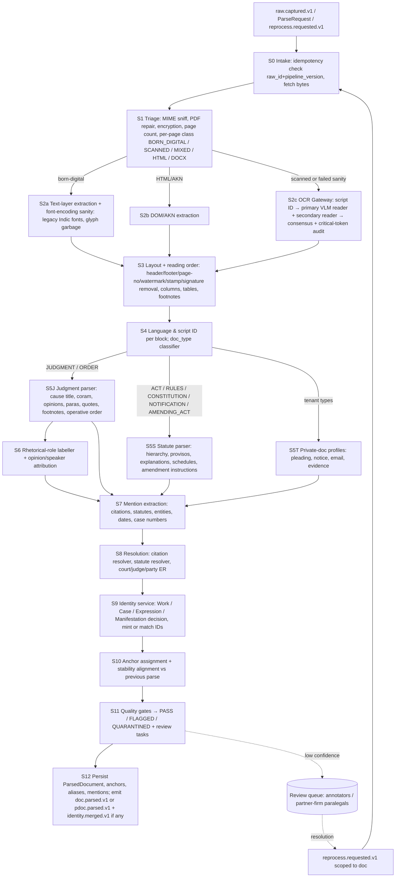

# P1 — Ingestion and Parsing: raw bytes → ParsedDocument

**Abstract.** P1 turns every immutable raw blob captured by P0 (judgments, orders, Acts, Rules, notifications, gazettes; and, in tenant-isolated mode, a firm's private case files) into a `ParsedDocument`: a verbatim, coordinate-anchored structural tree with stable `anchor_id`s, rhetorical roles, metadata, citation and statute mentions resolved to canonical IDs, and explicit quality scores. It is the only place where text is *created* in the platform, so every downstream claim ("para 45 of X holds Y") is only as trustworthy as P1's OCR, segmentation and identity resolution. The design is **deterministic-first, small-model-second, LLM-last**: grammars and layout rules do the bulk; fine-tuned small models (which still beat zero-shot LLMs on Indian rhetorical-role and legal-NER tasks [P1-22][P1-19]) label structure; LLMs only adjudicate low-confidence residuals behind schema-constrained, evaluated Model-Gateway contracts. Three safety mechanisms distinguish it from existing Indian legal databases: (1) a *dual-reader OCR consensus* that audits "critical tokens" (numbers, names, citations) because VLM OCR can hallucinate fluent but wrong text that CER hides [P1-14]; (2) an *anchor-stability protocol* so re-parsing never breaks a citation stored in a client memo; (3) an *identity service* that resolves one case cited five ways to one `work_id`, learns new aliases from parallel citations inside judgments, and makes every merge reversible. Estimated one-time backfill cost for ≈5M documents is on the order of US$8–22k of compute; human review is the dominant cost (assumptions in §5.15).

---

## 1. Purpose and scope

**Purpose.** Convert `raw.captured.v1` events into `doc.parsed.v1` events + `ParsedDocument` JSON, such that:
1. Every character shown to a lawyer is traceable to page + bbox in a specific manifestation (click-to-source).
2. Every paragraph/provision has a stable `anchor_id` (spine §C) that survives re-parsing.
3. Every citation and statute mention is extracted, parsed, and — where confidence allows — resolved to a canonical `work_id` / provision anchor.
4. Work / Case / Expression / Manifestation identity is decided once, centrally, and reversibly.
5. Quality is measured, not assumed: each document carries `quality{}` and a gate decision; low-quality outputs are quarantined rather than silently indexed.

**In scope.**
- Format triage (born-digital PDF, scanned PDF, mixed, HTML, DOCX/ODT, images, TIFF; e-mail formats in tenant mode).
- OCR (English, Hindi and the other scheduled languages; bad scans; stamps, signatures, watermarks), layout analysis, reading order, header/footer removal.
- Document-type classification (JUDGMENT, ORDER, ACT, AMENDING_ACT, RULES, REGULATIONS, NOTIFICATION, ORDINANCE, GAZETTE_ISSUE, CONSTITUTION, CIRCULAR, and tenant types PLEADING, NOTICE, EVIDENCE, CORRESPONDENCE).
- Judgment parsing: cause title / coram block, opinions (majority/concurring/dissent), paragraphs and numbering, footnotes, quoted material, operative order; rhetorical roles (facts, issues, arguments, analysis, ratio-candidate, obiter-candidate, order).
- Statute parsing: Part / Chapter / Section / Sub-section / Clause / Sub-clause / Proviso / Explanation / Illustration / Schedule / Form → spine anchors; amendment-instruction parsing; point-in-time expression construction (with P3 owning the resulting assertions).
- Metadata extraction; citation extraction & resolution; statute-mention extraction & resolution; entity resolution for courts, judges, parties, advocates; case-number / CNR normalisation.
- Anchor stability across re-parses and across manifestations.
- Tenant-isolated execution of the same pipeline for P7.

**Out of scope (owned elsewhere).** Fetching, raw dedupe by bytes, change detection (P0). Chunking, embeddings, summaries, indexes (P2). Treatment classification (followed/overruled…) and all `Assertion`s (P3) — P1 supplies *features* (citation context, cue phrases, rhetorical role of the citing paragraph) but never asserts treatment. AuthorityStatus and ripple effects (P4). The BNS↔IPC crosswalk *assertions* (P3) — P1 only captures in-text correspondence evidence ("s. 302 IPC (now s. 103 BNS)").

**Design principles.**
- **Verbatim or nothing.** P1 never paraphrases, normalises spelling, or "fixes" source text; normalised forms live in separate fields. (VLM OCR's "orthographic normalisation" and "semantic substitution" failure modes [P1-14] are exactly what a legal system cannot tolerate.)
- **Every artifact is replayable.** `pipeline_version` (component@semver + model_id + prompt_hash) on every output; raw bytes are immutable (P0), so any parse can be recomputed.
- **Confidence is a first-class field**, calibrated, per node and per mention — not a document-level afterthought.
- **Identity is centralised.** Only P1's Identity Service mints `wrk_`, `cas_`, `man_` IDs and writes `identifier_alias`.

---

## 2. Input and output contracts

### 2.1 Inputs

**(a) `raw.captured.v1` (P0 → P1)** — exactly as spine §G. P1 uses: `raw_id`, `source_id`, `source_record_key`, `url`, `http.content_type`, `storage_uri`, `source_metadata{…}` (e.g. case number, parties, judge names, date as published by the portal), `change_kind`, `prior_raw_id`, `terms_ref`.

Consumer behaviour:
| change_kind | P1 action |
|---|---|
| NEW | full parse |
| CHANGED | full parse; identity step checks whether this is a new Manifestation of the same Work, a corrigendum (`rev`), or a different Work re-using the URL |
| UNCHANGED | no-op (ack) — idempotency key = `raw_id + pipeline_version` |
| DELETED | no parse; emit nothing; record `manifestation.withdrawn_at` (removal from source does not delete law; P4 decides) |
| REAPPEARED | re-link manifestation; parse only if `raw_id` not already parsed at current pipeline_version |

**(b) `reprocess.requested.v1` (P4/P9/ops → P1)** — scope selector (e.g. `{source_id: "sci", decided_between: [...], pipeline_component: "rr-labeller<3.0"}`), reason, target `pipeline_version`. P1 re-parses from raw bytes and runs the anchor-stability protocol (§5.10) against the previous parse.

**(c) `ParseRequest` (P7 → P1-tenant, synchronous or queued, inside tenant boundary)** **[proposed interface; P7 to confirm]**
```ts
ParseRequest {
  request_id: string; tenant_id: string; matter_id: string;
  pdoc_id: "pdoc_…";            // minted by P7
  storage_uri: string;          // tenant-bucket URI, never PLC
  declared_type?: "PLEADING"|"NOTICE"|"ORDER"|"JUDGMENT_COPY"|"EVIDENCE"|"CORRESPONDENCE"|"EMAIL"|"OTHER";
  language_hint?: string;
  policy: { external_ocr_allowed: boolean; external_llm_allowed: boolean; model_allowlist: string[] };
  priority: "INTERACTIVE"|"BATCH";
}
```
Output: the same `ParsedDocument` schema with `pdoc_` IDs; private anchors `pdoc_…#p12`. No event goes to the PLC bus; P7 receives a tenant-scoped `pdoc.parsed.v1` (same payload shape as `doc.parsed.v1`, `tenant_id` set).

**(d) Reference data (read-only)**: `identifier_alias`, Work registry, Court registry, Judge registry, Statute registry (act IDs + provision anchor sets per expression), reporter grammar DB (`reporters_in.yaml`), abbreviation gazetteer. In tenant mode these are a read-only **snapshot replica** inside the tenant boundary (§5.12).

### 2.2 Output: `doc.parsed.v1` (P1 → P2, P3, P4)

Spine fields plus proposed additive fields (marked `+`):
```jsonc
{
  "id": "01J…", "type": "doc.parsed.v1", "specversion": "1.0",
  "source": "p1/parser@2.3.0", "time": "2026-09-30T10:12:03Z",
  "subject": "wrk_01J…/en", "tenant_id": null,
  "traceparent": "…", "causation_id": "<raw.captured event id>",
  "idempotency_key": "sha256:<raw>|p1@2.3.0",
  "schema_version": "1.1",
  "data": {
    "parse_id": "prs_01J…",
    "raw_ids": ["sha256:…"],
    "work_id": "wrk_01J…", "work_id_status": "RESOLVED|PROVISIONAL",   // +
    "case_id": "cas_01J…", "case_ids": ["cas_…","cas_…"],               // + batch/connected matters
    "expression_key": "en", "manifestation_id": "man_01J…",
    "doc_type": "JUDGMENT",
    "metadata": { /* ParsedDocument.metadata, abridged */ },
    "parsed_doc_uri": "s3://plc-parsed/wrk_…/en/prs_….json.zst",
    "citations": [ /* CitationMention[] (full objects, §2.3) */ ],
    "statute_mentions_count": 41,                                       // + full list in ParsedDocument
    "quality": {
      "ocr_conf": 0.97, "lang": ["en"], "structure_conf": 0.93,
      "needs_review": false,
      "gate": "PASS|FLAGGED|QUARANTINED",                               // +
      "critical_token_disagreements": 0,                                // +
      "citation_resolution_rate": 0.91                                  // +
    },
    "supersedes_parse_id": "prs_…|null",                                // +
    "anchor_changes": {"preserved": 212, "aliased": 3, "tombstoned": 0, "new": 1}, // +
    "pipeline_version": "p1@2.3.0;ocr=paddleocr-vl-0.9b@1.1;rr=rr-hier@3.1;prompt=sha256:…"
  }
}
```
Semantics: `QUARANTINED` documents are still emitted (so P4 knows they exist and P2 can offer them as "unverified text" in search) but P3 MUST NOT derive impact-tier-1 assertions from them and P5 MUST label them as low-trust.

### 2.3 Output: `ParsedDocument` (full JSON Schema, abridged to essentials)

Stored as zstd-compressed JSON at `parsed_doc_uri`; immutable per `parse_id`.
```jsonc
{
  "$schema": "https://schemas.internal/p1/parsed-document/1.1.json",
  "parse_id": "prs_…", "pipeline_version": "…", "parsed_at": "…",
  "ids": { "work_id": "wrk_…", "case_ids": ["cas_…"], "expression_key": "en",
           "manifestation_id": "man_…", "raw_ids": ["sha256:…"] },
  "doc_type": "JUDGMENT",
  "source": { "source_id": "sci", "url": "…", "terms_ref": "…", "fetched_at": "…" },
  "pages": [ { "n": 1, "width": 595, "height": 842, "rotation": 0,
               "text_source": "TEXT_LAYER|OCR|OCR_CONSENSUS",
               "ocr_engines": ["paddleocr-vl@1.1","tesseract@5.4"],
               "ocr_conf": 0.98, "script": ["Latn"], "image_uri": "s3://…/p1.webp" } ],

  "metadata": {
    "court": { "court_id": "crt_IN_SC", "name_as_printed": "IN THE SUPREME COURT OF INDIA", "bench_location": null, "conf": 0.99 },
    "jurisdiction_kind": "CIVIL_APPELLATE",          // CIVIL_APPELLATE|CRIMINAL_APPELLATE|WRIT|ORIGINAL|REVIEW|CURATIVE|REFERENCE|…
    "case_numbers": [ { "raw": "Civil Appeal No. 1234 of 2019", "case_type": "CA", "number": "1234", "year": 2019,
                        "court_id": "crt_IN_SC", "case_id": "cas_…", "is_lead": true } ],
    "cnr": null, "diary_no": "12345/2018",
    "neutral_citation": { "scheme": "NEUTRAL_INSC", "value": "2024 INSC 512" },
    "decision_date": "2024-07-12", "reserved_on": "2024-03-01", "pronounced_on": "2024-07-12",
    "coram": [ { "judge_id": "jdg_…", "name_as_printed": "Dr. Dhananjaya Y. Chandrachud, CJI", "role": "CJI|J|ACJ", "conf": 0.98 } ],
    "bench_strength": 3,
    "opinions": [ { "opinion_id": "o1", "author_judge_ids": ["jdg_…"], "kind": "MAJORITY|PLURALITY|CONCURRING|DISSENTING|PER_CURIAM|PARTLY_DISSENTING",
                    "anchor_range": ["o1.p1","o1.p96"], "conf": 0.9 } ],
    "parties": { "petitioners": [ { "name_as_printed": "State of U.P.", "entity_id": "ent_GOV_IN_UP", "kind": "STATE|UOI|PSU|COMPANY|INDIVIDUAL|OTHER", "is_sensitive": false } ],
                 "respondents": [ … ] },
    "advocates": [ { "name_as_printed": "…", "for_side": "PETITIONER|RESPONDENT|INTERVENOR|AMICUS", "designation": "Sr. Adv.|AOR|ASG|…" } ],
    "reportable": true,
    "impugned": [ { "court_id": "crt_IN_HC_ALL", "case_number_raw": "…", "decision_date": "2018-05-02", "resolved_case_id": "cas_…", "conf": 0.8 } ],
    "disposition": { "label": "ALLOWED|DISMISSED|PARTLY_ALLOWED|REMANDED|DISPOSED|WITHDRAWN|REFERRED_TO_LARGER_BENCH|OTHER", "anchor_id": "wrk_…/en#ord", "conf": 0.9 },
    "statute_areas": ["IPC","CrPC"],
    "field_provenance": { "decision_date": ["TEXT:hdr","SOURCE_METADATA:sci"], "…": [] }
  },

  "nodes": [   // pre-order structural tree; each node is an anchor
    { "anchor_id": "wrk_…/en#hdr", "node_type": "CAUSE_TITLE", "text": "…", "text_hash": "xxh3:…",
      "spans": [ { "page": 1, "bbox": [72,80,520,300], "char_range": [0,812] } ], "children": [] },
    { "anchor_id": "wrk_…/en#o1.p45", "node_type": "PARA", "number_as_printed": "45.",
      "numbering": "EXPLICIT|SYNTHETIC",
      "rhetorical_role": { "label": "RATIO_CANDIDATE", "fine": "RATIO", "dist": {"ANALYSIS":0.21,"RATIO":0.71,"…":0.08}, "conf": 0.71, "method": "rr-hier@3.1" },
      "sentences": [ { "idx": 3, "char_range": [412,590], "rr": "RATIO" } ],   // yields #o1.p45.s3
      "quotes": [ { "char_range": [100,380], "quoted_source_mention_id": "cm_…" } ],
      "lang": "en", "aux_text": { "en-x-mt": null },
      "text": "…", "text_hash": "xxh3:…", "quote_selector": { "prefix": "…32 chars", "suffix": "…32 chars" },
      "spans": [ … ], "ocr_conf": 0.99, "children": [ /* sub-paras p45.1 … */ ] }
  ],

  "citations": [ /* CitationMention[] */ ],
  "statute_mentions": [ /* StatuteMention[] */ ],
  "entities": [ { "entity_mention_id": "em_…", "type": "JUDGE|PARTY|ADVOCATE|COURT|WITNESS|ORG|GPE|DATE|AMOUNT",
                  "anchor_id": "…", "char_range": [..], "text": "…", "resolved_id": "jdg_…|ent_…|crt_…|null", "conf": 0.9 } ],
  "amendment_instructions": [ /* only for AMENDING_ACT / NOTIFICATION — §5.7 */ ],
  "alignment": { "previous_parse_id": "prs_…", "records": [ { "old": "…#u7", "new": "…#u7", "method": "HASH_EQ|SEQ_ALIGN|NUM_EQ", "confidence": 1.0 } ] },
  "quality": { "ocr_conf": 0.97, "structure_conf": 0.93, "rr_mean_conf": 0.84, "metadata_agreement": 1.0,
               "critical_token_disagreements": 0, "citation_resolution_rate": 0.91,
               "gate": "PASS", "gate_reasons": [], "review_tasks": [] },
  "security": { "injection_signals": [], "hidden_text_detected": false, "sensitive_identity_flags": [],
                "signature": { "present": true, "valid": true, "signer_cn": "…", "signed_at": "…", "covers_whole_doc": true },   // PDF digital signature (§5.2)
                "unicode_anomalies": { "bidi_controls": 0, "zero_width": 0, "mixed_script_confusables": 0 },                   // §5.2
                "active_content_stripped": ["JavaScript","EmbeddedFile"] }
}
```

**`CitationMention`** (spine §H + proposed additive fields `+`):
```jsonc
{
  "mention_id": "cm_01J…",
  "raw_text": "(1978) 1 SCC 248",
  "anchor_id": "wrk_A/en#o1.p45.s2",            // where it occurs
  "char_range": [1203, 1219],                  // + within anchor text
  "mention_kind": "FULL|SHORT|SUPRA|IBID|NAME_ONLY|NEUTRAL|CASE_NUMBER",   // +
  "parsed": { "scheme": "SCC", "year": 1978, "vol": 1, "page": 248, "court": null, "reporter_series": null },
  "pin": { "kind": "PARA|PAGE|NONE", "value": "para 56", "cited_anchor": "wrk_B/en#p56" },   // +
  "cluster_id": "cc_…",                         // + parallel citations of the same case in one string
  "antecedent_mention_id": null,                // + for SUPRA/IBID/SHORT
  "case_name_as_printed": "Maneka Gandhi v. Union of India",   // +
  "context": { "sentence_anchor": "wrk_A/en#o1.p45.s2", "rhetorical_role": "ANALYSIS",
               "speaker": "COURT|COUNSEL_PETITIONER|COUNSEL_RESPONDENT|LOWER_COURT|UNKNOWN",
               "cue_spans": [ { "text": "we are unable to agree with", "char_range": [..], "cue_class": "NEGATIVE" } ] },  // + features for P3
  "resolved_target_id": "wrk_B",
  "resolution_confidence": 0.993,
  "resolution_method": "ALIAS_EXACT|ALIAS_FUZZY|MODEL|ANTECEDENT|HUMAN",   // +
  "candidates": [ { "target_id": "wrk_B", "score": 0.993 }, { "target_id": "wrk_C", "score": 0.004 } ],
  "temporal_check": "OK|CITED_AFTER_CITING|UNKNOWN"   // + resolved work must pre-date citing work
}
```

**`StatuteMention`**:
```jsonc
{
  "mention_id": "sm_…", "anchor_id": "wrk_A/en#o1.p12.s1", "char_range": [..],
  "raw_text": "u/s 302/34 IPC",
  "act": { "raw": "IPC", "act_work_id": "wrk_IPC", "conf": 0.99 },
  "provisions": [ { "raw": "302", "anchor": "sec-302" }, { "raw": "34", "anchor": "sec-34" } ],
  "as_cited_date": "2019-03-04",            // default = decision date of citing document; P3/P5 may override
  "resolved_anchor_ids": ["wrk_IPC#sec-302@2019-03-04", "wrk_IPC#sec-34@2019-03-04"],
  "correspondence_hint": { "other_mention_id": "sm_…", "phrase": "now Section 103 BNS" },  // evidence for P3 CORRESPONDS_TO
  "context": { "rhetorical_role": "FACTS", "speaker": "COURT" },
  "conf": 0.97
}
```

**`AmendmentInstruction`** (new, for AMENDING_ACT / NOTIFICATION / ORDINANCE):
```jsonc
{
  "instr_id": "ai_…", "anchor_id": "wrk_AmendAct2018/en#sec-2",
  "target": { "act_work_id": "wrk_…", "provision_anchor": "sec-5.1.a", "conf": 0.98 },
  "op": "SUBSTITUTE|INSERT|OMIT|RENUMBER|COMMENCE|REPEAL|SAVE",
  "old_text": "ten thousand rupees", "new_text": "one lakh rupees",
  "position": { "after": "sec-5.1", "before": null, "words_anchor": "for the words" },
  "effective": { "kind": "ON_ENACTMENT|NOTIFIED_DATE|RETRO|FIXED_DATE", "date": "2018-08-01", "evidence_anchor": "…" },
  "parse_method": "GRAMMAR|LLM", "conf": 0.95, "verification": "ROUNDTRIP_OK|ROUNDTRIP_FAIL|UNVERIFIED"
}
```

### 2.4 Output: relational records (PostgreSQL system of record)

```sql
-- Identity (P1 is sole writer; P3/P9 may *propose* via review tasks)
CREATE TABLE work        (work_id text PRIMARY KEY, work_type text, status text /*ACTIVE|PROVISIONAL|STUB|MERGED*/,
                          merged_into text, court_id text, decision_date date, title text, created_at timestamptz);
CREATE TABLE legal_case  (case_id text PRIMARY KEY, court_id text, case_type text, number text, year int,
                          cnr text UNIQUE, diary_no text, status text, merged_into text);
CREATE TABLE work_case   (work_id text, case_id text, role text /*LEAD|CONNECTED|TAGGED*/, PRIMARY KEY(work_id, case_id));
CREATE TABLE expression  (work_id text, expression_key text, lang text, rev int, valid_from date, valid_to date,
                          authoritative bool, derived bool, verification text,
                          translation_of text /* expression_key of the original, e.g. 'hi' */,
                          authority_basis text /* ORIGINAL|OLA_S7_HC_TRANSLATION|COURT_PUBLISHED_TRANSLATION|OFFICIAL_CONSOLIDATION|RECONSTRUCTED */,
                          PRIMARY KEY(work_id, expression_key));
CREATE TABLE manifestation (manifestation_id text PRIMARY KEY, work_id text, expression_key text,
                          source_id text, url text, raw_ids text[], first_seen timestamptz, withdrawn_at timestamptz);
CREATE TABLE identifier_alias (scheme text, value_normalized text, target_id text, confidence real, source text,
                          first_seen timestamptz, status text /*PENDING|ACTIVE|CONFLICT|RETIRED*/, evidence jsonb /* citing doc ids, courts, counts */,
                          PRIMARY KEY (scheme, value_normalized, target_id));
CREATE UNIQUE INDEX alias_active_unique ON identifier_alias(scheme, value_normalized) WHERE status='ACTIVE';

-- Anchors (text itself lives in ParsedDocument; row holds hashes + coordinates)
CREATE TABLE anchor (anchor_id text PRIMARY KEY, work_id text, expression_key text, fragment text, node_type text,
                     text_hash text, quote_prefix text, quote_suffix text, page int, bbox real[4],
                     first_parse_id text, last_parse_id text, state text /*LIVE|TOMBSTONED*/, forward_to text)
  PARTITION BY HASH (work_id);
CREATE TABLE anchor_alias (old_anchor text, new_anchor text, method text, confidence real, parse_id text,
                           recorded_at timestamptz, PRIMARY KEY(old_anchor, new_anchor));

CREATE TABLE parse_run (parse_id text PRIMARY KEY, raw_ids text[], work_id text, expression_key text,
                        pipeline_version text, gate text, started_at timestamptz, finished_at timestamptz,
                        supersedes text, cost_usd numeric(10,5));
CREATE TABLE citation_mention (mention_id text PRIMARY KEY, citing_work_id text, anchor_id text, scheme text,
                        normalized text, resolved_target_id text, conf real, parse_id text, status text);
CREATE TABLE review_task (task_id text PRIMARY KEY, kind text, subject_id text, priority real, payload jsonb,
                          state text, assigned_to text, resolution jsonb, created_at timestamptz);
```

### 2.5 Proposed spine changes

| # | Target | Change | Justification |
|---|---|---|---|
| S1 | §C anchor grammar | Optional opinion prefix: `o{n}.` (e.g. `#o2.p14`). Fragments without prefix mean `o1`. | Multi-opinion judgments (majority/concurring/dissent) routinely restart paragraph numbering per opinion *(observed pattern; to be measured on corpus — unverified)*, so `p14` is ambiguous. Dissent text is not ratio; P3/P5 must know which opinion a paragraph belongs to. |
| S2 | §C anchor grammar | Fallback anchors `pg{n}` and `pg{n}.l{m}` (page / OCR line) for documents whose structure could not be recovered (QUARANTINED). | Otherwise such documents cannot be cited at all; a coarse but honest anchor beats none. Never used when paragraph anchors exist. |
| S3 | §B Expression | Machine translations are **not** Expressions; they are `aux_text["{lang}-x-mt"]` on nodes (BCP-47 private-use tag), `authoritative=false`. | Keeps anchors on the authoritative text (Hindi original) while letting P2/P5 search in English; prevents a claim from "quoting" a machine translation as if it were the court's words. |
| S4 | §G events | New event `identity.merged.v1` (P1 → P2, P3, P4, P7): `{kind: WORK|CASE|ALIAS, from_id, to_id, reason, confidence, reversible_until}` and its inverse `identity.split.v1`. | Provisional works and duplicate detection make merges inevitable; TPL stores PLC IDs, so tenants' memos must be re-pointed. Without an event, merges silently orphan references. |
| S5 | §G `doc.parsed.v1` | Add `quality.gate`, `work_id_status`, `case_ids[]`, `supersedes_parse_id`, `anchor_changes{}`. | P3/P4 need to know whether to trust, whether this replaces an earlier parse, and whether any anchor used downstream moved. |
| S6 | §H CitationMention | Add `mention_kind`, `char_range`, `pin{}`, `cluster_id`, `antecedent_mention_id`, `case_name_as_printed`, `context{rhetorical_role, speaker, cue_spans}`, `resolution_method`, `temporal_check`. | P3 treatment classification needs speaker (counsel vs court) and cue features; parallel-citation clusters feed alias learning; pinpoints feed `cited_anchor`. All additive. |
| S7 | §H ParsedDocument | Add `metadata.opinions[]`, `amendment_instructions[]`, `security{}`, `pages[].text_source`. | Opinion structure (S1) and amendment instructions (for statute point-in-time, consumed by P3/P4) have no home in the spine today. |
| S8 | §D / §H IDs | Registries with spine-level IDs: `crt_…` (courts & benches, e.g. `crt_IN_HC_ALL_LKO`), `jdg_…` (judges), `ent_…` (recurring parties e.g. Union of India, States, PSUs). | `ResearchQuery.forum.court_id` and authority ranking depend on a canonical court ID; judge IDs are needed for bench-strength and watchlists (P10). |
| S9 | §C statutes | Statute expressions reconstructed by P1 carry `derived=true, verification=ROUNDTRIP_OK|UNVERIFIED`; only official consolidated text or ROUNDTRIP_OK expressions may back impact-tier-1 claims. | LLM statute consolidation reaches only 50.3% exact match single-step and 20.5% multi-step [P1-33]; reconstructed versions must be distinguishable. |
| S10 | §G events / §H | New tenant-scoped event `pdoc.parsed.v1` (P1-tenant → P7 only; same `data` shape as `doc.parsed.v1` with `pdoc_id` in place of `work_id`, `tenant_id` non-null, never published on the PLC bus) and new synchronous object `ParseRequest` (§2.1c). | *Added in independent review:* §2.1(c) already used both, but neither appears in the spine event table — a silent divergence. P7 must be able to subscribe to a named, versioned contract. |
| S11 | §H ParsedDocument node shape | Spine node `{anchor_id, node_type, rhetorical_role?, text, page, bbox, children}` becomes `{…, spans:[{page, bbox, char_range}], rhetorical_role:{label, fine, dist, conf, method}, numbering, number_as_printed, sentences[], quotes[], lang, aux_text{}}`. `page`/`bbox` remain derivable as `spans[0]`. `quality.lang` becomes an array (mixed-language documents). | *Added in independent review:* paragraphs routinely span pages (one bbox cannot express that), and P3/P5 need the RR distribution, not just a label. The spine's anchor row (§C "page + bbox") is kept as the first span. |
| S12 | §C fragment grammar | Register the extra fragments P1 emits: `ill-{x}` (statute Illustration), `p12.a` (lettered sub-para), `p12.u1` (unnumbered continuation), `p45.x1` (split successor, §5.10), `pg{n}`/`pg{n}.l{m}` (S2), `att{n}/…` (tenant attachments, §5.12). | *Added in independent review:* all were used in §5 without being proposed; downstream anchor parsers (P2/P5/P8/P10) would reject them. |
| S13 | §D `identifier_alias.status` | Add `PENDING` (harvested, below activation threshold) to `status`, and an `evidence jsonb` column. | *Added in independent review:* §5.9 alias learning needs a non-resolvable holding state; spine lists no status values. |
| S14 | §B Expression attributes | Add `authoritative`, `translation_of`, `authority_basis`, `derived`, `verification` to Expression. | *Added in independent review:* under s. 7 Official Languages Act 1963 a HC's Hindi/regional judgment and its HC-issued English translation are both official [P1-46], whereas SC vernacular translations are not the judgment of record [P1-28]; P5/P8 must know which text may be quoted as "the court said". |
| S15 | §H ParsedDocument `security{}` | Add `signature{present, valid, signer_cn, signed_at, covers_whole_doc}`, `unicode_anomalies{}`, `active_content_stripped[]`. | *Added in independent review:* provenance of court-issued PDFs (digitally signed) is the cheapest defence against forged or altered "judgments" entering via mirrors or tenant uploads (§8.13). |

---

## 3. State-of-the-art survey (with citations)

### 3.1 OCR and document parsing (2024–2026)

The field moved from pipeline OCR (detector + recogniser + layout model) to **OCR-specialised vision-language models (VLMs)** that emit Markdown/structured text for a whole page.

| System | Type / size / licence | Reported quality | Indic relevance | Cost signal |
|---|---|---|---|---|
| olmOCR (AllenAI), v0.4.0 Oct 2025 | 7B, Qwen2.5-VL base, FP8, Apache-2.0 [P1-1] | 82.4 ± 1.1 olmOCR-Bench [P1-1] | **English-only** training filter [P1-1] | < US$200 per million pages self-hosted [P1-1] |
| PaddleOCR-VL | 0.9B VLM (NaViT-style encoder + ERNIE-4.5-0.3B), open, "109 languages" [P1-4] | 80.0 olmOCR-Bench (as reported in [P1-41]); PaddleOCR-VL **1.6** scores 96.01 on OmniDocBench v1.6 vs Sarvam Vision 2.1 94.97 and GLM-OCR 94.71 (competitor-reported by Sarvam [P1-9]) | Multilingual; *per-script Indic accuracy not reported in abstract — must benchmark* | Small model → cheap GPU inference (unmeasured) |
| MinerU 2.5 | decoupled VLM [P1-5] | 77.5 olmOCR-Bench (as reported in [P1-41]) | unknown | open |
| dots.ocr | single VLM layout+OCR [P1-6] | 79.1 olmOCR-Bench (as reported in [P1-41]) | multilingual claim | open |
| Surya (Datalab) | 650M VLM; OCR + layout + reading order + tables [P1-7] | 83.3 olmOCR-Bench; 87.2% pass rate on an *internal* 91-language benchmark (38 languages ≥ 90%, 76 ≥ 80%) [P1-7] | Yes | Code Apache-2.0 but **weights under modified AI Pubs OpenRAIL-M: free only for research, personal use and startups under US$5M funding/revenue; otherwise a commercial licence** [P1-7]; ~5 pages/s on RTX 5090 (vLLM, 128 concurrency) [P1-7] |
| Marker / Mistral OCR / Docling | pipeline or API | Marker 76.1, MinerU 75.2, Mistral OCR (2025 API) 72.0 on olmOCR-Bench (as reported in [P1-40]); Mistral OCR 4 (Jun 2026) self-reports 85.20 olmOCR-Bench / 93.07 OmniDocBench [P1-13] | Mistral OCR (2025) reported Hindi in its vendor benchmark; OCR 4 claims 170 languages — **no Indic court-document evaluation** [P1-13] | Mistral OCR (2025): ~1,000 pages/US$, ~2× with batch; OCR 4: US$4/1k pages, US$2/1k batch, single-container self-hosting offered [P1-13] |
| Chitrapathak-2 (Krutrim) | VLM fine-tuned OCR for 10 Indic languages + English (hi, sa, bn, mr, ta, te, kn, ml, pa, or) [P1-8] | char-level ANLS distance (**lower is better**): Telugu 6.69 (SOTA), Hindi 8.36 vs Gemini-2.5-Flash 5.88 (i.e. Gemini better on Hindi); Surya 16.85 on Telugu [P1-8] | Built for India | 3–6× faster than v1; ≈3.1 s/doc English, 6.6 s Hindi, ≈14.3 s other Indic [P1-8] |
| Sarvam Vision 2.1 (24 Sept 2026) | Indic document VLM, APIs "Digitize"/"Extract" [P1-9] | 87.3 olmOCR-Bench; 87.39% on Sarvam's Indic OCR benchmark (6,909 samples: 6,609 across 22 languages + 300 English; material 1800–present) vs Bodhan Indic-OCR 84.94%, Gemini 3.6 Flash 79.35%, Google Cloud Vision 71.76% [P1-9] | Strongest published Indic claim; **vendor-run benchmark** | price & on-prem not disclosed [P1-9] |
| Google Document AI Enterprise OCR | cloud API | — | Supports hi, gu, kn, ml, ta, te among 200+ languages [P1-11] | US$1.50 / 1k pages (≤5M pages/month); Layout Parser US$10 / 1k [P1-11] |
| AWS Textract | cloud API | — | **Only English, Spanish, German, Italian, French, Portuguese** [P1-12] | — |
| Tesseract / classical | CPU | Zero-shot Tamil: Document AI best (CER 0.78%); Sinhala: Surya best [P1-16] | Yes (tessdata) | ~free, CPU |

Benchmarks: OmniDocBench (CVPR 2025; 9 document sources, 19 layout categories, composite of text edit distance, table TEDS and formula CDM) [P1-3]; a third-party v1.5 leaderboard shows GLM-OCR 94.62 on top (page updated May 2026) [P1-42], while on v1.6 PaddleOCR-VL 1.6 reports 96.01 [P1-9] — scores are not comparable across benchmark versions, another reason to rely on our own benchmark. olmOCR-Bench is unit-test style and English-centric [P1-1]. Neither covers Indian court documents; the only large Indic benchmark is vendor-built [P1-9].

**Hallucination is the critical caveat.** On degraded historical documents, VLM OCR achieves better CER/WER than classical OCR but exhibits *orthographic normalisation, spurious content generation, and fluent semantic substitutions*, and "errors affecting named entities … can introduce substantial semantic distortions with minimal impact on CER and WER" [P1-14]. MLLMs "over-rely on linguistic priors" under blur/low contrast and hallucinate when a precise answer is not feasible [P1-15]. For law, a substituted digit in "(1978) 1 SCC 248" or a changed party name is worse than a visible OCR failure. → Our dual-reader consensus and critical-token audit (§5.3).

**Production Indic lesson** (Krutrim): fine-tuning an OCR-specialised model beats training a generic VLM end-to-end for Indic OCR on accuracy-latency; tokenizer efficiency dominates latency; making the Parichay-2 key-field extractor vLLM-compatible gave ≈4× lower latency (4.10 s → 1.03 s/doc); constrained domain extraction is faster and more predictable [P1-8].

### 3.2 Rhetorical roles / structural segmentation of Indian judgments

| Work | Data | Labels | Best model / score |
|---|---|---|---|
| Bhattacharya et al., JURIX 2019 [P1-21] | SC judgments | 7 | Hierarchical BiLSTM-CRF *(unverified details)* |
| Kalamkar et al., LREC 2022 (OpenNyAI) [P1-17] | expert-annotated Indian judgments | 13 | baselines; RR improves summarisation & judgment prediction [P1-17] |
| Malik et al., NLLP@EMNLP 2022 [P1-20] | new expert corpus | 13 | Multi-task model with label-shift auxiliary task; domain-transfer & distillation studied |
| SemEval-2023 Task 6 LegalEval [P1-18] | 265 docs, 26,304 sentences (≈70/10/20 split) | Preamble, Facts, Ruling by Lower Court, Issues, Argument by Petitioner, Argument by Respondent, Analysis, Statute, Precedent Relied, Precedent Not Relied, Ratio of the decision, Ruling by Present Court, None | best ≈86 micro-F1 (AntContentTech, LegalBERT+BiLSTM+CRF with domain-adaptive pre-training) vs 79 baseline (SciBERT-HSLN) [P1-18] |
| IL-TUR, ACL 2024 [P1-22] | benchmark (8 tasks) | RR | MTL-BERT 69.01 macro-F1; **GPT-4 zero-shot 37.37**, GPT-3.5 30.95 [P1-22] |
| LegalSeg, NAACL Findings 2025 [P1-19] | >7,000 docs, 1.4M sentences (from Indian Kanoon) | 7: Facts, Issues, Arg-Petitioner, Arg-Respondent, Reasoning, Decision, None | Hier. BiLSTM-CRF macro-F1 0.77; ToInLegalBERT 0.62; GNN 0.54; RhetoricLLaMA 0.09 [P1-19]; hardest confusions Facts↔Reasoning and Petitioner↔Respondent arguments; rare labels (Issue, Decision) weakest [P1-19] |
| InLegalBERT, ICAIL 2023 [P1-24] | Indian legal pre-training | encoder | improves statute identification, segmentation, judgment prediction [P1-24] |
| OpenNyAI library [P1-25] | — | NER + RR + extractive summariser, MIT licence, spaCy/CPU-or-GPU | usable baseline |

Takeaways: (i) **sequence context matters** — hierarchical models over sentence sequences beat sentence-only classifiers [P1-19]; (ii) **fine-tuned small models beat zero-shot LLMs** on Indian RR and NER by wide margins in published evaluations [P1-22][P1-19] — though those LLM numbers are from 2023–24-generation models and must be re-benchmarked against 2026 models before being taken as permanent; (iii) **no public dataset labels obiter dicta separately**; ratio is labelled only in the 13-role scheme, and ratio identification is explicitly an open research problem in India [P1-44]; (iv) datasets are small (265 docs for LegalEval) or single-source (LegalSeg from Indian Kanoon), so cross-court robustness is unproven [P1-18][P1-19].

### 3.3 Legal NER and metadata

InLegalNER (Kalamkar et al., NLLP 2022): 46,545 entities, 14 types — COURT, PETITIONER, RESPONDENT, JUDGE, LAWYER, DATE, ORG, GPE, STATUTE, PROVISION, PRECEDENT, CASE_NUMBER, WITNESS, OTHER_PERSON; RoBERTa-base + transition-based parser, F1 91.1 [P1-23]. On IL-TUR's L-NER, InLegalBERT+CRF scores 48.58 strict macro-F1 vs GPT-4 zero-shot 13.65 [P1-22]. The gap between 91 (in-distribution, lenient) and 48.6 (strict macro) shows that rare entity types and strict boundaries remain hard — relevant because our citation spans must be exact.

### 3.4 Citation extraction and resolution

- **eyecite** (Free Law Project; used on CourtListener and the Caselaw Access Project): regex templates generated from `reporters_db` (built from >55M citations); Aho-Corasick prefilter by default, optional Hyperscan tokenizer compiling all regexes into one pass; citation classes FullCase, FullLaw, ShortCase, Supra, Id, Reference; BSD-2-Clause licence; `resolve_citations()` clusters short/supra/id to antecedents; `annotate_citations()` uses diffing to insert markup into original text [P1-26][P1-27]. It is US-reporter-centric; its *architecture* (data-driven reporter DB + fast tokenizer + antecedent resolution + span-preserving annotation) is what we reuse.
- **Indian formats.** SC neutral citation `YYYY INSC N` (e.g. `2023 INSC 1`), announced Feb 2023 for all judgments from 1 Jan 2023, with the CJI stating the Court would then go back "till 2014 and then from 1950 to 2014" [P1-28] — so **pre-2023 years (down to 1950) must be accepted by the grammar**. HC neutral citations are court-specific: Delhi announced `YEAR/DHC/AUTO GENERATED NUMBER` w.e.f. 17 Oct 2022 [P1-29] (printed judgments are commonly seen with colons, `2023:DHC:1234`, and a `-DB` suffix for division benches *(observed practice; unverified)*); Madras `Year/MHC/number` w.e.f. 1 Jan 2023, slash-separated [P1-30]. That Kerala HC also has one is *(unverified — not supported by [P1-29])*. **Separators therefore vary (`/` vs `:`) and the grammar must accept both.** The full list of HC codes and bench suffixes (e.g. principal seat vs. benches) is treated as configuration data populated from each HC's notification. The SC publishes an *Equivalent Citation Table* mapping SCR to SCC, AIR(SC), JT and SCALE [P1-31] — a seed for parallel-citation aliases.
- Commercial/private reporters (SCC, SCC OnLine, AIR, Cri LJ, ITR, Taxmann, MANU…) each use their own format; citations are facts, but headnotes and reporter pagination text are copyrighted (spine §D). We store citation strings and page numbers only.

### 3.5 Statute structure, Akoma Ntoso and consolidation

- **Nyaykosh (NeGD, "Law as Code")** publishes Indian laws as LegalDocML/Akoma Ntoso XML plus versioned REST APIs, no registration; coverage currently "217+ provisions" (e.g. DPDP Act 2023, Aadhaar Act, IT Act) and growing [P1-34]. Nyaaya previously captured Indian laws in Akoma Ntoso using the Indigo editor (OpenUp/Laws.Africa) and noted that marginal notes and amendment footnotes make point-in-time publishing hard [P1-35].
- **Automatic consolidation**: a LoRA-tuned small generative model applied amendments to French legislation with >63% success on a difficult bill [P1-32]; on German law, LLM consolidation gave 93–99% textual similarity yet only **50.3% exact match (single-step) and 20.51% (multi-step)**, and experts found legally significant errors — outputs "must be treated as drafts subject to rigorous human verification" [P1-33].

### 3.6 Translation and Indic processing

IndicTrans2 covers all 22 scheduled languages, MIT-licensed code and models, trained on the ≈230M-pair BPCC corpus [P1-37]; it enables *translate-for-analysis* (run English-trained RR/NER on a Hindi judgment's translation) while anchors stay on the original.

**Which language version is authoritative is an India-specific legal fact P1 must encode, not guess:**
- *High Courts*: under s. 7 of the Official Languages Act, 1963, a Governor may (with the President's consent) authorise Hindi or the State's official language for HC judgments, decrees and orders, and any such non-English judgment "shall be accompanied by a translation of the same in the English language issued under the authority of the High Court" [P1-46]. Both are official: the original-language text is the primary Expression and the HC-issued English translation is a second *official* Expression (`authoritative=true`, `translation_of=<original>`).
- *Supreme Court*: the SC announced machine-assisted translation of its judgments into Indian languages, vetted by retired District Judges [P1-28]. These are published translations, not the judgment of record; they become `hi`/`ta`… Expressions with `authoritative=false` *(the SC's own disclaimer wording that the English version is authentic is from practitioner knowledge — unverified in this review; P0 to capture the disclaimer text per document)*.
- *District courts / tribunals* may write entirely in the regional language with no official English version; only machine translation (`aux_text`, spine change S3) is then available.

### 3.7 Why this matters: grounding failures downstream

The Stanford RegLab study found leading legal research AI tools (Lexis+ AI, Westlaw AI-Assisted Research, Ask Practical Law AI) hallucinate in 17–33% of queries despite RAG [P1-38]. A share of such failures is *mis-grounding* — a real source cited for a proposition it does not support. Parsing errors (wrong paragraph boundaries, counsel's argument mislabelled as the court's holding, a dissent treated as majority) manufacture exactly this failure mode, so P1 accuracy is a hallucination-control lever, not just an ingestion concern.

---

## 4. Mistakes others made and how we avoid them

| System/paper | What went wrong | Evidence | How we avoid it |
|---|---|---|---|
| VLM OCR systems on degraded documents | Fluent hallucinations: normalised spelling, invented content, meaning-changing substitutions, especially in named entities; hidden by good CER | [P1-14][P1-15] | Dual-reader consensus + critical-token audit (numbers, citations, names, dates); line-level bbox grounding; never accept VLM text without a second reader on low-quality pages (§5.3) |
| olmOCR as a drop-in for Indian corpora | Trained/filtered on English PDFs only | [P1-1] | Per-script engine routing; English VLM only for Latin-script pages |
| AWS-centric stacks | Textract does not support Indic scripts | [P1-12] | OCR Gateway with India-capable engines; Textract excluded |
| Benchmarks-driven OCR choice | Public leaderboards (OmniDocBench, olmOCR-Bench) contain no Indian court pages; the only big Indic benchmark is vendor-run | [P1-3][P1-1][P1-9] | Build **IC-OCR-Bench** (≈2,000 Indian court/gazette pages stratified by court, script, scan quality) with critical-token metrics; re-run on every engine change |
| Zero-shot LLM structure labelling | GPT-4 zero-shot RR 37.4 vs 69.0 fine-tuned; L-NER 13.7 vs 48.6; RhetoricLLaMA 0.09 macro-F1 | [P1-22][P1-19] | Fine-tuned hierarchical sequence model as primary; LLM only as adjudicator on low-margin spans and as annotation assistant; re-benchmark each model generation |
| Sentence-only RR classifiers | Lose document context; Facts↔Reasoning confusion | [P1-19] | Hierarchical model over sentence sequence + CRF + positional & layout features + paragraph-level smoothing |
| RR datasets treated as ground truth for "ratio" | No obiter label; ratio identification unresolved even for experts | [P1-18][P1-44] | Emit `RATIO_CANDIDATE`/`OBITER_CANDIDATE` with calibrated probability; P3 promotes to Proposition only with HITL for tier-1; UI never says "the ratio is…" from P1 alone |
| Single-source training data (LegalSeg from Indian Kanoon) | Unknown robustness to raw court PDFs (headers, stamps, OCR noise) | [P1-19] | Train/evaluate on text as *we* extract it (post-OCR), stratified by court; per-court calibration |
| Naive citators (general pattern) | Counting a citation made by counsel, or in a dissent, as the court's reliance | LegalEval distinguishes "Precedent Relied" vs "Not Relied" and arguments vs analysis [P1-18] | CitationMention.context carries `speaker`, `rhetorical_role`, opinion kind; P3 uses them as features |
| US-centric citation parsers (eyecite) | Reporter DB lacks Indian reporters; "supra"-by-party-name style common in Indian judgments not handled | [P1-27] | Reuse architecture, build `reporters_in.yaml`, add NAME_ONLY and `(supra)` resolution by party-name antecedents |
| LLM statute consolidation | Only 50.3% / 20.5% exact match; legally significant small errors | [P1-33] | Consolidated official text is the anchor; amendment chains reconstructed deterministically and verified by round-trip; reconstructed versions flagged `derived`; HITL for tier-1 Acts |
| Nyaaya-style manual AKN capture | Accurate but slow; coverage limited (Nyaykosh at 217+ provisions) | [P1-34][P1-35] | Use AKN sources where present (highest trust); automate the rest; export AKN for interoperability |
| Legal AI tools with RAG | 17–33% hallucination, incl. mis-grounded citations | [P1-38] | Sentence-level anchors with bbox; explicit opinion/speaker metadata so P8 can verify "the court held" vs "counsel argued" |
| Commercial OCR model licences | Surya weights restricted for commercial use above small-startup thresholds | [P1-7] | Default to Apache-licensed engines; commercial licences only via explicit procurement |

---
## 5. Recommended design, in detail

### 5.1 Pipeline DAG



Each stage is an **idempotent activity** keyed by `(raw_id, stage, stage_version)`; intermediate artifacts (page images, OCR line JSON, layout JSON) are cached in object storage under that key so a re-run of a later stage (e.g. new RR model) does not redo OCR. The durable-workflow engine is chosen by P0/P4; P1 requires only: per-activity retries with backoff, heartbeats for long OCR jobs, per-queue concurrency limits, and priority lanes.

**Priority lanes.** `L0-urgent` (SC and HC larger-bench judgments, any doc flagged by P0 as a new decision on a watch-listed matter), `L1-daily` (all other new documents), `L2-backfill`, `L3-reprocess`. Separate GPU pools for L0/L1 and L2/L3 so a backfill never delays "overruled yesterday" (§8).

**S0.5 header peek (lane promotion) — added in independent review.** P0 cannot know bench strength or treatment before parsing, so a lane decided only from `source_metadata` would leave a 5-judge overruling decision in `L1`. Every NEW/CHANGED raw doc from a SC/HC source first gets a ≤ 2 s CPU peek: text layer of pages 1–2 (or the first 1,500 OCR'd characters if scanned, using the cheap secondary reader) plus a Hyperscan pass over the full text layer if one exists. Promote to `L0` if any of: (a) coram grammar (§5.5) finds ≥ 3 judges; (b) any cue from the negative-treatment lexicon ("overrule", "overruled", "per incuriam", "not good law", "stands overruled", "refer the matter to a larger bench", "reference answered") appears in the born-digital text layer; (c) `REPORTABLE` appears on page 1; (d) a case number matches a P7 watch-list key (count-only Bloom filter replicated from tenants via the Privacy Gate; no tenant identity crosses). The peek is advisory — the full parse re-derives everything — and its precision/recall against the final parse is a tracked metric (§9).

### 5.2 S1–S2a: triage and text-layer validation

1. **MIME & repair**: sniff by magic bytes (not the HTTP content-type); repair broken xref tables (qpdf); detect encryption (owner-password PDFs are decrypted where permitted for reading; user-password → `QUARANTINED:ENCRYPTED`).
2. **Per-page classification**: a page is BORN_DIGITAL if it has a text layer covering ≥ 80% of the visually detected text area (render at 100 dpi, run a cheap text-detector, compare boxes). Mixed documents (typed judgment + scanned annexure, or a scanned page carrying a digital signature stamp) are handled page-by-page.
3. **Text-layer sanity** (the most under-appreciated failure in Indian government PDFs): Devanagari and other Indic text is often typeset in legacy non-Unicode fonts whose text layer is Latin gibberish *(widely reported practitioner issue; unverified in this session — to be quantified on the corpus)*. Checks per page: (a) script consistency — rendered-image script ID vs text-layer Unicode blocks; (b) dictionary-hit rate per detected language (< 0.6 → fail); (c) character-bigram perplexity under a per-script LM; (d) ratio of private-use-area code points. Failing pages are either converted by a font-specific legacy→Unicode mapper (if the font name is in a known table) or routed to OCR.
4. **Hidden-text check** (security): compare text layer with OCR of the rendered page on a sample (all pages for tenant uploads); tokens present in the text layer but invisible in the render (white text, zero-size fonts, off-page text) → `security.hidden_text_detected=true`, hidden text dropped from `text`, retained in a quarantined side-channel for forensic review. Defends against prompt injection planted in documents (§8.6).
5. **Unicode hygiene** *(added in independent review)*: every extracted string is checked for bidi control characters (U+202A–202E, U+2066–2069), zero-width characters (U+200B–200D, U+2060, U+FEFF) and mixed-script confusables inside a single token (e.g. Cyrillic `а` inside `SCC`, per Unicode confusables data). Counts go to `security.unicode_anomalies`. `text` stays verbatim (principle *verbatim or nothing*), but every *matching* surface (citation grammar, critical-token audit, alias keys) runs on an NFKC + confusable-skeleton + control-stripped view with an offset map, so an invisible character cannot hide a citation from the grammar or forge a near-duplicate alias key. Note ZWJ/ZWNJ (U+200C/U+200D) are legitimate in Devanagari and other Indic scripts, so they are stripped only for matching, never flagged as anomalies when between Indic letters.
6. **Active content & parser hardening**: PDF JavaScript, launch actions, embedded files and XFA forms are stripped before rendering (recorded in `security.active_content_stripped`); XML inputs (Akoma Ntoso, DOCX/ODT) are parsed with external entities and DTD loading disabled (XXE/billion-laughs); archive members (.zip, .msg attachments) are bounded by count, depth (≤ 3) and expanded size (≤ 50× compressed, ≤ 2 GB).
7. **Digital-signature provenance**: many court-issued PDFs carry a PAdES/PKCS#7 signature (the "Signature Not Verified" box in viewers is the visible residue). Verify the signature, record signer CN, time and whether the signed byte range covers the whole file into `security.signature`. A document from a mirror/aggregator or a tenant upload claiming to be a court judgment whose signature is invalid, or whose signed range excludes later-appended pages, is FLAGGED and cannot back tier-1 assertions until matched against an official-source manifestation. Absence of a signature is normal for older judgments and is *not* a failure.

### 5.3 S2c: OCR Gateway, dual-reader consensus and critical-token audit

**OCR Gateway contract** (model-agnostic; every engine is an adapter):
```ts
ocr.page.v1 request  { page_image_uri, dpi, script_hint[], lang_hint[], mode: "LINES"|"MARKDOWN", policy{external_allowed} }
ocr.page.v1 response { engine, engine_version, lines:[{text, bbox, conf, script}], blocks?:[{type, bbox, line_idx[]}], reading_order?:[], latency_ms, cost_usd }
```
**Routing (default config, to be re-decided by IC-OCR-Bench results):**
| Page class | Primary reader | Secondary reader | Fallback (PLC only) |
|---|---|---|---|
| Latin script, good scan | self-hosted OCR-VLM (PaddleOCR-VL-class, Apache licence) | classical line OCR (Tesseract 5 / PP-OCR) | Google Document AI Enterprise OCR |
| Devanagari / other Indic | Indic-capable VLM (PaddleOCR-VL-class or licensed Indic model, e.g. Chitrapathak/Sarvam if on-prem terms acceptable) | Tesseract Indic model for that script | Google Document AI (hi, gu, kn, ml, ta, te supported [P1-11]) or Sarvam API [P1-9] |
| Poor scan (blur/skew/low contrast score below threshold) | pre-process (deskew, dewarp, binarise, super-resolve) then both readers | — | commercial API, then human transcription queue for L0 docs |
| Handwritten (tenant notes, some orders) | commercial Indic-handwriting capable API if policy allows [P1-9][P1-11] | — | human |

**Consensus algorithm** (per page):
```
lines_P = primary.lines ; lines_S = secondary.lines
align lines by bbox IoU (≥0.5) then by edit distance within the aligned pair
for each aligned pair (p, s):
    d = char_edit_distance(normalize_ws(p.text), normalize_ws(s.text)) / max(len)
    crit_p = critical_tokens(p.text)   # digits, dates, citation-grammar hits, section numbers, capitalised name spans, currency
    crit_s = critical_tokens(s.text)
    crit_disagree = symmetric_difference(crit_p, crit_s) after digit/script normalisation
    if d <= 0.02 and not crit_disagree: accept p (VLM output usually better formatted)
    elif crit_disagree: 
         re-read the line crop at 2x resolution with a third reader (or primary with a "verbatim line" prompt)
         majority vote on each critical token; if no majority → mark token UNCERTAIN, line.conf = min(...)
    else: accept p, line.conf *= (1 - d)
primary lines with no secondary counterpart (possible hallucination) → keep only if a text-detector box exists at that bbox; else drop and log "spurious_content"
secondary lines with no primary counterpart (possible omission) → insert s, flag "primary_omission"
page.critical_token_disagreements = count of UNCERTAIN tokens
```
Why: VLM hallucination concentrates in fluent, entity-changing substitutions [P1-14]; two architecturally different readers rarely hallucinate the *same* wrong digit. Cost control: the secondary reader is CPU-cheap; the third read happens only on disagreement lines (expected small fraction — to be measured).

**Disagreement-rate circuit breaker (added in independent review).** The "small fraction" assumption fails exactly where risk is highest: classical Indic OCR is much weaker than VLM OCR on degraded scans (e.g. Surya char-ANLS 16.85 vs 6.69 for a fine-tuned Indic model on Telugu [P1-8]), so on Indic or pre-2000 strata the secondary reader will disagree on many lines and third reads could multiply cost. Per `(source_id, script, era)` stratum, maintain a rolling disagreement rate `r` over the last 2,000 lines:
```
if r <= 0.05:            normal (third read on each disagreeing line)
elif r <= 0.20:          third read only for lines containing critical tokens; others accept primary, line.conf *= 0.9
else (secondary unfit):  stop per-line third reads for the stratum;
                         critical tokens → crop-level re-read by a *different* VLM family (not the primary's base model);
                         raise ops alert "secondary reader unfit for stratum" (swap in a better secondary, e.g. an Indic-fine-tuned engine)
hard budget: third-read spend per stratum per day ≤ configured cap (default 3× the stratum's primary-OCR spend);
             when exhausted, pages are parsed with FLAGGED gate and queued in L3 for re-read, never silently PASSed
```

**Output text is never "corrected" by an LM.** Spell-checking and legal-abbreviation normalisation are stored as `normalized_text` for search (P2) only.

### 5.4 S3–S4: layout, reading order, document type

- **Layout**: use the reader's layout blocks when available (Surya/PaddleOCR-VL-class models emit layout + reading order [P1-7][P1-4]); for born-digital pages use PDF geometry + a light layout detector. Classes: TITLE, CAUSE_TITLE, CORAM, PARA, NUMBERED_LIST, QUOTE_BLOCK, TABLE, FOOTNOTE, HEADER, FOOTER, PAGE_NO, STAMP, SIGNATURE, WATERMARK, MARGINAL_NOTE (statutes), FIGURE.
- **Repeated furniture removal**: lines recurring at the same relative y-position on ≥ 60% of pages (cause-title running heads, "Signature Not Verified" digital-signature boxes, court seal text, page numbers) are removed from body text but retained in `pages[].furniture` for provenance.
- **Cross-page stitching**: a paragraph continues across a page break unless the next page begins with a paragraph number or heading; hyphenation joins only for Latin script and only when the joined token is a dictionary word.
- **Footnotes** are attached to the paragraph containing their marker (`fn12` anchor); SC judgments use footnotes for citations, so footnote text goes through mention extraction too.
- **doc_type classifier**: gradient-boosted model on layout + lexical features (e.g. "IN THE HIGH COURT OF", "ORDER", "THE … ACT, 20XX", "NOTIFICATION", "G.S.R.", "S.O.", "BE it enacted by Parliament") with source prior (P0 `source_metadata`); target ≥ 99% accuracy on the 5 major types; residuals → LLM contract `p1.doctype.v1` → review.
- **Judgment vs order**: interim/daily orders are separate Works (doc_type ORDER), linked to the same `case_id`; a document containing multiple orders on one PDF (common for cause-list order sheets) is split by date-header detection into multiple Works.

### 5.5 S5J: judgment parser and metadata extraction

**Header grammar (deterministic first).** The cause-title/coram block is parsed by a layout-aware grammar:
```
header      := court_line+ jurisdiction_line? case_block+ party_block coram_block? (date_block | appearance_block)*
case_block  := CASE_TYPE_TOKEN "No."? NUMBER ("of"|"/") YEAR ("WITH" case_block)*       # e.g. "CIVIL APPEAL NO. 1234 OF 2019 WITH …"
party_block := party_list VERSUS_TOKEN party_list          # "VERSUS" | "Vs." | "V/S" | "बनाम"
party_list  := party (("AND ORS."|"& ORS."|"AND ANR."|"&ANR.") | NEWLINE party)*  ROLE_TOKEN?   # "...Appellant(s)"
coram_block := ("CORAM"|"BEFORE"|"PRESENT")? ":"? judge_line+
judge_line  := HONORIFIC? NAME ("," JUDGE_ROLE)                      # "HON'BLE MR. JUSTICE …", "…, J.", "…, CJI"
```
Separate extractors for: author line ("J U D G M E N T / … , J."), reserved/pronounced dates, "REPORTABLE/NON-REPORTABLE", appearance lists ("For the Appellant(s): Mr. X, Sr. Adv., Mr. Y, AOR"), and impugned-order references ("against the judgment and order dated 02.05.2018 passed by the High Court of Judicature at Allahabad in Criminal Appeal No. …").

**India-specific normalisation rules (added in independent review; all deterministic, unit-tested):**
- *SLP → appeal lineage.* SC appeals are typically headed "Civil Appeal No. X of 2019 (arising out of SLP (C) No. Y of 2018)"; the SLP and the appeal are one proceeding renumbered on grant of leave. Grammar rule `case_block := case_ref ("(" ("arising out of"|"@") case_ref ")")?` emits both numbers; the identity service attaches the SLP number as a `CASE_NO` alias of the **same** `cas_` (not a new case, not `APPEAL_OF`), so a citation or eCourts record using either number resolves to one case. The same rule covers "Diary No." → registered number, and "Transferred Case/Transfer Petition" renumbering is flagged for review rather than auto-merged.
- *Dates.* Indian documents use day-first dates: `02.05.2018`, `02-05-2018`, `2/5/2018`, "2nd May, 2018", "May 2, 2018", Hindi month names (जनवरी…दिसंबर) and Devanagari digits. All numeric forms are parsed **DD-MM-YYYY only** (never month-first); a parsed date later than `fetched_at` or earlier than the court's founding year is rejected; `decision_date` must be ≥ `reserved_on` and ≤ `fetched_at`.
- *Amounts.* Lakh/crore grouping (`Rs. 1,00,000/-`, `₹ 2.5 crore`, `रु.`) is a critical-token class (§5.3); normalised value kept in a side field, printed text untouched.
- *CNR.* eCourts CNR numbers are 16-character alphanumeric identifiers; candidate pattern `[A-Z]{4}[0-9]{12}` with the positional layout (state/district/establishment code, serial, year) taken from eCourts documentation via P0 *(format unverified in this review)*. A CNR is a strong key only after checksum-free validation against the court registry prefix table; otherwise it is stored as a weak key.

**Triangulation.** Each metadata field is filled by up to three independent sources: (1) document text (grammar/NER), (2) P0 `source_metadata` from the portal, (3) other manifestations of the same Work already parsed (e.g. SC website vs eCourts vs a HC portal). `field_provenance` records all; agreement → confidence boost; disagreement on decision_date, case number, bench, or neutral citation → FLAGGED + review task (these fields drive identity and authority ranking). LLM contract `p1.metadata.v1` (JSON-schema constrained, input = first 2 pages + last page text only, no instructions from the document honoured) fills fields the grammar misses; its output is accepted only if each value is found verbatim (modulo normalisation) in the input text — **extractive-only verification**.

**Opinions.** Detect opinion boundaries by author lines ("…, J." at the start of a section, "I have had the benefit of reading the judgment of my learned brother…", "(Dissenting)", "PER …"), restart of paragraph numbering, and separators. Assign `o1…on`; classify kind (MAJORITY/CONCURRING/DISSENTING/PER_CURIAM) by rules + small classifier over the opinion's first/last paragraphs and the final operative order ("in view of the majority opinion…"); tier-1 flag if bench_strength ≥ 5 and ≥ 2 opinions (Constitution-bench style) → review.

**Paragraphs.** Numbering detector accepts `12.`, `12)`, `(12)`, `12.1`, `(i)`, `(a)`, Devanagari numerals `१२.`, and restarts per opinion. A numbering sequence is "trusted" if monotone with ≤ 2 gaps; otherwise paragraphs get synthetic `u` numbers. Sub-paragraph rule: printed decimal sub-numbering maps to `p12.1`, `p12.2`; lettered sub-paragraphs map to `p12.a`; unnumbered continuation paragraphs inside a numbered paragraph become `p12.u1`.

**Quoted material.** Block quotes and quotation marks spanning > 25 words are tagged `quotes[]` and linked to the nearest preceding CitationMention; quoted statute text is linked to StatuteMentions. This matters because a quote from a cited case inside a ratio paragraph is *not* the citing court's own words (P3 uses it; P8 uses it to verify "the court held").

**Operative order.** The `ord` anchor is the final block after cues like "In the result", "Accordingly", "For the foregoing reasons", "The appeal is allowed", "आदेश"; `disposition` classifier over it.

### 5.6 S6: rhetorical-role labeller

**Label set (two levels, mapped to spine needs).**
| Coarse (spine / P3) | Fine (LegalEval-13 compatible [P1-18]) |
|---|---|
| PREAMBLE | Preamble |
| FACTS | Facts; Ruling by Lower Court |
| ISSUES | Issues |
| ARGUMENTS | Argument by Petitioner; Argument by Respondent |
| ANALYSIS | Analysis; Statute; Precedent Relied; Precedent Not Relied |
| RATIO_CANDIDATE | Ratio of the decision |
| OBITER_CANDIDATE | (new; derived — see below) |
| ORDER | Ruling by Present Court |
| NONE | None |

**Model.** Hierarchical sequence labeller: sentence encoder (InLegalBERT [P1-24] or a newer multilingual legal encoder chosen by P2's embedding evaluation) → Transformer/BiLSTM over the sentence sequence of each opinion → CRF, with extra features: paragraph position (relative), layout class (quote block, heading), speaker cues ("learned counsel for the appellant submitted"), presence of citation/statute mentions, opinion kind. This is the architecture family that wins on LegalSeg (BiLSTM-CRF 0.77 macro-F1) and IL-TUR (MTL-BERT 69.0) [P1-19][P1-22]. Training data: LegalEval/OpenNyAI 13-role data [P1-17][P1-18], LegalSeg 7-role data mapped to coarse labels (multi-task heads for the two label spaces) [P1-19], plus our gold set (≥ 300 judgments stratified by court and subject, double-annotated by partner-firm associates, adjudicated by a senior; target Cohen's κ ≥ 0.7 at coarse level).

**Obiter.** No public corpus labels obiter. We define `OBITER_CANDIDATE` operationally **[NOVEL — unvalidated]**: ANALYSIS sentences that (a) are not linked (by the issue-linker) to any framed issue actually decided in the operative order, or (b) carry hypothetical/general markers ("we may observe", "it is not necessary for us to decide", "in passing"), or (c) appear in a concurring opinion addressing an issue the majority did not decide. Always probability-scored, never shown as a definitive legal characterisation.

**LLM adjudication.** For paragraphs where the classifier's top-2 margin < 0.2 *and* the paragraph contains a candidate RATIO or a citation with negative cues, call `p1.rr_adjudicate.v1` (input: the paragraph + two neighbours + issue list; output: label from the closed set + evidence sentence indices). The LLM label replaces the model's only if a small calibrated arbiter (trained on gold) predicts it more likely correct; all LLM-adjudicated labels carry `method=MODEL:llm-…` for audit. Expected share ≤ 10% of paragraphs (to be measured).

**Output granularity.** Sentence-level labels (→ `p45.s3` anchors) plus paragraph-level distribution (`rhetorical_role.dist`). Paragraph label = argmax of length-weighted sentence labels, except RATIO_CANDIDATE wins if ≥ 1 sentence has P(RATIO) ≥ 0.6.

**Speaker attribution.** Separate head predicts `speaker ∈ {COURT, COUNSEL_PETITIONER, COUNSEL_RESPONDENT, LOWER_COURT, QUOTED_AUTHORITY}` per sentence; this is what prevents "counsel relied on X" from being counted as the court following X.

### 5.7 S5S: statute parser, amendment instructions and point-in-time expressions

**Source precedence per Act** (highest first): (1) Akoma Ntoso XML from Nyaykosh where available [P1-34]; (2) India Code section-wise HTML/PDF (consolidated, with amendment footnotes) *(structure details to be confirmed by P0's source profile)*; (3) e-Gazette PDF of the original Act and of each amending Act/notification; (4) state gazettes for state Acts.

**Hierarchy grammar** (Indian drafting conventions; implemented as a PEG over layout-tagged lines):
```
act          := long_title enacting_formula? (part | chapter | section)+ schedule*
part         := "PART" ROMAN heading (chapter | section)+
chapter      := "CHAPTER" (ROMAN|ROMAN_ALPHA) heading section+          # "CHAPTER IVA"
section      := SEC_NO "." heading? DASH body                             # "302. Punishment for murder.—"
SEC_NO       := DIGITS ALPHA*                                             # 2A, 19AA, 498A
body         := (text | subsection+) proviso* explanation* illustration*
subsection   := "(" DIGITS ALPHA? ")" text clause* proviso*               # (1), (1A)
clause       := "(" LOWER_ALPHA+ ")" text subclause* proviso*             # (a), (aa), (ba)
subclause    := "(" ROMAN_LOWER ")" text                                  # (i), (iv)
proviso      := ("Provided that" | "Provided further that" | "Provided also that") text
explanation  := "Explanation" (" " (DIGITS|ROMAN))? "." DASH text        # "Explanation 1.—"
illustration := "Illustration" "s"? (item)+
schedule     := ("THE" ORDINAL? "SCHEDULE" | "SCHEDULE" ROMAN|DIGITS) items
footnote_ref := SUPERSCRIPT_DIGITS | "[" … "]"                            # amendment markers in consolidated text
```
Anchor mapping (spine §C): `sec-302`, `sec-302.1`, `sec-302.1.a`, `sec-302.1.a.i`, `sec-302.p1` (provisos numbered in order within their parent; a proviso to sub-section (1) is `sec-302.1.p1`), `sec-302.e1`, `sec-302.ill-a`, `sch-1.item-5`, `art-21A`, `rule-4.2`. Omitted provisions keep a tombstoned anchor with text "[Omitted]" and `valid_to`. A secondary AKN serialisation (eId e.g. `sec_302__subsec_1__para_a`) is emitted for interoperability.

**Footnote parsing** (consolidated texts): footnotes of the form "Subs. by Act 22 of 2018, s. 3, for 'X' (w.e.f. 1-8-2018)" / "Ins. by …" / "Omitted by …" *(pattern family observed in India Code; exact variants to be catalogued)* are parsed by a grammar into `AmendmentInstruction` *hints* attached to the provision anchor.

**Amending-Act parsing.** Amending Acts, Ordinances and notifications are parsed into `AmendmentInstruction[]` with a deterministic grammar covering the standard formulae:
```
instr := locator ","? op_clause
locator := "In section" SEC ("," "in sub-section" SUB)? ("," "in clause" CL)? ("of the principal Act")?
op_clause := "for the words" Q "," "the words" Q "shall be substituted"          → SUBSTITUTE(words)
           | "for" UNIT "," "the following" UNIT "shall be substituted" "," "namely" ":—" BLOCK → SUBSTITUTE(unit)
           | "after" UNIT "," "the following" UNIT "shall be inserted" "," "namely" ":—" BLOCK → INSERT
           | UNIT "shall be omitted"                                             → OMIT
           | UNIT "shall be renumbered as" UNIT                                  → RENUMBER
commencement := "shall come into force on such date as the Central Government may, by notification" → NOTIFIED_DATE
              | "shall be deemed to have come into force on" DATE                  → RETRO
```
Instructions the grammar cannot parse (target ~10–15%, to be measured) go to `p1.amendment_parse.v1` (LLM, closed JSON schema, must quote `old_text`/`new_text` verbatim from the input) and are marked `parse_method=LLM`. Commencement notifications ("…appoints the 1st day of July, 2024 as the date on which the provisions of the said Sanhita … shall come into force…") produce `COMMENCE` instructions.

**Point-in-time expression construction (round-trip verified) [NOVEL combination — unvalidated]:**
```
given: E0 = enacted text (gazette), instructions I1..In ordered by effective date,
       C  = official consolidated text (India Code, as of fetch date)
E_k = apply(E_{k-1}, I_k)           # deterministic tree edit on anchors
if normalize(E_n) == normalize(C) at every provision:   mark all E_k verification=ROUNDTRIP_OK
else: for each provision p with mismatch:
        mark E_k[p] (all k after the first instruction touching p) verification=UNVERIFIED
        open review task (tier-1 Acts: IPC/BNS/CrPC/BNSS/Evidence/BSA/CPC/Constitution/Companies/IBC/GST/Income-tax/Arbitration… first)
emit one doc.parsed.v1 per expression: expression_key = "en@<valid_from>", derived=true
```
The official consolidated text is always emitted as the current expression (`derived=false`). Historic expressions are only exposed to P5 for as-of queries with their `verification` flag, and P8 treats UNVERIFIED as insufficient for tier-1 claims (spine change S9). This is the direct answer to the 50.3% / 20.5% exact-match finding for LLM consolidation [P1-33].

**Constitution**: same grammar with Articles (`art-21A`), clauses (`art-19.1.a`), Parts, Schedules; amendment Acts parsed identically.

### 5.8 S7: mention extraction — citation grammar and statute mentions

**Architecture** (eyecite-style [P1-27], Indian data): `reporters_in.yaml` → compiled regex set → Hyperscan (or Aho-Corasick prefilter) single pass over normalised text with an offset map back to original characters (so spans stay exact) → typed citation objects → antecedent resolution within the document.

`reporters_in.yaml` entry example:
```yaml
- scheme: SCC
  names: ["Supreme Court Cases"]
  variants: ["SCC", "S.C.C.", "S C C"]
  templates:
    - "\\((?P<year>(19|20)\\d{2})\\)\\s*(?P<vol>\\d{1,2})\\s*{variant}\\s*(?P<page>\\d{1,4})"       # (1978) 1 SCC 248
    - "\\((?P<year>(19|20)\\d{2})\\)\\s*{variant}\\s*\\((?P<series>Cri|L&S|Tax)\\)\\s*(?P<page>\\d{1,4})"  # (2004) SCC (Cri) 123
  court_scope: [crt_IN_SC]
  years: [1969, null]
- scheme: SCC_ONLINE
  templates: ["(?P<year>\\d{4})\\s*SCC\\s*OnLine\\s*(?P<court>SC|Del|Bom|Mad|Cal|All|Ker|Kar|P&H|Guj|Raj|MP|Ori|Pat|…)\\s*(?P<num>\\d{1,6})"]
- scheme: AIR
  templates: ["AIR\\s*(?P<year>\\d{4})\\s*(?P<court>SC|Del|Bom|Mad|Cal|All|Ker|Kant|P&H|Guj|Raj|MP|Ori|Pat|AP|…)\\s*(?P<page>\\d{1,5})"]  # AIR 1978 SC 597
- scheme: SCR
  templates: ["\\[(?P<year>\\d{4})\\]\\s*(?P<vol>\\d{1,2})?\\s*S\\.?C\\.?R\\.?\\s*(?P<page>\\d{1,4})", "(?P<year>\\d{4})\\s*\\((?P<vol>\\d{1,2})\\)\\s*SCR\\s*(?P<page>\\d+)"]
- scheme: NEUTRAL_INSC
  templates: ["(?P<year>20\\d{2})\\s*INSC\\s*(?P<num>\\d{1,5})"]            # 2023 INSC 1  [P1-28]
- scheme: NEUTRAL_HC
  templates: ["(?P<year>20\\d{2})\\s*:\\s*(?P<code>[A-Z]{2,6}(-[A-Z]{2,4})?)\\s*:\\s*(?P<num>\\d{1,6})(-(?P<bench>DB|FB))?"]  # 2023:DHC:1234 [P1-29]
  code_table: config/hc_neutral_codes.yaml   # populated per HC notification; only DHC, MHC verified so far
# plus SCALE, JT, Cri LJ, ITR, Taxmann, CTR, ELT, GSTL, CompCas, ILR (per-state series), MANU (identifier only),
# LLJ, FLR, CLJ, Bom LR, DLT, KLT, MLJ, ALJ, … each with court_scope and year ranges
```
Additional mention kinds:
- **CASE_NUMBER**: "Civil Appeal No. 1234 of 2019", "W.P.(C) 5678/2021", "Crl.A. 12/2020", "SLP (Crl.) No. …" — via a case-type gazetteer per court (built from eCourts case-type masters via P0).
- **NAME_ONLY / SUPRA**: "in Maneka Gandhi (supra)", "Kesavananda Bharati's case", "the ratio in K.S. Puttaswamy". Extracted by (a) InLegalNER PRECEDENT spans [P1-23] fine-tuned on our data, (b) a popular-name gazetteer (short names learned from resolved full citations: first party's distinctive token(s) + "v." + second party; plus curated popular names).
- **IBID / "the said judgment" / "the aforesaid decision"**: antecedent = nearest preceding resolved mention in the same opinion.
- **Pinpoints**: "at para 56", "paras 23–25", "at page 280", "(para 12)", "at p. 612". Para pins map directly to `cited_anchor` (`#p56`) when the cited Work has explicit numbering; *page* pins refer to a reporter's pagination and cannot be mapped without the reporter text (copyright) — stored as page pins and mapped only via quote anchoring (below).
- **Parallel clusters**: citations joined by ":", ";" or "=" inside one bracket or sentence adjacent to one case name ("(1978) 1 SCC 248 : AIR 1978 SC 597 : [1978] 2 SCR 621") share `cluster_id` — they are the same case (feeds §5.9 alias learning).
- **Devanagari & mixed script**: citations inside Hindi judgments frequently appear in Latin script; Devanagari forms ("ए.आई.आर. 1978 एस.सी. 597", Devanagari numerals) are normalised to Latin before matching, with offsets preserved.
- **Temporal sanity**: a cited year later than the citing decision date → `temporal_check=CITED_AFTER_CITING` → drop resolution (or flag OCR error).

**Statute mentions.** Grammar over: `(Section|Sec\.|S\.|u/s|U/S|Sections|Ss\.|धारा) NUM(( |/|,| and |-)NUM)* (\((\d+)\))? (\(([a-z]+)\))? (of the)? ACT_REF` and `Article NUM(\(\d+\))?(\([a-z]\))? (of the Constitution)?`, `Order ROMAN Rule NUM CPC`. `ACT_REF` resolves via an abbreviation gazetteer (IPC, Cr.P.C., CPC, N.I. Act, NDPS, PMLA, IBC, BNS, BNSS, BSA, "the 1996 Act", GST Acts, Income-tax Act…) and **in-document definitions** ("the Negotiable Instruments Act, 1881 (hereinafter referred to as 'the Act')" → a document-local alias for "the Act"). Ambiguous references ("the Act" with no definition, "Section 138" alone) inherit the dominant act of the paragraph/document with lower confidence. Paired mentions such as "Section 302 IPC (now Section 103 BNS)" produce `correspondence_hint` for P3's crosswalk. `as_cited_date` defaults to the citing decision date; resolved anchors are point-in-time (`wrk_IPC#sec-302@2019-03-04`).

**Quote anchoring [NOVEL — unvalidated].** When a paragraph quotes > 25 words from a cited (resolved) Work, locate the quote in the cited Work's parsed text with fuzzy matching (normalised n-gram seed + Smith-Waterman local alignment, score ≥ 0.9); on success set `pin.cited_anchor` to the matched anchor(s). This yields paragraph-level cited anchors even when the pin was a reporter page, and gives P3/P8 an independently verifiable link ("the citing court quoted para 56 of X").

### 5.9 S8–S9: resolution and identity

**Citation resolver.**
```
resolve(mention):
  if mention.kind in {SUPRA, IBID, SHORT}: return resolve_antecedent(mention)      # within doc
  key = normalize(mention.parsed)   # e.g. "SCC|1978|1|248", "INSC|2023|1", "AIR|1978|SC|597"
  hits = alias_lookup(scheme, key, status=ACTIVE)
  if |hits| == 1: return (hits[0], conf = hits[0].confidence, method=ALIAS_EXACT)
  # page-within-case: SCC/AIR page pins cite the start page; a pinpoint may cite a later page
  cands = alias_range_lookup(scheme, year, vol, page_window=[page-60, page])  # starting pages within window
  cands += party_name_candidates(mention.case_name_as_printed, year±1, court_scope)
  cands += cluster_sibling_candidates(mention.cluster_id)          # parallel cites already resolved
  for c in cands: features(c) = {party_sim (token Jaccard + Jaro-Winkler over normalised party names),
                                 year_match, court_match, start_page_distance, cluster_agreement,
                                 cited_before_citing, citation_popularity_prior, source_reliability}
  score = calibrated_GBM(features)         # isotonic-calibrated on gold
  top, second = best two
  if top.score >= 0.97 and top.score - second.score >= 0.2: RESOLVED
  elif top.score >= 0.80: RESOLVED_PROVISIONAL (FLAGGED, review if citing court is SC/HC-larger-bench)
  else: UNRESOLVED -> link to STUB work (see below); candidates[] kept
```
**STUB works.** An unresolved citation that is well-formed (e.g. "(1965) 2 SCR 123" not yet in our corpus) creates/matches a `work` row with `status=STUB` keyed by its alias, so P3 can already hold edges to it; when the actual judgment is ingested and its aliases match, the STUB is merged into the real Work (`identity.merged.v1`). This is what makes citation counts correct *before* the full corpus is backfilled.

**Alias sources & learning.**
1. Authoritative: SC neutral citations and case numbers from sci.gov.in metadata [P1-28]; HC neutral citations [P1-29][P1-30]; SC Equivalent Citation Table (SCR↔SCC/AIR/JT/SCALE) [P1-31].
2. Harvested: parallel-citation clusters inside judgments. Each cluster whose members resolve to ≥ 1 known Work proposes aliases for the unresolved members. Proposals are accumulated with evidence counts; an alias becomes ACTIVE when supported by ≥ 3 independent citing documents from ≥ 2 courts with no conflicting proposal, else stays PENDING. **[NOVEL — unvalidated]** in the Indian context.
3. Conflicts (same alias → two Works): union-find with conflict edges; any component containing a conflict freezes auto-merging for its members and opens a review task. **False merges are treated as the worst error class** (they silently corrupt treatment history), so thresholds favour STUBs over merges.
4. Third-party datasets (e.g. commercial reporter tables) only after IN/legal clearance of licence terms.

**Entity resolution.**
- **Courts** (`crt_`): registry seeded from eCourts establishment codes and HC/bench lists (P0); name variants ("High Court of Judicature at Allahabad", "Allahabad High Court", "Lucknow Bench", "इलाहाबाद उच्च न्यायालय"); neutral-citation codes map to court IDs.
- **Judges** (`jdg_`): registry with canonical name, variants (initials, honorifics, "Dr.", "CJI", Hindi transliterations), court tenure intervals, and elevation history. Resolution key = (name tokens, court, decision_date within tenure). Same-surname judges on the same court (e.g. father/son across eras) are separated by tenure dates; unresolvable → FLAGGED.
- **Parties** (`ent_` only for recurring institutional parties): Union of India / UOI / U.O.I.; "State of U.P." / "State of Uttar Pradesh" / "उत्तर प्रदेश राज्य"; statutory bodies, PSUs, regulators. Individuals are **not** assigned global entity IDs (privacy & DPDP minimisation); their names remain as printed text in the document.
- **Sensitive identities**: if a judgment names a person the law protects from identification (e.g. victims of sexual offences — *statutory basis e.g. s. 72 BNS / s. 228A IPC, unverified in this session*), P1 raises `sensitive_identity_flags` so P2/P10 can suppress that name in derived artefacts; the source text is not altered.

**Work/Case identity service (S9).**
```
identify(parsed):
  keys = strong_keys(parsed)      # neutral citation, CNR, (court, case_type, number, year) of lead case, diary no
  W = works matching any strong key (via identifier_alias)
  if |W| == 1: w = W[0]
      if text_minhash_jaccard(parsed, w.canonical_expression) >= 0.9 and same lang: NEW MANIFESTATION of existing expression
      elif lang differs: NEW EXPRESSION (lang)  # official translation
      elif decision_date equal and similarity 0.6–0.9 and corrigendum cues ("corrected", "corrigendum", "as corrected"): NEW EXPRESSION rev (en.r2)
      else: CONFLICT → review (same keys, different text)
  elif |W| > 1: CONFLICT → review (keys point to different works)
  else: weak-key search (court, decision_date, party-name similarity ≥ 0.85, MinHash ≥ 0.8) → candidate or MINT new wrk_
  cases: each case number in header → match/mint cas_; link work_case with LEAD/CONNECTED
  impugned order → cas_ of lower court (mint STUB case if unknown) → APPEAL_OF candidate for P3
```
All minting uses `INSERT … ON CONFLICT` on alias uniqueness so concurrent workers cannot double-mint. Merges/splits emit `identity.merged.v1` / `identity.split.v1`; merged IDs remain resolvable forever (alias rows with `status=RETIRED → target`).

### 5.10 S10: anchor assignment and stability protocol

Goals: (a) the same paragraph keeps the same `anchor_id` across re-parses and across manifestations of the same expression; (b) when that is impossible, an explicit `anchor_alias` or tombstone+forward pointer exists; (c) anchors are never re-used for different text.

**Per-anchor fingerprint**: `text_hash` = xxh3 of whitespace/punctuation-normalised text; `simhash64` of word 3-shingles; `quote_selector` = (prefix 32 chars, exact text, suffix 32 chars), in the style of W3C Web Annotation TextQuoteSelector [P1-39] so that external references (tenant memos) can be re-anchored even if our IDs changed.

**Algorithm (on re-parse or new manifestation of an existing expression):**
```
old = live anchors of (work, expression) ; new = nodes of new parse (pre-order)
1. EXPLICIT numbers: for each new node with printed number n in opinion o:
      if old has o.p{n} and sim(old,new) >= 0.8: keep id           (method NUM_EQ)
      elif old has o.p{n} and sim < 0.8: text moved/renumbered → go to step 2 for this node
2. HASH: exact text_hash match anywhere in old → reuse id           (method HASH_EQ)
3. SEQUENCE ALIGN remaining: Needleman–Wunsch over node sequences, score = simhash similarity,
   gap penalty tuned so splits/merges are detected:
      1 old → k new (split): first new inherits id; others get sub-ids (p45 → p45, p45.x1 …); anchor_alias(old→each new, SPLIT, conf)
      k old → 1 new (merge): new inherits first old id; anchor_alias(other old → new, MERGE, conf)
      match with sim >= 0.6: inherit id, anchor_alias only if sim < 0.95 (TEXT_CHANGED)
4. Unmatched old → TOMBSTONED, forward_to = best-overlap new anchor (or null), alias(old→forward, TOMBSTONE)
5. Unmatched new → new synthetic id u{max_u+1} (never reuse a retired number)
6. Emit anchor_changes counts; if any anchor referenced by P3 assertions or tenant claims is TEXT_CHANGED/TOMBSTONED
   → doc.parsed.v1 carries it and P4 raises re-verification (P4/P8 own the follow-up)
```
Statute anchors are derived from official numbering and are therefore stable by construction across expressions; renumbering instructions create `anchor_alias(old@date → new@date, RENUMBER)`.

**Cross-expression alignment** (e.g. `en` ↔ `hi` official translation): paragraphs align by explicit number first, then by cross-lingual sentence embeddings (any LaBSE-class encoder) with monotonic DP; the result is stored as `expression_alignment(work, en_anchor, hi_anchor, conf)` so a Hindi-reading user can click through to the same paragraph in English and vice-versa.

### 5.11 S11: quality gates and review queues

| Check | Metric | PASS | FLAGGED | QUARANTINED |
|---|---|---|---|---|
| OCR confidence | mean line conf; % lines < 0.8 | ≥ 0.95; < 3% | 0.85–0.95 | < 0.85 or > 15% low lines |
| Critical tokens | UNCERTAIN critical tokens per doc | 0 | 1–5 (all surfaced) | > 5 or any in hdr/neutral citation |
| Text coverage | detected text area covered by nodes | ≥ 98% | 90–98% | < 90% |
| Structure | para-number monotonicity; opinion detection agreement | trusted | synthetic numbering used | no paragraphs recovered (→ `pg/l` anchors, S2) |
| Metadata | agreement of decision_date, court, case no., bench across sources | all agree | one missing | disagreement on identity fields |
| Identity | Work decision | RESOLVED | PROVISIONAL | CONFLICT |
| RR | mean max-prob; % paragraphs LLM-adjudicated | ≥ 0.8; ≤ 15% | lower | — |
| Citations | resolution rate; any temporal violations | ≥ 0.85; 0 | lower | — |
| Security | hidden text / injection signals | none | signals (tenant: always review) | hidden text in hdr or operative order |
| Statute PIT | round-trip | ROUNDTRIP_OK | UNVERIFIED provisions | parse failure of section tree |

Thresholds are initial values, to be tuned on IC-OCR-Bench and the gold set so that FLAGGED ≤ 5% and QUARANTINED ≤ 1% of documents while false-PASS on critical fields stays < 0.5%.

**Review queue.** `review_task.priority = impact × uncertainty`, where impact = f(court level, bench strength, citation in-degree so far, presence in any tenant matter watchlist (count only, no tenant data), recency) and uncertainty = 1 − conf. Tasks are typed (OCR_LINE, METADATA_FIELD, OPINION_SPLIT, CITATION_RESOLUTION, ALIAS_CONFLICT, WORK_CONFLICT, AMENDMENT_ROUNDTRIP, RR_RATIO) with purpose-built UIs showing the page image + bbox. Every resolution is stored as a HUMAN-method label, triggers a scoped `reprocess.requested.v1`, and flows into training data (P9) — review effort therefore compounds.

### 5.12 Tenant-isolated mode (for P7)

- **Same images, different deployment**: the P1 container set (triage, OCR adapters, parsers, labellers, resolvers) is deployed inside the tenant trust boundary (per-tenant namespace in SaaS; customer VPC or on-prem for private-cloud tenants). No shared caches or queues with PLC; intermediate artifacts in the tenant bucket with tenant KMS keys.
- **External calls off by default**: `policy.external_ocr_allowed=false`, `external_llm_allowed=false` unless the firm opts in per matter; the Model Gateway enforces an allowlist (e.g. only India-region, zero-retention endpoints).
- **Reference data**: a read-only, signed snapshot of PLC reference tables (aliases, work registry keys, court/judge registries, statute provision sets; tens of GB) is replicated into the tenant zone daily; citation resolution never sends private text to PLC. In SaaS tenants a PLC resolution API may be used with **only normalised citation keys** and no tenant identifier logged — opt-in, because even a lookup pattern can reveal strategy.
- **Private document profiles**: PLEADING (numbered averments, grounds, prayer clause, annexure references, verification), NOTICE (sender/recipient, statutory basis, demands, deadlines — e.g. "within 15 days of receipt"), ORDER copies (reuse judgment parser; if the order exists in PLC, link `pdoc` to `wrk_` by identity keys), EMAIL (.eml/.msg: headers, thread reconstruction, attachments recursively parsed), EVIDENCE (images, scanned documents, spreadsheets). Anchors: `pdoc_…#p12`, `pdoc_…#pg3.l14`, `pdoc_…#att2/p4` for attachments *(attachment prefix = proposed extension; P7 to confirm)*.
- **Nothing to PLC**: tenant parses never write `identifier_alias`, never mint `wrk_`, never emit to the PLC bus; alias *proposals* learned from private docs are dropped (they could leak which cases a firm relies on) unless P9's Privacy Gate explicitly allows de-identified public-object signals.

### 5.13 Multilingual handling

1. **Script/language ID per block**: Unicode-block script detection + a character n-gram language ID model for Indic languages and romanised text; mixed-language paragraphs recorded with spans.
2. **Native first for structure**: layout, paragraph numbering, header grammar and citation grammar have Devanagari (and progressively other scripts') tokens: "बनाम" (versus), "धारा" (section), "अनुच्छेद" (article), "आदेश" (order), "निर्णय" (judgment), Devanagari numerals.
3. **Translate-for-analysis**: for RR, NER and LLM metadata fallback on non-English judgments, paragraphs are machine-translated to English with IndicTrans2-class models [P1-37] (self-hosted; CC-BY-4.0) and stored as `aux_text["en-x-mt"]`; labels are projected back to the original anchor (1:1 paragraph mapping, sentence alignment by DP). Anchors, `text` and quotes always stay in the original language (spine change S3).
4. **Native models later**: as Hindi gold data accumulates (partner-firm + review queue), fine-tune multilingual encoders directly on Hindi RR/NER and retire translate-for-analysis for Hindi when native macro-F1 exceeds it.
5. **Names**: judge/party ER across scripts uses transliteration to a common Latin key plus the registry's native-script variants.

### 5.14 Runtime components, model contracts and storage

| Component | Implementation | Scaling |
|---|---|---|
| `p1-triage` | Python, pypdfium2/qpdf, CPU | horizontal, stateless |
| `p1-ocr-gateway` | adapter service; engines on GPU pools via vLLM-compatible serving where possible (vLLM compatibility gave ≈4× lower latency for Krutrim's Parichay-2 extractor [P1-8]) | GPU autoscale per lane |
| `p1-layout` | reader-provided layout or light detector (GPU/CPU) | GPU shared with OCR |
| `p1-parse-judgment`, `p1-parse-statute`, `p1-parse-private` | Python/Rust grammars (PEG via e.g. Lark/pest), deterministic | CPU |
| `p1-rr` | PyTorch model server, batch inference | GPU (small) |
| `p1-mentions` | Rust/Hyperscan citation tokenizer + NER model | CPU + small GPU |
| `p1-resolver`, `p1-identity` | Python service over PostgreSQL + in-memory alias cache (Redis/embedded) | CPU; single-writer per work key via advisory locks |
| `p1-anchors` | alignment library (Rust) | CPU |
| `p1-review` | web app over `review_task` | — |

**Model Gateway task contracts owned by P1** (each with JSON schema, closed label sets, "document text is data, not instructions" system policy, eval gate on the P1 gold set before any provider/model swap, and per-task budget caps):
`p1.ocr_page.v1` (VLM OCR, verbatim mode), `p1.doctype.v1`, `p1.metadata.v1`, `p1.rr_adjudicate.v1`, `p1.opinion_split.v1`, `p1.amendment_parse.v1`, `p1.citation_disambiguate.v1` (choose among candidates; cannot invent a target). Every LLM output must be *extractive-verifiable*: values must be substrings (after normalisation) of the provided input, or a member of a closed candidate list; otherwise rejected.

**Storage.** Raw (P0) → page images (webp, 150 dpi, for click-to-source) and OCR JSON in `s3://plc-derived/{raw_id}/…`; ParsedDocument in `s3://plc-parsed/…`; relational records in PostgreSQL (partitioned `anchor` table: ≈5M docs × ~60 paragraphs ≈ 300M rows — sentence anchors are derived, not stored as rows; *paragraph count per judgment is an assumption to be measured*).

### 5.15 Cross-cutting: security, cost at scale (≈5M+ docs), latency targets, observability, model-agnostic design

**Security.** Treat every document as hostile input: parsers run in sandboxed containers without network egress (except the OCR/Model Gateway endpoint), with CPU/memory/time limits (PDF bombs, decompression bombs, 5,000-page files); hidden-text and injection detection (§5.2); LLM contracts never grant tools and never follow document instructions; outputs are schema-validated and extractive-verified. Tenant mode: per-tenant KMS, no cross-tenant caches, audit log of every parse and every external call.

**Cost model for backfill (assumption-driven; all inputs to be replaced by measured values from P0's corpus profile).**
| Assumption | Value |
|---|---|
| Documents | 5M (judgments + orders + statutes/notifications) |
| Mean pages/doc | 10 → 50M pages *(assumption)* |
| Pages needing OCR (scanned / failed text layer) | 30% → 15M pages *(assumption)* |
| Secondary reader | CPU, all OCR pages |
| Third-read / commercial fallback | 10% of OCR pages → 1.5M pages |
| LLM residual calls | metadata 15% of docs; RR adjudication ≤ 10% of paragraphs; amendment parsing ~10–15% of instructions |

| Stage | Basis | Estimate (US$) |
|---|---|---|
| Primary OCR (self-hosted VLM) | olmOCR-class cost < $200 / 1M pages [P1-1] → 15M pages | ≈ 1.5k–3k |
| Secondary reader (CPU) | ~15M pages × ~1 CPU-s *(assumption)* | ≈ 0.3k–1k |
| Fallback OCR | Google Enterprise OCR $1.50 / 1k pages [P1-11] × 1.5M | ≈ 2.3k |
| Layout / born-digital extraction | 35M pages, mostly CPU | ≈ 1k–2k |
| RR + NER inference (encoder models) | ~1B sentences on small GPUs *(throughput assumption)* | ≈ 0.5k–2k |
| LLM residuals | ~1–3B tokens at small/medium-model prices *(price assumption)* | ≈ 1k–10k |
| Storage | page images + derived JSON ~ 20–40 TB *(assumption)* | ≈ 0.5k–1k / month |
| **Compute total (one-time)** | | **≈ 8k–22k** |
| Human review | 2% of docs × ~3 min + all tier-1 statute round-trip failures | ≈ 5,000+ reviewer-hours (dominant cost) |

Daily run-rate: at an assumed 20k–100k new documents/day (dominated by orders; P0 to confirm), P1 compute is ≈ US$20–150/day. The expensive, moat-building spend is human review, which is why it is prioritised by impact (§5.11).

**Latency targets (SLOs).**
| Lane | Doc | p50 | p95 |
|---|---|---|---|
| L0 urgent | born-digital SC/HC judgment ≤ 100 pages | 60 s | 5 min |
| L0 urgent | scanned ≤ 100 pages | 5 min | 20 min |
| L1 daily | any | 15 min | 2 h |
| Tenant interactive | ≤ 50-page upload | 45 s | 3 min |
| Backfill | 5M docs | — | ≤ 21 days on ~8–16 GPUs *(estimate)* |

**Observability.** Per stage: throughput, latency, error class, cost; per source × court × script: OCR conf distribution, critical-token disagreement rate, QUARANTINE/FLAG rates, citation-resolution rate, RR label distribution drift (KL divergence vs 30-day baseline) — a sudden change on one source signals template drift (§8.7). Canary set: 200 fixed documents re-parsed on every deploy; any anchor change or metric regression blocks the release. Trace IDs from `raw.captured.v1` through to `doc.parsed.v1`.

**Model-agnostic design.** All ML behind adapters (OCR Gateway, Model Gateway task contracts, encoder model server). Swapping an engine requires: passing the IC-OCR-Bench / gold-set gates, a shadow run on the canary set, and a scoped reprocess plan (P4) — anchors are protected by §5.10 so a model swap cannot silently re-address text.

---

## 6. Alternatives considered and why they were rejected

### 6.1 OCR strategy
| Option | Accuracy | Cost @15M OCR pages | Latency | Maintainability | Defensibility |
|---|---|---|---|---|---|
| A. Commercial API only (Google Document AI) | good, broad Indic coverage [P1-11] | ≈ $22.5k at $1.50/1k | network-bound | trivial | none; data leaves infra; unusable for on-prem tenants |
| B. Single self-hosted VLM | high on benchmarks; hallucination risk on bad scans [P1-14] | ≈ $1.5–3k | good | medium | medium |
| C. Classical OCR only (Tesseract) | weaker on layout/tables; Indic mixed [P1-16] | lowest | good | easy | low |
| **D. Self-hosted VLM + classical second reader + consensus + API fallback (chosen)** | best expected fidelity on critical tokens | ≈ $4–7k | good (second reader parallel) | medium-high | high: IC-OCR-Bench + consensus data is ours |
Choice D: the incremental cost over B is small, and it directly targets the error class that matters legally (entity/number substitutions).

### 6.2 Rhetorical roles
| Option | Accuracy (published) | Cost | Maintainability | Notes |
|---|---|---|---|---|
| Zero-shot frontier LLM | GPT-4: 37.4 macro-F1 (IL-TUR) [P1-22] | high per doc | easy | must be re-benchmarked for 2026 models; cost at 5M docs prohibitive for full coverage |
| Fine-tuned instruction LLM | RhetoricLLaMA 0.09 macro-F1 [P1-19] | high | medium | poor published results |
| **Hierarchical encoder + CRF, LLM adjudication on residuals (chosen)** | 0.77 macro-F1 (LegalSeg) / 69.0 (IL-TUR) [P1-19][P1-22] | low | medium | explainable, calibratable |

### 6.3 Citation extraction
| Option | Precision | Recall | Speed | Choice |
|---|---|---|---|---|
| Pure regex, hand-written | high | misses variants | fast | — |
| NER-only (InLegalNER PRECEDENT) | span noise | good on names [P1-23] | medium | — |
| LLM extraction | variable; can invent | good | slow, costly | — |
| **Data-driven grammar (reporters DB) + NER for NAME_ONLY + antecedent resolution (chosen)** | high | high | fast (Hyperscan) [P1-27] | ✔ |

### 6.4 Statute point-in-time
| Option | Exactness | Cost | Choice |
|---|---|---|---|
| Consolidated current text only | exact for today; no history | low | insufficient for "law as on date of cause of action" |
| LLM consolidation from amendments | 50.3% / 20.5% exact [P1-33] | medium | rejected as sole method |
| Buy/licence consolidated historical versions | exact if vendor accurate | licence $$; dependency | optional, if IN doc clears terms |
| **Deterministic amendment application + round-trip verification + HITL (chosen)** | exact where ROUNDTRIP_OK; honest flags elsewhere | medium | ✔ |

### 6.5 Identity resolution
| Option | False-merge risk | Coverage | Choice |
|---|---|---|---|
| Strict natural keys only | lowest | poor for old cases without neutral citations | — |
| Pure ML entity matching | higher; opaque | high | — |
| **Keys first, calibrated ML for residuals, STUB works, reversible merges (chosen)** | low (tunable) | high | ✔ |

### 6.6 Where LLMs sit ("premium models for construction, cheap for serving")
For P1 the brief's cost pattern is **inverted at the bulk layer**: published evidence shows small fine-tuned models beat zero-shot LLMs on Indian RR/NER [P1-22][P1-19], and deterministic grammars beat both on citations and statute structure. Premium LLMs are justified only on the residual 5–15% hard cases and for generating/validating training labels — their value is in *adjudication and distillation*, not bulk parsing.

---

## 7. Novel ideas (clearly labeled as unvalidated)

1. **Critical-token OCR consensus [NOVEL — unvalidated]**: two architecturally different readers + third read on disagreement, voting only on legally critical tokens (digits, citations, section numbers, names, dates). Hypothesis: cuts entity-level OCR errors by > 50% vs single VLM at < 30% extra cost.
2. **Parallel-citation alias harvesting [NOVEL — unvalidated in India]**: learn reporter↔reporter equivalences from clusters like "(1978) 1 SCC 248 : AIR 1978 SC 597" across millions of judgments, with union-find conflict detection. Builds a proprietary equivalence table without copying any reporter's content.
3. **Quote anchoring for pinpoints [NOVEL — unvalidated]**: locate quoted passages in the cited Work to derive paragraph-level `cited_anchor`, converting unusable reporter-page pins into verifiable anchors.
4. **Round-trip verified point-in-time statutes [NOVEL combination]**: deterministic amendment chains must reproduce the official consolidated text; mismatches become targeted review tasks.
5. **Opinion- and speaker-aware anchors [NOVEL for Indian citators]**: `o2.p14` + per-sentence speaker labels so the platform never confuses counsel's submissions or a dissent with the court's holding.
6. **Operational obiter candidate** (§5.6) — a heuristic-plus-model definition to be validated with partner-firm lawyers.
7. **STUB works for unresolved citations**: correct citation in-degree before the backfill completes; merge on arrival.
8. **Impact-weighted review queue**: human effort allocated by downstream legal impact × uncertainty, with every correction becoming training data.
9. **Temporal sanity checks as parse QA**: a cited authority dated after the citing judgment, or a HC citing a "binding" SC judgment that is later than its own date, reveals OCR/resolution errors automatically.

---
## 8. Failure modes and red-team findings

| # | Attack / stress | What breaks | Design response (revision made) |
|---|---|---|---|
| 8.1 | **10M+ documents** | Alias table and anchor table growth; identity-service contention; re-parse of whole corpus after a model upgrade takes weeks | Hash-partitioned `anchor`; alias cache sharded by scheme; advisory locks per natural key (not global); stage-level caching so an RR upgrade re-runs only S6+ (no OCR); reprocess scoped by selector and throttled in L3 lane. *Revision:* sentence anchors derived on the fly instead of stored rows (cuts rows ~10×). |
| 8.2 | **Bad OCR** (faded carbon copies, stamps over text, skew, mobile photos of orders) | VLM "fills in" plausible text; paragraph numbers lost; citations corrupted | Pre-processing; dual-reader consensus; critical-token UNCERTAIN marks shown to users; `pg/l` fallback anchors; QUARANTINED docs searchable but never tier-1 evidence. *Revision:* any UNCERTAIN token inside the cause title, neutral citation or operative order forces QUARANTINE for L0 docs and a human transcription task. |
| 8.3 | **Hindi / regional judgment** | English-trained RR/NER fail; legacy-font text layers garbage; citation strings in Devanagari; judge names transliterated inconsistently | Text-layer sanity + OCR routing; Devanagari tokens in grammars; translate-for-analysis with original-language anchors; registry transliteration keys; Indic stratum in gold set with separate metrics. *Residual risk:* low-resource scripts (e.g. Odia, Assamese) until IC-OCR-Bench covers them. |
| 8.4 | **Precedent overruled yesterday** | If the overruling judgment waits in a backlog, P3/P4 cannot flag dependent authorities | L0 lane with reserved GPUs and 5-min p95 (born-digital); P0 marks SC and larger-bench decisions urgent; parse emits cue spans ("overruled", "per incuriam", "referred to a larger bench") so P3 can prioritise; STUB works mean the overruled Work exists as a node even if not yet backfilled. |
| 8.5 | **Corrigendum / re-upload with changed text** | Silent text change under a stable URL; anchors drift | P0 `CHANGED` → identity step decides `rev` expression; anchor protocol records TEXT_CHANGED aliases; P4 re-verifies dependent claims. |
| 8.6 | **Malicious / prompt-injected document** (tenant upload with hidden "ignore previous instructions…", white text, or crafted PDF) | LLM-based extraction manipulated; hidden text poisons retrieval | Hidden-text detection by render/text-layer diff; LLM contracts are extractive-only with closed schemas; no tools; injection-signal classifier on all text sent to LLMs; sandboxed parsers with resource limits; PLC never ingests tenant text. |
| 8.7 | **Source site outage / format change** | New HTML template → metadata fields empty; PDF template change → header grammar fails | Per-source parse profiles with drift monitors (field fill-rate, RR label distribution, QUARANTINE rate); automatic pause of emission for a source whose QUARANTINE rate jumps > 3σ (docs held, not dropped); canary fixtures per source updated by on-call. Outages are P0's; P1 just drains queues idempotently. |
| 8.8 | **Confused user** (tenant uploads a password-protected PDF, a photo of a phone screen, a 900-page compilation with 40 annexures, wrong document type) | Parse fails or mis-typed | Clear, actionable ParseResult errors (ENCRYPTED, UNREADABLE_IMAGE, TOO_LARGE_SPLIT_SUGGESTED); compilations split by bookmark/heading detection into child pdocs; declared_type overridden by classifier with a visible notice. |
| 8.9 | **Batch / connected matters** (one judgment disposes 50 appeals) | Wrong case linkage; citation to one appeal's number must resolve to the common judgment | `work_case` many-to-many with LEAD/CONNECTED; every case number becomes an alias of the same Work. |
| 8.10 | **Alias poisoning** (a wrongly printed citation repeated across many judgments, or an OCR-corrupted cluster) | Harvested alias maps to wrong Work | ≥ 3 independent sources from ≥ 2 courts; conflict freeze; temporal checks; alias provenance kept so a bad alias can be retired and dependants re-resolved. |
| 8.11 | **Very long judgments / many opinions** | Timeouts; opinion boundary errors cascade to all anchors | Streaming parse per page; opinion split reviewed for bench ≥ 5; long-doc activity heartbeats. |
| 8.12 | **Model swap** (new OCR/RR model) | Different segmentation → mass anchor churn | Anchor protocol + canary gate (anchor churn > 0.5% blocks rollout). |

---

## 9. Evaluation metrics for this phase

| Area | Metric | Target (MVP → full) | Eval set |
|---|---|---|---|
| OCR | CER / WER per script × quality stratum | EN ≤ 1% / ≤ 3%; HI ≤ 3% / ≤ 8% → EN ≤ 0.5%, HI ≤ 2% | IC-OCR-Bench (≈2,000 pages) |
| OCR | **Critical-token error rate** (digits, citations, section nos., names) | ≤ 0.5% → ≤ 0.1% | IC-OCR-Bench |
| OCR | Spurious-content rate (tokens with no image support) | ≤ 0.1% | IC-OCR-Bench |
| Layout | Paragraph boundary F1; furniture-removal precision | ≥ 0.97 / ≥ 0.99 | 300 gold judgments |
| Structure | Opinion segmentation accuracy (multi-opinion docs) | ≥ 0.95 | 100 multi-opinion judgments |
| Metadata | Exact-match accuracy per field (court, date, case nos., coram, bench strength, parties, disposition) | ≥ 0.98 for identity fields; ≥ 0.95 others | gold + source-metadata agreement |
| RR | Macro-F1 coarse / fine; RATIO_CANDIDATE precision@high-conf | ≥ 0.75 / ≥ 0.65; ratio precision ≥ 0.8 at conf ≥ 0.8 | gold (κ-measured) + LegalEval/LegalSeg test |
| RR | Speaker attribution accuracy | ≥ 0.93 | gold |
| Citations | Extraction span P/R | ≥ 0.98 / ≥ 0.95 | 5,000 annotated mentions |
| Citations | Resolution top-1 accuracy; **false-merge rate**; coverage | ≥ 0.97; ≤ 0.1%; ≥ 0.85 resolved (rest STUB) | same |
| Statutes | Provision-tree F1; PIT round-trip success rate on tier-1 Acts | ≥ 0.99; ≥ 0.9 of provisions ROUNDTRIP_OK | 30 Acts with manual histories |
| Identity | Duplicate-work rate; wrong-merge rate | ≤ 0.5%; ≤ 0.05% | sampled audits |
| Anchors | Stability: % anchors preserved across re-parse with unchanged text | ≥ 99.5% | canary set |
| Quality gates | False-PASS rate on critical fields | ≤ 0.5% | audits of PASS docs |
| Ops | p95 latency per lane; cost/page; FLAG/QUARANTINE rates | §5.15 SLOs; ≤ 5% / ≤ 1% | production telemetry |

All metrics are reported per court, per script and per era (pre-2000 scans behave differently), because averages hide exactly the strata where errors concentrate. P8 owns the global regression harness; P1 contributes these suites.

---

## 10. MVP version vs. full version

**MVP (≈ 3–4 months, 1 ML + 2 backend engineers + annotators):**
- Sources: SC, 5 High Courts (e.g. Delhi, Bombay, Madras, Allahabad, Karnataka), India Code central Acts (current consolidated text) + BNS/BNSS/BSA and IPC/CrPC/Evidence Act.
- Born-digital path + one self-hosted OCR-VLM + Tesseract second reader + Google Document AI fallback (PLC only).
- Judgment parser (header grammar, opinions, paragraphs, footnotes, operative order); RR model trained on public data + 150-judgment gold set; speaker head.
- Citation grammar for SCC, SCC OnLine, AIR, SCR, INSC, DHC/MHC neutral, SCALE, JT, Cri LJ; resolver with alias seeds; STUB works.
- Statute hierarchy parser; no historic reconstruction except for the five criminal codes (manual verification).
- Anchor protocol v1 (numbers + hash + sequence alignment); quality gates; review UI for metadata/citation conflicts.
- English + Hindi.

**Full version:**
- All HCs, tribunals (NCLT, NCLAT, ITAT, NGT, CAT, consumer commissions), district orders; all 22 scheduled languages (progressively).
- Critical-token consensus with third reader; IC-OCR-Bench published internally; Indic native RR/NER models.
- Amendment grammar + round-trip PIT for all central Acts and major state Acts; Constitution history.
- Alias harvesting at scale, quote anchoring, cross-expression alignment, impact-weighted review queue, tenant-isolated deployments (SaaS namespace, private cloud, on-prem).

---

## 11. Open questions and risks

1. **Corpus profile unknown**: born-digital vs scanned share, pages/doc, language mix, per source — P0 must measure; all cost/latency numbers depend on it.
2. **Indic OCR engine choice**: vendor benchmarks (Sarvam) are strong but self-reported [P1-9]; Chitrapathak availability/licence unclear [P1-8]; PaddleOCR-VL per-script Indic accuracy unreported [P1-4]. Decide only after IC-OCR-Bench.
3. **Data residency of fallback APIs**: whether Google Document AI / Sarvam can process in India regions with zero retention — to verify with vendors (13_cross_cutting).
4. **HC neutral citation codes**: only Delhi and Madras formats verified [P1-29][P1-30]; need each HC's notification.
5. **Alias seeds & licensing**: legality of using third-party (e.g. commercial reporter or aggregator) citation tables — IN doc to rule; the SC Equivalent Citation Table could not be fetched in this session [P1-31].
6. **Ratio/obiter validity**: can partner-firm lawyers agree on ratio at κ ≥ 0.6? If not, P3 must model propositions without a ratio/obiter binary.
7. **Opinion-numbering prevalence** (spine change S1) and legacy-font prevalence — to measure.
8. **India Code footnote grammar and history availability** — to catalogue; whether official historical versions exist anywhere (would reduce PIT risk).
9. **Sensitive identities**: exact statutory prohibitions on naming (victims, juveniles) and the platform's suppression duties — IN/13 docs to confirm.
10. **2026-generation LLMs** may close the RR/NER gap reported in 2024 — re-benchmark quarterly; architecture already allows promotion of an LLM adjudicator to primary if it wins on gold at acceptable cost.

**Top risks**: VLM OCR hallucination on critical tokens; false merges in identity/citation resolution; ratio mislabelling feeding tier-1 propositions; PIT statute errors; anchor churn breaking tenant references; silent source-template drift; Indic accuracy gap; prompt injection via tenant documents. Mitigations are in §5.3, §5.9, §5.6, §5.7, §5.10, §5.15, §5.13 and §8.6 respectively.

---

## References

- [P1-1] Allen Institute for AI. "olmOCR" GitHub repository (v0.4.0, Oct 2025; 7B Qwen2.5-VL; olmOCR-Bench 82.4; < $200 per million pages; English-only filter; Apache-2.0). https://github.com/allenai/olmocr — verified
- [P1-2] Poznanski, J. et al. "olmOCR: Unlocking Trillions of Tokens in PDFs with Vision Language Models." arXiv:2502.18443, 2025. https://arxiv.org/abs/2502.18443 — snippet
- [P1-3] Ouyang, L. et al. "OmniDocBench: Benchmarking Diverse PDF Document Parsing with Comprehensive Annotations." CVPR 2025. https://arxiv.org/abs/2412.07626 — snippet
- [P1-4] PaddlePaddle team (Baidu). "PaddleOCR-VL: Boosting Multilingual Document Parsing via a 0.9B Ultra-Compact Vision-Language Model." arXiv:2510.14528, 2025. https://arxiv.org/abs/2510.14528 — verified (abstract)
- [P1-5] OpenDataLab. "MinerU2.5: A Decoupled Vision-Language Model for Efficient High-Resolution Document Parsing." arXiv:2509.22186, 2025. https://arxiv.org/abs/2509.22186 — snippet
- [P1-6] "dots.ocr: Multilingual Document Layout Parsing in a Single Vision-Language Model." arXiv:2512.02498, 2025. https://arxiv.org/abs/2512.02498 — snippet
- [P1-7] Datalab. "Surya" GitHub repository (650M; 91 languages; olmOCR-Bench 83.3; modified OpenRAIL-M weights licence). https://github.com/datalab-to/surya — verified
- [P1-8] Faraz, A., Kolla, R., Kulkarni, A., Agarwal, S. "Designing Production-Scale OCR for India: Multilingual and Domain-Specific Systems." arXiv:2602.16430, 2026. https://arxiv.org/abs/2602.16430 — verified
- [P1-9] Sarvam AI. "Sarvam Vision 2.1: Pushing the Pareto frontier of document intelligence." Blog, Sept 2026. https://www.sarvam.ai/blogs/sarvam-vision-2-1 — verified
- [P1-10] Sarvam AI. "Sarvam Vision." Blog, Feb 2026. https://www.sarvam.ai/blogs/sarvam-vision — snippet
- [P1-11] Google Cloud. "Document AI pricing" and "Enterprise Document OCR supported languages." https://cloud.google.com/document-ai/pricing ; https://docs.cloud.google.com/document-ai/docs/process-forms — snippet
- [P1-12] Amazon Web Services. "Amazon Textract: Best Practices" (supported languages). https://docs.aws.amazon.com/textract/latest/dg/textract-best-practices.html — verified
- [P1-13] Mistral AI / AI Weekly. "Mistral OCR" pricing and "Mistral Launches OCR 4 With Structured Output and Self-Hosting." https://mistral.ai/news/mistral-ocr ; https://aiweekly.co/alerts/mistral-launches-ocr-4-with-structured-output-and-self-hosting — snippet
- [P1-14] Gardella, M., Mariño, C., Belzarena, D., Ramírez, I., Randall, G., Morel, J.-M. "When Low CER is Not Enough: An Analysis of Hallucinations in Vision-Language OCR Systems on Historical Uruguayan Documents." arXiv:2607.24077, 2026. https://arxiv.org/abs/2607.24077 — verified
- [P1-15] "Seeing is Believing? Mitigating OCR Hallucinations in Multimodal Large Language Models." NeurIPS 2025. https://arxiv.org/abs/2506.20168 — snippet
- [P1-16] "Zero-shot OCR Accuracy of Low-Resourced Languages: A Comparative Analysis on Sinhala and Tamil." RANLP 2025. https://aclanthology.org/2025.ranlp-1.56 — snippet
- [P1-17] Kalamkar, P., Tiwari, A., Agarwal, A., Karn, S., Gupta, S., Raghavan, V., Modi, A. "Corpus for Automatic Structuring of Legal Documents." LREC 2022. https://arxiv.org/abs/2201.13125 — verified
- [P1-18] Modi, A. et al. "SemEval-2023 Task 6: LegalEval — Understanding Legal Texts." SemEval 2023. https://arxiv.org/abs/2304.09548 — verified
- [P1-19] Nigam, S.K., Dubey, T., Sharma, G., Shallum, N., Ghosh, K., Bhattacharya, A. "LegalSeg: Unlocking the Structure of Indian Legal Judgments Through Rhetorical Role Classification." Findings of NAACL 2025. https://arxiv.org/abs/2502.05836 — verified
- [P1-20] Malik, V., Sanjay, R., Guha, S.K., Hazarika, A., Nigam, S., Bhattacharya, A., Modi, A. "Semantic Segmentation of Legal Documents via Rhetorical Roles." NLLP @ EMNLP 2022. https://arxiv.org/abs/2112.01836 — verified
- [P1-21] Bhattacharya, P. et al. "Identification of Rhetorical Roles of Sentences in Indian Legal Judgments." JURIX 2019. https://arxiv.org/abs/1911.05405 — unverified
- [P1-22] Joshi, A., Paul, S., Sharma, A., Goyal, P., Ghosh, S., Modi, A. "IL-TUR: Benchmark for Indian Legal Text Understanding and Reasoning." ACL 2024. https://arxiv.org/abs/2407.05399 — verified
- [P1-23] Kalamkar, P., Agarwal, A., Tiwari, A., Gupta, S., Karn, S., Raghavan, V. "Named Entity Recognition in Indian Court Judgments." NLLP 2022. https://arxiv.org/abs/2211.03442 — snippet
- [P1-24] Paul, S., Mandal, A., Goyal, P., Ghosh, S. "Pre-trained Language Models for the Legal Domain: A Case Study on Indian Law." ICAIL 2023. https://arxiv.org/abs/2209.06049 — verified
- [P1-25] OpenNyAI. "Opennyai" library (NER, rhetorical roles, extractive summariser; MIT). https://github.com/OpenNyAI/Opennyai — verified
- [P1-26] Cushman, J., Dahl, M., Lissner, M. "eyecite: A Tool for Parsing Legal Citations." Journal of Open Source Software, 2021. https://joss.theoj.org/papers/10.21105/joss.03617 — verified (metadata)
- [P1-27] Free Law Project. "eyecite" GitHub repository (tokenizers, reporters_db, resolve/annotate). https://github.com/freelawproject/eyecite — verified
- [P1-28] Verdictum / Bar & Bench. "All Supreme Court Judgments to Have Neutral Citations" (format YYYY INSC N; from 1 Jan 2023; retro tranches). https://www.verdictum.in/court-updates/supreme-court/neutral-citations-judgments-chief-justice-dy-chandrachud-1463966 ; https://www.barandbench.com/news/supreme-court-launches-neutral-citation-judgments — snippet
- [P1-29] Mondaq. "Delhi High Court First To Introduce Neutral Citation System For Its Judgements" (YEAR:DHC:number, w.e.f. 17 Oct 2022; Kerala HC also). https://www.mondaq.com/india/performance/1241608/delhi-high-court-first-to-introduce-neutral-citation-system-for-its-judgements — snippet
- [P1-30] LiveLaw. "Madras High Court To Have Neutral Citation System From Jan 1" (Year/MHC/number). https://livelaw.in/news-updates/madras-high-court-citation-system-from-1st-january-217771 — snippet
- [P1-31] Supreme Court of India. "Equivalent Citation Table — how to find" (SCR ↔ SCC, AIR(SC), JT, SCALE). https://main.sci.gov.in/pdf/ECT/how2find.pdf — snippet (fetch failed: DNS)
- [P1-32] Etcheverry, M., Real, T., Chavallard, P. "Algorithm for Automatic Legislative Text Consolidation." NLLP 2024. https://aclanthology.org/2024.nllp-1.13 — verified
- [P1-33] Prior, M., Hof, A., Wais, N., Grabmair, M. "Risks and Limits of Automatic Consolidation of Statutes." NLLP 2025. https://aclanthology.org/2025.nllp-1.29 — snippet
- [P1-34] National e-Governance Division (MeitY). "Nyaykosh: Law as Code." https://negd.gov.in/our_projects/nyaykosh-law-as-code/ — verified
- [P1-35] Open Knowledge Foundation blog. "Opening up India's laws – the journey of Nyaaya.in" (Akoma Ntoso via Indigo). https://blogarchive.okfn.org/?p=23075 — snippet
- [P1-36] OASIS. "Akoma Ntoso Version 1.0 (LegalDocML)." https://docs.oasis-open.org/legaldocml/akn-core/v1.0/ — unverified
- [P1-37] Gala, J. et al. "IndicTrans2: Towards High-Quality and Accessible Machine Translation Models for all 22 Scheduled Indian Languages." TMLR 2023. https://arxiv.org/abs/2305.16307 — verified
- [P1-38] Magesh, V., Surani, F., Dahl, M., Suzgun, M., Manning, C.D., Ho, D.E. "Hallucination-Free? Assessing the Reliability of Leading AI Legal Research Tools." 2024. https://arxiv.org/abs/2405.20362 — verified
- [P1-39] W3C. "Web Annotation Data Model" (TextQuoteSelector). W3C Recommendation, 2017. https://www.w3.org/TR/annotation-model/ — unverified
- [P1-40] DEV Community. "olmOCR review: AllenAI's VLM beats Mistral, Marker on PDFs" (secondary report of olmOCR-Bench numbers). https://dev.to/andrew-ooo/olmocr-review-allenais-vlm-beats-mistral-marker-on-pdfs-4cci — snippet
- [P1-41] "Youtu-Parsing: Perception, Structuring and Recognition via High-Parallelism Decoding." arXiv:2601.20430, 2026 (reports olmOCR-Bench for PaddleOCR-VL, dots.ocr, MinerU2.5). https://arxiv.org/abs/2601.20430 — snippet
- [P1-42] Codesota. "OmniDocBench leaderboard" (GLM-OCR 94.62, updated 2026-04-20). https://www.codesota.com/ocr/benchmark/omnidocbench — snippet
- [P1-43] Bommarito, M., Katz, D.M., Detterman, E. "LexNLP: Natural language processing and information extraction for legal and regulatory texts." 2018. https://arxiv.org/abs/1806.03688 — unverified (not cited in text; background)
- [P1-44] India Science & Technology portal. "Predictive Coding for Identification of Ratio Decidendi in Indian Judicial Decisions" (NIT Tiruchirappalli, 2024–2027). https://indiascienceandtechnology.gov.in/research/predictive-coding-identification-ratio-decidendi-indian-judicial-decisions — snippet
