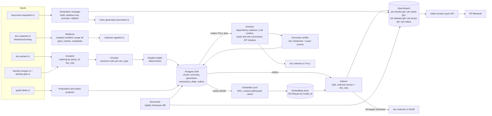
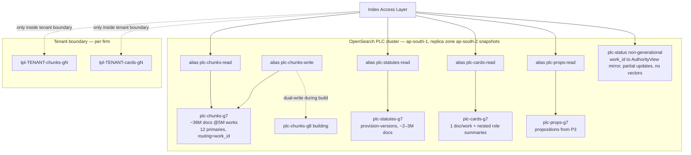

# P2 — Enrichment and Indexing

**Abstract.** P2 turns every `doc.parsed.v1` into retrieval-ready units and keeps all text indexes mutually consistent. It chunks judgments, statutes, the Constitution and notifications along their legal structure (paragraph groups that never cross a rhetorical-role boundary, provisions that never lose their provisos). It attaches deterministic context headers, and adds LLM-written context only where a chunk cannot be understood on its own. It builds anchored, entailment-checked digests ("case cards" and role-segment summaries) instead of copying reporter headnotes. It writes lexical, dense and (optionally) learned-sparse representations into versioned **index generations**. Postgres is the system of record, the indexes are disposable projections, and the outbox, external versioning and checksum reconciliation keep them in step. The evidence behind this design:
- Indian retrieval benchmarks show BM25 beating fine-tuned semantic models on precedent retrieval, while fine-tuned semantic models (best when run over *summaries*) win on statute retrieval [P2-8]. So lexical search is first-class, not a fallback.
- Legal-tuned embedders lead general ones on the only large legal embedding benchmark, but that benchmark contains no Indian data [P2-3]. So the embedder is chosen by a bake-off on Indian data, behind an abstraction that makes a model swap cost a re-embed, not a re-architecture.
- Retrieval sets the ceiling for legal RAG quality [P2-4].

Recommended stack:
- **OpenSearch** runs lexical and dense search in one engine and one document. It uses disk-based ANN (binary in RAM, full precision on disk) [P2-29] in AWS Mumbai/Hyderabad [P2-35] or on-prem.
- **Default embedder:** a self-hosted, Indian-legal fine-tune of **Qwen3-Embedding-4B** (Apache-2.0, 32k context, MRL, 100+ languages) [P2-10].
- **Named challengers:** Kanon 2 Embedder, which is VPC-deployable [P2-18], and Voyage.
- The whole corpus fits in about 16 GB of ANN RAM at 5M documents and about 65 GB at 20M.

---

## 1. Purpose and scope

**Purpose.** P2 makes the Public Legal Corpus (PLC), and in tenant mode each firm's private documents, *findable at the right granularity, at the right point in time, in the right language*. It does this without P2 ever becoming a source of legal truth. P2 produces **retrieval units and aids**. The units a claim can cite are **anchors** (spine §C), which P1 owns.

**In scope**
1. Structure-aware chunking of every expression in `doc.parsed.v1` (judgments/orders, statutes/rules/regulations, the Constitution, notifications/gazettes, ordinances).
2. Context headers: deterministic ones everywhere, LLM-generated ones selectively.
3. Multi-granularity "views": paragraph-group chunks, case cards (document level), role-segment summaries, proposition units (from P3), and statute provision-versions.
4. Summaries: machine digests with sentence-level anchors and entailment checks. Plus amendment "what changed" notes for statute versions.
5. Representations: lexical (multi-analyzer), dense (one model per generation), optional learned-sparse. Also machine-translation "shadow text" for non-English originals.
6. Index lifecycle: generations, aliases, dual-write, shadow evaluation, promotion, rollback, deletes/redactions, reconciliation.
7. The **Index Access Layer (IAL)**: a thin, engine-neutral read API that P5 calls. P5 owns fusion and ranking; P2 owns the primitives.
8. The same pipeline in **tenant mode** inside a firm's trust boundary, for P7 private documents.

**Out of scope**
- OCR, segmentation, anchors, citation resolution: P1.
- Treatment edges, status (`AuthorityView`, D6), propositions extraction: P3 (P4 triggers recomputes).
- Fusion, reranking, authority-aware ranking, context assembly: P5.
- Claim verification: P8.

**Design principles (the rules everything below follows)**
- **R1. Anchors are durable; chunks are disposable.** A chunk is a retrieval convenience that can be re-cut in any generation. Every chunk lists the anchors it covers, and all downstream citation uses anchors.
- **R2. Postgres is the system of record; indexes are projections.** Any index can be rebuilt from Postgres plus the object store plus the embedding cache, without re-parsing.
- **R3. Stable versus volatile fields.** Text-derived fields go into the vector-bearing documents. Fast-changing legal status (overruled, stayed) never does. An update in Lucene-family engines re-indexes the whole document [P2-37], which here means the vector too. Status lives in an overlay (P3's `AuthorityView`, D6) plus a small P2 "status mirror" index that caches it.
- **R4. Lexical is first-class.** On Indian precedent retrieval, BM25 (5-gram) scores 33.29 macro-F1@k against 24.67 for the best graph/semantic model (Para-GNN, full document, multi-task). Fine-tuned semantic models win on statutes: Para-GNN over case *summaries* 32.85 and SAILER 21.69, against BM25 (5-gram) 16.98. BM25+semantic ensembles and GPT-4.1 two-stage re-ranking win overall [P2-8].
- **R5. Never lose legal context at a boundary.** Do not detach a proviso from its sub-section, do not merge counsel's arguments with the court's reasoning, and flag a quoted passage as a quotation.
- **R6. Model-agnostic by construction.** An embedder swap is a new generation. At this corpus size a full re-embed costs low thousands of USD (§5.14), so there is no reason to lock in.

---

## 2. Input and output contracts

### 2.0 Spine v1.0 conformance

This doc follows the spine v1.0 decision record (D1–D21; D19–D21 dispositions are rows 11–18 below and the updated notes). Where the rest of this section says **proposed**, read the disposition below. The v1.0 name wins wherever the two differ. *Notation:* `D#` in §2.0 and in v1.0 annotations elsewhere means a spine v1.0 decision. The bold **D1.–D8.** headings in §6 are this doc's own local decision labels.

| # | P2 proposal (§2.6) | Disposition |
|---|---|---|
| 1 | Add `Summary` (`sum_…`) to §H | **ACCEPTED as D9** (new object, P2-owned) and D12 (`sum_`). Non-citable: D9's Claim rule says summaries never count as support, and P8 fails a claim whose only support is a `sum_` ID. |
| 2 | Extend `doc.indexed.v1` (`removed_chunk_ids`, `enrichment_level`, `summary_ids`, `doc_seq`, `parse_id`, `content_digest`) | **ACCEPTED** (D4: producer owns the schema; nothing contests it). Modified only by the D2 envelope names. `chunk_ids` are allowed in this *transient* event. D8 forbids them only in durable cross-phase records. |
| 3 | P2 consumes `graph.delta.v1` | **ACCEPTED-MODIFIED (D4, D6).** P3 is the single writer of status (`commit_status_batch`). P4 triggers recomputes but does not own status. The `plc-status` mirror is therefore a verbatim projection of the forum-independent fields of P3's **`AuthorityView`** (`status`, `definitive`, `reason_codes[]`, `status_confidence`, valid-time segment, `graph_watermark`), not of a P4 `AuthorityStatus`. `binding_on_forum` and `binding_basis` depend on the forum, so they are never mirrored; callers get them from P3. P2 never derives a status of its own. It consumes the v1.0 delta fields `graph_watermark`, `cause{kind, ref}` and `status_changes[].{definitive, reason_codes, valid_from}`. |
| 4 | New `index.generation.promoted.v1` | **ACCEPTED as D4** (owner P2). |
| 5 | New `doc.redacted.v1` | **ACCEPTED-MODIFIED (D4, D16).** This is the single event name. `data` = **`RedactionOverlay`** `{overlay_id, scope WORK\|EXPRESSION\|ANCHOR_SPANS, kind SUPPRESS_ALL\|MASK_SPANS\|NAME_SEARCH_SUPPRESSED\|COURT_PROHIBITION, spans[], legal_basis, ordered_by?, effective_at, purge_sla}`. Producers are P0/P1/ops/legal (D20.3); consumers are P1, P2, P3, P4, P5 caches, P7, P8, P9, P10 and replicas (D21.3), de-duplicating on `overlay_id` (`ovl_`, D20.5). The full overlay field list is 01_master §7.13 (D20.3). P2 acknowledges every overlay with **`redaction.applied.v1`** (D19.3; §5.11). Masking is an **overlay**: every P2 projection (lexical, dense, cards, summaries, snippets, MT shadow) is built from the *masked rendition*. There is **no masked `expression_key`**. P0's `raw.captured.v1` `change_kind = SUPPRESSED` reaches P2 only through `doc.redacted.v1`. |
| 6 | Add `IndexQuery`/`IndexHit` (IAL) to §H | **ACCEPTED as D9** (new objects) and D1 (OpenSearch is reached only through the IAL). Two additions: the **D3 PLC read-path rule** (§5.12), and D9's rule that tenant index shards require a **TEC** token (§5.13). |
| 7 | Machine translations are not Expressions | **ACCEPTED (D8, D16).** Public MT lives in `Chunk.mt` (= `nodes[].aux_text['{lang}-x-mt']`, `authoritative=false`). Private MT is a display rendition (`v1.mt-en`). MT is never a support anchor, and P8 fails a claim anchored to MT. |
| 8 | Statute anchors across coalesced intervals | **ACCEPTED-MODIFIED.** The field keeps the canonical 01_master §7.2 name **`Chunk.covered_expression_keys[]`** (an earlier draft of this doc renamed it `expression_keys[]`; that rename is withdrawn so the object matches the catalogue). Keys may carry a territory suffix, `lang@YYYY-MM-DD[~TERR]` (D16), so coalescing and as-of rewriting key on *(date, territory)*. The rewrite target must be an Expression that is `authoritative` or `ROUNDTRIP_OK`. Reconstructed text (`derived=true`) stays retrievable but is flagged, because it cannot back tier-1 claims (D16). |
| 9 | Work re-keying signal (`replaces_work_ids[]` / `work.rekeyed.v1`) | **ACCEPTED-MODIFIED as `identity.merged.v1` / `identity.split.v1`** (D4, D16) `{kind WORK\|CASE\|ALIAS, from_id, to_id, reason, confidence}`. The two names proposed here are withdrawn. |
| 10 | Chunk IDs are generation-scoped; anchors are durable | **ACCEPTED as D8.** |
| 11 | `Chunk.binding_scope_tags[]` for P5's BIND leg (01_master §14 R-12) | **ACCEPTED (D21.2).** P2 owns the field; P3 supplies the values (materialised court-hierarchy scopes, e.g. `ALL_INDIA`, `STATE:IN-MH`, `TRIBUNAL:NCLT-ALL`). Refreshed on `graph.delta.v1`, exposed as IAL filter `binding_scope_tags_any` (§2.2, §2.5, §5.11a). |
| 12 | `opinion_role` enum | **ACCEPTED (D21.4):** `MAJORITY\|CONCURRING\|DISSENT\|REFERENCE_ORDER\|UNKNOWN`. Per curiam → MAJORITY. `opinion_type` is retired. |
| 13 | Redaction and erasure acknowledgements | **ACCEPTED (D19.3, D20.15).** P2 emits `redaction.applied.v1` `{overlay_id, consumer: "P2", applied_at, generations_purged[]}` per overlay. In tenant mode it emits `erasure.applied.v1` `{erasure_id, consumer: "P2", applied_at, scope}`. P2 never emits `erasure.completed.v1`: P7 aggregates the acks and emits it (D21.3). |
| 14 | Parse-ID prefix | **RULED (D20.5):** `parse_id` = `par_…`. `prs_` stays P6's RuleSpec prefix. |
| 15 | `rights_class` / `provenance_tier` on `doc.parsed.v1` | **ACCEPTED (D20.14):** copied from the Manifestation. P2 reads them from the event, and no longer looks them up via `manifestation_id`. |
| 16 | `pdoc.parsed.v1` consumer | **RULED (D20.13):** consumers are P7 and P2 (tenant mode), on the tenant-scoped topic `tpl.<tenant>.pdoc.parsed.v1` (D20.16). |
| 17 | PLC read path by deployment | **RULED (D19.7):** D2 cells query the shared PLC IAL through the stateless read path (same region); a local replica is optional. D3/D4/D4h MUST use a local PLC replica, under a ≤24 h replica-lag SLO. |
| 18 | `trust_label` enum | **ACCEPTED (D21.12):** it adds `TENANT_COURT_RECORD` for privately held certified court records. The label is data-only for control flow and is set from P7's document record (§5.13). |

**Renames and semantics this doc now follows**
- Envelope extension attributes (D2) are `tenantid`, `causationid`, `idempotencykey`, `schemaversion` and `dataclass` (PUBLIC for PLC). Payload fields keep snake_case.
- Coalesced statute chunks keep the 01_master §7.2 field name `covered_expression_keys[]`; its keys follow D16 territorial form `lang@YYYY-MM-DD[~TERR]`.
- `opinion_type` (MAJORITY|CONCURRING|DISSENTING|PER_CURIAM|UNKNOWN) → **`opinion_role`** `MAJORITY|CONCURRING|DISSENT|REFERENCE_ORDER|UNKNOWN` (D8, D21.4). A per-curiam opinion maps to MAJORITY; an unattributed opinion is `UNKNOWN`.
- Status-mirror source "P4 `AuthorityStatus`" → P3 **`AuthorityView`** (D6).
- `work.rekeyed.v1` / `replaces_work_ids[]` → `identity.merged.v1` / `identity.split.v1`.
- `pipeline_version` = component@semver + model_id + **model_snapshot + endpoint_region** + prompt_hash (D10).
- Generation promotion gate "no metric regresses by more than 1 point" → the **D11 gate**: zero-tolerance sentinel suites, plus one-sided 95% paired-bootstrap non-inferiority at δ_s = max(1pt, 2·SE_diff,s) per slice.
- Deployments are named D1 pooled SaaS · D2 dedicated cell · D3 customer VPC · D4 on-prem/air-gapped · D4h on-prem + in-India cloud LLM (D17).
- `ParsedDocument` input shape per D16: `rhetorical_role{label, confidence, source}`, `speaker`, opinion ref, `quality.lang[]`, `quality.gate`, `quality.hidden_text_flags[]`, and optional opinion prefix `o{n}.` in anchors.
- Private anchors are `{pdoc_id}/{pver}#{fragment}` (D8).
- `parse_id` prefix `prs_` → **`par_`** (D20.5). `overlay_id` prefix is `ovl_` (D19.3, D20.5).
- Kafka topics follow `{plane}.{domain}.{event}.v{n}` with plane `plc` or `tpl.<tenant>` (D20.16), e.g. `plc.doc.parsed.v1`, `plc.doc.redacted.v1`, `tpl.<tenant>.pdoc.parsed.v1`.
- Authority rows are keyed by `subject_id` (D6; 01_master §14 R-05), including P2's `status_mirror`.

**Obligations added by v1.0** (new fields are marked ➕ in §2.2 and §2.5)
- `trust_label` on every chunk (D9).
- `rights_class` on every chunk and as an IAL filter for any external/API output (D9, D13).
- `covered_expression_keys[]` on coalesced statute chunks.
- `binding_scope_tags[]` on every PLC chunk, with values supplied by P3 (D21.2).
- Acknowledge every overlay with `redaction.applied.v1` (D19.3) and, in tenant mode, every erasure with `erasure.applied.v1` (D20.15).
- Consume `doc.redacted.v1` and index the masked rendition (§5.11).
- Consume `identity.merged.v1` / `identity.split.v1` and, in tenant mode, `erasure.requested.v1` (D4).
- Durable records persist anchors, never `chunk_id` (D8, R1).
- Publish `index.generation.promoted.v1`.
- `Summary` is non-citable.

**Cross-phase points raised by earlier drafts, now ruled**
- `parse_id` prefix: P1 had issued `prs_…`, which collides with P6's RuleSpec. **Ruled D20.5: `par_…`.** P2 still treats `parse_id` as opaque.
- `doc.parsed.v1` lacked `rights_class` and `provenance_tier`. **Ruled D20.14: both are copied onto the event.** P2 reads them from the event; the Manifestation lookup via `manifestation_id` remains only as a fallback for events with `schemaversion` older than the D20.14 minor.
- `pdoc.parsed.v1` was routed only to P7. **Ruled D20.13: P2 (tenant mode) also consumes it** on `tpl.<tenant>.pdoc.parsed.v1`.
- R-16 (rhetorical-role vocabularies): P1 publishes the canonical label set. P2 maps P1's `*_CANDIDATE` labels to their base label (`RATIO_CANDIDATE → RATIO`) and uses labels only for chunk boundaries and as a filter field; it never re-labels (§2.1).
- R-25 (TOPIC watches in tenant planes): P2 ships daily-delta chunk embeddings in the PLC→TPL bundle (§5.13).

### 2.1 Inputs

| Input | Producer | Used for |
|---|---|---|
| `doc.parsed.v1` (spine §G) + `ParsedDocument` JSON at `parsed_doc_uri` (spine §H) | P1 | Chunking, headers, summaries, all representations |
| `graph.delta.v1` (P2 as consumer, §2.0 #3) | P3 | (a) Index `Proposition` nodes as retrieval units. (b) Update the status-mirror index (an `AuthorityView` projection) from `status_changes[].{subject_id, new, definitive, reason_codes, valid_from}`, stamped with `graph_watermark`. (c) Refresh `cited_work_ids` when citation resolution changes. (d) Refresh `binding_scope_tags[]` when P3 changes a forum's binding universe (D21.2, §5.11a). |
| Binding-scope table (P3 Graph Query API `GET /v1/binding-scopes?since_watermark=`) | P3 | Values for `binding_scope_tags[]`: rows `{court_id, bench_id?, decided_from?, decided_to?, tags[], graph_watermark}` (§5.11a) |
| `reprocess.requested.v1` | P4/P9/ops | Re-chunk, re-embed or re-summarise a scope, or build a new generation |
| `doc.redacted.v1` (D4/D16; `data` = `RedactionOverlay`) | P0/P1/ops/legal | Mandatory removal or masking of text (court masking orders, victim-identity protection) across all generations, caches and snapshots. Indexes hold only the masked rendition (§5.11). De-duplicated on `overlay_id`; acknowledged with `redaction.applied.v1` (D19.3) |
| `identity.merged.v1` / `identity.split.v1` (D4/D16) | P1 | Re-key chunks, cards and summaries from `from_id` to `to_id` (§5.11) |
| Private `ParsedDocument` (`pdoc_…` IDs, anchors `{pdoc_id}/{pver}#{fragment}`), tenant mode only, signalled by `pdoc.parsed.v1` (D16) | P1 in tenant mode / P7 | Same pipeline, per-tenant indexes, no shared caches. `trust_label` is taken from P7's document record |
| `erasure.requested.v1` (D4), tenant mode only | P7 | Purge a tenant's or matter's chunks, embeddings, summaries and caches across all TPL generations. P2 acknowledges with `erasure.applied.v1` `{erasure_id, consumer: "P2", applied_at, scope}` (D20.15); P7 aggregates the acks and alone emits `erasure.completed.v1` (D21.3) |

P2 relies on these fields of `ParsedDocument` (P1 must populate them):

```ts
ParsedDocument.nodes[]: {
  anchor_id, node_type /* PARA|SUBPARA|SENTENCE|FOOTNOTE|HEADER|ORDER|HEADING|
                          SECTION|SUBSECTION|CLAUSE|PROVISO|EXPLANATION|ILLUSTRATION|SCHEDULE_ITEM|ARTICLE */,
  rhetorical_role? : { label /* FACTS|ISSUE|ARG_PETITIONER|ARG_RESPONDENT|ANALYSIS|RATIO|OBITER|
                      PRECEDENT_RELIED|PRECEDENT_NOT_RELIED|STATUTE|RULING_LOWER_COURT|RPC|NONE */,
                      confidence, source },                    // D16 node shape (was role + role_confidence)
  speaker?, opinion?: { ref },                                 // D16; opinion prefix o{n}. in anchors (unprefixed = o1)
  text, spans[] /* page+bbox per span (D16) */, page, bbox, children[],
  aux_text?: { "{lang}-x-mt": string },                        // D16: MT shadow, authoritative=false, never an anchor
  quote?: { is_block_quote: bool, source_mention_id?: string }   // P1: quoted passage detection
}
metadata: { court_id, bench{judges[], strength}, decision_date, case_title, parties, doc_type,
            opinions[]{author, kind},                          // D16
            jurisdiction_state?, lang, script, enacted_on?, commencement?, act_short_title?, … }
citations[]: CitationMention;  statute_mentions[]: StatuteMention;
quality: { ocr_conf, lang[] /* D16 */, structure_conf, needs_review,
           gate: "PASS"|"FLAGGED"|"QUARANTINED", hidden_text_flags[] }   // D9/D16
```

**Label vocabulary (01_master §14 R-16).** P1 owns and publishes the canonical rhetorical-role label set (coarse labels plus `*_CANDIDATE` and fine labels, D16). The 13 labels listed above are P2's *boundary classes*: P2 maps P1's label to them (`X_CANDIDATE → X`; any fine label → its coarse parent; unmapped → `NONE`) and uses them only for chunk boundaries and as a filterable `rhetorical_role` field. P2 never re-labels, and P5 reads the P1 label from the Anchor Read API when it needs the fine label.

If `rhetorical_role` is missing or its `confidence` is below 0.6, P2 falls back to heading-based and paragraph-based boundaries, and sets `role_source = "FALLBACK"` on each chunk.

`quality.gate = QUARANTINED` documents carry only `pg{n}` / `pg{n}.l{m}` locator anchors (D16). P2 indexes them with `quality.flags += QUARANTINED_LOCATORS`. The IAL excludes them by default (`min_quality_gate = FLAGGED`). They are never offered as support for impact_tier-1 claims. `hidden_text_flags[]` are copied into `quality.flags` and feed the `INJECTION_PATTERN` screen (§8).

### 2.2 Output: `Chunk` (extends spine §H)

```ts
Chunk {
  chunk_id: "chk_<base32(sha256(tenant_id|expression_ref|chunk_kind|first_anchor|last_anchor|chunker_version))[:26]>",
                                            // deterministic → idempotent within a generation. NOT stable across
                                            // chunker versions: anything persisted outside P2 (feedback, P6 claims,
                                            // P7 notes, P9 labels) MUST key on anchor_ids, never on chunk_id.
  tenant_id: null | "ten_…",                // null = PLC
  work_id, expression_key, case_id?,        // spine §B. Coalesced statute chunks: expression_key = first version of the interval
  covered_expression_keys?: string[],       // ➕ (01_master §7.2 name) statutes: every `lang@date[~TERR]`
                                            //   expression whose provision text is identical (§5.9, D16 territorial keys)
  authoritative: bool,                      // ➕ false for vernacular translations published "for the litigant's understanding" (§5.10)
  derived?: bool,                           // ➕ D16: reconstructed point-in-time statute text; cannot back tier-1 claims
  translation_of?: { work_id, expression_key },   // ➕ link to the original-language expression
  trust_label: "PLC_OFFICIAL"|"PLC_THIRD_PARTY"|"TENANT_CLIENT_DOC"|"TENANT_OPPOSING_DOC"|
               "TENANT_CORRESPONDENCE"|"TENANT_WORK_PRODUCT"|"TENANT_COURT_RECORD"|"USER_INPUT",
                                            // ➕ D9 + D21.12. PLC: from doc.parsed.v1.provenance_tier (D20.14)
                                            //   (OFFICIAL_PRIMARY/OFFICIAL_AGGREGATOR → PLC_OFFICIAL, else PLC_THIRD_PARTY);
                                            //   TPL: from P7's document record. Non-control labels are data-only downstream.
  rights_class: "OFFICIAL"|"OPEN_LICENSED"|"THIRD_PARTY_LINK_ONLY"|"LICENSED_RESTRICTED"|"USER_UPLOADED",
                                            // ➕ D9: from doc.parsed.v1.rights_class (D20.14); IAL filter for any external/API output (§2.5)
  redaction?: { overlay_ids: string[], masked: bool },   // ➕ D16: chunk text/vectors built from the masked rendition
  anchor_ids: string[],                     // ordered; every anchor of the expression is covered by ≥1 chunk
  anchor_range: { first: anchor_id, last: anchor_id },
  chunk_kind: "JUDG_PARA_GROUP"|"JUDG_LONG_PARA_PART"|"JUDG_HEADER"|"JUDG_OPERATIVE_ORDER"|
              "STAT_PROVISION"|"STAT_SCHEDULE_ITEM"|"CONST_ARTICLE"|"NOTIF_PARA"|"SHORT_ORDER_WHOLE",
  node_path: string,                        // e.g. "judgment/analysis/issue-2" or "act/part-II/ch-IV/sec-138/ss-1"
  section_heading?: string,
  rhetorical_role: string, role_source: "P1"|"FALLBACK",
  opinion_author?: string, opinion_role?: "MAJORITY"|"CONCURRING"|"DISSENT"|"REFERENCE_ORDER"|"UNKNOWN", // ➕ D8/D21.4
                                            //   (opinion_type retired; per-curiam → MAJORITY; judgments/orders only, UNKNOWN when
                                            //   unattributed; absent on statute chunks). Court's own text only (§3.6)
  text: string,                             // exact source text of the covered anchors (never paraphrased)
  text_hash: "sha256:…", token_count: int, lang: "en"|"hi"|…, script: "Latn"|"Deva"|…,
  context_header: string,                   // deterministic (see §5.3)
  llm_context?: { text: string, method: pipeline_version },   // only when the dependency detector fires
  mt?: { text_en: string, model: string, qe_score: float },   // machine "shadow" translation; NEVER citable, not an Expression (D8/D16)
  is_quotation: bool, quoted_source_ids?: string[],           // work_ids / anchors quoted
  cited_work_ids: string[], cited_provision_anchors: string[],// from resolved CitationMention / StatuteMention (batched refresh, §5.11)
  cited_citations_norm: string[],           // ➕ normalised citation strings as printed (facts, spine §D) — stable, never re-resolved
  crosswalk_ref_ids?: string[],             // ➕ statutes: P3 CORRESPONDS_TO assertion ids (display only, §5.2B)
  in_force?: bool, enacted_on?: date,       // ➕ statutes: uncommenced text has in_force=false, valid_from=null (§5.9)
  // denormalised stable metadata for filtering
  court_id, court_level, bench_strength?, decision_date?, doc_type, jurisdiction_state?,
  binding_scope_tags: string[],             // ➕ D21.2: P2-owned field, values from P3's binding-scope table (§5.11a), e.g.
                                            //   ["ALL_INDIA"] for SC; ["STATE:IN-MH","STATE:IN-GA","HC:crt_IN_HC_BOM"] for Bombay HC;
                                            //   ["TRIBUNAL:NCLT-ALL"]; bench-qualified tags "…:bench>=N". Empty on TPL chunks
  valid_from?: date, valid_to?: date,       // statutes/Constitution: provision-version interval (coalesced, §5.9)
  recorded_at: timestamp, superseded_at?: timestamp,          // bitemporal (spine §E)
  quality: { ocr_conf, structure_conf, needs_review, flags: string[] }, // ➕ flags e.g. INJECTION_PATTERN, BOILERPLATE_HEAVY,
                                            //   PROTECTED_IDENTITY_RISK, NEAR_DUP_OF:<work_id>, MOJIBAKE
  // tenant mode only (never present on PLC chunks):
  matter_id?: string, acl_principals?: string[],   // ➕ enforced by the IAL as a mandatory filter (§5.13)
  prev_chunk_id?, next_chunk_id?, parent_view_ids: string[], // card / role-summary ids
  embeddings: [{ model_id, dims, dtype, vector_ref }],        // vector_ref → embedding store
  index_generation: "g7", doc_seq: int64,   // doc_seq = external version for idempotent upserts
  pipeline_version: string                  // component@semver + model_id + model_snapshot + endpoint_region + prompt_hash (D10)
}
```

`chunk_id` is deterministic but **generation-scoped** (D8). Any durable cross-phase record (FeedbackEvent targets, P6 claims, P7 notes and dependencies, P9 labels, P8 audit rows) stores **anchors**, never `chunk_id`. The IAL still accepts `chunk_id` within a session, but `get_chunks(ids[])` for a retired generation returns `410 GONE` with the covered `anchor_ids[]` so that callers can re-resolve.

### 2.3 Output: `Summary` (new object — ACCEPTED as D9, `sum_`, non-citable)

```ts
Summary {
  summary_id: "sum_…", tenant_id: null|"ten_…", work_id, expression_key,
  level: "CARD" | "ROLE_SEGMENT" | "ONE_LINE" | "AMENDMENT_DIFF" | "PROVISION_EXPLAINER",
  scope_anchor_ids: string[],                        // what it summarises
  fields?: {                                         // CARD only — structured digest
    issues: [{ text, anchors[] }], held: [{ text, anchors[] }], outcome: { label, anchors[] },
    statutes_considered: anchor_id[], cases_relied: work_id[], cases_distinguished: work_id[],
    catchwords: string[], bench: {...}
  },
  sentences: [{ text, support_anchor_ids: string[], entailment: float,
                checks: { entities_ok: bool, numbers_ok: bool, sections_ok: bool } }],
  review_state: "MACHINE"|"PENDING_REVIEW"|"VERIFIED"|"REJECTED",
  disclaimer: "Machine-generated digest. Not a headnote. Cite the anchored paragraphs.",
  pipeline_version, recorded_at, superseded_at?
}
```

A summary is a **navigation aid, never a source** (D9: `sum_` never counts as support). A P6 claim that uses a summary must cite the summary's `support_anchor_ids`. P8 treats a claim whose only support is a `sum_…` ID as `UNSUPPORTED`. Summaries carry `trust_label` and `rights_class` from their source chunks. Summaries of masked text are regenerated from the masked rendition whenever a `doc.redacted.v1` overlay touches their `scope_anchor_ids`.

### 2.4 Output events

`doc.indexed.v1` (spine §G). The minimum fields are kept; additions are marked ➕.

```json
{
  "id": "01J…(ULID)", "specversion": "1.0", "type": "doc.indexed.v1", "source": "p2/indexer@2.3.0",
  "time": "2026-09-30T06:12:44Z", "subject": "wrk_01J…/en",
  "tenantid": null,                                   // D2 extension names. PLC; tenant-mode events carry ten_… and never leave the tenant bus
  "dataclass": "PUBLIC",                              // D2: TENANT_CONFIDENTIAL in tenant mode
  "traceparent": "00-…", "causationid": "<id of the doc.parsed.v1 event>", "schemaversion": "1.1",
  "idempotencykey": "p2|index|wrk_01J…/en|sha256:<content_digest>|g7:doc_seq=42:BASE",   // 01_master §6.1 E3 grammar
  "data": {
    "expression_ref": {"work_id": "wrk_01J…", "expression_key": "en"},
    "index_generation": "g7",
    "chunk_ids": ["chk_…", "…"],
    "removed_chunk_ids": ["chk_…"],                 // ➕ chunks tombstoned by this update
    "targets": ["lexical", "dense", "cards"],       // which projections are confirmed (refreshed)
    "enrichment_level": "BASE",                     // ➕ BASE = searchable; FULL = summaries+LLM context+MT done
    "summary_ids": [],                              // ➕ present when FULL
    "doc_seq": 42,                                  // ➕ monotonic per expression
    "parse_id": "par_01J…",                         // ➕ lineage back to P1 (opaque; `par_` per D20.5)
    "content_digest": "sha256:…"                    // ➕ xor-fold of (chunk_id, text_hash, doc_seq) — reconciliation key
  }
}
```

`index.generation.promoted.v1` (**ACCEPTED as D4**, owner P2): P2 → P5, P8, P4, P10.
`{ index_family, from_generation, to_generation, eval_report_uri, gate_decision_id /* P8 GateDecision under the D11 policy */, promoted_at, rollback_deadline, rolled_back_from? }`. P5 flushes caches keyed by generation and stamps `index_generation` on every `EvidenceBundle` (D9). P8 records which generation produced which answers (audit replay, spine §E). A rollback is published as a new promotion event with `rolled_back_from` set.

### 2.5 Output: Index Access Layer (sync API, P2 → P5; **ACCEPTED as D9/D1**)

```ts
IndexQuery {
  query_id, tenant_scope: { plc: true, tenant_id?: "ten_…", matter_id?, tec?: "<signed TEC token>" },
                                          // tenant indexes only inside tenant boundary; any TPL shard access requires a valid
                                          // ≤5-min Tenant Execution Context (D9) — the ACL filter is derived from it, never the caller
  view: "CHUNK"|"CARD"|"ROLE_SUMMARY"|"PROPOSITION"|"STATUTE",
  mode: "LEXICAL"|"DENSE"|"SPARSE",
  text?: string, vector?: number[] /* caller may pass a precomputed query vector */, 
  query_instruction_id?: string,          // instruction-aware embedders (Qwen3) — P5 picks per intent
  lexical?: { must_phrases[], should_terms[], proximity?: {terms[], slop}, fields_boost? },
  filters: { court_ids?, court_levels?, doc_types?, roles?, lang?, jurisdiction_states?,
             decided_on_or_before?: date, decided_on_or_after?: date,
             valid_at?: date,             // statutes: valid_from <= D < valid_to
             known_at?: timestamp,        // bitemporal replay: recorded_at <= K < superseded_at
             work_ids?, cited_work_ids_any?, cited_provisions_any?, exclude_quotations?: bool,
             binding_scope_tags_any?: string[],   // ➕ D21.2: P5 BIND leg; executed per §5.11a (partition or exact scoring)
             min_ocr_conf?,
             territory?: "IN-XX",         // ➕ D16: with valid_at, resolves (date, territory) statute versions
             rights_classes?: string[],   // ➕ D9: MANDATORY for external/API callers (D13 PLC Access API). The IAL
                                          //   enforces the caller's rights profile: text only for OFFICIAL|OPEN_LICENSED;
                                          //   THIRD_PARTY_LINK_ONLY returns metadata + link, never text
             trust_labels?: string[],     // ➕ D9
             min_quality_gate?: "PASS"|"FLAGGED"|"QUARANTINED" },   // ➕ default FLAGGED (QUARANTINED excluded)
  k: int, collapse_by_work?: int /* max hits per work */, generation?: "current"|"gN", trace: bool
}
IndexHit { chunk_or_view_id, work_id, expression_key, anchor_ids[], score_raw, rank, mode,
           generation, trust_label, rights_class, highlights?[] /* from the masked rendition */, explain? }
// plus: get_chunks(ids[]), get_neighbours(anchor_id, before, after), get_card(work_id),
//       get_provision(anchor_id, valid_at), embed_query(text, instruction_id) — runs in caller's boundary
```

Scores are returned raw and **uncalibrated**. Fusion is P5's job, using ranks, RRF or learned fusion.

**PLC read-path rule (D3).** When a tenant context calls the IAL, the IAL is stateless with respect to that tenant. No tenant-attributable IDs (`query_id`, query text, `matter_id`, hit lists) are logged outside the tenant-scoped audit store, and ops telemetry is tenant-redacted. D3/D4/D4h deployments query a local PLC replica. A tenant's PLC query history exists only inside the tenant boundary (the tenant audit store and tenant-isolated caches, D9).

### 2.6 Proposed spine changes (dispositions in §2.0)

1. **Add `Summary` (`sum_…`) to §H** (schema in §2.3). *Why:* summaries are produced here and consumed by P5, P6 and P10. Without a shared schema carrying `support_anchor_ids`, downstream components will cite summaries as if they were sources. The Indian summarisation literature documents hallucination in LLM judgment summaries [P2-25][P2-26].
2. **Extend `doc.indexed.v1`** with `removed_chunk_ids`, `enrichment_level`, `summary_ids`, `doc_seq`, `parse_id` and `content_digest`. *Why:* the two-phase freshness SLO (searchable in minutes, enriched in hours), idempotency, and reconciliation all need them. Without `removed_chunk_ids`, P5 caches can serve deleted text.
3. **Add P2 as a consumer of `graph.delta.v1`**. *Why:* proposition units and the status mirror are text-index projections of graph state. Letting P3 write into search indexes directly would create a second writer and break R2.
4. **New event `index.generation.promoted.v1`**. *Why:* cache invalidation in P5 and audit replay in P8 need to know which generation answered.
5. **New event `doc.redacted.v1`** (producers: P1, ops or legal; consumers: P2, P3, P5 caches, P7 tenant caches). *Why:* court masking or takedown orders must purge text, embeddings (embeddings can be inverted into text [P2-54]), summaries, old generations and snapshots within an SLA. The spine has no deletion or redaction event. *(v1.0, D16/D20.3/D21.3: producers are P0, P1 and ops/legal; consumers are P1, P2, P3, P4, P5 caches, P7, P8, P9, P10 and replicas; `data` = `RedactionOverlay` (01_master §7.13); masking is an overlay with no masked `expression_key`; every consumer acks with `redaction.applied.v1` (D19.3).)*
6. **Add `IndexQuery`/`IndexHit` (IAL) to §H**. *Why:* it decouples P5 from the engine DSL, so an engine swap becomes a P2-internal change.
7. **Clarify:** machine translations are **not** Expressions. They live in `Chunk.mt`, and anchors always point to the original-language text or to an *official* translation expression. *Why:* an unofficial MT paragraph must never become a citable anchor.
8. **Clarify statute anchors across coalesced intervals** (added by independent review). Spine §C makes an anchor expression-specific (`wrk/hi@2019-08-09#sec-3`), but P2 indexes one chunk per *distinct text interval* spanning several expressions (§5.9). Rule: the chunk stores `covered_expression_keys[]` (the 01_master §7.2 name); for a query with `valid_at = D` the IAL rewrites every returned anchor to the expression valid on D (same fragment; identical `text_hash` by construction), so P6/P8 always cite the point-in-time expression. *Why:* otherwise P5 receives the anchor of the first version in the interval, and the citation shows a version date that was not the one in force on D, even though the text is identical.
9. **Add a work re-keying signal** (added by independent review). `doc.parsed.v1` allows a *provisional* `work_id`. When P1 later merges it into a resolved Work (or splits a wrongly merged one), P2 must move all chunks, cards and summaries (they are routed by `work_id`). Proposed: `doc.parsed.v1.data.replaces_work_ids[]` (or a separate `work.rekeyed.v1 {from_ids[], to_id, reason}`); **v1.0 adopted `identity.merged.v1` / `identity.split.v1` instead (D4/D16)**. P2 handles it as delete-under-old-id plus index-under-new-id in one outbox transaction. *Why:* without it, provisional IDs leave orphaned duplicates and split citation counts.
10. **Chunk IDs are generation-scoped, anchors are durable** (clarifies spine §H `Chunk`). Any cross-phase persistence (FeedbackEvent targets, P6 claims, P7 notes) must reference `anchor_ids`, not `chunk_id`.

### 2.7 P2-owned internal schemas (so engineers can build without guessing)

```sql
-- Postgres (system of record). Abbreviated; all tables also carry pipeline_version, recorded_at.
CREATE TABLE expression_state (
  serial_key text PRIMARY KEY,           -- expression_ref for judgments/notifications; work_id for statute-family docs (§5.9)
  accepted_parse_id text NOT NULL, doc_seq bigint NOT NULL, chunk_set_hash bytea, content_digest bytea,
  enrichment_level text CHECK (enrichment_level IN ('NONE','BASE','FULL')), status text  -- ACTIVE|QUARANTINED|SUPERSEDED_REV|REKEYED
);
CREATE TABLE chunk (
  chunk_id text, index_generation text, tenant_id text, work_id text NOT NULL, expression_key text NOT NULL,
  doc_seq bigint NOT NULL, text_hash bytea NOT NULL, body jsonb NOT NULL,     -- full Chunk object (§2.2)
  tombstoned_at timestamptz, superseded_at timestamptz,
  PRIMARY KEY (chunk_id, index_generation)
);
CREATE TABLE outbox (id bigserial PRIMARY KEY, kind text, serial_key text, doc_seq bigint, gens text[],
                     payload jsonb, created_at timestamptz DEFAULT now(), relayed_at timestamptz);
CREATE TABLE status_mirror (                       -- projection of P3 AuthorityView (D6), bitemporal; P3 is the single writer of status
  subject_id text,                                 -- wrk_… or prp_… (AuthorityView.subject_id, D6; 01_master R-05)
  status text CHECK (status IN ('GOOD','CAUTION','NEGATIVE','PARTIAL_NEGATIVE','UNKNOWN')),  -- D6: stays 5-valued
  definitive boolean NOT NULL,                     -- D6: "under review" = CAUTION + definitive=false + NEGATIVE_SIGNAL_UNDER_REVIEW
  reason_codes text[] NOT NULL DEFAULT '{}',       -- D6 reason codes (P3 registry, D21.8), e.g. NEGATIVE_SIGNAL_UNDER_REVIEW, COVERAGE_GAP
                                                   --   (D20.12: a gap sets definitive=false; GOOD→UNKNOWN only past the per-source threshold; copied verbatim)
  status_confidence real,
  valid_from date NOT NULL, valid_to date,         -- legal time: status holds for as_of_legal_date in [from,to)
  recorded_at timestamptz NOT NULL, superseded_at timestamptz,
  reason_assertion_ids text[] NOT NULL, source_delta_id text NOT NULL,
  graph_watermark bigint NOT NULL,                 -- D4: P3 watermark of the delta that produced this row
  PRIMARY KEY (subject_id, valid_from, recorded_at)
);
```

`plc-status` OpenSearch mirror doc (one doc per `subject_id`, no vectors): `{subject_id, kind: WORK|PROPOSITION, current_status, definitive, reason_codes[], intervals: [{status, definitive, reason_codes, valid_from, valid_to}], reason_assertion_ids, last_delta_id, graph_watermark, updated_at}`. **The mirror is a cache of `AuthorityView`, not a second source (D6).** It copies P3's forum-independent fields verbatim and never computes status. `binding_on_forum`/`binding_basis` are forum-specific and are always read from P3 (`/v1/binding`, `authority:batch`). Badges, P5 ranking features and P8 status checks may read it only when its `graph_watermark` ≥ the `graph_watermark` the caller is pinned to. Otherwise they call P3's Graph Query API. A query with `as_of_legal_date = D` selects the interval containing D; `as_known_at` replays go to Postgres `status_mirror` (or P4), never to the mirror index.

`reprocess.requested.v1` (schema owner P4, D21.15; 01_master §6.3) fields P2 reads: `scope.selector{work_ids?, court_ids?, doc_types?, decided_between?, lang?, parse_pipeline_version?, generation?, quality_lt?}` or `scope.explicit_ids_uri`, `stages` ⊆ {`P2.chunk`, `P2.embed`, `P2.enrich`, `P2.all`}, `target_pipeline_version`, `mode SHADOW|APPLY`, `output_namespace`, `lane`, `reason`, `budget{usd_cap, deadline}`, `requested_by`. P2 ignores stages owned by other phases. It computes an estimate first; if `estimate > budget.usd_cap` or `> 1,000 USD` of LLM spend, the job waits for an ops approval (§8, cost blow-up). In `SHADOW` mode it writes to `output_namespace` (a shadow generation) and never to the live aliases.

---

## 3. State-of-the-art survey (with citations)

### 3.1 Chunking

| Approach | Evidence | Relevance to Indian legal text |
|---|---|---|
| Fixed-size / recursive character splitting | On LegalBench-RAG, the Recursive Character Text Splitter beat naive 500-character chunks, and was best *without* a reranker [P2-20]. | Better than naive, but blind to legal structure. |
| Semantic (embedding-similarity) chunking | Across document retrieval, evidence retrieval and generation, the compute cost of semantic chunking was "not justified by consistent performance gains" over fixed-size chunking [P2-19]. | Judgments already carry explicit structure (numbered paragraphs, headings, rhetorical roles), so there is nothing for semantic chunking to discover. |
| Propositions (Dense X) | Indexing by atomic, self-contained propositions "significantly outperforms passage-level units" [P2-21]. | Maps onto P3's `Proposition` nodes. We index them as a *view*, not as the base unit (§5.4). |
| RAPTOR tree of recursive cluster summaries | +20% absolute accuracy on QuALITY with GPT-4 [P2-22]. | Judgments have a *given* tree (sections and roles), so we derive the tree from structure instead of clustering (§7, N1). |
| Late chunking | Embed all tokens of a long text, then pool per chunk. Reported "superior results across retrieval tasks" [P2-2]. | Needs a long-context, mean-pooling-friendly embedder. |
| Contextual retrieval (Anthropic) | Prepending 50–100 tokens of LLM context per chunk cut top-20 retrieval failure by 35% (embeddings), 49% (+ contextual BM25) and 67% (+ reranking). Cost $1.02 per million document tokens with prompt caching [P2-1]. | Directly applicable. Cost is manageable, but LLM text in the index adds a new hallucination surface. |
| Late chunking vs contextual retrieval (head-to-head) | Contextual retrieval "preserves semantic coherence more effectively but requires greater computational resources"; late chunking is more efficient "but tends to sacrifice relevance and completeness" [P2-23]. | Motivates the *selective* contextualisation in §5.3. |
| Trained contextual chunk embedder (voyage-context-3) | Chunk-level retrieval +14.24% over OpenAI-v3-large and +23.66% over Jina-v3 late chunking. Dims 256–2048, int8/binary [P2-14]. | A strong challenger. It is API-hosted, which matters for residency (§5.6). |

### 3.2 Embedding models (2024–2026)

- **MLEB** (Oct 2025) is the largest open legal embedding benchmark: 10 expert-annotated datasets across US, UK, EU, Australia, Ireland and Singapore. It contains **no Indian data** [P2-3]. NDCG@10:
  - Kanon 2 Embedder 86.03
  - Voyage 3 Large 85.71
  - Voyage 3.5 84.07
  - Qwen3-Embedding-8B 82.96
  - Qwen3-Embedding-4B 81.96
  - Gemini Embedding 80.90
  - voyage-law-2 79.63
  - OpenAI text-embedding-3-large 78.91
  - Jina v4 78.62
  - BGE-M3 69.44
  - E5-large-instruct 68.11

  The authors' finding is that "strong performance on MLEB correlates with legal domain adaptation" [P2-3].
- **Legal RAG Bench** (Mar 2026): "retrieval sets the ceiling" for legal RAG, and many errors blamed on hallucination are actually retrieval failures. Kanon 2 Embedder improved correctness by 17.5 points compared with the other embedders tested [P2-4].
- **Qwen3-Embedding** (0.6B/4B/8B, June 2025): Apache-2.0, 32k context, MRL dimensions 32–2560 (4B), instruction-aware, 100+ languages. The 8B model scored 70.58 on MTEB-multilingual at release [P2-10][P2-11].
- **BGE-M3**: one model producing dense, sparse and multi-vector outputs, 8,192 tokens, 100+ languages [P2-12]. It is weak on MLEB (69.44) [P2-3].
- **Voyage**:
  - voyage-law-2 has 16k context and 1024 dimensions.
  - The voyage-4 family (large/standard/lite/nano) has 32k context and dims 256–2048; large/standard/lite also offer int8/binary output (nano is float-only in the API docs). Its members are *embedding-compatible with each other*, so you can index with the large model and query with the lite one. voyage-4-nano has open weights on Hugging Face [P2-13].
- **Cohere Embed v4**: 128k context, dims 256–1536, multimodal [P2-15].
- **Gemini embedding-001**: **only 2,048 input tokens**, dims 128–3072 [P2-16]. Too short for header + long-paragraph inputs without truncation. The newer **gemini-embedding-2** raises the limit to 8,192 tokens (same 128–3072 dims) but its space is incompatible with 001, and it is API-only [P2-16].
- **Jina v3**: weights licensed **CC-BY-NC-4.0**, so no commercial self-hosting without a licence [P2-17].
- **Kanon 2 Embedder**: sold as a SageMaker model package deployed *in the customer's own AWS account*. 16,384-token context. $7.99 per host-hour. Vendor-claimed ~15k legal documents/hour on one g6.2xlarge [P2-18].
- **Indian legal encoders**:
  - InLegalBERT: ~5.4M Indian SC/HC documents (1950–2019, ~27 GB), BERT-base, MIT licence [P2-5][P2-6]. It is a pre-trained encoder, not a retrieval embedder: 512 tokens, and it needs contrastive fine-tuning.
  - SAILER: structure-aware pre-training for case retrieval [P2-47].
  - IndicSBERT: beats LaBSE and LASER on Indic cross-lingual sentence similarity [P2-49].
- **Compression**:
  - Binary quantisation cuts memory 32× and keeps ~92.5% of retrieval quality, up to ~96% with rescoring. int8 (4× smaller) keeps ~99% with rescoring [P2-43].
  - MRL gives up to 14× smaller embeddings at equal accuracy (ImageNet) [P2-44].
  - Compression tolerance is model-specific and must be measured [P2-43].
- **Sparse and multi-vector**:
  - SPLADE-v3 is significantly better than BM25 on MS MARCO/BEIR (English) [P2-46].
  - OpenSearch ships a *multilingual* neural-sparse model [P2-31] and SEISMIC-based sparse ANN (3.3+) [P2-32].
  - ColBERTv2 compresses late-interaction storage 6–10× [P2-45], but that is still per-token.
  - Qdrant's BM42 launch had to be corrected: "BM42 does not outperform BM25 implementation of other vendors" after an evaluation-script bug [P2-40]. This is a warning about vendor retrieval claims.

### 3.3 Indian retrieval evidence

- **IL-PCSR** (EMNLP 2025): 6,271 query cases, 936 statutes and 3,183 precedents. Average precedent length 7,485 words. Macro-F1@k:
  - Precedent retrieval: BM25-5gram 33.29, beating the best semantic/graph model (Para-GNN full-doc, multi-task) at 24.67; SAILER fine-tuned reaches only 12.64.
  - Statute retrieval: fine-tuned semantic models win. Para-GNN over query-case *summaries* 32.85 (the paper calls this a ~77% relative gain over the best lexical variant, 18.59), SAILER 21.69, BM25-5gram 16.98.
  - Ensembles (BM25 + semantic) do better, and GPT-4.1 two-stage re-ranking is best (46.11 statutes, 43.31 precedents) [P2-8].
  - Design implication: *summaries as retrieval input* helped statute retrieval most, which supports indexing cards and role-segment summaries as separate views (§5.4), not only raw chunks.
- **IL-TUR** (ACL 2024) has 8 tasks [P2-7]:
  - IL-PCR: 7,070 documents, average **8,096 words**.
  - IN-Abs summarisation: 7,130 documents, average **4,376 words**.
  - MILPaC legal MT: English ↔ 9 Indian languages.
- **U-CREAT** (ACL 2023): event-based unsupervised retrieval "significantly increases performance compared to BM25" on IL-PCR and is faster [P2-9]. (The oft-quoted "+25.3 F1" figure is *(unverified)*: it is not in the abstract.)
- **MTEB's AILA-casedocs** has only 50 queries over 186 documents [P2-51]. That is too small to choose a production model on.
- **AILQA** (2026) built an Indian legal RAG baseline over ~7,221 documents (6,942 judgments, 15 Acts, 264 articles) with generic embedders (OpenAI Ada, Instructor-XL, mxbai), ChromaDB, 2,000-character chunks and top-3 cosine retrieval. On one test set, retrieved context *degraded* answers for Llama3-70B, Mixtral-8x7B and GPT-3.5, and the authors note that semantic retrieval returns passages that "share terminology with the query but concern a legally distinct issue" [P2-52].

### 3.4 Index engines

- **OpenSearch** (Linux Foundation project [P2-53]):
  - `on_disk` vector mode since 2.17. Default 32× compression; the first pass is in RAM and results are **rescored with full-precision vectors from disk** (oversample 2.0). Works with `float`/`half_float` [P2-29].
  - Native hybrid query with normalisation, and RRF via `score-ranker-processor` since 2.19 (rank_constant 60, weights) [P2-30].
  - Neural sparse, including a multilingual model and SEISMIC ANN [P2-31][P2-32].
  - External versioning on index writes: an older version is rejected with 409 [P2-33].
  - A Hindi analyzer (plus Bengali). Other Indic languages go through ICU [P2-34].
  - Managed service in **ap-south-1 (Mumbai) and ap-south-2 (Hyderabad)**, including Serverless [P2-35].
- **Elasticsearch** added AGPLv3 alongside ELv2/SSPL in Aug 2024 [P2-36]. Updates re-index the whole document [P2-37].
- **Vespa**: first/second-phase ranking on content nodes, a global phase in the container with ONNX/cross-encoders, and built-in `reciprocal_rank_fusion()` [P2-38]. This is the most expressive ranking engine.
- **turbopuffer**: object-storage-native, with an AWS Mumbai region and BYOC [P2-39].
- **pgvectorscale**: StreamingDiskANN plus label-filtered search. Vendor benchmark on 50M 768-dim Cohere vectors: 28× lower p95 latency and 16× higher throughput than Pinecone's storage-optimised (s1) index at 99% recall [P2-41] (vendor claim).
- **Consistency**: the transactional outbox guarantees a message is sent only if the DB transaction commits. It implies duplicates, so consumers must be idempotent [P2-42].

### 3.5 Summarisation of Indian judgments

- Shukla et al. (AACL 2022) created IN-Abs, IN-Ext and UK-Abs and showed that long-document limits cripple abstractive models. They used lawyer evaluation [P2-24].
- Deroy, Ghosh and Ghosh found that pre-trained abstractive models and LLMs produce "inconsistent or hallucinated information" in Indian judgment summaries and need human-in-the-loop use (2023, 2024) [P2-25][P2-26].
- Their 2026 hybrid extractive-then-abstractive approach beat single-method prompting [P2-27].

### 3.6 Legal constraints on enrichment

*Eastern Book Company v. D.B. Modak*, SC, CA 6472/2004, decided 12 Dec 2007 [P2-28]:
- Copyright subsists in reporter **headnotes, footnotes and editorial notes**; mere copy-editing of the judgment text (spelling, formatting, citations inserted) does not attract copyright.
- Reproducing a judgment is not infringement under **s. 52(1)(q) Copyright Act** (as extracted in the judgment).
- **Paras 41–42 (verified in the fetched text):** copyright *does* subsist in the reporter's (i) segregation of existing paragraphs into separate paragraphs, (ii) internal paragraph numbering, and (iii) labels such as "concurring", "partly dissenting", "dissenting". The Court directed that the respondents "shall not use the paragraphs made by the appellants in their copy-edited version for internal references" nor the editors' concurring/dissenting labels [P2-28].

So we must generate our own digests from the official text and never ingest SCC/AIR headnotes. This is a **hard requirement, not a precaution**: P1 anchors use only the court's own numbering (or synthetic `u` numbers), never a reporter's; P2's `opinion_role` (D8: MAJORITY/CONCURRING/DISSENT/REFERENCE_ORDER) must be derived from the court's own text (opinion headings, "I agree", author blocks), never copied from a reporter's labels; and P2 never ingests reporter-edited judgment text into the PLC; a tenant's licensed copies stay in that tenant's TPL (§5.5).

### 3.7 Cross-lingual

- IndicTrans2 covers all 22 scheduled languages, with open models [P2-48].
- Qwen3-Embedding and BGE-M3 are natively multilingual [P2-10][P2-12].
- In MILPaC (English ↔ 9 Indian languages, 17,853 text pairs), the Microsoft Azure baseline reached BLEU 0.28, GLEU 0.32 and chrF++ 0.57 (0–1 scale) for legal MT [P2-7]. Useful for recall, not faithful enough to quote, so MT text is a retrieval aid, never a source.

### 3.8 Why this matters: hallucination is often retrieval failure

Magesh et al. found Lexis+ AI, Westlaw AI-AR and Ask Practical Law AI hallucinating 17–33% of the time [P2-50]. Legal RAG Bench attributes much of this kind of error to retrieval [P2-4]. P2's job is to maximise recall of the *right unit* at the *right time*.

---

## 4. Mistakes others made and how we avoid them

| System/paper | What went wrong | Evidence | How we avoid it |
|---|---|---|---|
| Commercial legal RAG tools (Lexis+ AI, Westlaw AI-AR) | 17–33% hallucination despite "hallucination-free" claims. Many errors trace to wrong or insufficient retrieved context. | [P2-50][P2-4] | Retrieval units are anchor-exact. Quotation and role flags stop "echo" retrieval. Summaries are never citable. Recall is measured per view and per language (§9). |
| Generic RAG stacks on Indian law (e.g. AILQA-style ChromaDB + generic embedders, fixed 2,000-char chunks, top-3) | Retrieved context often *hurt* answers; semantically similar but legally distinct passages retrieved. Generic embedders with no Indian tuning. | [P2-52] | Indian-data bake-off, fine-tuning on citation-context pairs, and lexical first-class. |
| Dense-only legal retrieval | On Indian precedent retrieval, BM25 beats semantic models (33.29 vs 24.67). | [P2-8] | One engine holds BM25 and dense in the same document. P5 fuses them, and every retrieval eval runs hybrid. |
| Choosing embedders on MTEB-legal / AILA | AILA-casedocs is 50 queries/186 docs. MLEB authors report serious failings in MTEB's legal split. MLEB has no India. | [P2-51][P2-3] | Our own Indian eval suite (§5.6.3), with IL-PCSR, IL-PCR and partner-firm gold. Decisions are made on hybrid marginal gain. |
| LegalBench-RAG pipeline with generic reranker | Cohere reranker *hurt* on specialised legal sets. | [P2-20] | P2 exposes raw candidates. P5 must pass a reranker eval gate on Indian data before any reranker ships. |
| Semantic chunking fashion | Compute cost not justified by consistent gains. | [P2-19] | Structure-aware chunking from P1's tree. No embedding-similarity splitting. |
| Naive fixed-size chunking | Splits provisos from sub-sections and merges counsel's arguments with the court's reasoning. | [P2-20] (fixed-size is weakest); legal reasoning (R5) | Boundary rules: never cross role or heading boundaries, provisos stay attached, and the operative order is always its own chunk (§5.2). |
| LLM judgment summarisation in India | Inconsistent or hallucinated content. | [P2-25][P2-26] | Extract-then-abstract. Every sentence carries anchors, an entailment gate and entity/number/section exact checks. Summaries are labelled non-authoritative. |
| Reporter-headnote dependence (Indian incumbents) | Headnotes, footnotes and editorial notes are copyrighted (EBC v Modak), which locks the product to a licence. | [P2-28] | Own digests from official text only. Citation strings are stored as facts (spine §D). |
| Vendor retrieval benchmarks | BM42 claims retracted after an eval-script bug. | [P2-40] | Every vendor claim (including those cited here) is re-measured in our harness before adoption. |
| Status baked into search docs (common pattern) | Each status change re-indexes vector docs (update = full re-index), which lags and churns. | [P2-37] | R3: status lives in an overlay plus a small mirror index. Vectors are untouched by treatment changes. |
| Late chunking as a silver bullet | Efficiency at the cost of relevance and completeness vs contextual retrieval. | [P2-23] | Deterministic headers plus selective LLM context, with late chunking kept as a bake-off arm. |
| API embedders for confidential queries | Query text (client facts) leaves the trust boundary. Embeddings can be inverted to recover text (92% of 32-token inputs). | [P2-54] | Query embedding runs inside India and the tenant boundary (open weights or VPC deployment). Tenant embeddings are treated as sensitive as text. |
| Single mutable index | No rollback when a new model or chunker regresses. Rebuilds need downtime. | [P2-42] and general practice | Immutable generations, alias swap, shadow eval gate, N-day rollback (§5.11). |

---

## 5. Recommended design, in detail

### 5.1 Component overview



**Components:**
- Stateless workers are Python services (chunker, enricher, verifier) with a Go or JVM indexer. GPU embedder pods run TEI/vLLM-style servers behind the **Model Gateway** (spine §I), so the embedder is swappable.
- Durable orchestration uses Temporal (D1; DBOS fallback for small on-prem). P2 needs only three things from it: retries with backoff, per-lane priority (daily ≫ backfill), and per-expression serialisation (a mutex keyed on `expression_ref`).
- Postgres holds everything authoritative. OpenSearch holds projections only.

### 5.2 Chunking (structure-aware, per document type)

**Size targets (tokens, measured with the generation's embedder tokenizer):** target 350, soft minimum 120, soft maximum 550, hard maximum 900. A chunk is *never* split mid-sentence. These numbers are starting points; the bake-off (§5.6.3) tunes {250, 350, 500}.

**A. Judgments and orders** (`doc_type ∈ JUDGMENT, ORDER`)

```
function chunk_judgment(tree):
  units = flatten(tree) → list of PARA/SUBPARA nodes (with anchors), plus HEADER(hdr), ORDER(ord), FOOTNOTE(fn*)
  emit JUDG_HEADER chunk from hdr   // cause title, coram, counsel; lexical-heavy, dense optional
  emit JUDG_OPERATIVE_ORDER chunk from ord (+ final para if role=RPC)   // always standalone
  if total_tokens(units) <= 700 and doc_type == ORDER:
      emit SHORT_ORDER_WHOLE (one chunk, all anchors); return          // most daily/interim orders
  groups = []
  for u in units in reading order:
      boundary = (u.role != current.role)                 // never mix roles (ARG vs ANALYSIS vs RATIO)
              or (u.heading_changed)                      // new heading / issue number
              or (u.is_block_quote != current.is_block_quote)   // quotes are isolated
              or (u.opinion_author != current.opinion_author)   // separate concurring/dissenting opinions
              or (tokens(current)+tokens(u) > SOFT_MAX)
      if boundary and tokens(current) >= SOFT_MIN: close(current)
      elif boundary and tokens(current) < SOFT_MIN and role/author/quote unchanged: continue   // tiny paras merge
      elif boundary: close(current)                         // hard boundaries override the minimum
      if tokens(u) > HARD_MAX: split u at sentence boundaries into JUDG_LONG_PARA_PART chunks
                               (anchors p45.s1–p45.s9; each part repeats "para 45 (part k/n)" in header)
      else add u to current
  footnotes: attach fnN text to the chunk containing its call-out anchor (as a trailing field, lexical only)
```

Decisions and why:
- **Opinion boundaries**: a dissent is not the Court's holding. P1 supplies `opinion_author` per paragraph, and chunks never straddle two opinions. The card records `opinion_role ∈ MAJORITY|CONCURRING|DISSENT|REFERENCE_ORDER` (D8).
- **Quotation isolation**: Indian judgments quote earlier judgments and statutes at length. Such a paragraph is lexically near-identical to its source, so without isolation a later case "echoes" the ranking of the case it quotes. Quoted chunks carry `is_quotation=true` and `quoted_source_ids`. P5 can collapse echoes to the original (and cite it) or keep them as "applied in" evidence.
- **Arguments vs. analysis**: counsel's submissions often read like holdings. `rhetorical_role` travels with every chunk, and P5/P6 must treat `ARG_*` as "what was argued", not "what was held".

**B. Statutes, rules, regulations, Constitution**

```
function chunk_provision(section_node, version_interval):
  // unit = section (or article / rule / regulation / schedule item)
  text_full = section incl. sub-sections, clauses, provisos, explanations, illustrations
  if tokens(text_full) <= SOFT_MAX: emit STAT_PROVISION(section)            // most sections
  else:
    for each sub-section ss: emit STAT_PROVISION(ss ∪ its clauses ∪ provisos/explanations that qualify ss)
    // provisos/explanations attached at section level (not to one sub-section) → repeated in each part's header as
    // "Subject to proviso: <first 60 tokens>…" and linked via anchor_ids (never orphaned)
  header = "{Act short title}, {year} | {State if state Act} | Part {…} — {title} | Chapter {…} — {title} |
            s. {num} — {marginal heading} | In force {valid_from} → {valid_to or 'date'} | {'Not yet in force' if applicable}"
```

- Definitions sections (e.g. s.2) are split per defined term (`sec-2.1.x`), because a query for "'consumer' definition" should hit the one clause.
- Schedules are split per item. For the Constitution, the unit is the Article (clauses split if long) and the Schedule entry for the Seventh Schedule lists.
- **Crosswalk hint.** For BNS/BNSS/BSA and the old codes, P3's `CORRESPONDS_TO` assertions are *not* baked into chunk text; they live in the graph and change under HITL. The statute chunk carries `crosswalk_ref_ids` (assertion IDs) for display, and query-time expansion is done by P5.

**C. Notifications, gazette, circulars, ordinances**: paragraph-group chunks as in A. Metadata includes `issuing_authority`, `notification_no`, `gazette_id`, `effective_date` and `made_under` (anchor). Tables are serialised row-wise with the header row repeated.

**D. Invariants checked on every chunking run (fail = quarantine the expression, emit nothing)**
- I1 coverage: every anchor of the expression appears in at least one chunk.
- I2 order: anchors within a chunk are contiguous in reading order.
- I3 no chunk mixes roles, opinions or quote/non-quote, unless `role_source=FALLBACK`.
- I4 no proviso or explanation without its parent's anchor in the same chunk or the header.
- I5 `text` equals the concatenation of anchor texts (byte-exact after normalisation), which guarantees click-to-source.
- I6 (soft, flag only; added by review): a chunk where > 30% of tokens come from lines that repeat on ≥ 50% of the source pages (digital-signature stamps, "Signature Not Verified", page headers, neutral-citation footers) gets `quality.flags += BOILERPLATE_HEAVY` and a per-court metric to P1. Such text inflates BM25 matches on court names and dates.

### 5.3 Context headers: deterministic first, LLM only where needed

**Deterministic header (every chunk, free).** Example for a judgment chunk:

`Supreme Court of India | 3-judge bench | 2024-02-05 | <Short title> | Analysis → Issue 2: limitation | ¶¶ 45–47 | cites: s.5 Limitation Act 1963; <case short names>`

- Built from P1 metadata, the node path and citations. Cited cases appear as the *citation strings as printed* (normalised), not as resolved short names, so a later change in P1/P3 citation resolution does not change the embedding input and force a re-embed (churn control, §5.11).
- The header never includes a reporter citation the court did not itself print, and never any AuthorityStatus (R3).
- The header is *prepended to the embedding input only*.
- For BM25, header facts go into **separate fields** (`title`, `court`, `cited_*`) with their own boosts, not into `text`. This avoids inflating term frequency, which is a risk of Anthropic-style "contextual BM25".

**Selective LLM context [NOVEL — unvalidated].** A cheap *dependency detector* flags chunks whose meaning depends on distant text. Only those chunks get a 50–100-token LLM context, following Anthropic's approach and prompt-cached per document [P2-1]. Detector features:
- Starts with an anaphor ("The said", "the aforesaid", "It", "This contention", "Therefore").
- Refers to an unresolved "the Act", "the section" or "the impugned order" without naming it.
- Is under 60 tokens.
- Is a `RATIO`/`ANALYSIS` chunk with no statute or case mention.
- Belongs to an issue-numbered section whose issue text lies more than 3 chunks away.

The expectation is that 20–35% of long-judgment chunks fire (an estimate, to be measured).

The LLM prompt is extraction-only. Its output must mention only entities present in the document (checked against P1 entities), otherwise it is discarded. The result is stored in `llm_context` with its `pipeline_version`, and embedded with the chunk. It is never shown as source text.

**Why not late chunking by default:** Qwen3-Embedding uses last-token pooling, not a mean over token spans (verified in its model-card usage code [P2-10]). Late chunking in the sense of [P2-2] would need a mean-pooling model (or a re-trained span-pooling head). It remains a bake-off arm with BGE-M3, which supports 8k context [P2-12].

### 5.4 Multi-granularity views (a structure-derived tree, not a clustering tree)

| View | Unit | Index | Main consumers |
|---|---|---|---|
| **Chunk** | Paragraph group / provision part | `plc-chunks-gN`, `plc-statutes-gN` | P5 passage retrieval, P6 evidence |
| **Case card** | One per judgment Work+expression. Metadata + CARD summary + ONE_LINE + catchwords + outcome | `plc-cards-gN` | "Find the case where…", browsing, P10 result lists, work-level dense retrieval |
| **Role-segment summary** | One per (judgment, role ∈ FACTS, ISSUES, ARGS_P, ARGS_R, ANALYSIS, RATIO, ORDER) for judgments over 12 paragraphs | `plc-cards-gN` (nested, `view=ROLE_SUMMARY`) | Issue-level matching ("cases with similar facts"), a U-CREAT-style fact match [P2-9] |
| **Proposition** | P3 `Proposition` (`prp_…`) text + `anchor_ids` of the ratio paragraphs | `plc-props-gN` | Holding-level retrieval, Dense-X-style granularity [P2-21] |
| **Provision-version** | Statute chunk with `valid_from/valid_to` | `plc-statutes-gN` | As-of retrieval |

Each view carries `work_id` and `anchor_ids`, so P5 can hop down (card → ratio chunks) and up (chunk → card) without a graph query. This gives RAPTOR-style multi-level retrieval [P2-22] at zero clustering cost, and every level is legally meaningful.

### 5.5 Summaries: anchored, verified, labelled

**Pipeline (long judgments; FULL lane):**
1. **Select**: take all `ISSUE`, `RATIO`, `RPC/ORDER` paragraphs, plus the top-k `ANALYSIS` paragraphs by centrality within the judgment (TextRank over paragraph embeddings), capped at 6k tokens. This is extract-then-abstract, following [P2-27].
2. **Generate** (Model Gateway task `p2.card.v1`, small-to-mid tier model, JSON-schema output): produce the CARD `fields` and ≤12 sentences. Each sentence must end with anchor tags such as `[p45][p47]` drawn from the selected set; free text without anchors is rejected by the schema. The ROLE_SEGMENT summaries (≤3 sentences each) come from the same call to share the cache.
3. **Verify, sentence by sentence**:
   - **Entailment**: an NLI cross-encoder, self-hosted, computes P(entail | cited anchors' text). The sentence must reach ≥ τ (start at 0.85 and calibrate on the lawyer-audited set).
   - **Exact checks**: every section number, Act name, date, amount, party name and judge name in the sentence must appear in the cited anchors, or in P1 metadata for bench and date.
   - **Outcome check**: the outcome label (ALLOWED / DISMISSED / PARTLY_ALLOWED / DISPOSED / REMANDED …) must agree with a rule-based classifier on the `ord` text. On disagreement the sentence goes to `PENDING_REVIEW`.
   - Failing sentences are regenerated once, then dropped. A card left with fewer than 3 verified sentences is published with `fields` only (all extractive).
4. **Publish** with `review_state=MACHINE` and the fixed disclaimer. A 1% sample, plus all Supreme Court constitution-bench judgments, goes to the partner-firm review queue (P9), where it becomes a gold set for summary faithfulness.

**Short orders (the majority by count):** the CARD is built without an LLM:
- `outcome` comes from rule-based classification of `ord` (e.g. "adjourned", "notice issued", "dismissed as withdrawn", "interim stay granted").
- `next_date` and parties come from P1 metadata.
- ONE_LINE is a template.
- A small LLM is invoked only if the rules return `UNKNOWN`.

**Statutes:**
- `AMENDMENT_DIFF` summaries for each new provision version: a token-level diff between versions, then a one-to-two-sentence LLM explanation that is verified against both texts. These feed P4 and P10 alerts.
- `PROVISION_EXPLAINER` (plain language) is **deferred**. Its risk of paraphrasing a legal provision into an inaccurate "rule" outweighs its retrieval value at MVP.

**No reporter headnotes, ever** [P2-28]. If a firm has its own licensed SCC/Manupatra content, it stays in that firm's TPL (P7) and is never part of the PLC.

### 5.6 Embeddings: decision, fine-tuning, evaluation, serving

#### 5.6.1 Decision

- **Default:** `inlegal-qwen3e-4b`, a contrastive fine-tune of **Qwen3-Embedding-4B** [P2-10], MRL-truncated to **1024 dims** and stored as fp16 on disk with binary in RAM.
- **Named challengers in the bake-off:**
  - Kanon 2 Embedder (SageMaker-in-VPC [P2-18]; #1 on MLEB [P2-3]).
  - voyage-4-large / voyage-context-3 [P2-13][P2-14].
  - Qwen3-Embedding-8B.
  - BGE-M3 dense+sparse [P2-12].
- **Gate:** the default is replaced only if a challenger wins the Indian bake-off by ≥ 2 points of hybrid Recall@100 and nDCG@10 (§5.6.3). The challenger must also meet the residency and on-prem constraints below.

Why this default:
1. **Residency and privilege.** Query text carries client facts. It must be embedded inside India and, for on-prem firms (D4/D4h), inside the firm, so open weights are required for the D4/D4h SKU. Embeddings are invertible [P2-54], so even tenant embeddings count as sensitive.
2. **Multilingual** (100+ languages), which covers Hindi and regional-language judgments and cross-lingual queries.
3. **32k context**, so a long paragraph plus its header never truncates. Gemini-001's 2,048-token cap [P2-16] fails this; gemini-embedding-2 (8,192) passes on length but is API-only.
4. **Apache-2.0 licence** [P2-10]. Jina v3 is non-commercial [P2-17].
5. **MLEB 81.96** is within ~4 points of the leader [P2-3]. MLEB has no Indian data, and the legal-adaptation effect [P2-3] is what our fine-tune supplies.
6. **Instruction-aware**, so P5 can pass per-intent query instructions ("retrieve statutory provisions applicable to these facts" vs "retrieve precedents on this issue"). IL-PCSR shows the two tasks behave differently [P2-8].

Regret is low: switching models means a new generation (§5.11). A full re-embed at 5M documents is roughly 19B tokens (§5.14).

#### 5.6.2 Fine-tuning data (Indian, mostly free supervision) [NOVEL for Indian law — unvalidated]

| Pair source | Construction | Approx. volume at 5M docs |
|---|---|---|
| **Citation-context → cited ratio** | In judgment B, the sentence window around a resolved citation to A, with the citation string masked, is the query. The positive is A's pinpoint paragraph if cited with a pinpoint, else A's RATIO chunks. Hard negatives are A's non-ratio chunks and BM25-near uncited cases. | Tens of millions of candidate pairs; sample 2–5M |
| **Interpretation → provision** | A judgment paragraph with a `StatuteMention` of s.X (Act masked) is the query; the positive is s.X's provision-version valid on the decision date. | Millions |
| **Synthetic lawyer queries** | An LLM writes 3 queries per sampled chunk (English, Hindi, Hinglish/transliterated), filtered by round-trip retrieval with a teacher (source must be in the top 10). | 1–2M |
| **Cross-lingual** | Hindi/regional official translations ↔ English paragraphs (aligned by anchors), plus MILPaC [P2-7]. | 100k+ |
| **Facts → precedent** | IL-PCSR / IL-PCR training splits only [P2-8][P2-7]. | ~13k |

Leakage guards:
- Temporal split: train on decisions before 2024-01-01; evaluate on 2024+.
- Exclude every Work that appears in any eval set, including partner gold.
- Mask citation strings so the model learns *content*, not citation matching (citation matching is P1's job).

Training: InfoNCE with in-batch plus mined hard negatives, and MRL loss at {256, 512, 1024}. LoRA first, full fine-tune only if LoRA plateaus.

#### 5.6.3 Evaluation plan on Indian data (the bake-off)

| Suite | Content | Metric |
|---|---|---|
| **IN-Ret-Public** | IL-PCSR (statute and precedent tasks) [P2-8], IL-PCR [P2-7], AILA-2019 (sanity only) [P2-51] | Macro-F1@k (paper-comparable), nDCG@10, Recall@100 |
| **IN-Ret-CitCtx** | 10k held-out citation-context queries (2024+ decisions) | Recall@10/100 at work level and pinpoint level |
| **IN-Ret-Gold** | Partner-firm queries with lawyer-judged relevant anchors: 300 at MVP, growing to 1,500. At least 20% Hindi/regional or Hinglish. 10% are "as-of" statute queries. | nDCG@10, Recall@100, binding-authority recall (with P5) |
| **IN-Ret-XL** | Hindi query → English doc, English query → Hindi doc | Recall@100 |
| **IN-Ret-Noise** | Gold queries against OCR-degraded copies (synthetic character noise at CER 2/5/10%) | Relative recall drop |
| **Ops** | Tokens/s per GPU, p95 query-embed latency, RAM at 1024-d binary, recall loss from quantisation, **filtered-ANN recall** at filter selectivity 0.1% / 1% / 10% (e.g. one HC + date range + role) against exact k-NN | Absolute numbers; filtered Recall@100 ≥ 0.95 of unfiltered at every selectivity, else switch that filter class to exact (brute-force) search over the filtered set |

**Decision rule:**
- Rank models on **hybrid** Recall@100: BM25 plus the model, fused by RRF (k=60) as P5's baseline.
- Use nDCG@10 after P5's standard reranker as the tie-break.
- Standalone dense scores are reported but do not decide, because the embedder that best *complements* BM25 is what matters (R4).
- Also run each candidate at 512 and 768 dims and in binary+rescore, to confirm MRL and quantisation tolerance for that model [P2-43].

#### 5.6.4 Serving

- **Document side:** a GPU batch pool, with a content-addressed cache keyed `(sha256(embedding_input), model_id, dims, dtype)` in S3 Parquet, partitioned by `model_id/yyyy/mm`. Re-running a generation with an unchanged chunker hits the cache at about 100%. Headers change only when metadata changes.
- **Query side:** `embed_query` runs in the caller's boundary: the PLC service for public-only queries, the tenant enclave for matter queries. p95 is ≤ 40 ms on GPU for queries under 256 tokens.
- **Tenant isolation:** the PLC cache is shared because it holds public text. Each tenant's cache is namespaced and encrypted per tenant. Cross-tenant cache hits are disallowed because they would leak the *existence* of identical documents across firms.

### 5.7 Lexical index design (lawyers search like lawyers)

Fields (OpenSearch mapping sketch):

```json
{
 "text":        {"type":"text","analyzer":"legal_en_exact",
                 "fields":{"stem":{"type":"text","analyzer":"legal_en_light"},
                           "hi":{"type":"text","analyzer":"hindi"},
                           "icu":{"type":"text","analyzer":"icu_analyzer"},
                           "ngram":{"type":"text","analyzer":"char_3_5"}},    // only populated when ocr_conf < 0.85
                 "index_phrases": true, "term_vector":"with_positions_offsets"},
 "mt_text_en":  {"type":"text","analyzer":"legal_en_light"},               // MT shadow; lower boost
 "title":       {"type":"text","analyzer":"legal_en_exact","boost":2},
 "parties":     {"type":"text"}, "judges":{"type":"keyword"}, "advocates":{"type":"keyword"},
 "court_id":{"type":"keyword"}, "court_level":{"type":"byte"}, "bench_strength":{"type":"byte"},
 "decision_date":{"type":"date"}, "doc_type":{"type":"keyword"}, "rhetorical_role":{"type":"keyword"},
 "lang":{"type":"keyword"}, "jurisdiction_state":{"type":"keyword"},
 "cited_work_ids":{"type":"keyword"}, "cited_provision_anchors":{"type":"keyword"},
 "cited_citations_norm":{"type":"keyword"},      // citations printed in this chunk: "(2023) 5 SCC 1", "2023 INSC 1"
 "own_citations_norm":{"type":"keyword"},        // cards only: this Work's own identifier_alias values (all spine §D schemes)
 "valid_from":{"type":"date"}, "valid_to":{"type":"date"},
 "recorded_at":{"type":"date"}, "superseded_at":{"type":"date"},
 "is_quotation":{"type":"boolean"}, "ocr_conf":{"type":"half_float"},
 "work_id":{"type":"keyword"}, "anchor_ids":{"type":"keyword"}, "doc_seq":{"type":"long"},
 "vec":{"type":"knn_vector","dimension":1024,"data_type":"half_float","mode":"on_disk","compression_level":"32x",
        "method":{"engine":"faiss","name":"hnsw","parameters":{"m":16,"ef_construction":256}}}
}
```

Analyzers:
- `legal_en_exact`: standard tokenizer + lowercase + ASCII folding, no stemming. It uses a pattern-capture filter that keeps `138(1)(a)`, `302/34`, `u/s`, `r/w` and `Art. 21A` intact *and* also emits their parts.
- `legal_en_light`: adds a light English stemmer. "Held" and "holding" should match, but "appeal" and "appellant" must not collapse.
- **Query-time** `synonym_graph` for legal abbreviations ("NI Act" ⇄ "Negotiable Instruments Act, 1881"; "u/s" ⇄ "under section"; "CrPC" ⇄ "Code of Criminal Procedure"). Synonyms are applied at query time only, so updating them never needs a re-index.
- Hindi uses OpenSearch's `hindi` analyzer and Bengali the `bengali` analyzer; every other Indic language uses `icu_analyzer` [P2-34], plus NFC and nukta normalisation. **Route by `lang`, not by script:** Marathi, Nepali, Konkani and Sanskrit are also Devanagari, and the Hindi stemmer and stopword list would mangle them. A per-`lang` sub-field is populated only for its language; unknown-language Devanagari goes to ICU only.
- Old↔new code crosswalk expansion is **not** a synonym. It is a P5 query rewrite from P3 assertions, because the crosswalk carries confidence and HITL status.

Lawyer operators supported through the IAL: exact phrase, proximity (`slop`), Boolean, field restriction (judge, bench, court, date range), citation lookup, and "cases citing X" at paragraph level (`cited_work_ids`).

**Query safety (added by independent review).** The IAL builds engine DSL only from typed `IndexQuery` fields; raw DSL, scripts and regex are never accepted from callers. Cluster setting `search.allow_expensive_queries=false`; `indices.query.bool.max_clause_count` ≤ 1,024; wildcard only as a trailing `*` after ≥ 3 characters; `slop` ≤ 50; per-request timeout 2 s with partial results flagged; per-tenant and per-user rate limits at the IAL. This closes the query-side denial-of-service and cost blow-up paths (a single leading-wildcard or 10k-clause Boolean query can saturate a data node).

### 5.8 Index topology



- **Routing by `work_id`.** All chunks of a Work sit on one shard. That makes per-work deletes, "all chunks of work" fetches and neighbour lookups single-shard. Collapse by work works across shards anyway.
- **Shard sizing:** 20–40 GB per primary. Force-merge generations after build, since they are read-mostly.
- **`plc-status` mirror.** It is P2-maintained from `graph.delta.v1.status_changes`, holds about 5M small docs and has no vectors, so partial updates are cheap. It serves (a) P10 facets such as "only good law" and (b) P5's post-retrieval join when P5 prefers the engine over P3's Graph Query API. P3's `AuthorityView` remains authoritative (D6; P3 is the single writer of status via `commit_status_batch`, including P4-triggered recomputes), and the mirror lags by ≤ 2 minutes at p95. Every row carries `graph_watermark` so callers can tell whether it is fresh enough. The mirror stores **status intervals in legal time** (schema §2.7), not just the current value: a query with `as_of_legal_date` = 2023-06-01 must see a judgment as `GOOD` even if it was overruled in 2025, and a query for today must see `NEGATIVE` from the minute the delta lands. `as_known_at` replays are served from Postgres, not the mirror.
- **Why not filter by status in the vector index:** adverse and negative authorities must be *surfaced and labelled*, not dropped (brief: adverse authority is mandatory). So P5 never pre-filters on status, and status never needs to live on the vector documents (R3).

### 5.9 Temporal model for statutes (as-of correctness)

**Interval coalescing [NOVEL — unvalidated in legal IR, standard in temporal DBs].** P1 emits statute expressions `lang@YYYY-MM-DD`, one per consolidated version. For each provision, P2 compares `text_hash` across consecutive versions and emits **one chunk per distinct text interval**. The interval runs from `valid_from` (the first version with this text) to `valid_to` (the first version with different text, or the provision's omission or repeal date). An Act with 40 versions in which s.X changed twice yields 3 chunks for s.X, not 40. This caps index growth and prevents 40 near-duplicate hits.

Fields and semantics:
- `valid_from`: the date the text came into force. This is the *commencement* date, not the enactment date. For example, BNS was enacted in 2023 but its provisions carry `valid_from = 2024-07-01` per the notified commencement (verify the notification in 21_india_specific_legal_data.md).
- `valid_to`: exclusive end, or `9999-12-31`.
- Uncommenced text is indexed with `in_force=false`, `valid_from = null` and `enacted_on` set, so P5 can answer "what does the new code say" queries without treating that text as law in force.
- **Retrospective amendments.** When an amendment applies from an earlier date, P1 emits a version whose `valid_from` precedes its `recorded_at`. P2 re-cuts the affected intervals. It never overwrites: the old chunk gets `superseded_at = now`, and the new chunk gets `recorded_at = now`.
  - `valid_at = D` queries filter `valid_from <= D < valid_to AND superseded_at IS NULL`.
  - `known_at = K` replays filter `recorded_at <= K < coalesce(superseded_at, ∞)`.

  This implements spine §E for text retrieval.
- **Serialisation key for statutes is `work_id`, not `expression_ref`.** A new consolidated version (a new `lang@date` expression) changes `valid_to` of the preceding interval's chunk, which belongs to an *older* expression. All statute-family writes for one Work are therefore serialised on `work_id`, and `doc_seq` is per Work. Updating `valid_to` rewrites that vector-bearing doc; this is accepted because amendments are rare (per provision, a handful per decade), unlike treatment changes (R3).
- **Anchor rewriting for as-of hits** (spine change 8, ACCEPTED-MODIFIED): a coalesced chunk lists `covered_expression_keys[]`, and the IAL returns anchors re-based to the expression in force on `valid_at`. For territorial versions (`lang@YYYY-MM-DD~IN-XX`, D16) the rewrite resolves on *(valid_at, territory)*. Coalescing never merges intervals across territories. If the chosen expression is `derived=true` (reconstructed) and not `ROUNDTRIP_OK`, the hit is flagged so that P5/P6 do not use it as tier-1 support.
- **Judgments:** `decision_date` is indexed. The IAL offers `decided_on_or_before`, but P5 decides whether to apply it. Overruling in India is generally retrospective (the declaratory theory), and prospective overruling is an exception (I.C. Golak Nath v. State of Punjab, 1967 — *unverified here; P3/P4 own this doctrine*). So a naive date filter on judgments can be legally wrong.

### 5.10 Multilingual and cross-lingual handling

1. **Original text is canonical.** A Hindi or Marathi judgment is chunked in its own language, with `lang`/`script` set and anchors pointing to it.
2. **Official translations** (for example, the Supreme Court's regional-language versions) are separate *expressions* (P1). P2 chunks them independently and links the pair via `translation_of` using P1's paragraph alignment. The card shows both. **Authority flag:** the Supreme Court's vernacular translations are published with a disclaimer that they are for the litigant's understanding and that the English version is authentic for official purposes *(unverified here; doc 21 to confirm the exact wording per court)*. Such expressions get `authoritative=false`: they are retrievable (cross-lingual recall) but P5/P6 must cite the English anchor aligned to them. Conversely, where a High Court judgment is *originally* in Hindi or a State official language, the original is authoritative and any English version is the translation; statute provisions for this (Official Languages Act 1963, s.7) are *(unverified here)*.
3. **MT shadow.** For non-English originals with no official English version, IndicTrans2 [P2-48] produces `mt.text_en` per chunk, with a quality-estimation score. `mt_text_en` goes into lexical search at a lower boost, so English Boolean searches still find Hindi judgments. The dense vector is computed from the **original** text by default, relying on the multilingual embedder. The bake-off arm "embed(MT)" versus "embed(original)" decides this per language. MT is never citable and is shown in the UI as "machine translation". Under v1.0 (D8/D16) MT is not an Expression anywhere: P1's `nodes[].aux_text['{lang}-x-mt']` and `Chunk.mt` both carry `authoritative=false`, and a claim anchored to MT fails P8.
4. **Query side** (P5, recorded here for interface completeness): detect script and language, transliterate Hinglish ("dhara 302") to a canonical form, and search both `text.hi` and `mt_text_en`.
5. **Script hygiene:** Unicode NFC, nukta and chandrabindu normalisation, and zero-width-joiner stripping in the analyzer. Legacy-font PDFs (Krutidev-style encodings) must be converted by P1; P2 rejects expressions whose `script` detection shows mojibake (a Devanagari ratio check).

### 5.11 Consistency: generations, outbox, versioning, deletes, reconciliation

**Identities**
- `chunk_id` is deterministic (§2.2), so re-chunking the same parse is idempotent.
- `doc_seq` is a per-expression monotonic counter, assigned by P2 when it *accepts* a parse. It becomes the OpenSearch **external version** [P2-33].
- `expression_state(expression_ref PK, accepted_parse_id, doc_seq, chunk_set_hash, content_digest, enrichment_level, status)`.

**Write path (per `serial_key`, serialised by a lock on it: `expression_ref` for judgments and notifications, `work_id` for statute-family documents, §5.9)**

```
on doc.parsed.v1(e):
  if exists expression_state and ulid_time(e.parse_id) <= ulid_time(state.accepted_parse_id)
     and e.data.pipeline_version not in reprocess_allowlist: ack & drop (stale/out-of-order)
  chunks = chunk(e.parsed_doc) ; verify invariants I1–I5 (else quarantine + alert)
  BEGIN
    new_seq = state.doc_seq + 1
    upsert chunk rows (chunk_id, text_hash, …, doc_seq=new_seq, index_generation=current_write_gens)
    removed = old_chunk_ids − new_chunk_ids → mark tombstoned_at=now (rows kept for audit)
    insert outbox(kind='INDEX', expression_ref, doc_seq=new_seq, gens=current_write_gens)
    insert outbox(kind='ENRICH', expression_ref, doc_seq=new_seq)          // FULL lane
    update expression_state set doc_seq=new_seq, accepted_parse_id=e.parse_id, enrichment_level='NONE'
  COMMIT
outbox relay (at-least-once) → indexer:
  vectors = embed_cache.get_or_compute(chunks)
  for gen in gens: bulk index docs with version=doc_seq, version_type=external
                   (409 on older version ⇒ treat as success: a newer write already landed)
                   delete removed chunk_ids with version=doc_seq (external) ⇒ no resurrection by late writes
  refresh-wait (or refresh=wait_for on the last bulk) ⇒ emit doc.indexed.v1 (BASE) via outbox
```

The outbox gives "emit only if committed", with duplicates allowed [P2-42]. External versioning makes duplicate and out-of-order index writes harmless. The `idempotencykey` envelope attribute (D2) follows the 01_master §6.1 E3 grammar, `p2|index|{expression_ref}|{content_digest}|{gen}:doc_seq={n}:{level}`, and lets consumers deduplicate. The acks follow the same grammar: `p2|redaction_ack|{overlay_id}|{sha256(generations_purged)}|{milestone}` and `p2|erasure_ack|{erasure_id}|{scope_hash}|v1`.

**Revisions, corrigenda and re-keying (added by independent review)**
- A corrigendum or re-issued judgment arrives as a new expression of the same Work and language (`en.r2`). Without a rule, both `en` and `en.r2` stay live, which produces duplicate hits and serves the uncorrected text. Rule: when P2 accepts `lang.rN`, it sets `superseded_at = now` on all chunks, cards and summaries of the previous revision of that language (status `SUPERSEDED_REV`), and default search (`known_at` unset) returns only the latest revision. The old revision stays replayable via `known_at`.
- Work re-keying (on `identity.merged.v1` / `identity.split.v1`, D4/D16; `kind = WORK|CASE`): chunks under `from_id` are tombstoned and re-indexed under `to_id` in one outbox transaction. For `kind = CASE`, only the denormalised `case_id` is rewritten. The event's `idempotencykey` makes replays harmless. The external-version check uses the new Work's `doc_seq`, so a late write under the old ID cannot resurrect it (the old-ID delete is issued with a version above any old `doc_seq`).

**Churn control for citation-derived fields**
- `cited_work_ids` changes whenever P1/P3 resolve a previously unresolved citation. This is very common during backfill (every newly ingested older judgment resolves citations in many later ones), and every change re-indexes a vector-bearing document (R3, [P2-37]).
- Rule: resolution changes are accumulated in Postgres and flushed as partial updates at most **once per chunk per 24 h** in the backfill lane. The embedding input never contains resolved names (§5.3), so these flushes never trigger a re-embed. Monitor `citation_refresh_docs/day`; if it exceeds 5% of the corpus per day during backfill, pause the flush until backfill completes and serve "cases citing X" from P3's graph instead.

**Near-duplicate Works (common judgments in batch matters)**
- Indian courts often decide dozens of connected matters by one common judgment, and the same PDF is uploaded under each case number. If P1 models each as a separate Work, P2 would index N copies.
- P2 computes a MinHash over each Work's ordered chunk `text_hash` set at BASE time. If Jaccard ≥ 0.95 with an existing Work, it sets `quality.flags += NEAR_DUP_OF:<work_id>`, and the IAL collapses near-dups by default (`collapse_by_work` uses the canonical id). It also emits a metric to P1 so that the entity model (one Work, many Cases) is fixed at source.

**Reconciliation (the nightly safety net)**
- For every expression, compute `content_digest = XOR_fold(H(chunk_id‖text_hash‖doc_seq))` in Postgres. Compute the same in OpenSearch with a scripted aggregation per `work_id` partition, or with a scroll-and-hash job over the partitions changed in the last 48h plus a rolling 1/30 of the whole corpus each night.
- On mismatch, enqueue a targeted re-index of that expression, and alert if more than 0.01% of expressions mismatch.
- **Canary queries:** 200 fixed queries with frozen expected top-k anchors run every 15 minutes against the read aliases. Any drift outside a promotion window pages on-call.

**Generations (blue/green for indexes)**
- A generation is the tuple `{chunker_version, header_version, embedder model_id+dims+dtype, analyzer_version, mapping_version}`. Any change to the tuple means a new generation.
- Lifecycle, run by the generation manager as a durable workflow:
  1. `CREATE` indexes `*-g{N+1}` (replicas 0, refresh −1 for bulk speed).
  2. Point the `*-write` aliases at {gN, gN+1}, so all live updates are dual-written from now on.
  3. `BACKFILL` from Postgres plus the embedding cache in priority order: SC, then HCs, then tribunals, then the rest. It is resumable, with checkpoints per partition.
  4. `VERIFY`: counts and digests equal Postgres for 100% of expressions.
  5. `SHADOW-EVAL`: run the P8 retrieval regression suite and the §5.6.3 suites against gN+1 via the IAL `generation` parameter, plus a 24h shadow of real P5 traffic (queries replayed, results diffed, no user exposure).
  6. `GATE` (D11 policy, decided by P8 as a `GateDecision`):
     - Zero-tolerance sentinel suites pass. These include the as-of correctness suite at 100% and the redaction-leak suite.
     - Every slice (language, court level, doc type) is non-inferior at one-sided 95% paired bootstrap with δ_s = max(1pt, 2·SE_diff,s), judged over a rolling 3-release window.
     - p95 latency stays within SLO.
     
     *(Replaces the original "no metric regresses by more than 1 point".)*
  7. `PROMOTE`: atomic swap of the `*-read` aliases, then emit `index.generation.promoted.v1`.
  8. `RETAIN` gN read-only for 14 days (rollback = alias swap back), then delete it and its snapshots, except when a legal hold is set.
- Small changes such as synonyms or query-time analyzers need no new generation. Mapping changes to indexed analyzers always do.

**Deletes, redactions, takedowns**
- P0 `DELETED` (a source page vanished) does **not** delete from the PLC. It is a provenance fact, and P1 or ops decide. P0 `SUPPRESSED` (D16) is not acted on directly either: it always arrives at P2 as a `doc.redacted.v1`.
- `doc.redacted.v1` (`data` = `RedactionOverlay`, D16) does the following. Masking is an **overlay**: P2 stores the `overlay_id` against the affected chunks and builds every projection from the *masked rendition*. It never creates a masked `expression_key`. Anchors and fragment grammar are unchanged (P1 owns them).
  - `kind = SUPPRESS_ALL | COURT_PROHIBITION` tombstones and purges every chunk, card, summary and vector of the scope.
  - `MASK_SPANS` masks the listed `spans[]`.
  - `NAME_SEARCH_SUPPRESSED` removes the listed names from lexical fields, suggesters and card metadata, and honours `Work.access_restriction.name_search_suppressed[]`.

  The steps are:
  1. Build the masked rendition of the affected anchors in Postgres (a new `doc_seq`) and record `redaction.overlay_ids` on the chunks.
  2. Recompute chunks, embeddings, MT shadow and summaries from the masked rendition, and purge the old cache entries for those text hashes.
  3. Write to **all** generations, including retained ones.
  4. Hard-delete superseded rows' text (keeping hashes only).
  5. Purge P5 caches via the event.
  6. Rewrite snapshots newer than the redaction horizon, or expire them.
  7. Emit **`redaction.applied.v1`** `{overlay_id, consumer: "P2", applied_at, generations_purged[]}` via the outbox (D19.3). It is emitted once the serving purge (steps 1–3) completes, and again with the final `generations_purged[]` when steps 4–6 finish. P0's redaction ledger alerts on any `purge_sla` breach.
  
  Replayed overlays are no-ops: P2 de-duplicates on `overlay_id` (D20.3). Overlays with `review_state = PENDING_REVIEW` are applied immediately (fail closed), and a later `VERIFIED` or withdrawn overlay is applied as a new version.
- SLO (01_master §14 R-24, reconciled with the structured `purge_sla` of §7.13): removed from search within `purge_sla.serving_h` = 1 h, and from all derived artefacts (embeddings, summaries, MT shadow, retained generations, snapshots) within `purge_sla.derived_h` = 24 h, or sooner if the overlay says so. D3/D4/D4h replicas apply it with the next PLC bundle (`REPLICA: NEXT_BUNDLE`), and each replica acks as `REPLICA:<id>`. Highlights, snippets and IAL `get_*` calls always return the masked rendition, and P8 quote checks run against it (D16).
- Why this is not hypothetical in India: the Supreme Court has directed that no one may print or publish, in print, electronic or social media, the name of a rape victim or any facts that could identify her [P2-56]; and the Delhi High Court has ordered Indian Kanoon to block a judgment from search-engine access pending a right-to-be-forgotten petition [P2-55]. A legal-publishing index must be able to comply within hours, across every derived copy.

### 5.11a Binding-scope tags (D21.2; 01_master §14 R-12)

**Ownership.** P2 owns the `Chunk.binding_scope_tags[]` field and its index mechanics. P3 owns the values: which forums a court's decisions bind is doctrine (05_P3 §5.9, court registry I8 and rules B1–B7), not a P2 lookup table.

**Source table.** P3 publishes a binding-scope table through the Graph Query API (`GET /v1/binding-scopes?after_watermark=`, 05_P3 §5.12). Each row is `{court_id, bench_id?, decided_from?, decided_to?, min_bench_strength?, tags[], rule_ids[], graph_watermark}`. The date bounds handle reorganised High Courts, where pre-bifurcation decisions need an explicit succession rule. P2 mirrors the table into Postgres `binding_scope(court_id, bench_id, decided_from, decided_to, min_bench_strength, tags, graph_watermark)`.

**Materialisation.**
- At BASE time, each PLC chunk gets `binding_scope_tags = tags_for(court_id, bench_id, decision_date, bench_strength)` from the mirrored table. Statute and Constitution chunks get `["ALL_INDIA"]` or `["STATE:<ISO 3166-2:IN>"]` by territorial extent. TPL chunks get none.
- *Trigger.* P2 re-pulls the table when a `graph.delta.v1` arrives with `cause.kind = RECOMPUTE` and `cause.ref` naming a court-registry version (`court_registry@ver`) or a `rul_…@ver` doctrine version. It also re-pulls once a day as a safety net.
- *Update.* When a row's tags change, P2 recomputes the affected chunks and writes partial updates through the same batched path as `cited_work_ids` (§5.11, churn control). No re-embed is needed, because tags never enter the embedding input.
- *Freshness.* Tags are refreshed within 24 h in the bulk lane. Meanwhile the IAL applies the new table at query time: it expands `binding_scope_tags_any` against the current table into a `court_id` (+ bench-strength) predicate and ORs it with the materialised tags. A registry change is therefore visible to the BIND leg within the `graph.delta` → mirror SLO of ≤ 2 min (§5.15).

**Execution for P5's BIND leg.** One High Court's binding universe is typically a few percent of the corpus, and filtered-HNSW recall degrades at that selectivity (07_P5 §5.6, BIND leg).
- Per tag, the IAL chooses by tag cardinality, recomputed nightly, not per query.
  - If the tag covers ≤ 200k vectors, the IAL runs **exact scoring** over the pre-filtered set (script-score k-NN).
  - Otherwise it uses the filtered ANN path, with `ef_search` raised ×4. The Ops bake-off (§5.6.3) must show recall ≥ 0.95 of unfiltered at the tag's selectivity; any tag below that gets its own sub-index (`plc-chunks-gN-bind-<tag>`).
- Lexical BIND queries are plain filtered BM25, which has no recall penalty.
- *Invariant I6.* Every judgment chunk whose court appears in P3's table has ≥ 1 tag. Violations are quarantined and alerted like I1–I5.

### 5.12 Index Access Layer (IAL)

- It is a stateless gRPC/HTTP service (§2.5) that translates `IndexQuery` into the engine DSL.
- It enforces `tenant_scope`. A PLC IAL instance physically cannot reach TPL clusters, and a tenant IAL instance runs inside the tenant boundary with read-only PLC credentials. TPL shard access requires a valid TEC token (D9).
- **PLC read-path rule (D3).** PLC calls made from tenant contexts are stateless. The IAL writes no tenant-attributable query or ID logs outside the tenant-scoped audit store, and its ops telemetry is tenant-redacted (no query text, no `matter_id`, no hit lists). Per D19.7, D2 cells call the shared PLC IAL in the same region, with an optional local replica. D3/D4/D4h deployments MUST use a local PLC replica, rebuilt from the signed daily bundle under a ≤ 24 h replica-lag SLO.
- It enforces `rights_class` (D9) on every external/API request (D13) and returns only the masked rendition of redacted text (D16).
- It caps `k ≤ 1000` and collapses by work. It attaches `generation` to every hit and returns raw scores with ranks.
- Any engine swap (e.g. to Vespa) is confined to the IAL and indexer adapters.
- It also exposes `explain` (engine explain output) for P8 and debugging, and `get_neighbours` for P5 context assembly (prev/next paragraphs of an anchor).

### 5.13 Tenant mode (P7 private documents)

- The same container images are deployed in the tenant boundary: a per-tenant namespace in D1 pooled SaaS, a D2 dedicated cell, a D3 customer VPC, or D4/D4h on-prem (D17). Inputs are private `ParsedDocument`s with `pdoc_…` anchors of the form `{pdoc_id}/{pver}#{fragment}` (D8), signalled by `pdoc.parsed.v1` (D16).
- Indexes are named `tpl-<tenant>-*-gN`, with one index family per tenant. In D1/D2 they sit in a dedicated cluster per isolation tier; D4/D4h use a single-node OpenSearch.
- Every private chunk carries the `trust_label` from P7's document record (`TENANT_CLIENT_DOC`, `TENANT_OPPOSING_DOC`, `TENANT_CORRESPONDENCE`, `TENANT_WORK_PRODUCT`, D9; `TENANT_COURT_RECORD` for privately held certified court records, D21.12) and `rights_class = USER_UPLOADED`. Opposing-party, correspondence and court-record chunks are data-only for control flow downstream.
- MT of private documents is a display rendition (`v1.mt-en`, D8). It is never an Expression and never an anchor.
- `erasure.requested.v1` (P7) purges the scoped chunks, embeddings, summaries and caches from all TPL generations and snapshots. P2 then emits `erasure.applied.v1` `{erasure_id, consumer: "P2", applied_at, scope}` on `tpl.<tenant>.erasure.v1` (D20.15). Only P7 emits `erasure.completed.v1`, after all acks arrive (D21.3). SLO: ≤ 24 h for index and embedding purge; snapshots expire within the tenant's backup-retention window, which is disclosed in the erasure receipt.
- Access control: `matter_id` plus `acl_principals[]` are stored per chunk and **enforced in the IAL as a mandatory filter** derived from P7's access policy, carried in the caller's TEC (D9). They are never taken from the caller's query.
- Embeddings are computed by the tenant-local embedder, and the cache is tenant-namespaced (§5.6.4).
- LLM enrichment for private documents is **off by default**. When a firm enables it, it runs through the tenant's Model Gateway route, and summaries of private documents are stored only in the TPL.
- Nothing from tenant mode is written to PLC stores. P9's Privacy Gate is the only path.
- **Daily-delta embeddings for TOPIC watches (01_master §14 R-25).** P10's tenant-side TOPIC watches match the day's new PLC chunks against a watch's stored query vector inside the tenant plane, so no watch text leaves the tenant.
  - P2 publishes a daily **delta-embedding pack** `{pack_id, cutoff_at, index_generation, embedder model_id+dims+dtype, rows[{chunk_id, work_id, anchor_ids[], court_id, doc_type, decision_date, binding_scope_tags[], vector (int8, 1024-d)}], sha256}`, covering every chunk that reached BASE since the previous cutoff.
  - It ships PLC→TPL (the permitted direction). D1/D2 cells read it from the shared object store alongside `digest.edition.published.v1`; D3/D4/D4h receive it inside the signed daily PLC bundle.
  - Size: ≈ 20–50k works/day × ≈ 7 chunks × ≈ 1.1 KB ≈ 150–400 MB/day uncompressed (planning figure, from §5.14 assumptions).
  - When a generation changes the embedder, the pack switches model on the promotion date. P10 must re-embed stored watch queries with `embed_query` in the tenant boundary before matching. Packs carry the model id, so a stale watch vector is detected, never silently compared.
- Alternative for very small on-prem (D4/D4h) installs: Postgres with pgvector/pgvectorscale [P2-41] as the TPL engine, behind the same IAL (D1 allows pgvector only for small on-prem tenant planes). It is allowed but not the default, because two engines double the test matrix.

### 5.14 Capacity and cost at 5M and 20M documents

**Assumptions** (flagged; P0/P1 will replace them with measured distributions):
- A1. Mix at 5M works: 1.5M long judgments (avg 5,000 words, between IN-Abs's 4,376 and IL-PCR's 8,096 [P2-7]), 3.3M short orders (avg 600 words), 0.2M statutory or regulatory instruments (avg 3,000 words).
- A2. 1.35 tokens per word.
- A3. Mean chunk 375 tokens.
- A4. 8% of works are non-English originals.
- A5. 20M means the same mix ×4.

| Quantity | 5M works | 20M works |
|---|---|---|
| Source tokens | long 10.1B + short 2.7B + statutes 0.8B ≈ **13.6B** | ≈ 54B |
| Chunks | long 27M + short 7.3M + statute 2.2M (after coalescing) ≈ **36.5M** | ≈ 146M |
| Other vectors: cards 5M, role summaries 7.5M, propositions ~9M, MT-shadow ~2M | ≈ 23.5M | ≈ 94M |
| **Total dense vectors** | **≈ 60M** | **≈ 240M** |
| fp32 @1024-d (4,096 B) | 246 GB | 983 GB |
| fp16 on disk for rescoring (2,048 B) | **123 GB** | **492 GB** |
| int8 (1,024 B) | 61 GB | 246 GB |
| Binary in RAM (128 B, 32×) [P2-29][P2-43] | **7.7 GB** | **31 GB** |
| HNSW graph (m=16, ≈140 B/vector, estimate) | 8.4 GB | 34 GB |
| **ANN RAM per replica** | **≈ 16 GB** | **≈ 65 GB** |
| Lexical (postings + positions + stored source, estimate ≈ 1.8–2.2× raw text of ~57 GB) | ≈ 100–125 GB | ≈ 400–500 GB |
| **Disk per replica** (vectors fp16 + lexical + cards/props) | ≈ 0.3 TB | ≈ 1.1 TB |
| Cluster (1 replica) | 3 data nodes × (64 GB RAM, 1 TB NVMe) + 3 masters | 6–8 data nodes × (64–128 GB RAM, 1–2 TB NVMe) |

Compute costs:
- **Full-corpus embedding pass** (chunks + headers ~15% + summaries ~2.6B + propositions ~0.4B tokens):
  - Volume: ≈ **18.6B tokens at 5M**, ≈ 75B at 20M.
  - Kanon 2 via SageMaker: 5M ÷ 15k docs/h ≈ 333 host-hours × $7.99 ≈ **$2.7k licence** plus instance cost [P2-18]. That is ~17h on 20 instances.
  - Self-hosted Qwen3-4B, using a *planning figure* of 5–10k tokens/s per L4-class GPU (unbenchmarked; measure in MVP): ≈ 500–1,000 GPU-hours, i.e. ≈ 1–2 days on 20 GPUs.
  - Either way, a re-embed is a **few-thousand-USD, few-day** event, which is why R6 holds.
- **LLM enrichment backfill (one-time, 5M)**:
  - Cards and role summaries for 1.5M long judgments ≈ 13.5B input + 1.8B output tokens.
  - Selective context for ~30% of long-judgment tokens ≈ 3B cached-document tokens, which at Anthropic's published $1.02 per M document tokens (2024 pricing) ≈ $3k [P2-1].
  - At a *placeholder* small-model price of $0.10/M input and $0.40/M output, cards cost ≈ $2.1k; at 10× (a mid-tier model) ≈ $21k.
  - NLI verification (~40M sentence–evidence pairs) runs on self-hosted GPUs at ≈ 100 GPU-hours (estimate).
  - **Total backfill ≈ $5k–$30k at 5M, ×4 at 20M.** Prices must come from the Model Gateway price sheet at build time.
- **Daily increment:** at an assumed 20–50k new works per day (P0 to measure), embedding plus enrichment is a few GPU-hours and under $100/day of LLM spend.
- **Steady-state infrastructure:** the 5M cluster is roughly the size of a mid-range search deployment, and the 20M cluster is 2–3× that. Price it with the AWS calculator for ap-south-1 (13_cross_cutting.md). Storage is dominated by fp16 rescoring vectors and lexical postings, not RAM. That is what `on_disk` mode buys [P2-29].

**Scaling beyond 20M:**
- Split `plc-chunks` by `doc_type` and era (for example, `orders-*` separate from `judgments-*`). Short orders are ~70% of works but are rarely the target of doctrinal research.
- Optionally drop dense vectors for short orders if the bake-off shows they are found as well by lexical and card search (cards remain).
- Keep binary ANN in RAM.
- Treat the GPU-accelerated vector index build (if adopted) as an optimisation, not a dependency.

### 5.15 SLOs

| SLO | Target |
|---|---|
| Freshness, daily lane: `doc.parsed.v1` → `doc.indexed.v1 (BASE)` | p50 ≤ 3 min, p95 ≤ 15 min |
| Freshness: → `doc.indexed.v1 (FULL)` (cards, LLM context, MT) | p95 ≤ 6 h (SC/HC judgments ≤ 2 h) |
| `graph.delta` → `plc-status` mirror / proposition index | p95 ≤ 2 min / ≤ 30 min |
| IAL lexical top-200 (5M, 50 QPS, with filters) | p50 ≤ 40 ms, p95 ≤ 120 ms |
| IAL dense top-200 (binary ANN + fp16 rescoring, filters) | p50 ≤ 50 ms, p95 ≤ 150 ms |
| `get_chunks` (≤ 50 IDs), `get_neighbours` | p95 ≤ 30 ms |
| `embed_query` (≤ 256 tokens) | p95 ≤ 40 ms |
| Generation rebuild at 5M (backfill → promote) | ≤ 72 h wall clock |
| Reconciliation mismatch rate | < 0.01% of expressions; repaired within 24 h |
| Redaction purge | search ≤ 1 h; all artefacts ≤ 24 h; `redaction.applied.v1` emitted at each milestone (D19.3) |
| Binding-scope change → BIND filter effective | ≤ 2 min via query-time expansion; materialised tags ≤ 24 h (§5.11a) |
| Daily delta-embedding pack (R-25) | published ≤ 1 h after the digest cutoff |
| Availability of the read path | 99.9% monthly (multi-AZ, 1 replica) |

### 5.16 Cross-cutting: security, cost at scale, latency, observability, model-agnostic design

- **Security:**
  - PLC indexes hold public text only.
  - TPL indexes live inside the tenant boundary, encrypted at rest with tenant keys. Query embeddings are computed locally, and embeddings are classified at the same sensitivity as text [P2-54].
  - The IAL enforces scope and ACL filters server-side.
  - LLM enrichment is extraction-only: structured outputs, no tools, and outputs checked against source entities. This neutralises prompt injection embedded in documents (§8).
  - The redaction pipeline covers all copies.
- **Cost:** as in §5.14. The levers are MRL dims, binary-in-RAM plus fp16-on-disk, dropping dense for short orders, selective LLM context, cache reuse across generations, and backfill lanes that yield to the daily lane.
- **Cost guards (added by independent review):** every `reprocess.requested.v1` gets a cost estimate before any work runs (tokens × Model Gateway price sheet + GPU-hours); anything above `budget.usd_cap` or USD 1,000 of LLM spend waits for ops approval. Daily LLM spend has a hard circuit breaker at 3× the trailing 7-day mean (the FULL lane pauses; BASE continues). A prompt or model change for `p2.card.v1` runs on a 1% canary slice and passes the summary gate before a corpus-wide re-card is allowed.
- **Latency:** as in §5.15. The IAL is co-located with OpenSearch in the same AZ, and PLC query embedding is pooled on warm GPUs.
- **Observability:**
  - Every artefact carries `pipeline_version` (D10 form), and every event carries `traceparent` plus the D2 lowercase extensions (`tenantid`, `causationid`, `idempotencykey`, `schemaversion`, `dataclass`). IAL telemetry follows the D3 PLC read-path rule (§5.12).
  - Metrics:
    - lag per lane
    - outbox depth
    - 409-conflict rate (a signal of out-of-order events)
    - invariant-failure rate by court
    - dependency-detector fire rate
    - summary sentence rejection rate by model
    - reconciliation mismatches
    - canary drift
    - ANN recall probes (exact k-NN on a 10k sample, weekly)
  - Dashboards break these down by `court_id` and `lang`, because a single HC's format change shows up there first.
- **Model-agnostic:**
  - Embedder, LLM and NLI models are called only through the Model Gateway task contracts `p2.embed.doc.v1`, `p2.embed.query.v1`, `p2.card.v1`, `p2.context.v1` and `p2.nli.v1`, each with its own eval gate.
  - The engine is hidden behind the IAL and indexer adapters.
  - A provider switch means a new generation plus the gate, with no code change in P5 or P6.

---

## 6. Alternatives considered and why they were rejected

Scores: ++ strong, + good, 0 neutral, − weak, −− poor.

**D1. Base retrieval unit**

| Option | Accuracy | Cost | Latency | Maintainability | Defensibility | Verdict |
|---|---|---|---|---|---|---|
| Fixed-size tokens with overlap | − (splits provisos and roles) [P2-20] | ++ | ++ | ++ | −− | Rejected |
| Recursive character splitter | 0 [P2-20] | ++ | ++ | ++ | − | Rejected: ignores legal structure P1 already gives us |
| Semantic chunking | 0 (no consistent gain) [P2-19] | − | + | 0 | − | Rejected |
| Propositions only | + for holdings [P2-21], − for facts and procedure | −− (LLM over everything) | + | − | 0 | Kept as a view (P3-fed), not as the base |
| **Structure-aware paragraph groups + views** | ++ (anchor-exact, role-pure) | + | ++ | + (depends on P1 quality) | ++ (click-to-source) | **Chosen** |

**D2. Context injection**

| Option | Accuracy | Cost | Latency | Maint. | Defens. | Verdict |
|---|---|---|---|---|---|---|
| None | − | ++ | ++ | ++ | + | Rejected |
| LLM context on every chunk [P2-1] | ++ (−35 to −49% failures on generic corpora) | − (~$13k at 5M; ×4 at 20M) | 0 (FULL lane) | 0 | 0 (LLM text in index) | Rejected as the default |
| Late chunking [P2-2] | + (less complete than contextual [P2-23]) | ++ | ++ | − (model-specific pooling) | + | Bake-off arm |
| voyage-context-3 [P2-14] | ++ (vendor-reported) | + | + | − (API, residency) | 0 | Bake-off arm |
| **Deterministic header + selective LLM context** | + to ++ (to be measured) | + | ++ | + | ++ (header is factual metadata) | **Chosen** |

**D3. Dense embedder**

| Option | Accuracy (MLEB; Indian unknown) | Cost | Residency / on-prem | Licence | Verdict |
|---|---|---|---|---|---|
| Kanon 2 Embedder | ++ (86.03) [P2-3] | + ($7.99/host-h) [P2-18] | + (own AWS account), − for air-gapped on-prem | Commercial | **Challenger #1**. Wins if it leads by ≥ 2 pts on Indian hybrid Recall@100 *and* the D4/D4h SKU keeps an open fallback |
| voyage-4-large / voyage-law-2 | ++ / + [P2-3][P2-13] | + | − (API; marketplace deployment not verified) | Commercial | Challenger |
| **Qwen3-Embedding-4B + Indian fine-tune** | + (81.96 before tuning) [P2-3] | ++ (self-host) | ++ | Apache-2.0 [P2-10] | **Chosen default** |
| Qwen3-Embedding-8B | + (82.96) | + | ++ | Apache-2.0 | Upgrade path if 4B plateaus |
| BGE-M3 | − (69.44) [P2-3] | ++ | ++ | Open | Late-chunking and sparse arm only |
| Gemini embedding-001 / gemini-embedding-2 | + (80.90, 001) | + | − (API-only; no on-prem) | API | Rejected: 001 has a 2,048-token cap; -2 (8,192 tokens) is unbenchmarked on MLEB here and API-only [P2-16]. Eligible as a PLC-only bake-off arm |
| OpenAI text-embedding-3-large | 0 (78.91) | + | − | API | Rejected |
| Jina v3/v4 | 0 (v4 78.62) | + | + | v3 CC-BY-NC [P2-17] | Rejected on licence |
| InLegalBERT (fine-tuned as bi-encoder) | ? (512 tokens, BERT-base) [P2-6] | ++ | ++ | MIT | Baseline arm only |

**D4. Index engine**

| Option | Hybrid in one doc | Filtering at scale | Ops / on-prem | India region | Licence | Verdict |
|---|---|---|---|---|---|---|
| **OpenSearch** | ++ (BM25 + k-NN + sparse, RRF) [P2-30][P2-32] | + | + (managed or OSS) | ++ (ap-south-1/2) [P2-35] | Apache-2.0, LF [P2-53] | **Chosen** |
| Vespa | ++ (best ranking expressiveness, phased) [P2-38] | ++ | − (steeper operational learning curve; fewer managed options in India, *unverified*) | ? | Apache-2.0 | Rejected for now. IAL keeps a migration open if P5 needs in-engine learned ranking |
| Elasticsearch | ++ | + | + | + | AGPL/ELv2/SSPL [P2-36] | Rejected: licence complexity for on-prem distribution, with no capability gain over OpenSearch for our needs |
| Qdrant/Milvus + separate BM25 engine | + (Qdrant's own BM25-alternative claim was retracted [P2-40]) | ++ | 0 | + | Open | Rejected: two stores to keep consistent for one document; lexical features weaker than Lucene |
| Postgres (pgvector/pgvectorscale + FTS) | 0 (FTS is not BM25) | + [P2-41] | ++ | ++ | Open | Rejected for the PLC at 60–240M vectors; allowed for small on-prem TPL |
| turbopuffer | + | + | + (BYOC) | + (Mumbai) [P2-39] | SaaS | Rejected: no air-gapped on-prem; a vendor dependency on the core moat store |

**D5. Extra representations**

| Option | Gain (evidence) | Cost @5M | Verdict |
|---|---|---|---|
| BM25 only + dense (**chosen for MVP**) | Hybrid wins on Indian retrieval [P2-8] | baseline | Chosen |
| Learned sparse (OpenSearch multilingual doc-only / BGE-M3 sparse) | + on English benchmarks [P2-46]; Indian and Hindi unknown | ~+80–100 GB (estimate) | Phase 2 bake-off arm; adopt on ≥ 2 pts hybrid gain |
| ColBERT multi-vector index | + [P2-45] | 36M chunks × ~400 tokens ≈ 14B token vectors: hundreds of GB even compressed | Rejected as an index; P5 may use late interaction as a *reranker* |

**D6. Consistency mechanism**

| Option | Correctness | Complexity | Verdict |
|---|---|---|---|
| App dual-writes to DB and index | −− (partial failures, no atomicity) | + | Rejected |
| Index as the source of truth | −− (no rebuilds, no audit replay) | ++ | Rejected |
| CDC (Debezium) from chunk tables | + | 0 (extra infrastructure) | Acceptable alternative if P4 standardises on CDC |
| **Transactional outbox + external versioning + digest reconciliation + generations** | ++ [P2-42][P2-33] | 0 | **Chosen** |

**D7. Summaries**

| Option | Faithfulness | Legal risk | Cost | Verdict |
|---|---|---|---|---|
| License reporter headnotes | ++ | −− (copyright [P2-28], licence lock-in) | −− | Rejected for the PLC |
| Free-form LLM abstractive | −− [P2-25][P2-26] | − | + | Rejected |
| Pure extractive | ++ | ++ | ++ | Used for short orders and as a fallback |
| **Extract-then-abstract with sentence anchors + NLI + exact checks** | + to ++ (to be measured) | ++ | + | **Chosen** |

**D8. Legal status in the index**

| Option | Freshness | Cost | Verdict |
|---|---|---|---|
| Status field on every chunk | − (re-index vectors on every treatment change [P2-37]) | −− | Rejected |
| **Overlay join (P3 `AuthorityView`, D6) + small `plc-status` mirror** | ++ (≤ 2 min) | ++ | **Chosen** |

---

## 7. Novel ideas (clearly labeled as unvalidated)

- **N1. Structure-derived retrieval tree [NOVEL — unvalidated].** RAPTOR-like levels (chunk → role segment → card) come from the judgment's *given* legal structure instead of embedding clustering [P2-22]. The benefit is zero clustering cost, with every level legally meaningful and anchor-linked. Test it against flat chunks on IN-Ret-Gold.
- **N2. Selective contextualisation via a dependency detector [NOVEL — unvalidated].** LLM context is written only for chunks that are not self-contained. Hypothesis: ≥ 80% of the gain from contextual retrieval [P2-1] at ≤ 35% of the cost.
- **N3. Quotation-aware indexing and echo collapse [NOVEL — unvalidated].** Block quotes are isolated and linked to their source Work/anchor. P5 can then rank the *original* authority instead of the latest judgment that quoted it, and turn the quote into "applied in" evidence.
- **N4. Provision-version interval coalescing [NOVEL in legal IR — unvalidated].** One chunk per distinct text interval, with bitemporal fields, makes as-of statute retrieval exact without N× duplication.
- **N5. Citation-context supervision for an Indian legal embedder [NOVEL for Indian law — unvalidated].** The resolved citation graph (P1/P3) becomes millions of free, masked training pairs, plus interpretation → provision pairs dated to the decision.
- **N6. Content-addressed embedding cache with tenant namespaces [engineering — unvalidated at scale].** Re-embeds only changed text across generations, and blocks cross-tenant existence leaks.
- **N7. Digest reconciliation (XOR-folded per-expression hashes) plus canary queries [engineering].** Cheap, continuous proof that each index equals the system of record.
- **N8. Amendment-diff notes [NOVEL — unvalidated].** Machine "what changed" notes per provision version, verified against both texts, feed P4 and P10 alerts for statute watchlists.

---

## 8. Failure modes and red-team findings

| Attack / stress | What breaks | Mitigation in this design | Residual risk |
|---|---|---|---|
| **10M+ documents** (20M+, 240M+ vectors) | HNSW RAM, rebuild time, shard hotspots, reconciliation duration | Binary ANN in RAM + fp16 on disk (65 GB RAM at 20M); routing by work_id; split by doc_type/era; drop dense for short orders if the eval allows; rolling 1/30 nightly reconciliation; backfill lanes | A generation rebuild at 20M may take more than 72h, so size the GPU and bulk capacity per §5.14 |
| **Bad OCR** (CER 5–15% on old HC scans) | BM25 misses tokens, embeddings drift, summaries hallucinate on garbage | `ocr_conf` on every chunk; char 3–5-gram field when `ocr_conf < 0.85`; skip LLM summaries below `ocr_conf 0.7` (card is extractive only, flagged); IN-Ret-Noise eval; `reprocess.requested` when P1's OCR improves | Very low-quality scans stay poorly retrievable. The UI must show "low OCR quality" |
| **Judgment in Hindi or regional language** | English queries miss it; the analyzer can't stem; MT errors | Native chunking, Hindi or ICU analyzer (routed by `lang`, not script — §5.7), multilingual embedder, MT shadow in lexical search (never citable), IN-Ret-XL eval, official translations linked with `authoritative` flag (§5.10) | Languages without a Lucene analyzer rely on ICU plus dense; MT quality varies (Azure baseline BLEU 0.28 / chrF++ 0.57 on 0–1 scale [P2-7]) |
| **Precedent overruled yesterday** | Stale "good law" appearance; or, the reverse, a historical as-of query wrongly shows the case as overruled | Status is never in vector docs; P5 joins P3's `AuthorityView` or the `plc-status` mirror (≤ 2 min), which holds status **intervals** so `as_of_legal_date` is honoured (§2.7); the card shows status from the overlay; chunks untouched. The overruling judgment itself is searchable (BASE) within p95 15 min. P5 result caches keyed only by `index_generation` would stay stale, so P5 must also key caches on the mirror's `graph_watermark` (was `last_delta_id`) or subscribe to `graph.delta.v1` | Gap between the overruling judgment being indexed (minutes) and P3 extracting the `OVERRULES` edge (hours, then HITL for tier-1). In that window the status is whatever P3 last committed. P2 cannot close this. Under v1.0 (D6) a plausible unverified negative shows immediately as `CAUTION` + `definitive=false` + `NEGATIVE_SIGNAL_UNDER_REVIEW`; P4/P10 should also show "new citing judgment, treatment pending" when a Work acquires citing judgments newer than its last status computation |
| **Prompt-injected document** (a public judgment quoting a malicious email, or a private upload by the opposing party) | LLM context or summary obeys the injected instructions; poisoned summary text in the index | Extraction-only prompts with JSON schema and no tools; summary sentences must be entailed by cited anchors and pass entity/number checks; an injection-pattern detector sets `quality.flags`; private docs are never summarised into the PLC; LLM text is never shown as source | A subtle but *entailed* misleading summary is still possible, so summaries stay non-citable |
| **Confused user** (searches "Section 302" meaning BNS) | Wrong code version retrieved | The IAL supports `valid_at`; statute chunks carry intervals and `in_force`; crosswalk expansion is a P5 rewrite with P3 confidence; cards display "IPC (repealed 1 Jul 2024)"-style badges from metadata | Query understanding lives in P5 |
| **Source outage or format change** (an HC switches PDF template) | P1 parse quality drops, so chunk invariants fail | Invariants I1–I5 quarantine bad expressions (nothing half-indexed); per-court invariant-failure dashboards; the old accepted parse stays live until a good parse arrives (no delete on P0 `DELETED`) | Freshness SLO breach for that court; alert P0/P1 |
| **Out-of-order or duplicate events** (reprocess and daily race) | Stale text overwrites new | Per-expression lock; ULID recency check; external version `doc_seq` rejects older writes with 409 [P2-33] | None expected; the 409 rate is monitored |
| **Bad generation** (new embedder regresses Hindi recall) | Silent quality drop | Shadow eval with per-language slices; gate; 14-day rollback by alias | A metric not in the suite regresses unnoticed, so the partner gold set must keep growing |
| **Redaction order** (victim identity) | Text survives in embeddings, summaries, old generations, snapshots | `doc.redacted.v1` purge path across all copies with SLOs; embeddings treated as text [P2-54] | Backups outside the horizon need a documented legal-hold and expiry policy |
| **Cross-tenant leakage** | Shared cache or index reveals another firm's documents | Tenant-namespaced caches; per-tenant indexes; IAL scope is server-enforced; the PLC IAL has no network route to TPL | Misconfiguration, so add automated isolation tests in CI (P7/P8) |
| **Embedding API deprecation or price change** | Forced migration | Open-weight default; generation mechanism; re-embed cost is a few thousand USD | Low |
| **Duplicate manifestations** (same judgment from SC site, eCourts, IK-style mirror) | Duplicate hits | Chunks are per *expression*, not per manifestation; P1 picks the preferred manifestation, and upgrades re-chunk in place with stable anchors | Work-level dedup errors in P1 propagate here |
| **Echo retrieval** (later case quoting the ratio outranks the original) | Wrong authority cited | Quote isolation plus `quoted_source_ids` (N3); P5 collapse rule | Quote detection recall depends on P1 |
| **Corrigendum / re-issued judgment** (`en.r2`) *(review)* | Both revisions live; uncorrected text served and cited | Revision supersession rule (§5.11): previous revision gets `superseded_at`, default search sees only the latest; `known_at` replays still work | P1 must detect that a re-upload is a revision of the same Work |
| **Common judgment across 40 connected matters** *(review)* | 40 identical Works flood the top-k; citation counts split | MinHash near-dup flag + canonical collapse in the IAL (§5.11); metric to P1 | Near-dups below the 0.95 threshold (e.g. different cause-title blocks) still surface separately |
| **Provisional `work_id` later merged** *(review)* | Orphaned duplicate chunks under the old ID | Re-keying signal (proposed spine change 9), one-transaction move, versioned delete | Until the spine change lands, P2 relies on P1 emitting a `reprocess` for the old ID |
| **Vernacular translation cited as authority** *(review)* | P6 quotes a non-authentic translation | `authoritative=false` on such expressions; P5/P6 must cite the aligned English anchor (§5.10) | The disclaimer wording per court is unverified; doc 21 |
| **Victim identity or de-indexing order** *(review)* | Protected names searchable; contempt risk | `doc.redacted.v1` purge path. Plus a `PROTECTED_IDENTITY_RISK` screen [NOVEL — unvalidated]: if P1 metadata or cited provisions indicate a sexual-offence, POCSO or in-camera matrimonial matter and NER finds a person name in a victim/prosecutrix role, BASE indexing of the name-bearing chunks is held for masking review (the card and the rest of the judgment still index) [P2-55][P2-56] | Recall of the screen is unknown; names in unexpected paragraphs will slip through. Legal list of protected categories is for doc 21 |
| **Query-side abuse** (leading wildcards, 10k-clause Booleans, scripted DSL) *(review)* | Node saturation; cost blow-up; possible data exposure via scripts | Typed `IndexQuery` only, no raw DSL; `allow_expensive_queries=false`; clause, slop and wildcard caps; 2 s timeout; per-tenant rate limits (§5.7) | A legitimate power user may hit limits; the IAL returns a clear "query too broad" error for P10 to explain |
| **Poisoned private upload** (opposing party's document with hidden white text or keyword stuffing) *(review)* | The document dominates a firm's matter search; injected instructions reach P6 | P1 hidden-text detection (flag, do not index invisible text); `collapse_by_work` caps hits per document; injection-pattern flag; tenant content never enters PLC | Visible but manipulative text is indistinguishable from advocacy; P6 must treat all TPL text as untrusted |
| **Cost blow-up** (prompt change triggers corpus-wide re-card; runaway retries) *(review)* | $2k–21k per unplanned re-card at 5M (§5.14); ×4 at 20M | Reprocess cost estimate + approval above USD 1,000; daily spend breaker; 1% canary before re-card (§5.16) | Price-sheet errors in the Model Gateway would mislead the estimator |
| **Citation-resolution churn during backfill** *(review)* | Millions of vector-doc updates per day; indexing lag; merge pressure | Header uses printed citation strings (no re-embed); `cited_work_ids` flushed ≤ 1×/chunk/24 h; pause valve (§5.11) | "Cases citing X" in the index lags by ≤ 24 h during backfill; P3 graph is the fresher path |
| **Marathi/Nepali judgment through the Hindi analyzer** *(review)* | Wrong stemming and stopwords; lexical recall drops | Analyzer routing by `lang`, not script (§5.7) | Wrong `lang` detection by P1 on short orders |

### 8.R Independent review findings

An adversarial review (legal-tech architecture + Indian legal research) re-fetched 30 of the highest-stakes references and red-teamed the design. Rows marked *(review)* in the table above were added by it.

**Citation corrections**
- IL-PCSR [P2-8]: the "dense wins on statutes" claim was framed on SAILER (21.69); the best statute model is actually Para-GNN over *summaries* (32.85). R4, §3.3 and the abstract are corrected, and the summaries-as-retrieval-input finding is now used to justify the card/role-summary views.
- EBC v Modak [P2-28]: the document treated reporter paragraph numbering as an *unverified* risk. Paras 41–42 of the judgment (verified) hold that the reporter's paragraph segregation, internal numbering and concurring/dissenting labels are protected, and the Court directed that they not be used. This is now a hard requirement, extended to P2's `opinion_role` (formerly `opinion_type`; D21.4). SCC citation (2008) 1 SCC 1 confirmed.
- AILQA [P2-52]: "still saw ungrounded citations" was not supported by the paper; replaced with what it does show (retrieved context degraded answers; legally distinct passages retrieved). Upgraded to verified.
- U-CREAT [P2-9]: the "+25.3 F1" figure is not in the abstract; marked *(unverified)*.
- Gemini [P2-16]: gemini-embedding-2 (8,192 tokens) added, so the rejection rests on API-only deployment, not only on the 2,048-token cap.
- Smaller fixes: MILPaC BLEU scale (0–1, with chrF++ 0.57), int8 retention (~99%), voyage-4-nano float-only, pgvectorscale benchmark scope, Qwen3 last-token pooling (now verified).

**Design and contract patches**
- Chunk schema: added fields used elsewhere in the design but never declared (`opinion_*`, `in_force`, `enacted_on`, `crosswalk_ref_ids`, `authoritative`, `translation_of`, `covered_expression_keys`, `quality.flags`, tenant ACL fields). `chunk_id` now hashes `tenant_id` and `chunk_kind`, and is declared generation-scoped.
- `doc.indexed.v1` example now shows the full spine §G CloudEvents envelope.
- New proposed spine changes 8–10: anchor re-basing for coalesced statute intervals, a work re-keying signal for provisional `work_id`s, and "persist anchors, not chunk IDs".
- New §2.7: Postgres DDL for `expression_state`, `chunk`, `outbox` and a **bitemporal `status_mirror`**. The original mirror stored only current status, which would have made `as_of_legal_date` queries show later overrulings.
- Statute writes are serialised per `work_id` (a new version changes the previous interval's `valid_to`).
- New rules for corrigenda (`rN` supersession), common-judgment near-dups (MinHash collapse), citation-resolution churn (printed strings in headers, 24 h batched `cited_work_ids`), analyzer routing by `lang`, query-side DoS limits, reprocess cost guards and a spend circuit breaker, and filtered-ANN recall in the Ops bake-off.
- Redaction now cites Indian authority for why it is needed [P2-55][P2-56], and adds a `PROTECTED_IDENTITY_RISK` hold [NOVEL — unvalidated].

**What remains open**
1. The Indian embedder ranking is still unmeasured; every number in §5.14 that depends on throughput is a planning figure.
2. The P3-extraction window after an overruling judgment lands (hours, plus HITL) cannot be closed by P2; P4/P10 must show "treatment pending".
3. Vernacular-translation disclaimers and the Official Languages Act route for Hindi HC judgments are *unverified*; doc 21 must confirm per court.
4. The statutory list of identity-protection duties and the purge SLA need legal sign-off; the identity screen's recall is unknown.
5. *Resolved:* proposed spine changes 1–10 were ruled in D4, D8, D9, D16 and D19–D21 (§2.0). Change 9 landed as `identity.merged.v1` / `identity.split.v1`, so provisional-ID merges no longer depend on a P1 reprocess.
6. The user-facing pinpoint problem: lawyers cite SCC paragraph numbers, which we may not store as an arrangement (§11 Q5).

---

## 9. Evaluation metrics for this phase

**Build-time (per expression, per run)**
- Invariants I1–I5 pass rate: ≥ 99.5% of expressions, with 100% of failures quarantined.
- Orphan proviso/explanation rate: 0.
- Role-mixed chunks: 0 when `role_source=P1`.
- Anchor coverage: 100%.

**Retrieval (per view, language and court tier; run on every generation)**
- Hybrid Recall@100 and nDCG@10 on IN-Ret-Gold, IN-Ret-CitCtx and IN-Ret-Public (IL-PCSR macro-F1@k for comparability [P2-8]).
- Cross-lingual Recall@100 (IN-Ret-XL).
- Robustness: relative recall drop at CER 5% ≤ 10%.
- As-of statute correctness on the temporal gold set = 100%. The set includes BNS/IPC transition cases and retrospective amendments.
- Pinpoint accuracy: gold anchor inside a returned chunk's `anchor_ids` at k=20.
- As-of status correctness (with P3/P4): on a gold set of overruled/partly overruled precedents, the mirror returns the same `AuthorityView` status/`definitive`/`reason_codes` as P3 for `as_of_legal_date` before and after the overruling date: 100%.
- Duplicate exposure: share of top-10 result lists containing two Works flagged near-dup of each other, or two revisions of one judgment: < 0.5%.
- Filtered-ANN recall at 0.1% / 1% / 10% selectivity ≥ 0.95 of unfiltered (§5.6.3 Ops).

**Summaries**
- Sentence entailment pass rate, and lawyer-audited faithfulness at ≥ 98% of sentences with no material error on the audit sample.
- Unsupported-entity rate below 0.5%.
- Outcome-label accuracy ≥ 97% against lawyer labels.
- Rejection rate by model version.

**Consistency and freshness**
- Reconciliation mismatch rate below 0.01%; mean time to repair ≤ 24h.
- Freshness p50/p95 per lane.
- Canary drift = 0 outside promotions.
- Outbox depth and lag.

**Cost**
- $ per 1k works indexed (BASE, FULL).
- GPU-hours per generation.
- RAM and disk per 1M vectors.
- Embedding cache hit rate on rebuilds (target ≥ 95% when only the mapping changes).

**Latency**
- IAL p50/p95 per mode (§5.15).

---

## 10. MVP version vs. full version

| Area | MVP (first 3–4 months; SC + 3–5 HCs + central Acts, ~1–1.5M works) | Full |
|---|---|---|
| Chunking | Judgment paragraph groups, operative order, header, short-order whole; statute provision chunks with interval coalescing; invariants I1–I5 | + opinion boundaries everywhere, quotation isolation (N3), definition-clause splitting, notifications/tables, Constitution schedules |
| Context | Deterministic headers | + selective LLM context (N2), after the bake-off confirms it |
| Views | Chunks, statutes, cards (extractive + LLM CARD for SC and HC reportable) | + role summaries, propositions (P3), amendment diffs (N8) |
| Embedder | 3-way bake-off (Qwen3-4B base, Kanon 2, voyage-4-large) on IL-PCSR + 300 partner queries; ship the winner at 1024-d binary+fp16 | Indian fine-tune (N5), 8B upgrade trial, per-language checks, late-chunking and context-3 arms |
| Lexical | Exact and light analyzers, Hindi analyzer, query-time synonyms, citation field | + ICU for all scripts, OCR n-gram field, MT shadow |
| Sparse | None | Learned-sparse arm (adopt on ≥ 2 pts) |
| Engine | One OpenSearch domain (ap-south-1), aliases and generations **from day 1** | + ap-south-2 DR snapshots, split indexes by doc_type, TPL clusters per tier, D4/D4h on-prem package. MVP runs in one D2 dedicated cell (D17) |
| Consistency | Outbox, external versioning, nightly digest reconciliation, canaries | + shadow traffic replay, automated promotion gate |
| Tenant mode | TPL index for the design partner only (SaaS namespace) | Productised per-tenant deployment + small-install Postgres option |
| Redaction | Manual runbook + `doc.redacted.v1` for search and cache; `redaction.applied.v1` acks from day 1 (D19.3) | Automated purge across generations and snapshots with SLO reporting |
| Binding scope | `binding_scope_tags[]` for SC + the partner's HCs; exact scoring for small tags (§5.11a) | All courts and tribunals; per-tag sub-indexes where the recall probe requires them |

Build generations and aliases in the MVP because they are cheap now. Retrofitting them later means a live migration of a 60M-vector index.

---

## 11. Open questions and risks

1. **Indian embedder ranking is unknown.** MLEB has no Indian data [P2-3], and the default may lose the bake-off. Mitigation: the decision rule and challenger path in §5.6.
2. **Corpus distribution.** A1–A5 are assumptions, and the chunk count could be ±2×. P0/P1 must publish per-court length and page distributions in the MVP month.
3. **Whether short orders need dense vectors at all.** This is a 20–30% saving. To be decided on IN-Ret-Gold.
4. **Summary faithfulness at scale.** The NLI verifier's calibration for Indian legal English and Hindi is unmeasured. The partner-firm audit budget (hours per month) must be agreed with P9.
5. **Copyright boundary of paragraph numbering** (EBC v Modak). *Resolved:* paras 41–42 hold that the reporter's paragraph segregation, internal numbering and concurring/dissenting labels are protected [P2-28]. Reporter numbering is never used for anchors or `opinion_role`. Remaining open point for doc 21/counsel: how to map a user's SCC pinpoint ("(2008) 1 SCC 1, para 41") to our court-numbered anchor without storing SCC's paragraph map (a citation-string fact vs. a protected arrangement).
6. **Redaction obligations.** Judicial directions exist on victim identity [P2-56] and on court-ordered de-indexing [P2-55]; the full statutory list (e.g. the BNS/IPC victim-identity provisions, POCSO, in-camera matrimonial proceedings) and the required purge SLA are *unverified here*. Doc 21 or legal counsel to confirm; P2's `PROTECTED_IDENTITY_RISK` screen (§8) is a stop-gap, not compliance.
7. **Engine long-term.** If P5 needs in-engine learned ranking with ONNX over 1,000+ candidates, Vespa's phased ranking [P2-38] may beat OpenSearch plus an external reranker. The IAL makes this a contained migration. Revisit at 12 months.
8. **Hindi or regional MT shadow quality** for legal register [P2-7]. Sanctioned translation corpora (SC translations) would help. Doc 21 to assess availability and terms.
9. **GPU supply in India regions** for self-hosted embedding at 20M. The fallback is the Kanon or Voyage VPC deployment for the PLC only, with query-time embedding still local.
10. **Qwen3 pooling and late chunking compatibility.** Qwen3-Embedding uses last-token pooling [P2-10], so late chunking with it needs a span-pooling head; the late-chunking arm therefore runs on BGE-M3 (and voyage-context-3 as the trained alternative).

---

## References

- [P2-1] Anthropic. "Introducing Contextual Retrieval." Anthropic News, 2024. https://www.anthropic.com/news/contextual-retrieval — verified
- [P2-2] Günther, M., Mohr, I., Williams, D.J., Wang, B., Xiao, H. "Late Chunking: Contextual Chunk Embeddings Using Long-Context Embedding Models." arXiv:2409.04701, 2024. https://arxiv.org/abs/2409.04701 — verified
- [P2-3] Butler, U., Butler, A.-R., Malec, A.L. "The Massive Legal Embedding Benchmark (MLEB)." arXiv:2510.19365, 2025. https://arxiv.org/html/2510.19365v1 — verified
- [P2-4] Butler, A.-R., Butler, U. "Legal RAG Bench: an end-to-end benchmark for legal RAG." arXiv:2603.01710, 2026. https://arxiv.org/abs/2603.01710 — verified
- [P2-5] Paul, S., Mandal, A., Goyal, P., Ghosh, S. "Pre-trained Language Models for the Legal Domain: A Case Study on Indian Law." ICAIL 2023. https://arxiv.org/abs/2209.06049 — verified
- [P2-6] law-ai. "InLegalBERT" model card. Hugging Face. https://huggingface.co/law-ai/InLegalBERT — verified
- [P2-7] Joshi, A., Paul, S., Sharma, A., Goyal, P., Ghosh, S., Modi, A. "IL-TUR: Benchmark for Indian Legal Text Understanding and Reasoning." ACL 2024. https://arxiv.org/html/2407.05399v2 — verified
- [P2-8] Paul, S., Ghumare, D., Goyal, P., Ghosh, S., Modi, A. "IL-PCSR: Legal Corpus for Prior Case and Statute Retrieval." EMNLP 2025. https://arxiv.org/html/2511.00268v1 — verified
- [P2-9] Joshi, A., Sharma, A., et al. "U-CREAT: Unsupervised Case Retrieval using Events extrAcTion." ACL 2023. https://aclanthology.org/2023.acl-long.777 — verified (abstract; the "+25.3 F1" figure not confirmed)
- [P2-10] Qwen Team. "Qwen3-Embedding-4B" model card. Hugging Face, 2025. https://huggingface.co/Qwen/Qwen3-Embedding-4B — verified
- [P2-11] Zhang, Y., Li, M., Long, D., et al. "Qwen3 Embedding: Advancing Text Embedding and Reranking Through Foundation Models." arXiv:2506.05176, 2025. https://arxiv.org/abs/2506.05176 — verified
- [P2-12] Chen, J., Xiao, S., Zhang, P., Luo, K., Lian, D., Liu, Z. "M3-Embedding (BGE-M3)." arXiv:2402.03216, 2024. https://arxiv.org/abs/2402.03216 — verified
- [P2-13] Voyage AI. "Embeddings" documentation (voyage-4 family, voyage-law-2). 2026. https://docs.voyageai.com/docs/embeddings — verified
- [P2-14] Voyage AI. "voyage-context-3: focused chunk-level details with global document context." Blog, 2025. https://blog.voyageai.com/2025/07/23/voyage-context-3/ — verified
- [P2-15] Cohere. "Cohere's Embed Models" (Embed v4). Docs. https://docs.cohere.com/docs/cohere-embed — verified
- [P2-16] Google. "Embeddings" (gemini-embedding-001: 2,048 tokens; gemini-embedding-2: 8,192 tokens). Gemini API docs. https://ai.google.dev/gemini-api/docs/embeddings — verified
- [P2-17] Jina AI. "jina-embeddings-v3" model card (license cc-by-nc-4.0). Hugging Face. https://huggingface.co/jinaai/jina-embeddings-v3 — verified
- [P2-18] Isaacus. "Kanon 2 Embedder & Kanon Universal Classifier" (SageMaker model package). AWS Marketplace. https://aws.amazon.com/marketplace/pp/prodview-lquokmsovgpsm — verified
- [P2-19] Qu, R., Tu, R., Bao, F. "Is Semantic Chunking Worth the Computational Cost?" arXiv:2410.13070, 2024. https://arxiv.org/abs/2410.13070 — verified
- [P2-20] Pipitone, N., Houir Alami, G. "LegalBench-RAG: A Benchmark for Retrieval-Augmented Generation in the Legal Domain." arXiv:2408.10343, 2024. https://arxiv.org/html/2408.10343v1 — verified
- [P2-21] Chen, T., Wang, H., Chen, S., et al. "Dense X Retrieval: What Retrieval Granularity Should We Use?" arXiv:2312.06648, 2023/2024. https://arxiv.org/abs/2312.06648 — verified
- [P2-22] Sarthi, P., Abdullah, S., Tuli, A., Khanna, S., Goldie, A., Manning, C.D. "RAPTOR: Recursive Abstractive Processing for Tree-Organized Retrieval." arXiv:2401.18059, 2024. https://arxiv.org/abs/2401.18059 — verified
- [P2-23] Merola, C., Singh, J. "Reconstructing Context: Evaluating Advanced Chunking Strategies for Retrieval-Augmented Generation." ECIR 2025 KEIR Workshop. https://arxiv.org/abs/2504.19754 — verified
- [P2-24] Shukla, A., Bhattacharya, P., Poddar, S., Mukherjee, R., Ghosh, K., Goyal, P., Ghosh, S. "Legal Case Document Summarization: Extractive and Abstractive Methods and their Evaluation." AACL-IJCNLP 2022. https://arxiv.org/abs/2210.07544 — verified
- [P2-25] Deroy, A., Ghosh, K., Ghosh, S. "How Ready are Pre-trained Abstractive Models and LLMs for Legal Case Judgement Summarization?" arXiv:2306.01248, 2023. https://arxiv.org/abs/2306.01248 — verified
- [P2-26] Deroy, A., Ghosh, K., Ghosh, S. "Applicability of Large Language Models and Generative Models for Legal Case Judgement Summarization." arXiv:2407.12848, 2024. https://arxiv.org/abs/2407.12848 — verified
- [P2-27] Deroy, A., Ghosh, K., Ghosh, S. "A Tree-of-Thoughts Inspired Hybrid Approach for Legal Case Judgement Summarization using LLMs." arXiv:2606.28044, 2026. https://arxiv.org/abs/2606.28044 — verified (abstract)
- [P2-28] Supreme Court of India. *Eastern Book Company & Ors v. D.B. Modak & Anr*, Civil Appeal 6472 of 2004 (with CA 6905/2004), decided 12 Dec 2007, B.N. Agrawal & P.P. Naolekar JJ., (2008) 1 SCC 1. https://indiankanoon.org/doc/1062099/ — verified (headnote/footnote protection; s.52(1)(q); paras 41–42 on paragraph segregation, internal numbering and concurring/dissenting labels)
- [P2-29] OpenSearch Project. "Disk-based vector search" (on_disk mode). Documentation. https://github.com/opensearch-project/documentation-website/blob/main/_vector-search/optimizing-storage/disk-based-vector-search.md — verified
- [P2-30] OpenSearch Project. "Score ranker processor" (RRF, 2.19). Documentation. https://github.com/opensearch-project/documentation-website/blob/main/_search-plugins/search-pipelines/score-ranker-processor.md — verified
- [P2-31] OpenSearch Project. "Pretrained models" (neural sparse, incl. multilingual-v1). Documentation. https://github.com/opensearch-project/documentation-website/blob/main/_ml-commons-plugin/pretrained-models.md — verified
- [P2-32] OpenSearch Project. "Neural sparse ANN search" (SEISMIC, 3.3). Documentation. https://github.com/opensearch-project/documentation-website/blob/main/_vector-search/ai-search/neural-sparse-ann.md — verified
- [P2-33] OpenSearch Project. "Index document API" (version_type external). Documentation. https://github.com/opensearch-project/documentation-website/blob/main/_api-reference/document-apis/index-document.md — verified
- [P2-34] OpenSearch Project. "Language analyzers." Documentation. https://github.com/opensearch-project/documentation-website/blob/main/_analyzers/language-analyzers/index.md — verified
- [P2-35] AWS. "Amazon OpenSearch Service endpoints and quotas" (ap-south-1, ap-south-2). https://docs.aws.amazon.com/general/latest/gr/opensearch-service.html — verified
- [P2-36] Elastic. "Elasticsearch is Open Source. Again!" Blog, 29 Aug 2024. https://www.elastic.co/blog/elasticsearch-is-open-source-again — verified
- [P2-37] Elastic. "Update a document" API reference. https://www.elastic.co/guide/en/elasticsearch/reference/current/docs-update.html — verified
- [P2-38] Vespa. "Phased ranking." Documentation. https://docs.vespa.ai/en/ranking/phased-ranking.html — verified
- [P2-39] turbopuffer. "Regions." Documentation. https://turbopuffer.com/docs/regions — verified
- [P2-40] Qdrant. "BM42: New Baseline for Hybrid Search" (with post-publication correction). 2024. https://qdrant.tech/articles/bm42/ — verified
- [P2-41] Timescale. "pgvectorscale" README. GitHub. https://github.com/timescale/pgvectorscale — verified (vendor benchmark)
- [P2-42] Richardson, C. "Pattern: Transactional outbox." microservices.io. https://microservices.io/patterns/data/transactional-outbox.html — verified
- [P2-43] Shakir, A., Aarsen, T., Lee, S. "Binary and Scalar Embedding Quantization for Significantly Faster & Cheaper Retrieval." Hugging Face Blog, 2024. https://huggingface.co/blog/embedding-quantization — verified
- [P2-44] Kusupati, A., et al. "Matryoshka Representation Learning." arXiv:2205.13147, 2022. https://arxiv.org/abs/2205.13147 — verified
- [P2-45] Santhanam, K., Khattab, O., Saad-Falcon, J., Potts, C., Zaharia, M. "ColBERTv2." NAACL 2022. https://arxiv.org/abs/2112.01488 — verified
- [P2-46] Lassance, C., Déjean, H., Formal, T., Clinchant, S. "SPLADE-v3: New baselines for SPLADE." arXiv:2403.06789, 2024. https://arxiv.org/abs/2403.06789 — verified
- [P2-47] Li, H., Ai, Q., Chen, J., et al. "SAILER: Structure-aware Pre-trained Language Model for Legal Case Retrieval." SIGIR 2023. https://arxiv.org/abs/2304.11370 — verified
- [P2-48] Gala, J., Chitale, P.A., et al. "IndicTrans2." TMLR 2023. https://arxiv.org/abs/2305.16307 — verified
- [P2-49] Deode, S., Gadre, J., Kajale, A., Joshi, A., Joshi, R. "L3Cube-IndicSBERT." arXiv:2304.11434, 2023. https://arxiv.org/abs/2304.11434 — verified
- [P2-50] Magesh, V., Surani, F., Dahl, M., Suzgun, M., Manning, C.D., Ho, D.E. "Hallucination-Free? Assessing the Reliability of Leading AI Legal Research Tools." arXiv:2405.20362, 2024. https://arxiv.org/abs/2405.20362 — verified
- [P2-51] MTEB. "AILA_casedocs" dataset card (FIRE 2019 AILA; 50 queries, 186 docs). Hugging Face. https://huggingface.co/datasets/mteb/AILA_casedocs — verified
- [P2-52] Nigam, S.K., Mishra, S.K., Shallum, N., Ghosh, K., Bhattacharya, A. "AILQA: Evaluating AI-Driven Legal Question Answering Systems for the Indian Legal System." arXiv:2607.18825, 2026. https://arxiv.org/abs/2607.18825 — verified (abstract + HTML body: ~7,221 docs, ChromaDB, Ada/Instructor-XL/mxbai)
- [P2-53] OpenSearch Software Foundation (a Linux Foundation project). https://opensearch.org/foundation/ — verified
- [P2-54] Morris, J.X., Kuleshov, V., Shmatikov, V., Rush, A.M. "Text Embeddings Reveal (Almost) As Much As Text." EMNLP 2023. https://arxiv.org/abs/2310.06816 — verified
- [P2-55] Delhi High Court. *Jorawer Singh Mundy @ Jorawar Singh Mundy v. Union of India & Ors*, W.P.(C) 3918/2021, order of 12 Apr 2021 (Prathiba M. Singh J.) directing Indian Kanoon to block a judgment from search-engine access pending the petition. https://indiankanoon.org/doc/86889244/ — verified
- [P2-56] Supreme Court of India. *Nipun Saxena v. Union of India*, decided 11 Dec 2018 (directions against publishing the name or identifying facts of rape victims in print, electronic or social media). https://indiankanoon.org/doc/53672964/ — verified
