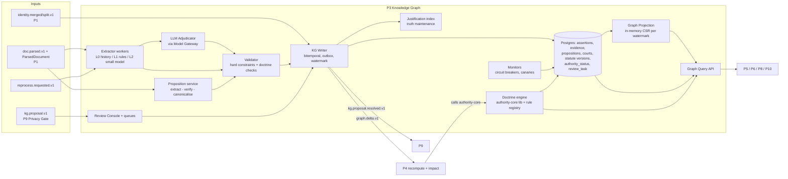
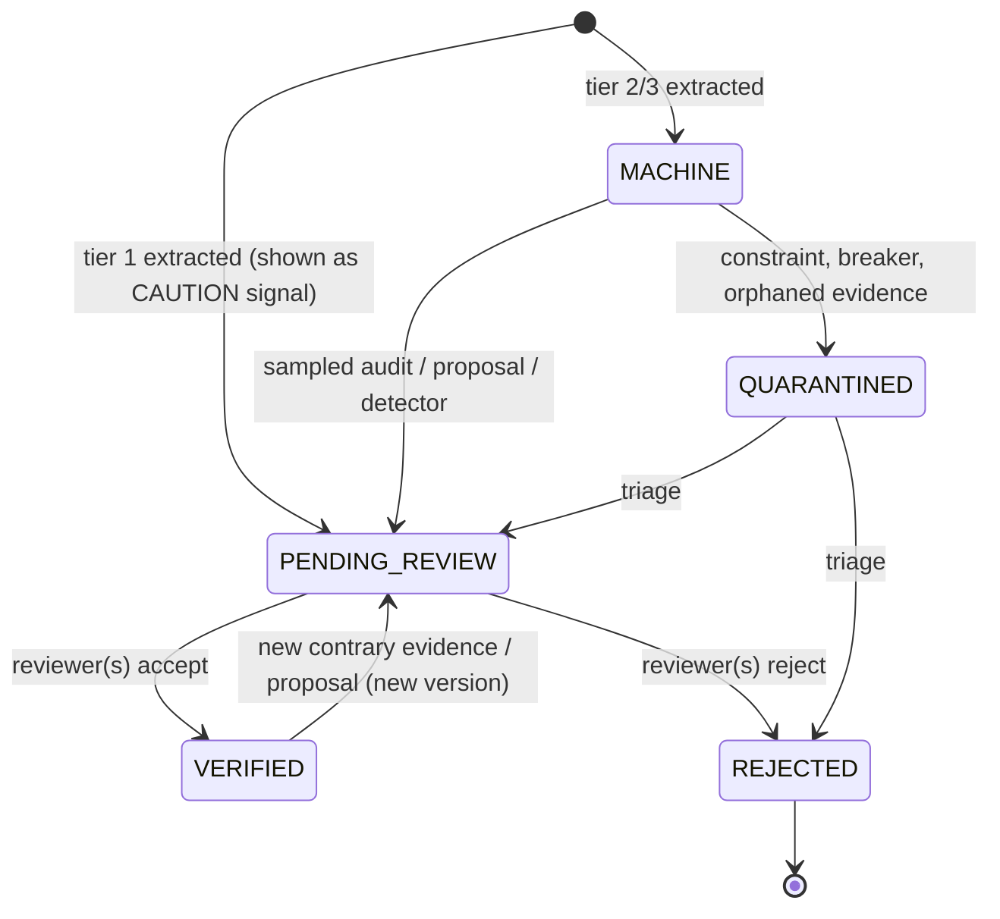

# P3 — Self-Enriching Legal Knowledge Graph

**Abstract.** P3 is the platform's memory of *what the law says about the law*: which judgment follows, distinguishes, doubts or overrules which holding; which provision was in force on which date, and in which state; which judgment struck down or read down which provision; how an IPC section corresponds to a BNS section; and which appellate order affirmed or reversed which lower-court decision. Its unit is not an edge but a **reified, bitemporal, evidence-anchored Assertion** (spine §F). Every edge carries a paragraph-level quote, a method and version, a calibrated confidence, a review state and an impact tier. On top of the assertions sits a **doctrine engine**: versioned, citable rules for Article 141, bench strength, per incuriam, pending references, stays, SLP dismissals and prospective overruling. It turns assertions into `AuthorityStatus` and `binding_on_forum` answers that P5, P6, P8 and P10 read without calling an LLM. The published evidence drives six choices. (1) Commercial legal RAG tools still cite overruled or inapplicable authority, and the root cause is "authority-hierarchy blindness" [P3-1]. (2) Frontier LLMs classify precedent treatment only 68–79% accurately [P3-13]. (3) The leading US citators each miss or mislabel between a third and over two-thirds of negative citing relationships [P3-14]. (4) Knowledge-graph-only RAG underperforms hybrid RAG on legal QA [P3-5]. (5) LLM-built graphs hallucinate and omit triples [P3-11]. (6) Graph engines that let "newer facts win" automatically [P3-10] are wrong for law, where a later, smaller bench cannot overrule a larger one [P3-51]. The design is therefore **schema-first, not open-extraction**. It uses a cost cascade (deterministic rules → distilled small classifier → premium LLM adjudicator → human editor), with premium spend concentrated on the ~5% of citations where an error could change a legal conclusion. It is **Postgres-first**: a bitemporal assertion store serves as system of record, with an in-memory graph projection for traversal and personalised PageRank. The graph database is a replaceable read model, not the source of truth. Self-enrichment comes from every new document (forward and backward treatment), from "attestation" sentences in later judgments that report earlier overrulings, from parser and model upgrades, and from lawyer feedback that arrives only as privacy-gated `kg.proposal.v1` proposals [P9 doc]. Errors are caught by integrity constraints, doctrine checks, statistical circuit breakers and sentinel canaries. A JTMS-style justification index lets any retraction cascade to the statuses, alerts and answers that depended on it. Items tagged **[NOVEL — unvalidated]** are our own inventions.

---

## 1. Purpose and scope

**Purpose.** P3 maintains the Public Legal Corpus (PLC) knowledge graph and answers four questions for every other phase:
1. *Is this authority still good law, and for which proposition?* (`AuthorityStatus`, as of a date, bench-strength aware.)
2. *Does it bind this forum?* (`binding_on_forum`.)
3. *What did this provision say, and was it valid and in force, on date D, in state S?* (point-in-time statute graph + validity.)
4. *What corresponds to what across the old and new criminal codes, and does precedent carry over?* (`CORRESPONDS_TO` crosswalk.)

**In scope.**
- The ontology: node types, predicates with domain, range and cardinality, and qualifiers.
- Assertion construction from `doc.parsed.v1`: citation treatment, proposition extraction and proposition-level treatment, direct history on case lineage, statute↔judgment links, and statute↔statute events.
- Bitemporal versioning.
- The doctrine engine, which covers the AuthorityStatus algorithm and `binding_on_forum` logic. It is a P3 library. P4 schedules recomputation, and P3 stores and serves the results.
- The criminal-code crosswalk.
- Self-enrichment, error detection, quarantine and truth maintenance.
- HITL queues and SLAs.
- The Graph Query API, storage schema, database choice, and scale and cost.
- Emission of `graph.delta.v1`.

**Out of scope (owned elsewhere).**
- Fetching (P0).
- Parsing, anchors, citation *resolution* and `identifier_alias`. P1 is the sole writer. P3 only *proposes* alias fixes via review tasks (P1 doc §2).
- Chunks and indexes (P2).
- Propagation to matters and alerts (P4/P7).
- Ranking (P5).
- Tenant data. P3 never stores tenant IDs, matter IDs or private anchors. P7's private overlay graph uses the same assertion shape in the tenant boundary (P7 doc §2.3.4).
- Price tables (13_cross_cutting).
- Final legal verification of doctrine statements (21_india_specific_legal_data, which P3's rule registry cites).

**Design principles.**
- **P-1 Evidence or nothing.** No assertion without ≥1 evidence anchor whose `quote_hash` matches current anchor text. The only exception is `IMPORT` of official tables, which cite the official document's anchor.
- **P-2 Doctrine is code, and code is cited.** Every rule that turns assertions into status or binding force is versioned and carries the anchor IDs of the authority that establishes it.
- **P-3 Asymmetric safety.** A *possible* negative treatment is shown immediately as "under review" and never silently withheld. A *definitive* negative requires human verification for impact tier 1.
- **P-4 Append-only truth.** Corrections are new versions (bitemporal). Nothing is updated in place, so any past answer can be replayed.
- **P-5 Schema-first extraction.** A closed predicate vocabulary is populated from P1's structured citations and statute mentions. There is no open-ended "entity/relation" LLM extraction over the corpus.
- **P-6 Engine-agnostic.** Consumers talk to the Graph Query API only. Storage engines are replaceable read models.

---

## 2. Input and output contracts

### 2.1 Inputs

| # | Input | Producer | What P3 uses |
|---|---|---|---|
| I1 | `doc.parsed.v1` + `ParsedDocument` | P1 | Spine fields: `work_id`, `case_id`, `expression_key`, `manifestation_id`, `doc_type`, `metadata`, `citations[]` (CitationMention), `quality{ocr_conf, lang, structure_conf, needs_review}`, `pipeline_version`. Fields below that are **not in spine §G/§H** are P1-proposed additions that P3 depends on (see S3-6): `work_id_status`, `case_id(s)`, `doc_type`, `metadata` (court_id, bench judges, bench_strength, decision_date, opinions[] with majority/concurring/dissent), `citations[]` (CitationMention incl. `pin.cited_anchor`, `context.{rhetorical_role, speaker, cue_spans}`, `temporal_check`, `resolution_confidence`), `StatuteMention[]` incl. `correspondence_hint`, `AmendmentInstruction[]`, `quality.gate` (PASS/FLAGGED/QUARANTINED), `supersedes_parse_id`, `anchor_changes`, `pipeline_version` (P1 doc §2.2–2.3) |
| I2 | Anchors table (read) | P1 | `text`, `text_hash`, `rhetorical_role`, opinion prefix `o{n}.` (P1 spine change S1) for evidence validation |
| I3 | `identity.merged.v1` / `identity.split.v1` | P1 (proposed S4) | re-point assertions (new versions) and recompute affected statuses |
| I4 | `kg.proposal.v1` (`KgProposal`) | P9 via Privacy Gate | review tasks; never auto-applied (P9 doc §2.4) |
| I5 | `reprocess.requested.v1` | P4 / P9 / ops | scope selector → re-run the cascade with a target `pipeline_version` |
| I6 | `training.dataset.published.v1` | P9 | manifests for re-training the treatment / proposition classifiers |
| I7 | Official correspondence tables (IPC→BNS, CrPC→BNSS, IEA→BSA) | P0/P1 as parsed documents | `IMPORT` assertions for `CORRESPONDS_TO` (source documents to be catalogued in 21_india) |
| I8 | Court registry (courts, benches, territorial jurisdiction, hierarchy) | P3-owned reference data, editor-maintained | doctrine engine |

**Hard input rules.**
1. If `quality.gate = QUARANTINED`, P3 derives no impact-tier-1 assertion from the document. It may still write `CITES` (tier 3, `review_state=QUARANTINED`) (P1 doc §2.2).
2. If `work_id_status = PROVISIONAL`, assertions are written against the provisional ID and re-pointed on `identity.merged.v1`.
3. If `speaker ∈ {COUNSEL_*, LOWER_COURT}`, the mention yields `CITES` with `qualifiers.speaker` only. It is **never** a court treatment. Magesh et al. document that tools conflate litigants' arguments with court holdings [P3-1].
4. A mention in a dissenting opinion never creates a treatment by the court. It yields `CITES` with `qualifiers.opinion_role=DISSENT`.
5. **One authoritative expression per Work** *(added in independent review)*. Assertions are extracted only from the expression P1 marks as the language of the pronounced judgment (`metadata.authoritative_expression_key`; P1 dependency, S3-6). A translated expression (e.g. `hi` of an English SC judgment, or `en` of a Hindi HC judgment) never creates new assertions. Its mentions are matched to the authoritative expression's mentions by anchor alignment and may only add `role=CONTEXT` evidence. Without this rule, every translation would double-count treatments and inflate `depth`.
6. **Source trust** *(added in independent review)*. Tier-1 assertions are derived only from manifestations whose `source_id` is in P0's `official` trust class (court portals, India Code, Gazette). A document seen only on an unofficial mirror yields tier-2/3 assertions plus a `source.recheck.requested.v1` for the official copy. This blunts forged or doctored "judgments".
7. **Low-confidence resolution with a hard-negative cue** *(added in independent review)*. A mention with `resolution_confidence < τ_res` is not dropped when its context contains a hard-negative or attestation cue (§5.4). It opens a `TIER1_TREATMENT` review task that carries `candidates[]`. If the top candidate's probability is ≥ 0.8, it also emits `NEGATIVE_SIGNAL_UNDER_REVIEW` on that candidate. Dropping such a mention would violate P-3 (bad OCR of a party name is exactly when this happens).

### 2.2 Outputs

**O1 — `graph.delta.v1`** (spine §G; additive fields marked `+`):
```jsonc
{
  "id": "01J…(ULID)", "specversion": "1.0", "time": "2026-09-30T10:15:02Z", "schema_version": "1.1.0",
  "type": "graph.delta.v1", "source": "p3/kg-writer@1.4.0", "subject": "wrk_01J…",
  "traceparent": "00-…", "causation_id": "<id of the doc.parsed.v1 / review / proposal event>",
  "idempotency_key": "p3|<cause_ref>|<graph_watermark>", "tenant_id": null,
  "data": {
    "delta_id": "gdl_01J…",
    "+graph_watermark": 918273645,               // monotonic int64; every read returns the watermark it saw
    "+cause": { "kind": "DOC|REVIEW|PROPOSAL|REPROCESS|RULE_CHANGE|IDENTITY", "ref": "prs_…|rvw_…|kgp_…" },
    "assertions_added": [ { "assertion_id": "asr_…", "subject": "wrk_B", "predicate": "OVERRULES",
        "object": "wrk_A", "qualifiers": { "proposition_id": "prp_…" }, "impact_tier": 1,
        "review_state": "PENDING_REVIEW", "confidence": 0.93, "valid_from": "2023-12-13" } ],
    "retracted":  [ { "assertion_id": "asr_…", "reason": "REVIEW_REJECTED|SOURCE_RETRACTED|IDENTITY_SPLIT|CONSTRAINT" } ],
    "superseded": [ { "old": "asr_…", "new": "asr_…", "change": "CONFIDENCE|REVIEW_STATE|VALID_TIME|OBJECT" } ],
    "status_changes": [ { "target_id": "wrk_A|prp_…|wrk_ITACT2000#sec-66A", "old": "GOOD", "new": "CAUTION",
        "+definitive": false, "+reason_codes": ["NEGATIVE_SIGNAL_UNDER_REVIEW"],
        "reason_assertion_ids": ["asr_…"], "+valid_from": "2023-12-13" } ],
    "+manifest_uri": null                        // set when the delta exceeds 1 MB (bulk reprocess)
  }
}
```
Consumers: P4 (impact detection), P5 caches (authority features), P8 (BAD_LAW checks), and P7 (badge refresh only). Ordering: per-subject ordering by `graph_watermark`. Consumers must be idempotent (spine §G).

**O2 — `kg.proposal.resolved.v1`** (new; P3 → P9): `{proposal_id, decision: ACCEPTED|REJECTED|MERGED|DEFERRED, resulting_assertion_ids[], reviewer_role, decided_at}`. P9 needs it to emit `feedback.resolved.v1` to the lawyer (P9 doc §2.2). It carries no tenant IDs.

**O3 — `reprocess.requested.v1`** (P3 → P1): when P3 detects a probable parse or resolution error. Examples: `temporal_check=CITED_AFTER_CITING`; a treatment whose evidence quote no longer matches; clusters of unresolved mentions pointing to the same missing work.

**O4 — Graph Query API** (synchronous, read-only; §5.12). It includes `AuthorityView`, which P5 needs as `authority_batch` (P5 doc §2, change 6) and P6 as `authority_status`, `binding_on_forum`, `crosswalk`, `provision_text` (P6 doc §2).

**O5 — `AuthorityStatus` store.** Rows are computed by the P3 doctrine library, recompute is triggered by P4, and results are served by P3.

**Core output object — `AuthorityView`** (proposed addition to spine §H, because P5, P6, P8 and P10 all consume it):
```ts
type AuthorityView = {
  target_id: string;                 // wrk_… | prp_… | provision anchor (wrk_…#sec-…)
  status: "GOOD"|"CAUTION"|"NEGATIVE"|"PARTIAL_NEGATIVE"|"UNKNOWN";
  definitive: boolean;               // true only if every reason assertion is VERIFIED (or tier ≥2 MACHINE above threshold)
  reason_codes: ReasonCode[];        // e.g. OVERRULED, OVERRULED_IN_PART, PER_INCURIAM, REVERSED, STAYED, PENDING_REFERENCE,
                                     // DOUBTED_BY_EQUAL_OR_LARGER_BENCH, RELIES_ON_OVERRULED, LEGISLATIVELY_OVERRIDDEN,
                                     // STRUCK_DOWN, READ_DOWN, NOT_IN_FORCE_ON_DATE, NEGATIVE_SIGNAL_UNDER_REVIEW,
                                     // PROSPECTIVE_OVERRULING_SAVES, COVERAGE_GAP
  reason_assertion_ids: string[];
  status_confidence: number;         // calibrated P(status is not worse than shown)
  status_mode: "CURRENT"|"HISTORICAL";
  binding_on_forum?: "BINDING"|"PERSUASIVE"|"NOT_BINDING"|"UNDETERMINED";
  binding_basis?: { rule_ids: string[]; authority_anchor_ids: string[]; contested: boolean };
  court_level: "SC"|"HC"|"TRIBUNAL_APPELLATE"|"TRIBUNAL"|"DISTRICT"|"STATUTE"|"CONSTITUTION";
  court_id?: string; bench_strength?: number; decision_date?: string;
  treatment_summary: Record<Predicate, number>;   // counts of verified+machine treatments by predicate
  graph_watermark: number;
};
```

**Core output object — `Assertion` wire form** *(added in independent review)*. This is what `assertions_added[]` (in full-payload mode), `GET /v1/assertions/{id}` and the citator endpoints return. It is spine §F verbatim, plus the S3-1 additions (marked `+`). The storage columns in §5.3 map one-to-one: `valid_period` = `[valid_from, valid_to)`, `tx_period` = `[recorded_at, superseded_at)`, and `method_id` is joined to `method_version` to produce `method{}`.
```jsonc
{
  "assertion_id": "asr_01J…", "subject": "wrk_B", "predicate": "OVERRULES", "object": "wrk_A",
  "qualifiers": { "proposition_id": "prp_…", "citing_anchor": "wrk_B/en#p112", "cited_anchor": "wrk_A/en#p58",
                  "issue_ids": ["iss_…"], "+speaker": "COURT", "+opinion_role": "MAJORITY",
                  "+effect": "RETROSPECTIVE", "+effective_from": null, "+territory": null, "+proposal_ids": [] },
  "valid_from": "2023-12-13", "valid_to": null,
  "recorded_at": "2026-09-30T10:15:02Z", "superseded_at": null,
  "confidence": 0.93,
  "evidence": [ { "anchor_id": "wrk_B/en#p112", "span": [0, 187], "quote_hash": "sha256:…", "+role": "PRIMARY" } ],
  "method": { "kind": "MODEL", "name": "kg.treatment.adjudicate", "version": "3.2.0", "prompt_hash": "sha256:…" },
  "review_state": "PENDING_REVIEW", "impact_tier": 1,
  "+logical_key": "sha256:…", "+version": 1,
  "+justification": { "kind": "EXTRACTED", "rule_id": null, "from_assertion_ids": [] },
  "+extraction_run_id": "xrn_…", "+graph_watermark": 918273645
}
```

### 2.3 Date semantics (to settle an ambiguity in the spine)

The spine gives every query `as_of_legal_date` and `as_known_at` (§E), and P5 asks P3 to resolve the split (P5 doc §2, change 6). P3 defines it as follows:
- **Statute text and validity**: evaluated at `as_of_legal_date` (the law on the date of the cause of action or procedural step), restricted to assertions with `recorded_at ≤ as_known_at`.
- **Precedent status** in `status_mode=CURRENT` (the default for litigation): evaluated at `status_date = as_known_at` (default now). This reflects the declaratory, retrospective effect of overruling. It has one exception: an `OVERRULES` assertion with `qualifiers.effect=PROSPECTIVE, effective_from=E` does not make the overruled work `NEGATIVE` for `as_of_legal_date < E`. It returns `CAUTION` with `PROSPECTIVE_OVERRULING_SAVES`. (The doctrine's scope is for 21_india to confirm.)
- **`status_mode=HISTORICAL`** answers "what was the status on D?" (research and audit). It evaluates precedent status at `as_of_legal_date`.

### 2.4 Proposed spine changes

| # | Target | Change | Justification |
|---|---|---|---|
| S3-1 | §F Assertion | Add `logical_key` (hash of subject, predicate, object, proposition, citing_anchor), `version`, `justification{kind: EXTRACTED\|DERIVED\|ATTESTED\|HUMAN\|IMPORT, rule_id?, from_assertion_ids[]}`, `extraction_run_id`; qualifiers `speaker`, `opinion_role`, `effect` (`RETROSPECTIVE\|PROSPECTIVE`), `effective_from`, `change_type`, `territory`, `proposal_ids[]` (P9's §2.5-7) | Truth maintenance needs justifications so retractions can cascade (§5.9). `logical_key` groups versions of "the same claim" for bitemporal integrity. Speaker and opinion role stop counsel's arguments and dissents from becoming court treatment [P3-1]. `territory` is needed for state amendments. |
| S3-2 | §F AuthorityStatus → `AuthorityView` (§2.2) | Add `definitive`, `reason_codes[]`, `status_confidence`, `status_mode`, `binding_basis`; add `UNDETERMINED` to `binding_on_forum` | Without `definitive`, P10 cannot show "under review" honestly, and P8 cannot distinguish a verified BAD_LAW from a machine signal. Returning PERSUASIVE when the forum or court metadata is unknown would mislead. |
| S3-3 | §G events | Add `kg.proposal.resolved.v1` (P3→P9); `graph.delta.v1` gains `graph_watermark`, `cause`, `status_changes[].definitive/reason_codes/valid_from`, `manifest_uri` | Closes P9's feedback loop. The watermark gives read-your-writes and staleness checks (P5 `graph_watermark`, P8 revalidate). |
| S3-4 | §F predicates (P3-owned ontology; listed because P5/P6/P8 consume them) | Add `HOLDS`, `OBSERVES`, `RELIES_ON`, `RESTATES`, `ANSWERS_REFERENCE`, `DISMISSES_IN_LIMINE`, `RECALLS`, `DECLARES_SUB_SILENTIO`, `ATTESTS_TREATMENT` (evidence-only), `NO_COUNTERPART_IN`, `PRECEDENT_CARRIES_TO` (derived), `IN_FORCE_IN` (territorial extent); rename nothing | See §5.2. `DISMISSES_IN_LIMINE` records that a non-speaking SLP dismissal is *not* an affirmance (no merger) [P3-52]. Without it, the history is ambiguous. |
| S3-5 | §B IDs | Add prefixes `prp_` (Proposition, already in §F), `lga_` (LegislativeAction), `crt_` (Court), `bnc_` (Bench), `jdg_` (Judge), `iss_` (public IssueTopic), `rvw_` (ReviewTask), `rul_` (DoctrineRule), `ter_` (Territory), `xrn_` (extraction run) | Stable IDs for nodes the spine references but does not name. |
| S3-6 | §G/§H (dependencies, not P3-owned) *(added in independent review)* | P3 consumes events and fields that are **proposed by sibling docs, not yet in the spine**: `identity.merged.v1`/`identity.split.v1` (P1 S4); `doc.parsed.v1` fields `work_id_status`, `quality.gate`, `supersedes_parse_id`, `anchor_changes`, `AmendmentInstruction[]`, `metadata.authoritative_expression_key`, `CitationMention.context{speaker, rhetorical_role, cue_spans}` and `temporal_check` (P1); `kg.proposal.v1`, `training.dataset.published.v1` and `source.recheck.requested.v1` (P9) | Before this review these fields were used silently. If the spine owner rejects any of them, the fallback is as follows. Without `speaker`, every treatment goes to L3 with a "who is speaking" field. Without `quality.gate`, P3 derives it from `quality.needs_review` and `ocr_conf < 0.8`. Without the identity events, P3 polls P1's alias table. |
| S3-7 | §C anchors *(added in independent review)* | Formalise the **expression-independent provision reference** `{work_id}#{fragment}` (e.g. `wrk_…#sec-302`) as a legal ID for Provision nodes, crosswalk rows and `status_changes.target_id`. It resolves to a concrete `anchor_id` via `@date` and territory. | Spine §C shows only the `@date` resolution form. Treatment of a provision (struck down, corresponds to) is about the provision across versions, not one expression. Using a versioned `anchor_id` would force N copies of every crosswalk row. |

---

## 3. State-of-the-art survey (with citations)

### 3.1 Graph-augmented RAG: general families
- **Microsoft GraphRAG** builds an entity knowledge graph with an LLM over the whole corpus. It then pre-generates community summaries and answers "global" sensemaking questions by map-reducing over them. It showed gains in comprehensiveness and diversity on ~1M-token datasets [P3-6]. Microsoft's own follow-up, **LazyGraphRAG**, defers LLM work to query time. Its indexing cost is reported as identical to vector RAG and 0.1% of full GraphRAG [P3-7]. This is direct evidence that whole-corpus LLM graph extraction is the expensive part.
- **LightRAG** uses dual-level (low- and high-level) graph and vector retrieval and claims an *incremental* update algorithm [P3-8].
- **HippoRAG 2** runs Personalized PageRank over an LLM-extracted phrase graph that is integrated with passages. It reports a ~7% gain on associative-memory tasks over a strong embedding model [P3-9].
- **Zep/Graphiti** keeps **bi-temporal edges** (`t_valid/t_invalid`, `t'_created/t'_expired`). When an LLM judges a new edge to contradict an overlapping older one, Graphiti invalidates the older edge by setting its `t_invalid` [P3-10]. The bitemporal edge model is exactly right for law. The "newer contradicting edge wins" policy is exactly wrong for law (§4).
- **LLM-built graph quality.** Ghanem and Cruz measure triple-level *hallucination* and *omission* in LLM-generated KGs. They report that fine-tuning reduces both, and they propose a BERTScore-based graph-similarity evaluation with a 95% matching threshold [P3-11]. (An earlier draft attributed a "GraphRefine" method to this paper. The abstract does not mention it, so that attribution has been removed.) A 2025 study asks whether LLMs are effective KG constructors at all [P3-12] *(snippet only)*. Either way, generated triples need verification before they carry legal weight.

### 3.2 Legal graph-RAG (including the papers the client named)
- **LegalGraphRAG** (Chen et al., ACL 2026) argues that a flat KG cannot separate facts, applied rules and abstract principles. It builds a *hierarchical* legal graph and adds a Researcher → Auditor → Adjudicator agent chain in which the Auditor verifies evidence against sources. It claims state of the art over GraphRAG baselines. The abstract gives no numbers [P3-2].
- **SBV-LawGraph** (ACIIDS 2026; State Bank of Vietnam documents) uses dual retrieval. A sparse–dense reranked text leg is combined with traversal of a *curated* legal KG of amendments, citations and definitions. Evaluated on ALQAC2025 and an SBV question set, it outperforms baselines [P3-3] *(snippet; full text not accessible)*.
- **SAT-Graph RAG** (de Martim; arXiv 2505.00039, v5 retitled "An Ontology-Driven Graph RAG for Legal Norms: A Structural, Temporal, and Deterministic Approach") grounds the graph in an LRMoo-style Work/Expression model. It represents temporal states as aggregations of *Component Temporal Versions* that reuse unchanged components, and it **reifies legislative events as first-class Action nodes**. Retrieval is deterministic and planner-guided, with point-in-time retrieval, hierarchical impact analysis and provenance reconstruction. It is demonstrated on the Brazilian Constitution and published at JURIX 2025 (IOS Press) [P3-4]. Our statute sub-graph adopts its Action-node and component-version ideas (§5.6).
- **Benchmarking KG-based RAG on legal documents** (Ongris et al., CEUR 2025) compared HippoRAG 2, Nano GraphRAG, LightRAG and LlamaIndex on EU directives and Indonesian regulations. **Hybrid modes (LightRAG mix, LlamaIndex hybrid) won. KG-only systems "often underperform"** because triples lose textual semantics [P3-5]. This confirms the brief's starting point: P3 is an *authority and structure* layer that P5 fuses with text retrieval. It is not a stand-alone retriever.

### 3.3 Legal ontologies and identifier standards
- **Akoma Ntoso v1.0** is an OASIS Standard (29 Aug 2018). It is the XML vocabulary for parliamentary, legislative and judicial documents [P3-31].
- **LRMoo v1.0** (IFLA, Dec 2024) supersedes FRBRoo 2.4 and expresses IFLA LRM (Work/Expression/Manifestation/Item) in object-oriented form compatible with CIDOC CRM [P3-32]. The spine's FRBR model (§B) is consistent with it.
- **ELI** is a URI template with a FRBRoo-based ontology, adopted after Council conclusions of Oct 2012 [P3-33].
- **ECLI** takes the form `ECLI:country:court:year:ordinal` (OJ 2011/C 127/01) [P3-34]. India's SC neutral citation (`2023 INSC …`) plays a similar role. HC formats are owned by P1/21_india.
- **LKIF-Core** is an OWL library of 15 modules, including norm, legal-role, legal-action and modification [P3-35].
- **LegalRuleML Core 1.0** is an OASIS Standard (Aug 2021) [P3-36].
- **W3C PROV-O** (Entity/Activity/Agent; `wasDerivedFrom`, `wasGeneratedBy`) is the provenance vocabulary we align `method` and `justification` to [P3-37].
- The "Lynx" legal KG project could not be verified in this session and is not relied on.

### 3.4 Citators: what "good law" products do
- **KeyCite** uses a red flag when a case is "no longer good law for at least one of the points of law" (e.g., reversed or overruled) and a yellow flag for some negative treatment. Its **Overruling Risk** flag warns when a case *relies on* a proposition from a case that was explicitly overruled, even though the overruling case never mentions it ("implied overruling") [P3-18][P3-19].
- **Shepard's** uses a red signal for strong negative history (overruled, reversed) and yellow for possible negative treatment (limited, criticised) [P3-20].
- **Accuracy is contested.** Hellyer examined 357 citing relationships that at least one of Shepard's, KeyCite or BCite labelled negative. Shepard's and KeyCite each missed or mislabelled about a third of the negatives, and BCite over two-thirds [P3-14]. A widely repeated summary of the full text says all three agreed only 53 times (≈ 85% without consensus). The abstract checked in review does not state this, so it is *(unverified — full text not accessed)*. A citator is a *probabilistic* product, and honest confidence plus visible evidence is a feature, not a weakness.
- **Open infrastructure.** CourtListener exposes a citation-lookup API over ~18.1M citations and parses them with **eyecite** [P3-21][P3-22]. It also computes *citation depth*, the number of times one opinion cites another, including short forms, *supra* and *id.* [P3-23].
- **India.** SCC Online marks overruled judgments with an exclamation mark in a red circle. A library guide says this indicates the case "has been overruled and is no longer considered good law". The guide does not say whether the symbol distinguishes whole from partial overruling [P3-24]. Manupatra's Manu Cite shows how many times a judgment has been cited and, per its training manual, "the treatment of the subject case in other cases is also depicted". Whether Authority Check or Case Map gives an explicit good-law or bad-law flag was not confirmed [P3-25]. CaseMine advertises a citator that shows whether a case is still good law [P3-26]. Indian Kanoon exposes "Cites / Cited by" counts without treatment types [P3-27]. No Indian product we found publishes proposition-level treatment, bench-strength-aware validity, confidence or evidence spans. That is the gap.

### 3.5 Treatment and overruling detection research
- **Overruling dataset** (Casetext + Stanford RegLab): 2,400 sentences, binary "is this sentence overruling a prior decision?" [P3-15]. It is used in CaseHOLD work [P3-17] and in LegalBench, which has 162 tasks [P3-16]. It is sentence-level and US-only, and it does not identify *which* case or proposition is overruled.
- **Demir & Canbaz (NLLP 2025)** built 239 expert-annotated citations with a multi-label treatment schema. The best high-level accuracy was 79.1% (Gemini 2.5 Flash), and the best fine-grained accuracy was 67.7% (GPT-5-mini). They propose an **Average Severity Error** metric because confusing *overruled* with *followed* matters more than confusing *explained* with *followed* [P3-13]. We adopt severity weighting for evaluation and for HITL priority.
- **Indian citation networks.**
  - **Hier-SPCNet** adds the statute hierarchy to the SC precedent-citation network and improves case-similarity estimation over citation-only networks [P3-28].
  - **LeCNet** (JUST-NLP 2025) releases an Indian citation graph for link prediction: 26,308 judgments and 67,108 citation edges [P3-29].
  - **IL-TUR** (ACL 2024) benchmarks Indian legal NLU tasks in English, Hindi and 9 Indian languages [P3-30].

  None of these models *treatment types*, bench strength or time.

### 3.6 Why legal RAG still fails: the evidence P3 answers
Magesh et al. (Stanford/Yale, preregistered, JELS 2025) measured the leading tools:

| Tool | Accurate | Hallucinated |
|---|---|---|
| Lexis+ AI | 65% | 17% |
| Westlaw AI-Assisted Research | 41% | 33% |
| Ask Practical Law AI | 19% | ≈17% ("over 1 in 6"; 62% incomplete) |

(The paper gives Westlaw's accuracy as 41% in the results and as 42% in the discussion [P3-1].)

Lexis+ AI presented *Planned Parenthood v. Casey*'s undue-burden standard as current law after *Dobbs* overruled it. The authors name **"inapplicable authority"** (wrong jurisdiction, overruled) and difficulty with **orders of authority** (binding vs persuasive, panel vs en banc) as root causes [P3-1]. These are status and hierarchy questions. A graph lookup can answer them deterministically before any LLM writes a word.

### 3.7 Graph storage landscape (facts verified this session)

| Engine | Relevant facts |
|---|---|
| Neo4j | Community Edition is GPLv3 [P3-42][P3-43]. Online backup and restore, autonomous clustering, RBAC, and property- and sub-graph access control are Enterprise-only. The current edition table lists multiple databases for all editions [P3-43]; an earlier draft wrongly listed them as Enterprise-only. |
| Memgraph | In-memory C++ engine. Community edition is under BSL, Enterprise under MEL [P3-46]. |
| ArangoDB | Moved from Apache 2.0 to BSL 1.1 at v3.12. Commercial use of Community Edition needs an agreement [P3-47]. |
| FalkorDB | SSPLv1. A Redis module that uses GraphBLAS sparse matrices [P3-48]. |
| Kùzu | Embedded; its repo was **archived on 10 Oct 2025** [P3-44]. |
| Apache AGE | A Postgres extension. Its homepage still headlines PG16 compatibility [P3-45]. |
| Spanner Graph | ISO GQL with full SQL interoperability; GCP-only [P3-49]. |
| PostgreSQL 18 | Released 25 Sep 2025. Adds temporal `PRIMARY KEY/UNIQUE … WITHOUT OVERLAPS` and `PERIOD` foreign keys, plus `uuidv7()` [P3-40]. |
| PostgreSQL 19 | At beta 4 (24 Sep 2026). Its release notes (as of 14 Sep 2026) do not list SQL/PGQ property-graph queries [P3-41]. |

Amazon Neptune, TigerGraph, NebulaGraph and JanusGraph could not be re-verified in this session (search budget exhausted). They are discussed only qualitatively and marked *(unverified)*.

### 3.8 Techniques we borrow
- **Truth-maintenance systems.** Doyle's JTMS (1979) and de Kleer's ATMS (1986) record *justifications* so that when a base belief is retracted, only its dependents are revisited ("dependency-directed backtracking") [P3-39].
- **Weak supervision.** Snorkel combines noisy labelling functions with a generative label model to train classifiers without hand labels [P3-38]. We use it to fuse rule cues, LLM labels and small-model votes.

---

## 4. Mistakes others made and how we avoid them

| System/paper | What went wrong | Evidence | How we avoid it |
|---|---|---|---|
| Lexis+ AI / Westlaw AI-AR | Cited overruled authority (*Casey* after *Dobbs*). Blind to orders of authority. | [P3-1] | `AuthorityView` is precomputed and attached to every retrieved item by P5. The P8 gate blocks `NEGATIVE` authorities used as support. `binding_on_forum` is deterministic doctrine code (§5.5). |
| Same study | Confused litigants' arguments with holdings | [P3-1] | P1 `speaker` and `opinion_role` gate treatment creation (§2.1 rules 3–4). |
| US citators (Shepard's, KeyCite, BCite) | ~⅓ (Shepard's, KeyCite) to >⅔ (BCite) of negative relationships missed or mislabelled; low three-way consensus. Opaque flags. | [P3-14] | Show the **evidence quote and method** for every flag. Keep a calibrated `status_confidence`. Maintain a partner-firm gold set with severity-weighted audits (§9). |
| KeyCite Overruling Risk | Good idea (implied overruling). US-only, work-level, and not bench-aware. | [P3-19] | Proposition-level **reliance risk** with bench-strength and forum awareness (§5.5 step 8) **[NOVEL — unvalidated]**. |
| Indian Kanoon; Manupatra Manu Cite | Indian Kanoon shows untyped "Cites / Cited by" counts. Manu Cite depicts treatment, but public guides show no proposition-level status, confidence or bench-validity check. | [P3-25][P3-27] | Typed, proposition-level treatments with status. |
| SCC Online | Work-level "overruled" symbol; public guides do not document partial-overruling granularity, confidence, evidence spans or bench-validity checks | [P3-24] | Evidence-first UI contract. Doctrine validation of every negative edge. |
| Microsoft GraphRAG-style open extraction | High indexing cost. LLM-invented entities and relations. | [P3-6][P3-7][P3-11] | Schema-first extraction seeded by deterministic citations. Premium LLM only on the ~5% high-stakes slice (§5.4). |
| KG-only RAG | Underperforms hybrid on legal QA | [P3-5] | P3 supplies authority features and structured expansion to P5's hybrid retrieval. It is never the sole retriever. |
| Zep/Graphiti | An LLM decides contradictions, and the newer edge invalidates the older one | [P3-10] | Precedence is decided by **doctrine** (court level, bench strength, date, speaker), never by recency or an LLM. A later co-equal bench's contrary view becomes `CONFLICTS_WITH` + CAUTION + review, not an overruling [P3-51]. |
| Frontier LLMs as citators | 67.7–79.1% treatment accuracy | [P3-13] | LLM output is one vote in a cascade. Tier-1 labels need human verification before they are shown as `definitive`. |
| Overruling dataset / LegalBench | Sentence-level "is overruling?" with no target case, proposition or bench | [P3-15][P3-16] | The label is `(citing work, cited work, proposition, predicate, evidence span)`. Targets are resolved via P1 pin cites. |
| Flat citation networks (PCNet, LeCNet) | Untyped, atemporal edges | [P3-28][P3-29] | Typed, bitemporal, reified assertions. The statute hierarchy is included, as in Hier-SPCNet's insight. |
| India Code-style texts and naive statute RAG | Text of a struck-down provision still retrievable as if valid. s.66A IT Act prosecutions continued after *Shreya Singhal* (2015) [P3-56]; the post-2015 PUCL orders could not be verified this session *(unverified)*. | [P3-56] | Every provision version carries **validity status** (`STRIKES_DOWN`/`READS_DOWN`) separate from its text. The API never returns provision text without its validity. |
| Generic "SLP dismissed = affirmed" data models | Treat non-speaking SLP dismissals as affirmance | [P3-52] | The `DISMISSES_IN_LIMINE` predicate has no merger effect and no status change. |

---

## 5. Recommended design, in detail

### 5.1 Architecture overview



Everything that writes goes through **one KG Writer**. It is the only holder of write credentials. It assigns `graph_watermark` in the same transaction as the assertion rows and the outbox row (transactional outbox). Everything that reads goes through the **Graph Query API**.

### 5.2 Ontology

**5.2.1 Node types** (IDs per spine §B plus S3-5)

| Node | ID | Owner | Key properties | Alignment |
|---|---|---|---|---|
| Work | `wrk_` | P1 creates, P3 annotates | `work_type` ∈ {JUDGMENT, ORDER, ACT, AMENDING_ACT, RULE, REGULATION, NOTIFICATION, ORDINANCE, CONSTITUTION, CONSTITUTIONAL_AMENDMENT}, court_id, bench_id, decision/enactment date, reportable flag | LRMoo F1 Work; AKN `FRBRWork` [P3-32][P3-31] |
| Case | `cas_` | P1 | forum court_id, case_type/no/year, CNR, diary no, parties | — (proceeding, not a document) |
| Expression / Manifestation / Anchor | per spine | P1 | language, temporal version, text, `text_hash`, bbox | LRMoo F2/F3; AKN eId |
| Provision (= statute anchor) | `wrk_…#sec-…` | P1 anchors; P3 versions | structural path, heading | ELI "subdivision" [P3-33] |
| ProvisionVersion | `(anchor, territory, valid_period)` | P3 | `expression_key` (`lang@date`), `text_hash`, validity status | SAT-Graph component temporal version [P3-4] |
| LegislativeAction | `lga_` | P3 | op ∈ {SUBSTITUTE, INSERT, OMIT, RENUMBER, REPEAL, SAVE, COMMENCE, STRIKE_DOWN, READ_DOWN}, source anchor, target anchor, enacted_on, effective_from, territory, old/new text hashes | SAT-Graph Action node [P3-4]; LKIF modification [P3-35] |
| Proposition | `prp_` | P3 | normalised text (≤ 50 words), source work, `opinion_role` (MAJORITY/CONCURRING), `kind` (RATIO/OBITER), anchors[], provisions[], issue_ids[], conditions, `canonical_group` | — (our core addition) |
| Court | `crt_` | P3 (editor-maintained) | level, parent courts, territorial jurisdiction (versioned; e.g. state reorganisations), seat benches | ECLI court code [P3-34] |
| Bench | `bnc_` | P3 | court_id, strength, judge_ids, `is_constitution_bench`, date | — `is_constitution_bench` = SC and strength ≥ 5 and (the order records a substantial question of constitutional interpretation or an Art. 143 reference). Art. 145(3) sets five judges as the minimum for those matters [P3-63]. Strength alone is not a proxy. |
| Judge | `jdg_` | P1 entity → P3 | name variants, courts served (dated) | — |
| Territory | `ter_` | P3 | India, state/UT codes, valid periods | — |
| IssueTopic | `iss_` | P3 (public taxonomy) | label, parent, synonyms | — |
| DoctrineRule | `rul_` | P3 | rule logic ref, version, `authority_anchor_ids[]`, `contested` | LegalRuleML-inspired [P3-36] |
| Assertion | `asr_` | P3 | spine §F + S3-1 | PROV-O Entity with `wasGeneratedBy` method activity [P3-37] |

Anchors, expressions and chunks are **referenced by ID, never copied** into the graph. The hot graph holds Works, Propositions, Provisions and Cases (§5.13). Paragraph anchors appear only as qualifiers and evidence.

**5.2.2 Predicates** (domain → range; cardinality; default impact tier; ✱ = new, per S3-4)

| Family | Predicate | Domain → Range | Card. | Tier | Required qualifiers / notes |
|---|---|---|---|---|---|
| Citation | `CITES` | Judgment → Work \| Provision | N:M, one per (citing, cited) pair | 3 | `depth` (mention count), `speaker`, `opinion_role`, pin `cited_anchor`s |
| Treatment + | `FOLLOWS` | Judgment → Judgment \| Proposition | N:M | 2 | `citing_anchor`, `proposition_id?` |
| | `APPLIES` | Judgment → Judgment \| Proposition | N:M | 2 | as above |
| | `EXPLAINS` | Judgment → Judgment \| Proposition | N:M | 3 | |
| | `RELIES_ON` ✱ | Judgment → Proposition | N:M | 2 | Derived when FOLLOWS/APPLIES occurs in a RATIO paragraph. Drives reliance risk. |
| Treatment − soft | `DISTINGUISHES` | Judgment → Judgment \| Proposition | N:M | 2 | Not negative per se |
| | `DOUBTS` | Judgment → Judgment \| Proposition | N:M | 1 if same court ≥ equal bench, else 2 | |
| | `NOT_FOLLOWED` | Judgment → Judgment | N:M | 2 | Typical HC ↔ other-State HC |
| | `CONFLICTS_WITH` ✱sym | Judgment ↔ Judgment | N:M | 1 (SC) / 2 | Created by doctrine check for co-equal disagreements |
| | `REFERS_TO_LARGER_BENCH` | Judgment(referring order) → Judgment \| Proposition | N:M | 1 | `question_anchor`; open until `ANSWERS_REFERENCE` |
| | `ANSWERS_REFERENCE` ✱ | Judgment → Judgment(referring order) | N:1 | 2 | Closes the reference |
| Treatment − hard | `OVERRULES` | Judgment → Judgment \| Proposition | N:M | 1 | `effect` (RETROSPECTIVE default \| PROSPECTIVE), `effective_from` |
| | `OVERRULES_IN_PART` | Judgment → Proposition (required) \| Judgment + `issue_ids` | N:M | 1 | |
| | `DECLARES_PER_INCURIAM` | Judgment → Judgment \| Proposition | N:M | 1 | `ground` (IGNORED_STATUTE \| IGNORED_BINDING_PRECEDENT). A decision given in ignorance of a statute or other binding authority is not binding [P3-58]. |
| | `DECLARES_SUB_SILENTIO` ✱ | Judgment → Proposition (required) | N:M | 1 | A later court holds that point X was decided without argument or consideration, so it is not binding precedent on X [P3-58]. The effect is proposition-scoped (§5.5.2). *(Added in independent review; the topic brief requires sub silentio.)* |
| Evidence | `ATTESTS_TREATMENT` ✱ | Judgment → Assertion | N:M | 3 | "X was overruled in Y". Evidence-only; strengthens Y OVERRULES X |
| Direct history | `APPEAL_OF` | Case → Case | N:M (batch appeals) | 2 | `stage` (APPEAL, SLP, REVISION, WRIT_APPEAL, LPA) |
| | `AFFIRMS` / `REVERSES` / `MODIFIES` / `SETS_ASIDE` / `REMANDS` | Judgment(appellate) → Judgment(impugned) | N:M | AFFIRMS 2; REMANDS 2; others 1 | Must lie on an `APPEAL_OF` path (hard constraint) |
| | `DISMISSES_IN_LIMINE` ✱ | Order → Judgment | N:1 | 2 | No merger and no status effect [P3-52] |
| | `STAYS` | Order → Judgment | N:M | 1 | `valid_to` = vacation or final disposal |
| | `RECALLS` ✱ | Order → Judgment \| Order | N:1 | 1 | |
| | `REVIEW_OF` / `CURATIVE_OF` | Case → Case | N:1 | 2 | Outcome via REVERSES/MODIFIES |
| Proposition | `HOLDS` ✱ | Judgment → Proposition | 1:N (each prp has one source) | 2 | `opinion_role=MAJORITY` required for RATIO |
| | `OBSERVES` ✱ | Judgment → Proposition | 1:N | 3 | Obiter |
| | `RESTATES` ✱ | Proposition → Proposition | N:M | 3 | Same holding in a later work |
| Statute–judgment | `INTERPRETS` | Judgment \| Proposition → Provision | N:M | 2 | `as_of` = version interpreted |
| | `STRIKES_DOWN` | Judgment → Provision | N:M | 1 | `territory` (HC), `effect` |
| | `READS_DOWN` | Judgment → Provision | N:M | 1 | Reading-down proposition required |
| | `UPHOLDS_VALIDITY` | Judgment → Provision | N:M | 2 | |
| | `LEGISLATIVELY_OVERRIDDEN_BY` | Proposition \| Judgment → LegislativeAction | N:M | 1 | Validation acts, substitutions |
| Statute–statute | `AMENDS` / `SUBSTITUTES` / `INSERTS` / `OMITS` | Provision(amending) → Provision(target) | N:M | 2 (IMPORT/RULE), 1 if MODEL-only | `lga_id`, `territory` |
| | `REPEALS` / `SAVES` | Provision → Work \| Provision | N:M | 1 | |
| | `COMMENCES` | Notification \| Provision → Work \| Provision | N:M | 1 | Staggered commencement |
| | `MADE_UNDER` | Rule \| Notification → Work \| Provision | N:1 | 3 | |
| | `IN_FORCE_IN` ✱ | Work \| Provision → Territory | N:M | 2 | Extent clauses, state amendments |
| Crosswalk | `CORRESPONDS_TO` | Provision(old code) → Provision(new code) | N:M | 1 | `change_type` (§5.7), `source` |
| | `NO_COUNTERPART_IN` ✱ | Provision → Work(other code) | N:1 | 1 | New or omitted offences |
| | `PRECEDENT_CARRIES_TO` ✱ derived | Proposition → Provision(new code) | N:M | 1 | §5.7, **[NOVEL — unvalidated]** |

Treatment exclusivity rule: for a given `(citing work, cited work, proposition)` triple there is **at most one current treatment assertion**. It is the most severe label supported, alongside the always-present `CITES`. Each assertion carries an explicit `negative_severity` (via the `predicate` table) used by the status lattice and by severity-weighted metrics [P3-13].

### 5.3 Storage schema (PostgreSQL 18, system of record)

```sql
CREATE EXTENSION IF NOT EXISTS btree_gist;

CREATE TYPE review_state AS ENUM ('MACHINE','PENDING_REVIEW','VERIFIED','REJECTED','QUARANTINED');

CREATE TABLE predicate (
  code text PRIMARY KEY, family text NOT NULL,           -- CITATION|TREATMENT|HISTORY|PROPOSITION|STATUTE_JUDGMENT|STATUTE|CROSSWALK
  domain text[] NOT NULL, range text[] NOT NULL,
  default_tier smallint NOT NULL, symmetric boolean NOT NULL DEFAULT false,
  negative_severity smallint NOT NULL DEFAULT 0          -- 0 none … 5 OVERRULES/REVERSES/STRIKES_DOWN
);

CREATE TABLE method_version (
  method_id serial PRIMARY KEY, kind text NOT NULL,     -- RULE|MODEL|HUMAN|IMPORT
  name text NOT NULL, version text NOT NULL, model_id text, prompt_hash text,
  pipeline_version text NOT NULL,
  state text NOT NULL DEFAULT 'ACTIVE'                  -- ACTIVE|SHADOW|BREAKER_OPEN|RETIRED
);

CREATE TABLE kg_commit (                                -- one row per writer transaction
  graph_watermark bigserial PRIMARY KEY, committed_at timestamptz NOT NULL DEFAULT now(),
  cause_kind text NOT NULL, cause_ref text NOT NULL, extraction_run_id text
);

CREATE TABLE assertion (
  assertion_id   text NOT NULL,                         -- asr_<ULID>; one per version
  logical_key    bytea NOT NULL,                        -- sha256(subject|predicate|object|proposition|citing_anchor)
  version        int  NOT NULL,
  family         text NOT NULL,
  subject_id     text NOT NULL,
  predicate      text NOT NULL REFERENCES predicate(code),
  object_id      text NOT NULL,
  proposition_id text, citing_anchor text, cited_anchor text,   -- hot qualifiers promoted to columns
  qualifiers     jsonb NOT NULL DEFAULT '{}',
  valid_period   daterange NOT NULL,                    -- legal-world validity [valid_from, valid_to)
  tx_period      tstzrange NOT NULL,                    -- belief period [recorded_at, superseded_at)
  confidence     real NOT NULL CHECK (confidence >= 0 AND confidence <= 1),
  method_id      int  NOT NULL REFERENCES method_version,
  review_state   review_state NOT NULL,
  impact_tier    smallint NOT NULL CHECK (impact_tier IN (1,2,3)),
  justification  jsonb NOT NULL,                        -- {kind, rule_id?, from_assertion_ids[]}
  graph_watermark bigint NOT NULL REFERENCES kg_commit,
  proposal_ids   text[],
  PRIMARY KEY (assertion_id, family)
) PARTITION BY LIST (family);
-- one partition per family; on each partition:
--   EXCLUDE USING gist (logical_key WITH =, tx_period WITH &&)   -- never two believed versions of one claim
--   INDEX (object_id, predicate) WHERE upper_inf(tx_period)       -- citator / status reads
--   INDEX (subject_id, predicate) WHERE upper_inf(tx_period)
--   INDEX (proposition_id) WHERE proposition_id IS NOT NULL
--   GiST (valid_period), BRIN (graph_watermark)

CREATE TABLE assertion_evidence (
  assertion_id text NOT NULL, ord smallint NOT NULL,
  anchor_id text NOT NULL, span int4range, quote_hash bytea NOT NULL,
  role text NOT NULL,                                   -- PRIMARY|ATTESTATION|CONTEXT|OFFICIAL_TABLE
  source_work_id text NOT NULL,
  PRIMARY KEY (assertion_id, ord)
);

CREATE TABLE assertion_dependency (                     -- justification index (truth maintenance)
  parent_assertion_id text NOT NULL, child_kind text NOT NULL,  -- ASSERTION|AUTHORITY_STATUS|PROPOSITION
  child_id text NOT NULL, rule_id text,
  PRIMARY KEY (parent_assertion_id, child_kind, child_id)
);

CREATE TABLE proposition (
  proposition_id text PRIMARY KEY, source_work_id text NOT NULL,
  kind text NOT NULL, opinion_role text NOT NULL,
  text_norm text NOT NULL, anchor_ids text[] NOT NULL, provision_anchor_ids text[],
  issue_ids text[], canonical_group text, confidence real NOT NULL,
  review_state review_state NOT NULL, method_id int REFERENCES method_version,
  tx_period tstzrange NOT NULL
);

CREATE TABLE provision_version (
  anchor_id text NOT NULL, territory text NOT NULL DEFAULT 'IN',
  valid_period daterange NOT NULL, expression_key text NOT NULL, text_hash bytea NOT NULL,
  lga_ids text[], validity text NOT NULL DEFAULT 'VALID',   -- VALID|STRUCK_DOWN|READ_DOWN|STAYED
  PRIMARY KEY (anchor_id, territory, valid_period WITHOUT OVERLAPS)   -- PG18 temporal key [P3-40]
);

CREATE TABLE authority_status (
  target_id text NOT NULL, status_mode text NOT NULL,          -- CURRENT|HISTORICAL
  valid_period daterange NOT NULL, tx_period tstzrange NOT NULL,
  status text NOT NULL, definitive boolean NOT NULL,
  reason_codes text[] NOT NULL, reason_assertion_ids text[] NOT NULL,
  status_confidence real NOT NULL, doctrine_version text NOT NULL, graph_watermark bigint NOT NULL,
  EXCLUDE USING gist (target_id WITH =, status_mode WITH =, valid_period WITH &&, tx_period WITH &&)
);

CREATE TABLE court (court_id text PRIMARY KEY, level text NOT NULL, parent_ids text[],
  territory_ids text[] NOT NULL, valid_period daterange NOT NULL, meta jsonb);
CREATE TABLE bench (bench_id text PRIMARY KEY, court_id text REFERENCES court, strength smallint NOT NULL,
  judge_ids text[] NOT NULL, is_constitution_bench boolean, sitting_date date);
CREATE TABLE doctrine_rule (rule_id text, version text, logic_ref text NOT NULL,
  authority_anchor_ids text[] NOT NULL, contested boolean NOT NULL, tx_period tstzrange NOT NULL,
  PRIMARY KEY (rule_id, version));

CREATE TABLE review_task (
  task_id text PRIMARY KEY, kind text NOT NULL,            -- TIER1_TREATMENT|HISTORY|VALIDITY|CROSSWALK|PROPOSITION|KG_PROPOSAL|QUARANTINE|DOCTRINE
  target_ids text[] NOT NULL, priority real NOT NULL, sla_due timestamptz NOT NULL,
  required_reviews smallint NOT NULL, state text NOT NULL, -- OPEN|IN_REVIEW|DISAGREED|ESCALATED|DONE
  decisions jsonb NOT NULL DEFAULT '[]', created_at timestamptz NOT NULL DEFAULT now()
);
```

A logical write is: close the current version (`tx_period = [recorded_at, now)`), insert the new version with the same `logical_key` and `version+1`, write evidence, dependencies and `kg_commit`, and write the outbox row. All of this happens in one transaction. `as_known_at` reads filter `tx_period @> :K`. "Current" reads use the partial indexes `upper_inf(tx_period)`.

### 5.4 Construction pipeline: the cost cascade

**Verdict on the brief's "premium models for KG construction, cheaper for serving".** It is **partly validated, and it needs refinement**.
1. *Serving* graph facts needs **no LLM at all**. Status, binding force, citators and crosswalks are indexed lookups. This is cheaper than any "cheap model" serving.
2. At *construction*, running premium LLMs on everything is wasteful and still not accurate enough. Frontier models reach only 68–79% on treatment [P3-13], and whole-corpus LLM graph building is the cost driver [P3-7]. Premium models should be used where **error cost × uncertainty** is highest, and their labels distilled into small models for the bulk.

**Per `doc.parsed.v1` (idempotent on `idempotency_key`):**
```text
on doc.parsed.v1(evt):
  pd  = load(evt.parsed_doc_uri); ctx = court/bench/date context from registry
  A   = []
  A  += L0_direct_history(pd, ctx)       # APPEAL_OF path + operative-order ('ord') outcome classifier
  for m in pd.citations with resolved_target_id and resolution_confidence ≥ τ_res (0.95):
      A += CITES(m)                                           # aggregate depth per (citing,cited)
      if m.context.speaker ≠ COURT or opinion_role(m) == DISSENT: continue
      A += cascade_treatment(m, ctx)                          # L1 → L2 → L3
      A += attestation(m)                                     # "X was overruled in Y" → evidence on (Y OVERRULES X)
  A  += statute_links(pd.statute_mentions, ctx)               # CITES → INTERPRETS / STRIKES_DOWN / READS_DOWN
  A  += legislative_actions(pd.amendment_instructions)        # AMENDS/SUBSTITUTES/… + ProvisionVersion rows
  if proposition_eligible(pd, ctx): enqueue(proposition_job(pd))
  A   = validate_hard(A)                  # §5.9 – reject or QUARANTINE
  A   = doctrine_check(A, ctx)            # e.g. "overruling" by a smaller bench → CONFLICTS_WITH + review
  A   = assign_review_state(A)            # tier-1 → PENDING_REVIEW (shown as CAUTION signal); else MACHINE
  commit(A)  →  graph.delta.v1 (outbox)   ; enqueue review_task for PENDING_REVIEW
```

```text
cascade_treatment(m, ctx):
  f = features(m)   # ±2 sentences, cue_spans, rhetorical_role, pin cite, both courts/benches/dates, lang, ocr_conf
  r = L1_rules(f)   # versioned lexicon + patterns; each rule has measured precision on gold
  if r.label ∈ POSITIVE_OR_NEUTRAL and r.precision ≥ 0.97 and not hard_neg_trigger(f): return emit(r)
  p = L2_small(f)   # fine-tuned encoder, calibrated distribution over ~12 labels
  if hard_neg_trigger(f, r, p) or entropy(p) > H_max or ctx.court == SC or f.lang ≠ 'en' or f.ocr_conf < 0.9:
      q  = L3_llm(f, allowed_labels, must_return_evidence_span=True)       # schema-constrained, tool-less
      q2 = L3_llm_alt_provider(f) if tier(q.label) == 1 else None          # heterogeneous second opinion
      y  = label_model.combine(r, p, q, q2)                                # Snorkel-style weights [P3-38], calibrated
  else: y = argmax(p)
  prp = map_to_proposition(m, y)   # pin cite ∈ prp.anchors → prp; else semantic match ≥ τ; else work-level
  return emit(y, prp, evidence=[m.context.sentence_anchor span], method=…)

hard_neg_trigger = any NEGATIVE/REFERENCE cue ∨ p(hard_negative) ≥ 0.02 ∨ citing bench > cited bench (same court)
                   ∨ citing is SC/HC-full-bench ∨ attestation pattern present
```

**Seed cue lexicon (English; to be measured on gold before use).**
- **Hard negative:** "overruled", "stands overruled", "does not lay down (the) correct/good law", "is not good law", "per incuriam", "wrongly decided". The 2023 seven-judge Stamp Act decision uses the heading "SMS Tea Estates and Garware Wall Ropes were wrongly decided" [P3-55].
- **Reference:** "refer(red) to a larger Bench", "place the papers before the Chief Justice".
- **Doubt:** "requires reconsideration", "we have our doubts".
- **Distinguish:** "distinguishable on facts", "stands on a different footing".
- **Positive:** "followed", "relied upon", "applied", "reiterated".
- **Attestation:** "which was (since) overruled in/by".

Hindi and regional cue lists will be built with the partner firm's bilingual reviewers. We do not invent them here. Until they exist, all non-English contexts route to L3 and then to review (§8).

**Cascade configuration (defaults; added in independent review).** Every symbol used above has a versioned default in `kg-cascade.yaml`. A change creates a new `method_version` and runs in SHADOW first. The values are starting points to be tuned on gold, not measurements.
```yaml
tau_res: 0.95              # min resolution_confidence for automatic assertions (else rule 7 in §2.1)
tau_res_hardneg_task: 0.60 # below this, a hard-negative mention only increments a "dangling negative" counter for P1
l1_auto_precision: 0.97    # L1 rule may emit alone only if measured precision on gold ≥ this
hardneg_p_trigger: 0.02    # L2 p(hard_negative) that forces L3
H_max: 0.9                 # L2 entropy (nats, over ~12 labels) above which L3 is called
ocr_conf_min: 0.90
tau_prop_match: 0.82       # cosine similarity for mapping a mention to a proposition when there is no pin cite
tau_show_machine: 0.70     # tier-2 MACHINE assertion counts toward status only above this calibrated confidence
signal_under_review: 0.50  # unverified tier-1 negative becomes a CAUTION signal at or above this
l3_daily_budget_usd: "2 × trailing-28-day median"   # hard cap per Model Gateway contract (see below)
```

**Processing ledger and re-derivation diff (added in independent review).**
- *Ledger.* `processed_event(idempotency_key PK, parse_id, graph_watermark, outcome)`. The consumer inserts the ledger row in the same transaction as the commit, so an at-least-once redelivery is a no-op.
- *Re-parse.* When `doc.parsed.v1` carries `supersedes_parse_id`, the cascade runs again, and the set of new assertions is keyed by `logical_key`. Each current EXTRACTED assertion from the old parse is handled as follows:
  - same `logical_key` and same content: untouched;
  - same key, changed label, confidence or evidence: new version;
  - key absent from the new set: retracted with `SOURCE_RETRACTED`. The exception is a `VERIFIED` assertion, which is **never** auto-retracted. It gets a `QUARANTINE` review task and stays in force until a human decides, because a parser regression must not silently undo editorial work.
- *L3 result cache.* L3 results are keyed by `sha256(context_text ‖ cited_work_id ‖ allowed_labels ‖ model_id ‖ prompt_hash)`. A re-parse that leaves the context text unchanged does not pay for L3 again. The cache is invalidated only when the model or prompt changes.
- *Budget guard.* Each Model Gateway contract (`kg.treatment.adjudicate.v1`, …) has a daily spend cap. At 80% of the cap, new L3 calls from `REPROCESS` causes pause; `DOC` causes continue. At 100% of the cap, tier-1 candidates skip L3 and go straight to the review queue as `NEGATIVE_SIGNAL_UNDER_REVIEW` (safe, but it costs reviewer time), and tier-2/3 candidates keep L2's label with `confidence` capped at 0.6. Such a breach is logged as an incident.

**Training data.**
- Gold: ~3,000 citing contexts double-annotated by partner-firm lawyers, stratified by court, era, language and label, with negatives over-sampled.
- Silver: ~50,000 L3 labels on a stratified sample.
- L2 is distilled from silver and validated on gold. It is re-trained from P9 `training.dataset.published.v1` manifests.

Volumes are planning targets, not measurements.

**Proposition extraction (async; eligible = all SC judgments with bench ≥ 2 that are reportable, all Constitution Benches, HC/tribunal decisions cited ≥ 5 times or reported).**
1. *Candidate paragraphs* come from the majority opinion with `rhetorical_role ∈ {RATIO, ANALYSIS}`, plus paragraphs that later judgments pin-cite. Later courts' pin cites reveal where the operative holding sits (**citation-pinned ratio**, **[NOVEL — unvalidated]**).
2. A mid-tier LLM extracts propositions `{text_norm ≤ 50 words, anchors[], provisions[], issue_ids[], conditions}`.
3. A *different* model checks that the quoted anchors entail each proposition. Unsupported propositions are dropped. Verbatim quotes are filled by reference, never generated.
4. Canonicalisation: find nearest existing propositions sharing a provision or issue, and let an LLM judge `RESTATES`.
5. Review: Constitution-Bench and larger-bench propositions are tier 1, because they drive statuses. Others are audited on a 5% sample.

**Statute links.** A `StatuteMention` by the court becomes `CITES(work → provision@as_cited_date)`. It is upgraded to `INTERPRETS` when the mention is in a RATIO or ANALYSIS paragraph *and* either interpretive cues are present ("must be construed", "the expression … means") or a proposition of the work lists the provision. `STRIKES_DOWN`/`READS_DOWN` require an operative-order cue ("declared unconstitutional", "struck down", "read down") and always go to tier-1 review.

**Direct history (L0, mostly deterministic).**
- P1 metadata ("arising out of judgment dated … in …", SLP/appeal numbers, CNR) builds `APPEAL_OF`.
- An operative-order classifier on the `ord` fragment maps "appeal allowed / dismissed / partly allowed / set aside / remanded" to AFFIRMS / REVERSES / MODIFIES / SETS_ASIDE / REMANDS.
- "Special leave petition dismissed" without reasons maps to `DISMISSES_IN_LIMINE`: no merger [P3-52].
- Interim "operation stayed" maps to `STAYS`, with `valid_to` open until disposal.

### 5.5 Doctrine engine: `binding_on_forum` and `AuthorityStatus`

The doctrine engine is a pure, deterministic library, `authority-core@semver`. Its inputs are assertions, the court and bench registry, and `DoctrineRule` rows. P3's API calls it on reads, and P4 calls it on recompute. Every rule has an ID, a version, `authority_anchor_ids` and a `contested` flag. Final doctrinal wording is owned by 21_india. The anchors below are what this session verified.

**5.5.1 `binding_on_forum(target, forum, as_of_legal_date)` decision table**

| Rule | Condition (target W → forum F) | Result | Authority / status |
|---|---|---|---|
| B0 | `AuthorityView(W).status = NEGATIVE` (or W's relevant proposition NEGATIVE) | NOT_BINDING | follows from status |
| B1 | W is SC (ratio); F is any court or tribunal in India other than SC | BINDING | Art. 141: "law declared by the Supreme Court shall be binding on all courts within the territory of India" [P3-50] |
| B2 | W is SC; F is an SC bench of strength *b* | bench(W) ≥ *b* → BINDING; bench(W) < *b* → PERSUASIVE (a larger bench may overrule) | *Dawoodi Bohra* (5 judges): a larger-strength decision binds benches of lesser or co-equal strength; a smaller bench cannot disagree and must seek reference [P3-51] |
| B3 | W is an SC *obiter* proposition; F below SC | PERSUASIVE, `contested=true` | weight of SC obiter to be settled in 21_india *(unverified here)* |
| B4 | W is HC(X); F is a court or tribunal subordinate to HC(X) in X's territory | BINDING | tribunal nuance: *L. Chandra Kumar* (7 judges) [P3-59] *(snippet)*; all-India tribunals `contested=true` |
| B5 | W is HC(X); F is an HC(X) bench of strength *b* | bench(W) ≥ *b* → BINDING, else PERSUASIVE | bench-strength logic by analogy to [P3-51]; HC-specific authority to be cited by 21_india |
| B6 | W is HC(X); F is HC(Y), courts under Y, or SC | PERSUASIVE | *(21_india to cite)* |
| B7 | W is an appellate tribunal (e.g., NCLAT); F is a subordinate tribunal bench (NCLT) | BINDING; coordinate-bench rules per tribunal config | per-tribunal `DoctrineRule`s, `contested` where unclear |
| B8 | W affirmed by a speaking appellate decision (merger) | binding force transfers to the appellate decision; W returns `superseded_by_merger` | *Kunhayammed* [P3-52] *(snippet)* |
| B9 | W's SLP was `DISMISSES_IN_LIMINE` | no change | *Kunhayammed*: a non-speaking dismissal attracts no merger and is not an Art. 141 declaration [P3-52] |
| B10 | W is subject to a pending `REFERS_TO_LARGER_BENCH` | unchanged binding, reason `PENDING_REFERENCE` | "reference to a larger Bench does not unsettle declared law" [P3-53] |
| B11 | W `STAYS`-ed by a superior court | BINDING + `contested=true`, reason `STAYED` | a stay suspends operation and does not wipe out the order [P3-54] *(snippet)*; precedential effect of stayed HC judgments to be settled in 21_india |
| B12 | W is a provision | BINDING if a ProvisionVersion is in force on `as_of_legal_date` in F's territory and validity ∈ {VALID, READ_DOWN}; else NOT_BINDING (unless `SAVES`) | statute graph §5.6 |
| B13 | Court or bench metadata of W or F unknown or low-confidence | UNDETERMINED | S3-2 |
| B14 | W is a dissent or counsel's argument | NOT_BINDING | §2.1 rules 3–4 |

**5.5.2 `AuthorityStatus` algorithm** (per Work or Proposition; bench-strength aware)
```text
authority_status(T, mode, as_of_legal_date D, as_known_at K = now):
  S  = K.date if mode == CURRENT else D                     # precedent status date (§2.3)
  R  = assertions where object ∈ {T} ∪ props(T) ∪ lineage(T), family ∈ {TREATMENT, HISTORY, STATUTE_JUDGMENT}
         and tx_period ∋ K and valid_from ≤ S and review_state ∉ {REJECTED}
  reasons = []
  for a in R:
     if not doctrine_valid(a): continue            # purported overruling by a lower/smaller bench is ignored here
     w = weight(a)                                 # VERIFIED → definitive; MACHINE tier≥2 ≥ τ_show; tier-1 unverified → signal
     switch a.predicate:
       OVERRULES | DECLARES_PER_INCURIAM:
            if a.effect == PROSPECTIVE and D < a.effective_from: reasons += CAUTION(PROSPECTIVE_OVERRULING_SAVES)
            elif a.proposition_id and ∃ other live RATIO props of T: reasons += PARTIAL_NEGATIVE(OVERRULED_IN_PART)
            else: reasons += NEGATIVE(OVERRULED | PER_INCURIAM)
       OVERRULES_IN_PART:                   reasons += PARTIAL_NEGATIVE
       REVERSES | SETS_ASIDE | RECALLS:     reasons += NEGATIVE(REVERSED)        # via case lineage
       MODIFIES | REMANDS:                  reasons += PARTIAL_NEGATIVE(MODIFIED)
       STAYS (valid at S):                  reasons += CAUTION(STAYED)
       REFERS_TO_LARGER_BENCH (unanswered): reasons += CAUTION(PENDING_REFERENCE)
       DOUBTS | CONFLICTS_WITH:             reasons += CAUTION if court(a.subject) == court(T) and bench ≥ bench(T)
                                            or court(a.subject) superior to court(T)
       NOT_FOLLOWED:                        reasons += CAUTION only if ≥2 such or from a larger bench (else note)
       LEGISLATIVELY_OVERRIDDEN_BY:         reasons += (NEGATIVE if D ≥ effective_from of the lga else none)
       DISTINGUISHES | DISMISSES_IN_LIMINE | AFFIRMS: no downgrade (AFFIRMS by speaking order → merger pointer)
     unverified tier-1 hard negatives with confidence ≥ 0.5 → CAUTION(NEGATIVE_SIGNAL_UNDER_REVIEW)   # P-3
  # reliance risk (KeyCite Overruling-Risk analogue, proposition-level)   [NOVEL — unvalidated]
  for p in RELIES_ON(T) where authority_status(p, …).status == NEGATIVE and T not itself treated on p:
     reasons += CAUTION(RELIES_ON_OVERRULED, confidence = conf(RELIES_ON) × conf(status(p)))
  status      = max_severity(reasons) or GOOD          # NEGATIVE > PARTIAL_NEGATIVE > CAUTION > GOOD
  if T unprocessed / provisional and reasons == []: status = UNKNOWN
  definitive  = all(r.assertion.review_state == VERIFIED or r.tier ≥ 2 for r in reasons(status))
  confidence  = calibrated(status, reasons)             # §5.11
  coverage    = feed freshness of courts able to treat T (from P4/P0 health) → add COVERAGE_GAP reason, no downgrade
  return AuthorityView(...)
```
`doctrine_valid` enforces two rules. An `OVERRULES` must come from a superior court, or from the same court with *larger* bench strength [P3-51]. A same-strength "overruling" is kept as `CONFLICTS_WITH` and sent to review.

Statuses are materialised as **valid-time segments**. For example, *N.N. Global* (5 judges, 2023) is GOOD from its decision date until 13 Dec 2023, when a seven-judge bench overruled it [P3-55], and NEGATIVE thereafter. HISTORICAL reads are then a range lookup. P4 recomputes the segments for every `status_changes` target.

### 5.6 Temporal statute model (point-in-time)
- **Versions.** `ProvisionVersion(anchor, territory, valid_period)` is enforced non-overlapping by a PG18 temporal key [P3-40]. Versions come from P1's `lang@date` expressions (India Code consolidated texts) *and* from replaying `AmendmentInstruction` → `LegislativeAction` on the prior version, as in SAT-Graph's action-driven component versions [P3-4]. If the replayed text and the consolidated text disagree (hash mismatch), a review task opens. The consolidated text is never silently trusted.
- **Commencement.** `COMMENCES` from notifications sets `effective_from` per provision (staggered commencement). A provision that was enacted but not yet commenced carries the flag `ENACTED_NOT_IN_FORCE`.
- **Territory.** State amendments to central Acts create territory-keyed versions. Resolution tries `(anchor, forum_state)` first and falls back to `(anchor, IN)`.
- **Ordinances.** `valid_to` is set when lapse or replacement is known (`REPEALS`/`SAVES` by the replacing Act). Otherwise it stays open with the flag `ORDINANCE_LAPSE_UNCOMPUTED` *(lapse rules per 21_india)*.
- **Retrospective amendments and late knowledge.** Both are native to the bitemporal model. `valid_from < recorded_at` is allowed. An `as_known_at` replay shows what we answered before we knew.
- **Validity overlay.** `STRIKES_DOWN`/`READS_DOWN` update `provision_version.validity` from the decision date. The text stays retrievable, but `provision_text()` always returns `{text, validity, reason_assertion_ids}`. This closes the "s.66A after *Shreya Singhal*" failure [P3-56]. Strike-downs by a High Court are territory-scoped with `contested=true` for central Acts *(21_india to settle)*.
- **API.** `resolve(anchor, date, territory) → ProvisionVersion` is a single indexed lookup.

### 5.7 Old ↔ new criminal-code crosswalk

**Model.** `CORRESPONDS_TO` links an old-code provision anchor to a new-code provision anchor at the **finest matching granularity** (sub-section or clause). It is many-to-many.
- Qualifiers:
  - `change_type` ∈ {IDENTICAL_TEXT, RENUMBERED_EQUIVALENT, NARROWED, WIDENED, PUNISHMENT_CHANGED, MERGED, SPLIT, PARTIAL_OVERLAP}
  - `diff_ref` (clause-level token diff of the two texts)
  - `source` ∈ {OFFICIAL_TABLE (IMPORT), JUDICIAL (P1 `correspondence_hint`, e.g. "now Section 103 BNS"), EDITORIAL, MODEL}
  - `valid_from = 2024-07-01`
- Provisions with no counterpart use `NO_COUNTERPART_IN` (new offences; omitted offences).
- All crosswalk rows are **tier 1**. They are `definitive` only when VERIFIED against an official table or by two editors.
- For scale: the BNS has 358 sections against the IPC's 511, with 20 new offences and 19 IPC provisions dropped [P3-60] *(secondary source)*.

**Verified seed examples (headings).**
- IPC s.302 "Punishment for murder" ↔ BNS s.103 "Punishment for murder".
- IPC s.303 ↔ BNS s.104 "Punishment for murder by life-convict".
- IPC s.304 ↔ BNS s.105 "Punishment for culpable homicide not amounting to murder" [P3-61].

Whether BNS s.103(2) adds new content, making `change_type` SPLIT or WIDENED, is *unverified* and left to editors. The brief's other examples (IPC 420→BNS 318, CrPC 438→BNSS 482, IEA 65B→BSA 63) are widely reported but **not verified in this session**. They enter as `source=MODEL, review_state=PENDING_REVIEW` until the official table is imported (21_india owns the official-table catalogue).

**Applicability engine.** `applicable_provisions({offence_date, fir_date, proceeding_stage, proceeding_started_on}, provisions[])` returns `{code, provision, rule_ids, contested}`.
- **Substantive law** follows the offence date. Before 1 July 2024 → IPC. The Art. 20(1) basis is to be cited in 21_india.
- **Procedure and evidence** follow the repeal-and-savings clauses (the brief cites BNSS s.531 and BSA s.170, *unverified here*). Where High Courts have split on pending investigations, the rule is `contested=true` and **both** answers are returned with their authorities. This is safer than choosing one.

**Precedent carry-over [NOVEL — unvalidated].** Suppose proposition P `INTERPRETS` old clause *o*, *o* `CORRESPONDS_TO` new clause *n* with `change_type ∈ {IDENTICAL_TEXT, RENUMBERED_EQUIVALENT}`, and the diff shows that the tokens P interprets are unchanged. Then derive `PRECEDENT_CARRIES_TO(P → n)` with confidence = min(conf(crosswalk), conf(P)) × diff_factor, tier 1. For NARROWED, WIDENED or PUNISHMENT_CHANGED the output is "partially carries — see diff" (CAUTION). The derived edge is *confirmed* as post-2024 judgments apply P while citing *n*: a `FOLLOWS` of P by a judgment whose statute mentions include *n* adds ATTESTATION evidence. P5 uses the crosswalk for bidirectional query expansion (`via_crosswalk`, P5 doc). P6 uses the applicability engine.

### 5.8 Self-enrichment loops
1. **Forward.** Each new judgment's own citations add its treatments of older works.
2. **Backward.** Later documents treat or decide on it: citing treatments, appellate outcomes (`APPEAL_OF` + outcome), references answered.
3. **Attestation mining.** A judgment's narrative ("*X*, since overruled in *Y*") becomes ATTESTATION evidence on `Y OVERRULES X`. If no such assertion exists, the sentence creates a candidate (tier 1, review). If *Y* is missing from the corpus, P3 emits `source.recheck.requested.v1` (the P9-proposed event) to P0. Several independent attestations raise confidence, which is how we find overrulings our own pipeline missed. **[NOVEL — unvalidated]** as a systematic citator signal.
4. **Consensus maps.** When treatments of the same proposition by different High Courts diverge (FOLLOWS vs NOT_FOLLOWED), the result is materialised as an "HCs divided" view for P5 and P10. There is no status downgrade outside the state.
5. **Implied-conflict miner [NOVEL — unvalidated].** A later larger-bench proposition on the same provision and issue that contradicts an earlier smaller-bench proposition *without citing it* becomes a `CONFLICTS_WITH` candidate. It is always sent for review and never auto-asserted. Detection uses provision/issue blocking, then an NLI contradiction model, then L3.
6. **Upgrades.** New parser, model or prompt versions run in SHADOW over a stratified sample plus sentinels. A diff report goes to P8. Promotion writes new assertion *versions*. Nothing is deleted.
7. **Lawyer feedback.** Only `kg.proposal.v1` enters, and it becomes review tasks, never direct writes. Accepted proposals produce `method.kind=HUMAN` assertions with `proposal_ids[]` and emit `kg.proposal.resolved.v1`.
8. **Parser feedback.** Anomalies (dangling pin cites, `CITED_AFTER_CITING`, quote-hash drift) emit `reprocess.requested.v1` to P1.
9. **Active learning.** Review decisions on public objects become gold and silver data for L2 (via P9 manifests), sampled toward high-entropy regions.

### 5.9 Error detection, quarantine and truth maintenance

**Hard constraints (at write; a violation rejects the assertion or sets QUARANTINED).**
- H1: domain and range per the `predicate` table.
- H2: the subject's decision date ≥ the object's for treatment, and `valid_from` ≥ the subject's date.
- H3: at least one evidence anchor exists and its `quote_hash` matches the current anchor text. Evidence lies in the subject work, except ATTESTATION and OFFICIAL_TABLE evidence.
- H4: direct-history predicates lie on an `APPEAL_OF` path.
- H5: no tier-1 assertion from a QUARANTINED document.
- H6: no self-loops.
- H7: crosswalk only between registered old-code and new-code pairs.
- H8: a treatment must have `speaker = COURT` and must not come from a dissent.

**Doctrine checks (relabel plus review).**
- D1: an "overruling" by a lower court, or by a smaller bench of the same court, is relabelled `DOUBTS`/`NOT_FOLLOWED`. An equal bench's "overruling" becomes `CONFLICTS_WITH` [P3-51].
- D2: an HC "overruling" another State's HC becomes `NOT_FOLLOWED`.
- D3: an SC reversal outside the case lineage is treated as `OVERRULES` (precedent), not `REVERSES`.

**Asynchronous detectors.**
- A1: OVERRULES cycles.
- A2: contradictory current labels on one `logical_key` family from different methods.
- A3: **circuit breakers.** For each (method_version × predicate × court), daily rate versus a 28-day baseline (CUSUM). On breach, the method state becomes `BREAKER_OPEN` and that window's new assertions become QUARANTINED pending triage.
- A4: **sentinel canaries.** About 300 verified landmark relationships, such as the 2023 Stamp Act overruling [P3-55], must be re-derived identically by any new method version before promotion (a P8 gate).
- A5: citing-consensus disagreement (we say GOOD; ≥ 2 later courts attest "overruled").
- A6: evidence orphaned by a re-parse. Re-anchor via `anchor_alias`, otherwise QUARANTINE.



Display policy (P-3). A QUARANTINED or PENDING *negative* with confidence ≥ 0.5 contributes `NEGATIVE_SIGNAL_UNDER_REVIEW`. A plausible negative is never hidden. Quarantined *positive* assertions are ignored.

**Truth maintenance (JTMS-style [P3-39]).** Every DERIVED assertion and every `authority_status` row records its parents in `assertion_dependency`. Derived assertions include `RELIES_ON`, `PRECEDENT_CARRIES_TO`, proposition inheritance and reliance-risk reasons. When an assertion is retracted or superseded:
1. The writer walks the children breadth-first up to depth 3.
2. A child left with no remaining justification is retracted.
3. The affected status targets go into `graph.delta.v1.status_changes` with `cause.kind=REVIEW`.
4. P4 turns those into alert *corrections*.

Cascades touching more than 10k targets move to the P4 batch lane with a single consolidated correction notice.

### 5.10 Human-in-the-loop: queues, roles, SLAs

**What goes to humans.**
- Every tier-1 assertion before it becomes `definitive`.
- Doctrine-check relabels.
- Consolidated-vs-replayed statute text mismatches.
- Crosswalk rows.
- Tier-1 propositions (Constitution Bench and larger benches).
- Every `kg.proposal.v1`.
- QUARANTINE triage.
- Changes to `DoctrineRule`s.
- A 2% weekly stratified audit of tier-2 MACHINE assertions.

**Policy exception (auditable).** Direct history (REVERSES/SETS_ASIDE/AFFIRMS) is auto-VERIFIED when *two independent sources agree*: the operative-order classifier and the official case-status disposal field. It is recorded as `method.kind=IMPORT`, and a 2% sample is audited. Disagreements go to review.

**Priority.** `priority = severity(label) × exposure × urgency × uncertainty`, where:
- severity comes from the predicate's `negative_severity`, following the Average Severity Error idea [P3-13];
- exposure = log(1 + citing count) + privacy-gated matter-usage bucket from P9/P4 (bucketed counts only, no tenant IDs);
- urgency = court level × recency;
- uncertainty = 1 − |2·conf − 1|.

**Roles.**
- **R1 legal analyst**: law graduate, tier-2 audits and routine tier 1.
- **R2 senior editor**: advocate, all SC/HC-larger-bench tier 1, doctrine relabels, crosswalk.
- **R3 panel**: partner-firm counsel, for disputes, contested doctrine and rule changes.

Two-person rule: SC hard negatives and all crosswalk rows need R1 plus R2 agreement. A disagreement escalates to R3.

**SLAs** (targets; staffing in §5.14).

| Item | SLA from P3 ingest |
|---|---|
| SC hard negative (OVERRULES, PER_INCURIAM, REFERS, STRIKES_DOWN, READS_DOWN) | 4 business hours; until then CAUTION `NEGATIVE_SIGNAL_UNDER_REVIEW` |
| HC larger/division-bench tier 1 | 1 business day |
| Other tier 1 | 3 business days |
| `kg.proposal.v1` | URGENT 1 day · HIGH 3 days · NORMAL 10 days |
| Crosswalk row changed by an amendment | 5 business days |

**Console.**
- Side-by-side citing and cited anchors with highlighted spans, rendered only from our own anchors and never from reporters' headnotes.
- Doctrine-check output, model votes and rationale.
- Keyboard labelling, a mandatory reason code when overriding a model, and "escalate".

**Quality control.** 5% hidden gold items. Per-reviewer accuracy is tracked, and tier-1 privileges require ≥ 95% on gold. Inter-annotator agreement (Cohen's κ) is tracked per predicate. Reviewer decisions flow to L2 training (§5.8-9).

### 5.11 Confidence calibration
- Machine confidences are calibrated per (predicate family × method × court level × language) with isotonic regression on the gold set. Calibration is re-fit on every method promotion. The target is ECE ≤ 0.05.
- `status_confidence(T)` approximates P(no undetected worse treatment) = Π over un-reviewed court-speaker citing mentions *i* of T of (1 − p̂ᵢ(hard-negative)) × coverage factor. VERIFIED reasons use reviewer accuracy on gold. **[NOVEL — unvalidated]** as a citator confidence display.
- P10 shows three bands (≥ 0.95, 0.80–0.95, < 0.80) and the evidence, never a bare flag. This responds directly to the finding that the major citators disagree on 85% of negatives [P3-14].

### 5.12 Graph Query API (read-only; gRPC + REST/JSON)

Every call accepts `as_of_legal_date`, `as_known_at?`, `status_mode?` and an optional `min_watermark`. Every response returns the `graph_watermark` it read. Pagination is cursor-based.

| Endpoint | Signature | Consumers | p95 SLO |
|---|---|---|---|
| `POST /v1/authority:batch` | `{ids[≤500], forum{court_id, bench_strength?, state?}, as_of_legal_date, as_known_at?, status_mode?} → AuthorityView[]` | P5 (`authority_batch`), P6, P8 (`revalidate`), P10 | 60 ms for 200 ids |
| `GET /v1/authority/{id}` | same as above for one id, plus the full reason chain with evidence | P6, P8, P10 | 30 ms |
| `POST /v1/binding` | `{target_id, forum, as_of_legal_date} → {binding_on_forum, basis{rule_ids, authority_anchor_ids, contested}}` | P5, P6 | 10 ms |
| `GET /v1/works/{id}/citing` | `?predicates=&court_level=&min_conf=&proposition_id=&cursor=` → treatments with evidence anchors (the citator) | P5, P10 | 150 ms |
| `GET /v1/works/{id}/cited` | outgoing citations with treatment | P5, P6 | 100 ms |
| `GET /v1/works/{id}/history` | case lineage with direct-history outcomes, merger pointer | P6, P10 | 80 ms |
| `GET /v1/works/{id}/propositions` / `GET /v1/propositions/{id}` | propositions with status, anchors, `RESTATES` group, treatments | P5, P6, P8 | 80 ms |
| `GET /v1/provisions/{anchor}` | `?date=&territory=` → `{version, text_ref, validity, in_force, lga timeline, reason_assertion_ids}` (= P6 `provision_text`) | P5, P6, P8 | 40 ms |
| `GET /v1/provisions/{anchor}/interpretations` | `INTERPRETS`/`STRIKES_DOWN`/`READS_DOWN` by works, with binding for the forum | P5, P6 | 150 ms |
| `GET /v1/crosswalk` | `?anchor=&direction=OLD_TO_NEW\|NEW_TO_OLD&date=` → `CORRESPONDS_TO` rows + `change_type` + diff + carry-over | P5, P6 | 40 ms |
| `POST /v1/applicable-provisions` | `{offence_date, proceeding_stage, proceeding_started_on, provisions[]}` → answers + rule_ids + contested | P6 | 50 ms |
| `POST /v1/traverse` | `{seeds[], predicates[], direction, max_depth ≤ 3, filters, limit ≤ 5,000}` → subgraph | P4 (impact), P5 (graph leg) | 300 ms (depth 2) |
| `POST /v1/ppr` | `{seeds[{id, weight}], predicates[], restart = 0.15, max_nodes}` → ranked nodes (HippoRAG-style [P3-9]) | P5 | 150 ms |
| `GET /v1/assertions/{id}` (+ `/justifications`, `?as_known_at=`) | audit replay | P8, P10, support | 50 ms |
| `GET /v1/deltas?after_watermark=` | pull fallback for `graph.delta.v1` | P4, caches | 200 ms |

Write paths are internal only: the extractor → KG Writer, and the review console → KG Writer. There is no external write API.

### 5.13 Graph database choice and projection

**Decision: PostgreSQL 18 is the system of record. An in-process, in-memory CSR "Graph Projection" serves traversal and PPR. Dedicated graph engines are optional, off-critical-path analytics exports.**

Reasons (full comparison in §6):
1. Our assertions are *reified, bitemporal, evidence-carrying claims*. In a property graph each one becomes a node, or a property-heavy edge that cannot be indexed on time ranges.
2. The hot queries are 1–3 hops with heavy filters (predicate, review state, time), which relational indexes and GiST ranges serve well. PG18 adds native temporal keys [P3-40].
3. One transactional store with the spine's PostgreSQL system of record (§I) avoids dual-write inconsistency.
4. On-prem and air-gapped customers get one familiar engine.
5. The graph-DB market carries licence and continuity risk: Kùzu archived [P3-44]; ArangoDB [P3-47] and Memgraph [P3-46] under BSL-type terms; FalkorDB under SSPL [P3-48]; Neo4j clustering, RBAC and online backup Enterprise-only [P3-43].

**Projection design.**
- CSR adjacency (forward and reverse) per predicate family over the "current, shown" assertions: `review_state ∈ {VERIFIED, MACHINE, PENDING_REVIEW}`, `upper_inf(tx_period)`.
- Each edge carries attributes: predicate (u8), confidence (f16), valid-from and valid-to (u16 day offsets), tier and flags.
- Each projection is built from a snapshot at a `graph_watermark`, then tail-applies outbox deltas.
- API pods hold it in memory and serve `traverse` and `ppr` against a pinned watermark.
- `as_known_at` in the past uses Postgres recursive queries (slower, audit-only).

**Revisit triggers.** Adopt a native graph engine behind the same API if either holds: (a) P5 needs arbitrary pattern queries (deep variable-length paths with property predicates) at interactive latency that the projection cannot serve; (b) PostgreSQL ships SQL/PGQ, which is not in the PG19 beta notes as of Sep 2026 [P3-41].

### 5.14 Scale and cost at ≈5M documents

The figures below are **planning estimates, not measurements**. The per-document rates are assumptions to be measured on a 10k-document sample in sprint 1.

| Quantity | Assumption | Estimate at 5M docs |
|---|---|---|
| Works | 5M judgments/orders + ~0.3M statutory works | ≈ 5.3M |
| Citation mentions | mean 6 per doc; 75% resolved ≥ τ | 30M → 22M resolved → ≈ 15M (citing, cited) pairs |
| Treatment assertions | 1 per pair (+20% proposition-scoped) | ≈ 18M |
| Statute mentions → assertions | mean 5 per doc; 10% INTERPRETS | ≈ 15M CITES-provision, ≈ 1.5M INTERPRETS |
| Propositions | 400k eligible works × 4 | ≈ 1.6M |
| History + statute–statute | — | ≈ 4M |
| **Current assertions** | — | **≈ 55M** (≈ 80M rows with versions; ≈ 95M evidence rows) |
| Postgres footprint | ~350 B/assertion row, plus evidence and indexes | ≈ 150–250 GB. One primary (16–32 vCPU, 128–256 GB RAM, NVMe) + 2 replicas. At 10M docs ≈ 2×, still one primary. Beyond ~50M docs, shard by subject hash (e.g., Citus) *(unverified sizing)* |
| Projection RAM | ≈ 9M nodes, ≈ 40M edges, forward + reverse | ≈ 1–1.5 GB per replica |

**LLM cost.** Prices are variables owned by 13_cross_cutting. The dollar figures use *assumed* premium prices of $3 input and $15 output per million tokens, and a mid-tier model at $1/$5, purely for scale.

| Job | Volume | Tokens | Illustrative cost |
|---|---|---|---|
| L3 adjudication, daily | 20k new docs/day (assumption) → 120k mentions → ~6% to L3 | ≈ 7.2k calls × 2.8k tokens ≈ 20M in + 2M out | ≈ $90/day |
| L3 backfill | 30M mentions × 6% | ≈ 5B tokens | ≈ $15–20k one-time |
| Propositions, backfill | 400k works × (15k in + 1.5k out), plus a verification pass | — | mid-tier ≈ $20k one-time; ≈ $30/day incremental |
| **Counterfactual: all-premium treatment** | 30M × 2.8k | ≈ 84B tokens | **≈ $250k+**, still only 68–79% accurate [P3-13] |

The cascade therefore cuts construction LLM spend by roughly an order of magnitude. Serving graph facts costs no LLM tokens.

**Human cost.**
- Estimated tier-1 load: 100–300 items/day (hard-negative candidates, direct-history disagreements, validity).
- The one-time crosswalk covers 358 + 531 + 170 = 1,059 sections of the three new codes (section counts per the brief and [P3-60]), giving ≈ 2–3k clause-level rows.
- Staffing: ≈ 3–5 R1/R2 editors plus a part-time R3 panel *(estimate)*.

### 5.15 Cross-cutting: security, cost at scale, latency, observability, model-agnostic design

**Security.**
- The PLC is public, but its **integrity** is the asset. A single writer service holds the credentials.
- Each `kg_commit` row stores a hash of (previous commit hash ‖ digest of its assertions), so edits are tamper-evident.
- Reviewer actions require SSO + MFA and are fully audited. Rule changes need R3 approval.
- LLM steps are tool-less and schema-constrained. They receive document text as *data* and may return only labels, spans (character offsets into the supplied text) and IDs from the supplied candidate list. A span that does not hash-match is rejected, which defeats prompt-injected judgment text (§8).
- No tenant identifiers ever enter P3. `kg.proposal.v1` carries buckets only (P9).
- On-prem and air-gapped deployments receive **read-only signed snapshots** (logical replication or signed bundles per watermark) and run only the Graph Query API. P7's private overlay stays local.

**Cost.** See §5.14. Main levers: the cascade thresholds, the L3 sampling rate, proposition eligibility, and a projection instead of a separate graph cluster.

**Latency.**
- API SLOs are in §5.12.
- Pipeline freshness SLO: `doc.parsed.v1` → assertions committed p95 ≤ 15 min (L3 included), and → `graph.delta.v1` p95 ≤ 20 min.
- An SC hard negative becomes definitive within 4 business hours (§5.10).

**Observability.**
- OpenTelemetry traces propagate `traceparent` and `causation_id` from `raw.captured` to `graph.delta`.
- A per-assertion lineage view shows raw → parse → method → review.
- Dashboards cover:
  - coverage (percentage of mentions resolved and classified, by court);
  - freshness per court feed;
  - review backlog against SLA;
  - circuit-breaker states;
  - sentinel pass rate;
  - quarantine and retraction rates;
  - calibration drift.

**Model-agnostic design.**
- LLM use goes only through Model Gateway task contracts: `kg.treatment.adjudicate.v1`, `kg.proposition.extract.v1`, `kg.proposition.verify.v1`, `kg.crosswalk.explain_diff.v1`, `kg.conflict.judge.v1`.
- Each contract has a JSON schema, a gold eval suite plus sentinels, and fallbacks.
- Swapping a provider creates a new `method_version` that runs in SHADOW, must pass P8 gates, and writes new assertion versions on promotion. L2 models are self-hosted, so the bulk of extraction does not depend on any provider.

---

## 6. Alternatives considered and why they were rejected

**6.1 System of record for the graph** (scores are relative: ++ best … −− worst)

| Option | Accuracy / fit | Cost | Latency | Maintainability | Defensibility |
|---|---|---|---|---|---|
| **A. Postgres 18 bitemporal assertions + in-memory CSR projection (chosen)** | ++ reified claims, time ranges and evidence are native. PG18 temporal keys [P3-40]. | ++ one engine, open source | + 1–3-hop lookups indexed; PPR in memory | ++ one stack for SaaS and on-prem | ++ no licence risk; engine swappable behind the API |
| B. Neo4j as system of record | + expressive traversal; reification doubles node count | − Enterprise needed for RBAC, clustering and online backup [P3-43] | ++ deep traversals | − dual-write with Postgres metadata | − vendor terms; on-prem licensing |
| C. RDF store with named graphs / RDF-star per assertion | ++ standards alignment (PROV-O [P3-37], ELI [P3-33]) | − | − SPARQL range filters on time are slower *(unverified)* | − scarce skills | + |
| D. Spanner Graph | + GQL + SQL interop [P3-49] | − | + | + managed | −− GCP-only; no on-prem, residency constraints |
| E. Apache AGE on Postgres | + same engine | + | + | − the homepage still lists PG16 [P3-45], so it lags PG18 temporal features | − |
| F. Embedded Kùzu / FalkorDB / Memgraph | + fast | + | ++ | −− Kùzu archived [P3-44]; FalkorDB SSPL [P3-48]; Memgraph BSL [P3-46] | −− |

A wins because correctness (bitemporal assertions with evidence), on-prem viability and licence safety dominate. Traversal speed is recovered through the projection.

**6.2 Edge representation.** (a) **Reified assertion rows (chosen)**: one row per claim version, with evidence in a child table. (b) Property-graph edges with properties: they cannot carry multiple evidence items and versions without reification. (c) Nanopublication-style named graphs: good provenance but heavy tooling. (a) supports proposition-level treatment, bitemporality and justification indexes directly.

**6.3 Extraction strategy**

| Option | Accuracy | Cost (5M docs) | Maintainability | Defensibility |
|---|---|---|---|---|
| **Schema-first cascade: rules → distilled small model → premium LLM → human by tier (chosen)** | Highest on tier 1 because of HITL; measurable per stage | ≈ $35–40k backfill + ≈ $120/day (§5.14) | method versions, shadow runs | ++ evidence and method on every edge |
| GraphRAG-style open LLM extraction [P3-6] | uncontrolled schema; hallucinated triples [P3-11]; KG-only answers weak [P3-5] | very high (LazyGraphRAG puts GraphRAG indexing ≈ 1000× vector RAG [P3-7]) | − | − |
| All-premium LLM treatment | 68–79% [P3-13] | ≈ $250k+ backfill | + | − still needs HITL |
| Editorial-only (the traditional-publisher model) | high where covered | very high people cost; slow | − | + but copyable with money |

**6.4 Treatment granularity.** Work-level only (Indian Kanoon counts, SCC-style flags [P3-24][P3-27]) cannot express partial overruling. Paragraph-level only is too fine for a user to act on. **Proposition-level with work-level fallback (chosen)** mirrors KeyCite's "at least one point of law" semantics [P3-18] and lets P5 and P6 retrieve the *surviving* holdings of a partly overruled judgment.

**6.5 AuthorityStatus computation.**

| Option | Assessment |
|---|---|
| **Deterministic doctrine rules over assertions (chosen)** | Explainable, citable and testable against doctrine scenarios. |
| End-to-end ML status prediction | Opaque, and it cannot cite why a case is bad law. |
| LLM judgment at query time | Slow, costly, non-deterministic, and the exact failure mode in [P3-1]. |

**6.6 HITL policy.**

| Option | Assessment |
|---|---|
| Review everything | Unaffordable at 55M assertions. |
| Review nothing | 68–79% accuracy is unacceptable for tier 1 [P3-13]. |
| **Tiered (chosen)** | Review is concentrated where severity is high. Direct-history dual-source auto-verification and audits cover the rest. |

**6.7 Temporal model.**

| Option | Assessment |
|---|---|
| Valid-time only | Cannot answer "why did we say X last Tuesday". |
| Snapshot per day | Storage-heavy, and it loses retroactive corrections. |
| **Bitemporal rows (chosen, per spine §E)** | Also implemented by Graphiti's edges [P3-10]. |

---

## 7. Novel ideas (clearly labeled as unvalidated)

All items below are **[NOVEL — unvalidated]**. Each needs an offline evaluation on partner-firm gold data before it is shown to users as more than a hint.

1. **Doctrine-validated treatment** (§5.5, §5.9 D1–D3). Every negative edge is checked against court hierarchy and bench strength before it can affect status. Purported overrulings become `CONFLICTS_WITH` and go to review. We found no citator documentation describing this check.
2. **Proposition-level reliance risk** (§5.5.2). This is an Indian, bench-aware analogue of KeyCite Overruling Risk [P3-19] at the level of the proposition relied on, not the whole case.
3. **Attestation-based discovery of missed treatments** (§5.8-3). Later courts' narrative statements ("since overruled in …") are used as independent evidence and as a detector for gaps in our own corpus.
4. **Crosswalk-aware precedent carry-over** (§5.7). IPC-era holdings are transferred to BNS/BNSS/BSA provisions only when a clause-level diff shows the interpreted text unchanged. Transfers are confirmed by post-2024 judicial usage.
5. **Citation-pinned ratio detection** (§5.4). Later courts' pin cites locate the operative ratio paragraphs of a judgment. This complements rhetorical-role classifiers.
6. **Coverage-aware status** (`COVERAGE_GAP`, §5.5.2). A status is annotated when the feeds of courts that could have treated the authority are stale. It is an honest "we might not know yet".
7. **Doctrine-as-cited-code** (`DoctrineRule` with authority anchors and a `contested` flag). Changes in doctrine propagate like changes in law and are themselves reviewable.
8. **Status confidence as P(no undetected negative)** (§5.11), rather than a bare flag.
9. **Method-version circuit breakers and sentinel canaries** (§5.9 A3–A4). Drift in a model or prompt quarantines its outputs automatically.

---

## 8. Failure modes and red-team findings

| Attack / scenario | What breaks | Design response |
|---|---|---|
| **10M+ documents** | Assertions double (≈ 110M current); a landmark overruling cited by 20k+ works triggers recompute storms | Partitioned tables and one primary up to ~10M docs; sharding plan beyond (§5.14). Reliance-risk propagation is bounded to works that `RELIES_ON` the *specific* proposition (depth ≤ 2). Cascades > 10k targets go to the P4 batch lane with a consolidated notice. The projection stays ~2–3 GB. |
| **Bad OCR** | Misread citations resolve to the wrong case and create phantom treatments; quote hashes drift | τ_res = 0.95 on resolution. P1 `temporal_check` rejects cited-after-citing. No tier 1 from QUARANTINED docs (H5). `ocr_conf < 0.9` routes to L3 and lowers calibrated confidence. Attestation and consensus from other citing works outvote single noisy mentions. |
| **Hindi / regional-language judgment** | L1 lexicon is English-only; L2 is under-trained; reviewers may not read the language | Non-English routes to L3 (multilingual) and then **always** to review for tier 1. Evidence anchors point to the *original-language* text (authoritative), with P1's aligned translation shown as an aid. Language-specific calibration buckets. Hindi cue lexicons are built with partner-firm bilingual reviewers; none are invented here. |
| **Precedent overruled yesterday** | Answers and memos cite it as good law | Timeline: publication → P0/P1 → P3 L3 flags a hard-negative candidate. Within ≈ 20 min of `doc.parsed.v1` the target shows **CAUTION `NEGATIVE_SIGNAL_UNDER_REVIEW`**. The editor makes it definitive within 4 business hours. `graph.delta.v1` → P4 alerts. P5 and P8 `revalidate` bundles against `graph_watermark` before a memo passes. Residual risk: the judgment has not yet reached an official portal. `COVERAGE_GAP` makes this visible but cannot remove it. |
| **Malicious or prompt-injected document** (e.g., a judgment quoting a party's injected text) | LLM adjudicator follows embedded instructions or fabricates spans | Tool-less, schema-constrained calls. Outputs are limited to label, character offsets into supplied text, and candidate IDs. Spans are hash-verified (P-1). Doctrine checks cannot be overridden by model output. Circuit breakers catch bulk anomalies. |
| **Feedback poisoning** (a firm floods `FLAG_BAD_LAW` to hurt a precedent the other side relies on) | Status manipulated | Proposals never write. They create review tasks with P9's `n_tenants_bucket` and role mix. Rate limits per source bucket. An R2 editor decides from public evidence only. |
| **Confused user** (flags the wrong case; misreads CAUTION as bad law) | Wrong proposals; mistrust | Proposals are reviewed. `AuthorityView` returns reason codes plus evidence anchors, so P10 can say *why* ("pending reference; law remains binding" [P3-53]). `kg.proposal.resolved.v1` closes the loop politely. |
| **Source site outage or format change** | A court's judgments stop arriving; statuses silently go stale | P0/P1 own detection. P3 annotates affected statuses with `COVERAGE_GAP` (per court, from feed-freshness data). Deltas resume idempotently when backfill arrives, and backfilled treatments carry correct `valid_from` (bitemporal). |
| **Wrong tier-1 edge verified by a reviewer** | False "overruled" alerts across many matters | Two-person rule for SC. Gold-audited reviewers. Retraction cascade (§5.9) with alert *corrections* via P4. Every alert carries `assertion_id` for replay. |
| **Doctrine genuinely unsettled** (stayed HC judgments' precedent value; all-India tribunals; SC obiter) | A single deterministic answer would be wrong | `contested=true` rules return the answer plus the contrary view and the authorities, and P6 must present both. |
| **Identity merge error** (two different cases merged by P1) | Treatments attach to the wrong work | `identity.split.v1` re-points assertions (new versions). Statuses recompute. Merges are reversible within P1's window. |
| **Model provider swap or deprecation** | Label distribution shifts | New `method_version` in SHADOW. Sentinels and gold must pass P8 gates. L2 is self-hosted, so the bulk path is unaffected. |
| **Corrigendum, recall or review of the overruling judgment itself** | Status built on a judgment that was later recalled or modified | `RECALLS`/`REVIEW_OF` outcomes retract or supersede downstream assertions through the justification index. |

---

## 9. Evaluation metrics for this phase

| Area | Metric | Target (initial) |
|---|---|---|
| Treatment classification (final, post-cascade) | per-label P/R/F1; macro-F1; **severity-weighted error** (ASE-style [P3-13]) on partner gold, stratified by court, era and language | hard-negative **recall ≥ 0.98** (machine + review); hard-negative precision of definitive labels ≥ 0.99; macro-F1 ≥ 0.85 |
| Machine-only (no HITL) | same metrics | report honestly; used to size review load |
| Proposition extraction | human-judged faithfulness (entailed by anchors); coverage against lawyer-written holdings; RESTATES cluster purity | faithfulness ≥ 0.97; coverage ≥ 0.85 |
| AuthorityStatus | exact-match accuracy on a gold set of ≈ 1,000 works (landmark, overruled, partly overruled, pending reference, stayed, reversed); NEGATIVE recall | accuracy ≥ 0.95; NEGATIVE recall ≥ 0.99 |
| `binding_on_forum` | scenario suite (≈ 500 work × forum pairs) authored with 21_india | 100% on non-contested rules |
| Statutes | point-in-time text exact match on a sample of amended provisions; validity flags on known strike-downs | ≥ 0.99 |
| Crosswalk | section-level agreement with the official table; `change_type` agreement between two editors (κ) | 100% / κ ≥ 0.8 |
| Calibration | ECE per predicate family | ≤ 0.05 |
| Freshness | `doc.parsed.v1` → signal; → definitive (SC) | p95 ≤ 20 min; ≤ 4 business hours |
| Graph health | quarantine rate, retraction rate, constraint violations, breaker trips, sentinel pass rate, review backlog vs SLA, reviewer κ | sentinel = 100%; κ ≥ 0.8 |
| Coverage | % mentions resolved and classified by court; % eligible works with propositions | ≥ 90% / ≥ 95% |
| API | p95 per §5.12 | as listed |
| External comparison | Hellyer-style audit [P3-14] against Indian citators on a sample, if licence terms allow | report disagreements, adjudicated by the R3 panel |

---

## 10. MVP version vs. full version

| Dimension | MVP (≈ first 4–6 months) | Full |
|---|---|---|
| Corpus | SC (all), 5–6 major HCs, NCLAT/NCLT, ITAT; ~50 most-litigated central Acts + BNS/BNSS/BSA + Constitution | all HCs and major tribunals; state Acts; rules and notifications |
| Predicates | CITES; POSITIVE (FOLLOWS/APPLIES merged); DISTINGUISHES; DOUBTS; REFERS_TO_LARGER_BENCH; OVERRULES(_IN_PART); PER_INCURIAM; direct history; INTERPRETS; STRIKES_DOWN/READS_DOWN; AMENDS family; CORRESPONDS_TO | full ontology incl. RELIES_ON, CONFLICTS_WITH miner, ATTESTS, PRECEDENT_CARRIES_TO, IN_FORCE_IN territory |
| Granularity | work-level + pin-cite-derived proposition where available; propositions for Constitution Benches and 3+ judge SC benches | proposition-level corpus-wide with RESTATES canonicalisation |
| Doctrine | B0–B2, B4–B6, B9–B14; AuthorityStatus without reliance risk | all rules; reliance risk; coverage-aware status; tribunal-specific rules |
| Cascade | L1 + L3 + HITL (L2 trained once gold ≥ 3k) | full L0–L3 with active learning and circuit breakers |
| Storage | Postgres only; projection only for `ppr`/`traverse` | projection replicas; signed snapshots for on-prem |
| HITL | partner-firm editors; SC SLA only | full role ladder and SLAs |

---

## 11. Open questions and risks

1. **Doctrinal edge cases.** How much weight do SC obiter dicta carry for High Courts? Do stayed HC judgments keep precedential value? How far does an HC strike-down of a central Act reach? Which HC binds all-India tribunals? The engine encodes these as `contested` until 21_india settles them with authority.
2. **Crosswalk authority.** An official MHA/BPR&D correspondence table needs to be located and its licence confirmed (21_india). Until then crosswalk rows are MODEL/EDITORIAL and PENDING. Courts' split views on applicability to pending proceedings must be tracked as they evolve.
3. **Gold-data scale and consent.** The partner firm must commit to ≈ 3k treatment labels and ≈ 1k status labels, and the P9/P8 consent terms must cover that work. Without it, calibration targets cannot be verified.
4. **Base rates are unmeasured.** Mentions per judgment, negative-treatment prevalence and daily volumes drive cost and staffing. Measure them in sprint 1 and re-plan.
5. **Reviewer supply.** SC-level 4-hour SLAs need senior editors on a roster. The risk is SLA breaches during big-judgment weeks. Mitigation: CAUTION signals are shown immediately, so an SLA breach delays certainty, not the warning.
6. **Licensing of comparison data.** Using SCC Online or Manupatra outputs for evaluation may breach their terms (21_india/legal). No reporter headnotes or editorial text ever enter the graph; citation strings are facts (spine §D).
7. **LLM accuracy may improve fast.** Thresholds (the L3 share, auto-accept precision) are configuration, and re-evaluation after each model generation may shift the cascade toward fewer human reviews for tier 2.
8. **Graph-engine revisit.** Monitor PostgreSQL SQL/PGQ [P3-41] and P5's traversal needs (§5.13 revisit triggers).
9. **Public perception of "CAUTION".** Too many cautions cause alert fatigue, and too few create false comfort. The reason-code thresholds (e.g., NOT_FOLLOWED count) need A/B tests with P10 and P9.

---

## References

Cross-document references (P1, P5, P6, P7, P9 docs) point to sections of the sibling files in /docs. Tags ending "— snippet" were seen only in search results or secondary summaries.

[P3-1] Magesh, V. et al. (Stanford RegLab / Yale). "Hallucination-Free? Assessing the Reliability of Leading AI Legal Research Tools." Journal of Empirical Legal Studies, 2025 (arXiv 2405.20362). https://arxiv.org/abs/2405.20362 — verified  
[P3-2] Chen, Z., Zhang, Q., Xiang, Z., Wei, Z., Gao, L., Huang, X., Zhang, Z., Su, J. "LegalGraphRAG: Multi-Agent Graph Retrieval-Augmented Generation for Reliable Legal Reasoning." ACL 2026 (arXiv 2605.28120). https://arxiv.org/abs/2605.28120 — verified  
[P3-3] (authors not verified). "SBV-LawGraph: A Hybrid RAG Approach Integrating Knowledge Graph for the State Bank of Vietnam Legal Documents." ACIIDS 2026, Springer. https://link.springer.com/chapter/10.1007/978-981-92-0071-9_16 — snippet  
[P3-4] de Martim, H. "An Ontology-Driven Graph RAG for Legal Norms: A Structural, Temporal, and Deterministic Approach" (v1: "Graph RAG for Legal Norms: A Hierarchical, Temporal and Deterministic Approach"). arXiv 2505.00039 v5, 2025. https://arxiv.org/abs/2505.00039 — verified  
[P3-5] Ongris, J.G., Darari, F., Tobing, B.C.L., Faisal, D.R., Lee, O. "Benchmarking KG-based RAG Systems: A Case Study of Legal Documents." CEUR-WS Vol-4079, 2025. https://ceur-ws.org/Vol-4079/paper6.pdf (abstract: https://dara.ui.ac.id/research-output/7409d879-ce06-4519-a24b-8da1fdd90d42) — verified  
[P3-6] Edge, D. et al. "From Local to Global: A Graph RAG Approach to Query-Focused Summarization." arXiv 2404.16130, 2024/2025. https://arxiv.org/abs/2404.16130 — verified  
[P3-7] Microsoft Research. "LazyGraphRAG: Setting a new standard for quality and cost." Blog, 2024. https://www.microsoft.com/en-us/research/blog/lazygraphrag-setting-a-new-standard-for-quality-and-cost/ — snippet  
[P3-8] Guo, Z., Xia, L., Yu, Y., Ao, T., Huang, C. "LightRAG: Simple and Fast Retrieval-Augmented Generation." arXiv 2410.05779, 2024/2025. https://arxiv.org/abs/2410.05779 — verified  
[P3-9] Gutiérrez, B.J. et al. "From RAG to Memory: Non-Parametric Continual Learning for Large Language Models" (HippoRAG 2). ICML 2025 (arXiv 2502.14802). https://arxiv.org/abs/2502.14802 — snippet  
[P3-10] Rasmussen, P., Paliychuk, P., Beauvais, T., Ryan, J., Chalef, D. "Zep: A Temporal Knowledge Graph Architecture for Agent Memory." arXiv 2501.13956, 2025. https://arxiv.org/abs/2501.13956 — verified  
[P3-11] (authors not verified). "Enhancing Knowledge Graph Construction: Evaluating with Emphasis on Hallucination, Omission, and Graph Similarity Metrics." arXiv 2502.05239, 2025 (also GraphRefine, seen in the same search). https://arxiv.org/abs/2502.05239 — snippet  
[P3-12] (authors not verified). "Are Large Language Models Effective Knowledge Graph Constructors?" arXiv 2510.11297, 2025. https://arxiv.org/abs/2510.11297 — snippet  
[P3-13] Demir, M.M., Canbaz, M.A. "Validate Your Authority: Benchmarking LLMs on Multi-Label Precedent Treatment Classification." NLLP Workshop 2025 (arXiv 2605.17691). https://arxiv.org/abs/2605.17691 — verified  
[P3-14] Hellyer, P. "Evaluating Shepard's, KeyCite, and BCite for Case Validation Accuracy." Law Library Journal 110(4), 2018. https://scholarship.law.wm.edu/libpubs/131 — snippet  
[P3-15] Stanford RegLab & Casetext. "The Overruling Dataset: A Benchmark for Detecting Legal Decisions that Have Been Overruled." https://reglab.stanford.edu/data/the-overruling-dataset-a-benchmark-for-detecting-legal-decisions-that-have-been-overruled/ — verified  
[P3-16] Guha, N. et al. "LegalBench: A Collaboratively Built Benchmark for Measuring Legal Reasoning in Large Language Models." arXiv 2308.11462, 2023. https://arxiv.org/abs/2308.11462 — verified  
[P3-17] Zheng, L. et al. "When Does Pretraining Help? Assessing Self-Supervised Learning for Law and the CaseHOLD Dataset." ICAIL 2021 (arXiv 2104.08671). https://arxiv.org/abs/2104.08671 — snippet  
[P3-18] Thomson Reuters. "KeyCite flags and icons for cases." Westlaw Edge help. https://www.thomsonreuters.com/en-ca/help/westlaw-edge/tools/keycite/flags-and-icons.html — snippet  
[P3-19] Thomson Reuters. "Quickly uncover implied overrulings with KeyCite Overruling Risk." https://legal.thomsonreuters.com/en/insights/articles/quickly-uncover-implied-overrulings-with-keycite-overruling-risk — snippet  
[P3-20] University of South Carolina School of Law Library. "Updating federal cases" (Shepard's signals). https://guides.law.sc.edu/LRAWSpring/LRAW/updatingfedcases — snippet  
[P3-21] Free Law Project. "CourtListener Citation Lookup API." https://www.courtlistener.com/help/api/rest/v3/citation-lookup/ — snippet  
[P3-22] Free Law Project & Harvard Library Innovation Lab. "eyecite: A tool for parsing legal citations." Journal of Open Source Software, 2021. https://joss.theoj.org/papers/10.21105/joss.03617 — snippet  
[P3-23] Free Law Project. "Citation depth data." 2020. https://free.law/2020/03/05/citation-depth-data/ — snippet  
[P3-24] O.P. Jindal Global University Library. "SCC Online: how to identify overruled judgments" (FAQ). https://libguides.jgu.edu.in/subjects/faq.php?faq_id=42 — snippet  
[P3-25] Manupatra training manual (Kerala Law Academy library mirror) and JGU guide on Authority Check / Case Map. https://manupatrafast.library.keralalawacademy.in/Defaults/training-manual-manu-cite-feature.aspx — snippet  
[P3-26] CaseMine. "FAQ / About" (citator; CaseIQ; AMICUS). https://www.casemine.com/home/faq — snippet  
[P3-27] Indian Kanoon. Document pages and search results showing "Cites / Cited by" counts (e.g., Shreya Singhal). https://indiankanoon.org/doc/110813550/ — verified  
[P3-28] Bhattacharya, P., Ghosh, K., Pal, A., Ghosh, S. "Hier-SPCNet: A Legal Statute Hierarchy-based Heterogeneous Network for Computing Legal Case Document Similarity." SIGIR 2020 (arXiv 2007.03225). https://arxiv.org/abs/2007.03225 — snippet  
[P3-29] Harde, P., Jain, B., Jain, S. "LeCNet: Indian Legal Citation Network" (link-prediction benchmark). JUST-NLP 2025. https://aclanthology.org/2025.justnlp-main.4/ — snippet  
[P3-30] Joshi, A., Paul, S., Sharma, A., Goyal, P., Ghosh, S., Modi, A. "IL-TUR: Benchmark for Indian Legal Text Understanding and Reasoning." ACL 2024 (arXiv 2407.05399). https://arxiv.org/abs/2407.05399 — verified  
[P3-31] OASIS LegalDocML TC. "Akoma Ntoso Version 1.0" OASIS Standard, 29 Aug 2018. https://www.oasis-open.org/standard/akn-v1-0/ — verified  
[P3-32] IFLA. "LRMoo: object-oriented definition and mapping from the IFLA Library Reference Model" v1.0, 2024-12-09. https://repository.ifla.org/handle/20.500.14598/3677 — verified  
[P3-33] Wikipedia. "European Legislation Identifier" (secondary). https://en.wikipedia.org/wiki/European_Legislation_Identifier — verified  
[P3-34] Wikipedia. "European Case Law Identifier" (secondary; Council conclusions OJ 2011/C 127/01). https://en.wikipedia.org/wiki/European_Case_Law_Identifier — verified  
[P3-35] Hoekstra, R. et al. "LKIF Core ontology" (Estrella). GitHub. https://github.com/RinkeHoekstra/lkif-core — verified  
[P3-36] OASIS LegalRuleML TC. "LegalRuleML Core Specification Version 1.0" OASIS Standard, 30 Aug 2021. https://www.oasis-open.org/standard/legalruleml-core-specification-version-1-0/ — verified  
[P3-37] W3C. "PROV-O: The PROV Ontology." W3C Recommendation, 30 Apr 2013. https://www.w3.org/TR/prov-o/ — verified  
[P3-38] Ratner, A., Bach, S.H., Ehrenberg, H., Fries, J., Wu, S., Ré, C. "Snorkel: Rapid Training Data Creation with Weak Supervision." VLDB 2018 (arXiv 1711.10160). https://arxiv.org/abs/1711.10160 — verified  
[P3-39] Wikipedia. "Reason maintenance" (Doyle 1979 JTMS; de Kleer 1986 ATMS; secondary). https://en.wikipedia.org/wiki/Reason_maintenance — verified  
[P3-40] PostgreSQL Global Development Group. "PostgreSQL 18 Release Notes" (25 Sep 2025). https://www.postgresql.org/docs/18/release-18.html — verified  
[P3-41] PostgreSQL Global Development Group. "PostgreSQL 19 Release Notes (devel, beta 4)." accessed 2026-09-30. https://www.postgresql.org/docs/devel/release-19.html — verified  
[P3-42] Neo4j. "Licensing." https://neo4j.com/licensing/ — verified  
[P3-43] Neo4j. "Operations Manual — Introduction (edition feature comparison)." https://neo4j.com/docs/operations-manual/current/introduction/ — verified  
[P3-44] Kùzu. GitHub repository (archived 10 Oct 2025). https://github.com/kuzudb/kuzu — verified  
[P3-45] Apache Software Foundation. "Apache AGE." https://age.apache.org/ — verified  
[P3-46] Memgraph. GitHub repository (BSL / MEL licences). https://github.com/memgraph/memgraph — verified  
[P3-47] ArangoDB. "Update: Evolving ArangoDB's Licensing Model for a Sustainable Future." 2024. https://arango.ai/blog/update-evolving-arangodbs-licensing-model-for-a-sustainable-future — verified  
[P3-48] FalkorDB. GitHub repository (SSPLv1; GraphBLAS). https://github.com/FalkorDB/FalkorDB — verified  
[P3-49] Google Cloud. "Spanner Graph overview." https://docs.cloud.google.com/spanner/docs/graph/overview — verified  
[P3-50] Constitution of India, Article 141. https://www.constitutionofindia.net/articles/article-141-law-declared-by-supreme-court-to-be-binding-on-all-courts/ — verified  
[P3-51] Central Board of Dawoodi Bohra Community v. State of Maharashtra, (2005) 2 SCC 673 (SC, 5 judges, decided 17 Dec 2004). https://indiankanoon.org/doc/708017/ — verified  
[P3-52] Kunhayammed v. State of Kerala, (2000) 6 SCC 359 (SC) — doctrine of merger; non-speaking SLP dismissal. https://indiankanoon.org/search/?formInput=Kunhayammed%20State%20of%20Kerala%20merger — snippet  
[P3-53] Union Territory of Ladakh v. Jammu and Kashmir National Conference (SC, 6 Sep 2023) — "reference to a larger Bench does not unsettle declared law". https://indiankanoon.org/doc/175104903/ — snippet  
[P3-54] Shree Chamundi Mopeds Ltd. v. Church of South India Trust Association, (1992) 3 SCC 1 (SC) — effect of stay vs quashing. https://indiankanoon.org/doc/106091339/ — snippet  
[P3-55] In re: Interplay between Arbitration Agreements under the Arbitration and Conciliation Act, 1996 and the Indian Stamp Act, 1899, 2023 INSC 1066 (SC, 7 judges, 13 Dec 2023) — overrules N.N. Global (2023); SMS Tea Estates and Garware Wall Ropes "wrongly decided". https://indiankanoon.org/doc/139003074/ — verified  
[P3-56] Shreya Singhal v. Union of India (SC, 24 Mar 2015) [reporter cite (2015) 5 SCC 1 unverified]. https://indiankanoon.org/doc/110813550/ — verified  
[P3-57] National Insurance Co. Ltd. v. Pranay Sethi (SC, Constitution Bench, 31 Oct 2017) — coordinate benches / per incuriam (for 21_india; not cited in P3 body). https://indiankanoon.org/doc/139996215/ — snippet  
[P3-58] State of U.P. v. Synthetics and Chemicals Ltd. (SC, 18 Jul 1991) — per incuriam / sub silentio (for 21_india; not cited in P3 body). https://indiankanoon.org/doc/1488034/ — snippet  
[P3-59] L. Chandra Kumar v. Union of India (SC, 7 judges, 18 Mar 1997) — tribunals and High Court jurisdiction. https://indiankanoon.org/doc/1152518/ — snippet  
[P3-60] Wikipedia. "Bharatiya Nyaya Sanhita" (commencement 1 Jul 2024; 358 sections vs IPC 511; 20 new offences, 19 provisions dropped; secondary). https://en.wikipedia.org/wiki/Bharatiya_Nyaya_Sanhita — verified  
[P3-61] Indian Kanoon. Bharatiya Nyaya Sanhita, 2023 — ss.103 "Punishment for murder", 104 "Punishment for murder by life-convict", 105 "Punishment for culpable homicide not amounting to murder" (section headings). https://indiankanoon.org/search/?formInput=punishment%20for%20murder%20Bharatiya%20Nyaya%20Sanhita%202023%20doctypes:laws — verified  
