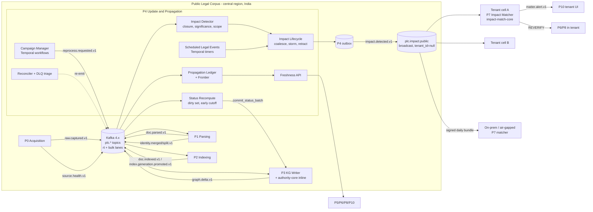
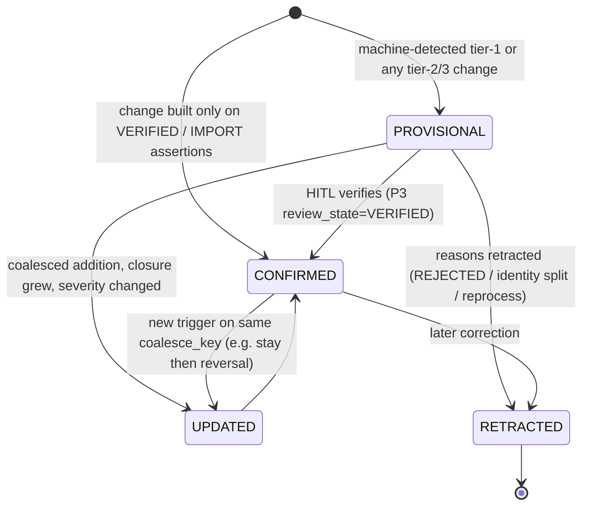

# P4 — Update and Propagation Engine

**Abstract.** P4 keeps the platform's legal knowledge up to date. It does this incrementally, provably and without leaking tenant data. It has four jobs.
1. **Watch the daily flow.** P4 observes the event flow P0→P1→P2→P3 through a *propagation ledger*, and from it computes an honest, per-court **"law current to" frontier**.
2. **Recompute status.** P4 recomputes `AuthorityStatus` incrementally when the knowledge graph changes. It uses dirty-set propagation with *early cutoff*, bounded depth, and the P3 doctrine library as the only status logic.
3. **Publish impacts.** P4 turns each legally meaningful change into one coalesced, significance-scored, as-of-scoped `impact.detected.v1`. The change may be an overruling, reversal, stay, strike-down, amendment, commencement, corrigendum, identity merge or suppression. The impact is broadcast on a public topic, and each tenant matches it against its private matter dependencies *inside its own boundary*.
4. **Reprocess.** P4 runs cost-bounded reprocessing campaigns (shadow → diff → gate → sharded apply → blue/green promote) whenever parsers, models, prompts, doctrine rules or sources improve.

The design responds to specific evidence:
- Commercial legal AI still cites overruled law [P4-1].
- Static RAG retrieved the date-applicable version of French tax law **0%** of the time, against 98.3% for version-aware retrieval [P4-2].
- LLMs apply superseded statutory rules unless temporal validity is enforced as a hard constraint [P4-3].
- Editing one fact does not propagate to its logical consequences [P4-6].
- Section 66A of the IT Act kept being invoked for years after *Shreya Singhal* struck it down [P4-40][P4-41][P4-42]. That is a real-world propagation failure.

Because repeated and low-value alerts measurably reduce the rate at which people act on alerts [P4-34][P4-35], P4 favours precision, coalescing and "every alert has an undo". P4 runs no LLM on its hot path. Items marked **[NOVEL — unvalidated]** are our inventions.

---

## 1. Purpose and scope

**Purpose.** When the law changes, every place in the platform that depends on the old state must learn about it quickly, exactly once and with evidence. That includes other authorities, statuses, cached answers, strategy memos, draft pleadings and, above all, active client matters. The same must happen when *our knowledge* of the law changes: an edge is corrected, a better parser runs, or a mis-merged citation is split.

**Responsibilities (R1–R8).**

| # | Responsibility | Output |
|---|---|---|
| R1 | Daily incremental ingestion *observability*: a per-document propagation ledger across P0→P3, detection of stuck or missing stages, re-drive | ledger, reconciler re-emits |
| R2 | Freshness frontier: "law current to" per court and per forum hierarchy | Freshness API (§2.2 O4) |
| R3 | Status recompute: dirty-set propagation over the justification/reliance graph using P3's `authority-core`, HISTORICAL segment materialisation, weekly full sweep | status commits via the P3 KG Writer |
| R4 | Impact detection: classify each change, compute the public affected closure (bounded, significance-scored), attach as-of `temporal_scope` | `impact.detected.v1` |
| R5 | Impact lifecycle: PROVISIONAL → CONFIRMED → UPDATED → RETRACTED, coalescing, storm control, scheduled (future-dated) legal events | `impact.detected.v1` versions |
| R6 | Tenant-safe fan-out: public broadcast, plus the deterministic `impact-match-core` library that P7 runs inside each tenant | library + topic |
| R7 | Reprocessing and backfills: campaign planning, shadow runs, diff reports, gates, budgets, priority lanes, poison-message handling | `reprocess.requested.v1`, campaign reports |
| R8 | Platform event backbone and durable-workflow decisions (co-owned with P0) | §5.2, §6 |

**Out of scope (owned elsewhere).**
- Fetching and change detection: P0.
- Parsing, anchors and identity: P1.
- Chunks and index generations: P2.
- Assertions, doctrine rules, the `AuthorityStatus` *algorithm*, HITL review and truth-maintenance bookkeeping: P3. P4 *schedules and drives* recomputation; P3's library computes it and P3's writer stores it (05_P3 §1, §5.5).
- Matching impacts to matters, `matter.alert.v1`, and memo staleness: P7 and P6. P4 supplies the event and the matching library.
- Alert UI and digests: P10.
- Re-verification of memos: P8/P6.

**Design principles.**
- **U-1 One logic, many triggers.** Status is computed only by `authority-core`, and severity/applicability only by `impact-match-core`. No phase re-implements doctrine.
- **U-2 Change, not churn.** Propagation stops wherever the recomputed, *legally meaningful* output is unchanged (early cutoff [P4-24][P4-25]). A confidence wobble never pages a lawyer.
- **U-3 Every alert has an undo.** Every impact is versioned. A retraction reaches exactly the audience of the original.
- **U-4 PLC never learns tenant interest.** P4 holds no tenant IDs, no matter IDs and no per-tenant subscriptions (spine §A; P7 §2.5-1).
- **U-5 Honest freshness.** A "current to" claim is a computed low-watermark, never a wall-clock time.
- **U-6 Replayable.** Every P4 decision is a pure function of bitemporal inputs, `doctrine_version` and `p4_logic_version`, so any past alert can be re-derived (spine §E).

---

## 2. Input and output contracts

### 2.1 Inputs

| # | Input | Producer | P4 uses |
|---|---|---|---|
| I1 | `raw.captured.v1` | P0 | ledger start (`captured_at`, `source_id`, `change_kind`, `crawl_run_id`); DELETED/REAPPEARED policy (§5.9) |
| I2 | `doc.parsed.v1` | P1 | ledger stage; `quality.gate`; `supersedes_parse_id`; `anchor_changes{}` → `TEXT_CORRECTED` impacts; `work_id_status` |
| I3 | `doc.indexed.v1`, `index.generation.promoted.v1` (P2-proposed) | P2 | ledger stage; campaign completion; rollback deadline |
| I4 | `graph.delta.v1` (with P3 fields `graph_watermark`, `cause`, `status_changes[].definitive/reason_codes/valid_from`, `manifest_uri`) | P3 | recompute seeds; impact detection; retraction handling |
| I5 | `identity.merged.v1` / `identity.split.v1` (P1 S4) | P1 | `IDENTITY_REMAPPED` impacts |
| I6 | `source.health.v1` (P0-proposed) | P0 | capture frontier; `COVERAGE_GAP` |
| I7 | Redaction / suppression records (`RedactionOverlay`, 13_cross_cutting S9; P0 `SuppressionOrder`) | ops / P0 | `CONTENT_SUPPRESSED` impacts + purge campaign |
| I8 | Graph Query API (read): `AuthorityView`, justification children, `RELIES_ON` in-edges, case lineage, `ProvisionVersion`, `MADE_UNDER`, `CORRESPONDS_TO`, citation in-degree | P3 | closure and significance |
| I9 | Campaign requests (ops, P9 manifests, P8 regression failures, P3 `reprocess.requested.v1` suggestions) | ops/P3/P8/P9 | campaigns (§5.11) |
| I10 | Model Gateway price table and budgets | 13_cross_cutting | campaign cost estimates |

### 2.2 Outputs

**O1 — `impact.detected.v1`** (spine §G). The changes are additive, and routing follows P7 §2.5-1: a public broadcast with `tenant_id=null`.
```jsonc
{
  "id": "01J…", "type": "impact.detected.v1", "specversion": "1.0",
  "source": "p4/impact-detector@1.3.0", "subject": "wrk_A",          // root target
  "tenant_id": null, "traceparent": "00-…", "causation_id": "<graph.delta event id>",
  "idempotency_key": "p4|impact|wrk_A|9f2c…|v2",                      // §2.3
  "schema_version": "1.1",
  "data": {
    "impact_id": "imp_01J…", "impact_version": 2,
    "lifecycle": "PROVISIONAL|CONFIRMED|UPDATED|RETRACTED",
    "supersedes_impact_id": null,                                     // set when two impacts are merged
    "change_kind": "AUTHORITY_STATUS_CHANGED",                        // enum in §5.5.1
    "cause_kind": "LAW_CHANGE|KNOWLEDGE_CORRECTION|RECLASSIFICATION|SCHEDULED",
    "trigger_delta_id": "gdl_…", "trigger_delta_ids": ["gdl_…"],       // spine field kept; list for coalesced impacts
    "root": { "target_id": "wrk_A", "target_kind": "WORK|PROPOSITION|PROVISION|CASE|ANCHOR",
              "old": { "status": "GOOD", "definitive": true },
              "new": { "status": "NEGATIVE", "definitive": false, "reason_codes": ["OVERRULED"],
                       "reason_assertion_ids": ["asr_…"] },                  // spine §F AuthorityStatus field
              "scope_anchor_ids": [],        // non-empty for OVERRULES_IN_PART / partial strike-down, e.g. ["wrk_G/en#p22","wrk_G/en#p29"]
              "direction": "DOWNGRADE|UPGRADE|LATERAL" },
    "trigger_authority": { "work_id": "wrk_B", "court_level": "SC", "bench_strength": 7,
                           "decision_date": "2023-12-13", "anchor_ids": ["wrk_B/en#p225"] },
    "affected_ids": ["wrk_A", "prp_A2", "cas_A", "wrk_A/en#p29"],      // spine-compatible: rings 0–1 inline, ≤ 2,000 ids
    "affected": [ { "id": "wrk_C", "ring": 1, "via_assertion_id": "asr_…", "via": "RELIES_ON", "weight": 0.72 } ],
    "affected_count": 1843,
    "manifest_uri": "s3://plc-impacts/imp_01J…/v2/closure.parquet",  // full closure when > 2,000 ids; SHA-256 below
    "manifest_sha256": "…",
    "temporal_scope": {
      "effect": "RETROSPECTIVE|PROSPECTIVE|FROM_DATE|CONDITIONAL",
      "legal_effect_from": "2023-12-13", "legal_effect_to": null,
      "territory": "IN",                                              // or IN-UP etc. for state amendments / HC scope
      "conditions_anchor_ids": [], "retrospective_flag": false, "contested": false,
      "date_basis": "CAUSE_OF_ACTION",   // which matter date decides applicability (§5.5.3); CORE → ARBITRATOR_APPOINTMENT
      "scope_predicates": [],            // machine-checkable limits, e.g. [{"fact":"tribunal_size","op":"eq","value":3}]
      "date_check": "MATCHED"            // legal_effect_from vs P0 source_metadata decision date: MATCHED|MISMATCH|NO_SOURCE
    },
    "severity": 1, "significance": 0.91,                             // public-only (§5.7)
    "verification": { "state": "MACHINE|PENDING_REVIEW|VERIFIED", "definitive": false,
                      "status_confidence": 0.93, "review_task_id": "rvw_…", "review_sla_due": "2026-10-01T18:00:00+05:30" },
    "explanation": { "template_id": "OVERRULED_BY_LARGER_BENCH@2",
                     "text": "Overruled by a 7-judge Bench of the Supreme Court on 13 Dec 2023 …",
                     "anchors": ["wrk_B/en#p225", "wrk_A/en#p29"], "quote_hashes": ["…"] },
    "coalesce_key": "sha256(wrk_A|wrk_B)",
    "graph_watermark": 918273700, "doctrine_version": "authority-core@3.2.0", "p4_logic_version": "1.3.0",
    "storm": { "active": false, "storm_id": null }
  }
}
```
Consumers:
- **P7**: the Impact Matcher runs `impact-match-core` and produces `matter.alert.v1` and memo STALE marks.
- **P10**: the public "legal change feed", statute and judge watchlists evaluated tenant-side, and the daily digest.
- **P8**: re-verification of PLC-level derived artefacts.
- **P5**: cache keys, optional; P5 already invalidates from `graph.delta.v1`.
- **P9**: alert-precision labels via `ALERT` feedback.

**O2 — `reprocess.requested.v1`** (spine §G; this concrete schema is proposed):
```jsonc
{ "type": "reprocess.requested.v1", "tenant_id": null,
  "idempotency_key": "p4|reprocess|cmp_01J…|shard-017|tv:8d1e…",
  "data": {
    "request_id": "rpq_…", "campaign_id": "cmp_01J…", "shard": { "index": 17, "of": 256 },
    "scope": { "selector": { "court_id": ["crt_sc"], "decided_between": ["1950-01-01","2026-09-30"],
                             "pipeline_component": "P1.rr-labeller<3.0", "quality.structure_conf_lt": 0.7 },
               "explicit_ids_uri": "s3://p4-campaigns/cmp_01J…/shard-017.ids" },   // frozen at plan time
    "stages": ["P1.segment", "P1.citations", "P2.chunk", "P2.embed", "P3.treatment", "P3.proposition"],
    "reason": "PARSER_UPGRADE|MODEL_UPGRADE|PROMPT_UPGRADE|BUGFIX|DOCTRINE_CHANGE|ONTOLOGY_CHANGE|IDENTITY|SOURCE_BACKFILL|QUALITY_ALERT|FEEDBACK|REDACTION",
    "target_pipeline_version": { "P1.rr-labeller": "3.1.0", "P3.treatment-l2": "2.4.0" },
    "mode": "SHADOW|APPLY", "output_namespace": "shadow/cmp_01J…|live",
    "lane": "BULK|RT", "priority": 4,                                  // Temporal priority 1 (highest) … 5 [P4-19]
    "budget": { "usd_cap": 1200, "deadline": "2026-10-07T00:00:00+05:30" },
    "impact_policy": "NORMAL|CONSOLIDATE|SUPPRESS_BELOW_S1" } }
```

**O3 — `acquire.requested.v1`** (P0-proposed). P4 emits it with reason `COVERAGE_GAP` when a court frontier stalls. It also uses a proposed new reason, `LINEAGE_WATCH`: when a status-relevant decision is appealed (a `REVIEW_OF` or `APPEAL_OF` edge to a pending SC or HC case), P4 asks P0 to poll that case.

**O4 — Freshness API** (sync, read-only; new):
```http
GET /p4/v1/freshness?court_id=crt_dhc
→ { "court_id": "crt_dhc", "law_current_to": "2026-09-30T04:10:00+05:30",
    "capture_frontier": "2026-09-30T05:00:00+05:30",       // from P0 source.health + crawl completion
    "propagation_frontier": "2026-09-30T04:10:00+05:30",   // min captured_at of docs not yet IMPACT_EVALUATED
    "stage_lag_p95_min": { "parse": 22, "index": 41, "graph": 63, "impact": 4 },
    "known_gaps": [ { "doc_key": "…", "reason": "DLQ_PARSE_FAILURE", "excused_by": "ops@…" } ],
    "source_health": "OK|DEGRADED|DOWN|BLOCKED",
    "completeness_basis": "ENUMERATED|SERIAL_GAP_CHECK|HEURISTIC|UNKNOWN",   // §5.3; UNKNOWN ⇒ law_current_to = null
    "p4_logic_version": "1.3.0" }
GET /p4/v1/freshness/forum?court_id=crt_dhc   // min over the forum's binding hierarchy (SC + DHC + its tribunals)
```
P6 prints `law_current_to` on every memo (08_P6 §2), P5 sets `CORPUS_STALE(court)` warnings, and P8 lowers confidence in "no negative treatment found" claims when the frontier lags.

**O5 — Status commits.** P4 calls the P3 KG Writer's `commit_status_batch(results[], cause{kind: RECOMPUTE|SCHEDULED, ref})`. The writer stays the only holder of write credentials (05_P3 §5.1). It emits a follow-on `graph.delta.v1` with `status_changes` and `cause.kind=RECOMPUTE`.

**O6 — `impact-match-core@semver`.** This is a deterministic library (Rust core with a Python binding) that P7 embeds in every tenant cell and on-prem install. It exposes `applicability(impact, matter_dates, matter_facts, jurisdiction) → APPLIES|PRE_CHANGE|SAVED|UNCERTAIN|NOT_APPLICABLE_TERRITORY|NOT_APPLICABLE_SCOPE` and `tenant_severity(impact, dependency_kinds[], stance?) → 1|2|3 + polarity RISK|OPPORTUNITY|INFO` (§5.6).

### 2.3 Idempotency-key grammar

`{phase}|{operation}|{natural_subject}|{content_hash}|{logic_or_version}`. The key is deterministic: re-deriving the same thing always yields the same key. CloudEvents independently requires `source`+`id` to be unique per distinct event, and allows consumers to treat identical `source`+`id` as duplicates [P4-10]. We therefore dedupe on `idempotency_key` (semantic) and use `id` for transport-level duplicates.

| Operation | Key | Why |
|---|---|---|
| impact | `p4|impact|{root_target}|sha256(sorted(reason_assertion_ids) ‖ old.status ‖ new.status ‖ new.definitive ‖ lifecycle)|v{impact_version}` | replaying the same delta yields the same key; a different lifecycle yields a new key |
| recompute | `p4|recompute|{target_id}|{graph_watermark}|{doctrine_version}` | a stale recompute is ignored if a newer watermark has been computed |
| reprocess shard | `p4|reprocess|{campaign_id}|{shard}|{sha256(target_pipeline_version)}` | re-issuing a shard does not double-spend |
| status commit | `p4|status|{recompute_batch_id}` | exactly-once effect in P3's writer |
| tenant alert (P7) | `p7|alert|{impact_id}|{matter_id}` plus `impact_version` for in-place update | one alert per matter per impact, updated in place |

Because `impact_version` is part of the impact key, it must be assigned deterministically. P4 first looks up `(impact_id, decision_hash)`, using the unique constraint in §5.14. A crash-replay finds the existing decision and re-publishes the *same* version rather than minting v+1.

Consumers keep an **inbox** table `processed(consumer, idempotency_key, payload_hash, processed_at)`. It is written in the same transaction as the side effect: the inbox/outbox pattern [P4-12], with Stripe-style idempotency keys [P4-29]. If a known key arrives with a *different* `payload_hash`, that is a producer bug. The consumer raises `IDEMPOTENCY_KEY_REUSE` and parks the event.

### 2.4 Proposed spine changes

| # | Target | Change | Justification |
|---|---|---|---|
| SP4-1 | §G `impact.detected.v1` | Endorse P7 §2.5-1: public broadcast with `tenant_id=null`; drop "P7 registers dependency fingerprints with P4". Add the fields shown in O1 (`impact_version`, `lifecycle`, `supersedes_impact_id`, `change_kind`, `cause_kind`, `root`, `trigger_authority`, `affected[]` with rings, `affected_count`, `manifest_uri`/`sha256`, `temporal_scope`, `significance`, `verification`, `coalesce_key`, `graph_watermark`, `doctrine_version`, `p4_logic_version`, `storm`) | Retractions need versions (U-3). As-of matching needs `temporal_scope`: prospective overruling (*CORE*, 2024 [P4-39]) and conditional effect (*MADA*, 2024 [P4-38]) are real. Registration would put tenant reliance sets into the PLC, which violates spine §A. |
| SP4-2 | §G `reprocess.requested.v1` | Adopt the O2 schema (`campaign_id`, `shard`, `stages`, `mode SHADOW|APPLY`, `output_namespace`, `lane`, `priority`, `budget`, `impact_policy`) | The spine leaves the scope selector undefined. Shadow runs and budgets need fields (§5.11). |
| SP4-3 | §G `graph.delta.v1` (P3 S3-3) | Add `cause.kind ∈ {RECOMPUTE, SCHEDULED}`. P3 exposes `commit_status_batch` to P4. | This keeps P3 as the single writer while P4 drives higher-order and bulk recompute. |
| SP4-4 | §H | New sync object `Freshness` (O4), consumed by P5, P6, P8 and P10 | "Law current to" is referenced by P5, P6 and P8 but is undefined. |
| SP4-5 | §I | Close the bus and workflow decision: the **Apache Kafka 4.x API** (self-managed KRaft or a managed Kafka in an Indian region), with transactional outbox; **Temporal** for durable, long-running workflows (self-hosted, or Temporal Cloud `aws-ap-south-1`/`ap-south-2`/`gcp-asia-south1` [P4-18]) | See §6.2–6.3. This closes P0 §6.6. |
| SP4-6 | §G `matter.alert.v1` (P7 §2.5-2) | Carry `impact_version` and `lifecycle`. `dedupe_key = hash(impact_id, matter_id)`, and alerts are updated in place. | Retraction and confirmation must update the same alert rather than send a new one (§5.8; alert-fatigue evidence [P4-35]). |
| SP4-7 | P0 `acquire.requested.v1` | Add reason `LINEAGE_WATCH` | Appeals and reviews of status-relevant decisions must be polled, not discovered late. |
| SP4-9 | §H `MatterContext.key_dates` (P7-owned) | Add optional keys that mirror `temporal_scope.date_basis`: `offence_committed`, `proceeding_instituted`, `arbitrator_appointment`, `agreement_execution`, `transactions[]{from,to}`. Add `facts{tribunal_size?, …}` for `scope_predicates`. Absent keys yield `UNCERTAIN` | *CORE* is keyed to appointment date and three-member tribunals [P4-39]. BNSS s.531 is keyed to whether a proceeding was pending on commencement [P4-49]. *MADA* is keyed to transaction date [P4-38]. Art. 20(1) keys penal law to the date of the offence [P4-50]. With cause of action alone, the matcher returns wrong `APPLIES`/`SAVED` labels. |
| SP4-8 | §F `AuthorityStatus` | Status equivalence for early cutoff is defined on `(status, definitive, reason_codes, binding-relevant fields)`, with confidence bucketed at 0.1 | Prevents alert churn from confidence jitter (U-2). |

---
## 3. State-of-the-art survey (with citations)

### 3.1 Why propagation, not retrieval, is where legal AI goes stale
- **Stale authority in commercial tools.** Magesh et al. found that leading legal research tools hallucinate on 17–33% of queries. One of their error classes is citing inapplicable or overruled authority. Their Lexis+ AI example is a *reliance* failure, not a direct one: the answer cited *Planned Parenthood v. Reynolds*, which had not been overturned and carried a positive Shepard's signal, for its description of *Casey*, which *Dobbs* had overruled [P4-1]. A one-hop status check on the cited case passes. Only propagation along reliance catches it (our ring 1, §5.4).
- **Temporal misgrounding is near-total without versioning.** On a French tax-law corpus of 32,436 article-versions spanning 93 years, "static RAG retrieves the date-applicable version 0% of the time", against 98.3% for a multi-version retrieval design [P4-2].
- **LLMs fail temporal validity in two directions.** They apply outdated rules after an amendment, and they prefer newer provisions over the historically applicable ones. Retrieval that enforces validity through fact-date extraction and version filtering helps substantially (German statutory QA, ICAIL 2026) [P4-3].
- **Architecture over model.** De Martim argues that legal RAG failures are architectural. He proposes *bitemporal correctness* and *event reification* as foundational commitments [P4-4], extending the SAT-Graph design of versioned legal expressions and action-driven versions [P4-5]. The spine already adopts both (§E, §F). P4 is the component that keeps them *true over time*.
- **Parametric knowledge does not ripple.** RippleEdits (TACL 2024) shows that editing one fact in an LLM fails to update the facts that logically depend on it [P4-6]. Our propagation therefore never relies on model memory. It runs over explicit, reified dependencies.
- **Temporal graph RAG.** Recent systems add temporal facts incrementally to a graph [P4-46]. They model change as *new facts*, not as *invalidation of dependents*, and none handles precedent hierarchy.

### 3.2 How citators propagate change
- **KeyCite Overruling Risk** (Westlaw Edge) flags a point of law "implicitly undermined due to its reliance on a directly overruled" decision. It uses NLP/ML plus editorial data and marks the affected paragraphs [P4-8]. It is a one-hop reliance propagation, and it is the closest commercial analogue to our ring-1 closure.
- **Citator accuracy is contested.** Hellyer reviewed 357 citing relationships that at least one citator labelled negative. Shepard's and KeyCite each missed or mislabelled about one-third of them, and BCite over two-thirds (abstract) [P4-9]. The often-quoted figure that all three agreed on only 53 of the 357 comes from the full text, which was not re-read here *(unverified)*. Propagation built on uncalibrated flags compounds these errors, so P4 carries `status_confidence` and a verification state through every hop.
- **Update latency.** We could not verify any published, audited "time-to-flag" figure for Shepard's or KeyCite in this session. Vendor speed claims are therefore **not** used as a benchmark. Our SLOs (§5.15) are set from 13_cross_cutting §6.2.
- **India.** The failure is visible at national scale. Section 66A of the IT Act was struck down in *Shreya Singhal* (24 Mar 2015) [P4-40]. It "has continued to be used" [P4-42]. IFF's *Zombie Tracker* documents fresh 66A cases after 2015. It also records that on 15 Feb 2019 the Supreme Court directed that *Shreya Singhal* be sent to all courts and to senior police administration [P4-41]. (The details of the later PUCL orders were not re-verified here.) The platform's version of that failure is a matter memo still citing a dead provision.

### 3.3 Event backbones and durable execution (facts verified this session)
- **Apache Kafka 4.0** (18 Mar 2025) runs without ZooKeeper (KRaft). The new consumer rebalance protocol (KIP-848) is GA. "Queues for Kafka" (KIP-932, share groups) was early access in 4.0 [P4-13]. Releases 4.1 (4 Sep 2025), 4.2 (17 Feb 2026) and 4.3 (22 May 2026) followed [P4-14]. Share groups were a "preview … still not ready for production" in 4.1 [P4-48] and were declared production-ready in 4.2 [P4-47].
- **Redpanda** (Kafka-API compatible) is under BSL 1.1. Its Additional Use Grant forbids offering it as a "Streaming or Queuing Service", and each version converts to Apache 2.0 after four years [P4-15].
- **Transactional outbox and CDC.** The outbox pattern writes the event in the same DB transaction as the state change [P4-12]. Debezium's Outbox Event Router routes outbox rows to topics by `aggregatetype` and propagates the row `id` in a header for consumer deduplication [P4-11].
- **CloudEvents 1.0.** `source`+`id` must be unique, and identical pairs may be treated as duplicates [P4-10].
- **Temporal** offers durable execution with deterministic replay [P4-21]:
  - Cloud regions include `aws-ap-south-1` (Mumbai), `aws-ap-south-2` (Hyderabad) and `gcp-asia-south1` [P4-18].
  - Event History is capped at 51,200 events or 50 MB, with warnings from 10,240 events or 10 MB [P4-20].
  - Task Queue **Priority** (integer 1–5, lower is higher; strict across tiers) and **Fairness** (weighted fairness keys within a tier) are documented for self-hosted and Cloud. Fairness is a paid toggle on Cloud [P4-19]. The page as fetched does not state a release stage, so treat GA status as *(unverified)*.
- **Restate** is under BSL 1.1, converting to Apache 2.0 after 4 years [P4-16]. **DBOS Transact** (MIT) checkpoints workflows in Postgres, with queues, concurrency limits, rate limiting, deduplication and priority [P4-17].

### 3.4 Incremental computation and truth maintenance
- **DBSP** gives an algorithm that incrementalises any program in its stream language, including recursion [P4-22]. Feldera (MIT) implements it for full SQL, including recursive queries [P4-23].
- **Early cutoff and backdating.** Build systems achieve *minimality*: rebuild only what transitively depends on changed inputs. With *early cutoff*, if a rebuilt task's output is unchanged, its dependents are not rebuilt [P4-25]. Salsa's red–green algorithm "backdates" a re-executed query whose value did not change, so dependents are not re-executed [P4-24].
- **Truth maintenance.** A JTMS records justifications so that a retraction revisits only dependents [P4-26]. P3 implements this as `assertion_dependency` (05_P3 §5.9).
- **Watermarks.** Flink defines Watermark(t) as the declaration that no more elements with timestamp ≤ t will arrive. An operator with several inputs takes the *minimum* of its inputs' event times [P4-32]. This is the right semantic for "law current to".
- **Kappa reprocessing.** Retain the log, start a second job instance from the beginning, write to a new output table, switch readers when it has caught up, then delete the old table [P4-27].

### 3.5 Reliability patterns
- **Retry topics and DLQ.** Uber sends failures to separate retry topics with increasing delays, and exhausted messages to a DLQ, so the main topic never blocks [P4-28].
- **Idempotency keys.** Keys are stored in Postgres with atomic phases and recovery points, locks and 24–72 h expiry [P4-29].
- **Shadow execution.** GitHub's Scientist runs control and candidate paths, compares them, publishes mismatches and returns the control result [P4-30].
- **Lineage.** OpenLineage models Job, Run and Dataset with extensible facets and START/COMPLETE run events [P4-33].
- **Dependency-consistent answer caching.** FinCacheServe guards cached RAG answers with document versions and evidence fingerprints. It skipped 53.27% of LLM calls on a 2,230-request trace with zero observed dependency-stale outputs. On a separate 544-request, three-seed suite it skipped 53.31%, against 38.97% for versioned semantic caching [P4-7]. P7 and P6 use the same idea for "living memos". P4 supplies the invalidation signal.

### 3.6 Alert fatigue
- **Override rates.** Drug-safety alerts are overridden in 49–96% of cases. Low specificity and unclear information content are among the error-producing conditions [P4-34].
- **Repeats.** Over 3.5 years of data from 112 clinicians, reminder acceptance fell **30% for each additional reminder per encounter** and **10% for each five-point rise in the share of repeated reminders**. Workload alone had no effect, and there was no desensitisation to new alerts [P4-35].
- **Actionability.** Google SRE: "Every page should be actionable", and symptoms over causes [P4-31].
- **Consequence for P4.** Coalesce by root cause, never repeat, update in place, and reserve severity 1 for actionable, high-confidence changes.

### 3.7 Indian motivating cases (what P4 must do with each)

| Event | Verified facts | P4 behaviour required |
|---|---|---|
| *In re Interplay between Arbitration Agreements and the Stamp Act*, 2023 INSC 1066 | 7 judges, 13 Dec 2023. Para 224(e): "The decision in NN Global 2 … and SMS Tea Estates … are overruled. Paragraphs 22 and 29 of Garware Wall Ropes … are overruled to that extent" [P4-36] | Multi-target: `OVERRULES` for *N.N. Global* and *SMS Tea Estates*; `OVERRULES_IN_PART` scoped to `wrk_garware/en#p22`, `#p29` (→ `PARTIAL_NEGATIVE`, `root.scope_anchor_ids`, §5.6); the larger bench is doctrine-valid [P4-45]; one coalesced impact per overruled work; ring-1 to HC decisions applying *N.N. Global* on unstamped agreements |
| *Sita Soren v. Union of India*, 2024 INSC 161 | 7 judges, 4 Mar 2024. Para 188 (Conclusion): "We disagree with and overrule the judgment of the majority on this aspect", i.e. immunity from prosecution for bribery under Arts 105/194 (*P.V. Narasimha Rao*, 5 judges, 1998) [P4-37] | Proposition-level overruling of the majority view; the dissent's proposition is untouched; `temporal_scope.effect=RETROSPECTIVE` by default |
| *Mineral Area Development Authority v. SAIL* | 9-judge judgment of 25 Jul 2024 [P4-38] (snippet); order of 14 Aug 2024: prospective effect "rejected" (para 24); tax demand not on transactions before 1 Apr 2005; staggered over 12 years from 1 Apr 2026; interest and penalty before 25 Jul 2024 waived (para 25) [P4-38] | Two linked impacts: the judgment (status change for *India Cement* to the extent overruled) and the order, as `effect=CONDITIONAL` with `conditions_anchor_ids` → tenant applicability `UNCERTAIN` → human reads the conditions |
| *CORE v. ECI-SPIC-SMO-MCML (JV)* | 5 judges, 8 Nov 2024; unilateral appointment or curation by an interested party offends equal treatment; Part I "Prospective Overruling" (paras 166–168) and para 169(g): "The law laid down in the present reference will apply prospectively to arbitrator appointments to be made after the date of this judgment. This direction applies to three-member tribunals." The majority disagreed with *Voestalpine* and *CORE* (2019) [P4-39] | `effect=PROSPECTIVE`, `legal_effect_from=2024-11-09` ("appointments to be made *after* the date of this judgment"), **`date_basis=ARBITRATOR_APPOINTMENT`**, `scope_predicates=[{tribunal_size: 3}]` (§5.5.3). The matcher compares the *appointment* date, not the cause of action, and returns `UNCERTAIN` unless the matter records the appointment date and tribunal size |
| UP Madarsa Act (*Anjum Kadari v. UoI*, 2024 INSC 831, 5 Nov 2024) | On 5 Apr 2024 the SC stayed the Allahabad HC judgment of 22 Mar 2024. On 5 Nov 2024 it set that judgment aside (para 105), upholding the Act except the provisions on the Fazil and Kamil higher-education degrees, which conflict with the UGC Act [P4-43] | Status flips HC-struck-down → STAYED → set aside, ending in `UPHOLDS_VALIDITY` plus a *partial* `STRIKES_DOWN` scoped to the Fazil/Kamil provisions. Each flip is an impact *version*, so tenants see one evolving card, not three alerts |
| BNS/BNSS/BSA commencement | BNS in force 1 Jul 2024 [P4-44]; BNSS commenced the same date (secondary) [P4-44]. BNSS s.531(2)(a): any appeal, application, trial, inquiry or investigation *pending* immediately before commencement continues under the CrPC 1973 [P4-49]. BSA date is *unverified here* | `date_basis=PROCEEDING_PENDING_ON` for procedural crosswalks: a matter whose proceeding was pending on 1 Jul 2024 gets `SAVED`, not `APPLIES`. It is also a **scheduled legal event**: pre-announced at notification, fired at `valid_from`; mass `CROSSWALK_CHANGED`/`PROVISION_COMMENCED` handled as a storm campaign (§5.7.3) |
| s.66A after *Shreya Singhal* | Struck down 2015 [P4-40]; still invoked [P4-41][P4-42] | `PROVISION_VALIDITY_CHANGED` must reach every matter where the provision is a `GOVERNING_PROVISION` or `CITED_BY_OPPONENT`, including *opponent notices citing dead law*. That is an **opportunity** alert (§5.6) |

---

## 4. Mistakes others made and how we avoid them

| System/paper | What went wrong | Evidence | How we avoid it |
|---|---|---|---|
| Commercial legal RAG (Lexis+ AI, Westlaw AI-AR) | Cited overruled or inapplicable authority | [P4-1] | Status is precomputed and pushed (P4) *and* re-read at render (P5 `revalidate`). A memo carries `law_current_to` (O4) |
| Static legal RAG | Date-inapplicable version retrieved 0% correctly | [P4-2][P4-3] | Every impact carries `temporal_scope`. Applicability is evaluated against matter key dates by `impact-match-core` |
| LLM knowledge editing | Edits do not ripple to dependents | [P4-6] | Propagation runs over explicit justification and reliance edges (JTMS [P4-26]), never model memory |
| US citators | About one-third of negative relationships missed or mislabelled by Shepard's and KeyCite, over two-thirds by BCite; opaque flags | [P4-9] | Verification state and confidence travel with every impact. Provisional vs confirmed is explicit and reversible |
| KeyCite Overruling Risk | One hop; US; not bench-aware | [P4-8] | Bench-aware doctrine (P3) + bounded ring-2 with significance scoring, as-of scope and forum binding |
| Indian enforcement of struck-down law (66A) | Invalidation did not propagate to the police and courts that used the law | [P4-41][P4-42] | Validity impacts target *opponent-cited* and *governing* provisions too. The opponent notice is flagged as relying on dead law |
| Clinical decision support | Repeated, low-specificity alerts → 49–96% overrides; acceptance falls with repeats | [P4-34][P4-35] | Coalesce by `coalesce_key`, update in place, digest severity 3, measure precision (§9) |
| Naive paging | Paging on causes, not actionable symptoms | [P4-31] | Severity 1 only when doctrine-valid, high-confidence and ring 0 |
| Lambda-style dual pipelines | Two codebases must agree | [P4-27] | One pipeline per phase. Reprocessing replays the same code with a new `pipeline_version` into a shadow namespace |
| Blocking retries | One poison message stalls a partition | [P4-28] | Retry topics with backoff, per-consumer DLQ, ledger-visible gaps that hold back the frontier |
| Semantic answer caches | Serve stale answers after document change | [P4-7] | Impacts carry the public IDs that P6/P7 use as dependency fingerprints. Caches key on `graph_watermark` |
| "Newest fact wins" temporal graphs | Later ≠ authoritative in law | 05_P3 §4 | P4 never decides authority. It calls `authority-core`, which ignores doctrine-invalid "overrulings" |

---
## 5. Recommended design, in detail

### 5.1 Architecture overview and event topology



Coordination style: phases **choreograph** over events. Each phase is an idempotent consumer that owns its internal durable workflows (P1 §5, P2 §5). P4 **observes** the flow through the ledger and **orchestrates** only long-running, multi-phase operations: campaigns, scheduled legal events, and the alert lifecycle with HITL timers (§6.1).

### 5.2 Event backbone

**Decision.** Use the Apache Kafka 4.x API (KRaft) with a Postgres transactional outbox in every producer [P4-12][P4-13]. The outbox relay is Debezium's Outbox Event Router [P4-11] or a 200-line poller; P0 and P2 already assume an outbox. We avoid Redpanda for anything we ship on-prem because of BSL "Streaming or Queuing Service" ambiguity [P4-15]. It is Kafka-API compatible, so it remains an option inside our own SaaS cells after legal review.

**Topics** (all PLC topics carry `tenant_id=null`):

| Topic | Key (ordering) | Partitions | Retention | Notes |
|---|---|---|---|---|
| `plc.raw.captured.v1.{rt,bulk}` | `source_record_key` | 12 | 30 d (+ S3 archive) | P0 routes SC and "cites-active-work" captures to `rt` (13_cross_cutting §6.2) |
| `plc.doc.parsed.v1.{rt,bulk}` | `work_id` | 24 | 30 d | |
| `plc.doc.indexed.v1` | `work_id` | 12 | 14 d | |
| `plc.graph.delta.v1.{rt,bulk}` | `subject` (P3 per-subject order by `graph_watermark`) | 24 | 90 d | `bulk` = reprocess-caused deltas |
| `p4.recompute.v1.{rt,bulk}` (internal) | `target_id` | 24 | 7 d | re-keying gives a per-target mutex |
| `plc.impact.public.v1` | `root.target_id` | 12 | **365 d**, compacted archive in S3 | retractions share the key, so they are ordered after the original |
| `plc.reprocess.requested.v1` | `campaign_id` | 6 | 30 d | |
| `plc.identity.v1`, `plc.source.health.v1`, `plc.index.generation.v1` | id | 3–6 | 90 d | |
| `*.retry.{5m,1h,6h}`, `*.dlq` per consumer group | same as source | — | 30 d | Uber pattern [P4-28] |

- **Lanes.** Kafka has no priorities, so each lane is a separate topic with its own consumer groups and quotas. Inside Temporal, lanes map to Task Queue priority (RT=1–2, daily=3, bulk=4–5) and to a fairness key per campaign [P4-19]. **Invariant:** bulk work can never starve RT, because they use different partitions, different consumer groups and a reserved worker pool.
- **Schema governance.** Each event type has a JSON Schema in a registry with `schema_version`. The compatibility rule is BACKWARD for consumers: fields are additive only, and a v2 type is required for breaking changes. P4 consumers ignore unknown fields.
- **Replay source of truth** is *not* the log. The log is transport. Replays read the immutable raw store (`raw_id` content-addressed), P1 parse artefacts, P3's bitemporal tables and P4's impact tables. Kafka retention only needs to cover consumer outages (≥ 30 d, matching P0 §6.6).

### 5.3 Propagation ledger and the "law current to" frontier

**Ledger.** One row per `(doc_key = source_record_key, raw_id)` records timestamps per stage:
`CAPTURED → PARSED → INDEXED → GRAPHED → STATUS_RECOMPUTED → IMPACT_EVALUATED`.
It is fed purely by observing events, with no calls into phases. `GRAPHED` is set when a `graph.delta.v1` with `cause.ref` = the parse arrives, or when P3 emits an explicit "no-op" delta. **P3 must emit a delta, possibly empty, for every parse; this is a contract requirement.** `IMPACT_EVALUATED` is set when the Impact Detector has processed every status change caused by that delta, *including* the recompute ripple (`causation_id` chain).

**Frontier** [NOVEL — unvalidated as applied to legal freshness; semantics from dataflow watermarks [P4-32]]:
```text
propagation_frontier(court c) = min( captured_at of ledger rows for c with stage < IMPACT_EVALUATED and not excused ), or now() if none
capture_frontier(c)           = P0's latest time T such that every publication by c up to T has been captured
                                (from crawl-run completeness + source.health; P0 §2.5-3)
law_current_to(c)             = min(capture_frontier(c), propagation_frontier(c))
law_current_to(forum F)       = min over courts whose decisions bind or are routinely relied on in F
                                (SC ∪ F's HC ∪ F's appellate tribunals; from the P3 court registry)
```
- A stuck document therefore holds the frontier back visibly. Ops must fix it or **excuse** it: `ledger.excuse(doc_key, reason, actor)`. An excused document appears in `known_gaps[]` and in the P8/P10 caveat. This turns "silent partial ingestion" into a number on the screen.
- **Completeness basis.** Many portals publish no enumerable daily list, so P0 cannot always prove that "every publication up to T" was captured. `completeness_basis` records how the capture frontier was obtained:
  - `ENUMERATED`: the portal lists the day's output.
  - `SERIAL_GAP_CHECK`: gaps in sequential neutral-citation serials (`YYYY INSC n`, `YYYY:DHC:n`) are detected and resolved. [NOVEL — unvalidated]
  - `HEURISTIC`: for example, reconciliation against the cause list.
  - `UNKNOWN`: `law_current_to` is returned as `null` and P5/P6/P10 print "completeness unknown for <court>" rather than a date. A date that cannot be backed is never shown (U-5).
- The frontier is computed every 60 s into `freshness_frontier`. Reads are O(1).

### 5.4 Status recompute (incremental, early cutoff, bounded)

**Division of labour with P3.**
- The KG Writer computes CURRENT-mode status inline for the *direct* objects of each delta. It must do so to emit `status_changes` and provide read-your-writes (05_P3 §2.2).
- P4 does four things:
  - (a) materialises HISTORICAL valid-time segments for those targets;
  - (b) propagates to *dependents*: reliance risk, proposition inheritance, provision→rule chains, crosswalk carry-over;
  - (c) runs bulk recompute when `doctrine_version` changes or a campaign lands;
  - (d) runs a weekly full sweep that reconciles every target. This takes about 5M `authority-core` calls, needs no LLM, and is CPU-only.

```text
on graph.delta d:                                           # consumer, idempotent on d.idempotency_key
  seeds = d.status_changes.targets
        ∪ { object/proposition/case-lineage peers of a in d.assertions_added ∪ d.retracted ∪ d.superseded
            where family(a) ∈ {TREATMENT, HISTORY, STATUTE_JUDGMENT, STATUTE_STATUTE} }
  for t in seeds: publish p4.recompute.v1{target=t, wm=d.graph_watermark, depth=0, root_cause=d.delta_id, lane=lane(d)}

recompute worker (partition = hash(target_id); one target at a time):
  m = dequeue()
  if recompute_log[m.target].wm ≥ m.wm and doctrine_version unchanged: ack; return        # stale duplicate
  new = authority_core.compute(m.target, CURRENT, K=now)  ⊕  segments(m.target, HISTORICAL)
  old = status_store.current(m.target)
  recompute_log[m.target] = (m.wm, doctrine_version, hash(new), verified_at=now)
  if equivalent(new, old):  ack; return                    # EARLY CUTOFF (Salsa backdating [P4-24])
  batch.add(new, cause=RECOMPUTE(m.root_cause))            # commit_status_batch → P3 writer → graph.delta
  if m.depth < D_MAX and path_weight(m) ≥ θ_prop:
      for (dep, edge) in dependents(m.target):              # Graph Query API
          publish p4.recompute.v1{dep, m.wm, m.depth+1, m.root_cause, path_weight(m)·conf(edge)}

equivalent(a, b) := a.status = b.status ∧ a.definitive = b.definitive ∧ set(a.reason_codes) = set(b.reason_codes)
                    ∧ a.binding_basis.rule_ids = b.binding_basis.rule_ids ∧ bucket(a.status_confidence, .1) = bucket(b…)
dependents(t)   := assertion_dependency children of t's reason assertions (JTMS)
                 ∪ works W with RELIES_ON(W → p) for p ∈ props(t)         # reliance risk
                 ∪ PRECEDENT_CARRIES_TO targets (crosswalk)               # IPC precedent → BNS provision
                 ∪ rules/notifications MADE_UNDER a provision whose validity changed
D_MAX = 2, θ_prop = 0.3 (config)
```
- **Why bounded.** Reliance confidence multiplies per hop. KeyCite's commercial analogue is one hop [P4-8]. P3's truth maintenance walks depth 3 for *justification*, because a retraction must be complete; P4's *significance* propagation stops at 2.
- **Loop safety.** Deltas caused by `RECOMPUTE` never re-seed their own targets: a seed is skipped when `d.cause.kind = RECOMPUTE ∧ target ∈ d.cause.batch_targets`. `OVERRULES` cycles are already rejected by P3 detector A1.
- **Batching.** Commits are batched up to 500 targets or 2 s. The follow-on `graph.delta.v1` carries `cause.kind=RECOMPUTE` and `cause.ref=recompute_batch_id`.

### 5.5 Impact detection

#### 5.5.1 Change taxonomy (what counts as a legally meaningful change)

| `change_kind` | Trigger | Root target |
|---|---|---|
| `AUTHORITY_STATUS_CHANGED` | a `status_changes` entry that is not equivalent (§5.4) | work / proposition |
| `RELIANCE_RISK` | a dependent's status moved because of a ring-0 change (reason `RELIES_ON_OVERRULED`) | dependent work |
| `DIRECT_HISTORY` | `AFFIRMS/REVERSES/MODIFIES/SETS_ASIDE/REMANDS/STAYS/RECALLS` on case lineage | `cas_`, work |
| `REFERENCE_STATE_CHANGED` | `REFERS_TO_LARGER_BENCH` added or answered (`ANSWERS_REFERENCE`) | work / proposition |
| `PROVISION_TEXT_CHANGED` | a new `ProvisionVersion` (AMENDS/SUBSTITUTES/INSERTS/OMITS) | provision anchor |
| `PROVISION_VALIDITY_CHANGED` | `STRIKES_DOWN/READS_DOWN/UPHOLDS_VALIDITY/STAYS` on a provision | provision anchor |
| `PROVISION_COMMENCED` / `PROVISION_REPEALED` | `COMMENCES`, `REPEALS` (+ `SAVES`), ordinance lapse | provision / act |
| `CROSSWALK_CHANGED` | `CORRESPONDS_TO`/`PRECEDENT_CARRIES_TO` verified, changed or retracted | old ↔ new provision |
| `NEW_INTERPRETATION` | a new SC or HC `INTERPRETS/APPLIES` of a provision (a new *authority*, not a change to one) | provision anchor |
| `TEXT_CORRECTED` | P1 `anchor_changes` with `TEXT_CHANGED` (corrigendum, `rev` expression) | anchor |
| `IDENTITY_REMAPPED` | `identity.merged/split.v1` | from/to IDs |
| `CONTENT_SUPPRESSED` / `SOURCE_WITHDRAWN` | redaction overlay or suppression order; all manifestations DELETED past the grace period | work / anchor |

Positive treatments (FOLLOWS/APPLIES) of a work produce no impact. They feed the P10 digest via the public change feed only. `DISTINGUISHES` never produces an impact.

#### 5.5.2 Closure algorithm (public, bounded, significance-scored)
```text
detect(change c):                                        # c from status_changes / assertion families / P1 events
  root = c.target
  ring0 = {root} ∪ props(root) ∪ anchors_cited_in_evidence(c) ∪ case_lineage(root)   # cas_ + lower-court works
          ∪ (root is provision ? {parent section, act, territory versions} : ∅)
  ring1 = { dep : dep ∈ recompute ripple of c with changed status }                  # from §5.4, not recomputed here
          ∪ (c ∈ PROVISION_* ? rules MADE_UNDER root ∪ provisions CORRESPONDS_TO root ∪ works INTERPRETS root (last 10y, SC/HC)
                              : ∅)
  ring2 = significance-gated ring-1 dependents (path_weight ≥ 0.5), only if not storm
  for x in ring0∪ring1∪ring2: weight(x) = Π conf(edges on path) · decay^ring   (decay = 0.6)
  sig   = significance(c)                                  # §5.7.1
  scope = temporal_scope(c)                                # §5.5.3
  impact = coalesce(c, root, trigger_work)                 # §5.7.2: same coalesce_key within 6 h → new version of same impact
  emit via outbox (inline ids if |closure| ≤ 2,000 else manifest in S3, SHA-256 in event)
```
Ring-1 statute expansion includes `INTERPRETS` judgments because an amendment can make earlier interpretations inapplicable from `valid_from`. The recency bound limits volume; this is a heuristic and must be evaluated (§9).

#### 5.5.3 As-of semantics (`temporal_scope`)
The rules are computed deterministically from assertion qualifiers (P3 S3-1 `effect`, `effective_from`, `territory`):
- **Judgment status changes** default to `RETROSPECTIVE`, following P3's declaratory default (05_P3 §2.3).
- A **prospective overruling** gives `PROSPECTIVE` with `legal_effect_from = effective_from`. This covers *CORE* [P4-39].
- **Refused prospectivity with conditions** gives `CONDITIONAL` with the condition anchors. This covers *MADA* 14 Aug 2024 [P4-38].
- **Statute changes** give `FROM_DATE = valid_from`, with `retrospective_flag` when the amending text says so (P1 `AmendmentInstruction`). `territory` is taken from the version.
- **Stays** give `FROM_DATE`, with `legal_effect_to` open until vacated.
- Scope also carries `contested=true` whenever P3's rule is contested, for example BNSS transitional rules or the precedential effect of a stayed HC judgment (05_P3 B11).
- **Date basis.** `date_basis` names the matter date that decides applicability. It is extracted by P3 (HITL for tier 1). When a PROSPECTIVE or CONDITIONAL judgment's basis was not extracted, it defaults to `CAUSE_OF_ACTION` with `contested=true`.

  | `date_basis` | Used for | Example |
  |---|---|---|
  | `CAUSE_OF_ACTION` | default | — |
  | `OFFENCE_COMMITTED` | substantive penal changes | Art. 20(1) bars conviction or a greater penalty except under the law in force when the offence was committed [P4-50] |
  | `PROCEEDING_PENDING_ON` | procedural code transitions | BNSS s.531(2)(a) [P4-49] |
  | `ARBITRATOR_APPOINTMENT` | appointment-rule changes | *CORE*, together with `scope_predicates=[tribunal_size=3]` [P4-39] |
  | `AGREEMENT_EXECUTION` | agreement-rule changes | the *BALCO* (2012) 9 SCC 552 prospectivity "to all the arbitration agreements executed hereafter", as quoted in *CORE* [P4-39] |
  | `TRANSACTION` | fiscal changes | *MADA*: no demand on transactions before 1 Apr 2005 [P4-38] |
  | `FILING` | filing-rule changes | — |
- **Date cross-check (bad OCR).** `legal_effect_from` comes from judgment text. It is compared with the decision date in P0's `source_metadata` as published by the portal.
  - A mismatch sets `date_check=MISMATCH` and `contested=true`, caps severity at 2 and opens a review task.
  - A mis-OCR'd year (2021 for 2024) otherwise flips `APPLIES`/`SAVED` silently.

### 5.6 Tenant-scoped fan-out without leakage

**Broadcast-and-match** (jointly with P7 §5.6). Every tenant cell subscribes to `plc.impact.public.v1`. On-prem and air-gapped installs receive the same events inside the signed daily PLC delta bundle (P7 §5.13). P4 learns nothing about who matched.

**Leakage controls.**
- **L1.** No per-ID callbacks. A tenant that needs the full closure downloads the *whole* manifest, which is immutable, content-hashed and public. It never queries "is `wrk_X` affected?". Per-ID lookups would reveal reliance through access patterns. **[NOVEL — unvalidated]** as a stated rule.
- **L2.** Manifest downloads go through a CDN or bucket, and access logs are aggregated without tenant correlation. Tenant cells fetch *every* manifest (≈ MBs per day), not only the ones they need.
- **L3.** Alert feedback (P9 #10) returns to the PLC only through the Privacy Gate.
- **L4.** The public topic is signed: an Ed25519 JWS over `data`, verified by the matcher. A compromised broker cannot inject a fake "overruled" alert into firms.

**`impact-match-core`** (P4-owned, runs in tenant) [NOVEL — unvalidated]:
```text
applicability(impact, matter):
  s = impact.temporal_scope
  D = matter.key_dates[s.date_basis]                                  # SP4-9
      ?? (s.date_basis == CAUSE_OF_ACTION ? matter.as_of_legal_date_default : null)
  if s.territory ∉ {IN, matter.jurisdiction_state}:           return NOT_APPLICABLE_TERRITORY
  for p in s.scope_predicates:                                # e.g. tribunal_size = 3 (CORE)
      v = matter.facts[p.fact]
      if v is null: return UNCERTAIN
      if not p.holds(v): return NOT_APPLICABLE_SCOPE
  if s.date_basis == PROCEEDING_PENDING_ON:                   # BNSS s.531(2)(a): pending → old code continues
      if D is null: return UNCERTAIN
      return D < s.legal_effect_from ? SAVED : APPLIES
  switch s.effect:
    RETROSPECTIVE: return APPLIES
    PROSPECTIVE:   if D is null: return UNCERTAIN ; return D ≥ s.legal_effect_from ? APPLIES : SAVED
    FROM_DATE:     if D is null: return UNCERTAIN
                   if D ≥ s.legal_effect_from: return APPLIES
                   return s.retrospective_flag ? APPLIES : PRE_CHANGE      # "law changed after your cause of action"
    CONDITIONAL:   return UNCERTAIN                                          # human reads conditions_anchor_ids
tenant_severity(impact, deps, applicability):
  sev = impact.severity
  if any(dep.kind ∈ {OWN_CASE, CITED_IN_OUR_DRAFT}): sev = max(1, sev-1)
  if applicability ∈ {SAVED, PRE_CHANGE, NOT_APPLICABLE_TERRITORY, NOT_APPLICABLE_SCOPE}: sev = 3
  if impact.root.scope_anchor_ids ≠ ∅ and all(dep.anchor_ids known)
     and ∪dep.anchor_ids ∩ impact.root.scope_anchor_ids = ∅: sev = 3       # partial overruling; cited paras untouched
                                                                          # (e.g. Garware paras other than 22/29)
  if applicability == UNCERTAIN and sev == 1: sev = 2 (+ "confirm the relevant date" action)
  polarity = RISK if dep.kind ∈ {CITED_IN_OUR_DRAFT, IN_MEMO_FAVOURABLE, GOVERNING_PROVISION}
             and impact.root.direction == DOWNGRADE
           | OPPORTUNITY if dep.kind ∈ {CITED_BY_OPPONENT, IN_MEMO_ADVERSE} and direction == DOWNGRADE
           | INFO otherwise
  return (sev, polarity)
```
The **opportunity** polarity [NOVEL — unvalidated as a product rule] turns "the opponent's notice relies on s.66A" or "the adverse authority in our memo was just overruled" into an action item. Stance is private, so it is computed only in the tenant.

### 5.7 Severity, coalescing and storms

#### 5.7.1 Public significance and severity (initial priors; to be calibrated with P9 alert feedback)
```text
significance(c) = w_kind(c.change_kind, c.transition)          # e.g. GOOD→NEGATIVE 1.0, →PARTIAL 0.8, →CAUTION 0.5, TEXT_CORRECTED 0.3
                · w_auth(trigger)                               # SC ≥5 judges 1.0, SC 3 0.9, SC 2 0.85, HC DB 0.6, HC single 0.5, appellate tribunal 0.5
                · conf(c)                                       # status_confidence (definitive → ≥ 0.95)
                · decay^ring
                · min(1.5, 1 + log10(1 + cited_by(root))/4)     # centrality: more reliance → more significant
severity = 1 if significance ≥ 0.75 and ring = 0
           2 if significance ≥ 0.40
           3 otherwise
```
**Provisional severity-1 gate.** A machine-detected (unverified) tier-1 negative may be severity 1 only if all four conditions hold:
- (i) the cue is explicit in ratio or operative text ("overruled", "struck down", "set aside");
- (ii) `doctrine_valid`: a larger bench or superior court [P4-45];
- (iii) confidence ≥ 0.9;
- (iv) the trigger is from an official source;
- (v) the cue was detected by a P3 treatment extractor validated for the judgment's language (§9 per-language recall). Hindi or regional-language judgments with no validated extractor are capped at 2 until HITL;
- (vi) `temporal_scope.date_check ≠ MISMATCH`.

Otherwise it is capped at 2 and labelled "machine-detected — under review". This meets the 6 h provisional-alert SLO without paging on guesses (13_cross_cutting §6.2).

**Operative order now, reasons later.** Indian courts sometimes pronounce an operative order with "reasons to follow" (frequency not quantified here).
- The operative order is official text. It may seed a PROVISIONAL impact if its wording is explicit, for example "set aside" or "overruled".
- The scope is marked `contested=true`, and the explanation says the reasons are awaited.
- The reasoned judgment later yields an UPDATED version under the same `coalesce_key`.
- News reports (LiveLaw, Bar & Bench) never seed impacts. They may only trigger `acquire.requested.v1{reason: LINEAGE_WATCH}` so that P0 polls the official source.

#### 5.7.2 Lifecycle and coalescing

- **Coalescing.** `coalesce_key = hash(root.target_id, trigger_work_id)`. Any change with the same key within 6 h becomes a new *version* of the same `impact_id`. The 6 h window is measured on the triggering deltas' `recorded_at` (event time), not on processing time, so a replay coalesces identically (U-6). A 7-judge judgment overruling three works yields three impacts, one per root (tenants care about *which* authority they used). Each impact carries `trigger_authority`, so P10 can group them on one card.
- **In-place updates.** P7 updates an existing alert when `impact_version` increases (SP4-6). Re-notification happens only when severity *increases* or the lifecycle becomes RETRACTED. This is the direct countermeasure to the repeat-alert effect [P4-35].

#### 5.7.3 Storm control (big judgments, commencements, reprocess waves)
- **Detection.** A storm is declared when either condition holds:
  - one trigger's closure is > 1,000 IDs;
  - more than 3× the trailing-28-day p99 of impacts per hour.
- **Behaviour.** A `storm_id` is set.
  - Ring ≥ 1 impacts are demoted to severity 3 (digest) unless the dependency is `OWN_CASE`.
  - The event rate on `plc.impact.public.v1` is smoothed with a token bucket (default 200 events/min); ring-0 events are never delayed.
  - P7 and P6 switch REVERIFY for severity ≥ 2 to *lazy*, on memo open (08_P6 §5, "REVERIFY storms"). The exception is matters with a hearing ≤ 7 days, a tenant-side rule.
- **Legislative waves** such as the BNS/BNSS/BSA commencement [P4-44] are handled as a *planned* campaign:
  - the crosswalk impacts are precomputed;
  - tenants receive one "code transition" card per matter, not one per section.

### 5.8 Scheduled (future-dated) legal events [NOVEL — unvalidated as an automated alert source]
Commencement notifications, sunset clauses, ordinance lapse dates, and stays "until the next date" with a known date all create `scheduled_legal_event` rows. Each row runs a Temporal workflow with a durable timer:
- **At notification.** An impact with `cause_kind=SCHEDULED`, severity 3: "comes into force on D".
- **At D−7 days.** An update. It rises to severity 2 for matters where `applicability` flips at D; that evaluation is tenant-side.
- **At D.** A status recompute (`cause.kind=SCHEDULED`), then the normal impact.
- **If the schedule changes** (commencement deferred), the workflow receives a signal and the pending impact is updated or retracted.

### 5.9 Retractions, corrections and deletions
- **Wrong edge retracted.**
  1. P3 rejects the assertion, and truth maintenance retracts its children (05_P3 §5.9).
  2. `graph.delta.v1.retracted` arrives, followed by P4 recompute.
  3. The detector looks up `impact_reason(assertion_id)` and finds every impact whose root reasons include the retracted assertion.
  4. For each one, if *every* reason assertion of the current version is now retracted, it emits `lifecycle=RETRACTED` with `impact_version+1` and the explanation "Withdrawn: the earlier alert was based on a treatment our reviewers rejected". If some reasons survive, as in a coalesced impact, it emits `UPDATED` with the recomputed status, closure and severity; this can be a downgrade to severity 3.
  5. P7 marks alerts withdrawn, and memos whose STALE reason was only this impact return to their prior state after P8 re-verification.
  - Retractions are broadcast like originals, so they reach exactly the original audience without P4 knowing it (U-3, U-4).
- **Knowledge correction versus law change.** Impacts caused by reprocessing or reclassification carry `cause_kind=RECLASSIFICATION` or `KNOWLEDGE_CORRECTION`. P10 phrases them as "our analysis changed", not "the law changed". The rules for such impacts:
  - they are consolidated per campaign;
  - they become severity 1 only for newly discovered, HITL-verified tier-1 negatives.
- **Corrigenda.** A `TEXT_CORRECTED` impact names the anchors whose `text_hash` changed. Tenants whose memos quote those anchors get a severity-3 "quoted paragraph corrected" item. P8 re-checks quotes.
- **Source DELETED.** Removal from a portal does not remove law (P1 §2.1). After a 14-day grace period with no replacement manifestation, the work gets `SOURCE_WITHDRAWN` (info, severity 3), and P0 receives `acquire.requested.v1{reason: COVERAGE_GAP}`. A court **recall** is a legal event (`RECALLS` → `DIRECT_HISTORY`), not a deletion.
- **Suppression or redaction.** A suppression triggers a purge campaign (P1/P2 reprocess with the overlay) and a `CONTENT_SUPPRESSED` impact. Tenants must purge pinned excerpts; this is P7's DPDP workflow.

### 5.10 Ordering, idempotency and exactly-once *effect*
- Delivery is at least once (spine §G). Effects are made exactly-once by the inbox and the §2.3 keys.
- **Per-target ordering.** Recompute is serialised through `p4.recompute.v1` partitioning. Impacts are keyed by root target. Each consumer applies an impact only if `impact_version` > the stored version, so out-of-order arrivals are dropped and logged.
- **Watermark monotonicity.** Any P4 read of P3 passes `min_watermark = m.wm`. If P3's replica is behind, the worker backs off; it never computes on older state.
- **Outbox.** Impact rows, affected rows and outbox rows are written in one Postgres transaction. The relay publishes with the idempotent producer, and a crash between commit and publish only delays the event.

### 5.11 Reprocessing and backfills (campaigns)

**Campaign workflow (Temporal; one parent workflow per campaign, child workflows per shard, continue-as-new every 5,000 activities to stay well under the 51,200-event history limit [P4-20]):**
```text
PLAN      selector → frozen id list (S3), shard(256), cost estimate = Σ stage_cost(doc) from Model Gateway prices,
          minimality filter: skip docs whose cached stage inputs+versions are unchanged (build-system minimality [P4-25])
          and, for model upgrades, optionally only docs whose old output confidence < τ or feeds tier-1 assertions
APPROVE   auto if est ≤ $500 and no tier-1 stage; else two-person approval (eng + legal-ops)
SHADOW    stratified 1–2% sample + P3 sentinels (~300 landmark relationships) + partner-firm gold works
          run new versions into output_namespace=shadow/cmp_… (Scientist-style control vs candidate [P4-30])
DIFF      report: parse/anchor churn (alias rate), assertion adds/removes by predicate×tier, status flips,
          *would-fire impacts* (severity histogram, sample explanations) — impact dry-run [NOVEL — unvalidated]
GATE      P8 regression suite + sentinels 100% + tier-1 flip rate ≤ 0.5% of sample (else HITL review of flips)
          + anchor stability ≥ 99.9% (P1 §5.10) + projected cost within 1.2× plan
APPLY     shards on BULK lane (Temporal priority 4–5, fairness key = campaign_id), rate-limited by Model Gateway
          quota; budget meter stops the campaign at usd_cap; pause if DLQ rate > 0.5% or a P3 breaker opens
PROMOTE   P2 builds index generation N+1 (blue/green), eval, alias flip (index.generation.promoted.v1)
IMPACT    status diffs → impacts with cause_kind=RECLASSIFICATION, impact_policy=CONSOLIDATE (one digest card)
CLOSE     OpenLineage run COMPLETE with facets (versions, counts, cost) [P4-33]; campaign report to ops + P8
ROLLBACK  within rollback_deadline: re-point "current" to the previous pipeline_version outputs
          (bitemporal new versions, nothing deleted) and flip the P2 alias back
```
- **Budgets.** A full LLM re-enrichment of 5M documents costs ≈ $41K on the cheap batch tier and ≈ $285K all-premium, with 3–6 re-runs a year. These are 13_cross_cutting estimates. Minimality and confidence-targeted scoping are therefore mandatory, not an optimisation.
- **Kappa property.** The same code paths serve daily and reprocess traffic; only `pipeline_version` and the namespace differ [P4-27].
- **Backfills of new sources** (for example a tribunal added) run as `SOURCE_BACKFILL` campaigns in capture-date order, with `impact_policy=SUPPRESS_BELOW_S1`. Old judgments that newly enter the corpus *do* create real impacts: an old overruling we never knew about is a knowledge correction and must reach matters. They are labelled accordingly.

### 5.12 Reprocessing runbook (operator view)
1. **Open.** `p4ctl campaign create --reason MODEL_UPGRADE --stages P3.treatment-l2 --to 2.4.0 --selector @sel.json --budget 2000`. Check that the plan shows counts, cost, minimality skips and shard count.
2. **Pre-flight.** Confirm the RT lane p95 is healthy, no P3 breaker is open, and no storm is active. Avoid launching during 09:00–19:00 IST unless the campaign has priority 3 (13_cross_cutting F14).
3. **Shadow.** `p4ctl campaign shadow cmp_…`. Review the diff report. Every tier-1 flip gets a reviewer sample. Sentinels must pass at 100%.
4. **Gate.** Obtain P8 sign-off in the campaign record. For a doctrine-rule change, legal-ops also signs.
5. **Apply.** `p4ctl campaign apply cmp_… --max-parallel 32`. Watch the cost meter, DLQ rate, RT p95 delta (must stay < +10%) and frontier lag.
6. **If** DLQ > 0.5%: pause → `p4ctl dlq sample --campaign cmp_…` → fix → `p4ctl dlq redrive`. If the cost is over plan: the campaign auto-pauses at the cap, and the operator re-approves or narrows the selector.
7. **Promote.** Wait for P2 generation eval PASS → alias flip. Keep the rollback window (default 7 days).
8. **Impacts.** Review the consolidated reclassification card before release. Severity-1 items require HITL verification first.
9. **Close.** Archive the report and OpenLineage run. Retire the old version's shadow namespace after the rollback deadline.
10. **Rollback.** `p4ctl campaign rollback cmp_…`. This writes reverting versions (bitemporal), flips the alias back and emits RETRACTED for campaign-caused impacts.

### 5.13 Poison messages, partial propagation and the reconciler
- **Per consumer:** 3 in-process retries → `retry.5m` → `retry.1h` → `retry.6h` → `dlq` [P4-28]. A DLQ'd document keeps its ledger stage and holds back the frontier (§5.3). Poison *campaign* shards mark only that shard FAILED.
- **Reconciler** (every 15 min, plus a nightly deep pass). It runs idempotent re-emits from the systems of record:
  - (a) ledger rows stuck > SLO at any stage → re-emit the last event or open an ops ticket;
  - (b) `graph.delta` without a `recompute_log` entry → re-seed;
  - (c) `status_changes` without an impact decision record → re-detect;
  - (d) impact rows without an outbox publish ack → re-publish;
  - (e) a sampled comparison of P2 `plc-status` mirror vs P3 `authority_status` (1% per day);
  - (f) weekly full status sweep diffs.

  Every discrepancy class is a metric with an alert.

### 5.14 Storage schema (PostgreSQL, PLC; P4-owned)
```sql
CREATE TABLE propagation_ledger (
  doc_key text, raw_id text, work_id text, court_id text NOT NULL, lane text NOT NULL,
  captured_at timestamptz NOT NULL, parsed_at timestamptz, indexed_at timestamptz, graphed_at timestamptz,
  recomputed_at timestamptz, impact_evaluated_at timestamptz,
  stage text NOT NULL, attempts int DEFAULT 0, last_error text, excused_reason text, excused_by text,
  pipeline_version jsonb, PRIMARY KEY (doc_key, raw_id)
) PARTITION BY RANGE (captured_at);                        -- monthly; ~6K–15K rows/day (13_cross_cutting §3)
CREATE INDEX ON propagation_ledger (court_id, captured_at) WHERE stage <> 'IMPACT_EVALUATED' AND excused_reason IS NULL;

CREATE TABLE freshness_frontier (court_id text PRIMARY KEY, capture_frontier timestamptz,
  propagation_frontier timestamptz, law_current_to timestamptz, computed_at timestamptz);

CREATE TABLE recompute_log (target_id text PRIMARY KEY, last_watermark bigint, doctrine_version text,
  view_hash bytea, verified_at timestamptz);

CREATE TABLE impact (
  impact_id text, impact_version int, lifecycle text NOT NULL, change_kind text NOT NULL, cause_kind text NOT NULL,
  root_target_id text NOT NULL, coalesce_key bytea NOT NULL, trigger_delta_ids text[] NOT NULL,
  severity smallint NOT NULL, significance real NOT NULL, temporal_scope jsonb NOT NULL,
  verification jsonb NOT NULL, explanation jsonb NOT NULL, closure_count int, manifest_uri text, manifest_sha256 bytea,
  graph_watermark bigint NOT NULL, doctrine_version text NOT NULL, p4_logic_version text NOT NULL, storm_id text,
  decision_hash bytea NOT NULL,   -- content hash of the §2.3 impact key (reasons ‖ statuses ‖ lifecycle ‖ closure hash)
  recorded_at timestamptz NOT NULL DEFAULT now(), PRIMARY KEY (impact_id, impact_version),
  UNIQUE (impact_id, decision_hash));
-- version assignment, in one txn with SELECT … FOR UPDATE on the latest version:
--   if decision_hash already present → no-op (replay); else impact_version = max(impact_version) + 1
CREATE TABLE impact_reason (impact_id text, assertion_id text, PRIMARY KEY (assertion_id, impact_id)); -- retraction lookup
CREATE TABLE impact_affected (impact_id text, impact_version int, affected_id text, ring smallint,
  via_assertion_id text, weight real) PARTITION BY HASH (impact_id);
CREATE TABLE scheduled_legal_event (sle_id text PRIMARY KEY, kind text, target_id text, fire_at date,
  source_assertion_id text, workflow_id text, state text);
CREATE TABLE campaign (campaign_id text PRIMARY KEY, reason text, selector jsonb, stages text[],
  target_versions jsonb, state text, budget_usd numeric, spent_usd numeric, approvals jsonb,
  shadow_report_uri text, rollback_deadline timestamptz, created_by text, created_at timestamptz);
CREATE TABLE campaign_shard (campaign_id text, shard int, state text, docs int, cost_usd numeric,
  started_at timestamptz, finished_at timestamptz, error text, PRIMARY KEY (campaign_id, shard));
CREATE TABLE inbox (consumer text, idempotency_key text, payload_hash bytea, processed_at timestamptz,
  PRIMARY KEY (consumer, idempotency_key));              -- TTL 30 d (≥ Kafka retention)
CREATE TABLE outbox (id text PRIMARY KEY, topic text, msg_key text, payload jsonb, created_at timestamptz, published_at timestamptz);
```

### 5.15 SLOs (P4 budgets inside the end-to-end SLOs of 13_cross_cutting §6.2)

| Flow | SLO (p95 unless stated) |
|---|---|
| `graph.delta.v1` (RT) → ring-0 `impact.detected.v1` published | ≤ 10 min |
| Status recompute of ≤ 1,000 dependents after a delta | ≤ 15 min |
| SC/HC tier-1 capture → provisional tenant `matter.alert.v1` | ≤ 6 h (end-to-end, 13_cross_cutting) |
| HITL verification → CONFIRMED impact version | ≤ 10 min after P3 review decision |
| P3 rejection → RETRACTED impact published | ≤ 30 min |
| Gazette amendment captured → `PROVISION_TEXT_CHANGED` impact | ≤ 24 h (amendment parsing + review) |
| Scheduled legal event fire | within 5 min of 00:00 IST on `fire_at` |
| Freshness API read | ≤ 50 ms; frontier recomputed every 60 s |
| RT lane latency degradation during campaigns | < +10% |
| Duplicate tenant alerts per impact per matter | < 0.1% |
| Kafka/consumer outage recovery (RPO / RTO) | 0 events lost (outbox + replay) / ≤ 2 h (13_cross_cutting T1) |

### 5.16 Cross-cutting: security, cost at scale, latency, observability, model-agnostic design
- **Security.** P4 holds only public data. It has no tenant IDs, and a CI lint on P4 schemas forbids `ten_`, `mat_` and `pdoc_` prefixes.
  - Public impacts are signed (L4). Campaign approvals are two-person and audited.
  - `p4ctl` actions need role `plc-ops` and are logged to WORM.
  - **Injection resistance:** P4 runs no LLM. Explanations are templates filled with *evidence quotes as data*. A forged "judgment" cannot create a severity-1 impact, because tier-1 requires an official source (P0 provenance), doctrine validity and, for "definitive", HITL.
- **Cost at ≈5M docs.** P4's own compute is small:
  - about 6K–15K docs/day, which gives on the order of 10⁴–10⁵ recomputes/day on the daily path (estimate);
  - a weekly sweep of about 5M CPU-only `authority-core` evaluations. At an *assumed* 1–5 ms each this is about 1.5–7 CPU-hours, or 3–14 at 10M documents; benchmark it before relying on the figure;
  - Postgres rows in the low millions per month.

  The cost that matters is **campaign LLM spend**, which P4 governs through minimality, scoping, shadow-before-apply and hard caps (§5.11; 13_cross_cutting). Infrastructure is a 3-broker Kafka cluster, a Temporal cluster (or Temporal Cloud in Mumbai/Hyderabad [P4-18]) and one Postgres. Dollar figures for these were not verified in this session.
- **Latency.** No P4 component is on a user's synchronous path except the Freshness API, which is O(1).
- **Observability.**
  - `traceparent`/`causation_id` link a capture to its tenant alerts in one OTel trace.
  - Per-stage lag histograms per court; frontier lag; DLQ depth; early-cutoff ratio (share of recomputes with no change); impacts per hour by kind and severity; storm flags; retraction rate; campaign cost vs plan.
  - OpenLineage for campaigns [P4-33].
- **Model-agnostic.** P4 has no model dependency. It is the *mechanism* that makes model swaps safe: every swap is a campaign with shadow, diff, gate and rollback.

---
## 6. Alternatives considered and why they were rejected

Scores: ++ best … −− worst.

### 6.1 Cross-phase coordination

| Option | Accuracy / completeness | Cost | Latency | Maintainability | Defensibility | Verdict |
|---|---|---|---|---|---|---|
| Pure choreography (events only) | − (stuck docs invisible; no honest freshness) | ++ | ++ | + | − | rejected |
| Central orchestrator: one Temporal workflow per document calling P1/P2/P3 as activities | ++ | + | + | − (couples all phases to one versioned workflow; phases cannot upgrade independently, contrary to the brief) | + | rejected |
| **Choreography + observing ledger + Temporal only for long-running operations** | ++ (ledger + reconciler) | ++ | ++ | ++ (phases independent) | ++ (frontier is auditable) | **chosen** |

### 6.2 Event log

| Option | Fit | Ops | Licence / on-prem | Ecosystem | Verdict |
|---|---|---|---|---|---|
| **Apache Kafka 4.x (KRaft)** | ordered partitions, replay, compaction, share groups production-ready since 4.2 [P4-47] | medium; ZooKeeper gone | Apache 2.0 | strongest (Debezium [P4-11], connectors) | **chosen** |
| Redpanda | same API, simpler ops | low | BSL; "Streaming or Queuing Service" restriction [P4-15] → legal review before on-prem shipping | Kafka-compatible | allowed internally only |
| NATS JetStream | light, good for edge | low | Apache 2.0 | smaller CDC ecosystem; dedup semantics not verified this session | rejected (for now) |
| Pulsar | tiered storage, multi-tenancy | high (BookKeeper) | Apache 2.0 | medium | rejected: ops cost at ~10⁵ events/day |
| Postgres-only queue (outbox polling, DBOS queues [P4-17]) | fine at our volume | lowest | MIT/PG | no independent consumer offsets or replay fan-out | **fallback** for a minimal single-node dev/on-prem PLC build |

At 10⁴–10⁵ events/day, throughput does not decide anything. What decides is replay, fan-out to independent consumer groups (P1, P2, P3, P4, P5 caches, P8) and the outbox/CDC ecosystem.

### 6.3 Durable workflow engine

| Option | Strengths | Weaknesses | Verdict |
|---|---|---|---|
| **Temporal** | mature durable execution and replay [P4-21]; timers and signals (scheduled legal events, HITL waits); Priority + Fairness documented for self-hosted and Cloud [P4-19]; Cloud in Mumbai/Hyderabad [P4-18]; MIT server | separate cluster; history limit 51,200 events → continue-as-new discipline [P4-20]; deterministic-code constraints | **chosen** (P0, P1, P2 and P6 already assume Temporal-class semantics) |
| Restate | low latency, simple model | BSL 1.1 [P4-16]; younger | rejected (licence and maturity for on-prem) |
| DBOS Transact | Postgres-only, MIT, queues with priority and rate limits [P4-17] | fewer operational tools at scale; shares the system-of-record DB | fallback for small deployments |
| Dagster / Airflow | excellent partitioned backfills and UI | batch-oriented; weak for event-driven timers and signals | rejected as the core; Dagster acceptable for analytics |

### 6.4 How to compute propagation

| Option | Accuracy | Cost | Latency | Maintainability | Verdict |
|---|---|---|---|---|---|
| Nightly full recompute of all statuses | ++ | + (CPU-only) | −− (≤ 24 h) | ++ | kept only as the **weekly reconciliation sweep** |
| IVM engine (Feldera/DBSP [P4-22][P4-23], Materialize) expressing doctrine in SQL | ++ in principle | + | ++ | −− (a second implementation of doctrine that must match `authority-core`; violates U-1 and P3 P-2) | rejected for status; reconsider for closure reachability at 10× scale |
| **Dirty-set propagation with early cutoff, calling `authority-core`** [P4-24][P4-25] | ++ | ++ | ++ | ++ | **chosen** |

### 6.5 Tenant matching

| Option | Leakage | Recall | Cost | Works air-gapped | Verdict |
|---|---|---|---|---|---|
| P4 registry of matter fingerprints (spine v0.1) | −− (PLC learns reliance sets) | ++ | ++ | − | rejected (with P7 §6.3) |
| Broker-side per-tenant filtered subscriptions | − (the filter is the reliance set) | ++ | + | − | rejected |
| Private information retrieval per lookup | ++ | ++ | −− | − | overkill; L1 "download everything" gives the same property cheaply |
| **Broadcast-and-match with `impact-match-core`** | ++ | ++ (same closure for all) | ++ | ++ | **chosen** |

### 6.6 Alert explanations

| Option | Accuracy | Cost | Latency | Defensibility | Verdict |
|---|---|---|---|---|---|
| LLM-written explanation per impact | + (fluent) | − | − | − (a new hallucination surface on the most sensitive message) | rejected |
| **Templates + evidence quotes + anchors** | ++ | ++ | ++ | ++ | **chosen** |
| Template + optional LLM plain-language gloss verified by P8 | ++ | − | − | + | full version, tenant-side, off the critical path |

### 6.7 Closure bound

Options compared:
- Unbounded transitive closure: explodes on landmark cases and has low precision.
- Fixed depth 1, KeyCite-like [P4-8]: misses second-order reliance.
- **Significance-gated depth ≤ 2 with ring decay and storm demotion (chosen):** it keeps ring 0 complete (recall where it matters) and makes deeper rings digest-only.

---

## 7. Novel ideas (clearly labeled as unvalidated)

1. **[NOVEL — unvalidated] Legal freshness frontier.** "Law current to" is computed as a dataflow low-watermark over the propagation ledger [P4-32]. It is not a crawl timestamp. Stuck documents hold it back visibly. *Validate:* compare the frontier with the true completeness of a court's daily output (P0 reconciliation ledger) over 60 days.
2. **[NOVEL — unvalidated] As-of-aware tenant applicability.** `temporal_scope` is evaluated against matter key dates by a shared deterministic library inside each tenant. It handles prospective (*CORE*) and conditional (*MADA*) effects without the PLC seeing matter dates. *Validate:* partner-firm matters, precision of SAVED/PRE_CHANGE suppression.
3. **[NOVEL — unvalidated] Symmetric retraction ("every alert has an undo").** Versioned impacts on a broadcast channel guarantee that corrections reach exactly the original audience with zero knowledge of that audience.
4. **[NOVEL — unvalidated] Impact dry-run as a promotion gate.** Every parser, model or prompt upgrade reports the *alerts it would fire* before it is allowed to change the graph.
5. **[NOVEL — unvalidated] Opportunity polarity.** The same downgrade is a risk or an opportunity depending on private stance; for example, an opponent's notice relying on a struck-down provision.
6. **[NOVEL — unvalidated] Scheduled legal events.** Commencements, sunsets, lapses and dated stays are durable timers that pre-announce and then fire impacts.
7. **[NOVEL — unvalidated] Legally-meaningful early cutoff.** Equivalence is defined on status, definitiveness, reason codes and a bucketed confidence. Bookkeeping churn never becomes an alert.
8. **[NOVEL — unvalidated] Time-travel drills.** Use the bitemporal store to replay 2023–2025 landmark events (*Interplay*, *Sita Soren*, *MADA*, *CORE*) with `as_known_at` before and after each event. Check which partner-firm matters *would* have been alerted, and when (§9).

---

## 8. Failure modes and red-team findings

| Attack / condition | What breaks | Mitigation in design | Residual risk |
|---|---|---|---|
| **10M+ documents** | Weekly sweep of ~10M evaluations; closure manifests for mega-cited cases; ledger growth | Sweep is CPU-only and sharded (Temporal fairness); manifests in S3 with SHA-256; ledger partitioned monthly, hot 24 months; recompute partitions scale to 96 | Graph Query API latency for `dependents()` on hubs; mitigated by the P3 CSR projection |
| **Bad OCR** | Garbled cue words → missed or false treatments → missed or false impacts | Provisional severity-1 gate needs an explicit cue in ratio/operative text + `quality.gate=PASS`; a QUARANTINED doc cannot create tier-1 (P3 H5); OCR upgrades flow as campaigns with impact dry-run; OCR'd dates are cross-checked against portal metadata (`date_check`, §5.5.3); a mismatch caps severity at 2 | Missed overrulings in bad scans until HITL, attestation mining (P3 §5.8-3) or re-OCR |
| **Hindi / regional-language judgment** | Cue detection or treatment extraction weaker; explanation language | P4 is language-agnostic (it operates on assertions); explanation templates are rendered in the user's UI language from structured fields; the evidence quote stays in the original language plus a P1 translation expression with a "machine translation" label. Severity-1 gate (v): with no validated extractor for the language, the impact is capped at 2 until HITL. Status attaches to the Work, not the expression. Evidence anchors in an `hi` expression are mapped to `en` anchors through P1 alignment; when alignment confidence < 0.9 the explanation quotes the original only, never an unaligned translation | Recall lower for non-English treatments; measured per language (§9) |
| **Precedent overruled yesterday** | Capture lag; HITL not yet done; caches stale | RT lane; provisional impact ≤ 6 h labelled unverified; P5 `revalidate`; memo `law_current_to` shows the frontier; P9 `FLAG_BAD_LAW` fast path to P0 recheck (P9 §5.5.3) | Portal upload delay is outside our control; `law_current_to` makes it visible |
| **Wrong edge (false overruling) then retraction** | Firms alarmed; memos marked STALE | Provisional labelling; severity-1 gate; RETRACTED version ≤ 30 min after rejection; in-place alert update; retraction-rate metric per method version feeds P3 circuit breakers | Reputational cost of any false severity-1; keep its rate < 1 per quarter (§9) |
| **Storm after a big judgment / code commencement** | Thousands of impacts; REVERIFY cost spikes; alert flood | Coalescing; storm mode (ring ≥ 1 → digest; token bucket); lazy REVERIFY; planned campaigns for commencements | Tenant with thousands of criminal matters still gets a large "code transition" card; UX owned by P10 |
| **Partial propagation** (consumer crash, DLQ, lost outbox publish) | Some matters never alerted | Outbox + inbox; ledger stages; reconciler re-emits; frontier held back; daily "unmatched impacts" count per tenant (tenant-side) | Human excusal misuse; excusals are audited and shown to users |
| **Out-of-order events** (retraction before original at a tenant) | Alert shown after its retraction | Same partition key (root target) for all versions; version check drops older; tombstone record prevents resurrection | Cross-root coalescing across partitions is rare, handled by version checks |
| **Doctrine rule change** (e.g., 21_india revises the stay rule) | Mass status change without any new judgment | `DOCTRINE_CHANGE` campaign: full recompute in SHADOW → diff → legal sign-off → impacts with `cause_kind=RECLASSIFICATION`, consolidated | Contested doctrine flips between views; `contested=true` shows both |
| **Identity merge error** (two works wrongly merged) | Impacts on the wrong work; tenants re-point dependencies wrongly | `IDENTITY_REMAPPED` impacts are reversible (`identity.split.v1` → reversal impact); P1 `reversible_until`; merges affecting tier-1 statuses go to review | Brief mis-alerting window |
| **Malicious user / prompt-injected document** | Tenant uploads a fake "judgment"; a public page contains injected text | Tenant documents never enter the PLC (spine §A); PLC tier-1 only from official sources; P4 runs no LLM; signed public topic (L4) | Compromised official portal (P0 provenance/hash monitoring) |
| **Confused user** | Reads provisional as definitive, or ignores PRE_CHANGE nuance | Explicit labels ("machine-detected — under review"; "law changed after your cause-of-action date"); `UNCERTAIN` asks for the missing matter date | Residual over-trust; P10 UX testing |
| **Source site outage / format change** | Capture stalls; parser breaks; silent gaps | Frontier falls behind → `CORPUS_STALE(court)` in P5/P6/P10; `acquire.requested.v1{COVERAGE_GAP}`; parser fix → campaign for the affected window | Extended outages delay alerts (visible, not silent) |
| **Temporal or Kafka outage** | Campaigns and timers pause; event delivery stops | Daily path does not depend on Temporal (choreography); Kafka outage → outbox accumulates, replay on recovery (RPO 0); scheduled events re-evaluated on recovery (catch-up fire) | RTO ≤ 2 h |
| **Clock / time-zone errors** | Scheduled events fire on the wrong day; frontier skew | All legal dates are `date` in IST semantics; timestamps in UTC with IST rendering; scheduled fire at 00:00 IST | Commencement "from the date of publication" ambiguity → review task |
| **Runaway campaign cost** | Budget blown by a mis-scoped selector | Frozen ID list; cost estimate; approval threshold; hard cap auto-pause; minimality filter | Estimate error on new model pricing |
| **Operative order pronounced, reasons later / news-first** | LiveLaw reports "X overruled" hours before any official text; the operative order says "reasons to follow" | News never seeds impacts (it only triggers `LINEAGE_WATCH` polling); the explicit operative order seeds a PROVISIONAL, `contested` impact; the reasoned judgment updates it (§5.7.1) | Hours of lag after news; the reasoned judgment may narrow the order |
| **Wrong date basis** (prospective or transitional law keyed to a date other than cause of action) | *CORE* matters labelled APPLIES/SAVED on the wrong date; BNSS-pending matters told the new code applies | `date_basis` + `scope_predicates` + SP4-9 matter keys; missing key → `UNCERTAIN` | Date-basis extraction errors in P3; HITL for tier 1 only |
| **Partial overruling / partial strike-down** (*Garware* paras 22 and 29 [P4-36]; *Madarsa* Fazil/Kamil [P4-43]) | Every matter citing the whole work alerted as NEGATIVE | `OVERRULES_IN_PART` → `PARTIAL_NEGATIVE`, `root.scope_anchor_ids`; the matcher demotes to severity 3 when the matter's cited paragraphs do not intersect | Matters whose dependency anchors are unknown (citation without a pinpoint) stay at base severity |
| **Feedback flood** (a tenant or bot mass-files `FLAG_BAD_LAW`) | P0 recheck fast path saturated; RT lane starved | Flags never change status; per-tenant rate limit and dedupe per target per 24 h at the P9 gate; rechecks run on a capped sub-lane | Coordinated multi-tenant abuse; P9 anomaly detection |

### 8.R Independent review findings

This review was adversarial. It re-fetched about 22 high-stakes sources: Indian Kanoon full texts for *Interplay*, *Sita Soren*, *MADA* (order), *CORE*, *Anjum Kadari* and BNSS s.531; the arXiv abstracts; the Kafka and Temporal documentation; the Europe PMC abstracts; the Hellyer abstract; the licences; and KeyCite.

**Citation corrections.**
- *Sita Soren*: the overruling is at **para 188**, not para 131. The quoted words were not in the judgment and have been replaced with the actual text [P4-37].
- *CORE*: the prospective scope is now verified (paras 166–168 and 169(g)). It is keyed to **arbitrator-appointment date** and limited to **three-member tribunals**. "Para 109" was a page number [P4-39].
- *Interplay*: *Garware* is overruled only at paras 22 and 29, "to that extent". That is `OVERRULES_IN_PART`, not a whole-work overruling [P4-36].
- *Anjum Kadari*: the interim stay of 5 Apr 2024 and the final partial strike-down are now verified [P4-43].
- BNSS s.531 savings is verified [P4-49].
- Hellyer: "53 of 357" and "85% disagreement" were not in the abstract. They were replaced with the abstract's findings, and the figure is marked unverified [P4-9].
- Temporal Priority/Fairness "GA" is unverified.
- Kafka share groups are now verified: preview in 4.1, production-ready in 4.2 [P4-47][P4-48].
- FinCacheServe: the 38.97% baseline belongs to the 544-request suite, not the 2,230-request trace [P4-7].
- The *Zombie Tracker* co-author is unconfirmed.
- Magesh et al.: their *Casey* example is recast as the reliance (ring-1) failure it actually is [P4-1].

**Design gaps patched.**
1. `temporal_scope.date_basis` and `scope_predicates` were added, with matcher logic (§5.5.3, §5.6) and SP4-9 for matter keys. Before this, every prospective or transitional impact was evaluated against cause of action, which is wrong for *CORE*, BNSS s.531, *MADA* and Art. 20(1).
2. Partial-overruling scope (`root.scope_anchor_ids`) and paragraph-level demotion.
3. Deterministic `impact_version` through `UNIQUE(impact_id, decision_hash)`. Without it, a crash-replay could mint a duplicate version and re-notify.
4. The coalescing window is event-time, so replays are deterministic (U-6).
5. Partial retraction of a coalesced impact becomes `UPDATED`, not `RETRACTED`.
6. `completeness_basis` in Freshness: `law_current_to=null` when completeness is unprovable; neutral-citation serial-gap checks.
7. Severity-1 gate conditions for language coverage and the OCR'd-date cross-check.
8. Handling of "reasons to follow" and news-first reports.
9. A feedback-flood control.
10. `reason_assertion_ids` in `root.new`, for conformance with spine §F.

**Still open.**
- (a) `commit_status_batch` and `cause.kind=RECOMPUTE|SCHEDULED` are not yet in the P3 doc. They need P3's acknowledgement (SP4-3).
- (b) P3 must extract `date_basis` and `scope_predicates`, and nobody has measured whether it can.
- (c) The later PUCL 66A orders (2021–2022) and the BSA commencement date were not re-verified.
- (d) The early-cutoff equivalence and the severity weights (§5.7.1) are unvalidated priors.
- (e) The "reasons to follow" frequency in Indian courts is unquantified.
- (f) P5/P6 per-ID Graph Query API reads from tenant cells are an access-pattern side channel outside P4's L1 rule. This needs a cross-cutting decision (13_cross_cutting).
- (g) CloudEvents envelope naming (open question 6).

---

## 9. Evaluation metrics for this phase

| Metric | Definition | Target (initial) |
|---|---|---|
| Publication → provisional alert latency | p50/p95 per court, from official upload time (when known) or capture | p95 ≤ 6 h (SC/HC tier-1) |
| Frontier honesty | share of days where `law_current_to(c)` ≤ true completeness time (P0 reconciliation) | ≥ 99% |
| Ring-0 impact recall | on a gold set of verified status changes (P3 sentinels + partner gold), share producing an impact with the correct root | ≥ 99% |
| Matter-level alert recall | time-travel drills (§7-8) on partner matters: matters that *should* be alerted and were | ≥ 95% (severity 1–2) |
| Alert precision (useful) | P9 `ALERT` feedback "useful" / all rated, by severity | severity 1 ≥ 90%, severity 2 ≥ 70% |
| False severity-1 rate | severity-1 impacts later RETRACTED | < 1 per quarter |
| Retraction latency | P3 rejection → RETRACTED published | p95 ≤ 30 min |
| Duplicate / repeat rate | tenant alerts re-notified without a severity increase | < 0.1% |
| As-of correctness | on drills with prospective/conditional/pre-change cases, applicability label accuracy vs lawyer judgment | ≥ 90% (`UNCERTAIN` counted correct only when the date is missing) |
| Date-basis accuracy | P3-extracted `date_basis`/`scope_predicates` vs lawyer annotation on all PROSPECTIVE/CONDITIONAL/transitional impacts | ≥ 95% on tier 1 (after HITL) |
| Completeness coverage | share of courts with `completeness_basis ∈ {ENUMERATED, SERIAL_GAP_CHECK}` | tracked; MVP courts 100% |
| Early-cutoff ratio | recomputes ending with no change (efficiency; sudden drops signal churn bugs) | monitored; alert on ±3σ |
| Reconciler discrepancies | per class per day | → 0; any tier-1 class pages |
| Campaign quality | sentinels pass 100%; tier-1 flip rate; anchor churn; cost vs plan | pass / ≤ 0.5% / ≤ 0.1% / ≤ 1.2× |
| RT isolation | RT p95 during campaigns vs baseline | < +10% |
| Per-language recall | ring-0 recall split by judgment language | gap ≤ 5 pts vs English |

**Test harness.** The bitemporal store makes P4 *backtestable*: replay the event history between two `as_known_at` points against frozen partner-matter dependency sets (inside the tenant, with consent) and diff the alerts. Every P4 or `authority-core` release must pass the drill suite (P8 continuous regression).

---

## 10. MVP version vs. full version

| Area | MVP (first ~3–4 months) | Full |
|---|---|---|
| Backbone | Kafka (3 brokers) + outbox; RT/bulk topics; retry/DLQ | Tiered storage, schema registry enforcement, multi-region DR |
| Ledger & frontier | SC + 5 High Courts + NCLAT; Freshness API | All courts/tribunals; forum-hierarchy frontier; public status page |
| Recompute | Depth 1 (reliance risk), early cutoff, weekly sweep | Depth 2, crosswalk carry-over, rules `MADE_UNDER` |
| Impact kinds | STATUS, DIRECT_HISTORY, PROVISION_TEXT/VALIDITY, TEXT_CORRECTED, IDENTITY_REMAPPED | + RELIANCE_RISK ring 2, NEW_INTERPRETATION, REFERENCE_STATE, CROSSWALK, SUPPRESSED, WITHDRAWN |
| Lifecycle | PROVISIONAL/CONFIRMED/RETRACTED, in-place updates | + UPDATED coalescing, storm automation |
| Tenant | Broadcast-and-match with `impact-match-core` v1 (RETROSPECTIVE/FROM_DATE; `date_basis` ∈ {CAUSE_OF_ACTION, PROCEEDING_PENDING_ON, OFFENCE_COMMITTED}, because the criminal-code transition is day-one volume; PROSPECTIVE/CONDITIONAL → UNCERTAIN) | Full applicability incl. prospective dates; opportunity polarity; on-prem signed bundles |
| Severity | Rule-based priors (§5.7.1) | Calibrated on P9 alert feedback per practice area |
| Scheduled events | Manual entry for known commencements | Automatic from `COMMENCES` notifications and ordinance lapse rules |
| Campaigns | Runbook-driven with shadow + diff (no impact dry-run) | Impact dry-run gate, minimality filter, confidence-targeted scoping, auto rollback |
| Explanations | Templates + quotes | + tenant-side verified plain-language gloss |

---

## 11. Open questions and risks

1. **Scope of prospective overruling.** Is prospective scope, *with its date basis and scope predicates*, extractable reliably from judgments? *CORE* paras 168 and 169(g) [P4-39] show the pattern: prospective, keyed to appointment date, and limited to three-member tribunals. Extraction must capture all three. Until P3 extracts `effect`/`effective_from` with HITL, prospective cases degrade to `UNCERTAIN`.
2. **Precedential effect of stayed HC judgments, and HC strike-downs of central Acts.** P3/21_india own this (05_P3 B11). P4 marks `contested=true`.
3. **Criminal-code transition.** BNSS s.531(2)(a) saves pending appeals, applications, trials, inquiries and investigations [P4-49]. Split HC views on edge cases (for example, an FIR registered before but cognisance taken after 1 Jul 2024) are unverified here. `CROSSWALK_CHANGED` impacts must carry P3's contested flag.
4. **Exposure-weighted HITL priority.** P9 §5 suggests using counts of matters citing a target, but P4 must not hold tenant data. Options:
   - a k-anonymous, noised aggregate via the P9 Privacy Gate (minimum 5 tenants per bucket);
   - public proxies only (citation in-degree).

   Decision needed from P9/P7.
5. **Severity calibration.** The §5.7.1 weights are priors. Without partner feedback volume, severity-2 precision is unknown.
6. **CloudEvents attribute naming.** 13_cross_cutting S11 proposes lower-case envelope names (e.g. `idempotencykey`). P4 follows whichever the principal architect adopts; the key grammar is unaffected.
7. **P3 inline status latency.** If the KG Writer's inline first-order status slows commits at peak, move all status computation to P4 recompute. The contract is unchanged, because `status_changes` arrive in a follow-on delta.
8. **Managed Kafka availability and pricing in Indian regions.** Not verified this session. The self-managed KRaft fallback is always available.
9. **Temporal operational burden** for a small team. Temporal Cloud (Mumbai) reduces it but moves workflow metadata to a vendor. That metadata is PLC-only (no tenant data), so it is acceptable under spine §A. Confirm with 13_cross_cutting residency.
10. **Risk: over-alerting erodes trust faster than under-alerting.** The evidence [P4-34][P4-35] supports the precision-first gate, but a missed severity-1 in a live matter is the worst outcome. Drills (§9) must quantify both.

---

## References

[P4-1] Magesh, V., Surani, F., Dahl, M., Suzgun, M., Manning, C.D., Ho, D.E. "Hallucination-Free? Assessing the Reliability of Leading AI Legal Research Tools." Journal of Empirical Legal Studies, 2025 (arXiv 2405.20362). https://arxiv.org/abs/2405.20362 — verified (P3 session [P3-1])
[P4-2] Cymbler, R., Guez, D., Fabre, L. "Temporal Misgrounding in Legal RAG: A Versioned-Corpus Benchmark for French Tax Law." arXiv 2608.09393, 2026. https://arxiv.org/abs/2608.09393 — verified (abstract)
[P4-3] Prior, M., Schultz, A., Grabmair, M. "Asking For An Old Friend: Diagnosing and Mitigating Temporal Failure Modes in LLM-based Statutory Question Answering." ICAIL 2026; arXiv 2605.23497. https://arxiv.org/abs/2605.23497 — verified (abstract)
[P4-4] de Martim, H. "Beyond Probabilistic Similarity: Structural, Temporal, and Causal Limitations of Retrieval-Augmented Generation in the Legal Domain." arXiv 2606.09724, 2026. https://arxiv.org/abs/2606.09724 — verified (abstract)
[P4-5] de Martim, H. "An Ontology-Driven Graph RAG for Legal Norms: A Structural, Temporal, and Deterministic Approach." arXiv 2505.00039, 2025. https://arxiv.org/abs/2505.00039 — snippet (arXiv listing; verified in P5 session [P5-20])
[P4-6] Cohen, R., Biran, E., Yoran, O., Globerson, A., Geva, M. "Evaluating the Ripple Effects of Knowledge Editing in Language Models." TACL, 2024; arXiv 2307.12976. https://arxiv.org/abs/2307.12976 — verified
[P4-7] Zeng, L., Jin, Y. "FinCacheServe: Dependency-Consistent Answer Reuse for Cost-Efficient RAG Serving over Mutable Enterprise Documents." arXiv 2607.26076, 2026. https://arxiv.org/abs/2607.26076 — verified (abstract)
[P4-8] Thomson Reuters. "Quickly uncover implied overrulings with KeyCite Overruling Risk." https://legal.thomsonreuters.com/en/insights/articles/quickly-uncover-implied-overrulings-with-keycite-overruling-risk — verified
[P4-9] Hellyer, P. "Evaluating Shepard's, KeyCite, and BCite for Case Validation Accuracy." Law Library Journal 110(4), 2018. https://scholarship.law.wm.edu/libpubs/131/ — verified (abstract: 357 relationships; ~⅓ missed/mislabelled by Shepard's and KeyCite, >⅔ by BCite); "53 of 357" three-way agreement — unverified (full text not read)
[P4-10] CloudEvents. "CloudEvents Specification v1.0.2." CNCF. https://github.com/cloudevents/spec/blob/v1.0.2/cloudevents/spec.md — verified
[P4-11] Debezium. "Outbox Event Router." Documentation. https://debezium.io/documentation/reference/stable/transformations/outbox-event-router.html — verified
[P4-12] Richardson, C. "Pattern: Transactional outbox." microservices.io. https://microservices.io/patterns/data/transactional-outbox.html — verified (P2 session [P2-42])
[P4-13] Apache Kafka. "Apache Kafka 4.0.0 Release Announcement." 18 Mar 2025. https://kafka.apache.org/blog/2025/03/18/apache-kafka-4.0.0-release-announcement/ — verified
[P4-14] Apache Kafka. Blog index (4.1.0, 4 Sep 2025; 4.2.0, 17 Feb 2026; 4.3.0, 22 May 2026). https://kafka.apache.org/blog — verified
[P4-15] Redpanda Data. "Business Source License 1.1" (Redpanda). https://github.com/redpanda-data/redpanda/blob/dev/licenses/bsl.md — verified
[P4-16] Restate. LICENSE (Business Source License 1.1; converts to Apache 2.0 four years after release). https://github.com/restatedev/restate — verified
[P4-17] DBOS, Inc. "DBOS Transact (Python)." GitHub, MIT. https://github.com/dbos-inc/dbos-transact-py — verified
[P4-18] Temporal Technologies. "Temporal Cloud regions." https://docs.temporal.io/cloud/regions — verified
[P4-19] Temporal Technologies. "Task Queue Priority and Fairness." https://docs.temporal.io/develop/task-queue-priority-fairness — verified (priority range [1,5], fairness keys, paid Cloud toggle; release stage not stated)
[P4-20] Temporal Technologies. "Workflow Execution limits." https://docs.temporal.io/workflow-execution/limits — verified
[P4-21] Temporal Technologies. "Workflows" (durable execution, replay). https://docs.temporal.io/workflows — verified (P0 session [P0-31])
[P4-22] Budiu, M., McSherry, F., Ryzhyk, L., Tannen, V. "DBSP: Automatic Incremental View Maintenance for Rich Query Languages." arXiv 2203.16684, 2022 (VLDB 2023 publication unverified). https://arxiv.org/abs/2203.16684 — verified (abstract)
[P4-23] Feldera. "Feldera: incremental computation engine" (MIT). https://github.com/feldera/feldera — verified
[P4-24] Salsa project. "The red-green algorithm" (backdating). https://salsa-rs.github.io/salsa/reference/algorithm.html — verified
[P4-25] Mokhov, A., Mitchell, N., Peyton Jones, S. "Build Systems à la Carte." Proc. ACM Program. Lang. (ICFP), 2018. https://www.microsoft.com/en-us/research/uploads/prod/2018/03/build-systems.pdf — snippet (PDF fetched, text not extractable; definitions of minimality/early cutoff paraphrased from memory)
[P4-26] Doyle, J. "A Truth Maintenance System." Artificial Intelligence 12(3), 1979; de Kleer, J. "An Assumption-based TMS." Artificial Intelligence 28(2), 1986. https://en.wikipedia.org/wiki/Reason_maintenance — snippet (via P3 [P3-39])
[P4-27] Kreps, J. "Questioning the Lambda Architecture." O'Reilly Radar, 2 Jul 2014. https://www.oreilly.com/radar/questioning-the-lambda-architecture/ — verified
[P4-28] Xia, N. (Uber Engineering). "Building Reliable Reprocessing and Dead Letter Queues with Apache Kafka." 2018. https://www.uber.com/blog/reliable-reprocessing/ — verified
[P4-29] Brandur. "Implementing Stripe-like Idempotency Keys in Postgres." 2017. https://brandur.org/idempotency-keys — verified
[P4-30] GitHub. "Scientist: a Ruby library for carefully refactoring critical paths." https://github.com/github/scientist — verified
[P4-31] Beyer, B. et al. (eds). "Monitoring Distributed Systems." Site Reliability Engineering, Google/O'Reilly, 2016. https://sre.google/sre-book/monitoring-distributed-systems/ — verified
[P4-32] Apache Flink. "Timely Stream Processing" (watermarks). https://nightlies.apache.org/flink/flink-docs-stable/docs/concepts/time/ — verified
[P4-33] OpenLineage. "Object Model." https://openlineage.io/docs/spec/object-model — verified
[P4-34] van der Sijs, H., Aarts, J., Vulto, A., Berg, M. "Overriding of drug safety alerts in computerized physician order entry." JAMIA 13(2), 2006. doi:10.1197/jamia.m1809 — verified (abstract via Europe PMC)
[P4-35] Ancker, J.S. et al. "Effects of workload, work complexity, and repeated alerts on alert fatigue in a clinical decision support system." BMC Medical Informatics and Decision Making, 2017. doi:10.1186/s12911-017-0430-8 — verified (abstract via Europe PMC)
[P4-36] In re: Interplay between Arbitration Agreements under the Arbitration and Conciliation Act, 1996 and the Indian Stamp Act, 1899, 2023 INSC 1066 (SC, 7 judges, 13 Dec 2023). https://indiankanoon.org/doc/139003074/ — verified (P3 session [P3-55])
[P4-37] Sita Soren v. Union of India, 2024 INSC 161 (SC, 7 judges, 4 Mar 2024), para 188 (Conclusion; "We disagree with and overrule the judgment of the majority on this aspect", re P.V. Narasimha Rao v. State (CBI/SPE), 5 judges, 1998). https://indiankanoon.org/doc/193599726/ — verified (independent review; earlier "para 131" citation was wrong)
[P4-38] Mineral Area Development Authority v. Steel Authority of India: judgment of 25 Jul 2024 (9 judges) https://indiankanoon.org/doc/179331686/ — snippet; order of 14 Aug 2024 (paras 24–25) https://indiankanoon.org/doc/96063944/ — verified
[P4-39] Central Organisation for Railway Electrification v. ECI-SPIC-SMO-MCML (JV), SC Constitution Bench (5 judges), 8 Nov 2024. https://indiankanoon.org/doc/94564485/ — verified (date, bench, holding; Part I paras 166–168 and para 169(g): prospective to arbitrator appointments after the judgment date, three-member tribunals only; majority opinion text)
[P4-40] Shreya Singhal v. Union of India (SC, 24 Mar 2015). https://indiankanoon.org/doc/110813550/ — verified (P3 session [P3-56])
[P4-41] Internet Freedom Foundation. "Zombie Tracker" (Section 66A cases after 2015; timeline incl. SC directions of 15 Feb 2019). https://zombietracker.in/ — verified (CivicDataLab co-authorship not confirmed on the page)
[P4-42] Wikipedia. "Shreya Singhal v. Union of India" (s.66A "has continued to be used"). https://en.wikipedia.org/wiki/Shreya_Singhal_v._Union_of_India — verified (secondary)
[P4-43] Anjum Kadari v. Union of India, 2024 INSC 831 (SC, 5 Nov 2024) — against Allahabad HC judgment of 22 Mar 2024 (UP Board of Madarsa Education Act, 2004). https://indiankanoon.org/doc/67107476/ — verified (interim stay 5 Apr 2024; HC judgment set aside, para 105; Fazil/Kamil provisions unconstitutional)
[P4-44] Wikipedia. "Bharatiya Nyaya Sanhita" (in force 1 Jul 2024). https://en.wikipedia.org/wiki/Bharatiya_Nyaya_Sanhita,_2023 — verified (secondary); BNSS `date_commenced = 01-July-2024` from https://en.wikipedia.org/wiki/Bharatiya_Nagarik_Suraksha_Sanhita — verified (secondary)
[P4-45] Central Board of Dawoodi Bohra Community v. State of Maharashtra, (2005) 2 SCC 673 (SC, 5 judges, 17 Dec 2004). https://indiankanoon.org/doc/708017/ — verified (P3 session [P3-51])
[P4-46] Han, J. et al. "RAG Meets Temporal Graphs: Time-Sensitive Modeling and Retrieval for Evolving Knowledge." arXiv 2510.13590, 2025. https://arxiv.org/abs/2510.13590 — snippet
[P4-47] Apache Kafka. "Apache Kafka 4.2.0 Release Announcement." 17 Feb 2026 ("Kafka Queues (Share Groups) is now production-ready"). https://kafka.apache.org/blog/2026/02/17/apache-kafka-4.2.0-release-announcement/ — verified
[P4-48] Apache Kafka. "Apache Kafka 4.1.0 Release Announcement." 4 Sep 2025 (KIP-932 "now in preview … still not ready for production"). https://kafka.apache.org/blog/2025/09/04/apache-kafka-4.1.0-release-announcement/ — verified
[P4-49] Bharatiya Nagarik Suraksha Sanhita, 2023, s.531 "Repeal and savings" (CrPC 1973 repealed; pending appeals, applications, trials, inquiries and investigations continue under the CrPC). https://indiankanoon.org/doc/74791982/ — verified
[P4-50] Constitution of India, Art. 20(1) (no conviction or greater penalty except under the law in force at the time of the offence). https://indiankanoon.org/doc/655638/ — verified
