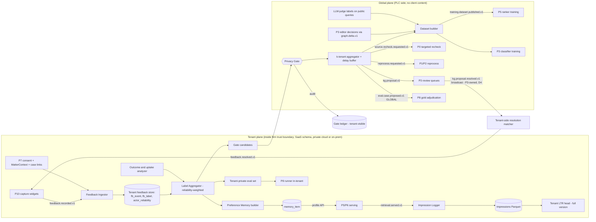

# P9 — Feedback and Self-Improvement Loop

**Abstract.** P9 turns what lawyers do with the system (accept, reject, edit, flag, cite, file, win or lose) into four products: (a) correction *proposals* for the P3 knowledge graph, (b) training data for P5 rankers and P3 classifiers, (c) new regression cases for P8, and (d) per-user/per-firm personalization. It must do this without letting a single byte of client-confidential or privileged content leave the firm's trust boundary. The design is a **two-plane loop**: a *tenant plane* (inside each firm's Tenant Private Layer, sees everything, learns only for that firm) and a *global plane* (Public Legal Corpus side, sees only what the **Privacy Gate** releases: closed-vocabulary signals about public objects, stripped of query text, matter identity and actor identity, released only under consent, sensitivity class, k-tenant and delay rules). Nothing learned from feedback writes directly to the graph or to a production model: every signal becomes a proposal, a dataset or an eval case with lineage, passes review or eval gates, and can be purged by actor, tenant or matter. The market baseline is "we never train on your data" (explicit for Harvey and Thomson Reuters; LexisNexis personalizes per user) [P9-16][P9-17][P9-18][P9-19]; ethics guidance treats self-learning tools as a disclosure risk even inside one firm [P9-15]. Our moat is to learn *more* than those vendors while promising *at least as much*: public-object corrections flow globally, while everything touching a matter stays local.

---

## 1. Purpose and scope

**Purpose.** Close the loop from use to improvement, so that the platform gets measurably better every week and so that the partner firm's expertise compounds into data structure (graph corrections, gold sets, ranking labels) that competitors cannot buy.

**In scope**
1. Capture: a feedback taxonomy and the capture points (with P10/P6/P7), including explicit actions, implicit interaction (impressions, opens, copy-to-draft), edits, and matter outcomes.
2. Tenant-plane processing: storage, label aggregation, reliability weighting, personalization memory, tenant-local eval sets and (full version) tenant-local model adapters.
3. **Privacy Gate** (spine §A): the only path from TPL to PLC. Algorithm, thresholds, consent flags, audit.
4. Global-plane processing: KG correction proposals → P3; training datasets → P5 (reranker/LTR) and P3 (treatment/citation classifiers); eval-case candidates → P8; targeted re-crawl/reprocess requests → P0/P1.
5. Outcome capture and "argument uptake" labelling from public final orders.
6. Governance: lineage, retention, erasure cascades (DPDP), unlearning, anti-poisoning.
7. Proving the loop works: offline counterfactual evaluation, interleaving, A/B, and loop-health metrics.

**Out of scope** (owned elsewhere): the review UI and ontology decisions (P3), ranking model architecture (P5), the eval harness and gold-set format (P8), the capture widgets themselves (P10), matter/document storage and ACLs (P7), deployment topology (13).

**Design principles**
- **P-1 Proposals, not writes.** Feedback never mutates the graph, an index or a production model directly.
- **P-2 Local by default.** Every signal is born `TENANT_ONLY`; crossing the gate is an explicit, audited, consented transformation.
- **P-3 Public objects only cross.** A signal may leave a tenant only if its target is a PLC object (`wrk_`, anchor, `asr_`, citation mention) and its content can be expressed in a closed vocabulary.
- **P-4 Legal relevance ≠ lawyer liking.** Lawyers engage less with adverse authority; the loop must never learn to hide it.
- **P-5 Everything is purgeable.** Every derived artifact records which feedback produced it, so one actor's, one matter's or one tenant's influence can be removed.
- **P-6 Improvement must be demonstrated**, not assumed: every model or graph change sourced from feedback ships only after P8 regression and a guarded online test.

---

## 2. Input and output contracts

### 2.0 Spine v1.0 conformance

Spine v1.0 (the principal architect's decision record, D1–D18) supersedes spine v0.1 where they differ. This section records how each of P9's proposed changes (§2.5) was decided. The rest of the document has been edited to follow the decisions.

| P9 proposal (§2.5) | Disposition | Effect on this document |
|---|---|---|
| 1. Extend FeedbackEvent | **ACCEPTED-MODIFIED as D9 (merged P9 + P10 S10-5)** | Accepted: `actor_ref`, closed `reason_code`, `context{query_id, trace_id, impression_id, position, surface, ranker_version, memo_id}`, `consent_snapshot_id` and `recorded_at`. Target kinds + `ANCHOR`, `CITATION_MENTION`, `DRAFT_SPAN`, `MEMORY_ITEM`. Actions + `FLAG_WRONG_TREATMENT`, `FLAG_PARSE_ERROR`, `FLAG_MISSING_AUTHORITY`, `USED_IN_FILING`, `RETRACT`. Four-valued `privilege_class`. `context.surface` **adds P10's `DIGEST`, `WORD_ADDIN`, `SOURCE_VIEWER`, `COMMAND_BAR`, `MOBILE`, `WHATSAPP`**. The ID prefix is `fb_` (D12), not `fbk_`. Targets are anchors, never chunk_ids (D8). `REVIEW_TASK` target / `MICRO_REVIEW_ANSWER` action are kept as a P9 extension that D9 did not rule on (§2.4). |
| 2. Add `retrieval.served.v1` | **ACCEPTED as D4; schema owned by P5** | P5 → P8, P9 (tenant plane). 07_P5 §2.4 is authoritative and merges this doc's impression fields (`slot`, `propensity`, `randomized`, `features_ref`, `experiment.interleave`). The schema in §2.4 below is kept as P9's field requirements. |
| 3. Add `kg.proposal.v1` (P9 → P3) | **ACCEPTED as D4** | `KgProposal` (`kgp_`) is a new core object (D9). |
| 4. Add `eval.case.proposed.v1`, `training.dataset.published.v1` | **ACCEPTED as D4** | P8 owns `EvalCase` (`evc_`) and the gold sets (`gld_`). P9 emits candidates only. |
| 5. Add `erasure.requested.v1` | **ACCEPTED as D4** (P7 → P9, P2, P5, P6) | The **producer of both `erasure.requested.v1` and `erasure.completed.v1` is P7** (D4). P9 reports its component receipt to P7's erasure workflow, and P7 publishes `erasure.completed.v1{component: "P9", …}` (§5.12). Masking of *public* text is not an erasure: it arrives as `doc.redacted.v1` (D16). |
| 6. Add `feedback.resolved.v1` (P9 → P10), `source.recheck.requested.v1` (P9 → P0) | **ACCEPTED as D4** | P3 may also emit `source.recheck.requested.v1` (D4: P9/P3 → P0). |
| 7. `Assertion.qualifiers.proposal_ids[]` | **ACCEPTED as D7** | — |
| 8. `ResearchQuery.experiment{exp_id, arm}` + `personalization_profile_ref` | **ACCEPTED as D9** | — |
| 9. Envelope rule for gate-crossing events; add `kg.proposal.status.v1` and `erasure.completed.v1` | **ACCEPTED-MODIFIED as D2 + D4** | The rule becomes the spine's **Privacy-Gate envelope rule**. *Any* PLC-side event caused by tenant activity (gate releases, `kg.proposal.v1`, `source.recheck.requested.v1`, `reprocess.requested.v1`, `eval.case.proposed.v1` GLOBAL, `training.dataset.published.v1` GLOBAL) carries `tenantid`=null, a fresh trace root and no tenant causation chain. Attribute names are `tenantid`, `causationid`, `idempotencykey`, `schemaversion` and `dataclass`. **`kg.proposal.status.v1` is REJECTED as a P9 event. It is replaced by `kg.proposal.resolved.v1`, produced by P3 (P3 → P9)** with data `{proposal_id, decision ACCEPTED\|REJECTED\|MERGED\|DEFERRED, resulting_assertion_ids[], reviewer_role, decided_at}` (05_P3 §2). The event carries no tenant IDs and is broadcast to every tenant plane, which matches locally. |

**Renames and decisions this document now follows.**
- `kg.proposal.status.v1` → **`kg.proposal.resolved.v1`** (P3-owned). P9's `NEEDS_EVIDENCE` maps to P3's `DEFERRED`.
- Envelope attributes `tenant_id`/`causation_id`/`idempotency_key`/`schema_version` → **`tenantid`/`causationid`/`idempotencykey`/`schemaversion`**, plus **`dataclass`** (tenant-plane P9 events: `TENANT_CONFIDENTIAL`, or `PRIVILEGED` for WORK_PRODUCT/PRIVILEGED payloads; global-plane: `PUBLIC`).
- **Gate policy (D11):** "no regression > 1 point" is replaced everywhere by **zero-tolerance sentinel suites + one-sided 95% paired-bootstrap non-inferiority at δ_s = max(1 pt, 2·SE_diff,s) per slice + rolling 3-release windows** (P8 owns `GateDecision`). This covers §5.7, §5.13 and §9.
- `feedback_id` prefix `fbk_` → **`fb_`** (D12). `kgp_`, `evc_`, `gld_` and `evr_` follow the registry.
- **Privacy Gate classes (D9)**: S0 objective defect · S1 legal status · S2 relevance/strategy (aggregates only, k ≥ 5 tenants, DP noise) · S3 private (never crosses). Only closed-vocabulary codes and public IDs cross.
- **Impact topology (D3).** P4 stores no tenant dependency sets, so the proposal-priority *exposure* signal can no longer come from "P4's impact index". It is recomputed from global-plane data only (§5.6).
- **Authority display (D6).** Badges are driven only by P3 `AuthorityView`. A tenant's own unreviewed flag is shown as a *separate tenant annotation*, never as a change of badge status (§5.5.3).
- **MT (D8/D16).** Machine translations are not Expressions. A flag on an MT rendition is a `TRANSLATION_ERROR` for P1/P2, never a treatment proposal.
- **Masking (D16).** P9 applies `doc.redacted.v1` (RedactionOverlay) to eval cases, dataset examples and memory items that quote public text (§5.8, §5.12).

### 2.1 Inputs

| Input | Producer | Transport | Notes |
|---|---|---|---|
| `feedback.recorded.v1` (FeedbackEvent, extended — §2.4) | P10, P6, P7 | event bus, tenant-scoped topic | explicit actions + edits + outcomes |
| `retrieval.served.v1` (D4; **schema owned by P5**, 07_P5 §2.4) | P5 (and P6 for memo citations), rendered by P10 | tenant-scoped topic | impression log: what was shown, in which order, with which propensity |
| `interaction.logged.v1` (D4) | P10 | tenant-scoped topic | implicit signals (open source, dwell, copy, pin, export) joined on `impression_id` (UI impressions `uim_`) |
| `alert.state.v1` (D4) | P10 | tenant-scoped topic | delivery/ack state for alert-precision labels |
| `graph.delta.v1` | P3 | global topic | to learn from reviewer decisions (`cause.kind` = HUMAN_REVIEW\|PROPOSAL) and to stale eval cases/memory on `status_changes` |
| `kg.proposal.resolved.v1` (D4; replaces `kg.proposal.status.v1`) | P3 | global broadcast → every tenant plane | `{proposal_id, decision, resulting_assertion_ids[], reviewer_role, decided_at}`; tenant planes match `proposal_id` locally (§5.6) |
| `doc.redacted.v1` (D16; RedactionOverlay) | P0/P1/ops/legal | global topic | re-mask eval cases, dataset examples, memory items (§5.8, §5.12) |
| `doc.parsed.v1` for orders/judgments linked to a tenant's `case_id` | P1 | global topic, filtered by P7's case watch list inside tenant plane | used for outcome/argument-uptake labelling |
| `MatterContext` | P7 (sync API) | tenant plane only | parties, forum, key dates (a derived view of `procedural_events[]`, D9) — used as the *scrub dictionary* for the gate; `privilege_flags.basis` (D16) informs in-house handling (§5.4) |
| Consent registry (`ConsentRecord`) | P7 admin console | sync API | tenant/practice-group/matter/client level flags (§5.4) |
| `erasure.requested.v1` (D4) | P7 | tenant topic | matter, client, actor or tenant erasure; drives cascade (§5.12) |
| `VerificationReport` | P8 | sync/event | P8 verdicts are *machine* labels used to cross-check human feedback |

### 2.2 Outputs

| Output | Consumer | Plane | Contract |
|---|---|---|---|
| `kg.proposal.v1` (**new**) | P3 review queues | global | `KgProposal` (§2.4). Never an Assertion. P3 decides. |
| `reprocess.requested.v1` (spine) | P1/P2/P3 | global | scope = specific `work_id`/anchor; reason `FEEDBACK` (P4's reprocess reason enum, 06_P4 O2), scope naming only the public work/anchor; Privacy-Gate envelope rule applies (`tenantid`=null, fresh trace root; D2) |
| `source.recheck.requested.v1` (**new**, small) | P0 | global | targeted re-fetch of a court/source when a `FLAG_BAD_LAW` refers to a decision we do not yet hold (§5.5.3) |
| `eval.case.proposed.v1` (**new**) | P8 | tenant *or* global | `EvalCaseCandidate` with scope `TENANT_PRIVATE` or `GLOBAL` |
| `training.dataset.published.v1` (**new**) | P5 (LTR/reranker), P3 (treatment + citation-resolution classifiers) | global or tenant | immutable dataset manifest in object store (§2.4) |
| Personalization API `GET /personalization/profile` | P5, P6 | tenant | `PersonalizationProfile` (memory items + ranking priors) |
| `feedback.resolved.v1` (**new**) | P10 | tenant | tells the lawyer what happened to their flag ("accepted by editor, graph updated") — trust and engagement |
| ~~`kg.proposal.status.v1`~~ | — | — | *Superseded (D4):* the public proposal outcome is **`kg.proposal.resolved.v1`, produced by P3** and consumed here (§2.1) |
| Erasure component receipt | P7 erasure workflow | tenant | P9's receipt `{erasure_id, component: "P9", rows_deleted, artifacts_rebuilt[], completed_at}` goes to P7, which publishes `erasure.completed.v1` (D4: P7 is the producer) for DPDP records (§5.12) |

### 2.3 Hand-offs (who does what next)
- P3 consumes `kg.proposal.v1` into its tiered review queue; accepted proposals become Assertions with `method.kind=HUMAN` (D7 `justification.kind` HUMAN) and **`qualifiers.proposal_ids[]`** (spine change §2.5-7, D7) so they can be traced and purged. P3 then emits `kg.proposal.resolved.v1` and a `graph.delta.v1` with `cause.kind=PROPOSAL`.
- P5 trains/validates rankers from dataset manifests, registers them in the Model Gateway/model registry, and must pass P8 gates (D11 non-inferiority policy) before serving.
- P8 adjudicates eval candidates (two-lawyer rule for GLOBAL scope) and adds them to regression suites.
- P6/P5 read `PersonalizationProfile` at query time (≤10 ms cached read).

### 2.4 Schemas

**FeedbackEvent (spine H, extended — additions marked `+`; merged P9 + P10 schema per spine v1.0 D9)**
```ts
type FeedbackEvent = {
  feedback_id: string;            // "fb_<ULID>" (D12; was fbk_)
  tenant_id: string;              // payload field; the envelope carries `tenantid` (D2)
  matter_id?: string;
  actor_role: "PARTNER"|"SENIOR_ASSOCIATE"|"ASSOCIATE"|"PARALEGAL"|"KM_LAWYER"|"CLIENT_USER"|"EDITOR";
  + actor_ref: string;            // tenant-scoped pseudonym "act_<hash>", never email
  target: { kind: "CLAIM"|"ITEM"|"ASSERTION"|"ANSWER"|"ALERT"
        /*+*/ |"ANCHOR"|"CITATION_MENTION"|"DRAFT_SPAN"|"MEMORY_ITEM"|"REVIEW_TASK", id: string };
        // ids are anchors / public or private object IDs, never chunk_ids (D8). REVIEW_TASK is a P9 extension not ruled in D9.
  action: "ACCEPT"|"REJECT"|"EDIT"|"FLAG_WRONG_CITATION"|"FLAG_BAD_LAW"|"RELEVANT"|"IRRELEVANT"|"OUTCOME"
        /*+*/ |"FLAG_WRONG_TREATMENT"|"FLAG_PARSE_ERROR"|"FLAG_MISSING_AUTHORITY"|"USED_IN_FILING"|"MICRO_REVIEW_ANSWER" /* P9 ext., not ruled in D9 */
        /*+*/ |"RETRACT";               // RETRACT = actor withdraws an earlier flag (feeds flip-rate, §5.11)
  + reason_code?: ReasonCode;     // closed vocabulary, see §5.2
  payload: ActionPayload;         // discriminated by action (EditPayload, OutcomePayload, TreatmentCorrection …)
  privilege_class: "PUBLIC_OBJECT_SIGNAL"|"CONFIDENTIAL"|"WORK_PRODUCT"|"PRIVILEGED";  // computed by P9 if absent; max() of computed and user-set
  share_scope: "TENANT_ONLY"|"DEIDENTIFIED_SHAREABLE";   // user/tenant intent; gate still decides
  + context: { query_id?: string; trace_id?: string; impression_id?: string; position?: number;
               surface: "RESEARCH_LIST"|"MEMO"|"DRAFT_EDITOR"|"ALERT"|"CITATOR_PANEL"|"GRAPH_VIEW"|"REVIEW_TASK"
                      /* + P10 surfaces (D9 / 12_P10 S10-5): */ |"DIGEST"|"WORD_ADDIN"|"SOURCE_VIEWER"|"COMMAND_BAR"|"MOBILE"|"WHATSAPP";
               // impression_id = P5 retrieval.served.v1 impression, or a P10 UI impression `uim_…` (D12) for lists P5 did not rank
               as_of_legal_date?: string; ranker_version?: string; memo_id?: string };
  + consent_snapshot_id: string;  // consent state at capture time (§5.4)
  + recorded_at: string;          // RFC3339
  + client_ts?: string;
};
```

**retrieval.served.v1 (D4; schema now owned by P5 — 07_P5 §2.4 is authoritative and is a superset of the fields below)** — one per rendered list; the missing piece for unbiased learning from implicit feedback [P9-1][P9-2]. In P5's version `tenant_id` travels only in the envelope (`tenantid`), and `items[].work_id` is null for TPL items.
```ts
type RetrievalServed = {
  impression_id: string; query_id: string; trace_id: string; tenant_id: string; matter_id?: string;
  surface: string; ranker_version: string; experiment?: { exp_id: string; arm: string; interleave?: { method: "TEAM_DRAFT"; team_of: Record<string,"A"|"B"> } };
  items: Array<{ item_id: string; anchor_ids: string[]; work_id: string; position: number;
                 slot: "BINDING_PINNED"|"ADVERSE_PINNED"|"RANKED";   // pinned slots are never learned from as position-biased clicks
                 propensity: number;        // P(shown at this position | ranking policy); 1.0 if deterministic
                 randomized: boolean;       // part of RandPair/top-k swap intervention
                 features_ref: string;      // pointer to feature vector snapshot (P5 writes, tenant-scoped Parquet)
                 stance?: "SUPPORTS"|"ADVERSE"|"NEUTRAL"|"MIXED"; binding_on_forum?: string }>;
  rendered_at: string;
};
```

**KgProposal (new)** — the only thing P9 sends to P3.
```ts
type KgProposal = {
  proposal_id: string;             // "kgp_<ULID>"
  kind: "RETRACT_ASSERTION"|"CHANGE_PREDICATE"|"ADD_ASSERTION"|"FIX_CITATION_RESOLUTION"|"FIX_ANCHOR"|"FIX_METADATA"|"POSSIBLE_NEGATIVE_TREATMENT_UNSEEN";
  target: { assertion_id?: string; work_id?: string; anchor_id?: string; mention_id?: string };
  proposed?: { predicate?: string; object?: string; cited_anchor?: string; field?: string; value?: string };  // closed vocab or public IDs only
  evidence_public: Array<{ anchor_id: string; span?: [number,number] }>;  // public anchors only
  support: { n_signals: number; n_tenants_bucket: "1"|"2"|"3-5"|"6+"; role_mix: Record<string,number>;
             weighted_score: number; machine_agreement?: number };        // P8/P3-classifier agreement
  impact_tier: 1|2|3; priority: "URGENT"|"HIGH"|"NORMAL"|"LOW";
  gate_decision_ids: string[];      // audit link; no tenant ids
  created_at: string; pipeline_version: string;
};
```

**EvalCaseCandidate (new)**
```ts
type EvalCaseCandidate = {
  candidate_id: string; scope: "TENANT_PRIVATE"|"GLOBAL";
  task: "RESEARCH_RETRIEVAL"|"CITATOR_TREATMENT"|"CLAIM_SUPPORT"|"MEMO_SECTION"|"DEADLINE";
  input: { public_issue_ids?: string[]; question_template?: string; as_of_legal_date: string; forum?: object;
           private_input_ref?: string };                      // only for TENANT_PRIVATE
  expected: { must_include_anchors?: string[]; must_not_include_anchors?: string[];
              expected_treatment?: {assertion_id?: string; predicate: string}; expected_status?: string };
  origin: { feedback_ids: string[]; failure_type: string; model_versions: string[] };
  adjudication: { required_reviewers: 1|2; state: "PENDING"|"ADJUDICATED"|"DISCARDED" };
};
```

**Dataset manifest (new)** — immutable, content-addressed.
```ts
type DatasetManifest = {
  dataset_id: string; purpose: "RERANKER_LTR"|"TREATMENT_CLS"|"CITATION_RES"|"PREFERENCE_TUNING";
  plane: "GLOBAL"|"TENANT"; tenant_id?: string;
  uri: string; sha256: string; n_examples: number;
  sources: Array<{ kind: "GATE_RELEASE"|"EDITOR_LABEL"|"LLM_JUDGE"|"TENANT_FEEDBACK"|"IPS_CLICK"; count: number }>;
  influence_caps: { max_share_per_tenant: number; max_examples_per_actor: number };
  lineage_ref: string;            // table of example_id → feedback_ids / gate_decision_ids
  excluded_by_erasure_until: string;   // erasure ledger watermark applied
  created_at: string; pipeline_version: string;
};
```

**Tenant-plane storage (PostgreSQL, one schema per tenant; RLS as defence-in-depth)**
```sql
CREATE TABLE fb_event (feedback_id text PRIMARY KEY, matter_id text, actor_ref text, actor_role text,
  target_kind text, target_id text, action text, reason_code text, payload jsonb,
  privilege_class text, share_scope text, context jsonb, consent_snapshot_id text,
  recorded_at timestamptz, erased_at timestamptz);
CREATE TABLE fb_label (label_id text PRIMARY KEY, target_kind text, target_id text, label text,
  posterior real, n_votes int, method text, updated_at timestamptz);         -- aggregated (Dawid–Skene) labels
CREATE TABLE actor_reliability (actor_ref text, label_family text, alpha real, beta real, n_gold int,
  PRIMARY KEY(actor_ref,label_family));
CREATE TABLE memory_item (memory_id text PRIMARY KEY, scope text CHECK (scope IN ('USER','MATTER','PRACTICE_GROUP','FIRM')),
  scope_ref text, text text, kind text, source_feedback_ids text[], status text, created_by text,
  approved_by text, embedding vector, expires_at timestamptz);
CREATE TABLE lineage_edge (child_id text, parent_id text, relation text, created_at timestamptz);  -- example→feedback, model→dataset …
```
Impressions and feature snapshots: Parquet in the tenant's object-store prefix, partitioned `tenant/date/surface`.

**Global-plane storage**: `gate_release` (no tenant id; `tenant_bucket_key` = HMAC(K_epoch, tenant_id) with one key per calendar quarter (`key_epoch`), used for k-counting and revocation, key destroyed after 13 months), `kg_proposal`, `dataset_manifest`, `erasure_ledger`.

*[Review addition]* The following contracts were referenced above but not specified; they are needed to build.

**Event envelope rules for P9 events (spine G; = spine v1.0 D2 Privacy-Gate envelope rule).** All new P9 events use the CloudEvents envelope with the D2 extension names (`tenantid`, `causationid`, `idempotencykey`, `schemaversion`, `dataclass`, plus `traceparent`). Tenant-plane events carry a non-null `tenantid` and `dataclass` = `TENANT_CONFIDENTIAL` (or `PRIVILEGED`). **Every event emitted by `p9-global` (and every `GateRelease` on the egress queue) has `tenantid: null`, `dataclass: PUBLIC`, a fresh `traceparent` root, `causationid` = a global-plane ID (`release_id`/`proposal_id`), never a tenant-side `feedback_id`/`trace_id`, and `time` truncated to the hour.** Otherwise the envelope itself becomes a cross-gate linkage channel (see §2.5-9). Under D2 the rule binds *every* PLC-side event caused by tenant activity, not only P9's, and the gate egress validator enforces it.

**ActionPayload (discriminated by `action`)**
```ts
type ActionPayload =
  | { action: "EDIT"; before_hash: string; after_ref: string;          // after_ref = tenant object-store URI, never inline in global events
      diff_stats: { chars_added: number; chars_deleted: number; authorities_added: string[]; authorities_removed: string[] } }
  | { action: "FLAG_WRONG_TREATMENT"|"FLAG_BAD_LAW"; proposed_predicate?: Predicate; negative_authority?: { work_id?: string; citation_text?: string; public_url?: string } }
  | { action: "FLAG_WRONG_CITATION"; mention_id?: string; correct_target_id?: string; correct_citation_text?: string }
  | { action: "FLAG_MISSING_AUTHORITY"; citation_text: string; resolved_work_id?: string; issue_id?: string }
  | { action: "RELEVANT"|"IRRELEVANT"; grade?: 0|1|2|3 }
  | { action: "OUTCOME"; case_id?: string; result: "ALLOWED"|"DISMISSED"|"PARTLY_ALLOWED"|"ADJOURNED"|"WITHDRAWN"|"SETTLED"|"INTERIM_RELIEF_GRANTED"|"INTERIM_RELIEF_REFUSED";
      grounds_succeeded_issue_ids: string[]; order_work_id?: string; decided_on?: string }
  | { action: "MICRO_REVIEW_ANSWER"; task_id: string; answer: "YES"|"NO"|"UNSURE" }   // whether the task was a honeypot is known only server-side
  | { action: "ACCEPT"|"REJECT"|"USED_IN_FILING"|"RETRACT"; ref_feedback_id?: string; free_text?: string };        // free_text ⇒ WORK_PRODUCT
```

**ConsentRecord** (owned by P7 admin console; P9 reads, snapshots are immutable)
```ts
type ConsentRecord = {
  consent_snapshot_id: string;      // "cns_<ULID>"; a new snapshot on every change
  tenant_id: string; level: "TENANT"|"PRACTICE_GROUP"|"MATTER"|"CLIENT"|"ACTOR"; level_ref?: string;
  flags: { S0: boolean; S1: boolean; S2_AGG: boolean; DESIGN_PARTNER_GOLD: boolean; MEMORY_USER: boolean; MEMORY_FIRM: boolean; ADAPTER_TRAINING: boolean };
  evidence: { signed_by_role: string; document_ref: string; signed_at: string };   // written consent artefact (tenant-side)
  valid_from: string; revoked_at?: string;
};
// effective(candidate) = AND over all levels that apply to (tenant, practice group, matter, client, actor); missing level ⇒ inherit; missing tenant record ⇒ all false.
```

**erasure.requested.v1** (D4; producer P7) `data`: `{ erasure_id, scope: "TENANT"|"MATTER"|"CLIENT"|"ACTOR", scope_ref, legal_basis: "DPDP_S12"|"CONTRACT_END"|"CONSENT_WITHDRAWN"|"COURT_ORDER"|"RTBF_MASKING", requested_at, deadline }`. `RTBF_MASKING` covers only P7-initiated erasure of *tenant-plane copies*. Masking of public text is a `doc.redacted.v1` RedactionOverlay (D16), which P9 applies directly (§5.12). Receipt event `erasure.completed.v1` (D4; **producer P7**, one per component) `data`: `{ erasure_id, component, rows_deleted, artifacts_rebuilt[], completed_at }`. P9 sends its component receipt to P7's erasure workflow, and P7 publishes it.

**Proposal resolution broadcast** (spine v1.0 D4: **`kg.proposal.resolved.v1`, produced by P3**, global, public; replaces this doc's earlier `kg.proposal.status.v1`): `{ proposal_id, decision: "ACCEPTED"|"REJECTED"|"MERGED"|"DEFERRED", resulting_assertion_ids[], reviewer_role, decided_at }` (05_P3 §2). The earlier P9 draft's `NEEDS_EVIDENCE` maps to `DEFERRED`. Its `delta_id?` is derivable from `resulting_assertion_ids[]` via the `graph.delta.v1` with `cause.kind=PROPOSAL`, and `public_note_anchor?` is not carried. Every tenant plane subscribes to the whole stream and matches `proposal_id → release_id → feedback_ids` locally, so the global plane never needs to know which tenant to notify.

### 2.5 Proposed spine changes
*Dispositions under spine v1.0 are in §2.0. In summary: 1 → D9 (merged with P10), 2–6 → D4, 7 → D7, 8 → D9, 9 → D2 (with `kg.proposal.status.v1` replaced by P3's `kg.proposal.resolved.v1`).*

1. **Extend FeedbackEvent** with `actor_ref`, `reason_code`, `context{query_id, trace_id, impression_id, position, surface, ranker_version, memo_id}`, `consent_snapshot_id`, `recorded_at`, new target kinds (`ANCHOR`, `CITATION_MENTION`, `DRAFT_SPAN`, `MEMORY_ITEM`), new actions (`FLAG_WRONG_TREATMENT`, `FLAG_PARSE_ERROR`, `FLAG_MISSING_AUTHORITY`, `USED_IN_FILING`), and a fourth `privilege_class` enum. *Why:* without the context link, feedback cannot be joined to what was shown, so it is unusable for learning-to-rank [P9-1]; without consent snapshots, the gate cannot prove lawful release.
2. **Add `retrieval.served.v1`** (P5/P6 → P9, tenant-scoped) carrying positions, slots and propensities. *Why:* counterfactual LTR requires logged propensities [P9-1][P9-2]; clicks without impressions are biased beyond repair.
3. **Add `kg.proposal.v1`** (P9 → P3). *Why:* principle P-1; P3's queue needs a typed input distinct from P1/P3 machine extraction.
4. **Add `eval.case.proposed.v1`** (P9 → P8) and **`training.dataset.published.v1`** (P9 → P5/P3).
5. **Add `erasure.requested.v1`** (P7 → P9, P2, P5 caches, P6 memory) with scope `{tenant|matter|client|actor}`. *Why:* DPDP erasure and tenant off-boarding need one fan-out event; Rule 8 erasure obligations take effect 13 May 2027 [P9-24].
6. **Add `feedback.resolved.v1`** (P9 → P10) and **`source.recheck.requested.v1`** (P9 → P0).
7. **Assertion.qualifiers.proposal_ids[]** (optional). *Why:* purge-by-actor/tenant (anti-poisoning, §5.11) must find every edge a feedback-derived proposal influenced.
8. **ResearchQuery.experiment{exp_id, arm}** and **`personalization_profile_ref`**. *Why:* interleaving/A/B assignment must be decided before retrieval and recorded for analysis.
9. *[Review addition]* **Envelope rule for gate-crossing events (spine G).** Spine G's envelope carries `tenant_id`, `traceparent` and `causation_id`; if propagated unchanged across the Privacy Gate they re-link global records to tenant traces and defeat the gate. Proposed rule: events produced on the PLC side from gate releases must have `tenant_id=null`, start a new trace, and use only global-plane IDs as `causation_id`; the gate egress validator rejects any envelope that violates this. Also add `kg.proposal.status.v1` (public broadcast) and `erasure.completed.v1` (receipt) to the spine event table. **v1.0:** the envelope rule is ACCEPTED as the D2 Privacy-Gate envelope rule. The broadcast is ACCEPTED-MODIFIED as P3's `kg.proposal.resolved.v1`. `erasure.completed.v1` is ACCEPTED with P7 as producer.

---

## 3. State-of-the-art survey (with citations)

### 3.1 Learning to rank from implicit feedback
- **Position bias and counterfactual LTR.** Clicks are biased by position; Joachims, Swaminathan and Schnabel (WSDM 2017, best paper) frame learning from clicks as counterfactual inference and derive a propensity-weighted ranking SVM; it is robust to noise and to propensity misspecification, *provided propensities are known or estimated* [P9-1].
- **Estimating propensities.** Randomized swap experiments degrade user experience; Agarwal et al. (WSDM 2019) show that "intervention harvesting" across logs from several ranker versions yields consistent propensity estimates without intrusive randomization [P9-2]. Implication for us: every ranker version change is free intervention data *if* impressions are logged with versions — hence `retrieval.served.v1`.
- **Online evaluation.** In a large-scale validation combining data from the Yahoo! and Bing search engines and arXiv full-text search, interleaving required "approximately 1–2 orders of magnitude less data than absolute metrics" (i.e., A/B-style click metrics) to reach a statistically reliable preference [P9-3]; relevant because our traffic is small (one design-partner firm at first). *(Review note: an earlier draft's "38 experiments, >3 billion clicks" could not be found in the paper and was removed.)*
- **Feedback loops degrade.** Jiang et al. analyse how recommender feedback loops drive systems toward degenerate states (echo chambers vs filter bubbles) and "offer practical solutions to slow down system degeneracy" [P9-4]; the specific remedies we rely on — continuous random exploration and a growing candidate pool — are our reading of the paper body *(snippet; not confirmed from the full text in review)*.
- **LLM rerankers and distillation.** Instructed LLMs rank competitively with supervised rankers, and distillation produced a 440M model beating a 3B supervised baseline [P9-10]: a cheap way to produce dense labels, which human feedback then calibrates.

### 3.2 Learning from human preference, edits and naturally occurring feedback
- **DPO** replaces RLHF's reward model + RL with a classification loss on preference pairs [P9-5]. **KTO** learns from *binary* desirable/undesirable labels (thumbs), reporting parity with preference-based methods from 1B to 30B parameters (ICML 2024) [P9-6] — the shape of signal legal products actually collect.
- **Edits as supervision.** PRELUDE/CIPHER (NeurIPS 2024) infer a *natural-language* description of a user's latent preference from their edits, retrieve preferences from the k closest past contexts, and condition generation on them — no fine-tuning, interpretable, user-editable; lowest edit-distance cost among baselines on summarization and email tasks with simulated users [P9-7].
- **Implicit conversational feedback is noisy.** Liu, Zhang and Choi (EMNLP 2025) find implicit feedback in WildChat/LMSYS logs helps on short questions but not on long, complex ones [P9-8]; RESPECT retrospectively mines implicit signals from multi-turn interactions, raising task completion from 31% to 82% on an abstract-reasoning game over thousands of human interactions [P9-44]. Legal memos are the "long, complex" case — implicit chat sentiment is a weak signal for us.
- **Acceptance rate as product metric.** For code completion, the share of shown suggestions accepted predicted perceived productivity better than persistence metrics [P9-9] — support for using accept/copy-to-draft rates as a top-line loop metric, not as a training label by itself.

### 3.3 Weak supervision, active learning and label aggregation
- **Snorkel/data programming** combines noisy labeling functions with a generative label model, used for knowledge-base construction among others [P9-11]. Lawyer flags, P8 verifiers, rule-based citators and LLM classifiers are exactly such noisy sources for treatment edges.
- **Continuous active learning (CAL)** from technology-assisted review in e-discovery: iteratively learning from reviewer judgments and selecting the next documents to review outperformed simple active/passive learning protocols [P9-12]. Lawyers already accept this style of human-machine review workflow, which makes "one-tap verify" micro-review tasks culturally plausible.
- **Annotator reliability.** Classical latent-class aggregation (Dawid–Skene) estimates per-annotator confusion matrices without gold labels [P9-40] *(unverified — from memory)*.

### 3.4 Poisoning of feedback and fine-tuning data
- A near-constant number of poisoned samples (~250 documents) backdoored models from 600M to 13B parameters regardless of clean-data volume [P9-14]; the lesson for us is that **absolute** caps per contributor matter more than percentage caps.
- Poisoned RLHF preference data can implant a universal "jailbreak backdoor", though it is harder to plant than classic backdoors (ICLR 2024) [P9-13].

### 3.5 Privacy, de-identification and unlearning
- **Legal NER for India.** InLegalNER provides 46,545 annotated entities over 14 legal entity types in Indian judgments [P9-26] (types include petitioner, respondent, judge, lawyer, court, statute, provision, precedent — list from memory, *unverified*).
- **Generic PII tools.** Presidio ships India recognizers (`IN_PAN`, `IN_AADHAAR`, `IN_VEHICLE_REGISTRATION`, `IN_VOTER`, `IN_PASSPORT`, `IN_GSTIN`) [P9-27]; independent evaluation of widely downloaded PII-masking models finds serious gaps on ambiguous, context-dependent and domain-specific content [P9-28]. **Conclusion: scrubbing free text is not a sufficient privacy control for privileged legal text.**
- **Re-identification.** LLMs struggled to re-identify persons in anonymized Swiss court decisions, while succeeding on anonymized Wikipedia [P9-29] — a reassuring but jurisdiction- and data-specific result; client matter data has far richer quasi-identifiers than published judgments.
- **Differential privacy for text.** DP synthetic text can be produced by DP fine-tuning or by DP *prediction* (aggregating many LLM outputs); Amin et al. generate thousands of high-quality synthetic examples where prior private-prediction work reported fewer than 10 at reasonable privacy levels [P9-30]. DP-SGD (Abadi et al., CCS 2016) is the training-time foundation [P9-41].
- **Memorization in fine-tuning.** Wang and Li report that LoRA fine-tuning substantially mitigates memorization relative to full fine-tuning while preserving task performance [P9-34]; "mitigates" is not "eliminates", so tenant adapters are still treated as containing tenant data.
- **Unlearning.** SISA sharding makes exact unlearning a partial retrain [P9-31]; S3T (ICLR 2025) trains PEFT layers on disjoint shards so unlearning is "deactivating the layers affected by data deletion" [P9-32]. Per-tenant adapters served at scale are feasible (S-LoRA: thousands of adapters, up to 4× throughput over naive vLLM/PEFT serving) [P9-33].

### 3.6 Legal-industry practice and expectations
- **No-training commitments are the norm.** Harvey requires zero data retention from model providers, contractually prohibits them from training on customer data, states "we don't use inputs, outputs, or uploaded documents to train underlying models", and lets customers set retention [P9-17]. Thomson Reuters: "Your user content and prompts are not used to train or improve CoCounsel and associated products or LLMs"; all calls to GenAI providers are zero-retention [P9-18]. LexisNexis Protégé (June 2025) personalizes to the user's workflows, preferences, work product and the organisation's DMS [P9-19]; *the per-user isolation statement attributed to it in an earlier draft ("not used to inform performance for other users") was not found in the cited announcement and is treated as unverified.*
- **Personal memory is now table stakes.** Harvey "Memory" (announced Jan 2026, early access Aug 2026) learns drafting style, structure, legal positions; users can review, edit, search, delete or disable; memories are cited like sources; memories are never used to train models; matter- and org-level memory are *planned*, not shipped [P9-16][P9-39].
- **Editorial loops are the incumbents' moat.** Westlaw reports human editorial teams reviewing machine-generated tags, with corrections fed back into the algorithm [P9-20]. Commercial tools still hallucinated 17–33% of the time in Stanford's preregistered study [P9-21] — every hallucination a lawyer catches is a free, high-value eval case if we capture it.
- **Ethics.** ABA Formal Opinion 512 (29 July 2024): self-learning GAI tools can disclose one client's information in another matter; informed consent is required before inputting client information into such tools; boilerplate in engagement letters is not sufficient [P9-15]. Not binding in India, but it is what global and Indian Tier-1 firms' risk teams read.
- **Indian privilege law.** BSA 2023 s.132 (formerly Evidence Act s.126) bars an advocate from disclosing professional communications without the client's consent, with exceptions for illegal purpose and crimes/fraud observed during engagement; s.134 covers confidential communications with legal advisers [P9-25]. In *In Re: Summoning Advocates who give Legal Opinion…*, 2025 INSC 1275 (31 Oct 2025, 3-judge bench), the Supreme Court held investigating agencies cannot summon advocates merely for representing clients except within s.132's exceptions (and then only with the exception specified, superior-officer approval, and judicial review under s.528 BNSS) [P9-25] — privilege is taken seriously and the client, not the vendor, owns waiver. The same judgment held that **in-house counsel are not "advocates" for s.132 purposes** (full-time salaried employment lacks the required independence) [P9-25] — directly relevant when a P9 tenant is a corporate legal department (see §5.4, §8).
- **Language of judgments.** Article 348(1)(a) of the Constitution requires proceedings in the Supreme Court and every High Court to be in English; a Governor may authorise Hindi or a State language in High Court proceedings under Art. 348(2), but that proviso does not extend to judgments, decrees or orders [P9-45]. Subordinate-court judgments are frequently in the State language *(unverified — governed by State notifications under CPC s.137)*, and vernacular translations of Supreme Court judgments are published for litigants' understanding with the English text remaining authoritative *(unverified)*. Consequence for P9: a flag on a `hi` expression means different things depending on which expression is authoritative (§8).
- **DPDP.** The s.17(1)(a) exemption (processing "necessary for enforcing any legal right or claim") disapplies most of Chapter II, Chapter III and s.16, but *not* s.8(1) and s.8(5) (security safeguards) [P9-22]. Secondary use of client data to improve a vendor's product is not obviously "necessary for enforcing a legal right", so we must not rely on this exemption for P9 learning. s.12 gives erasure rights subject to legal retention needs [P9-23]. DPDP Rules 2025 were notified 13 Nov 2025; Rules 3, 5–16, 22–23 commence 18 months later; Rule 8 requires erasure once it is reasonable to assume the specified purpose is no longer served (fixed three-year periods apply only to specified large e-commerce, online-gaming and social-media fiduciaries) and at least one-year retention of logs; Rule 7 requires a detailed breach report to the Data Protection Board within 72 hours [P9-24].
- **Outcomes and prediction.** Litigated cases are not a random sample of disputes (Priest–Klein selection effect) [P9-35]; Medvedeva & McBride reviewed 150+ "legal judgment prediction" papers and found only ~7% actually predict court decisions from pre-decision information [P9-36]. eCourts exposes case status and orders by CNR through its portal; no general-purpose public API for private parties was found, and third-party APIs exist [P9-37] *(snippet; whether NJDG's government-department API access could extend to vendors is unverified)*.
- **Right to be forgotten.** The Delhi High Court (*Laksh Vir Singh Yadav v. Union of India*, W.P.(C) 1021/2016, decided 2026) set out a framework distinguishing de-indexing from masking names of acquitted persons in published judgments [P9-38]; derived datasets (eval cases, training sets) must honour masking propagated from PLC.

---

## 4. Mistakes others made and how we avoid them

| System/paper | What went wrong | Evidence | How we avoid it |
|---|---|---|---|
| Naive click-trained rankers (general web/recsys) | Clicks confounded with position; models learn to reproduce their own ranking | [P9-1][P9-2] | Log impressions with propensities; IPS-weighted training; harvest interventions across versions; pinned slots excluded |
| Recommender loops | Degenerate feedback loops / filter bubbles | [P9-4] | Exploration budget in non-pinned slots; candidate pool keeps growing via P5 recall; "adverse recall" guardrail |
| Legal AI vendors (Harvey, TR, Lexis) | Blanket "no training" leaves shared-corpus errors uncorrected by users; learning is per-user only | [P9-16][P9-17][P9-18][P9-19] | Privacy Gate allows *public-object* corrections to benefit all tenants, under consent, without client content |
| Harvey Memory v1 | User-level only; matter/org scopes and ethical walls not yet addressed | [P9-16] | Scoped memory (USER/MATTER/PRACTICE_GROUP/FIRM) with wall enforcement and KM approval for firm scope (§5.9) |
| Self-learning GAI tools (ABA concern) | One client's information surfaces in another matter | [P9-15] | Matter-scoped memory; no cross-matter retrieval of MATTER items; firm-level items linted for client identifiers |
| Commercial legal research tools | 17–33% hallucination; users catch errors but vendors do not show systematic capture | [P9-21] | Every FLAG_WRONG_CITATION / REJECT(unsupported) becomes an eval candidate with provenance; closed-loop status back to user |
| PII masking models | Miss context-dependent and domain-specific identifiers | [P9-28] | Free text never crosses the gate; only closed vocabulary + public IDs; scrubbing is a secondary control |
| Legal judgment prediction literature | Leakage of outcome into inputs; not true forecasting | [P9-36] | No win-probability product; outcomes used for argument-uptake labels and calibration only, with pre-decision cut-offs |
| Outcome-based learning generally | Selection bias (settled cases missing) | [P9-35] | Outcome labels flagged as selection-biased; never sole training signal; stratified by forum and stage |
| RLHF pipelines | Poisoned preference data implants backdoors; small absolute counts suffice | [P9-13][P9-14] | Per-actor/per-tenant absolute caps, reliability weighting, honeypots, canary evals, purge-by-actor lineage |
| Implicit chat feedback mining | Noisy for long, complex tasks | [P9-8] | Implicit sentiment not used as label for memos; rely on structured actions (accept/edit/used-in-filing) |
| Editorial-only citators | Slow correction; users' knowledge of recent reversals unused | [P9-20] (editorial model) | `FLAG_BAD_LAW` triggers urgent P0 recheck and P3 queue within 1 h (§5.5.3) |

---

## 5. Recommended design, in detail

### 5.1 Architecture overview



Two deployable units: `p9-tenant` (one logical instance per tenant; containerized so it runs in SaaS, private cloud or on-prem, i.e. every spine v1.0 D17 deployment: D1 pooled, D2 dedicated cell (the MVP for the design partner), D3 customer VPC, D4/D4h on-prem) and `p9-global` (vendor-operated, PLC side). The **only** network path from `p9-tenant` to `p9-global` is the gate's outbound queue, which carries `GateRelease` records whose schema has no free-text field.

### 5.2 Feedback taxonomy and capture points

**ReasonCode** (closed vocabulary; P10 renders as chips, no typing required):
`WRONG_PARA` · `CITATION_NOT_FOUND` · `CITATION_RESOLVES_TO_WRONG_CASE` · `QUOTE_NOT_IN_SOURCE` · `MISSTATES_HOLDING` · `OBITER_NOT_RATIO` · `OVERRULED` · `REVERSED_ON_APPEAL` · `PER_INCURIAM` · `STAYED` · `LEGISLATIVELY_OVERRIDDEN` · `WRONG_TREATMENT_LABEL` · `WRONG_BENCH_OR_DATE` · `OCR_GARBLED` · `WRONG_LANGUAGE_VERSION` · `TRANSLATION_ERROR` *(review addition)* · `NOT_ON_POINT` · `UNFAVOURABLE_BUT_RELEVANT` · `NOT_BINDING_HERE` · `OUTDATED_PROVISION_VERSION` · `WRONG_CRIMINAL_CODE_MAPPING` · `DEADLINE_WRONG` · `STYLE_ONLY` · `OTHER`.

| # | Signal | Capture point (owner) | Strength | Primary use | Default `privilege_class` | Sensitivity |
|---|---|---|---|---|---|---|
| 1 | `FLAG_WRONG_CITATION` + reason | citation chip in memo/answer; click-to-source viewer (P10) | strong, verifiable | (a) P3/P1 fix; (c) eval | PUBLIC_OBJECT_SIGNAL | S0 |
| 2 | `FLAG_PARSE_ERROR` (OCR, para numbering, language) | source viewer (P10) | strong, verifiable | reprocess P1/P2 | PUBLIC_OBJECT_SIGNAL | S0 |
| 3 | `FLAG_BAD_LAW` / `FLAG_WRONG_TREATMENT` + reason (+ optional public anchor of the overruling case) | citator panel, authority card (P10) | strong, high impact | (a) urgent P3/P0; (c) | PUBLIC_OBJECT_SIGNAL | S1 |
| 4 | `FLAG_MISSING_AUTHORITY` (lawyer pastes a citation) | memo section "add authority" (P6/P10) | strong | (b) recall labels; (c) must-include | CONFIDENTIAL (query context) | S2 |
| 5 | `RELEVANT` / `IRRELEVANT` + reason | result list (P10) | medium | (b) | CONFIDENTIAL | S2 |
| 6 | `ACCEPT` / `REJECT` claim + reason | memo claim toolbar (P6/P10) | medium–strong | (c), (b) via cited anchors, (d) | WORK_PRODUCT | S2 (claim) / S0 if reason is citation-level |
| 7 | `EDIT` (diff of claim or draft span) | draft editor (P10) | strong for style, weak for law | (d) memory; (c) if claim deleted as wrong | WORK_PRODUCT | S3 |
| 8 | `USED_IN_FILING` (authority or draft span exported to a filed document) | export to Word/court format (P10/P7) | strongest implicit | (b), (d) | CONFIDENTIAL | S2 |
| 9 | Implicit: open source, dwell, copy, pin to matter | P10 telemetry joined to `retrieval.served.v1` | weak, position-biased | (b) with IPS | CONFIDENTIAL | S2 |
| 10 | Alert feedback (`ALERT` target: useful / not relevant / wrong) | alert inbox (P10) | medium | P4 impact precision; (c) | CONFIDENTIAL | S2 |
| 11 | `OUTCOME` (hearing/final result, grounds succeeded) | matter timeline (P7/P10) + auto from public orders | strong but biased | (c), uptake labels; never a win predictor | CONFIDENTIAL | S2 |
| 12 | Review-task answers (micro-review) | "one-tap verify" card (P10) on public edges | strong, reliability-scored | (a), P3 classifier labels | PUBLIC_OBJECT_SIGNAL | S0/S1 |
| 13 | Memory item approve/edit/delete | memory panel (P10) | strong | (d) | WORK_PRODUCT | S3 |

**Sensitivity classes** (drive the gate):
- **S0 Objective defect** — defect in a public artifact verifiable by anyone reading the public source (wrong para, OCR, wrong resolution, wrong date/bench).
- **S1 Legal-status signal** — claim about the legal status of a public authority (overruled, wrong treatment). Verifiable from public sources but reveals *which authority a firm scrutinizes*.
- **S2 Relevance/strategy signal** — anything whose meaning depends on the query or matter (relevance, stance, usage, outcome).
- **S3 Private content** — targets private objects (`pdoc_…`, drafts, memory) or carries free text.

**Capture UX rules (with P10):** one tap plus optional reason chip; never a mandatory free-text box; free text, if typed, is stored `WORK_PRODUCT` and never leaves the tenant; the lawyer sees a "shared to improve public data" marker only on S0/S1 flags when their tenant has enabled the programme; every flag gets a visible resolution via `feedback.resolved.v1`.

### 5.3 Tenant plane: ingestion, classification, aggregation

1. **Ingest** (`FeedbackIngestor`): validate schema; dedupe on `(actor_ref, target, action, 10-minute window)`; join `context.impression_id` to impression row; resolve `target` to PLC IDs where possible (claim → cited anchors); stamp `consent_snapshot_id`.
2. **Privilege classifier** (deterministic rules first): `privilege_class = max(user_set, rule(target_kind, has_free_text, surface))`; any `pdoc_` anchor, draft span, memory item or free text ⇒ ≥ WORK_PRODUCT; target public + no free text + reason in S0/S1 set ⇒ PUBLIC_OBJECT_SIGNAL.
3. **Reliability-weighted aggregation.** For each `(target, label_family)` compute a posterior with per-actor weights. Each actor has a Beta(α,β) accuracy per label family, seeded by role priors and updated whenever a label is adjudicated (P3 editor decision in `graph.delta.v1`, P8 gold, honeypot). Aggregation: weighted log-odds vote (Dawid–Skene EM once ≥200 adjudicated labels per family [P9-40]).
   ```python
   def posterior(votes):                 # votes: [(actor, label∈{+1,-1})]
       s = prior_logit[family]
       for a, y in votes:
           acc = beta_mean(rel[a, family]); acc = clip(acc, 0.55, 0.97)
           s += y * log(acc / (1 - acc)) * min(1.0, cap_weight(a))
       return sigmoid(s)
   ```
   Role priors (unvalidated starting values; recalibrated monthly): partner 0.85, senior associate 0.80, associate 0.72, paralegal 0.65, KM lawyer 0.85, client user 0.55.
4. **Machine cross-check.** For S0/S1 targets, attach P8/P3 machine opinion (e.g. does the quoted text exist at the anchor; does the claimed overruling case exist and cite the target). Disagreement between machine and a single human lowers priority but never discards a human flag.

### 5.4 Consent model

`ConsentRecord` levels, most restrictive wins: **tenant contract** (Public Corpus Improvement Programme: `S0` on/off, `S1` on/off, `S2_aggregate` on/off, `design_partner_gold` on/off) → **practice group** → **matter** (`privilege_flags.no_share`; `privilege_flags.basis` per D16) → **client** (client-instructed opt-out) → **actor** (personal opt-out of memory). Defaults: S0 and S1 **on** for design partner (explicit written consent), **off** for new tenants until the admin opts in during onboarding (consent screen lists exact release schemas and shows sample gate ledger entries). S2 aggregate is off by default for all tenants. Every event carries the snapshot ID that was in force when it was captured; revocation stops future releases and triggers contribution removal where still linkable (§5.12; revocation mechanics §5.5.2).

*[Review addition] Corporate legal departments as tenants.* In-house counsel do not attract s.132 BSA privilege [P9-25]. Under spine v1.0 this is recorded as `MatterContext.privilege_flags.basis = NONE_IN_HOUSE` (D16, IN C9), so for such tenants P9 must not rely on "privileged" labelling to protect content; the gate treats all matter-derived content identically regardless of `privilege_class` (it is excluded by construction, not by privilege), and the consent screen for in-house tenants states that the tenant itself is the client and signs as such. Conversely, where an in-house team instructs an external firm that is *also* a tenant, the two tenants' consents are independent; neither can release signals about the other's matter.

Rationale: DPDP s.17(1)(a) does not obviously cover vendor product improvement [P9-22]; ABA-512-style informed consent expectations [P9-15]; privilege waiver belongs to the client under BSA s.132 [P9-25]. Because S0/S1 releases contain no client personal data and no privileged communication (only public IDs and closed codes), the consent is primarily contractual and reputational, not a waiver of privilege; S2 and anything derived from matter content needs stronger, specific consent.

### 5.5 The Privacy Gate

#### 5.5.1 What may cross (allowlist)

`GateRelease` is the only cross-plane record:
```ts
type GateRelease = {
  release_id: string; sensitivity: "S0"|"S1"|"S2_AGG";
  signal: ReasonCode | "RELEVANT_GRADE" | "COURT_RELIED" | "MICRO_REVIEW_ANSWER";
  target: { work_id?: string; anchor_id?: string; assertion_id?: string; mention_id?: string; public_issue_id?: string };
  value?: { predicate?: string; object_public_id?: string; grade?: 0|1|2|3; answer?: "YES"|"NO"|"UNSURE" };
  evidence_public?: string[];        // public anchor_ids only
  public_url?: string;               // [review] urgent path only: canonical URL on an allowlisted public domain
                                     //   (sci.gov.in, *.nic.in HC sites, indiankanoon.org, livelaw.in, barandbench.com); query string stripped
  weight: 0.5|1.0|1.5;               // [review] reliability weight QUANTIZED to 3 levels — a raw per-actor float is a stable actor fingerprint
  role_bucket: "SENIOR"|"JUNIOR"|"KM";
  tenant_bucket_key: string;         // HMAC(K_epoch, tenant_id); for k-counting & revocation only
  key_epoch: string;                 // [review] e.g. "2026Q3"; k-counting never mixes epochs (§5.5.2)
  week: string;                      // ISO week, not timestamp
  consent_attestation: string;       // [review] HMAC(K_epoch, consent_snapshot_id): provable by the tenant, unlinkable once K_epoch is destroyed
};
```
Never crosses: query text, matter/client/party names, `pdoc_` anchors, draft text, free text, actor identifiers, exact timestamps, as_of dates tied to a matter, outcomes of individual matters.

#### 5.5.2 Algorithm

```python
def gate(candidate):                       # runs in p9-tenant, per candidate signal
    c = consent.effective(candidate)       # most-restrictive of tenant/PG/matter/client/actor
    if candidate.privilege_class in {"PRIVILEGED","WORK_PRODUCT"}: return deny("PRIVILEGE")
    s = sensitivity(candidate)             # S0/S1/S2/S3 per §5.2
    if s == "S3" or not c.allows(s):       return deny("CONSENT_OR_S3")
    t = to_public_target(candidate.target) # must resolve to PLC id; claims → cited public anchors
    if t is None or t.is_private():        return deny("NOT_PUBLIC")
    v = to_closed_vocab(candidate)         # reason codes, predicates, public ids only
    if v is None:                          return deny("NOT_EXPRESSIBLE")
    if leaks_matter_terms(v, t, matter_dictionary(candidate.matter_id)):   # parties, counsel, pdoc titles
        return deny("MATTER_TERM")         # defence in depth; v should contain none
    if poison_score(candidate.actor_ref) > τ_poison or over_actor_cap(candidate):
        return hold("RATE_OR_POISON")      # kept tenant-local, re-evaluated later
    r = GateRelease(sensitivity=s, target=t, value=v, weight=clip(w(candidate)),
                    role_bucket=bucket(candidate.actor_role),
                    tenant_bucket_key=hmac(K_epoch, tenant_id), key_epoch=epoch(now()),
                    consent_attestation=hmac(K_epoch, c.snapshot_id), week=iso_week(now()))
    ledger.append_visible_to_tenant(r)     # tenant admin can inspect every release
    if s == "S2": return enqueue_for_aggregation(r)    # never released individually
    return enqueue(r, delay=DELAY[s])      # S0: 24h, S1: 72h (URGENT path: §5.5.3)
```

*[Review addition] Definitions the pseudo-code depends on (starting values, unvalidated; tune on design-partner data):*
- `w(candidate) = beta_mean(rel[actor, family])` mapped to the quantized `weight`: `<0.65 → 0.5`, `0.65–0.85 → 1.0`, `>0.85 → 1.5`. Actors with `n_gold < 5` get `1.0` regardless of role prior.
- `poison_score(actor) = max(z_burst, z_disagree, flip_rate/0.2, concentration/0.5)` where `z_burst` = z-score of the actor's 24 h flag count against the tenant's role-bucket baseline, `z_disagree` = z-score of disagreement with adjudicated outcomes, `flip_rate` = RETRACTs/flags over 30 days, `concentration` = max share of the actor's 30-day flags on a single court or single cited party name. `τ_poison = 3.0`.
- `over_actor_cap(candidate)`: actor has ≥ 50 S1 or ≥ 200 S0 releases in the current calendar month, or ≥ 10 releases on the same `work_id` ever.
- `sensitivity()` is the table in §5.2 keyed on `(action, reason_code, target.kind, has_free_text)`; unknown combinations default to **S3**.
- **Key epochs.** `K_epoch` rotates each calendar quarter and is held in KMS with dual control. Because one tenant has a different `tenant_bucket_key` in each epoch, **k-tenant counts and the 40% per-tenant cap (§5.6) are computed only within a single `key_epoch`**; a 90-day S2 window straddling a quarter boundary is evaluated separately in each epoch and published only if the threshold is met in at least one epoch on its own. Otherwise a single tenant spanning two quarters would count as two tenants.

Global-plane **aggregator** rules:
- **S0**: release to proposals after 24 h delay; k_tenants ≥ 1 (objective defects are verifiable; the P3 editor confirms against the public source).
- **S1**: release after 72 h delay; proposals show `n_tenants_bucket`, never tenant identity; auto-escalation to URGENT only via §5.5.3.
- **S2_AGG** (full version only): counts per `(public_issue_id, anchor_id, grade)` published only when **k_tenants ≥ 5 and k_actors ≥ 10** within a 90-day window (a k-anonymity-style threshold [P9-42]), with Laplace noise calibrated to a per-tenant quarterly ε budget (starting ε = 1 per quarter per tenant for S2; unvalidated — to be set with a privacy review). Relevance grades require a `public_issue_id` assigned in-tenant by a classifier over P3's public issue taxonomy; the query itself never crosses.
- Revocation: on consent revocation, the tenant plane recomputes `HMAC(K_e, tenant_id)` for **every epoch key still held** (up to 13 months, i.e. the current and previous four quarters — *review correction: an earlier draft said only current and previous quarter, which left up to three quarters of releases un-revoked*), and all matching releases are tombstoned and excluded from the next dataset build; keys older than 13 months are destroyed, after which contributions are unlinkable (disclosed in the contract).

#### 5.5.3 Urgent bad-law path [NOVEL — unvalidated]
A lawyer's `FLAG_BAD_LAW` with reason `OVERRULED`/`REVERSED_ON_APPEAL`/`STAYED` is often the *earliest* signal that a decision exists which P0 has not yet captured (e.g. a Supreme Court judgment uploaded late in the day). The gate releases a **minimal** S1 record immediately (no delay) containing only `{work_id, reason_code, optional public citation of the negative authority}`. `p9-global` then (1) emits `source.recheck.requested.v1` to P0 for the courts relevant to the target and the cited authority; (2) creates a P3 `POSSIBLE_NEGATIVE_TREATMENT_UNSEEN` proposal at `URGENT` priority; (3) if P0/P1 find and parse the negative authority, P3 decides and P4 propagates via `graph.delta.v1`/`impact.detected.v1`. Until P3 decides, P5/P10 may show a "your firm flagged this — under review" **tenant annotation** beside the badge, **only to the flagging tenant**. Under spine v1.0 D6 the badge itself is driven only by P3's `AuthorityView` and is not changed by a tenant flag. A global CAUTION + `definitive=false` + `NEGATIVE_SIGNAL_UNDER_REVIEW` appears only if P3 records a plausible negative signal (D6 asymmetric display). Nothing changes globally on a single unreviewed flag (anti-poisoning). If the negative authority is a judgment P0 has already signalled as pronounced but not yet uploaded (`judgment.expected.v1`, D16), P3 attaches the proposal to its EXPECTED stub work, and P4 may raise a PROVISIONAL "text awaited" impact.

*[Review addition] Abuse and load limits on the urgent path.* Because it skips the delay and triggers crawling, the urgent path is itself an attack surface (a tenant could mass-flag to exhaust P0's politeness budget on court portals and get our crawler IP-blocked). Controls: (i) at most one `source.recheck.requested.v1` per `(court_id, target work_id)` per 6 h, deduplicated globally; (ii) per-tenant budget of 20 urgent releases/day (excess are demoted to normal S1); (iii) recheck requests are *hints* that P0 schedules inside its existing per-source rate limits, never bypassing them; (iv) `public_url` evidence is fetched by P0 only if its domain is on the allowlist and is treated as untrusted content (it may itself be a prompt-injection vector for any LLM step in P1/P3). If P0 cannot find the negative authority within 48 h, the proposal is routed to an editor for manual source check and the flagging tenant's badge text changes to "flag not yet confirmed".

### 5.6 Pipeline (a): graph improvement proposals → P3

1. **Group** gate releases by target (`assertion_id` / `anchor_id` / `mention_id` / `work_id`) and signal type, over a rolling 30-day window.
2. **Score**: `weighted_score = Σ weight_i` with per-tenant contribution capped at 40% of the score and per-actor at 1.0; `machine_agreement` from P8/P3 checks (e.g. quote-hash mismatch confirms `QUOTE_NOT_IN_SOURCE`).
3. **Map to proposal kind** (deterministic table): `CITATION_RESOLVES_TO_WRONG_CASE` → `FIX_CITATION_RESOLUTION`; `WRONG_PARA` → `FIX_ANCHOR`; `WRONG_TREATMENT_LABEL` with predicate → `CHANGE_PREDICATE`; `OVERRULED` with public negative authority → `ADD_ASSERTION(OVERRULES)` + `POSSIBLE_NEGATIVE_TREATMENT_UNSEEN`; `OCR_GARBLED`/`WRONG_LANGUAGE_VERSION` → `reprocess.requested.v1` to P1 (no proposal).
4. **Tier and priority**: `impact_tier` copied from the targeted Assertion (spine F) or from the proposal kind (negative treatment, validity, crosswalk = Tier 1). Priority = f(tier, weighted_score, machine_agreement, *exposure*). *Spine v1.0 correction (D3):* P4 never stores tenant dependency sets, so an "active matters citing the target" count from P4 does not exist. `exposure` is instead computed on the global plane only, from public citation in-degree and recency (P3 Graph Query API) plus the number of distinct `tenant_bucket_key`s among gate releases on the target within one `key_epoch`. When S2 aggregates are live, a k ≥ 5-tenant, DP-noised reliance count may be added. *[Review]* Exposure is passed to P3 only as a bucket `0 | 1–2 | 3–10 | 11+`; an exact count of 1 on an obscure authority would tell editors that some firm's live matter turns on it. Suggested priority score: `priority_score = tier_weight[tier] × (1 + log2(1 + exposure_mid)) × weighted_score × (0.5 + machine_agreement)` with `tier_weight = {1: 4, 2: 2, 3: 1}`; URGENT ≥ 12, HIGH ≥ 6, NORMAL ≥ 2, else LOW (starting values, unvalidated).
5. **P3 decides**. P9 recommends; P3 policy: Tier 1 and 2 always human; Tier 3 (e.g. `CITES` resolution, metadata) may be auto-applied by P3 when `machine_agreement ≥ 0.9` and at least two independent signals (or one editor). Accepted proposals become Assertions with `qualifiers.proposal_ids`.
6. **Close the loop**: P3 decides → P3 publishes the public **`kg.proposal.resolved.v1`** broadcast (D4; replaces this doc's earlier P9-published `kg.proposal.status.v1`) together with a `graph.delta.v1` (`cause.kind=PROPOSAL`) → `p9-global` marks the proposal resolved → every tenant plane matches `proposal_id` against its own release ledger and emits `feedback.resolved.v1` to its flagging actors (tenant-side mapping from release → feedback_ids is kept only in the tenant plane; the global plane never addresses a tenant).
7. **Weak supervision for P3 models**: every adjudicated proposal becomes a gold label; unadjudicated gate releases enter P3's label model as one labeling function among others (rule citator, LLM classifier, P8 verifier) [P9-11]. Reviewer decisions update `actor_reliability` in tenant planes via the resolution fan-out (the tenant plane learns whether its actor was right; the global plane never learns who the actor was).
8. **Active learning via micro-review.** P3 exposes a queue of high-uncertainty, high-exposure *public* edges. P9 routes them as `REVIEW_TASK` cards to consenting lawyers who recently opened that authority (they have the context), capped at 3 tasks per lawyer per week, with 10% honeypots (edges with known editor labels) to keep reliability estimates honest — a CAL-style loop [P9-12].

### 5.7 Pipeline (b): ranking data for P5 (and P3 classifiers)

**Label sources, weakest to strongest:**

| Source | Label | Bias control | Plane |
|---|---|---|---|
| Open/dwell ≥ 30 s/copy | weak positive | IPS by position propensity; excluded in pinned slots | tenant |
| `RELEVANT`/`IRRELEVANT` | graded | IPS (explicit feedback is also position-biased); reason code gates meaning | tenant (S2 agg global) |
| `USED_IN_FILING`, "add to memo" | strong positive | IPS; per-matter cap | tenant |
| `FLAG_MISSING_AUTHORITY` | strong positive for unseen item | used as recall label (item was not shown) | tenant |
| LLM-judge graded labels on public queries | graded | calibrated against editor labels; distillation [P9-10] | global |
| Editor/partner gold on public questions | graded, gold | two-lawyer adjudication | global |

**Adverse-authority rule (principle P-4).** `IRRELEVANT` with reason `UNFAVOURABLE_BUT_RELEVANT` is recoded as *relevant* for the relevance objective and as `ADVERSE` for P5's stance model. Items in `ADVERSE_PINNED`/`BINDING_PINNED` slots are never used as position-biased click data. P5's ranking objective is trained per stance stratum, and every candidate ranker must pass an **adverse-recall guardrail**: on P8's gold set, recall@k of adverse binding authority must be **non-inferior** to production under the spine v1.0 D11 gate policy (one-sided 95% paired bootstrap at δ_s = max(1 pt, 2·SE_diff,s) on the adverse-binding slice, over a rolling 3-release window; this replaces the earlier "may not fall by more than 1 point" wording). [NOVEL — unvalidated in legal search.]

**Propensity estimation.** (i) Intervention harvesting across ranker versions [P9-2] (free, requires `ranker_version` in logs); (ii) for bootstrapping, a *RandPair* swap of positions (k, k+1) for k ≥ 4 on 5% of lists in the `RANKED` region only — never touching pinned binding/adverse slots and never the top 3.

**Training objective.** IPS-weighted pairwise/listwise loss [P9-1] with clipped propensities (min 0.05) on tenant data, mixed with calibrated LLM-judge and gold labels on public data for the global model. Two model tiers:
- **Global reranker** (P5-owned architecture; e.g. cross-encoder) trained on public-question data (gold + LLM-judge + S2 aggregates when available). Weekly dataset build; retrain when data grows ≥10% or on drift alarm.
- **Tenant ranking head** (full version): a small feature-level LTR model (e.g. gradient-boosted trees over P5's retrieval/authority features plus tenant priors such as preferred reporters and forums) trained inside the tenant plane when the tenant has ≥20k logged lists; otherwise the tenant uses the global model plus hand-set priors. Tenant heads never leave the tenant plane.

**Reality check.** One design-partner firm will produce thousands, not millions, of lists in year 1. IPS learning needs volume; therefore MVP rankers are trained on gold + LLM-judge labels, and implicit logs are collected now to become useful at scale.

### 5.8 Pipeline (c): evaluation cases for P8

**Triggers**: `FLAG_WRONG_CITATION`; `REJECT` with `MISSTATES_HOLDING`/`QUOTE_NOT_IN_SOURCE`/`OBITER_NOT_RATIO`; confirmed `FLAG_BAD_LAW` (P3 accepted); `FLAG_MISSING_AUTHORITY`; claim deleted in `EDIT` with a reject reason; lawyer overriding a P8 verdict; alert marked wrong; `DEADLINE_WRONG` (always Tier-1 severity).

**Construction**:
- **TENANT_PRIVATE** cases are created automatically from the failing trace (input = private query/matter snapshot reference; expected = must-include / must-not-include anchors, treatment, deadline). They run only in the P8 runner deployed in the tenant plane; results leave the tenant only as pass/fail counts per task family (S0-like metrics, no content).
- **GLOBAL** cases require a public restatement: a lawyer (or an LLM draft approved by a lawyer) rewrites the failure as a question over *public* issues only, e.g. "Is [public anchor X] still good law on [public issue] as of 2025-06-30?" P8 then applies two-lawyer adjudication. Cases derived from S0/S1 releases (wrong citation, bad law) are naturally public and need no restatement.
- De-duplication by hash of `(task, sorted expected anchors, as_of_legal_date)`; masking status from PLC (RTBF, statutory victim anonymity) is re-checked at every suite build so eval data never re-exposes masked names [P9-38]. Under spine v1.0 (D16) the check consumes `doc.redacted.v1` RedactionOverlays (SUPPRESS_ALL / MASK_SPANS / NAME_SEARCH_SUPPRESSED / COURT_PROHIBITION): cases quote the masked rendition, and SUPPRESS_ALL targets are withdrawn from suites within the overlay's `purge_sla`. Expected anchors that fall on an MT rendition are invalid, because MT is never a support anchor (D8).

**Design-partner gold programme** (with P8): (1) *Gold room*: partner lawyers author public-law questions mirroring their practice areas, with expected authorities and adverse authorities, no client facts; (2) *Retrospective closed matters*: only with the client's written consent, lawyers author de-identified case studies (human-written, not auto-scrubbed) used as TENANT_PRIVATE or, after partner sign-off, GLOBAL cases; (3) *Live shadowing*: for opted-in matters, the partner's actual research and filed authorities become TENANT_PRIVATE regression cases. Inter-annotator agreement is measured on 10% overlap and reported per task family.

### 5.9 Pipeline (d): personalization

**Preference memory (MVP)** — CIPHER/PRELUDE-style [P9-7], extended with scopes and walls:
1. When a lawyer finalizes a draft span or memo section, the tenant plane diffs system output vs final text and asks a model (via the Model Gateway, zero-retention provider or in-tenant model) to propose ≤3 preference statements ("Cites SCC before AIR when both exist", "Opens bail applications with custody period"). Edits that change *law* (added/removed authorities) are routed to pipeline (c), not memory.
2. Candidate statements are **linted**: if a statement contains any matter term (party, counsel, `pdoc_` title, amounts) from the matter dictionary, it is forced to `MATTER` scope.
3. Scope rules: `USER` (style; auto-active with a visible "learned" badge); `MATTER` (retrievable only inside that matter); `PRACTICE_GROUP` and `FIRM` (promotion only by a KM lawyer; lint must pass; items are about practice or style, never client facts).
4. At query time P5/P6 retrieve top-k items by context similarity from allowed scopes (`USER` ∪ current `MATTER` ∪ user's `PRACTICE_GROUP` ∪ `FIRM`), honouring P7 ethical walls: a user walled off from matter M never receives M's items even if M's partner promoted them. Applied items are cited in output ("applied preference #12"), like Harvey's cited memories [P9-16]; users can view, edit, delete or disable memory.
5. **Ranking priors**: tenant-level and user-level soft priors (reporter preference, forum emphasis, recency weighting) as bounded feature offsets in P5 (|Δscore| ≤ 10% of fused score), so personalization can never bury a binding or adverse authority.

**Per-tenant adapters (full version, opt-in)**: drafting-style LoRA adapters trained inside the tenant boundary with KTO on accept/reject [P9-6] and DPO on (system draft, lawyer final) pairs [P9-5]; served multi-tenant with S-LoRA-type serving [P9-33]; shards partitioned by matter-year so matter erasure retrains only affected shards (S3T-style) [P9-32]. Adapters never touch legal reasoning or citation selection (those stay grounded in P5/P8), limiting both hallucination risk and memorization exposure [P9-34]. Never shared across tenants.

### 5.10 Outcomes and argument uptake

**Capture.** (1) P10 one-tap hearing result on the matter timeline (`ALLOWED`, `DISMISSED`, `PARTLY_ALLOWED`, `ADJOURNED`, `WITHDRAWN`, `SETTLED`, `INTERIM_RELIEF_GRANTED/REFUSED`) plus multi-select "grounds that succeeded" from the memo's issue list; (2) automatic: P7 links matter → `case_id` (CNR); P0/P4 track that case; when the order/judgment is parsed (`doc.parsed.v1`), the tenant-plane **uptake analyzer** runs. eCourts has no official public API, so tracking depends on P0's portal acquisition [P9-37].

**Uptake analyzer** [NOVEL — unvalidated]: aligns the matter's StrategyMemo (claims, cited anchors, predicted opposing arguments) with the public order: (i) exact-ID match of authorities the court cited (from P1 `CitationMention`s) → `COURT_RELIED`/`COURT_DISTINGUISHED`; (ii) issue-level alignment (LLM over the order's reasoning paras, lawyer confirms in one tap) → ground accepted/rejected; (iii) opposing arguments actually raised (if the opponent's submissions are uploaded) vs predicted → calibration of P6's opposing-counsel agent.

**Public-first labelling principle.** Whatever can be learned from the public order alone (which authorities the court relied on, for which issue) is extracted by P3 from the public document, *not* taken from the tenant; only the mapping to the firm's memo stays private. This removes most of the reason to move outcome data across the gate.

**Use restrictions.** Outcomes are selection-biased (settled and withdrawn matters drop out; forum and counsel confound) [P9-35], slow (years), and prone to leakage if used for prediction [P9-36]. Therefore: no per-matter win-probability model; outcomes feed tenant eval ("did our memo anticipate the grounds that decided the case?"), P6 calibration, and aggregate analytics only.

### 5.11 Anti-poisoning and abuse controls

| Threat | Control |
|---|---|
| Malicious or careless user mass-flags good law as bad | No global change from unreviewed flags; per-actor weight cap 1.0; per-tenant cap 40% of any proposal score; absolute per-actor cap of 50 S1 releases/month [P9-14]; honeypot-based reliability |
| Sybil accounts inside one tenant | k-counting is by `tenant_bucket_key`, not actor; weight caps per tenant |
| Competitor subscribes to steer rankings | Global rankers trained mostly on gold + LLM-judge labels; S2 aggregates need k_tenants ≥ 5; per-tenant share of any dataset ≤ 10% |
| Preference-data backdoors | Adapters are tenant-local; KTO/DPO data filtered by actor reliability; canary prompts in P8 check for trigger-like behaviour [P9-13] |
| Prompt injection via feedback free text | Free text never crosses; tenant-plane LLM jobs treat it as data (no tools, output schema-constrained) |
| Drift after a bad release | Purge-by-actor/tenant: lineage query finds every dataset example, proposal and Assertion (`proposal_ids`) influenced; P3 re-reviews those edges; datasets are rebuilt and models retrained |

Anomaly detection runs daily: burst rate per actor, agreement-with-consensus z-score, flip rate (flag then unflag), topic concentration (a single court or party across many flags). Anomalies set `poison_score`, which holds releases (never silently drops them) pending review.

### 5.12 Governance: lineage, retention, erasure, unlearning

**Lineage.** `lineage_edge` rows link feedback → label → gate release → proposal → Assertion, and example → dataset → model version → Model Gateway deployment. Every artifact carries `pipeline_version` (spine I).

**Retention (defaults; tenant-configurable within limits)**

| Data | Plane | Default retention | Basis |
|---|---|---|---|
| Raw feedback events | tenant | matter lifetime + 1 year, then aggregated | tenant policy; DPDP Rule 8 purpose limitation [P9-24] |
| Impression logs + feature snapshots | tenant | 13 months | enough for propensity estimation across versions |
| Processing/audit logs (gate ledger, access) | both | ≥ 1 year (7 years for gate ledger) | DPDP Rules minimum log retention [P9-24]; audit replay |
| Gate releases | global | indefinite (non-personal) | contract; `tenant_bucket_key` destroyed after 13 months |
| Memory items | tenant | until deleted; MATTER items deleted with matter | user control |
| Tenant adapters / heads | tenant | rebuilt ≤7 days after an erasure affecting their data | erasure SLA |

**Erasure cascade** (`erasure.requested.v1`, scope tenant|matter|client|actor):
```text
1. Tenant plane: hard-delete fb_event/impression rows in scope; delete MATTER/USER memory items;
   mark lineage children "tainted".
2. Tenant models: drop shards/adapters containing tainted examples; rebuild (≤7 days).
3. Tenant eval: remove TENANT_PRIVATE cases in scope.
4. Global plane: releases are non-personal and unlinkable to matter/client; for tenant-scope
   erasure or consent revocation, tombstone releases by tenant_bucket_key (if key still exists)
   and add to erasure_ledger → next weekly dataset build excludes them → retrain (exact unlearning
   by retrain; rankers are small enough to retrain weekly).
5. Send the P9 component receipt {erasure_id, component: "P9", rows_deleted, artifacts_rebuilt[], completed_at} to P7's
   erasure workflow; P7 publishes erasure.completed.v1 (D4: P7 is the producer) for the tenant's DPDP records;
   72-hour breach clock is a P7/13 concern.
```
**Public-text masking (spine v1.0 D16).** `doc.redacted.v1` is not an erasure. On each RedactionOverlay both planes re-mask stored quotes of the affected work/spans: dataset examples, eval cases, memory items and gate-release `evidence_public` excerpts (IDs only, so usually nothing). SUPPRESS_ALL works are excluded from the next dataset build and the models are retrained. The same lineage machinery is used, with the overlay's `purge_sla` as the deadline.
Global GOLD eval cases authored from closed matters are covered by the client consent obtained at creation; withdrawal of that consent triggers removal of the case.

### 5.13 Proving that the loop improves things

Every change sourced from P9 ships through a **release train**:
1. **Offline gates** (P8; spine v1.0 D11 gate policy, which replaces the earlier "no regression > 1 point on any gold slice"): zero-tolerance sentinel suites must pass 100%, and every gold slice (court level, language, practice area, adverse authority, pre/post-BNS, residency route) must pass a one-sided 95% paired-bootstrap **non-inferiority** test at δ_s = max(1 pt, 2·SE_diff,s), evaluated over rolling 3-release windows so repeated small losses cannot accumulate; for rankers, a self-normalized IPS estimate on logged data whose 95% CI lower bound is ≥ 0 improvement [P9-1]; adverse-recall guardrail (§5.7).
2. **Online**: rankers → **constrained team-draft interleaving** [P9-3] (only the `RANKED` region is interleaved; pinned binding/adverse slots identical in both arms) [NOVEL — unvalidated]; memo/drafting features → A/B with per-user switchback weeks (N is small; users are their own controls). Primary metrics: claim acceptance rate, copy-to-draft/used-in-filing rate, edit distance of final vs generated [P9-7][P9-9], citation-flag rate per 100 claims (must fall), time-to-first-usable-memo.
3. **Graph**: proposal precision (share accepted by P3), median time from flag to corrected edge, error recurrence rate (same defect class re-flagged after fix).
4. **Loop health**: feedback coverage (share of memos with ≥1 structured action), label agreement, share of global training data by source, exploration rate, per-tenant data share, gate deny reasons.

### 5.14 Cross-cutting: security, cost at scale (≈5M+ docs), latency, observability, model-agnostic design

**Security.** `p9-tenant` runs in the tenant's trust boundary (SaaS schema with per-tenant KMS keys, private cloud or on-prem); the gate's egress is a single mTLS queue with a fixed schema (no free-text fields), validated on both sides; the gate ledger is tenant-visible; vendor staff in `p9-global` see proposals without tenant identities; P3 editors are trained not to attempt re-identification (contractual). Tenant-plane LLM calls go through the Model Gateway with zero-retention providers or in-tenant models only, under the tenant's `residency_policy` carried in the TEC (D9/D15: IN_ONLY tenants use only in-India endpoints or self-hosted models).

**Cost.** P9 scales with *users*, not with the 5M+ document corpus. Assumption (unvalidated): 200 firms × 40 active seats × 25 rendered lists/day ≈ 200k lists/day × 20 items = 4M item rows/day; at ~300 bytes/row compressed ≈ 1.2 GB/day ≈ 0.45 TB/year — negligible object-store cost. LLM cost is dominated by preference extraction (~20k edits/day × ~3k tokens ≈ 60M tokens/day on a small model) and LLM-judge labelling of public queries (batch, cacheable); both are small next to P6 serving (pricing not verified here; 13 to price). Weekly reranker retraining is a few GPU-hours (estimate). *[Review addition] Cost guards:* preference extraction runs only on finalized spans whose normalized edit distance is ≥ 5% and ≤ 60% (smaller = noise, larger = rewrite, not a preference), batched per user per day; each tenant has a monthly P9 token budget in the Model Gateway (alarm at 80%, hard stop at 120% with extraction deferred, never capture); LLM-judge labels are cached on `(query_hash, anchor_id, judge_model_id, prompt_hash)` and only regenerated when the judge model changes; micro-review task generation is capped by editor-adjudication capacity. **The dominant cost is human review**: Tier-1 proposals must be read by editors; score thresholds and exposure-weighted priority are tuned to keep the queue within editor capacity (target: ≥70% proposal precision so editors are not wasting time).

**Latency/SLOs.** Capture ack p95 < 100 ms (async write); personalization profile read p95 < 10 ms (cached per session); memory extraction < 5 min after finalization; S0/S1 gate batch hourly; urgent bad-law path: P0 recheck request < 15 min and P3 URGENT queue < 1 h from flag; `feedback.resolved.v1` within 5 min of the P3 decision; weekly dataset builds; erasure: tenant plane ≤ 24 h, tenant models ≤ 7 days, global datasets ≤ next weekly build (≤ 14 days).

**Observability.** Traces are **split at the gate** *(review correction: an earlier draft linked `feedback_id → release_id → proposal_id → delta_id` in one trace, which would let the vendor's global observability backend re-identify the tenant behind every release)*: the tenant-plane trace (`feedback_id → release_id`) lives in the tenant's telemetry store; the global trace starts at `release_id → proposal_id → delta_id`; only the tenant can join them via its ledger; dashboards for §5.13 metrics; alarms on gate deny spikes (possible UI bug leaking free text into targets), anomaly scores, and proposal backlog age.

**Model-agnostic design.** All model use (preference extraction, uptake alignment, LLM-judge) goes through the Model Gateway with task contracts; datasets are provider-neutral (JSONL/Parquet with public IDs); adapters are tied to a base model, so the base-model swap plan is: keep training data and memory items (text) and retrain adapters on the new base, while memory keeps working without retraining because it is natural language [P9-7].

---

## 6. Alternatives considered and why they were rejected

### 6.1 Where learning happens

| Option | Accuracy gain | Cost | Latency | Maintainability | Defensibility (trust + moat) |
|---|---|---|---|---|---|
| A. Centralized training on all customer data | Highest in theory | Low | — | Simple | **Fails**: contradicts market norm [P9-17][P9-18][P9-19], ABA-512-style consent [P9-15], BSA s.132 privilege [P9-25]; one leak ends the company |
| B. No learning (analytics only; "we never train") | None beyond vendor editors | Lowest | — | Simple | Safe but no compounding moat; public-corpus errors stay unfixed |
| C. Cross-silo federated learning of shared models | Medium | High (orchestration, secure aggregation) | — | Hard | Gradients can still leak; few tenants early on → weak privacy [P9-43] *(unverified)* |
| **D. Two-plane with Privacy Gate (chosen)** | High on public-corpus quality; per-tenant personalization | Moderate | Async | Moderate | Strong: nothing private leaves; tenant-visible ledger; public-object corrections compound across all customers |

**Choice: D**, with C revisited only for S2-type signals once there are > 50 tenants.

### 6.2 Learning to rank from feedback

| Option | Accuracy | Cost | Latency | Maintainability | Defensibility |
|---|---|---|---|---|---|
| Naive clicks as labels | Low (position bias, self-reinforcing) [P9-1][P9-4] | Low | — | Easy | Poor: learns to hide adverse authority |
| Online bandit/explore LTR | High at scale | Medium | — | Hard | Poor: exploration shows weaker authority to lawyers on live matters |
| Pure LLM-judge labels | Medium–high [P9-10] | Medium | — | Easy | Medium: no firm-specific signal |
| **IPS counterfactual LTR + LLM-judge + gold, stance-stratified, pinned slots (chosen)** | High | Medium | — | Medium | Strong: unbiased, preserves adverse/binding slots |

### 6.3 Personalization

| Option | Accuracy | Cost | Latency | Maintainability | Defensibility |
|---|---|---|---|---|---|
| Per-user fine-tuning | Medium | High | — | Poor (thousands of models) | Weak unlearning story |
| **Natural-language preference memory, scoped (chosen for MVP)** | Good for style [P9-7] | Low | +10 ms | Good; model-agnostic | Strong: inspectable, deletable, wall-aware |
| Per-tenant LoRA adapters (full version, opt-in) | Better for house drafting style | Medium | small with multi-adapter serving [P9-33] | Medium | Good if shard-based unlearning [P9-32] |
| None | — | — | — | — | Loses to Harvey/Lexis on UX [P9-16][P9-19] |

### 6.4 What crosses the gate

| Option | Utility | Privacy risk | Choice |
|---|---|---|---|
| Scrubbed free text (Presidio + InLegalNER) | High | High: scrubbers miss context-dependent identifiers [P9-28]; privileged reasoning survives scrubbing | Rejected |
| **Closed vocabulary + public IDs, sensitivity classes, delays, k-tenant (chosen)** | Medium–high for corpus quality | Low | Chosen |
| DP synthetic queries/labels | Medium | Low (formal) [P9-30] | Full version, for S2 only |

### 6.5 KG correction policy

| Option | Speed | Precision | Poisoning resistance | Choice |
|---|---|---|---|---|
| Auto-apply majority votes | Fast | Unknown | Poor | Rejected |
| Editors only, ignore users | Slow | High | High | Rejected: wastes lawyers' knowledge |
| **Proposals → tiered HITL; P3 may auto-apply Tier 3 with machine agreement (chosen)** | Fast for Tier 3, prioritized for Tier 1 | High | High | Chosen |

### 6.6 Use of outcomes

| Option | Value | Risk | Choice |
|---|---|---|---|
| Train win-probability predictor | Marketing appeal | Selection bias, leakage, false confidence [P9-35][P9-36] | Rejected |
| Ignore outcomes | — | Loses calibration signal | Rejected |
| **Uptake labels + calibration + tenant eval; public-first labelling (chosen)** | Real, explainable | Low | Chosen |

---

## 7. Novel ideas (clearly labeled as unvalidated)

1. **[NOVEL — unvalidated] Sensitivity-classed Privacy Gate** (S0–S3) with class-specific delays, k-tenant thresholds and a tenant-visible release ledger: public-object defects benefit everyone within a day; strategy-revealing signals never leave individually.
2. **[NOVEL — unvalidated] Urgent bad-law sensor**: a lawyer's `FLAG_BAD_LAW` triggers a targeted P0 recheck and an URGENT P3 review, turning users into early detectors of overrulings that the crawler has not seen yet, without global changes from a single flag.
3. **[NOVEL — unvalidated] Adverse-preserving LTR**: stance-stratified objectives, `UNFAVOURABLE_BUT_RELEVANT` recoding, pinned binding/adverse slots excluded from click learning, and an adverse-recall release guardrail.
4. **[NOVEL — unvalidated] Constrained interleaving**: team-draft interleaving limited to the unpinned region so experiments never change which binding/adverse authorities a lawyer sees.
5. **[NOVEL — unvalidated] Argument-uptake labelling with public-first principle**: align private memos to public orders; learn "court relied on X for issue Y" from the public order itself, keep only the memo mapping private.
6. **[NOVEL — unvalidated] Wall-aware scoped memory** with matter-term linting that forces any statement containing client facts into MATTER scope.
7. **[NOVEL — unvalidated] Purge-by-actor lineage** (`Assertion.qualifiers.proposal_ids`) so a poisoning incident is reversible down to individual graph edges.
8. **[NOVEL — unvalidated] Context-routed micro-review**: active-learning tasks go to lawyers who just read that authority, with honeypots and a weekly burden cap.

---

## 8. Failure modes and red-team findings

| Attack / condition | What breaks | Revision made |
|---|---|---|
| **10M+ documents** | Proposal targets spread thin; editors drown in long-tail flags | Priority by *exposure* (global-plane proxy per §5.6; P4 holds no tenant dependency sets, D3) × tier; Tier-3 auto-apply by P3; S0 defects batched per work into one proposal |
| **Bad OCR** | Lawyers flag "misquote" when the real defect is OCR; P8 quote-hash checks give false mismatches | `OCR_GARBLED` reason routes to P1 reprocess, not to treatment; proposals on low-`ocr_conf` works get a P1 re-OCR first |
| **Hindi/regional-language judgment** | Flags on an `hi` expression anchor may not apply to the `en` translation; reason chips may be English-only | Targets are expression-specific anchors; P3 decides whether to propagate via anchor alignment; P10 chips localized; `WRONG_LANGUAGE_VERSION` reason; eval slices by language. *[Review]* Propagation direction follows authority: SC/HC judgments are authoritative in English (Art. 348 [P9-45]), so a flag on a `hi` translation defaults to `TRANSLATION_ERROR` → P1/P2 translation reprocess and never to a treatment proposal, whereas for a subordinate-court judgment whose original expression is `hi`/regional, the flag targets the original and the `en` machine translation is re-derived. Gate `sensitivity()` treats `TRANSLATION_ERROR` as S0. *Spine v1.0 (D8/D16):* the direction follows the Expression `authoritative` flag, not court level alone. An HC Hindi original under OLA s.7 and the HC-issued English translation are both Expressions, and flags follow whichever is `authoritative` for the claim. MT renditions (`Chunk.mt`, `aux_text['{lang}-x-mt']`, private `v1.mt-en`) are not Expressions, so a flag on one is always `TRANSLATION_ERROR` → P1/P2 and never a treatment proposal. |
| **Precedent overruled yesterday** | Corpus lag; flags arrive before the source | Urgent bad-law path (§5.5.3): immediate minimal release, P0 recheck, URGENT P3; tenant-local "flagged — under review" annotation meanwhile (the badge itself stays `AuthorityView`-driven, D6). *[Review]* Derived artefacts go stale too: on every `graph.delta.v1` whose `status_changes` touch an anchor, P9 (i) marks eval cases whose `must_include_anchors`/`expected_status` reference it `STALE` for re-adjudication (GLOBAL cases keep their `as_of_legal_date`, so most stay valid bitemporally; TENANT_PRIVATE regression cases usually do not), (ii) flags memory items and ranking priors that cite the anchor ("rely on X for Y") for user review with a visible "authority status changed" badge, and (iii) excludes pre-change relevance labels on that anchor from the next dataset build unless they carry an `as_of_legal_date` before the change. |
| **Malicious user / prompt-injected document** | Mass flags; injected text in a pleading tries to make the memory builder write a "preference" such as "always ignore adverse cases" | Caps, reliability, honeypots, no global effect without review; memory builder input is the lawyer's *diff*, not document text; statements that alter legal method (ignore/omit authorities) are blocked by a policy filter and cannot be auto-activated |
| **Confused user** | Marks adverse authority `IRRELEVANT`; flags a correct treatment | Reason chips separate unfavourable from off-point; reliability weights fall after adjudication; resolution feedback educates the user ("this case was distinguished, not overruled — see para 23") |
| **Source site outage / format change** | P0 recheck from urgent path fails; outcome tracking via CNR stalls | Recheck retries with backoff and falls back to editor manual check; outcome capture always has the manual P10 path; stale-tracking alarm per matter |
| **Single design-partner concentration** | Global models overfit one firm's practice areas and style | Per-tenant dataset share cap (≤10% once > 10 tenants; until then, global rankers rely on gold spanning practice areas); style learning stays tenant-local |
| **Small-tenant inference** | With few tenants, a S1 release is attributable to the only tenant using an obscure authority | Releases carry no tenant identity; S1 delay 72 h; editors see buckets only; S2 needs k ≥ 5 tenants |
| **Insider at vendor** | Global-plane staff try to link releases to firms | No tenant IDs; HMAC keys held in KMS with dual control; access audited; ledger visible to tenants |
| **Privilege challenge in litigation** | Opponent argues the firm waived privilege by sharing with vendor | Nothing privileged crosses the gate; tenant plane is processing on the firm's behalf; gate ledger proves what was released (only public IDs/codes) |
| **LLM provider swap** | Memory extraction or judge labels change distribution | Memory is text (portable); LLM-judge recalibrated on gold after every gateway model change; adapters retrained |
| **Feedback starvation** | Busy lawyers give almost no explicit feedback | Structured implicit signals (used-in-filing, copy-to-draft) + micro-review + design-partner gold room; feedback coverage is a tracked metric |
| **Cost blow-up** *(review)* | Preference extraction on every keystroke-level edit, LLM-judge re-labelling on every model change, runaway micro-review generation | Cost guards in §5.14 (edit-distance band, per-tenant token budget with hard stop, label cache keyed on judge model + prompt hash, review generation capped by editor capacity) |
| **Opposing counsel are both tenants** *(review)* | In a high-value Indian dispute both sides' firms use the platform; S1 flags on an obscure authority, an exact exposure count, or a fast status change could hint to the vendor (not the other tenant) that a live matter turns on it | No tenant identity in releases; exposure bucketed (§5.6); S1 72 h delay; tenant-local "flagged" annotation only for the flagger (never a badge change, D6); a global status change after P3 review is a public legal fact and is shown to everyone, which is the intended behaviour |
| **Gate linkage side-channels** *(review)* | Per-actor float `weight`, deterministic `consent_snapshot_id_hash`, propagated `traceparent`/`causation_id`, and a single end-to-end trace would have re-linked releases to actors/tenants and survived key destruction | Weight quantized to 3 levels; consent attestation HMAC'd with the epoch key; envelope rule for gate-crossing events (§2.4, §2.5-9; now spine v1.0 D2: `tenantid`=null, fresh trace root, no tenant `causationid` chain); traces split at the gate (§5.14); egress validator rejects violations |
| **k-threshold evasion across key epochs** *(review)* | Quarterly `tenant_bucket_key` rotation made one tenant look like two within a 90-day window straddling a quarter | k-counts and per-tenant caps computed within a single `key_epoch` (§5.5.2) |
| **Corporate legal department tenant** *(review)* | In-house counsel have no s.132 BSA privilege [P9-25]; "privileged" labels cannot be relied on to protect content | Gate excludes matter content by construction, not by privilege class; in-house consent flow (§5.4) |
| **Urgent-path abuse** *(review)* | Mass `FLAG_BAD_LAW` exhausts P0 crawl politeness budget; court portals block our IPs | Global dedup per court/target per 6 h, per-tenant urgent budget, P0 rate limits never bypassed, allowlisted `public_url` treated as untrusted (§5.5.3) |

### 8.R Independent review findings

An independent adversarial review (citation audit of ~28 references by fetching sources, spine-conformance check, and red-team) made the following changes in place.

**Citation corrections**
- [P9-2] URL pointed to a different Agarwal–Zaitsev–Joachims paper (arXiv 1806.03555, "Consistent Position Bias Estimation without Online Interventions…"); corrected to arXiv 1812.05161, the WSDM 2019 paper cited in the text.
- [P9-3] The figures "38 experiments, >3 billion clicks" were not in the paper and were removed; the claim now quotes the paper's "approximately 1–2 orders of magnitude less data than absolute metrics" (Yahoo!, Bing and arXiv data).
- [P9-4] The specific remedies (random exploration, growing candidate pool) are not in the abstract; claim softened and marked snippet.
- [P9-19] The quoted LexisNexis statement ("not used to inform performance for other users") was not in the cited page; removed as a quotation and marked unverified; the abstract no longer lists LexisNexis as an explicit no-training vendor.
- [P9-17] Replaced the login-walled help-centre source with Harvey's public security page (verified quotes). [P9-18], [P9-16], [P9-39], [P9-1] (incl. WSDM 2017 Best Paper), [P9-6], [P9-7], [P9-9], [P9-13], [P9-22], [P9-24], [P9-25], [P9-26], [P9-29], [P9-30], [P9-34], [P9-36], [P9-38], [P9-41], [P9-43], [P9-44] verified and wording tightened (e.g. ~7% of 150+ LJP papers; Amin et al. "thousands vs <10" examples; LoRA "mitigates", not "eliminates"; DPDP Rule 7/8 precision).
- New India-specific facts added and verified: in-house counsel excluded from s.132 BSA privilege (2025 INSC 1275) [P9-25]; Art. 348 language of SC/HC judgments [P9-45].

**Contract and spine fixes**
- Five broken internal cross-references (§5.1, §5.6, §5.8, §5.9 ×2) corrected.
- `FeedbackEvent` literal `"+ANCHOR"`-style notation (which would have been implemented as literal strings) replaced by comments; `REVIEW_TASK` target, `MICRO_REVIEW_ANSWER` and `RETRACT` actions added (both were used in §5 but missing from the schema).
- Added missing schemas: `ActionPayload`, `ConsentRecord`, `erasure.requested.v1`/`erasure.completed.v1`, `kg.proposal.status.v1` (since superseded by P3's `kg.proposal.resolved.v1`, spine v1.0 D4), and an envelope rule for gate-crossing events (new §2.5-9; now spine v1.0 D2).

**Design gaps patched**
- Gate linkage side-channels: unquantized per-actor `weight`, deterministic `consent_snapshot_id_hash`, propagated CloudEvents `traceparent`/`causation_id`, and end-to-end traces across the gate — all would re-identify actors/tenants; fixed (§2.4, §5.5.1, §5.14).
- k-tenant counting across quarterly key epochs; revocation that missed three quarters of still-linkable releases (§5.5.2).
- Undefined `w()`, `poison_score`, `τ_poison`, `over_actor_cap`, default sensitivity, and proposal priority formula — now specified with starting values (§5.5.2, §5.6).
- Resolution fan-out needed tenant addressing from the global plane; replaced by a public status broadcast matched tenant-side (§5.6).
- Urgent bad-law path abuse/DoS limits and allowlisted `public_url` evidence (§5.5.3).
- Language-authority rule for `hi`/regional flags and new `TRANSLATION_ERROR` reason (§5.2, §8).
- Staleness of eval cases, memory items and labels after a status change (§8, "overruled yesterday").
- Exposure count bucketing; in-house legal department tenants; cost guards (§5.4, §5.6, §5.14).

**Still open**
- Dawid–Skene [P9-40] and k-anonymity [P9-42] bibliographic details not fetched from primary sources; [P9-20] (Westlaw editorial loop) URL now redirects and the claim is snippet-only.
- Whether eCourts/NJDG offers any official API route to vendors; the subordinate-court language rule (CPC s.137) and the SC vernacular-translation disclaimer are unverified.
- All numeric thresholds (role priors, τ_poison, caps, k, ε, delays, priority weights) remain unvalidated starting values; S2/DP parameters need a formal privacy analysis.
- No empirical evidence yet that S0/S1 releases, even without free text, cannot be re-identified by timing in a small-tenant market; a red-team exercise with the design partner is recommended before enabling S1 for a second tenant.
- Bar Council of India rules on confidentiality/outsourcing and whether client consent is needed for S0/S1 remain open (§11-1).

---

## 9. Evaluation metrics for this phase

| Area | Metric | MVP target (unvalidated) |
|---|---|---|
| Capture | Feedback coverage: % of memos with ≥1 structured action | ≥ 30% (design partner) |
| Capture | Impression join rate: % feedback joined to `retrieval.served.v1` | ≥ 99% |
| Gate | Leak rate: releases containing matter terms or free text in red-team audits | 0 (hard) |
| Gate | Consent correctness: releases whose snapshot disallows them | 0 (hard) |
| KG loop | Proposal precision (accepted by P3) | ≥ 70% |
| KG loop | Median flag→fix time: Tier 3 / Tier 1 / urgent bad law | 2 days / 7 days / 24 h |
| KG loop | Error recurrence after fix | < 5% |
| Ranking | NDCG@10 on P8 gold, adverse-binding recall@10 | +3 pts / non-inferior per D11 (one-sided 95% paired bootstrap, δ_s = max(1 pt, 2·SE_diff,s), rolling 3-release window; replaces "no drop > 1 pt") |
| Ranking | Interleaving win rate of new ranker | significant at p < 0.05 before promotion |
| Eval | New adjudicated eval cases per month from feedback | ≥ 50 |
| Personalization | Edit distance between generated and final drafts (per user, trend) | −20% after 8 weeks |
| Personalization | Memory items deleted/disabled by users (proxy for wrong learning) | < 15% |
| Outcomes | Share of closed matters with outcome captured | ≥ 60% |
| Governance | Erasure SLA compliance (tenant ≤24 h, models ≤7 d) | 100% |
| Anti-poisoning | Honeypot accuracy of top-decile contributors; time to detect injected flag campaigns in red-team drills | ≥ 90%; < 48 h |

---

## 10. MVP version vs. full version

| Capability | MVP (design partner, months 0–6) | Full (multi-tenant scale) |
|---|---|---|
| Capture | Explicit actions + reason chips; `retrieval.served.v1`; used-in-filing; manual outcome capture | + micro-review tasks, alert feedback, auto outcome tracking via CNR |
| Tenant plane | Feedback store, reliability weighting with role priors, TENANT_PRIVATE eval | + Dawid–Skene EM, tenant LTR heads |
| Gate | S0 + S1 only, with written design-partner consent; ledger | + S2 aggregates with k ≥ 5 and DP noise; DP synthetic queries [P9-30] |
| (a) KG | Proposals to P3 (`kg.proposal.v1`); urgent bad-law path; resolution fan-out from P3's `kg.proposal.resolved.v1` | + weak supervision into P3 classifiers; CAL-style micro-review |
| (b) Ranking | Global reranker from gold + LLM-judge labels; logs collected | + IPS LTR, intervention harvesting, constrained interleaving |
| (c) Eval | Auto TENANT_PRIVATE cases; gold room; lawyer-restated GLOBAL cases | + retrospective consented matters at volume; per-tenant regression dashboards |
| (d) Personalization | USER + MATTER memory, ranking priors | + PRACTICE_GROUP/FIRM memory with KM approval; opt-in LoRA adapters |
| Outcomes | Manual capture; tenant eval use | + uptake analyzer; P6 calibration |
| Governance | Lineage, erasure cascade (receipts to P7's `erasure.completed.v1`), `doc.redacted.v1` re-masking, retention defaults, D2 envelope validator at gate egress | + automated purge-by-actor drills; shard-based adapter unlearning |

MVP build estimate (unvalidated): 2 backend engineers + 1 ML engineer + 0.5 privacy/legal reviewer for ~4 months, assuming P3 review queue and P8 runner exist.

---

## 11. Open questions and risks

1. **Consent granularity with clients.** Do Indian clients (especially PSUs, banks) need to consent to S0/S1 releases even though no client data is involved? Needs partner-firm GC and Bar Council ethics input; BCI rules on confidentiality were not verified in this research.
2. **DPDP classification of published judgments.** Whether court-published personal data falls outside DPDP (publicly available data made available under legal obligation) is *unverified* here; P0/13/21 should confirm, as it affects eval datasets built from public judgments.
3. **Enough traffic for IPS?** Counterfactual LTR benefits may not materialize for 12–18 months; the plan must not depend on it.
4. **Editor capacity** for Tier-1 proposals is the real bottleneck; if proposal precision < 50%, flagging will overwhelm P3.
5. **ε budget and k thresholds** for S2 are placeholders pending a formal privacy analysis.
6. **Adapter value.** Whether per-tenant LoRA beats prompt memory enough to justify cost is unknown; run a bake-off with the partner firm before building.
7. **Re-identification risk** for Indian matter-derived eval cases is untested; the Swiss court study [P9-29] does not transfer to private matter data.
8. **Harvey-style competition.** Memory personalization is being commoditized [P9-16][P9-19]; the defensible part is the *public-object correction loop plus gold sets*, which depends on being trusted enough that firms enable S0/S1.

---

## References

[P9-1] Joachims, T., Swaminathan, A., Schnabel, T. "Unbiased Learning-to-Rank with Biased Feedback." WSDM, 2017 (Best Paper Award). https://arxiv.org/abs/1608.04468 ; https://www.cs.cornell.edu/people/tj/ — verified
[P9-2] Agarwal, A., Zaitsev, I., Wang, X., Li, C., Najork, M., Joachims, T. "Estimating Position Bias without Intrusive Interventions." WSDM, 2019. https://arxiv.org/abs/1812.05161 — verified (review: URL corrected from arXiv 1806.03555, a different paper)
[P9-3] Chapelle, O., Joachims, T., Radlinski, F., Yue, Y. "Large-scale Validation and Analysis of Interleaved Search Evaluation." ACM TOIS 30(1), Article 6, 2012. https://doi.org/10.1145/2094072.2094078 ; https://www.cs.cornell.edu/people/tj/publications/chapelle_etal_12a.pdf — verified
[P9-4] Jiang, R., Chiappa, S., Lattimore, T., György, A., Kohli, P. "Degenerate Feedback Loops in Recommender Systems." AIES, 2019. https://arxiv.org/abs/1902.10730 — verified (abstract); specific remedies snippet
[P9-5] Rafailov, R., Sharma, A., Mitchell, E., Ermon, S., Manning, C.D., Finn, C. "Direct Preference Optimization: Your Language Model is Secretly a Reward Model." arXiv/NeurIPS, 2023. https://arxiv.org/abs/2305.18290 — verified
[P9-6] Ethayarajh, K., Xu, W., Muennighoff, N., Jurafsky, D., Kiela, D. "KTO: Model Alignment as Prospect Theoretic Optimization." ICML, 2024. https://arxiv.org/abs/2402.01306 — verified
[P9-7] Gao, G., Taymanov, A., Salinas, E., Mineiro, P., Misra, D. "Aligning LLM Agents by Learning Latent Preference from User Edits" (PRELUDE/CIPHER). NeurIPS, 2024. https://arxiv.org/abs/2404.15269 — verified
[P9-8] Liu, Y., Zhang, M.J.Q., Choi, E. "User Feedback in Human-LLM Dialogues: A Lens to Understand Users But Noisy as a Learning Signal." EMNLP, 2025. https://arxiv.org/abs/2507.23158 — verified
[P9-9] Ziegler, A., Kalliamvakou, E., Simister, S., Sittampalam, G., Li, A., Rice, A., Rifkin, D., Aftandilian, E. "Productivity Assessment of Neural Code Completion." MAPS@PLDI, 2022. https://arxiv.org/abs/2205.06537 — verified
[P9-10] Sun, W. et al. "Is ChatGPT Good at Search? Investigating Large Language Models as Re-Ranking Agents." EMNLP, 2023. https://arxiv.org/abs/2304.09542 — verified
[P9-11] Ratner, A., Bach, S., Ehrenberg, H., Fries, J., Wu, S., Ré, C. "Snorkel: Rapid Training Data Creation with Weak Supervision." PVLDB, 2017. https://arxiv.org/abs/1711.10160 — snippet
[P9-12] Cormack, G.V., Grossman, M.R. "Evaluation of Machine-Learning Protocols for Technology-Assisted Review in Electronic Discovery." SIGIR, 2014; and "Autonomy and Reliability of Continuous Active Learning for Technology-Assisted Review," 2015. https://plg2.cs.uwaterloo.ca/~gvcormac/calstudy/study/sigir2014-cormackgrossman.pdf ; https://arxiv.org/abs/1504.06868 — verified (2015 abstract); SIGIR 2014 comparison snippet
[P9-13] Rando, J., Tramèr, F. "Universal Jailbreak Backdoors from Poisoned Human Feedback." ICLR, 2024. https://arxiv.org/abs/2311.14455 — verified
[P9-14] Souly, A., Rando, J., Chapman, E. et al. "Poisoning Attacks on LLMs Require a Near-constant Number of Poison Samples." arXiv, 2025 (with Anthropic, UK AISI, Alan Turing Institute). https://arxiv.org/abs/2510.07192 ; https://www.anthropic.com/research/small-samples-poison — verified
[P9-15] American Bar Association Standing Committee on Ethics and Professional Responsibility. "Formal Opinion 512: Generative Artificial Intelligence Tools." 29 July 2024. (Primary PDF returned 403; verified via summaries) https://ezel.ai/ethics-opinions/aba/512-generative-ai-tools ; https://natlawreview.com/article/aba-weighs-generative-ai-use-legal-practice — snippet
[P9-16] Harvey. "Memory is here: Harvey, personalized." Harvey blog, Aug 2026. https://www.harvey.ai/blog/memory-is-here-harvey-personalized — verified
[P9-17] Harvey. "Security" (zero data retention required of model providers; no training of underlying models on inputs, outputs or uploaded documents; customer-set retention). https://www.harvey.ai/security — verified (review: replaced login-walled help-centre URL)
[P9-18] Thomson Reuters. "CoCounsel" product and data-handling statements (user content and prompts not used to train or improve CoCounsel or LLMs; zero-retention API calls). https://www.thomsonreuters.com/en/cocounsel — verified
[P9-19] LexisNexis. "Introducing LexisNexis Protégé, the next generation of personalised legal AI for lawyers." 25 June 2025. https://www.lexisnexis.com/blogs/en-au/insights/introducing-lexisnexis-protege-the-next-generation-of-personalised-legal-ai-for-lawyers — verified (personalization); the per-user data-isolation quote previously attributed to it was not found — unverified
[P9-20] Thomson Reuters / Legal Current. "Thomson Reuters Builds on Legacy of Innovation with Continued AI Investment" (editorial review of machine tags fed back to models). https://www.legalcurrent.com/thomson-reuters-builds-on-legacy-of-innovation-with-continued-ai-investment/ (now redirects to https://www.thomsonreuters.com/en-us/posts/innovation/) — snippet
[P9-21] Magesh, V., Surani, F., Dahl, M., Suzgun, M., Manning, C.D., Ho, D.E. "Hallucination-Free? Assessing the Reliability of Leading AI Legal Research Tools." 2024. https://arxiv.org/abs/2405.20362 — verified
[P9-22] Digital Personal Data Protection Act, 2023, s.17(1)(a) (text via dpdpa.com). https://www.dpdpa.com/dpdpa2023/chapter-4/section17.html — verified
[P9-23] Digital Personal Data Protection Act, 2023, s.12 (right to correction and erasure). https://dpdpa.com/dpdpa2023/chapter-3/section12.html — snippet
[P9-24] Mondaq. "Digital Personal Data Protection Rules, 2025 Notified" (notification 13 Nov 2025; phased commencement; Rule 8; 72-hour breach reporting). https://www.mondaq.com/india/data-protection/1708164/digital-personal-data-protection-rules-2025-notified — verified
[P9-25] Bharatiya Sakshya Adhiniyam, 2023, ss.132, 134; *In Re: Summoning Advocates who give Legal Opinion or Represent Parties during Investigation of Cases and Related Issues*, 2025 INSC 1275 (SC, 31 Oct 2025; B.R. Gavai CJI, K. Vinod Chandran J, N.V. Anjaria J) — incl. holding that in-house counsel are not advocates for s.132. https://www.scobserver.in/supreme-court-observer-law-reports-scolr/re-summoning-advocates-who-give-legal-opinion-or-represent-parties-during-investigation-of-cases-and-related-issues/ ; https://globalinvestigationsreview.com/market-review/market-review-privilege/2025/article/india-insights-privilege-applicability-and-challenges-in-the-digital-age — verified (SC Observer case summary; judgment text not read)
[P9-26] Kalamkar, P., Agarwal, A., Tiwari, A., Gupta, S., Karn, S., Raghavan, V. "Named Entity Recognition in Indian court judgments." NLLP Workshop, 2022. https://aclanthology.org/2022.nllp-1.15 — verified (46,545 entities, 14 types; type list unverified)
[P9-27] Presidio. "Supported entities." https://presidio.dataprivacystack.org/supported_entities/ — verified
[P9-28] Singh, D., Narayanan, S. "Unmasking the Reality of PII Masking Models: Performance Gaps and the Call for Accountability." arXiv, 2025. https://arxiv.org/abs/2504.12308 — verified
[P9-29] Nyffenegger, A., Stürmer, M., Niklaus, J. "Anonymity at Risk? Assessing Re-Identification Capabilities of Large Language Models in Court Decisions." Findings of NAACL, 2024. https://arxiv.org/abs/2308.11103 — verified
[P9-30] Amin, K., Bie, A., Kong, W., Kurakin, A., Ponomareva, N., Syed, U., Terzis, A., Vassilvitskii, S. (Google). "Private prediction for large-scale synthetic text generation." 2024; Google Research blog "Generating synthetic data with differentially private LLM inference," 2025. https://arxiv.org/abs/2407.12108 ; https://research.google/blog/generating-synthetic-data-with-differentially-private-llm-inference/ — verified (arXiv abstract)
[P9-31] Bourtoule, L. et al. "Machine Unlearning." IEEE S&P, 2021. https://arxiv.org/abs/1912.03817 — snippet
[P9-32] Chowdhury, S.B.R., Choromanski, K., Sehanobish, A., Dubey, A., Chaturvedi, S. "Towards Scalable Exact Machine Unlearning Using Parameter-Efficient Fine-Tuning" (S3T). ICLR, 2025. https://arxiv.org/abs/2406.16257 — verified
[P9-33] Sheng, Y. et al. "S-LoRA: Serving Thousands of Concurrent LoRA Adapters." 2023. https://arxiv.org/abs/2311.03285 — snippet
[P9-34] Wang, F., Li, B. "Leaner Training, Lower Leakage: Revisiting Memorization in LLM Fine-Tuning with LoRA." arXiv, 2025. https://arxiv.org/abs/2506.20856 — verified
[P9-35] Priest, G., Klein, B. "The Selection of Disputes for Litigation." J. Legal Stud., 1984; Klerman, D., Lee, Y. "The Selection of Disputes at Forty." Yale J. on Reg. https://www.yalejreg.com/wp-content/uploads/11.-Klerman-Lee.-The-Selection-of-Disputes-at-Forty.-Print-1.pdf — snippet
[P9-36] Medvedeva, M., McBride, P. "Legal Judgment Prediction: If You Are Going to Do It, Do It Right." NLLP Workshop, 2023. https://aclanthology.org/2023.nllp-1.9 — verified
[P9-37] eCourts Services portal (case status/orders by CNR) and third-party eCourts APIs (no general public API found). https://en.vikaspedia.in/viewcontent/e-governance/online-legal-services/how-to-check-court-case-status-online-in-india ; https://attestr.developerhub.io/attestr-docs/ecourts-case-order-judgment-document-api — snippet
[P9-38] DSCI. "Acquittal, anonymity: Delhi High Court's ruling on right to be forgotten and what comes next" (*Laksh Vir Singh Yadav v. Union of India*, W.P.(C) 1021/2016, Delhi HC, 2026). https://www.dsci.in/article/content/acquittal-anonymity-delhi-high-courts-ruling-right-be-forgotten-and-what-comes-next — verified (secondary; judgment text not read)
[P9-39] LawNext. "Harvey announces plan to develop Memory…" 8 Jan 2026. https://www.lawnext.com/2026/01/harvey-announces-plan-to-develop-memory-enabling-users-to-retain-context-for-more-consistent-work.html — verified
[P9-40] Dawid, A.P., Skene, A.M. "Maximum Likelihood Estimation of Observer Error-Rates Using the EM Algorithm." Applied Statistics, 1979. — unverified
[P9-41] Abadi, M., Chu, A., Goodfellow, I., McMahan, H.B., Mironov, I., Talwar, K., Zhang, L. "Deep Learning with Differential Privacy." ACM CCS, 2016. https://arxiv.org/abs/1607.00133 — verified
[P9-42] Sweeney, L. "k-Anonymity: A Model for Protecting Privacy." Int. J. Uncertainty, Fuzziness and Knowledge-Based Systems 10(5):557–570, 2002. https://doi.org/10.1142/S0218488502001648 — snippet (bibliographic details via Wikipedia)
[P9-43] Kairouz, P., McMahan, H.B., Avent, B. et al. "Advances and Open Problems in Federated Learning." Foundations and Trends in Machine Learning, 2021. https://arxiv.org/abs/1912.04977 — verified (bibliographic; the specific gradient-leakage point is from the survey body, snippet)
[P9-44] Chen, Z., Gul, M.O., Chen, Y., Geng, G., Wu, A., Artzi, Y. "Retrospective Learning from Interactions" (RESPECT). arXiv, 2024. https://arxiv.org/abs/2410.13852 — verified
[P9-45] Constitution of India, Article 348 (language to be used in the Supreme Court and High Courts; Art. 348(2) proviso excludes judgments, decrees and orders). https://www.constitutionofindia.net/articles/article-348-language-to-be-used-in-the-supreme-court-and-in-the-high-courts-and-for-acts-bills-etc/ — verified
