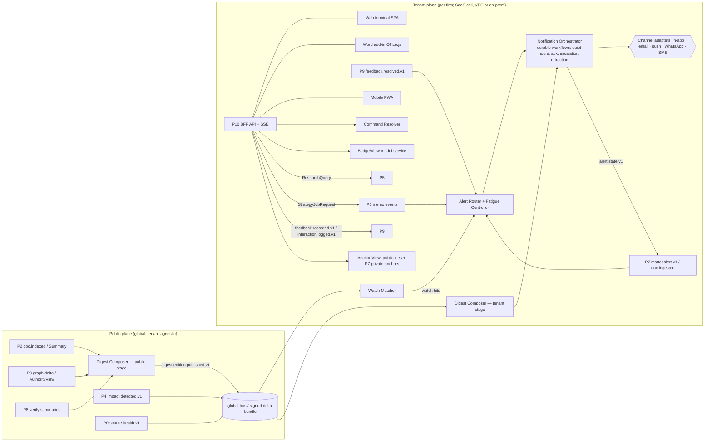

# P10 — Product Surface: the Legal Terminal

**Abstract.** P10 covers every surface a lawyer touches: the web terminal (desktop-first, keyboard-first), the Word add-in, a mobile PWA, and the notification channels (in-app, email, push, WhatsApp). It also owns the daily digest, watchlists, alert delivery and escalation, dashboards, the research and strategy workspace, the citator badge, click-to-source, and every feedback-capture widget. Its governing premise comes from the evidence. Fluent AI prose with citations earns more trust than it deserves: explanations raise acceptance of AI output whether or not it is correct [P10-8], and commercial legal AI tools still produce incorrect or misgrounded answers 17–33% of the time [P10-20]. So P10 shows evidence before prose, makes every sentence one click from its pinpoint paragraph, keeps machine-detected and human-verified statuses visibly distinct, and never shows a claim that P8 did not pass. The second premise is adoption. Pull-only chat tools stall [P10-22], and Indian litigators already run their day on cause lists and WhatsApp [P10-26][P10-31]. P10 therefore pushes value daily (a 06:30 IST digest, a court-day card, matter alerts). Every push goes through a fatigue controller designed from clinical alert-fatigue evidence [P10-12], and third-party channels carry no privileged content. P10 is almost free of LLM calls by design. It renders objects produced by P3–P9 and uses deterministic templates for personalisation, so it keeps working when a model provider changes and it cannot hallucinate on its own.

---

## 1. Purpose and scope

### 1.1 Purpose
Turn the platform's graph, evidence and verification outputs into a daily working tool that busy, sceptical Indian lawyers use without being told to. P10 must:
1. **Push** what changed and what is due, per matter and per watch, with correct severity and without fatigue.
2. **Answer** research and strategy questions in a workspace where every claim traces to an anchor (spine §C) in one click.
3. **Warn** at the point of use: in the research list, in the memo, in the Word draft, in the digest. A badge says whether an authority is still good law, how certain we are, whether a human has verified it, and whether it binds the forum.
4. **Capture** feedback at the moment of use with one tap. P9 turns this into learning [11_P9 §5.2].

### 1.2 Users and their constraints
| Persona | Daily reality (Indian practice) | What P10 must give them | Primary surface |
|---|---|---|---|
| Partner / senior counsel | In court most of the day. Reads on the phone between matters. Sceptical of AI. Signs off on strategy. | 60-second court-day card; sev-1 alerts only; memo verdicts with adverse authority up front | Mobile PWA, WhatsApp pointer, email digest |
| Senior associate | Drafts pleadings and replies to notices; runs research | Research workspace, strategy memo, Word add-in cite-check | Web terminal, Word |
| Junior associate / clerk (*munshi*) | Tracks cause lists, next dates, filings, compliance with orders | Cause-list-driven Today view, deadlines, order alerts | Web terminal, mobile |
| KM lawyer / librarian | Maintains practice-area watchlists and firm know-how; reviews flags | Watchlist manager, digest curation, verify queue | Web terminal |
| Firm admin / risk partner | Channel policy, ethical walls, audit | Admin console (P7-owned data, P10-rendered), channel content levels | Web terminal |

*Court hours, cause-list timing and WhatsApp-centric communication are described from practitioner knowledge and competitor features [P10-26][P10-31][P10-30]. The exact hours per court are **unverified** and are configuration, not constants.*

### 1.3 In scope
Information architecture, screens and interaction model; command grammar; citator badge rendering; click-to-source viewer; uncertainty display; watchlists and the tenant-side Watch Matcher; alert delivery, fatigue control, escalation and retraction; digest generation (public + tenant stages); Word add-in; mobile PWA and channel adapters (email, push, WhatsApp, SMS); feedback-capture widgets and the interaction log; performance budgets; onboarding for the design-partner firm.

### 1.4 Out of scope (owned elsewhere)
Alert *generation* for matters (P7 §5.12); impact computation (P4); AuthorityView computation (P3); ranking and evidence (P5); memo generation (P6); claim verification (P8); feedback learning and privacy gate (P9); matter data, ACL/PEP, walls, audit store (P7); Model Gateway (13_cross_cutting). P10 never computes legal status, relevance or deadlines. It renders them, routes them and collects reactions to them.

### 1.5 Design principles (normative)
- **DP1 — Evidence before prose.** Evidence cards stream first (≤3 s p95 [13_cross_cutting §6.1]). Prose sentences stay grey until P8 verifies them. Claims that fail verification are removed, and the removal is announced.
- **DP2 — One click to the paragraph.** Every claim, badge reason, digest line and alert explanation links to an `anchor_id`, which opens the source page with a bbox highlight.
- **DP3 — Honest status.** Machine-detected vs human-verified is a first-class visual variable (border and glyph, not colour alone [P10-18]). `UNKNOWN` and coverage gaps are shown, never hidden.
- **DP4 — Adverse first.** Every list, memo and digest item about an issue shows the strongest adverse authority in a pinned slot (P5 `ADVERSE_PINNED` [11_P9 §2.4]).
- **DP5 — Push with restraint.** Only severe items interrupt [P10-12]. Everything else is batched, merged or put in the digest. Every notification states why it was sent.
- **DP6 — Zero-leak channels.** Third-party channels (WhatsApp, SMS, push payloads) carry identifiers and a deep link, never privileged content, unless the firm's risk partner opts in [09_P7 §5.12].
- **DP7 — Keyboard-first, density on demand.** A typed command grammar with Indian-citation-aware resolution. Dense tables for power users, progressive disclosure for others (the Bloomberg pattern: mnemonic commands plus a GO key [P10-1]).
- **DP8 — Feedback is a by-product of work.** One tap and an optional reason chip. Free text is never mandatory. Every flag gets a visible resolution [11_P9 §5.2].
- **DP9 — As-of is always visible.** The `as_of_legal_date` and the "law current to" watermark appear on every legal output.

---

## 2. Input and output contracts

All names follow the spine (§B–§H) and the extensions accepted in 05_P3 (`AuthorityView`), 08_P6 (`StrategyJobRequest`, `Deadline`, memo events), 09_P7 (generalized `matter.alert.v1`, `matter.document.ingested.v1`, private anchors) and 11_P9 (extended `FeedbackEvent`, `retrieval.served.v1`, `feedback.resolved.v1`). New P10-owned ID prefixes: `wl_` (watchlist), `wr_` (watch rule), `wh_` (watch hit), `ntf_` (notification), `chb_` (channel binding), `dge_` (digest edition), `dgi_` (digest item), `udg_` (user digest), `uim_` (UI impression, when P10 renders a list P5 did not; renamed in review from `imp_`, which P4/P7 already use for `impact_id`), `cck_` (cite-check run). Public IDs used here but defined elsewhere: `jdg_`, `crt_`, `ent_` (03_P1), `bnc_`, `iss_` public IssueTopic (05_P3 S3-5).

### 2.1 Inputs

| # | Input | Producer | Transport | P10 use |
|---|---|---|---|---|
| I1 | `matter.alert.v1` (P7-generalized: `alert_kind`, `severity`, `dedupe_key`, `recipients[]`, `explanation{text, anchors[]}`, `sensitivity`) | P7 | tenant bus | Alert Router → channels, inbox, digest |
| I2 | `impact.detected.v1` (public broadcast, `tenant_id=null`) | P4 | global bus → tenant plane | Watch Matcher for non-matter watches (status changes of watched works/provisions) |
| I3 | `doc.indexed.v1` + `DocCard` lookup (metadata, judges, parties, statutes/cases cited, summary ref) | P2 (+P1/P3 read APIs) | global bus → tenant plane | Watch Matcher (new documents); public Digest Composer |
| I4 | `graph.delta.v1` (with `graph_watermark`, `status_changes[]` [05_P3 S3-3]) | P3 | global bus | Badge cache invalidation; digest "treatment changes" section |
| I5 | `strategy.memo.published.v1`, `strategy.memo.stale.v1` | P6 | tenant bus | Memo ready/stale banners and notifications |
| I6 | `matter.document.ingested.v1` | P7 | tenant bus | "Notice received → analysis started" notification |
| I7 | `feedback.resolved.v1` | P9 | tenant bus | Closes the loop on the user's flag |
| I8 | `source.health.v1` | P0 [02_P0 §2] | global bus | Coverage banners and digest coverage footer |
| I9 | `index.generation.promoted.v1` | P2 [04_P2 §2] | global bus | "Law current to" watermark |
| I10 | Sync APIs: P5 `/research`, `/explain`; P3 `AuthorityView` batch; P6 job API; P8 streaming verification status; P7 matter/PEP/private-anchor APIs; public anchor store | P3/P5/P6/P7/P8 | HTTPS within tenant boundary | All interactive screens |
| I11 | `digest.edition.published.v1` (**new**, §2.4) | P10-public | global bus / on-prem delta bundle | Tenant-stage digest personalisation |

### 2.2 Outputs

| # | Output | Consumer | Contract |
|---|---|---|---|
| O1 | `feedback.recorded.v1` | P9 | Extended FeedbackEvent [11_P9 §2.4]; P10 sets `context.surface` (enum extended, §2.4) |
| O2 | `interaction.logged.v1` (**new**) | P9 | Implicit signals joined to `retrieval.served.v1.impression_id` |
| O3 | `alert.state.v1` (**new**) | P7 (audit, escalation record), P9 (alert precision) | Delivery, ack and escalation state per `alert_id` × recipient |
| O4 | `StrategyJobRequest` | P6 | 08_P6 §2.1 (unchanged) |
| O5 | `ResearchQuery` | P5 | spine §H; P10 fills `as_of_legal_date`, `forum`, `matter_id`, `perspective` and `experiment` [11_P9 §2.5-8] |
| O6 | `UploadRequest`, `MatterCommand`, `ConfirmationCommand` | P7 | 09_P7 §2.1 |
| O7 | `digest.edition.published.v1` (**new**) | P10 tenant stage (all deployments) | §2.3.4 |

### 2.3 P10-owned schemas

**2.3.1 View contract for the citator badge.** Derived from `AuthorityView` [05_P3 §2.2]. It is pure presentation, and P10 never changes the status.
```ts
type CitatorBadge = {
  target_id: string;                         // wrk_… | prp_… | provision anchor
  status: "GOOD"|"CAUTION"|"NEGATIVE"|"PARTIAL_NEGATIVE"|"UNKNOWN";   // copied from AuthorityView
  label_key: BadgeLabel;                     // Indian vocabulary, i18n key (§5.5)
  shape: "OCTAGON"|"HALF_DISC"|"TRIANGLE"|"CIRCLE"|"DASHED_CIRCLE";   // never colour alone
  provenance: "VERIFIED"|"MACHINE"|"UNDER_REVIEW"|"MIXED";          // from AuthorityView.definitive + reason review_states
  confidence_band?: "HIGH"|"MEDIUM"|"LOW";   // only when provenance ≠ VERIFIED; from status_confidence
  scope_note?: string;                       // "on Proposition 2 only" (PARTIAL_NEGATIVE)
  binding?: { value: "BINDING"|"PERSUASIVE"|"NOT_BINDING"|"UNDETERMINED"; basis_short: string; contested: boolean };  // UNDETERMINED per 05_P3 S3-2 (not yet in spine §H)
  top_reasons: Array<{ code: string; assertion_id: string; citing_work_id: string; citing_anchor: string;
                       court_level: string; bench_strength?: number; date: string;
                       review_state: "MACHINE"|"PENDING_REVIEW"|"VERIFIED" }>;   // ≤3, most severe first
  as_of: { status_mode: "CURRENT"|"HISTORICAL"; status_date: string; as_of_legal_date: string };
  graph_watermark: number;
  a11y_text: string;                         // full sentence for screen readers
};
```

**2.3.2 Watchlists (tenant plane; PostgreSQL schema per tenant, same pattern as P7).**
```sql
CREATE TABLE watchlist (tenant_id text, watchlist_id text, owner_kind text CHECK (owner_kind IN ('USER','TEAM','MATTER')),
  owner_ref text /* usr_|grp_|mat_ */, name text, delivery jsonb /* DeliveryPolicy */, paused_until timestamptz,
  created_by text, created_at timestamptz, PRIMARY KEY (tenant_id, watchlist_id));

CREATE TABLE watch_rule (tenant_id text, rule_id text, watchlist_id text,
  kind text CHECK (kind IN ('WORK','PROVISION','CASE','JUDGE','BENCH','COURT','PARTY','ADVOCATE','TOPIC','ISSUE','REGULATOR_FEED')),
  target_id text,          -- wrk_|anchor (wrk_…#sec-…)|cas_|jdg_|bnc_|crt_|ent_|iss_|source_id ; NULL for TOPIC
  match_key text,          -- added in review: 'name:'||norm(name) for PARTY/ADVOCATE watches with no ent_ yet;
                           -- norm = NFKC, casefold, strip honorifics/legal suffixes (Ltd, Pvt, M/s, Shri, Smt),
                           -- Devanagari→ISO-15919 transliteration, collapse spaces. Also indexed.
  topic_query jsonb,       -- ResearchQuery (perspective NEUTRAL) + min_score, for TOPIC
  topic_vec_ref text,      -- added in review: cached embedding of topic_query (per rule version) for §5.9.2 stage 1
  triggers text[],         -- NEW_CITING_DOC|STATUS_CHANGE|NEW_DECISION|AMENDMENT|NEW_VERSION|STRUCK_DOWN|LISTED|NEW_MATCH
  filters jsonb,           -- {courts[], min_court_level, bench_strength_gte, langs[], practice_areas[]}
  min_severity int DEFAULT 3, last_watermark bigint, created_from jsonb /* {surface, ref} */,
  hits_30d int DEFAULT 0, not_relevant_30d int DEFAULT 0, precision_est real,  -- Beta(1+useful, 1+not_relevant) mean
  state text CHECK (state IN ('ACTIVE','DEMOTED_TO_DIGEST','PAUSED')) DEFAULT 'ACTIVE',
  PRIMARY KEY (tenant_id, rule_id));
CREATE INDEX ON watch_rule (tenant_id, target_id);          -- inverted index for ID matching
CREATE INDEX ON watch_rule (tenant_id, match_key) WHERE match_key IS NOT NULL;

CREATE TABLE watch_hit (tenant_id text, hit_id text, rule_id text, cause_event_id text, subject_id text,
  trigger text, severity int, why jsonb /* WhyCode[] + anchors */, created_at timestamptz,
  PRIMARY KEY (tenant_id, hit_id), UNIQUE (tenant_id, rule_id, cause_event_id, subject_id));  -- idempotent
```
If a matter-scoped watch is created, P10 also writes a `matter_dependency(kind='WATCHED')` row through P7's API. Status impacts for that matter then come from P7's Impact Matcher as `matter.alert.v1`, and P10's Watch Matcher handles only *new-document* triggers for it. This avoids double alerts at the source (§5.9).

**2.3.3 Delivery.**
```ts
type DeliveryPolicy = {
  channels: { in_app: true;                                   // always on
              email: "IMMEDIATE"|"HOURLY"|"DIGEST_ONLY"|"OFF";
              push: "SEV1"|"SEV1_2"|"OFF";
              whatsapp: "SEV1"|"SEV1_AND_DIGEST_POINTER"|"OFF";  // capped by firm policy
              sms: "SEV1_FALLBACK"|"OFF" };
  quiet_hours: { start: string /* "HH:MM", default "21:30" */; end: string /* default "07:00" */; tz: string /* default "Asia/Kolkata" */ };  // sev-1 bypasses [09_P7 §5.12]
  court_mode: "AUTO_FROM_CAUSE_LIST"|"MANUAL"|"OFF";         // holds sev-2 interrupts while the user is listed
  digest: { time: string /* default "06:30" */; days: ("MON"|"TUE"|"WED"|"THU"|"FRI"|"SAT"|"SUN")[]; format: "FULL"|"COMPACT" };
  interrupt_budget_per_day: number;                          // sev-2 interruptive sends; default 8
  language: "en"|"hi";
};

type ChannelBinding = {
  binding_id: "chb_…"; tenant_id: string; user_id: string;
  channel: "WHATSAPP"|"SMS"|"PUSH"|"EMAIL"; address_enc: string;   // encrypted, tenant key
  verified_at: string;
  opt_in?: { captured_at: string; text_version: string; method: "IN_APP"|"WHATSAPP_REPLY" };  // WhatsApp policy [P10-14]
  opt_out_at?: string;
  content_level: "MINIMAL"|"STANDARD";      // MINIMAL = matter number + kind + link; firm policy may forbid STANDARD
  lawful_basis: "EMPLOYMENT_7I"|"CONSENT_6"; // added in review (§3.5): partners, briefed counsel, interns, munshis are not employees
  consent_ref?: string;                      // DPDP consent record id when lawful_basis = CONSENT_6
  delegate_of?: string;                      // usr_ of the advocate a clerk/munshi acts for (§8 row "Delegated phones")
  status: "ACTIVE"|"SUSPENDED"|"REVOKED";
};

type Notification = {
  notification_id: "ntf_…"; tenant_id: string; user_id: string;
  sources: Array<{ kind: "MATTER_ALERT"|"WATCH_HIT"|"MEMO_READY"|"MEMO_STALE"|"DOC_RECEIVED"|"FEEDBACK_RESOLVED"|"DIGEST"|"SYSTEM";
                   id: string /* alr_|wh_|mem_|pdoc_|fbk_|udg_ */; revision: number }>;
  merge_key: string;               // hash(user_id, primary_subject_id, root_cause_event_id)
  severity: 1|2|3; definitive: boolean; matter_id?: string;
  title_key: string; params: Record<string,string>;           // rendered per channel & content_level
  anchors: string[];               // public/private anchors backing the explanation
  state: "QUEUED"|"HELD_QUIET"|"HELD_COURT"|"BATCHED"|"SENT"|"DELIVERED"|"SEEN"|"ACKED"|"SNOOZED"|"ESCALATED"|"EXPIRED"|"RETRACTED"|"SUPERSEDED";
  attempts: Array<{ channel: string; at: string; provider_msg_id?: string; outcome: "OK"|"FAILED"|"BOUNCED"|"RATE_LIMITED" }>;
  requires_ack: boolean; ack_deadline?: string; escalation_step: 0|1|2;
  created_at: string; revision: number;
};
```

**2.3.4 Digest.** The public stage runs once, globally. The tenant stage runs per user, inside the tenant plane.
```ts
type DigestItem = {               // PUBLIC plane — no tenant data
  item_id: "dgi_…"; edition_id: "dge_20260930";
  kind: "JUDGMENT"|"TREATMENT_CHANGE"|"LARGER_BENCH_REFERENCE"|"STATUTE_AMENDMENT"|"NEW_PROVISION_VERSION"|"NOTIFICATION"|"STRIKE_DOWN";
  subject_id: string;              // wrk_ | provision anchor | asr_
  headline: string;                // deterministic template from metadata (court, bench, parties short name, date)
  summary: { summary_id: string /* sum_ from P2 */; claims: Claim[]; verification: { report_id: string; gate: "PASS"|"PARTIAL" } };  // PARTIAL gate per 10_P8 S8-1 (spine §H has PASS|BLOCK only)
  badge: CitatorBadge;             // snapshot at composition time
  tags: { court_ids: string[]; practice_areas: string[]; provision_anchors: string[]; issue_ids: string[]; lang: string };
  notability: { score: number; signals: string[] };   // e.g. SC_REPORTABLE, LARGER_BENCH, OVERRULES, STRIKES_DOWN, HIGH_CITATION_VELOCITY
  anchors: string[];
};
// event data for digest.edition.published.v1
type DigestEditionPublished = { edition_id: string; cutoff_at: string /* 23:59 IST prev day */; law_current_to: string;
  items_uri: string; n_items: number; coverage: Array<{ source_id: string; status: string; lag_hours: number }> };

type UserDigest = {               // TENANT plane
  user_digest_id: "udg_…"; edition_id: string; user_id: string;
  sections: Array<{ kind: "COURT_DAY"|"DEADLINES"|"MATTER_IMPACTS"|"WATCH_HITS"|"PRACTICE_AREA"|"TREATMENT_CHANGES"|"VERIFY_TASKS"|"COVERAGE";
                    items: Array<{ ref: string; why: WhyCode[]; score: number }> }>;
  impression_id: string;           // logged like retrieval.served for P9 IPS
  rendered: { email_uri?: string; in_app: true }; sent_at?: string; opened_at?: string;
};
type WhyCode = { code: "WATCHED_PROVISION"|"WATCHED_JUDGE"|"CITED_IN_MATTER"|"OPPONENT_RELIED"|"PRACTICE_AREA"|"HEARING_TOMORROW"|"DEADLINE_DUE"|"ROLE_DEFAULT"|"NAME_MATCH";
                 ref_id: string; matter_id?: string };
```

**2.3.5 Synchronous P10 API (BFF, tenant plane).** REST with OpenAPI, plus Server-Sent Events for streams.
```
POST /v1/command/resolve   {text, context{matter_id?, as_of?}} → CommandResolution{kind, target_id?, fn, args, confidence, alternatives[≤5]}
GET  /v1/badges?ids=…&as_of_legal_date=…&forum=…   → CitatorBadge[]   (batch ≤ 200; cache design §5.5 "Badge cache" — keyed per target, not by the global watermark)
GET  /v1/anchors/{anchor_id}/view                   → AnchorView{text, page, bbox[], tile_urls[], manifestation{source_url, fetched_at},
                                                        quote_check{quote_hash_ok}, ocr_conf, lang, alt_expressions[], privilege_class?}
GET  /v1/today                                      → TodayModel (court day, sev-1/2 open alerts, deadlines ≤7d, memo states)
SSE  /v1/stream/research/{query_id}                 → evidence_card | coverage | claim_draft | claim_status | claim_removed | done
SSE  /v1/stream/memo/{memo_id}                      → section_progress | claim_status | gate | stale
POST /v1/watch | PATCH /v1/watch/{id} | DELETE …    → Watchlist / WatchRule
GET  /v1/alerts?state=open&matter=…                 → Notification[] ; POST /v1/alerts/{ntf}/ack|snooze|feedback
GET  /v1/digest/{edition_id}/me                     → UserDigest (rendered)
POST /v1/citecheck  {segments[{range_ref, text}], as_of_legal_date, forum}  → CiteCheckReport (Word add-in)
POST /v1/feedback   FeedbackEvent (client fields) → 202 ; server stamps actor_ref, consent_snapshot_id, recorded_at
```
```ts
type CiteCheckReport = { cck_id: string; mentions: Array<{
    range_ref: string; raw_text: string; resolved_target_id?: string; resolution_confidence: number; candidates: string[];
    badge?: CitatorBadge;
    pinpoint?: { para?: string; anchor_id?: string; quoted_text?: string; quote_found: boolean; best_match_anchor?: string };
    issues: ("UNRESOLVED"|"AMBIGUOUS"|"NEGATIVE"|"CAUTION"|"MACHINE_NEGATIVE_UNDER_REVIEW"|"QUOTE_NOT_FOUND"|"PARA_NOT_FOUND"
            |"OLD_CRIMINAL_CODE"|"PROVISION_NOT_IN_FORCE_ON_DATE"|"NOT_BINDING_ON_FORUM")[];
    suggestion?: { kind: "CROSSWALK"|"LATER_AUTHORITY"|"CORRECT_PARA"; target_id: string; note_key: string } }>;
  summary: { n: number; negative: number; caution: number; unresolved: number; quote_mismatch: number };
  as_of_legal_date: string; graph_watermark: number };
```

**2.3.6 `DocCard` (added in review).** The body used `DocCard` without defining it, and no other phase defines it. It is a **P10-owned read projection** (not a new spine object), built in the public plane from `doc.parsed.v1` (ParsedDocument metadata, `CitationMention.resolved_target_id`, `StatuteMention`, entities) and `doc.indexed.v1`, enriched with P3 IDs, and shipped to tenant planes alongside the digest bundle. It holds public data only.
```ts
type DocCard = {
  work_id: string; case_id?: string; expression_keys: string[];      // e.g. ["en"], ["hi","en"]
  court_id: string /* crt_ */; bench_id?: string /* bnc_ */; bench_strength?: number; judges: string[] /* jdg_ */;
  decision_date: string; doc_type: string; reportable?: boolean; neutral_citation?: string;
  party_ents: string[] /* ent_ */; party_names_norm: string[];        // norm() as in watch_rule.match_key
  advocate_ents: string[]; advocate_names_norm: string[];
  cases_cited: string[] /* resolved wrk_, confidence ≥ 0.9 only */; statutes_cited: string[] /* provision anchors */;
  issue_ids: string[] /* public iss_ */; source_id: string; summary_id?: string /* sum_ */;
  quality: { ocr_conf: number; lang: string; structure_conf: number };
  card_version: number; pipeline_version: string;
};
```

### 2.4 Proposed spine changes

| # | Target | Change | Justification |
|---|---|---|---|
| S10-1 | §G events | **Add `alert.state.v1`** (P10 → P7, P9): `{alert_id, notification_id, recipient usr_, channel, state: SENT/DELIVERED/SEEN/ACKED/SNOOZED/ESCALATED/EXPIRED/RETRACTED, at, escalation_step}` | P7 requires unacknowledged sev-1 alerts to escalate [09_P7 §5.12], but only the delivery layer knows whether a message was seen or acknowledged. The same state gives P9 alert-precision labels (useful vs ignored). |
| S10-2 | §G events | **Add `interaction.logged.v1`** (P10 → P9, tenant-scoped): `{impression_id, item_id, anchor_id?, action: OPEN_SOURCE/DWELL/COPY/PIN_TO_MATTER/EXPORT/EXPAND_REASON/HOVER_PREVIEW, dwell_ms?, position, surface, at}` | P9 lists implicit signals as a learning input [11_P9 §5.2 row 9] but no event carries them. Without `impression_id` the clicks cannot be debiased [11_P9 §2.5-2]. |
| S10-3 | §G `matter.alert.v1` (P7-generalized) | Add `subject_ids[]` (public IDs the alert is about), `definitive: bool`, `revision: int`, `supersedes_alert_id?`, `requires_ack: bool` | (a) P10 merges matter alerts with watch hits on the same public subject. Without `subject_ids`, a user gets two notifications for one event. (b) Tier-1 alerts go out provisionally as "machine-detected" and are verified within one business day [13_cross_cutting §6.2]. The verification or retraction must *update* the original alert, not create a second one. |
| S10-4 | §G events | **Add `digest.edition.published.v1`** (P10-public → every tenant plane, including on-prem via the signed PLC delta bundle) | The digest's public content (summaries, verification, badges) is computed once. It crosses the PLC→TPL boundary, the permitted direction. |
| S10-5 | FeedbackEvent `context.surface` [11_P9 §2.4] | Add `DIGEST`, `WORD_ADDIN`, `SOURCE_VIEWER`, `COMMAND_BAR`, `MOBILE`, `WHATSAPP` | P9 attributes signal quality by surface. Digest and Word signals behave differently from research-list clicks. |
| S10-6 | §H (endorse 05_P3 S3-2) | Adopt `AuthorityView` with `definitive` and `reason_codes` as the only input to badges | Without `definitive`, P10 cannot keep machine-detected and verified negative treatment visually apart, and that separation is the central trust requirement (§5.5). |
| S10-7 | §G consumer lists (added in review) | Add **P10** as a consumer of `doc.parsed.v1` (CASE watches, DocCard build), `doc.indexed.v1` (Watch Matcher, digest), `graph.delta.v1` (badge invalidation, digest treatment changes). The spine table lists only P2/P3/P4, P4/P5 and P4/P5/P8 respectively. | The body already consumes these events (§2.1 I3–I4, §5.9.1). Leaving the spine table unchanged is a silent divergence and would let producers drop fields P10 needs (e.g. `status_changes[]`). |
| S10-8 | §B/§H ID registry (added in review) | Keep a single prefix registry in the spine. Two collisions exist today: `imp_` (P4/P7 impact vs P10 impression; P10 now uses `uim_`) and `iss_` (P7 private matter issue vs P3 public IssueTopic). Proposal: P7 renames private issues to `mis_`, or every `iss_` reference carries a plane qualifier. | P10 renders both kinds of issue side by side (matter cockpit issues and public ISSUE watches). An ambiguous prefix makes routing and ACL checks error-prone. |
| S10-9 | §H `VerificationReport` (endorse 10_P8 S8-1) | Add gate `PARTIAL` | `DigestItem.summary.verification.gate` and §5.7 already depend on it. |

---
## 3. State-of-the-art survey (with citations)

### 3.1 Terminal interaction models
- **Bloomberg Terminal.** Commands are typed mnemonics terminated by a green **GO** key, for example `{VOD LN Equity GO}`. Yellow sector keys (GOVT, EQUITY, COMDTY, CURNCY) scope the command. A Menu key returns to the previous function and a History key recalls commands in reverse order. The core terminal shows four panels at once, and *Launchpad* provides persistent custom layouts [P10-1]. There were about 325,000 subscribers as of 2022, at around US$24,000 per user per year (US$27,000 for single-terminal subscribers) [P10-1]. **Lesson:** expert users accept density and a learning curve when the grammar is stable (`<security> <function> GO`) and the system is fast. The grammar itself becomes the product's language. We adopt `<entity> <function> ⏎` with legal entities (citations, provisions, matters, CNRs).
- **Legal AI assistants** are mostly chat-first. The Stanford evaluation found Lexis+ AI and Westlaw AI-Assisted Research gave incorrect or misgrounded answers 17% and 33% of the time. Ask Practical Law AI was incomplete 62% of the time [P10-20]. In Vals' 2025 legal-research benchmark some tools failed to respond at all [P10-21]. Harvey faces public criticism of its adoption depth, answered by a claim of 77% seat utilisation [P10-22]. Paxton says openly that "matter record, legal research, final work product live in separate workflows" in most tools [P10-24]. **Lesson:** a chat box with no matter context and no push surfaces gets used for a few ad-hoc questions and is then abandoned.

### 3.2 Citators and status signalling
- **KeyCite** (Westlaw, since 1997 [P10-3]): red flag = the most negative treatment; yellow = moderate negative treatment that needs review; blue-striped = a further cautionary flag (Westlaw's help pages tie it to a pending appeal *(unverified in this review)*). **Overruling Risk** (AI) "warns when a point of law has been implicitly undermined based on its reliance on an overruled or otherwise invalid prior decision". **KeyCite Alerts** monitor the status of a case or statute [P10-2]. CoCounsel Deep Research shows KeyCite flags inline in agent output [P10-27].
- **Shepard's** (Lexis): online reports carry a status icon and plain-English treatment phrases such as "followed by" and "overruled" [P10-4]. A **Shepard's Citation Agent** checks citations inside Protégé [P10-28].
- **India:** Manupatra's AI search surfaces citation metadata, judicial history and "overruled/distinguished" markers [P10-32]. CaseMine offers AMICUS AI in Standard and Advanced tiers [P10-33]; its document-upload precedent finder (CaseIQ) is not described in that source *(unverified)*. Indian Kanoon Prism caps *query alerts* by plan: 2 on Free, 25 on Premium (₹5,000/yr), 100 on Pro (₹15,000/yr) [P10-25]. None of the Indian products we reviewed publicly separates machine-detected from editor-verified treatment in the UI (based on public pages only; **unverified** inside paid products).
- **Accessibility:** WCAG 2.2 SC 1.4.1 (Level A) forbids colour as "the only visual means of conveying information" [P10-18]. A red/yellow/green flag system without shapes fails for colour-blind users, and it also fails on the monochrome printouts that Indian courts still see.

### 3.3 Trust, reliance and uncertainty (HCI evidence)
- Explanations **"increased the chance that humans will accept the AI's recommendation, regardless of its correctness"** and did not improve joint human-AI performance (Bansal et al., CHI 2021) [P10-8]. *Implication:* a model-written rationale ("this case supports you because…") is a persuasion device, not a safeguard. Our "explanation" is the source paragraph itself, plus the deterministic reason chain (predicate, citing court, bench strength).
- Confidence scores **help calibrate trust**, while local explanations have problems in AI-assisted decisions (Zhang, Liao, Bellamy 2020) [P10-9].
- First-person uncertainty expressions ("I'm not sure, but…") **decreased participants' confidence in the system and their tendency to agree with its answers, while increasing their accuracy**. General-perspective phrasings ("It's not clear, but…") had similar but weaker, non-significant effects (Kim et al., FAccT 2024; N=404, medical questions answered with a fictional LLM-infused search engine) [P10-10]. *Implication:* hedging phrases are UI copy that must be user-tested, not left to the model.
- Thomson Reuters *Future of Professionals 2026*: 41% of professionals lack tools that meet professional accountability standards; 34% use AI their organisation has not approved; where there is a clear AI strategy, 66% say AI meets or exceeds expectations, against 22% where there is none [P10-11]. *Implication:* audit trails, firm-approved deployment and partner-visible controls are adoption features, not compliance overhead.

### 3.4 Alerting and fatigue
- In clinical decision support, clinicians override most alerts. VA primary-care clinicians received more than 100 alerts a day. Monitors in 66 ICU beds generated over 2 million alerts a month (187 per patient per day). Recommended mitigations: make **only severe alerts interruptive**, raise specificity by removing inconsequential alerts, tailor alerts to context, and apply human-factors design to format and colour [P10-12]. The lesson carries over directly. An alert system that cries wolf trains lawyers to ignore the one alert that matters: "the authority in your filed reply was overruled today".
- Legal products cap alerts by count (IK Prism 25/100 [P10-25]). KeyCite Alerts are per-document monitors [P10-2]. Neither addresses relevance or fatigue. Indian practice-management tools push case updates and cause lists (Provakil [P10-31]; CLAW with WhatsApp alerts [P10-26]; LegitQuest Patrol [P10-34]) but have no link to legal-status changes.

### 3.5 Channels in India
- **WhatsApp Business Platform.** Per-message pricing since **1 July 2025**. Charges apply only when a template is delivered. Service messages are free (since 1 Nov 2024). **Utility templates sent inside an open 24-hour customer-service window are free.** INR billing for India began 1 Jan 2026, and India marketing rates rose on that date [P10-13]. Policy: businesses need the recipient's number *and* opt-in, must honour opt-outs on or off WhatsApp, and must not ask for sensitive identifiers [P10-14]. **Cloud API local storage** can keep data at rest in a selected country (India is the documented example). However, message content "may be stored on Meta data centers internationally while being processed" for up to 60 minutes [P10-15]. *Implication:* even with India local storage, content passes through data centres outside India, and the provider can read it. So privileged content never goes to WhatsApp by default (DP6).
- **DPDP.** A firm processing its own lawyers' contact data for work alerts can rely on the employment legitimate use (s.7(i): "for the purposes of employment…", ending "a Data Principal who is an employee") [P10-16]. **Gap patched in review:** many people who receive alerts in an Indian litigation practice are *not* employees: equity partners of a partnership firm, retained or briefed counsel, of-counsel, interns, and clerks (*munshis*) engaged personally by an advocate. For them P10 records a separate DPDP consent (s.6) at channel binding time, with `ChannelBinding.lawful_basis ∈ {EMPLOYMENT_7I, CONSENT_6}`; the admin console blocks WhatsApp/SMS bindings for non-employees until consent is captured. Opt-in is still required by WhatsApp policy [P10-14], and DPDP Rules commence in phases up to May 2027 [P10-35]. We record channel opt-in separately from employment processing.
- **Email** remains the formal channel for partners and clients. **Mobile push** requires an app or PWA install. **SMS** in India needs DLT template registration under TRAI's commercial-communication regulations *(unverified in this session; confirm before build)*.

### 3.6 Indian digest patterns
SCC Times publishes Supreme Court, High Court, Legislation, Tribunal (monthly), Topic-wise and Weekly roundups [P10-17]. LiveLaw and Bar & Bench publish similar editorial digests *(format details unverified)*. They are well written and trusted but **not personalised, not matter-aware and not treatment-aware**: they report what was decided, not what it does to *your* authorities.

### 3.7 Word as the drafting surface
Office.js Word add-ins run on Word for web, Windows (2016+), Mac and iPad from one codebase. They can read and modify paragraphs, content controls and other document objects [P10-6]. Admins can push add-ins to users or groups through **centralized deployment**, which takes up to 24 hours to propagate. It requires Exchange Online and Entra ID and does **not** support on-premises directories or MSI Office (except Outlook) [P10-7]. Legora's product centres on a Word sidebar [P10-23]. Spellbook presents tracked-change redlining in Word: "every suggestion tracked" [P10-5]. Contract-drafting add-ins dominate. **Litigation cite-checking inside Word, with the treatment status of Indian authorities, is an open space** (based on our competitor survey [20_competitive_teardown]).

### 3.8 Judge analytics
France bars any reuse of personally identifiable data about judges or court clerks "with the purpose or result of evaluating, analyzing or predicting their actual or supposed professional practices", with penalties of up to five years' imprisonment (Art. 33, Justice Reform Act 2019) [P10-29]. India has no equivalent statute that we found *(absence unverified)*. P6 limits bench simulation to the forum/doctrine level [08_P6 §5.9]. P10 follows the same rule: a judge page shows public facts (bio, courts, benches sat on, judgments authored or joined) and **no outcome statistics** (§5.9.3).

### 3.9 Performance norms
Google's INP threshold for "good" responsiveness is ≤200 ms at the 75th percentile, and >500 ms is "poor" [P10-19]. Platform latency SLOs (citation lookup 250 ms p95, click-to-source 400 ms p95, first evidence cards 3 s p95, verified answer 25 s p95) are set in 13_cross_cutting §6.1. P10 adds client-side budgets on top (§5.15).

---

## 4. Mistakes others made and how we avoid them

| System/paper | What went wrong | Evidence | How we avoid it |
|---|---|---|---|
| Lexis+ AI, Westlaw AI-AR, Ask Practical Law AI | Fluent answers with wrong or misgrounded citations; many incomplete answers | 17–33% hallucination; 62% incomplete for Practical Law [P10-20] | Evidence streams first. Each sentence stays grey until P8 verifies it. Unsupported claims are *removed* and the removal is announced ("1 statement withheld"). A coverage panel shows what could not be checked (§5.7). |
| XAI explanation interfaces (general) | Explanations raise acceptance even when the AI is wrong | Bansal et al. [P10-8] | No model-written "why this supports you" as the primary explanation. The source paragraph and the deterministic reason chain are the explanation. Model rationales are collapsed by default and labelled "argument", not "evidence". |
| Colour-only citator flags (generic pattern) | Colour alone conveys status; fails WCAG 1.4.1 and greyscale print | [P10-18] | Shape + label + border style, with colour as a redundant cue (§5.5). |
| Citators that merge machine and editorial signals *(pattern risk for AI citators, incl. ours)* | Users cannot tell a verified overruling from a classifier guess, so they either over-trust or ignore both | Overruling Risk is explicitly labelled as AI-derived [P10-2]; our P3 has MACHINE/VERIFIED states [05_P3] | Provenance is its own visual channel: solid border = verified, dashed border + "M" = machine-detected, spinner = under review. Tier-1 machine negatives are **shown, never hidden** (a missed overruling costs more than a false caution) but are never drawn as definitive. |
| Clinical decision-support alerts | Alert floods lead to overrides and missed critical alerts | >100 alerts/day; 187 per patient per day [P10-12] | Severity tiers (only sev-1 interrupts); merge and storm-mode summarisation; per-user interrupt budget; rule precision learned from feedback with auto-demotion to digest; "why you got this" on every alert (§5.8). |
| IK Prism alert caps | Caps by *count* push users to watch less rather than watch better | 25/100 alerts per plan [P10-25] | No count caps. Budgets apply to *interruptions*, not to watches. Low-precision rules are demoted to the digest, and the user is told. |
| Chat-first legal AI | Pull-only use; adoption questioned | Harvey criticism and utilisation debate [P10-22] | Push surfaces (Today, digest, alerts, Word). Chat is one panel scoped to a matter and an as-of date, not the home screen. |
| Separate research and matter tools | The matter record, research and work product live apart | Paxton's own framing [P10-24] | One object model: every research query, memo and draft carries `matter_id`, `as_of_legal_date` and forum; watchlists and alerts link to matters. |
| Editorial digests (SCC Times, LiveLaw, Bar & Bench) | Not personalised, not matter-aware, not treatment-aware | Format list [P10-17] | Two-stage digest. Public summaries are verified once. Personalisation by watches, matters and practice area is deterministic and explained (§5.10). |
| WhatsApp alert products (e.g., CLAW [P10-26]) | *Risk pattern (not verified for any vendor):* party names and order text in WhatsApp expose privileged or confidential data to a third-party processor with cross-border processing | Cloud API processes content internationally up to 60 min [P10-15] | `content_level=MINIMAL` by default: firm matter number + alert kind + authenticated deep link. Richer content only on the risk partner's written opt-in (§5.12). |
| Office add-in rollouts | Centralized deployment fails for on-prem Exchange/AD and MSI Office, which some Indian firms run | Requirements page [P10-7] | Three deployment paths (§5.11.4) and a `.docx` round-trip fallback. |
| Judge analytics products (global) | Legal and ethical exposure; France criminalised the practice | Art. 33 [P10-29] | No outcome statistics per judge. Judge watch covers new judgments only (§5.9.3). |
| Legal AI "no answer" failures | Timeouts and refusals shown as blank or generic errors | VLAIR no-response failures [P10-21] | Partial results with an explicit coverage state and a retry path, streamed per issue; never a blank screen. |

---
## 5. Recommended design, in detail

### 5.1 Component architecture


**Stack decisions (justified in §6):** a TypeScript SPA (React-class framework, virtualised lists, a local IndexedDB cache of the user's matters and recent entities); a BFF in the tenant plane (REST + SSE, OpenAPI-typed, stateless, horizontally scaled); the Notification Orchestrator on the platform's durable-workflow engine (the same engine P0/P4 choose, so the platform runs one fewer engine); per-tenant PostgreSQL schema for P10 tables; Redis-class cache for badges, sessions and rate limits; page tiles (PNG/WebP, 150 dpi, with a text layer) pre-rendered at P1 parse time for public documents and on demand into the tenant bucket for private ones, served from an India-region CDN behind signed, short-lived URLs.

### 5.2 Information architecture

```mermaid
flowchart TB
  CB[[Command bar Ctrl-K / "/" — global]]
  T[Today] --- M[Matters] --- R[Research] --- A[Authorities & Citator] --- S[Statutes point-in-time] --- W[Watchlists] --- AL[Alerts inbox] --- D[Digest] --- ADM[Admin]
  M --> M1[Matter cockpit: Overview · Strategy memo · Authorities for/against · Documents · Timeline · Deadlines & hearings · Alerts · Drafts]
  R --> R1[Research workspace: issues · evidence cards · verified answer · coverage]
  A --> A1[Authority page: badge · treatment table · direct history · propositions · citing map]
  S --> S1[Provision view: version timeline · diff · crosswalk IPC↔BNS etc. · interpreting judgments]
  SV[(Source viewer drawer — opens over any screen)]
  CTX[(Context chips: Matter · Forum · As-of date · Law current to)]
```
Global invariants: (1) the context chips sit on every screen and in every export; (2) the source viewer opens as a right-hand drawer (48% width on desktop, full-screen on mobile) and never navigates away, so the lawyer keeps their place; (3) every list row has the same micro-toolbar: `o` open source, `f` flag, `w` watch, `p` pin to matter, `e` export.

### 5.3 Command grammar (keyboard-first)

**Grammar (PEG, deterministic first; the LLM is used only as a fallback through P5's intent router):**
```
command    := entity [function] [modifier]* | verb [argument] [modifier]* | freetext
entity     := cnr | neutral_cit | reporter_cit | provision | matter_ref | judge_ref | court_ref | party_ref | work_title
function   := "CT" citator | "TR" treatment table | "HIST" direct history | "P" <para> | "PROP" propositions
            | "V" versions | "DIFF" <date> <date> | "XW" crosswalk | "AMD" amendments | "INT" interpreting judgments
            | "TL" timeline | "DL" deadlines | "HR" hearings | "MEMO" | "DOCS" | "W" watch | "ASK" <text>
verb       := "Q" research | "Q!" deep research (memo-grade, async) | "CL" cause list | "ALR" alerts | "DG" digest
            | "ASOF" <date> | "FORUM" <court> | "NEW MATTER" | "UPLOAD"
modifier   := "@" <date> | "in:" <court> | "bench>=" <n> | "lang:" <code> | "for:" <matter_ref>
```
**Examples (users type, the Enter key acts as GO):**

| Typed | Resolves to |
|---|---|
| `2023 INSC 1 CT` | Authority page for the SC judgment, citator tab |
| `(2017) 10 SCC 1 P 45` | Same Work via `identifier_alias` (scheme SCC); source viewer at `#p45` |
| `AIR 1973 SC 1461 HIST` | Direct-history lineage (spine `APPEAL_OF` chain, plus `REVIEW_OF`/`CURATIVE_OF`). For an original Art. 32 writ the appeal chain is empty, and the page says "no appellate history (original jurisdiction)" rather than showing a blank |
| `IPC 420 XW` | Crosswalk to BNS with `change_type` and the transition rule for offences before 1 July 2024 |
| `BNSS 187 @2024-06-30` | "Not in force on this date" + the CrPC counterpart on that date |
| `S 138 NI V` | Version timeline for s.138, Negotiable Instruments Act |
| `ART 21 INT in:SC bench>=5` | Constitution Bench judgments interpreting Art. 21 |
| `DLHC010012342024 TL` | The matter linked to that CNR, timeline tab (CNR = "16 digit alphanumeric", entered without hyphen or space, e.g. `MHAU019999992015` [P10-30]; the resolver also strips hyphens and spaces users paste) |
| `M 2024/LIT/0142 DL` | Matter by firm number, deadlines |
| `Q is a s.17A PC Act approval needed for pre-2018 offences for:0142` | Research, scoped to the matter, as-of taken from matter |
| `CL tomorrow` | Tomorrow's cause-list items for my matters and my advocates |

**Resolver pipeline (≤100 ms p95 server, ≤30 ms for client-cached entities):**
Step 0 *(added in review)* **Normalise input first:** NFKC; Devanagari and other Indic digits → ASCII (`१३८` → `138`); common Hindi act/section words (`धारा` → `S`, `अनुच्छेद` → `ART`, `भारतीय न्याय संहिता` → `BNS`); strip `§`, `u/s`, `r/w` noise. Party and judge typeahead matches on the same `norm()` (transliterated) key as watch rules, so "शर्मा" and "Sharma" find the same `ent_`.
1. Mnemonic verbs and functions (exact, case-insensitive).
2. Regex families from P1's citation grammar: CNR, `YYYY INSC N`, HC neutral formats, reporter citations (SCC/AIR/SCR/SCALE/JT/SCC OnLine/CriLJ …). Each is parsed into `CitationMention.parsed` and resolved through `identifier_alias` (spine §D). Ambiguous → show ≤5 candidates with court, date and parties.
3. Provision parser: act-alias table ("NI Act", "PC Act", "BNS", "CrPC", "Art.") + section/sub-section grammar → spine §C statute anchor; `@date` → point-in-time expression.
4. Tenant typeahead: matters (number, title, client short name), people; public typeahead: judges (`jdg_`), courts (`crt_`), recurring parties (`ent_`).
5. Otherwise → `Q <text>` (NL research via P5; P5's intent router may redirect "what changed" questions to the change feed [07_P5 I11]).
Every resolution returns `confidence` and `alternatives`. Below 0.9 the bar shows the interpretation *before* executing ("Did you mean (2017) 10 SCC 1 = K.S. Puttaswamy?" — *example only*). This prevents a confused user landing silently on the wrong case.

**Keyboard map (web and Word pane where applicable):** `Ctrl-K` or `/` command bar · `g t / g m / g r / g a` go to Today, Matters, Research, Alerts · `j / k` next/previous row · `o` open source · `[ / ]` previous/next paragraph in source viewer · `f` flag (reason chips) · `a / x` accept/reject claim · `w` watch · `p` pin to matter · `e` export to Word · `.` toggle as-of chip · `?` cheat-sheet. Mouse and touch paths exist for everything, and the keyboard is never required.

### 5.4 Key screens (wireframe level)

*Wireframes are illustrative. Party names are placeholders, and statute or citation examples are examples only (not verified legal statements).*

**S1 — Today (home).** Built from `/v1/today`. First paint ≤1.0 s p75.
```
┌ Today · Tue 30 Sep 2026 ─────────────── Law current to 30 Sep 06:00 IST ▾  ⚠ Allahabad HC feed 14h late ┐
│ COURT DAY (from cause lists)                     │ NEEDS ACTION                                         │
│ 10:30 Delhi HC · Ct 32 · Item 14  0142 Sharma v. │ ⛔M Authority in your filed reply may be overruled   │
│       State (bail) · last order: reply filed     │   (machine-detected, under review) · 0142 · [open]   │
│       since last hearing: 1 authority changed ▸  │ ▲ Order in 0199: "reply within 4 weeks" → deadline   │
│ 11:00 NCLT Mumbai · Ct II · 0107 IA 55/2026     │   PROPOSED 28 Oct · [confirm] [edit]                  │
│ DEADLINES ≤7 days                                │ ● Memo ready: 0211 SCN reply (VERIFIED 41/44 claims) │
│  2 Oct  0188 Limitation: appeal u/s 421 CA 2013  │ DIGEST · 12 for you · 3 matter-linked  [read ▸]      │
│         computed · statutory anchor ▸ · CONFIRMED│ VERIFY (2 min) · 3 treatment checks for your areas   │
└──────────────────────────────────────────────────┴──────────────────────────────────────────────────────┘
```
"Since last hearing" is a diff: every public or private change on the matter since the last `hearing.date` (new orders, authority status changes, new documents, opponent filings). It is the partner's pre-hearing brief in one line.

**S2 — Matter cockpit / Strategy memo.** Streams via `/v1/stream/memo/{id}`.
```
┌ 0142 · Sharma v. State of NCT · Delhi HC · Bail (s.483 BNSS) · Client: Applicant ─ As-of: 12 Aug 2026 (cause of action) ▾ ┐
│ Memo mem_… · VERIFIED 38 · PARTIAL 3 · withheld 1 · STALE ⚠ 1 claim (authority status changed 29 Sep) [re-verify]   │
│ ┌ Opponent claims ─────────────┐ ┌ Issues ───────────┐ ┌ Adverse authorities (pinned first) ──────────────────────┐ │
│ │ OC1 Flight risk [pdoc p12]   │ │ I1 Parity (…)     │ │ ▲ X v. State (2025) Del HC DB · CAUTION · M(High)        │ │
│ │ OC2 Tampering [pdoc p15]     │ │ I2 Delay …        │ │   How to distinguish: facts ¶ 18 differ … [¶18] [¶22]  │ │
│ └──────────────────────────────┘ └───────────────────┘ └──────────────────────────────────────────────────────────┘ │
│ Favourable: ● Y v. UoI (2024) SC 3J · BINDING · VERIFIED · "…bail is the rule…" [¶ 27 ↗]   [a][x][f]                │
│ Deadlines: Reply to status report — 7 Oct (court-ordered, ord ¶3) CONFIRMED_INPUTS [trace ▸]                        │
│ Uncertainties: "I could not find a Delhi HC Division Bench ruling on I2 after 1 Jul 2024." (coverage ▸)             │
└────────────────────────────────────────────────────────────────────────────────────────────────────────────────────┘
```
Claim rows show: text · support chips `[¶27 ↗]` · badge of each cited authority · verification state · `origin_role` icon (advocate/opponent/bench) · `assumptions` marker when the claim rests on an unconfirmed (MACHINE) fact [08_P6 C2]. Toolbar: accept, reject (reason chips), edit, "add authority" (FLAG_MISSING_AUTHORITY), "send to draft".

**S3 — Research workspace.**
```
┌ Q: "Is pre-deposit under s.19 MSMED Act mandatory for a s.34 challenge?"  Forum: Bombay HC ▾  As-of: today ▾ ┐
│ ISSUES (edit ✎)             │ EVIDENCE (streams ≤3 s)                          │ ANSWER (streams; grey = verifying) │
│ ▸ I1 Mandatory nature       │ ADVERSE ⟂  ▲ … (Bom HC 2023) CAUTION · binding?  │ Pre-deposit of 75% is mandatory   │
│ ▸ I2 Waiver / relaxation    │ BINDING ⟂  ● … (SC 2019 3J) GOOD · BINDING ✓     │ for the award-debtor [1][2] …     │
│ ▸ I3 Timing of deposit      │ 3. ● … (SC 2022) GOOD · followed 41× …            │ ░░░ verifying ░░░                 │
│ COVERAGE                    │ 4. ◐ … PARTIAL_NEGATIVE on Prop. 2 only …        │ 1 statement withheld (unsupported)│
│ I1 binding ✓ adverse ✓      │ [o]pen [f]lag [w]atch [p]in  — why ranked? ▸      │ [Copy with citations] [→ Word]    │
│ I3 ⚠ no HC DB found         │                                                  │                                   │
└─────────────────────────────┴──────────────────────────────────────────────────┴───────────────────────────────────┘
```
"Why ranked?" calls P5 `/explain` and renders the leg ranks and authority features as a compact table. It is *not* model prose (see Bansal et al. [P10-8]).

**S4 — Authority page (citator).**
```
┌ ⛔ OVERRULED (VERIFIED) · A v. B, (2011) SC 2J · 14 Mar 2011 ─────────────── status as of 30 Sep 2026 (CURRENT) ┐
│ Binding on your forum (Bombay HC): NO LONGER — overruled by C v. D (2019) SC 5J ¶ 81 [↗]                         │
│ Propositions: P1 (limitation runs from…) ⛔ overruled · P2 (condonation…) ● followed 12×                          │
│ Negative & cautionary treatment first:                                                                           │
│  ⛔ C v. D (2019) SC 5J  OVERRULES P1        ¶81 [↗]  VERIFIED (editor, 16 Oct 2019)                              │
│  ▲ E v. F (2015) SC 2J   DOUBTS P1           ¶40 [↗]  M · High                                                    │
│  ▲ G v. H (2016) SC 2J   REFERS_TO_LARGER_BENCH ¶12 [↗] VERIFIED                                                  │
│ Positive: FOLLOWS 23 · APPLIES 51 · EXPLAINS 7 · CITES 312   [filter court ▾ bench ▾ date ▾ proposition ▾]         │
│ Direct history: Trial (Dist. Pune) → Bom HC (2009) REVERSED → SC (2011) ← you are here                           │
└──────────────────────────────────────────────────────────────────────────────────────────────────────────────────┘
```
Heavily cited works (thousands of citing documents) show aggregated `treatment_summary` counts with server-side pagination. Negative and cautionary rows are never paginated away. They always render first and in full.

**S5 — Source viewer (click-to-source).** See §5.6.

**S6 — Statute provision, point-in-time.**
```
┌ s.138 Negotiable Instruments Act, 1881 ── version valid on: 12 Aug 2026 ▾ ─── timeline: ●1989 (inserted)──●2002 amdt──●today ┐
│ [text of provision at the date, sub-clauses anchored: sec-138, sec-138.p1 (proviso) …]                                │
│ DIFF 1989 ↔ 2002 amdt (inline red/green + "substituted by Act X of YYYY, s.N" with gazette anchor)                    │
│ RELATED CHANGES (not versions of this text): 2015 amdt — territorial jurisdiction for cheque-bounce cases, e-cheque def. │
│ INTERPRETED BY (binding on Bombay HC first) · STRUCK/READ DOWN: none · CROSSWALK: n/a                                 │
└───────────────────────────────────────────────────────────────────────────────────────────────────────────────────────┘
```
*Review correction:* an earlier draft showed a 2015 node on the s.138 timeline. The Negotiable Instruments (Amendment) 2015 changes concerned territorial jurisdiction for cheque-bouncing cases and the definition of an electronic cheque [P10-37], so they are shown as *related changes*, not as a new version of s.138's text. The general rule is that the timeline shows only `NEW_VERSION` events whose `AMENDS/SUBSTITUTES/INSERTS/OMITS` target is this provision or one of its descendants. Amendments to sibling provisions that change how this one operates are listed separately. For the criminal-code transition the crosswalk panel shows the `CORRESPONDS_TO` assertion with `change_type`, its review state, and the date rule: which code applies to an offence committed on the matter's cause-of-action date. The rule is P3/P6-computed; P10 only renders it.

**S7 — Alerts inbox.** Grouped by matter, then by severity. Each row: severity glyph · kind · title · "why you got this" (WhyCode) · definitive/machine marker · age · actions `[ack] [snooze ▾] [useful] [not relevant ▾] [wrong ▾]`. A retracted alert stays visible, struck through, with a "Correction" note.

**S8 — Digest (email + in-app)** — §5.10. **S9 — Word add-in** — §5.11. **S10 — Mobile PWA + WhatsApp** — §5.12.

### 5.5 Citator badge design (Indian vocabulary)

**Mapping `AuthorityView` → `CitatorBadge`.** `reason_codes` come from 05_P3 §2.2.

| AuthorityView.status | Label (en) — chosen by top reason code | Shape | Colour (redundant) |
|---|---|---|---|
| NEGATIVE | Overruled · Reversed / Set aside · Declared per incuriam · Struck down · Legislatively overridden · Repealed/Omitted · Not in force on date | ⛔ octagon | red |
| PARTIAL_NEGATIVE | Overruled in part (on Prop. n) · Modified on appeal · Read down | ◐ half-disc | orange |
| CAUTION | Doubted · Referred to larger bench (pending) · Not followed by HC · Conflicting co-ordinate benches · Relies on overruled authority · Stayed · Under appeal · Prospective overruling saves (for your date) · Negative signal under review | ▲ triangle | amber |
| GOOD | Followed n× · Affirmed · No negative treatment found | ● circle | green |
| UNKNOWN | Coverage gap (source down / not yet processed) · Status undetermined | ◌ dashed circle | grey |

**Provenance (second visual channel):** solid outline = `VERIFIED`; dashed outline + superscript **M** + band (High/Med/Low) = `MACHINE`; a small clock glyph = `UNDER_REVIEW` (a PENDING_REVIEW tier-1 assertion exists); split outline = `MIXED` (verified reason plus a newer machine reason). The binding chip is separate: `BINDING (SC, Art. 141)`, `BINDING (larger bench, same HC)`, `PERSUASIVE (other HC)`, `NOT BINDING`, `UNDETERMINED`. It is shown only when a forum is set. Otherwise it reads "set forum to see binding effect".

**Rendering rules (normative):**
```ts
function toBadge(v: AuthorityView, forum?: Forum): CitatorBadge {
  const reasons = sortBySeverity(v.reason_codes, v.reason_assertion_ids);        // NEGATIVE codes first
  const prov = v.definitive ? "VERIFIED"
             : reasons.some(r => r.review_state === "PENDING_REVIEW") ? "UNDER_REVIEW"
             : reasons.some(r => r.review_state === "VERIFIED") ? "MIXED" : "MACHINE";
  // R1: never upgrade. A machine NEGATIVE stays NEGATIVE-shaped (octagon), drawn dashed with "M" + band.
  // R2: never hide. status_confidence < 0.5 on a tier-1 negative → still shown as CAUTION "Negative signal under review", never GOOD.
  // R3: GOOD requires coverage: if any source.health for the citing courts' window is DOWN/DEGRADED → append "coverage gap" note.
  // R4: HISTORICAL mode (research/audit) prints "status on <date>" in the label; CURRENT is the default for litigation.
  // R5: PARTIAL_NEGATIVE must carry scope_note naming the proposition(s); a badge without scope is a bug (CI check).
  return {...};
}
```
Badge copy is written in the first person where it expresses uncertainty ("I found a possible overruling — under editorial review, expected by tomorrow"). Kim et al. found first-person phrasing reduced over-reliance [P10-10]. The exact wording is A/B-tested with the partner firm (§9).

**Screen-reader text** (`a11y_text`), for example: "Caution. Machine-detected, high confidence. Doubted by E v. F, Supreme Court, two judges, 2015, paragraph 40. Not yet verified by an editor."

**Badge cache (patched in review).** The earlier design keyed the cache on the global `graph_watermark`. P3 advances that watermark with every `graph.delta.v1`, which can arrive every few minutes, so every delta would have invalidated every cached badge and the ≥95% hit-rate target (§5.15) could not be met. The replacement:
```
key   = (target_id, forum_id|"-", as_of_bucket)       # as_of_bucket = "CURRENT" | ISO date for HISTORICAL
value = {badge, status_version, computed_at_watermark}
on graph.delta.v1 δ:
   dirty = δ.status_changes[].subject_id ∪ ancestors(δ.status_changes[].subject_id)   # Work ↔ its Propositions
   DEL key for every target in dirty (all forums, all buckets)                         # targeted, not global
   publish badge.invalidate{dirty, δ.graph_watermark} on the SSE channel → open clients refetch visible badges
read path: hit → return; miss → P3 AuthorityView batch → store with TTL 24 h (CURRENT) / 7 d (HISTORICAL)
consistency guard: a response always carries computed_at_watermark; if the client has seen a newer invalidation
   for that target, it refetches (no stale badge survives a delta that named it).
```
HISTORICAL badges for arbitrary dates are computed on a miss and cached only for dates that matter-linked queries use (cause-of-action dates), so the key space stays bounded.

**Default confidence bands (priors until P8 calibration curves exist).** High: calibrated p ≥ 0.85; Medium: 0.60–0.85; Low: < 0.60. P8 replaces the thresholds per task once each band's empirical precision is measured on the gold set (§9). A band is never shown on a `VERIFIED` item.

### 5.6 Click-to-source pinpoint UX

1. **Hover preview (≤150 ms from cache):** anchor text (first 400 chars, with the claimed span highlighted), para number as printed, court · bench · date, badge, language.
2. **Click → source viewer drawer:** the page tile with a translucent bbox highlight over the anchor span (spine §C stores page + bbox). The text layer beneath is selectable. `[ ]` step through paragraphs. A header shows the manifestation provenance ("PDF from sci.gov.in, fetched 29 Sep 2026 18:04 IST, sha256 …") and a link to the original.
3. **Quote integrity check:** P6/P8 quotes carry `quote_hash`. The viewer recomputes against `text_hash` and shows ✓ "quoted text found verbatim" or ⚠ "quote differs from source (OCR or edit)" with a side-by-side view. *Algorithm (added in review):* normalise both strings (NFKC, casefold, curly→straight quotes, de-hyphenate line breaks, collapse whitespace, drop `[…]` ellipses as gaps); exact substring → ✓; otherwise a sliding-window token-level similarity (1 − normalised Levenshtein on tokens) over the anchor ±1 paragraph. ≥0.95 → ⚠ "near-verbatim (likely OCR/typography)"; 0.80–0.95 → ⚠ "paraphrase — differs from source"; <0.80 → ✗ "not found in cited paragraph", followed by a search of the whole expression for a `best_match_anchor`. This is the lawyer's own 2-second verification. The Stanford failure mode (a real case cited for a proposition it does not contain [P10-20]) becomes visible at the point of reading.
4. **OCR/structure quality:** if the page's `quality.ocr_conf` < 0.85 (default; tuned against P1's OCR gold set) or the paragraph number is synthetic (`u7`), a banner says "Scanned text — verify against the image; paragraph numbering inferred". The image is always shown, never only the OCR text.
5. **Languages:** when the anchor is on a `hi` (or other) expression, the drawer shows the original with the aligned English translation side by side, labelled "machine translation — cite the original" unless an official translation expression exists. *Refined in review:* "official translation" has two distinct Indian cases, and the label must say which one applies. (a) Where a Governor has authorised Hindi or the State's official language for High Court judgments, s.7 of the Official Languages Act, 1963 requires the judgment to be "accompanied by a translation of the same in the English language issued under the authority of the High Court" [P10-36]. Here both expressions are court-issued: the original is the judgment, and the English translation is labelled "official translation (s.7 OLA)". (b) Vernacular translations that courts publish of *English* judgments for litigants may carry use restrictions. The drawer displays the court's own disclaimer text from manifestation metadata verbatim and never presents such a translation as citable. The `expression_key` metadata must therefore carry `translation_status ∈ {ORIGINAL, OFFICIAL_S7_OLA, COURT_PUBLISHED_RESTRICTED, MACHINE}` (a request to P1, §11).
6. **Private anchors** (`pdoc_…/v1#p12`) resolve through P7's O4 API with privilege-class banners ("Privileged — client communication"). The drawer never offers "share link" for privileged anchors.
7. **Copy-cite:** `c` copies an Indian-format pinpoint using the neutral citation where available, plus the para ("2023 INSC 1, ¶ 45"). Reporter citation strings are shown only as stored facts (spine §D). No reporter pagination or headnotes are reproduced.
8. **Flag from source:** `f` opens the reason chips `WRONG_PARA`, `QUOTE_NOT_IN_SOURCE`, `OCR_GARBLED`, `WRONG_LANGUAGE_VERSION` … → `feedback.recorded.v1` with `target.kind=ANCHOR` [11_P9 §5.2].

### 5.7 Uncertainty and verification display

| Object state (from P8 `VerificationReport`) | Visual | Behaviour |
|---|---|---|
| Claim streaming, not yet verified | grey text, shimmer | Cannot be copied or exported |
| VERIFIED | normal text + support chips | Exportable |
| PARTIAL | dotted underline + "partly supported" chip listing which part lacks support | Exportable with its marker |
| UNSUPPORTED | removed; counter "n statements withheld" | Expandable for KM/admin roles only (audit), never exportable |
| CONTRADICTED / BAD_LAW | removed; the contradicting anchor surfaces as an *adverse* card | Adverse card pinned |
| Memo gate BLOCK | memo not shown; the verified sections shown with "sections withheld: …" | P6 repair loop status visible |

**Confidence display.** Categorical bands only (High / Medium / Low) on machine-derived items, mapped from calibrated P8 `calibrated_confidence` and P3 `status_confidence`. Band thresholds are set per task from P8 calibration curves. There are no raw percentages (a false sense of precision) and no win probability (P6 non-goal [08_P6 §1]). **Coverage panel** per issue: binding authority found ✓/✗, adverse authority found ✓/✗, courts and years searched, source outages from `source.health.v1`, index watermark. **Hedging copy** follows a controlled phrase list (first person, specific: "I could not find…", "I found only persuasive authority…") [P10-10]. The model never improvises these phrases: P6/P8 emit uncertainty codes, and P10 renders the copy.

### 5.8 Alert routing, fatigue control, escalation and retraction

**Pipeline (per tenant, idempotent on `(source id, revision, recipient)`):**
```
on event e ∈ {matter.alert.v1, watch_hit, memo.published/stale, doc.ingested, feedback.resolved}:
  n  = normalize(e)                                   # → Notification skeleton, subject_ids, severity, definitive
  rs = PEP.filter(n.recipients, n.matter_id)          # P7 authorization at send time (walls may have changed)
  for u in rs:
    k = merge_key(u, primary_subject(n), root_cause(e))
    if exists open ntf with k within 10 min: merge (append source, keep max severity); continue
    if storm(u, root_cause(e)) (> 5 notifications in 60 min from one cause): fold into one summary ntf
         "SC judgment X affects 14 of your matters" with the per-matter list; continue
    p = prefs(u); s = n.severity
    if s == 1: deliver_now(u, channels_for(p, 1)); schedule_ack_timer(n)
    elif s == 2:
        if quiet_hours(p) or court_mode_active(u) or budget_exhausted(u): batch_hourly_or_digest(u, n)
        else: deliver_now(u, channels_for(p, 2))       # in-app + push/email per prefs
    else: add_to_digest(u, n)                          # sev-3
    emit alert.state.v1
```
**Severity** comes from P7 for matter alerts [09_P7 §5.12]. P10 assigns it for watch hits by rule. *Full default table (completed in review; the draft ended with "and so on"):*

| Watch trigger | Default severity | Notes |
|---|---|---|
| STATUS_CHANGE → NEGATIVE / PARTIAL_NEGATIVE of a watched WORK or PROVISION, `definitive=true` | 2 | Becomes 1 only through P7 if a matter depends on it |
| Same, machine-detected (`definitive=false`) | 2, labelled "machine-detected" | Updated in place when verified or retracted (S10-3) |
| STATUS_CHANGE → CAUTION (e.g. REFERS_TO_LARGER_BENCH, DOUBTS) | 3 | |
| STRUCK_DOWN / READ_DOWN of a watched provision | 2 | |
| AMENDMENT / NEW_VERSION of a watched provision (commenced) | 2; 3 if notified but not yet in force | Commencement date shown |
| NEW_DECISION in a watched public CASE (e.g. pending SC reference decided) | 2 | LISTED → 3 |
| NEW_CITING_DOC, NEW_MATCH (TOPIC), JUDGE/BENCH/COURT/PARTY/ADVOCATE/ISSUE hits, REGULATOR_FEED | 3 | Digest only unless the user raises it |

Users can *raise* severity on their own watches and change channels, but they **cannot lower matter sev-1 below in-app + email**. That is a firm policy lock.

**Routing matrix (defaults):**

| Severity | In-app | Email | Push | WhatsApp (MINIMAL) | Quiet hours / court mode | Ack & escalation |
|---|---|---|---|---|---|---|
| 1 (hearing ≤24 h, deadline ≤48 h, own-case order, authority in filed pleading turns NEGATIVE) | immediate, pinned | immediate | immediate | immediate (utility template) | bypass | ack required; escalate to matter lead after T1 (hearing: 60 min; deadline: 4 h; authority: 10:00 next business day), then supervising partner after T2 |
| 2 (new order in tracked case, adverse treatment of memo authority, proposed deadline) | immediate | hourly batch | if enabled | off (unless user opts in) | held until window ends | no escalation; expires into digest after 24 h |
| 3 (watch hits, practice-area news, treatment changes) | inbox | digest only | off | digest pointer only | n/a | none |

**Precision loop.** Every notification row has `useful / not relevant (reason) / wrong`. Per rule, `precision_est = (1+useful)/(2+useful+not_relevant)`. If `precision_est < 0.3` with ≥10 hits in 30 days, the rule state becomes `DEMOTED_TO_DIGEST`, and the user sees "I moved '<rule>' to your digest because you marked 8 of 11 as not relevant — [keep interrupting] [edit rule]". Matter sev-1 kinds are exempt. Their precision is reported to P4/P7 instead (the 13_cross_cutting SLO owners).

**Retraction and verification (correction reach parity, §7 N1).** When a provisional machine-detected alert (`definitive=false`) is later verified, P7 sends `matter.alert.v1` with a new `revision` and `definitive=true` (spine change S10-3). P10 updates the inbox row in place and sends nothing more unless the severity rose. When it is **retracted** (P3 rejects the assertion → P4 → P7 revision with `alert_kind` unchanged and state RETRACTED), P10 sends a "Correction" on **every channel and to every recipient the original reached**. It also marks the item struck through, and the Word add-in's living citations (§5.11) re-render the next time a document is opened.

**Escalation workflow** runs as a durable workflow per sev-1 notification: timers survive restarts, and ack from any channel (in-app button, email link, WhatsApp quick-reply) cancels the chain. Every step emits `alert.state.v1`.

**Ack integrity (patched in review).** Two real-world paths would have cancelled escalations without any lawyer seeing the alert:
- *Email link scanners.* Corporate mail gateways pre-fetch links to scan them, and any `GET` that performs an ack would fire automatically. Rule: no link performs a state change. Email "Acknowledge" links open an SSO-authenticated page, and the ack is an explicit `POST` from that page. "Opened" metrics count only authenticated sessions, never raw link hits.
- *Delegated phones.* In Indian practice a clerk (*munshi*) or junior often handles a senior's phone and WhatsApp. A WhatsApp quick-reply therefore records `ack_channel=WHATSAPP` and pauses escalation for one T1 period. For `AUTHORITY_CHANGE` and own-case-order kinds the chain closes only when an authenticated session of the recipient, or a named delegate with a `delegate_of` binding, opens the item. Delegates get their own accounts and are never anonymous shares of the senior's login.
- Inbound WhatsApp webhooks are accepted only with a valid Meta signature (`X-Hub-Signature-256`) and a button payload that carries a single-use nonce bound to (`notification_id`, recipient). Free-text replies are not processed by any model; they receive a fixed "open the app" response and are deleted after 24 h.

### 5.9 Watchlists and the Watch Matcher

**5.9.1 Watch kinds and triggers.**

| Kind | Target | Triggers | Source events |
|---|---|---|---|
| WORK | `wrk_` | STATUS_CHANGE, NEW_CITING_DOC | `impact.detected.v1` (affected_ids), `doc.indexed.v1` + DocCard.cases_cited |
| PROVISION | statute anchor (any level) | AMENDMENT, NEW_VERSION, STRUCK_DOWN/READ_DOWN, NEW_CITING_DOC (interpreting) | `impact.detected.v1`, `graph.delta.v1` (AMENDS/SUBSTITUTES/INSERTS/OMITS/STRIKES_DOWN), DocCard.statutes_cited |
| CASE | `cas_` (public proceeding not in a matter, e.g. a pending SC reference) | LISTED, NEW_DECISION, direct-history change | P7 court-sync feeds (read-only public), `doc.parsed.v1` |
| JUDGE / BENCH / COURT | `jdg_`, `bnc_`, `crt_` | NEW_DECISION (authored or on coram) | DocCard.judges / court |
| PARTY / ADVOCATE | `ent_` or normalised name | NEW_DECISION naming the party or advocate (e.g., the opposing counsel's reported matters) | DocCard.parties / advocates |
| TOPIC | saved `ResearchQuery` | NEW_MATCH above threshold | nightly replay (MVP) → streaming percolation (full) |
| ISSUE | public `iss_` topic node | NEW_DECISION tagged with the issue | DocCard.issue_ids |
| REGULATOR_FEED | `source_id` (SEBI, RBI circulars, CBIC notifications, gazette) | NEW_DOC | `doc.indexed.v1` filtered by source |

**5.9.2 Matching algorithm (tenant plane).**
```
on doc.indexed.v1 (public) d:
  card = DocCard(d.work_id)                                     # cached; ≤5 ms
  keys = {d.work_id} ∪ card.cases_cited ∪ card.statutes_cited(all ancestor anchors) ∪ card.judges ∪ {card.court_id, card.bench_id}
         ∪ card.party_ents ∪ card.advocate_ents ∪ card.issue_ids ∪ {card.source_id}
  for r in watch_rule WHERE target_id = ANY(keys) AND state='ACTIVE':   # inverted index, one query
      if filters_ok(r, card): upsert watch_hit(r, cause=d.id, subject=d.work_id)   # UNIQUE → idempotent
  name_keys = {'name:'||norm(n) for n in card.party_names_norm ∪ card.advocate_names_norm}
  for r in watch_rule WHERE match_key = ANY(name_keys) AND state='ACTIVE': same upsert, why += NAME_MATCH (lower trust; shown as "name match")
on impact.detected.v1 i: same with keys = i.affected_ids, trigger = STATUS_CHANGE / AMENDMENT
nightly 02:00 IST (MVP TOPIC) — two-stage "reverse percolation" (refined in review; the draft made one P5 call per rule):
  C = chunks of documents indexed since min(r.last_watermark)             # ~10⁴ docs/day → ~10⁵–10⁶ chunks, public embeddings from P2
  stage 1: for each TOPIC rule r: top-50 chunks in C by cosine(r.topic_vec, chunk) (+ BM25 on r's key terms) # brute force/ANN over one day's delta
           keep r only if best score ≥ τ1 (default 0.55, tuned so ≤10% of rules survive)
  stage 2: for surviving r: P5.research(r.topic_query ∧ work_id ∈ candidates(r), budget=small) → items ≥ r.min_score → hits
  dedupe identical topic_query hashes across users in the tenant before stage 2
```
Ancestor expansion means a watch on `sec-138` fires for a citation of `sec-138.p1`. Complexity: one indexed lookup per document per tenant. With 10⁵ rules per large tenant and ~10⁴ documents a day, this is ~10⁴ index probes per tenant per day, which is trivial. TOPIC stage 1 is 2,000 rules × ~10⁶ chunks ≈ 2×10⁹ dot products, which takes seconds on one CPU node with a vector library. Stage 2 makes P5 calls only for the ≈10% of rules that survive, so a tenant makes ≈200 calls a night instead of 2,000 *(estimates; validate in load test)*. Budget: ≤2,000 TOPIC rules per tenant in MVP (config), with streaming percolation in the full version (§6 D5). NAME_MATCH hits (unresolved party or advocate names) are never raised above sev-3, because common Indian names (e.g. "State of Maharashtra", "Union of India", frequent surnames) collide. Rules whose `match_key` matched more than 50 documents in 7 days are auto-suggested for conversion to an `ent_` watch.

**5.9.3 Judge pages and watches (ethical limits).** A judge page shows the public profile, courts, benches sat on, and a *list* of authored and joined judgments (filterable), plus citator badges on them. It **does not** show grant/dismissal rates, time-to-disposal, "tendencies", or comparisons with other judges. NL queries of that shape are routed by P5/P6 to a fixed explanation. Reasons: the French precedent [P10-29], no calibration data, and the reputational risk with the Indian judiciary. P6 already applies the same rule [08_P6 §5.9]. This is a firm design constraint that can be revisited only by a documented legal and ethics review.

**5.9.4 Creation UX.** `w` on any entity opens a pre-filled rule (kind, triggers, min severity 3, "personal"). Matter-scoped watches ("watch for 0142") also create `matter_dependency(kind='WATCHED')` through P7, so status impacts on that entity arrive once, as matter alerts. P10's matcher then skips STATUS_CHANGE for that (rule, subject) pair. **Onboarding seeding:** practice-area templates (e.g., "Insolvency — IBC ss.7/9/10/29A/31 + NCLAT principal bench") are proposed by KM, and the user accepts or rejects them.

### 5.10 Daily digest pipeline

**Stage A — public, once per day (PLC plane; cut-off 23:59 IST; published by 05:30 IST):**
1. **Collect** everything indexed since the previous cut-off: `doc.indexed.v1` for judgments and orders (SC, HCs, tribunals), `graph.delta.v1` status changes (tier-1 changes only when VERIFIED, or when MACHINE with the machine label), statute events (AMENDS/COMMENCES/NOTIFIED), and larger-bench references.
2. **Select** notable items with a deterministic notability score. Signals: court level; reportable/neutral-citation flag; bench strength; OVERRULES/STRIKES_DOWN/REFERS_TO_LARGER_BENCH present; citation velocity in the first days; statute change in force. The SC is always included; HC and tribunal items are included when the score ≥ θ. Target size: whatever it is, the *tenant* stage chooses ≤15 per user. *Default formula (added in review; priors to be tuned on partner ratings):* `notability = 0.30·court_level (SC 1, HC 0.6, tribunal/NCLAT 0.5, other 0.2) + 0.20·[reportable or neutral citation] + 0.15·min(bench_strength,7)/7 + 0.20·[OVERRULES|STRIKES_DOWN|DECLARES_PER_INCURIAM|REFERS_TO_LARGER_BENCH present] + 0.10·[statute change in force] + 0.05·citation_velocity_pctile`, θ = 0.45. Edition size is capped at 400 items; overflow goes to the practice-area pages in-app.
3. **Summarise** with P2's `Summary` object (`sum_…` with support anchors [04_P2 §2, proposed change 1]). P10 does not write summaries. Each summary is ≤3 claims, verified by P8 (`gate ∈ {PASS, PARTIAL}`; BLOCK → headline-only item with "summary unavailable").
4. **Compose** `DigestItem` with a templated headline ("SC (3J) · 29 Sep · *A v. B* · IBC s.29A — ineligibility of related parties") and a snapshot `CitatorBadge`. Publish `digest.edition.published.v1` with a coverage footer from `source.health.v1`. On-prem tenants receive it in the signed PLC delta bundle.

**Stage B — tenant, per user (tenant plane; ready by 06:30 IST [13_cross_cutting §6.2]):**
```
score(item, u) = 3.0·[item.subject ∈ matter_dependency(u's matters)]           # CITED_IN_OUR_DRAFT, IN_MEMO_*, GOVERNING_PROVISION …
              + 2.0·[watch_hit(u, item)] + 1.0·practice_area_match(u, item.tags)
              + 0.5·notability(item) + 0.5·[item.badge.status ∈ {NEGATIVE, PARTIAL_NEGATIVE, CAUTION}]
              − 1.0·[already seen in-app]           # weights are priors; tuned with partner-firm ratings (§9)
sections: COURT_DAY (hearings today/tomorrow from P7) → DEADLINES (≤7 d) → MATTER_IMPACTS (sev-3 matter alerts)
        → WATCH_HITS → TREATMENT_CHANGES → PRACTICE_AREA (top-k by score) → VERIFY_TASKS (≤3, opt-in) → COVERAGE
```
Every item carries `why[]` rendered by template ("Because you watch s.29A IBC" / "Cited in your draft reply in 0107"). The ranking is deterministic, so personalisation involves **no LLM call**. That removes a hallucination source and keeps the per-user cost ≈0. `UserDigest.impression_id` is logged so P9 can learn from digest clicks with position debiasing.

**Rendering.** Email: HTML with a text-only fallback, ≤100 KB, no remote images, no tracking pixels (opens are measured from authenticated link clicks, not pixels, because many firm mail gateways strip pixels and pixels would conflict with DP6). Private matter content appears in email only if the firm allows `email_content_level=STANDARD`. Otherwise the digest shows "3 updates in your matters — open". In-app: the same model, with interactive badges. WhatsApp: a single utility template ("Your brief for 30 Sep: 3 matter updates, 2 hearings today, 12 judgments. Open: <link>"). A quick-reply button ("Open brief") that the user taps should open a 24-hour service window, making later same-day utility alerts free [P10-13] *(window-opening by button reply assumed; verify with Meta docs before relying on it for cost)*.

**Stale-snapshot guard (added in review).** A digest email is frozen at composition time, while the law can change the same morning. Every badge in the email reads "status at 05:30 IST" and links to the live page. The in-app digest always re-renders badges live from the cache (§5.5). If a digest item's badge moves to NEGATIVE/PARTIAL_NEGATIVE/CAUTION after the email was sent, the item is marked "changed since this morning" in-app. The next edition opens with a "Corrections to yesterday's brief" block that is never ranked away. Matter-linked items take the P7 alert path regardless of the digest.

**Hindi and regional languages.** Items whose expression is `hi` (or another language) get the P2 summary in English plus the original-language headline. A Hindi UI and Hindi digest are available for users who choose `language: hi`, with the legal text always in its original expression.

### 5.11 Word add-in (drafting surface)

**5.11.1 Functions.**
1. **Cite-check this document.** The add-in reads paragraph text (Word JS API [P10-6]), sends segments to `/v1/citecheck` (tenant plane), and receives a `CiteCheckReport`. Results appear as a side-pane list plus a non-destructive document comment on each problem citation. Issue types include `NEGATIVE`, `QUOTE_NOT_FOUND`, `PARA_NOT_FOUND`, and `OLD_CRIMINAL_CODE` (an IPC/CrPC/IEA section cited where the facts or date call for BNS/BNSS/BSA, or the reverse, based on P3's crosswalk and the matter's as-of date). It also flags `PROVISION_NOT_IN_FORCE_ON_DATE` and `NOT_BINDING_ON_FORUM`.
2. **Insert authority.** Search in the pane → insert a citation (and optionally a quote) wrapped in a **content control** whose tag stores `anchor_id` + `graph_watermark`. The content control is the durable link between the document and our graph.
3. **Memo → draft outline.** Inserts verified StrategyMemo sections as headings and paragraphs with footnoted anchors, as tracked changes so the lawyer accepts or rejects each one (the redline pattern [P10-5]). Only VERIFIED/PARTIAL claims can be inserted (export gate, §7 N6).
4. **Table of authorities** generated from the content controls, with each badge status as of today.
5. **Living citations.** On document open, the add-in batch-fetches badges for all tagged content controls. If any changed since insertion, it shows a banner: "2 authorities in this draft changed status since you inserted them".

**5.11.2 Data handling.** Document text goes only to the tenant plane (same trust boundary as the matter). The add-in stores no document text in browser storage. Cite-check requests are processed ephemerally and logged as metadata only, unless the user pins the report to a matter. Marking a draft "Filed" emits `USED_IN_FILING` feedback per inserted authority [11_P9 §5.2 row 8].

**5.11.3 Performance.** Cite-check of a 50-page brief (~150 citations): resolution plus badges ≤10 s p95; quote checks ≤20 s p95, streamed. Citation parsing reuses P1's parser as a service (the same grammar as the command bar).

**5.11.4 Deployment paths.** (a) Microsoft 365 centralized deployment / integrated apps for firms on Exchange Online + Entra ID (propagation up to 24 h [P10-7]); (b) a shared-folder or manifest catalog for firms on on-prem directories or MSI Office *(supported paths for Windows desktop need verification per Office version)*; (c) no add-in: `.docx` export with footnoted pinpoints, and a *re-import* cite-check that uploads a `.docx` to run the same report in the web terminal. Air-gapped D4 tenants use (b) or (c).

### 5.12 Mobile PWA and messaging channels

**PWA scope (MVP):** Today, Alerts (ack/snooze/feedback), Court day (cause-list items with last order and "since last hearing"), Matter snapshot (read-only memo verdicts, deadlines), source viewer (tiles), and a digest reader. Research and memo editing stay on desktop. Offline: the last-synced Today, the court day and the day's hearing documents are cached encrypted for ≤24 h (wiped on logout or remote revoke) to cope with poor court-building connectivity. **Privacy mode** (one tap): blurs party names and matter titles on screen for use in crowded courtrooms.

**Channel adapters and content levels:**

| Channel | Provider options (India-resident where possible) | MINIMAL payload (default) | STANDARD payload (firm opt-in) |
|---|---|---|---|
| In-app | own | full | full |
| Email | firm SMTP relay (preferred for D3/D4) or India-region transactional email | kind + matter no. + link; digest without private text | + explanation text, no document excerpts |
| Push (web/FCM/APNs) | platform push services | "Sev-1 · 0142 · New order" | same (lock-screen previews off by default) |
| WhatsApp | Cloud API with India local storage [P10-15] via the firm's own or a platform WABA | template: `{firm} alert: {kind} in {client_matter_no}. Open: {link}` + quick replies [Acknowledge][Snooze 1h] | + short public-law explanation (never private text) |
| SMS | DLT-registered sender *(regime unverified)* | same as WhatsApp minimal | n/a |

Deep links are short-lived signed tokens that require SSO login plus device binding. *Spec (added in review):* `link = https://<tenant-host>/l/<opaque 128-bit id>`. The server maps the id to (`notification_id`, `recipient usr_`, `target`, `exp` = 15 min for sev-1 and 72 h for digest pointers, `single_use_for_state_change=true`). The id carries no matter or party data. A `GET` only redirects to SSO and then to the target, and never changes state (see "Ack integrity", §5.8). Tapping a link never reveals content without authentication. Opt-in to WhatsApp is recorded (`ChannelBinding.opt_in`), and "STOP" or an in-app toggle revokes it [P10-14]. Tenants with `llm_policy.india_only` or D4 deployment get WhatsApp disabled by default.

**Why no WhatsApp chatbot in MVP.** A conversational bot would put queries, and therefore strategy, into a third-party channel with international processing [P10-15]. It would also create an unaudited research surface. Revisit only with firm opt-in and content minimisation (§11).

### 5.13 Feedback capture points (P10 → P9)

| Surface / widget | Target.kind | Actions and reason chips | Notes |
|---|---|---|---|
| Research evidence card | ITEM | RELEVANT / IRRELEVANT (`NOT_ON_POINT`, `NOT_BINDING_HERE`, `UNFAVOURABLE_BUT_RELEVANT`) | `context.impression_id` from `retrieval.served.v1` |
| Answer / memo claim toolbar | CLAIM | ACCEPT / REJECT (`MISSTATES_HOLDING`, `OBITER_NOT_RATIO`, …) / EDIT | `origin_role` carried [08_P6 C2] |
| Citation chip, source viewer | ANCHOR / CITATION_MENTION | FLAG_WRONG_CITATION (`WRONG_PARA`, `CITATION_RESOLVES_TO_WRONG_CASE`, `QUOTE_NOT_IN_SOURCE`), FLAG_PARSE_ERROR (`OCR_GARBLED`, `WRONG_LANGUAGE_VERSION`) | S0: shareable when the programme is on |
| Badge / authority page | ASSERTION | FLAG_BAD_LAW / FLAG_WRONG_TREATMENT (+ optional pasted overruling citation) | S1; urgent P3 queue |
| Memo "add authority" | CLAIM | FLAG_MISSING_AUTHORITY | recall label |
| Alert row, digest item | ALERT | useful / not relevant / wrong | feeds §5.8 precision loop and P4/P7 precision |
| Word add-in | DRAFT_SPAN / CITATION_MENTION | EDIT (diff), USED_IN_FILING, cite-check false positive | WORK_PRODUCT stays in tenant |
| Matter timeline | CLAIM / ANSWER | OUTCOME (one tap after hearing: allowed / dismissed / adjourned …) [11_P9 §5.2 row 11] | prompted by next-day court-day card |
| Verify card (digest/Today) | ASSERTION | micro-review answer | opt-in; reliability-scored by P9 |
| Implicit | — | `interaction.logged.v1` (open source, dwell, copy, pin, export) | S10-2 |

Rules [11_P9 §5.2]: one tap, and the reason chip is optional. No mandatory free text. A "shared to improve public data" marker appears only on S0/S1 flags when the tenant has enabled the programme. Every flag gets a visible resolution, shown in a "Your reports" panel and as a sev-3 notification when `feedback.resolved.v1` arrives.

### 5.14 Onboarding the design-partner firm

| Week | Activity | Output |
|---|---|---|
| −2 | Risk partner sets channel policy (content levels, WhatsApp on/off), walls, SSO/SCIM; KM selects practice-area watch templates | Tenant config; consent records for feedback programme |
| 0 | Import active matter list and CNRs; match cause-list advocate names against the roster [09_P7 §5.11] ("12 listings tomorrow not linked to a matter") | Court-day card correct on day 1 |
| 0–1 | **First value in 24 h:** tomorrow's cause list + first digest; 20-minute training on five commands (`CL`, `M … DL`, `<citation> CT`, `Q`, `w`) | Habit hook |
| 1–4 | **Shadow mode** for strategy: associates run memos on already-answered notices and compare them with the firm's actual replies; every disagreement is captured as feedback | Gold-set seeds for P8 (consented, TENANT_PRIVATE) |
| 2–6 | Weekly 30-minute calibration: partners rate digest items (relevance 0–2) and alert usefulness; A/B the uncertainty copy (§5.5) | Digest weights, band thresholds, copy |
| 4–8 | Word add-in pilot with 5 drafters; cite-check on outgoing filings (non-blocking) | Cite-check precision baseline |
| 8 | Go/no-go review against §9 targets | Expansion to all seats |
Champions: one partner and two associates per practice group. Office-hours channel with our team. All partner-firm evaluation data follows P9 consent and privilege rules.

### 5.15 Performance budgets

| Interaction | Budget | Basis |
|---|---|---|
| Any UI input → next paint (INP) | ≤200 ms p75, target ≤100 ms | [P10-19] |
| Command bar suggestions per keystroke | ≤30 ms client-cached; ≤150 ms p95 server | local index + resolver |
| Citation "go to" | ≤250 ms p95 | [13_cross_cutting §6.1] |
| Hover preview | ≤150 ms p95 (prefetched on list render) | anchor cache |
| Click-to-source (tile + bbox) | ≤400 ms p95 | [13_cross_cutting §6.1] |
| Search results (no LLM) | ≤800 ms p95 | ibid. |
| First evidence cards / first answer token / all claims verified | ≤3 s / ≤6 s / ≤25 s p95 | ibid. |
| Badge batch (≤200 ids) | ≤120 ms p95 (cache hit ≥95%) | Redis keyed per target with targeted invalidation (§5.5 "Badge cache") |
| Today page first contentful paint | ≤1.0 s p75 on 4G mid-range Android | PWA budget |
| Initial JS (gzip) | ≤250 KB web, ≤150 KB PWA shell, ≤200 KB Word add-in | bundle CI gate |
| Sev-1 alert: P7 event → first channel send | ≤60 s p95 | Notification Orchestrator |
| Digest ready | 06:30 IST for ≥99% of users | [13_cross_cutting §6.2] |
| Word cite-check (50 pp.) | ≤10 s resolve+badges, ≤20 s quotes, p95 | §5.11.3 |

### 5.16 Security and abuse controls specific to P10
- **Output rendering.** Model outputs are rendered from a restricted Markdown subset: no raw HTML, no images, no auto-fetched URLs. Links are allowed only to internal anchors and whitelisted source hosts (the EchoLeak lesson in 09_P7 §5.4). Text from opponent documents is always displayed in an "untrusted document" frame.
- **Strict CSP**, Trusted Types, and SRI on all bundles. The Word add-in runs on the same origin policy.
- **Export controls.** Every export (copy-with-citations, Word insert, PDF) is audited (P7 audit stream) with matter, user and content hash. Bulk export is rate-limited per user, and anomalies alert the risk partner.
- **Feedback-poisoning limits (added in review).** A disgruntled or malicious user could mass-flag good authorities as bad law to push shared PLC signals. Per-user caps: ≤30 `FLAG_BAD_LAW`/`FLAG_WRONG_TREATMENT` per day and ≤5 per target Work per week. Beyond the cap, flags are still recorded TENANT_ONLY but are not routed to P3's urgent queue. P9 reliability scoring decides what reaches shared data [11_P9].
- **Command safety.** Destructive or broadcast actions (share memo, change watch recipients, disable alerts for a team) need confirmation and are logged. No command sends anything outside the firm.
- **Session.** SSO (SAML/OIDC); step-up auth for admin; device binding for PWA offline caches; idle lock on mobile 5 min.

### 5.17 Cross-cutting: security, cost at scale, latency, observability, model-agnostic design
- **Security.** §5.16; tenant-plane placement of every private read; channel content levels (DP6); PEP re-check at send time.
- **Cost at scale (≈5M+ documents, 10M red-team).** P10's own cost is dominated by (i) page-tile storage and egress, (ii) digest summaries, and (iii) messaging.
  (i) Tiles are pre-rendered only for pages that have anchors at 150 dpi WebP. Storage ≈ pages × ~60 KB *(estimate)*. For 5M documents × ~15 pages ≈ 75M pages ≈ 4.5 TB. Alternatively, render lazily with an LRU cache. Choice: pre-render SC/HC reportable judgments, lazy for the rest.
  (ii) Summaries are P2's cost and are computed once per document, not per user. P10 adds zero LLM calls per user.
  (iii) WhatsApp: `monthly_cost = Σ_users (sev1_templates_outside_CSW + digest_pointers) × rate_utility_IN(volume tier)` [P10-13]. The India utility rate was **not verified** in this session. The cost model in 13_cross_cutting should plug in Meta's current INR rate card. Design levers: one digest pointer a day, sev-1 only, and quick-reply windows. *Blow-up guard (added in review):* storm folding (§5.8) applies before channel fan-out, so one SC ruling touching 200 matters costs ≤1 template per recipient, not 200. A per-tenant daily WhatsApp spend cap (config; default 3 × the trailing 30-day daily mean) degrades to in-app + email and alerts the admin when hit. Sev-1 still goes out on the other channels, so the cap can never suppress a sev-1.
  (iv) Badge cache and TOPIC matching: targeted invalidation (§5.5) and two-stage TOPIC matching (§5.9.2) keep both roughly linear in *changes* rather than in corpus size.
  Compute: the BFF and orchestrator are stateless and small (≈1 vCPU per ~300 concurrent users, *estimate to validate by load test*).
- **Latency.** §5.15; SSE streaming everywhere a result takes >1 s.
- **Observability.** OpenTelemetry web SDK (RUM: INP, LCP, errors) with `traceparent` propagated to the BFF, so one trace spans click → P5 → P8 [13_cross_cutting §7]. Product funnels: digest open → click → action; alert delivered → seen → acked (time-to-ack by severity); memo viewed → claims accepted/rejected; cite-check run → issues fixed. Alert-precision dashboards per rule kind. The trust dashboard (flag rates, withheld-claim rates, quote-mismatch rates) goes to P8/P9 owners.
- **Model-agnostic.** P10 calls no LLM directly. NL fallback in the command bar goes through P5; summaries come from P2; uncertainty copy is a controlled phrase library keyed by codes. Swapping providers therefore changes nothing in P10 except possibly memo latency.

---
## 6. Alternatives considered and why they were rejected

Scores: ++ strong, + adequate, − weak.

**D1 — Primary interaction model**
| Option | Accuracy/trust | Cost | Latency | Maintainability | Defensibility |
|---|---|---|---|---|---|
| Chat-first (one box, conversational) | − fluent prose invites over-reliance [P10-8] | + | + | ++ | − copyable in weeks |
| **Workspace-first + command grammar + scoped "Ask" panel (chosen)** | ++ evidence and badges before prose | + | ++ (deterministic resolves) | + | ++ grammar and objects bind to our IDs and graph |
| Word-first only | + | + | + | + | − no push, no citator depth |
*Choice:* the workspace, because the moat is the object model (anchors, AuthorityView, matters), and the UI must expose it. Chat stays as a panel for questions that don't fit a command.

**D2 — Alert channel strategy**
| Option | Accuracy/trust | Cost | Latency | Maintainability | Defensibility |
|---|---|---|---|---|---|
| Email + in-app only | + | ++ | − (partners in court miss it) | ++ | − |
| WhatsApp with full content | + | + | ++ | + | − privilege and cross-border exposure [P10-15]; risk partners will veto |
| **Content-minimal WhatsApp/push + full in-app/email (chosen)** | ++ | + (≤2 templates/user/day) | ++ | + | + trust with risk partners |
*Choice:* reaches lawyers where they are (the WhatsApp norm [P10-26]) without moving privileged content.

**D3 — Digest generation**
| Option | Accuracy | Cost | Latency | Maintainability | Defensibility |
|---|---|---|---|---|---|
| Per-user LLM-written digest | − one hallucination surface per user | − (users × items) | − (tight 06:30 window) | − | + |
| Editorial team only | ++ | − (headcount; slow at HC scale) | − | − | + |
| **Global verified summaries + deterministic personalisation (chosen)** | ++ (P8-verified once) | ++ | ++ | ++ | ++ (personalisation uses matter/watch graph competitors lack) |

**D4 — Citator status display**
| Option | Accuracy/trust | Cost | Latency | Maintainability | Defensibility |
|---|---|---|---|---|---|
| KeyCite-style colour flags | + familiar | ++ | ++ | ++ | − fails 1.4.1 [P10-18]; hides machine/verified |
| Numeric score (e.g., "authority 0.72") | − false precision; unreadable to lawyers | ++ | ++ | + | − |
| **Indian-vocabulary badge: shape + label + provenance + binding chip (chosen)** | ++ | + | ++ | + | ++ encodes Art. 141/bench-strength logic |

**D5 — Watch matching**
| Option | Recall | Cost | Latency | Maintainability | Defensibility |
|---|---|---|---|---|---|
| ID-only rules | − misses topic watches | ++ | ++ | ++ | − |
| Streaming percolator for all rules | ++ | − (index per tenant) | ++ | − | + |
| **ID streaming + nightly TOPIC replay via P5 (MVP) → percolation for high-priority topics (full) (chosen)** | + → ++ | ++ | + (topic hits next morning, matching digest cadence) | ++ reuses P5 ranking | + |

**D6 — Client technology**
| Option | Notes | Verdict |
|---|---|---|
| Native desktop (Electron) | Better offline and keyboard; heavier deployment and updates; IT approval burden in firms | Rejected for MVP |
| Native mobile apps | Reliable push; two codebases; store reviews | Later, if PWA push proves unreliable on iOS |
| **Web SPA + PWA (chosen)** | One codebase; instant updates; works in VPC/on-prem behind firm SSO | Chosen |

**D7 — Word integration**
| Option | Platforms | Deployment | Verdict |
|---|---|---|---|
| VSTO/COM add-in | Windows only | MSI/GPO; not in centralized deployment [P10-7] | Rejected (no Mac/web; legacy) |
| **Office.js add-in (chosen)** | Web, Windows, Mac, iPad [P10-6] | Centralized deployment / catalog | Chosen |
| `.docx` export/import only | any | none | Kept as fallback (§5.11.4) |

**D8 — Uncertainty display**
| Option | Evidence | Verdict |
|---|---|---|
| Hide uncertainty (clean answers) | Encourages over-reliance [P10-8][P10-20] | Rejected |
| Raw percentages | Confidence helps calibration [P10-9], but raw % implies precision our calibration cannot support per item | Rejected |
| **Categorical bands + first-person specific hedges + coverage panel (chosen)** | [P10-9][P10-10] | Chosen; wording A/B-tested |

**D9 — Mobile strategy**
| Option | Verdict |
|---|---|
| WhatsApp bot as the mobile product | Rejected: privilege, audit, third-party processing [P10-15] |
| **PWA for triage + WhatsApp as pointer (chosen)** | Chosen |

---

## 7. Novel ideas (clearly labeled as unvalidated)

- **N1 — Correction reach parity [NOVEL — unvalidated].** A retraction or downgrade goes to every recipient, channel and Word document that carried the original claim, tracked through `alert.state.v1` and content-control tags. Legal errors spread through copies. The correction must follow the same paths.
- **N2 — "Since last hearing" diff [NOVEL — unvalidated].** For each listed matter, one line summarises every public and private change since the previous hearing date (orders, authority status changes, new filings, deadlines).
- **N3 — Provenance as a separate visual channel [NOVEL — unvalidated].** Status (shape) and provenance (border style) are independent visual variables, so "machine-detected overruling, high confidence, under review" is readable at a glance and never looks the same as "editor-verified overruling".
- **N4 — Living citations in Word [NOVEL — unvalidated in the Indian market].** Content controls carry `anchor_id` + `graph_watermark`. Opening the document re-checks status. KeyCite Alerts monitor documents in Westlaw [P10-2], but we found no product that monitors the citations *inside the lawyer's draft* for Indian law.
- **N5 — Learned interrupt budgets per rule [NOVEL — unvalidated].** Per-rule Beta-posterior precision from one-tap feedback. Low-precision rules are automatically demoted to the digest, with an explanation and an undo.
- **N6 — Export gate [NOVEL — unvalidated].** Only VERIFIED/PARTIAL claims can leave the platform (copy, Word, PDF). PARTIAL keeps its marker in the export. Withheld claims cannot be exported, even by override.
- **N7 — Criminal-code transition lint [NOVEL — unvalidated].** Word cite-check flags `OLD_CRIMINAL_CODE` / `PROVISION_NOT_IN_FORCE_ON_DATE` against the matter's as-of date, using P3's crosswalk. This is a differentiator for 2024–2030 criminal practice.
- **N8 — Micro-verify cards in the digest [NOVEL — unvalidated].** Optional two-minute treatment-verification tasks inside the digest. They produce reliability-scored labels for P3/P8, with consent (P9 micro-review).

---

## 8. Failure modes and red-team findings

| Attack / condition | What breaks | Mitigation (design change made) |
|---|---|---|
| **10M+ documents** | Citator pages for landmark cases with 10⁴+ citing documents; digest candidate volume; watch fan-out | Aggregated treatment counts with negative rows first and never paginated away (§5.4 S4); notability pre-filter plus per-user top-15; watch matching by inverted index O(keys) per document (§5.9.2); tiles lazy for non-reportable pages (§5.17) |
| **Bad OCR** | Bbox misaligned; quotes "not found" though present; synthetic para numbers | Image always shown; OCR-confidence banner; quote check falls back to fuzzy match with ⚠ rather than ✗; `FLAG_PARSE_ERROR` one tap → P1 reprocess; cite-check reports `PARA_NOT_FOUND` as a warning, not an error, when `ocr_conf` is low |
| **Hindi/regional judgment** | English-only UI and summaries mislead; anchors on the translation get cited | Original-expression anchors are canonical; translation labelled "machine translation — cite the original"; Hindi UI option; reason chips localised; digest shows the original-language headline |
| **Precedent overruled yesterday** | Memo, draft or digest still shows GOOD | P4→P7 impact → sev-1 alert if the authority is in a filed pleading; `strategy.memo.stale.v1` banner; living citations in Word; badge cache keyed by `graph_watermark`; "law current to" watermark on every output; machine-detected alert within 6 h, verified in ≤1 business day [13_cross_cutting §6.2]; retraction parity if wrong |
| **Malicious user / prompt-injected document** | Model output with links/images exfiltrates data; opponent PDF text instructs the model; insider bulk export | Restricted Markdown, no auto-fetch, link allow-list (§5.16); untrusted-document frame; export audit + rate limits; PEP re-check at send; WhatsApp payload cannot contain private text by construction (template variables are typed IDs) |
| **Confused user** | Wrong as-of date (today vs cause of action); wrong matter context; junior treats machine flags as verified; ambiguous citation lands on the wrong case | Context chips on every screen and export; command bar shows the interpretation when confidence <0.9; provenance styling; export gate (N6); "why am I seeing this" on every alert; first-person uncertainty copy |
| **Source outage / format change** | Digest silently misses a High Court; "no negative treatment" falsely reassuring | `source.health.v1` → coverage footer in the digest, a banner on Today, `UNKNOWN`/"coverage gap" note on GOOD badges for affected courts (rule R3); P7 `SYNC_STALE` alerts for hearings |
| **Alert storm** (one SC ruling touches 200 matters) | Hundreds of notifications; WhatsApp rate limits; users mute everything | Storm folding per user per cause (§5.8); per-channel rate limits with queueing; one summary with a per-matter list |
| **WhatsApp account quality drop / ban / outage** | Sev-1 delivery fails | Multi-channel for sev-1 (in-app + email + push always); failed attempts trigger SMS fallback where enabled; ack timers escalate to other people regardless of channel |
| **Word add-in blocked by firm IT** | No drafting surface | `.docx` export/re-import path (§5.11.4); web cite-check |
| **Judge-analytics misuse** | User asks "how often does Justice X grant bail" | No such data model in P10; P5/P6 route to a fixed explanation; judge page shows lists only (§5.9.3) |
| **Shoulder-surfing in court / lost phone** | Client identities exposed | Privacy mode blur; lock-screen previews off; device-bound offline cache ≤24 h with remote wipe |
| **Digest pipeline late** (P2 summaries or P8 slow) | 06:30 SLO miss | Stage A publishes a headline-only edition at 05:45 if summaries are incomplete, then patches in place; stage B never waits for more than headline + badge |
| **Pronounced but not yet uploaded** *(added in review)* | A judgment overruling an authority is pronounced in open court and reported by legal news the same day. The official text reaches the portal later, and until then the badge shows GOOD | Every CURRENT-mode GOOD badge carries the standing footnote "reflects judgments published on official sources up to <law current to>". The `FLAG_BAD_LAW` form accepts a news link or neutral citation and routes it to P3's urgent queue, which can open a provisional CAUTION "reported, text awaited" assertion (P3/P4 decision; open item §11). |
| **Email link scanners / delegated phones** *(added in review)* | Mail-gateway link pre-fetch or a clerk's WhatsApp tap "acknowledges" a sev-1 alert that no lawyer has seen, and escalation stops | No state change on GET; ack by authenticated POST only; WhatsApp ack only pauses escalation for authority/own-order kinds; `delegate_of` bindings (§5.8 "Ack integrity") |
| **Badge cache invalidation storm** *(added in review)* | A global-watermark cache key flushes all badges on every graph delta, so badge latency and P3 load spike | Per-target keys with targeted invalidation from `status_changes[]` (§5.5 "Badge cache") |
| **Cost blow-up** *(added in review)* | Storm × WhatsApp templates; per-rule TOPIC P5 calls; tile egress for landmark judgments | Storm folding before fan-out; tenant WhatsApp spend cap (never suppresses sev-1 on other channels); two-stage TOPIC matching; CDN caching of tiles for the most-opened works (§5.17) |
| **Hindi/regional names and numerals** *(added in review)* | A party watch in Latin script misses a Hindi-language judgment; a user types `धारा ४२०` | `norm()` transliteration keys for names (§2.3.2, §5.9.2); Indic-digit and Hindi-keyword normalisation in the command resolver (§5.3 step 0); NAME_MATCH capped at sev-3 |
| **Non-employee recipients (DPDP)** *(added in review)* | Alerts sent to partners, briefed counsel or interns under the employment legitimate use, which does not cover them | `ChannelBinding.lawful_basis`; consent captured at binding time for non-employees (§3.5) |

### 8.R Independent review findings

This section was added by an independent adversarial review on 30 Sep 2026. Changes made in this document:
1. **Citation audit (22 references re-fetched).** Corrected: the Bloomberg price (the figure is per user, and 2022 is the subscriber-count year); the KeyCite flag definitions (the blue-striped meaning is now marked unverified); CaseMine (the cited article supports AMICUS AI Standard/Advanced but not CaseIQ, which is now marked *unverified*); Indian Kanoon Prism (the caps are *query alerts*, and Free = 2); the Kim et al. finding (removed a quotation not present in the source, added the domain and N); the France Art. 33 wording and penalty; and the DPDP s.7(i) text. The Magesh et al. per-tool figures (17%/33% hallucination; Practical Law 62% incomplete), the TR Future of Professionals 2026 figures, the AHRQ alert-fatigue figures, the WhatsApp pricing and local-storage facts, the Microsoft centralized-deployment limits and the CNR format were confirmed against primary pages. P10-20 and P10-29 were upgraded to verified.
2. **Legal accuracy.** The s.138 NI Act timeline no longer shows a 2015 version node [P10-37]. The Art. 32 "no appellate history" case was added. The language handling now distinguishes s.7 OLA official translations [P10-36] from restricted court-published translations.
3. **Spine conformance.** Added S10-7 (P10 as a consumer of `doc.parsed/indexed`, `graph.delta`), S10-8 (the `imp_` and `iss_` prefix collisions; P10 now uses `uim_`) and S10-9 (the PARTIAL gate). Defined `DocCard` (§2.3.6), which the draft had used without defining. Annotated `UNDETERMINED` and `PARTIAL` with their owning proposals.
4. **Design gaps patched:** targeted badge-cache invalidation; ack integrity (link scanners, delegated phones, webhook signatures, nonces); a deep-link token spec; DPDP lawful basis for non-employees; name-transliteration watch keys; two-stage TOPIC matching; the full watch-hit severity table; the notability formula and θ; default confidence bands; the OCR threshold; the quote fuzzy-match algorithm; a digest stale-snapshot guard; feedback-poisoning caps; a WhatsApp spend cap.

**Still open (not fixable inside P10):**
- A "reported, text awaited" provisional assertion needs a P0 news/cause-list signal and a P3 predicate decision.
- `translation_status` on expressions needs P1 to populate it from source metadata.
- The WhatsApp quick-reply → service-window behaviour and the India utility INR rate remain unverified; Meta's page says only that a user message opens the window.
- SMS DLT rules are still unverified (the TRAI regulation URL returned 404 in this review).
- The client-facing firm-branded digest (Full version) may engage the Bar Council of India's rule against advertising and solicitation *(unverified; needs a legal opinion before build)*.
- All numeric defaults added in this review (θ, τ1, bands, caps) are priors that must be tuned on partner-firm data.

---

## 9. Evaluation metrics for this phase

| Area | Metric | MVP target (partner firm, first 90 days) |
|---|---|---|
| Adoption | Weekly active seats / licensed seats | ≥70% (Harvey's disputed 77% is the reference point [P10-22]) |
| Adoption | Digest open rate (authenticated clicks) / days with ≥1 action from the digest | ≥50% / ≥30% |
| Alerts | Sev-1 median time-to-ack; escalations per 100 sev-1 | ≤30 min; ≤10 |
| Alerts | Precision (useful ÷ rated) by kind; sev-1 false-positive rate | ≥0.8 matter alerts; ≥0.5 watch hits; sev-1 FP ≤5% |
| Alerts | Missed-alert rate: hearings/orders in tracked cases with no alert (audited weekly against eCourts [P10-30]) | 0 for hearings; ≤1% orders |
| Digest | Partner-rated relevance@10 (0–2 scale) | mean ≥1.2 |
| Trust | Click-to-source rate on memo claims; quote-mismatch rate shown to users | ≥20% of claims opened (healthy scepticism); mismatch ≤1% |
| Trust | User-flagged wrong citations per 1,000 displayed claims (should fall over time) | ≤2, falling |
| Trust | Share of displayed negative badges that are MACHINE >24 h after display | ≤10% (HITL keeping pace) |
| Uncertainty copy | Over-reliance test: in seeded tasks with deliberately weak claims, the proportion accepted without opening the source | falling across A/B arms; choose copy with lowest over-reliance at equal task time [P10-10] |
| Word | Cite-check precision / recall on seeded briefs (bad law, wrong para, old code) | ≥0.9 / ≥0.95 |
| Feedback | Share of memos with ≥1 explicit feedback event; median resolution time of S0/S1 flags | ≥40%; ≤2 business days |
| Performance | INP p75; SLO attainment §5.15 | ≤200 ms; ≥99% |
| Accessibility | WCAG 2.2 AA automated + manual audit of badges, command bar, viewer | 0 critical issues |

---

## 10. MVP version vs. full version

| Capability | MVP (first release to partner firm) | Full |
|---|---|---|
| Screens | S1 Today, S2 Matter cockpit (memo, deadlines, hearings, alerts), S3 Research, S4 Authority page, S5 Source viewer, S7 Alerts inbox, digest (email + in-app) | + S6 statute timeline/diff UI, crosswalk explorer, citation-network graph view, firm KM dashboards, portfolio analytics (matter load, deadlines by team) |
| Command bar | 12 verbs/functions (`CT`, `P`, `HIST`, `XW`, `V`, `DL`, `TL`, `Q`, `CL`, `ALR`, `ASOF`, `w`) | full grammar, user macros, saved layouts (Launchpad-like) |
| Badges | full vocabulary + provenance + binding chip | + proposition-level mini-map, treatment timeline |
| Watchlists | WORK, PROVISION, JUDGE, COURT, PARTY, TOPIC (nightly) | + ADVOCATE, ISSUE, REGULATOR_FEED, streaming percolation, team watchlists with KM curation |
| Alerts | in-app, email, WhatsApp MINIMAL, escalation, precision loop | + push (native if needed), SMS fallback, storm analytics |
| Digest | English, 06:30, deterministic ranking | Hindi digest, weekly practice-area editions, client-facing digest templates (firm-branded, opt-in; subject to the Bar Council advertising/solicitation review, §11 Q11) |
| Word | *(v1.1, week 8–12)* cite-check + insert authority + living citations | memo→draft tracked changes, table of authorities, criminal-code lint in full |
| Mobile | PWA: Today, alerts, court day, snapshot | offline hearing packs, privacy mode enhancements |
| External | — | PLC Access API / MCP for firm systems (competitive teardown recommendation [20_competitive_teardown]), subject to licensing and rate limits |

MVP deliberately includes the citator badge and click-to-source at full fidelity. They are the trust core, and a thin version would teach users the wrong habits.

---

## 11. Open questions and risks

1. **Uncertainty wording.** Which first-person phrasings minimise over-reliance for Indian litigators, in English and Hindi? Evidence is from an online experiment on medical questions, not legal work or Indian users [P10-10]. Must be tested with the partner firm.
2. **WhatsApp economics and policy.** Exact India utility rate and volume tiers; whether a quick-reply tap opens the free service window; how template approval behaves for a legal-alerts category. All to verify against Meta's current docs [P10-13].
3. **SMS DLT registration** and sender-ID rules for sev-1 fallback *(unverified)*.
4. **Court hours and cause-list publication times** per court for `court_mode` and COURT_DAY timing. This needs a per-court config sourced by P0 *(unverified)*.
5. **Office deployment in Indian firms.** Share of partner-firm users on Exchange Online vs on-prem, and on MSI Office. This decides add-in path (a) vs (b) [P10-7].
6. **Client-facing surfaces.** Firms may want to forward digests or alerts to clients (in-house counsel). This raises consent, branding and privilege-waiver questions. Out of MVP.
7. **Judge pages.** Even list-only judge pages might be perceived as analytics. Needs partner-firm and Bar sensitivity review before launch.
8. **Machine-negative display threshold.** Showing low-confidence tier-1 negatives as "under review" protects against misses but may erode trust if most are later rejected. Monitor the P3 precision of tier-1 machine negatives, and tune the display threshold jointly with P3/P8.
9. **Seat-usage assumptions** drive ~73% of platform cost [13_cross_cutting Q9]. P10 telemetry must replace them within 90 days. This is a dependency on the §5.17 observability being live at launch.
10. **Risk: habit formation depends on court-sync accuracy (P7/P0).** One wrong hearing date damages trust more than any AI error. Every date shows its source and observation time [09_P7 §5.11], and the missed-alert audit (§9) runs weekly.
11. **Client-facing digests and Bar Council rules** *(added in review)*. Firm-branded digests sent outside the firm may engage the Bar Council of India Rules' prohibition on advertising and solicitation by advocates *(rule text not verified in this review)*. A legal opinion is needed before the Full-version feature, and it may confine the feature to existing clients only.
12. **Requests to other phases** *(added in review)*. P1: populate `translation_status` per expression (§5.6 item 5). P0/P3: a "pronounced, text awaited" signal and predicate (§8). P3/P7: resolve the `iss_` prefix collision (S10-8). P2: publish per-document chunk embeddings for the day's delta to tenant planes, needed for TOPIC stage 1 (§5.9.2).

---

## References

[P10-1] Wikipedia. "Bloomberg Terminal" (keyboard, GO key, mnemonic commands, panels, Launchpad, subscriber count and price). Accessed 30 Sep 2026. https://en.wikipedia.org/wiki/Bloomberg_Terminal — verified (secondary)
[P10-2] Thomson Reuters. "KeyCite" product page (red/yellow/blue-striped flags, Overruling Risk quote, KeyCite Alerts). https://legal.thomsonreuters.com/en/products/westlaw/keycite — verified (flag definitions only summarised; blue-striped meaning unverified)
[P10-3] Wikipedia. "KeyCite" (introduced to Westlaw in 1997). https://en.wikipedia.org/wiki/KeyCite — verified (secondary)
[P10-4] Wikipedia. "Shepard's Citations" (status icon; plain-English treatment phrases). https://en.wikipedia.org/wiki/Shepard%27s_Citations — verified (secondary)
[P10-5] Spellbook. Homepage (Word integration; "every suggestion tracked"; 5,000+ legal teams, self-reported). https://spellbook.com/ — verified (self-claims)
[P10-6] Microsoft Learn. "Word add-ins overview." Updated 2026. https://learn.microsoft.com/en-us/office/dev/add-ins/word/word-add-ins-programming-overview — verified
[P10-7] Microsoft Learn. "Requirements to use centralized deployment for Office Add-ins." Updated 2026. https://learn.microsoft.com/en-us/microsoft-365/admin/manage/centralized-deployment-of-add-ins — verified
[P10-8] Bansal, G., Wu, T., Zhou, J., Fok, R., Nushi, B., Kamar, E., Ribeiro, M.T., Weld, D.S. "Does the Whole Exceed its Parts? The Effect of AI Explanations on Complementary Team Performance." CHI 2021. https://arxiv.org/abs/2006.14779 — verified
[P10-9] Zhang, Y., Liao, Q.V., Bellamy, R.K.E. "Effect of Confidence and Explanation on Accuracy and Trust Calibration in AI-Assisted Decision Making." FAT* 2020. https://arxiv.org/abs/2001.02114 — verified
[P10-10] Kim, S.S.Y., Liao, Q.V., Vorvoreanu, M., Ballard, S., Vaughan, J.W. "'I'm Not Sure, But…': Examining the Impact of Large Language Models' Uncertainty Expression on User Reliance and Trust." FAccT 2024. https://arxiv.org/abs/2405.00623 — verified
[P10-11] Thomson Reuters. "Future of Professionals" report (2026 edition findings). https://www.thomsonreuters.com/en/c/future-of-professionals — verified
[P10-12] AHRQ PSNet. "Alert Fatigue" (primer). https://psnet.ahrq.gov/primer/alert-fatigue — verified
[P10-13] Meta for Developers. "Pricing on the WhatsApp Business Platform" (per-message pricing from 1 Jul 2025; free utility templates in open service window; India INR billing from 1 Jan 2026 and higher India marketing rate). https://developers.facebook.com/docs/whatsapp/pricing/ — verified (page does not state whether a quick-reply tap opens the service window, nor the INR utility rate)
[P10-14] WhatsApp. "WhatsApp Business Messaging Policy" (opt-in, opt-out, sensitive identifiers). https://whatsappbusiness.com/policy/ — verified
[P10-15] Meta for Developers. "Cloud API — Local storage" (data at rest in selected country incl. India; in-use processing internationally up to 60 min). https://developers.facebook.com/docs/whatsapp/cloud-api/overview/local-storage — verified
[P10-16] Digital Personal Data Protection Act, 2023, s.7 (legitimate uses; s.7(i) employment). https://dpdpa.com/dpdpa2023/chapter-2/section7.html — verified
[P10-17] SCC Times (SCC Online Blog). Legal RoundUp formats (Supreme Court, High Courts, Legislation, Tribunals monthly, Topic-wise, Weekly). Accessed 30 Sep 2026. https://www.scconline.com/blog/ — verified
[P10-18] W3C. "Understanding Success Criterion 1.4.1: Use of Color" (WCAG 2.2, Level A). https://www.w3.org/WAI/WCAG22/Understanding/use-of-color.html — verified
[P10-19] web.dev (Google). "Interaction to Next Paint (INP)" (≤200 ms good, >500 ms poor, p75). https://web.dev/articles/inp — verified
[P10-20] Magesh, V., Surani, F., Dahl, M., Suzgun, M., Manning, C.D., Ho, D.E. "Hallucination-Free? Assessing the Reliability of Leading AI Legal Research Tools." arXiv:2405.20362 (2024); J. Empirical Legal Studies (2025). https://arxiv.org/abs/2405.20362 — verified (abstract + HTML v1 per-tool results: Lexis+ AI 65/18/17, Westlaw 41/25/33, Practical Law 19/62/17 % correct/incomplete/hallucinated)
[P10-21] Vals AI. "Vals Legal AI Report (VLAIR): Legal Research." 14 Oct 2025. https://vals.ai/industry-reports/vlair-10-14-25 — verified (via CT-39)
[P10-22] Bloomberg Law. "Harvey's $8 Billion Question: Can AI Startup Match Its Hype." 2025. https://news.bloomberglaw.com/esg/harveys-8-billion-question-can-ai-startup-match-its-hype — verified (via CT-32)
[P10-23] Implicator.ai. "Legora and the 260x question" (Word sidebar). 2026. https://www.implicator.ai/legora-and-the-260x-question/ — verified secondary (via CT-44)
[P10-24] Paxton. Homepage ("matter record, legal research, final work product live in separate workflows"). https://paxton.ai — verified (via CT-45)
[P10-25] Indian Kanoon. "Prism pricing" (alert caps 25/100 by plan). https://indiankanoon.org/prism/pricing/ — verified (query alerts 2/25/100 for Free/Premium ₹5,000/Pro ₹15,000 per year)
[P10-26] CLAW. Homepage (litigation management; tribunal tracking; WhatsApp alerts). https://www.clawlaw.in — verified self-claims (via CT-22)
[P10-27] ZenML LLMOps Database. "Agentic AI for Legal Research: Building Deep Research in Westlaw and CoCounsel" (KeyCite flags inline). https://zenml.io/llmops-database/agentic-ai-for-legal-research-building-deep-research-in-westlaw-and-cocounsel — verified secondary (via CT-37)
[P10-28] LawNext (Ambrogi, B.). "LexisNexis unveils the next generation of its Protégé General AI" (Shepard's Citation Agent). Dec 2025. https://www.lawnext.com/2025/12/lexisnexis-unveils-the-next-generation-of-its-protege-general-ai — snippet (via CT-35)
[P10-29] ABA Journal. "France bans and creates criminal penalty for judicial analytics" (Art. 33, Justice Reform Act 2019; up to five years' imprisonment). Jun 2019. https://www.abajournal.com/news/article/france-bans-and-creates-criminal-penalty-for-judicial-analytics — verified
[P10-30] eCourts Services portal (CNR search — "16 digit alphanumeric CNR Number"; case status, orders, cause list, caveat). https://services.ecourts.gov.in/ecourtindia_v6/ — verified
[P10-31] Provakil app listing (automatic case updates; daily cause lists). Apple App Store. https://apps.apple.com/mx/app/provakil/id1111933293 — snippet (via P7-17)
[P10-32] Bar & Bench (sponsored, Manupatra). "Why Legal Research demands more than Raw AI." 18 Dec 2025. https://www.barandbench.com/news/why-legal-research-demands-more-than-raw-ai — verified (via CT-4)
[P10-33] Bar & Bench. "CaseMine launches 'AMICUS AI – Advanced'." 10 Mar 2026. https://www.barandbench.com/news/casemine-launches-amicus-ai-advanced-its-most-powerful-ai-model-for-legal-work — verified (AMICUS Standard/Advanced; does not mention CaseIQ or alerts)
[P10-34] LegitQuest. Homepage (LIBIL, Patrol case management). https://www.legitquest.com — verified self-claims (via CT-12)
[P10-35] AZB & Partners. "DPDP Rules 2025 notified" (phased commencement to May 2027). 14 Nov 2025. https://www.azbpartners.com/?p=87799 — verified (via P7-1)
[P10-36] Official Languages Act, 1963, s.7 ("…accompanied by a translation of the same in the English language issued under the authority of the High Court"). Wikisource. https://en.wikisource.org/wiki/Official_Languages_Act,_1963 — verified
[P10-37] PRS Legislative Research. "The Negotiable Instruments (Amendment) Bill, 2015" (territorial jurisdiction for cheque-bouncing cases; definition of electronic cheque). https://prsindia.org/billtrack/the-negotiable-instruments-amendment-bill-2015 — verified
