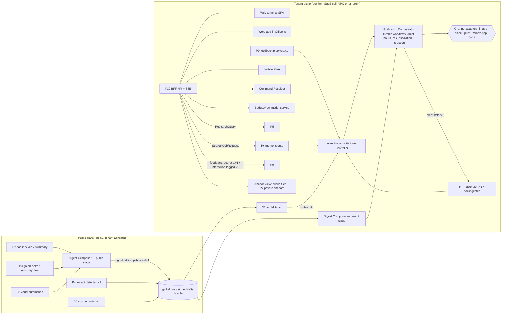

# P10 — Product Surface: the Legal Terminal

**Abstract.** P10 covers every surface a lawyer touches: the web terminal (desktop-first, keyboard-first), the Word add-in, a mobile PWA, and the notification channels (in-app, email, push, WhatsApp). It also owns the daily digest, watchlists, alert delivery and escalation, dashboards, the research and strategy workspace, the citator badge, click-to-source, and every feedback-capture widget. Its governing premise comes from the evidence. Fluent AI prose with citations earns more trust than it deserves: explanations raise acceptance of AI output whether or not it is correct [P10-8], and commercial legal AI tools still produce incorrect or misgrounded answers 17–33% of the time [P10-20]. So P10 shows evidence before prose, makes every sentence one click from its pinpoint paragraph, keeps machine-detected and human-verified statuses visibly distinct, and never shows a claim that P8 did not pass. The second premise is adoption. Pull-only chat tools stall [P10-22], and Indian litigators already run their day on cause lists and WhatsApp [P10-26][P10-31]. P10 therefore pushes value daily (a 06:30 IST digest, a court-day card, matter alerts). Every push goes through a fatigue controller designed from clinical alert-fatigue evidence [P10-12], and third-party channels carry no privileged content. P10 is almost free of LLM calls by design. It renders objects produced by P3–P9 and uses deterministic templates for personalisation, so it keeps working when a model provider changes and it cannot hallucinate on its own.

---

## 1. Purpose and scope

### 1.1 Purpose
Turn the platform's graph, evidence and verification outputs into a daily working tool that busy, sceptical Indian lawyers use without being told to. P10 must:
1. **Push** what changed and what is due, per matter and per watch, with correct severity and without fatigue.
2. **Answer** research and strategy questions in a workspace where every claim traces to an anchor (spine §C) in one click.
3. **Warn** at the point of use: in the research list, in the memo, in the Word draft, in the digest. A badge says whether an authority is still good law, how certain we are, whether a human has verified it, and whether it binds the forum.
4. **Capture** feedback at the moment of use with one tap. P9 turns this into learning [11_P9 §5.2].

### 1.2 Users and their constraints
| Persona | Daily reality (Indian practice) | What P10 must give them | Primary surface |
|---|---|---|---|
| Partner / senior counsel | In court most of the day. Reads on the phone between matters. Sceptical of AI. Signs off on strategy. | 60-second court-day card; sev-1 alerts only; memo verdicts with adverse authority up front | Mobile PWA, WhatsApp pointer, email digest |
| Senior associate | Drafts pleadings and replies to notices; runs research | Research workspace, strategy memo, Word add-in cite-check | Web terminal, Word |
| Junior associate / clerk (*munshi*) | Tracks cause lists, next dates, filings, compliance with orders | Cause-list-driven Today view, deadlines, order alerts | Web terminal, mobile |
| KM lawyer / librarian | Maintains practice-area watchlists and firm know-how; reviews flags | Watchlist manager, digest curation, verify queue | Web terminal |
| Firm admin / risk partner | Channel policy, ethical walls, audit | Admin console (P7-owned data, P10-rendered), channel content levels | Web terminal |

*Court hours, cause-list timing and WhatsApp-centric communication are described from practitioner knowledge and competitor features [P10-26][P10-31][P10-30]. The exact hours per court are **unverified** and are configuration, not constants.*

### 1.3 In scope
Information architecture, screens and interaction model; command grammar; citator badge rendering; click-to-source viewer; uncertainty display; watchlists and the tenant-side Watch Matcher; alert delivery, fatigue control, escalation and retraction; digest generation (public + tenant stages); Word add-in; mobile PWA and channel adapters (email, push, WhatsApp, SMS); feedback-capture widgets and the interaction log; performance budgets; onboarding for the design-partner firm.

### 1.4 Out of scope (owned elsewhere)
Alert *generation* for matters (P7 §5.12); impact computation (P4); AuthorityView computation (P3); ranking and evidence (P5); memo generation (P6); claim verification (P8); feedback learning and privacy gate (P9); matter data, ACL/PEP, walls, audit store (P7); Model Gateway (13_cross_cutting). P10 never computes legal status, relevance or deadlines. It renders them, routes them and collects reactions to them.

### 1.5 Design principles (normative)
- **DP1 — Evidence before prose.** Evidence cards stream first (≤3 s p95 [13_cross_cutting §6.1]). Prose sentences stay grey until P8 verifies them. Claims that fail verification are removed, and the removal is announced.
- **DP2 — One click to the paragraph.** Every claim, badge reason, digest line and alert explanation links to an `anchor_id`, which opens the source page with a bbox highlight.
- **DP3 — Honest status.** Machine-detected vs human-verified is a first-class visual variable (border and glyph, not colour alone [P10-18]). `UNKNOWN` and coverage gaps are shown, never hidden.
- **DP4 — Adverse first.** Every list, memo and digest item about an issue shows the strongest adverse authority in a pinned slot (P5 `ADVERSE_PINNED` [11_P9 §2.4]).
- **DP5 — Push with restraint.** Only severe items interrupt [P10-12]. Everything else is batched, merged or put in the digest. Every notification states why it was sent.
- **DP6 — Zero-leak channels.** Third-party channels (WhatsApp, SMS, push payloads) carry identifiers and a deep link, never privileged content, unless the firm's risk partner opts in [09_P7 §5.12].
- **DP7 — Keyboard-first, density on demand.** A typed command grammar with Indian-citation-aware resolution. Dense tables for power users, progressive disclosure for others (the Bloomberg pattern: mnemonic commands plus a GO key [P10-1]).
- **DP8 — Feedback is a by-product of work.** One tap and an optional reason chip. Free text is never mandatory. Every flag gets a visible resolution [11_P9 §5.2].
- **DP9 — As-of is always visible.** The `as_of_legal_date` and the "law current to" watermark appear on every legal output.

---

## 2. Input and output contracts

All names follow the spine (§B–§H) and the extensions accepted in 05_P3 (`AuthorityView`), 08_P6 (`StrategyJobRequest`, `Deadline`, memo events), 09_P7 (generalized `matter.alert.v1`, `matter.document.ingested.v1`, private anchors) and 11_P9 (extended `FeedbackEvent`, `retrieval.served.v1`, `feedback.resolved.v1`). New P10-owned ID prefixes: `wl_` (watchlist), `wr_` (watch rule), `wh_` (watch hit), `ntf_` (notification), `chb_` (channel binding), `dge_` (digest edition), `dgi_` (digest item), `udg_` (user digest), `imp_` (UI impression, when P10 renders a list P5 did not), `cck_` (cite-check run).

### 2.1 Inputs

| # | Input | Producer | Transport | P10 use |
|---|---|---|---|---|
| I1 | `matter.alert.v1` (P7-generalized: `alert_kind`, `severity`, `dedupe_key`, `recipients[]`, `explanation{text, anchors[]}`, `sensitivity`) | P7 | tenant bus | Alert Router → channels, inbox, digest |
| I2 | `impact.detected.v1` (public broadcast, `tenant_id=null`) | P4 | global bus → tenant plane | Watch Matcher for non-matter watches (status changes of watched works/provisions) |
| I3 | `doc.indexed.v1` + `DocCard` lookup (metadata, judges, parties, statutes/cases cited, summary ref) | P2 (+P1/P3 read APIs) | global bus → tenant plane | Watch Matcher (new documents); public Digest Composer |
| I4 | `graph.delta.v1` (with `graph_watermark`, `status_changes[]` [05_P3 S3-3]) | P3 | global bus | Badge cache invalidation; digest "treatment changes" section |
| I5 | `strategy.memo.published.v1`, `strategy.memo.stale.v1` | P6 | tenant bus | Memo ready/stale banners and notifications |
| I6 | `matter.document.ingested.v1` | P7 | tenant bus | "Notice received → analysis started" notification |
| I7 | `feedback.resolved.v1` | P9 | tenant bus | Closes the loop on the user's flag |
| I8 | `source.health.v1` | P0 [02_P0 §2] | global bus | Coverage banners and digest coverage footer |
| I9 | `index.generation.promoted.v1` | P2 [04_P2 §2] | global bus | "Law current to" watermark |
| I10 | Sync APIs: P5 `/research`, `/explain`; P3 `AuthorityView` batch; P6 job API; P8 streaming verification status; P7 matter/PEP/private-anchor APIs; public anchor store | P3/P5/P6/P7/P8 | HTTPS within tenant boundary | All interactive screens |
| I11 | `digest.edition.published.v1` (**new**, §2.4) | P10-public | global bus / on-prem delta bundle | Tenant-stage digest personalisation |

### 2.2 Outputs

| # | Output | Consumer | Contract |
|---|---|---|---|
| O1 | `feedback.recorded.v1` | P9 | Extended FeedbackEvent [11_P9 §2.4]; P10 sets `context.surface` (enum extended, §2.4) |
| O2 | `interaction.logged.v1` (**new**) | P9 | Implicit signals joined to `retrieval.served.v1.impression_id` |
| O3 | `alert.state.v1` (**new**) | P7 (audit, escalation record), P9 (alert precision) | Delivery, ack and escalation state per `alert_id` × recipient |
| O4 | `StrategyJobRequest` | P6 | 08_P6 §2.1 (unchanged) |
| O5 | `ResearchQuery` | P5 | spine §H; P10 fills `as_of_legal_date`, `forum`, `matter_id`, `perspective` and `experiment` [11_P9 §2.5-8] |
| O6 | `UploadRequest`, `MatterCommand`, `ConfirmationCommand` | P7 | 09_P7 §2.1 |
| O7 | `digest.edition.published.v1` (**new**) | P10 tenant stage (all deployments) | §2.3.4 |

### 2.3 P10-owned schemas

**2.3.1 View contract for the citator badge.** Derived from `AuthorityView` [05_P3 §2.2]. It is pure presentation, and P10 never changes the status.
```ts
type CitatorBadge = {
  target_id: string;                         // wrk_… | prp_… | provision anchor
  status: "GOOD"|"CAUTION"|"NEGATIVE"|"PARTIAL_NEGATIVE"|"UNKNOWN";   // copied from AuthorityView
  label_key: BadgeLabel;                     // Indian vocabulary, i18n key (§5.5)
  shape: "OCTAGON"|"HALF_DISC"|"TRIANGLE"|"CIRCLE"|"DASHED_CIRCLE";   // never colour alone
  provenance: "VERIFIED"|"MACHINE"|"UNDER_REVIEW"|"MIXED";          // from AuthorityView.definitive + reason review_states
  confidence_band?: "HIGH"|"MEDIUM"|"LOW";   // only when provenance ≠ VERIFIED; from status_confidence
  scope_note?: string;                       // "on Proposition 2 only" (PARTIAL_NEGATIVE)
  binding?: { value: "BINDING"|"PERSUASIVE"|"NOT_BINDING"|"UNDETERMINED"; basis_short: string; contested: boolean };
  top_reasons: Array<{ code: string; assertion_id: string; citing_work_id: string; citing_anchor: string;
                       court_level: string; bench_strength?: number; date: string;
                       review_state: "MACHINE"|"PENDING_REVIEW"|"VERIFIED" }>;   // ≤3, most severe first
  as_of: { status_mode: "CURRENT"|"HISTORICAL"; status_date: string; as_of_legal_date: string };
  graph_watermark: number;
  a11y_text: string;                         // full sentence for screen readers
};
```

**2.3.2 Watchlists (tenant plane; PostgreSQL schema per tenant, same pattern as P7).**
```sql
CREATE TABLE watchlist (tenant_id text, watchlist_id text, owner_kind text CHECK (owner_kind IN ('USER','TEAM','MATTER')),
  owner_ref text /* usr_|grp_|mat_ */, name text, delivery jsonb /* DeliveryPolicy */, paused_until timestamptz,
  created_by text, created_at timestamptz, PRIMARY KEY (tenant_id, watchlist_id));

CREATE TABLE watch_rule (tenant_id text, rule_id text, watchlist_id text,
  kind text CHECK (kind IN ('WORK','PROVISION','CASE','JUDGE','BENCH','COURT','PARTY','ADVOCATE','TOPIC','ISSUE','REGULATOR_FEED')),
  target_id text,          -- wrk_|anchor (wrk_…#sec-…)|cas_|jdg_|bnc_|crt_|ent_|iss_|source_id ; NULL for TOPIC
  topic_query jsonb,       -- ResearchQuery (perspective NEUTRAL) + min_score, for TOPIC
  triggers text[],         -- NEW_CITING_DOC|STATUS_CHANGE|NEW_DECISION|AMENDMENT|NEW_VERSION|STRUCK_DOWN|LISTED|NEW_MATCH
  filters jsonb,           -- {courts[], min_court_level, bench_strength_gte, langs[], practice_areas[]}
  min_severity int DEFAULT 3, last_watermark bigint, created_from jsonb /* {surface, ref} */,
  hits_30d int DEFAULT 0, not_relevant_30d int DEFAULT 0, precision_est real,  -- Beta(1+useful, 1+not_relevant) mean
  state text CHECK (state IN ('ACTIVE','DEMOTED_TO_DIGEST','PAUSED')) DEFAULT 'ACTIVE',
  PRIMARY KEY (tenant_id, rule_id));
CREATE INDEX ON watch_rule (tenant_id, target_id);          -- inverted index for ID matching

CREATE TABLE watch_hit (tenant_id text, hit_id text, rule_id text, cause_event_id text, subject_id text,
  trigger text, severity int, why jsonb /* WhyCode[] + anchors */, created_at timestamptz,
  PRIMARY KEY (tenant_id, hit_id), UNIQUE (tenant_id, rule_id, cause_event_id, subject_id));  -- idempotent
```
If a matter-scoped watch is created, P10 also writes a `matter_dependency(kind='WATCHED')` row through P7's API. Status impacts for that matter then come from P7's Impact Matcher as `matter.alert.v1`, and P10's Watch Matcher handles only *new-document* triggers for it. This avoids double alerts at the source (§5.9).

**2.3.3 Delivery.**
```ts
type DeliveryPolicy = {
  channels: { in_app: true;                                   // always on
              email: "IMMEDIATE"|"HOURLY"|"DIGEST_ONLY"|"OFF";
              push: "SEV1"|"SEV1_2"|"OFF";
              whatsapp: "SEV1"|"SEV1_AND_DIGEST_POINTER"|"OFF";  // capped by firm policy
              sms: "SEV1_FALLBACK"|"OFF" };
  quiet_hours: { start: "21:30"; end: "07:00"; tz: "Asia/Kolkata" };  // sev-1 bypasses [09_P7 §5.12]
  court_mode: "AUTO_FROM_CAUSE_LIST"|"MANUAL"|"OFF";         // holds sev-2 interrupts while the user is listed
  digest: { time: "06:30"; days: ("MON"|"TUE"|"WED"|"THU"|"FRI"|"SAT"|"SUN")[]; format: "FULL"|"COMPACT" };
  interrupt_budget_per_day: number;                          // sev-2 interruptive sends; default 8
  language: "en"|"hi";
};

type ChannelBinding = {
  binding_id: "chb_…"; tenant_id: string; user_id: string;
  channel: "WHATSAPP"|"SMS"|"PUSH"|"EMAIL"; address_enc: string;   // encrypted, tenant key
  verified_at: string;
  opt_in?: { captured_at: string; text_version: string; method: "IN_APP"|"WHATSAPP_REPLY" };  // WhatsApp policy [P10-14]
  opt_out_at?: string;
  content_level: "MINIMAL"|"STANDARD";      // MINIMAL = matter number + kind + link; firm policy may forbid STANDARD
  status: "ACTIVE"|"SUSPENDED"|"REVOKED";
};

type Notification = {
  notification_id: "ntf_…"; tenant_id: string; user_id: string;
  sources: Array<{ kind: "MATTER_ALERT"|"WATCH_HIT"|"MEMO_READY"|"MEMO_STALE"|"DOC_RECEIVED"|"FEEDBACK_RESOLVED"|"DIGEST"|"SYSTEM";
                   id: string /* alr_|wh_|mem_|pdoc_|fbk_|udg_ */; revision: number }>;
  merge_key: string;               // hash(user_id, primary_subject_id, root_cause_event_id)
  severity: 1|2|3; definitive: boolean; matter_id?: string;
  title_key: string; params: Record<string,string>;           // rendered per channel & content_level
  anchors: string[];               // public/private anchors backing the explanation
  state: "QUEUED"|"HELD_QUIET"|"HELD_COURT"|"BATCHED"|"SENT"|"DELIVERED"|"SEEN"|"ACKED"|"SNOOZED"|"ESCALATED"|"EXPIRED"|"RETRACTED"|"SUPERSEDED";
  attempts: Array<{ channel: string; at: string; provider_msg_id?: string; outcome: "OK"|"FAILED"|"BOUNCED"|"RATE_LIMITED" }>;
  requires_ack: boolean; ack_deadline?: string; escalation_step: 0|1|2;
  created_at: string; revision: number;
};
```

**2.3.4 Digest.** The public stage runs once, globally. The tenant stage runs per user, inside the tenant plane.
```ts
type DigestItem = {               // PUBLIC plane — no tenant data
  item_id: "dgi_…"; edition_id: "dge_20260930";
  kind: "JUDGMENT"|"TREATMENT_CHANGE"|"LARGER_BENCH_REFERENCE"|"STATUTE_AMENDMENT"|"NEW_PROVISION_VERSION"|"NOTIFICATION"|"STRIKE_DOWN";
  subject_id: string;              // wrk_ | provision anchor | asr_
  headline: string;                // deterministic template from metadata (court, bench, parties short name, date)
  summary: { summary_id: string /* sum_ from P2 */; claims: Claim[]; verification: { report_id: string; gate: "PASS"|"PARTIAL" } };
  badge: CitatorBadge;             // snapshot at composition time
  tags: { court_ids: string[]; practice_areas: string[]; provision_anchors: string[]; issue_ids: string[]; lang: string };
  notability: { score: number; signals: string[] };   // e.g. SC_REPORTABLE, LARGER_BENCH, OVERRULES, STRIKES_DOWN, HIGH_CITATION_VELOCITY
  anchors: string[];
};
// event data for digest.edition.published.v1
type DigestEditionPublished = { edition_id: string; cutoff_at: string /* 23:59 IST prev day */; law_current_to: string;
  items_uri: string; n_items: number; coverage: Array<{ source_id: string; status: string; lag_hours: number }> };

type UserDigest = {               // TENANT plane
  user_digest_id: "udg_…"; edition_id: string; user_id: string;
  sections: Array<{ kind: "COURT_DAY"|"DEADLINES"|"MATTER_IMPACTS"|"WATCH_HITS"|"PRACTICE_AREA"|"TREATMENT_CHANGES"|"VERIFY_TASKS"|"COVERAGE";
                    items: Array<{ ref: string; why: WhyCode[]; score: number }> }>;
  impression_id: string;           // logged like retrieval.served for P9 IPS
  rendered: { email_uri?: string; in_app: true }; sent_at?: string; opened_at?: string;
};
type WhyCode = { code: "WATCHED_PROVISION"|"WATCHED_JUDGE"|"CITED_IN_MATTER"|"OPPONENT_RELIED"|"PRACTICE_AREA"|"HEARING_TOMORROW"|"DEADLINE_DUE"|"ROLE_DEFAULT";
                 ref_id: string; matter_id?: string };
```

**2.3.5 Synchronous P10 API (BFF, tenant plane).** REST with OpenAPI, plus Server-Sent Events for streams.
```
POST /v1/command/resolve   {text, context{matter_id?, as_of?}} → CommandResolution{kind, target_id?, fn, args, confidence, alternatives[≤5]}
GET  /v1/badges?ids=…&as_of_legal_date=…&forum=…   → CitatorBadge[]   (batch ≤ 200; cached by (id, forum, as_of, graph_watermark))
GET  /v1/anchors/{anchor_id}/view                   → AnchorView{text, page, bbox[], tile_urls[], manifestation{source_url, fetched_at},
                                                        quote_check{quote_hash_ok}, ocr_conf, lang, alt_expressions[], privilege_class?}
GET  /v1/today                                      → TodayModel (court day, sev-1/2 open alerts, deadlines ≤7d, memo states)
SSE  /v1/stream/research/{query_id}                 → evidence_card | coverage | claim_draft | claim_status | claim_removed | done
SSE  /v1/stream/memo/{memo_id}                      → section_progress | claim_status | gate | stale
POST /v1/watch | PATCH /v1/watch/{id} | DELETE …    → Watchlist / WatchRule
GET  /v1/alerts?state=open&matter=…                 → Notification[] ; POST /v1/alerts/{ntf}/ack|snooze|feedback
GET  /v1/digest/{edition_id}/me                     → UserDigest (rendered)
POST /v1/citecheck  {segments[{range_ref, text}], as_of_legal_date, forum}  → CiteCheckReport (Word add-in)
POST /v1/feedback   FeedbackEvent (client fields) → 202 ; server stamps actor_ref, consent_snapshot_id, recorded_at
```
```ts
type CiteCheckReport = { cck_id: string; mentions: Array<{
    range_ref: string; raw_text: string; resolved_target_id?: string; resolution_confidence: number; candidates: string[];
    badge?: CitatorBadge;
    pinpoint?: { para?: string; anchor_id?: string; quoted_text?: string; quote_found: boolean; best_match_anchor?: string };
    issues: ("UNRESOLVED"|"AMBIGUOUS"|"NEGATIVE"|"CAUTION"|"MACHINE_NEGATIVE_UNDER_REVIEW"|"QUOTE_NOT_FOUND"|"PARA_NOT_FOUND"
            |"OLD_CRIMINAL_CODE"|"PROVISION_NOT_IN_FORCE_ON_DATE"|"NOT_BINDING_ON_FORUM")[];
    suggestion?: { kind: "CROSSWALK"|"LATER_AUTHORITY"|"CORRECT_PARA"; target_id: string; note_key: string } }>;
  summary: { n: number; negative: number; caution: number; unresolved: number; quote_mismatch: number };
  as_of_legal_date: string; graph_watermark: number };
```

### 2.4 Proposed spine changes

| # | Target | Change | Justification |
|---|---|---|---|
| S10-1 | §G events | **Add `alert.state.v1`** (P10 → P7, P9): `{alert_id, notification_id, recipient usr_, channel, state: SENT/DELIVERED/SEEN/ACKED/SNOOZED/ESCALATED/EXPIRED/RETRACTED, at, escalation_step}` | P7 requires unacknowledged sev-1 alerts to escalate [09_P7 §5.12], but only the delivery layer knows whether a message was seen or acknowledged. The same state gives P9 alert-precision labels (useful vs ignored). |
| S10-2 | §G events | **Add `interaction.logged.v1`** (P10 → P9, tenant-scoped): `{impression_id, item_id, anchor_id?, action: OPEN_SOURCE/DWELL/COPY/PIN_TO_MATTER/EXPORT/EXPAND_REASON/HOVER_PREVIEW, dwell_ms?, position, surface, at}` | P9 lists implicit signals as a learning input [11_P9 §5.2 row 9] but no event carries them. Without `impression_id` the clicks cannot be debiased [11_P9 §2.5-2]. |
| S10-3 | §G `matter.alert.v1` (P7-generalized) | Add `subject_ids[]` (public IDs the alert is about), `definitive: bool`, `revision: int`, `supersedes_alert_id?`, `requires_ack: bool` | (a) P10 merges matter alerts with watch hits on the same public subject. Without `subject_ids`, a user gets two notifications for one event. (b) Tier-1 alerts go out provisionally as "machine-detected" and are verified within one business day [13_cross_cutting §6.2]. The verification or retraction must *update* the original alert, not create a second one. |
| S10-4 | §G events | **Add `digest.edition.published.v1`** (P10-public → every tenant plane, including on-prem via the signed PLC delta bundle) | The digest's public content (summaries, verification, badges) is computed once. It crosses the PLC→TPL boundary, the permitted direction. |
| S10-5 | FeedbackEvent `context.surface` [11_P9 §2.4] | Add `DIGEST`, `WORD_ADDIN`, `SOURCE_VIEWER`, `COMMAND_BAR`, `MOBILE`, `WHATSAPP` | P9 attributes signal quality by surface. Digest and Word signals behave differently from research-list clicks. |
| S10-6 | §H (endorse 05_P3 S3-2) | Adopt `AuthorityView` with `definitive` and `reason_codes` as the only input to badges | Without `definitive`, P10 cannot keep machine-detected and verified negative treatment visually apart, and that separation is the central trust requirement (§5.5). |

---
## 3. State-of-the-art survey (with citations)

### 3.1 Terminal interaction models
- **Bloomberg Terminal.** Commands are typed mnemonics terminated by a green **GO** key, for example `{VOD LN Equity GO}`. Yellow sector keys (GOVT, EQUITY, COMDTY, CURNCY) scope the command. A Menu key returns to the previous function and a History key recalls commands in reverse order. The core terminal shows four panels at once, and *Launchpad* provides persistent custom layouts [P10-1]. About 325,000 subscribers paid roughly US$24,000+ a year each (2022 figure) [P10-1]. **Lesson:** expert users accept density and a learning curve when the grammar is stable (`<security> <function> GO`) and the system is fast. The grammar itself becomes the product's language. We adopt `<entity> <function> ⏎` with legal entities (citations, provisions, matters, CNRs).
- **Legal AI assistants** are mostly chat-first. The Stanford evaluation found Lexis+ AI and Westlaw AI-Assisted Research gave incorrect or misgrounded answers 17% and 33% of the time. Ask Practical Law AI was incomplete 62% of the time [P10-20]. In Vals' 2025 legal-research benchmark some tools failed to respond at all [P10-21]. Harvey faces public criticism of its adoption depth, answered by a claim of 77% seat utilisation [P10-22]. Paxton says openly that "matter record, legal research, final work product live in separate workflows" in most tools [P10-24]. **Lesson:** a chat box with no matter context and no push surfaces gets used for a few ad-hoc questions and is then abandoned.

### 3.2 Citators and status signalling
- **KeyCite** (Westlaw, since 1997 [P10-3]): red flag = overruled or invalidated; yellow = questioned or criticised but possibly still valid; blue-striped = treatment less severe than red or yellow. **Overruling Risk** (AI) "warns when a point of law has been implicitly undermined based on its reliance on an overruled or otherwise invalid prior decision". **KeyCite Alerts** monitor the status of a case or statute [P10-2]. CoCounsel Deep Research shows KeyCite flags inline in agent output [P10-27].
- **Shepard's** (Lexis): online reports carry a status icon and plain-English treatment phrases such as "followed by" and "overruled" [P10-4]. A **Shepard's Citation Agent** checks citations inside Protégé [P10-28].
- **India:** Manupatra's AI search surfaces citation metadata, judicial history and "overruled/distinguished" markers [P10-32]. CaseMine offers AMICUS and CaseIQ (upload a document, get precedents) [P10-33]. Indian Kanoon Prism caps alerts by plan: 25 on Premium, 100 on Pro [P10-25]. None of the Indian products we reviewed publicly separates machine-detected from editor-verified treatment in the UI (based on public pages only; **unverified** inside paid products).
- **Accessibility:** WCAG 2.2 SC 1.4.1 (Level A) forbids colour as "the only visual means of conveying information" [P10-18]. A red/yellow/green flag system without shapes fails for colour-blind users, and it also fails on the monochrome printouts that Indian courts still see.

### 3.3 Trust, reliance and uncertainty (HCI evidence)
- Explanations **"increased the chance that humans will accept the AI's recommendation, regardless of its correctness"** and did not improve joint human-AI performance (Bansal et al., CHI 2021) [P10-8]. *Implication:* a model-written rationale ("this case supports you because…") is a persuasion device, not a safeguard. Our "explanation" is the source paragraph itself, plus the deterministic reason chain (predicate, citing court, bench strength).
- Confidence scores **help calibrate trust**, while local explanations have problems in AI-assisted decisions (Zhang, Liao, Bellamy 2020) [P10-9].
- First-person uncertainty expressions ("I'm not sure, but…") **reduced over-reliance on wrong answers and improved accuracy**. More generic phrasings had weaker, non-significant effects. "The precise language used matters" (Kim et al., FAccT 2024; n=404) [P10-10]. *Implication:* hedging phrases are UI copy that must be user-tested, not left to the model.
- Thomson Reuters *Future of Professionals 2026*: 41% of professionals lack tools that meet professional accountability standards; 34% use AI their organisation has not approved; where there is a clear AI strategy, 66% say AI meets or exceeds expectations, against 22% where there is none [P10-11]. *Implication:* audit trails, firm-approved deployment and partner-visible controls are adoption features, not compliance overhead.

### 3.4 Alerting and fatigue
- In clinical decision support, clinicians override most alerts. VA primary-care clinicians received more than 100 alerts a day. Monitors in 66 ICU beds generated over 2 million alerts a month (187 per patient per day). Recommended mitigations: make **only severe alerts interruptive**, raise specificity by removing inconsequential alerts, tailor alerts to context, and apply human-factors design to format and colour [P10-12]. The lesson carries over directly. An alert system that cries wolf trains lawyers to ignore the one alert that matters: "the authority in your filed reply was overruled today".
- Legal products cap alerts by count (IK Prism 25/100 [P10-25]). KeyCite Alerts are per-document monitors [P10-2]. Neither addresses relevance or fatigue. Indian practice-management tools push case updates and cause lists (Provakil [P10-31]; CLAW with WhatsApp alerts [P10-26]; LegitQuest Patrol [P10-34]) but have no link to legal-status changes.

### 3.5 Channels in India
- **WhatsApp Business Platform.** Per-message pricing since **1 July 2025**. Charges apply only when a template is delivered. Service messages are free (since 1 Nov 2024). **Utility templates sent inside an open 24-hour customer-service window are free.** INR billing for India began 1 Jan 2026, and India marketing rates rose on that date [P10-13]. Policy: businesses need the recipient's number *and* opt-in, must honour opt-outs on or off WhatsApp, and must not ask for sensitive identifiers [P10-14]. **Cloud API local storage** can keep data at rest in a selected country (India is the documented example). However, message content "may be stored on Meta data centers internationally while being processed" for up to 60 minutes [P10-15]. *Implication:* even with India local storage, content passes through data centres outside India, and the provider can read it. So privileged content never goes to WhatsApp by default (DP6).
- **DPDP.** A firm processing its own lawyers' contact data for work alerts can rely on the employment legitimate use (s.7(i)) [P10-16]. Opt-in is still required by WhatsApp policy [P10-14], and DPDP Rules commence in phases up to May 2027 [P10-35]. We record channel opt-in separately from employment processing.
- **Email** remains the formal channel for partners and clients. **Mobile push** requires an app or PWA install. **SMS** in India needs DLT template registration under TRAI's commercial-communication regulations *(unverified in this session; confirm before build)*.

### 3.6 Indian digest patterns
SCC Times publishes Supreme Court, High Court, Legislation, Tribunal (monthly), Topic-wise and Weekly roundups [P10-17]. LiveLaw and Bar & Bench publish similar editorial digests *(format details unverified)*. They are well written and trusted but **not personalised, not matter-aware and not treatment-aware**: they report what was decided, not what it does to *your* authorities.

### 3.7 Word as the drafting surface
Office.js Word add-ins run on Word for web, Windows (2016+), Mac and iPad from one codebase. They can read and modify paragraphs, content controls and other document objects [P10-6]. Admins can push add-ins to users or groups through **centralized deployment**, which takes up to 24 hours to propagate. It requires Exchange Online and Entra ID and does **not** support on-premises directories or MSI Office (except Outlook) [P10-7]. Legora's product centres on a Word sidebar [P10-23]. Spellbook presents tracked-change redlining in Word: "every suggestion tracked" [P10-5]. Contract-drafting add-ins dominate. **Litigation cite-checking inside Word, with the treatment status of Indian authorities, is an open space** (based on our competitor survey [20_competitive_teardown]).

### 3.8 Judge analytics
France criminalised reusing judges' identity data to evaluate, analyse, compare or predict their practices (Art. 33, Justice Reform Act 2019) [P10-29]. India has no equivalent statute that we found *(absence unverified)*. P6 limits bench simulation to the forum/doctrine level [08_P6 §5.9]. P10 follows the same rule: a judge page shows public facts (bio, courts, benches sat on, judgments authored or joined) and **no outcome statistics** (§5.9.3).

### 3.9 Performance norms
Google's INP threshold for "good" responsiveness is ≤200 ms at the 75th percentile, and >500 ms is "poor" [P10-19]. Platform latency SLOs (citation lookup 250 ms p95, click-to-source 400 ms p95, first evidence cards 3 s p95, verified answer 25 s p95) are set in 13_cross_cutting §6.1. P10 adds client-side budgets on top (§5.16).

---

## 4. Mistakes others made and how we avoid them

| System/paper | What went wrong | Evidence | How we avoid it |
|---|---|---|---|
| Lexis+ AI, Westlaw AI-AR, Ask Practical Law AI | Fluent answers with wrong or misgrounded citations; many incomplete answers | 17–33% hallucination; 62% incomplete for Practical Law [P10-20] | Evidence streams first. Each sentence stays grey until P8 verifies it. Unsupported claims are *removed* and the removal is announced ("1 statement withheld"). A coverage panel shows what could not be checked (§5.7). |
| XAI explanation interfaces (general) | Explanations raise acceptance even when the AI is wrong | Bansal et al. [P10-8] | No model-written "why this supports you" as the primary explanation. The source paragraph and the deterministic reason chain are the explanation. Model rationales are collapsed by default and labelled "argument", not "evidence". |
| Colour-only citator flags (generic pattern) | Colour alone conveys status; fails WCAG 1.4.1 and greyscale print | [P10-18] | Shape + label + border style, with colour as a redundant cue (§5.5). |
| Citators that merge machine and editorial signals *(pattern risk for AI citators, incl. ours)* | Users cannot tell a verified overruling from a classifier guess, so they either over-trust or ignore both | Overruling Risk is explicitly labelled as AI-derived [P10-2]; our P3 has MACHINE/VERIFIED states [05_P3] | Provenance is its own visual channel: solid border = verified, dashed border + "M" = machine-detected, spinner = under review. Tier-1 machine negatives are **shown, never hidden** (a missed overruling costs more than a false caution) but are never drawn as definitive. |
| Clinical decision-support alerts | Alert floods lead to overrides and missed critical alerts | >100 alerts/day; 187 per patient per day [P10-12] | Severity tiers (only sev-1 interrupts); merge and storm-mode summarisation; per-user interrupt budget; rule precision learned from feedback with auto-demotion to digest; "why you got this" on every alert (§5.8). |
| IK Prism alert caps | Caps by *count* push users to watch less rather than watch better | 25/100 alerts per plan [P10-25] | No count caps. Budgets apply to *interruptions*, not to watches. Low-precision rules are demoted to the digest, and the user is told. |
| Chat-first legal AI | Pull-only use; adoption questioned | Harvey criticism and utilisation debate [P10-22] | Push surfaces (Today, digest, alerts, Word). Chat is one panel scoped to a matter and an as-of date, not the home screen. |
| Separate research and matter tools | The matter record, research and work product live apart | Paxton's own framing [P10-24] | One object model: every research query, memo and draft carries `matter_id`, `as_of_legal_date` and forum; watchlists and alerts link to matters. |
| Editorial digests (SCC Times, LiveLaw, Bar & Bench) | Not personalised, not matter-aware, not treatment-aware | Format list [P10-17] | Two-stage digest. Public summaries are verified once. Personalisation by watches, matters and practice area is deterministic and explained (§5.10). |
| WhatsApp alert products (e.g., CLAW [P10-26]) | *Risk pattern (not verified for any vendor):* party names and order text in WhatsApp expose privileged or confidential data to a third-party processor with cross-border processing | Cloud API processes content internationally up to 60 min [P10-15] | `content_level=MINIMAL` by default: firm matter number + alert kind + authenticated deep link. Richer content only on the risk partner's written opt-in (§5.12). |
| Office add-in rollouts | Centralized deployment fails for on-prem Exchange/AD and MSI Office, which some Indian firms run | Requirements page [P10-7] | Three deployment paths (§5.11.4) and a `.docx` round-trip fallback. |
| Judge analytics products (global) | Legal and ethical exposure; France criminalised the practice | Art. 33 [P10-29] | No outcome statistics per judge. Judge watch covers new judgments only (§5.9.3). |
| Legal AI "no answer" failures | Timeouts and refusals shown as blank or generic errors | VLAIR no-response failures [P10-21] | Partial results with an explicit coverage state and a retry path, streamed per issue; never a blank screen. |

---
## 5. Recommended design, in detail

### 5.1 Component architecture


**Stack decisions (justified in §6):** a TypeScript SPA (React-class framework, virtualised lists, a local IndexedDB cache of the user's matters and recent entities); a BFF in the tenant plane (REST + SSE, OpenAPI-typed, stateless, horizontally scaled); the Notification Orchestrator on the platform's durable-workflow engine (the same engine P0/P4 choose, so the platform runs one fewer engine); per-tenant PostgreSQL schema for P10 tables; Redis-class cache for badges, sessions and rate limits; page tiles (PNG/WebP, 150 dpi, with a text layer) pre-rendered at P1 parse time for public documents and on demand into the tenant bucket for private ones, served from an India-region CDN behind signed, short-lived URLs.

### 5.2 Information architecture

```mermaid
flowchart TB
  CB[[Command bar Ctrl-K / "/" — global]]
  T[Today] --- M[Matters] --- R[Research] --- A[Authorities & Citator] --- S[Statutes point-in-time] --- W[Watchlists] --- AL[Alerts inbox] --- D[Digest] --- ADM[Admin]
  M --> M1[Matter cockpit: Overview · Strategy memo · Authorities for/against · Documents · Timeline · Deadlines & hearings · Alerts · Drafts]
  R --> R1[Research workspace: issues · evidence cards · verified answer · coverage]
  A --> A1[Authority page: badge · treatment table · direct history · propositions · citing map]
  S --> S1[Provision view: version timeline · diff · crosswalk IPC↔BNS etc. · interpreting judgments]
  SV[(Source viewer drawer — opens over any screen)]
  CTX[(Context chips: Matter · Forum · As-of date · Law current to)]
```
Global invariants: (1) the context chips sit on every screen and in every export; (2) the source viewer opens as a right-hand drawer (48% width on desktop, full-screen on mobile) and never navigates away, so the lawyer keeps their place; (3) every list row has the same micro-toolbar: `o` open source, `f` flag, `w` watch, `p` pin to matter, `e` export.

### 5.3 Command grammar (keyboard-first)

**Grammar (PEG, deterministic first; the LLM is used only as a fallback through P5's intent router):**
```
command    := entity [function] [modifier]* | verb [argument] [modifier]* | freetext
entity     := cnr | neutral_cit | reporter_cit | provision | matter_ref | judge_ref | court_ref | party_ref | work_title
function   := "CT" citator | "TR" treatment table | "HIST" direct history | "P" <para> | "PROP" propositions
            | "V" versions | "DIFF" <date> <date> | "XW" crosswalk | "AMD" amendments | "INT" interpreting judgments
            | "TL" timeline | "DL" deadlines | "HR" hearings | "MEMO" | "DOCS" | "W" watch | "ASK" <text>
verb       := "Q" research | "Q!" deep research (memo-grade, async) | "CL" cause list | "ALR" alerts | "DG" digest
            | "ASOF" <date> | "FORUM" <court> | "NEW MATTER" | "UPLOAD"
modifier   := "@" <date> | "in:" <court> | "bench>=" <n> | "lang:" <code> | "for:" <matter_ref>
```
**Examples (users type, the Enter key acts as GO):**

| Typed | Resolves to |
|---|---|
| `2023 INSC 1 CT` | Authority page for the SC judgment, citator tab |
| `(2017) 10 SCC 1 P 45` | Same Work via `identifier_alias` (scheme SCC); source viewer at `#p45` |
| `AIR 1973 SC 1461 HIST` | Direct-history lineage (spine `APPEAL_OF` chain) |
| `IPC 420 XW` | Crosswalk to BNS with `change_type` and the transition rule for offences before 1 July 2024 |
| `BNSS 187 @2024-06-30` | "Not in force on this date" + the CrPC counterpart on that date |
| `S 138 NI V` | Version timeline for s.138, Negotiable Instruments Act |
| `ART 21 INT in:SC bench>=5` | Constitution Bench judgments interpreting Art. 21 |
| `DLHC010012342024 TL` | The matter linked to that CNR, timeline tab (CNR = 16-character eCourts number *(format per P1)*) |
| `M 2024/LIT/0142 DL` | Matter by firm number, deadlines |
| `Q is a s.17A PC Act approval needed for pre-2018 offences for:0142` | Research, scoped to the matter, as-of taken from matter |
| `CL tomorrow` | Tomorrow's cause-list items for my matters and my advocates |

**Resolver pipeline (≤100 ms p95 server, ≤30 ms for client-cached entities):**
1. Mnemonic verbs and functions (exact, case-insensitive).
2. Regex families from P1's citation grammar: CNR, `YYYY INSC N`, HC neutral formats, reporter citations (SCC/AIR/SCR/SCALE/JT/SCC OnLine/CriLJ …). Each is parsed into `CitationMention.parsed` and resolved through `identifier_alias` (spine §D). Ambiguous → show ≤5 candidates with court, date and parties.
3. Provision parser: act-alias table ("NI Act", "PC Act", "BNS", "CrPC", "Art.") + section/sub-section grammar → spine §C statute anchor; `@date` → point-in-time expression.
4. Tenant typeahead: matters (number, title, client short name), people; public typeahead: judges (`jdg_`), courts (`crt_`), recurring parties (`ent_`).
5. Otherwise → `Q <text>` (NL research via P5; P5's intent router may redirect "what changed" questions to the change feed [07_P5 I11]).
Every resolution returns `confidence` and `alternatives`. Below 0.9 the bar shows the interpretation *before* executing ("Did you mean (2017) 10 SCC 1 = K.S. Puttaswamy?" — *example only*). This prevents a confused user landing silently on the wrong case.

**Keyboard map (web and Word pane where applicable):** `Ctrl-K` or `/` command bar · `g t / g m / g r / g a` go to Today, Matters, Research, Alerts · `j / k` next/previous row · `o` open source · `[ / ]` previous/next paragraph in source viewer · `f` flag (reason chips) · `a / x` accept/reject claim · `w` watch · `p` pin to matter · `e` export to Word · `.` toggle as-of chip · `?` cheat-sheet. Mouse and touch paths exist for everything, and the keyboard is never required.

### 5.4 Key screens (wireframe level)

*Wireframes are illustrative. Party names are placeholders, and statute or citation examples are examples only (not verified legal statements).*

**S1 — Today (home).** Built from `/v1/today`. First paint ≤1.0 s p75.
```
┌ Today · Tue 30 Sep 2026 ─────────────── Law current to 30 Sep 06:00 IST ▾  ⚠ Allahabad HC feed 14h late ┐
│ COURT DAY (from cause lists)                     │ NEEDS ACTION                                         │
│ 10:30 Delhi HC · Ct 32 · Item 14  0142 Sharma v. │ ⛔M Authority in your filed reply may be overruled   │
│       State (bail) · last order: reply filed     │   (machine-detected, under review) · 0142 · [open]   │
│       since last hearing: 1 authority changed ▸  │ ▲ Order in 0199: "reply within 4 weeks" → deadline   │
│ 11:00 NCLT Mumbai · Ct II · 0107 IA 55/2026     │   PROPOSED 28 Oct · [confirm] [edit]                  │
│ DEADLINES ≤7 days                                │ ● Memo ready: 0211 SCN reply (VERIFIED 41/44 claims) │
│  2 Oct  0188 Limitation: appeal u/s 421 CA 2013  │ DIGEST · 12 for you · 3 matter-linked  [read ▸]      │
│         computed · statutory anchor ▸ · CONFIRMED│ VERIFY (2 min) · 3 treatment checks for your areas   │
└──────────────────────────────────────────────────┴──────────────────────────────────────────────────────┘
```
"Since last hearing" is a diff: every public or private change on the matter since the last `hearing.date` (new orders, authority status changes, new documents, opponent filings). It is the partner's pre-hearing brief in one line.

**S2 — Matter cockpit / Strategy memo.** Streams via `/v1/stream/memo/{id}`.
```
┌ 0142 · Sharma v. State of NCT · Delhi HC · Bail (s.483 BNSS) · Client: Applicant ─ As-of: 12 Aug 2026 (cause of action) ▾ ┐
│ Memo mem_… · VERIFIED 38 · PARTIAL 3 · withheld 1 · STALE ⚠ 1 claim (authority status changed 29 Sep) [re-verify]   │
│ ┌ Opponent claims ─────────────┐ ┌ Issues ───────────┐ ┌ Adverse authorities (pinned first) ──────────────────────┐ │
│ │ OC1 Flight risk [pdoc p12]   │ │ I1 Parity (…)     │ │ ▲ X v. State (2025) Del HC DB · CAUTION · M(High)        │ │
│ │ OC2 Tampering [pdoc p15]     │ │ I2 Delay …        │ │   How to distinguish: facts ¶ 18 differ … [¶18] [¶22]  │ │
│ └──────────────────────────────┘ └───────────────────┘ └──────────────────────────────────────────────────────────┘ │
│ Favourable: ● Y v. UoI (2024) SC 3J · BINDING · VERIFIED · "…bail is the rule…" [¶ 27 ↗]   [a][x][f]                │
│ Deadlines: Reply to status report — 7 Oct (court-ordered, ord ¶3) CONFIRMED_INPUTS [trace ▸]                        │
│ Uncertainties: "I could not find a Delhi HC Division Bench ruling on I2 after 1 Jul 2024." (coverage ▸)             │
└────────────────────────────────────────────────────────────────────────────────────────────────────────────────────┘
```
Claim rows show: text · support chips `[¶27 ↗]` · badge of each cited authority · verification state · `origin_role` icon (advocate/opponent/bench) · `assumptions` marker when the claim rests on an unconfirmed (MACHINE) fact [08_P6 C2]. Toolbar: accept, reject (reason chips), edit, "add authority" (FLAG_MISSING_AUTHORITY), "send to draft".

**S3 — Research workspace.**
```
┌ Q: "Is pre-deposit under s.19 MSMED Act mandatory for a s.34 challenge?"  Forum: Bombay HC ▾  As-of: today ▾ ┐
│ ISSUES (edit ✎)             │ EVIDENCE (streams ≤3 s)                          │ ANSWER (streams; grey = verifying) │
│ ▸ I1 Mandatory nature       │ ADVERSE ⟂  ▲ … (Bom HC 2023) CAUTION · binding?  │ Pre-deposit of 75% is mandatory   │
│ ▸ I2 Waiver / relaxation    │ BINDING ⟂  ● … (SC 2019 3J) GOOD · BINDING ✓     │ for the award-debtor [1][2] …     │
│ ▸ I3 Timing of deposit      │ 3. ● … (SC 2022) GOOD · followed 41× …            │ ░░░ verifying ░░░                 │
│ COVERAGE                    │ 4. ◐ … PARTIAL_NEGATIVE on Prop. 2 only …        │ 1 statement withheld (unsupported)│
│ I1 binding ✓ adverse ✓      │ [o]pen [f]lag [w]atch [p]in  — why ranked? ▸      │ [Copy with citations] [→ Word]    │
│ I3 ⚠ no HC DB found         │                                                  │                                   │
└─────────────────────────────┴──────────────────────────────────────────────────┴───────────────────────────────────┘
```
"Why ranked?" calls P5 `/explain` and renders the leg ranks and authority features as a compact table. It is *not* model prose (see Bansal et al. [P10-8]).

**S4 — Authority page (citator).**
```
┌ ⛔ OVERRULED (VERIFIED) · A v. B, (2011) SC 2J · 14 Mar 2011 ─────────────── status as of 30 Sep 2026 (CURRENT) ┐
│ Binding on your forum (Bombay HC): NO LONGER — overruled by C v. D (2019) SC 5J ¶ 81 [↗]                         │
│ Propositions: P1 (limitation runs from…) ⛔ overruled · P2 (condonation…) ● followed 12×                          │
│ Negative & cautionary treatment first:                                                                           │
│  ⛔ C v. D (2019) SC 5J  OVERRULES P1        ¶81 [↗]  VERIFIED (editor, 16 Oct 2019)                              │
│  ▲ E v. F (2015) SC 2J   DOUBTS P1           ¶40 [↗]  M · High                                                    │
│  ▲ G v. H (2016) SC 2J   REFERS_TO_LARGER_BENCH ¶12 [↗] VERIFIED                                                  │
│ Positive: FOLLOWS 23 · APPLIES 51 · EXPLAINS 7 · CITES 312   [filter court ▾ bench ▾ date ▾ proposition ▾]         │
│ Direct history: Trial (Dist. Pune) → Bom HC (2009) REVERSED → SC (2011) ← you are here                           │
└──────────────────────────────────────────────────────────────────────────────────────────────────────────────────┘
```
Heavily cited works (thousands of citing documents) show aggregated `treatment_summary` counts with server-side pagination. Negative and cautionary rows are never paginated away. They always render first and in full.

**S5 — Source viewer (click-to-source).** See §5.6.

**S6 — Statute provision, point-in-time.**
```
┌ s.138 Negotiable Instruments Act, 1881 ── version valid on: 12 Aug 2026 ▾ ─── timeline: ●1989──●2002──●2015──●today ┐
│ [text of provision at the date, sub-clauses anchored: sec-138, sec-138.p1 (proviso) …]                                │
│ DIFF 2002 ↔ 2015 (inline red/green + "substituted by Act X of YYYY, s.N" with gazette anchor)                         │
│ INTERPRETED BY (binding on Bombay HC first) · STRUCK/READ DOWN: none · CROSSWALK: n/a                                 │
└───────────────────────────────────────────────────────────────────────────────────────────────────────────────────────┘
```
For the criminal-code transition the crosswalk panel shows the `CORRESPONDS_TO` assertion with `change_type`, its review state, and the date rule: which code applies to an offence committed on the matter's cause-of-action date. The rule is P3/P6-computed; P10 only renders it.

**S7 — Alerts inbox.** Grouped by matter, then by severity. Each row: severity glyph · kind · title · "why you got this" (WhyCode) · definitive/machine marker · age · actions `[ack] [snooze ▾] [useful] [not relevant ▾] [wrong ▾]`. A retracted alert stays visible, struck through, with a "Correction" note.

**S8 — Digest (email + in-app)** — §5.10. **S9 — Word add-in** — §5.11. **S10 — Mobile PWA + WhatsApp** — §5.12.

### 5.5 Citator badge design (Indian vocabulary)

**Mapping `AuthorityView` → `CitatorBadge`.** `reason_codes` come from 05_P3 §2.2.

| AuthorityView.status | Label (en) — chosen by top reason code | Shape | Colour (redundant) |
|---|---|---|---|
| NEGATIVE | Overruled · Reversed / Set aside · Declared per incuriam · Struck down · Legislatively overridden · Repealed/Omitted · Not in force on date | ⛔ octagon | red |
| PARTIAL_NEGATIVE | Overruled in part (on Prop. n) · Modified on appeal · Read down | ◐ half-disc | orange |
| CAUTION | Doubted · Referred to larger bench (pending) · Not followed by HC · Conflicting co-ordinate benches · Relies on overruled authority · Stayed · Under appeal · Prospective overruling saves (for your date) · Negative signal under review | ▲ triangle | amber |
| GOOD | Followed n× · Affirmed · No negative treatment found | ● circle | green |
| UNKNOWN | Coverage gap (source down / not yet processed) · Status undetermined | ◌ dashed circle | grey |

**Provenance (second visual channel):** solid outline = `VERIFIED`; dashed outline + superscript **M** + band (High/Med/Low) = `MACHINE`; a small clock glyph = `UNDER_REVIEW` (a PENDING_REVIEW tier-1 assertion exists); split outline = `MIXED` (verified reason plus a newer machine reason). The binding chip is separate: `BINDING (SC, Art. 141)`, `BINDING (larger bench, same HC)`, `PERSUASIVE (other HC)`, `NOT BINDING`, `UNDETERMINED`. It is shown only when a forum is set. Otherwise it reads "set forum to see binding effect".

**Rendering rules (normative):**
```ts
function toBadge(v: AuthorityView, forum?: Forum): CitatorBadge {
  const reasons = sortBySeverity(v.reason_codes, v.reason_assertion_ids);        // NEGATIVE codes first
  const prov = v.definitive ? "VERIFIED"
             : reasons.some(r => r.review_state === "PENDING_REVIEW") ? "UNDER_REVIEW"
             : reasons.some(r => r.review_state === "VERIFIED") ? "MIXED" : "MACHINE";
  // R1: never upgrade. A machine NEGATIVE stays NEGATIVE-shaped (octagon), drawn dashed with "M" + band.
  // R2: never hide. status_confidence < 0.5 on a tier-1 negative → still shown as CAUTION "Negative signal under review", never GOOD.
  // R3: GOOD requires coverage: if any source.health for the citing courts' window is DOWN/DEGRADED → append "coverage gap" note.
  // R4: HISTORICAL mode (research/audit) prints "status on <date>" in the label; CURRENT is the default for litigation.
  // R5: PARTIAL_NEGATIVE must carry scope_note naming the proposition(s); a badge without scope is a bug (CI check).
  return {...};
}
```
Badge copy is written in the first person where it expresses uncertainty ("I found a possible overruling — under editorial review, expected by tomorrow"). Kim et al. found first-person phrasing reduced over-reliance [P10-10]. The exact wording is A/B-tested with the partner firm (§9).

**Screen-reader text** (`a11y_text`), for example: "Caution. Machine-detected, high confidence. Doubted by E v. F, Supreme Court, two judges, 2015, paragraph 40. Not yet verified by an editor."

### 5.6 Click-to-source pinpoint UX

1. **Hover preview (≤150 ms from cache):** anchor text (first 400 chars, with the claimed span highlighted), para number as printed, court · bench · date, badge, language.
2. **Click → source viewer drawer:** the page tile with a translucent bbox highlight over the anchor span (spine §C stores page + bbox). The text layer beneath is selectable. `[ ]` step through paragraphs. A header shows the manifestation provenance ("PDF from sci.gov.in, fetched 29 Sep 2026 18:04 IST, sha256 …") and a link to the original.
3. **Quote integrity check:** P6/P8 quotes carry `quote_hash`. The viewer recomputes against `text_hash` and shows ✓ "quoted text found verbatim" or ⚠ "quote differs from source (OCR or edit)" with a side-by-side view. This is the lawyer's own 2-second verification. The Stanford failure mode (a real case cited for a proposition it does not contain [P10-20]) becomes visible at the point of reading.
4. **OCR/structure quality:** if `quality.ocr_conf` < threshold or the paragraph number is synthetic (`u7`), a banner says "Scanned text — verify against the image; paragraph numbering inferred". The image is always shown, never only the OCR text.
5. **Languages:** when the anchor is on a `hi` (or other) expression, the drawer shows the original with the aligned English translation side by side, labelled "machine translation — cite the original" unless an official translation expression exists.
6. **Private anchors** (`pdoc_…/v1#p12`) resolve through P7's O4 API with privilege-class banners ("Privileged — client communication"). The drawer never offers "share link" for privileged anchors.
7. **Copy-cite:** `c` copies an Indian-format pinpoint using the neutral citation where available, plus the para ("2023 INSC 1, ¶ 45"). Reporter citation strings are shown only as stored facts (spine §D). No reporter pagination or headnotes are reproduced.
8. **Flag from source:** `f` opens the reason chips `WRONG_PARA`, `QUOTE_NOT_IN_SOURCE`, `OCR_GARBLED`, `WRONG_LANGUAGE_VERSION` … → `feedback.recorded.v1` with `target.kind=ANCHOR` [11_P9 §5.2].

### 5.7 Uncertainty and verification display

| Object state (from P8 `VerificationReport`) | Visual | Behaviour |
|---|---|---|
| Claim streaming, not yet verified | grey text, shimmer | Cannot be copied or exported |
| VERIFIED | normal text + support chips | Exportable |
| PARTIAL | dotted underline + "partly supported" chip listing which part lacks support | Exportable with its marker |
| UNSUPPORTED | removed; counter "n statements withheld" | Expandable for KM/admin roles only (audit), never exportable |
| CONTRADICTED / BAD_LAW | removed; the contradicting anchor surfaces as an *adverse* card | Adverse card pinned |
| Memo gate BLOCK | memo not shown; the verified sections shown with "sections withheld: …" | P6 repair loop status visible |

**Confidence display.** Categorical bands only (High / Medium / Low) on machine-derived items, mapped from calibrated P8 `calibrated_confidence` and P3 `status_confidence`. Band thresholds are set per task from P8 calibration curves. There are no raw percentages (a false sense of precision) and no win probability (P6 non-goal [08_P6 §1]). **Coverage panel** per issue: binding authority found ✓/✗, adverse authority found ✓/✗, courts and years searched, source outages from `source.health.v1`, index watermark. **Hedging copy** follows a controlled phrase list (first person, specific: "I could not find…", "I found only persuasive authority…") [P10-10]. The model never improvises these phrases: P6/P8 emit uncertainty codes, and P10 renders the copy.

### 5.8 Alert routing, fatigue control, escalation and retraction

**Pipeline (per tenant, idempotent on `(source id, revision, recipient)`):**
```
on event e ∈ {matter.alert.v1, watch_hit, memo.published/stale, doc.ingested, feedback.resolved}:
  n  = normalize(e)                                   # → Notification skeleton, subject_ids, severity, definitive
  rs = PEP.filter(n.recipients, n.matter_id)          # P7 authorization at send time (walls may have changed)
  for u in rs:
    k = merge_key(u, primary_subject(n), root_cause(e))
    if exists open ntf with k within 10 min: merge (append source, keep max severity); continue
    if storm(u, root_cause(e)) (> 5 notifications in 60 min from one cause): fold into one summary ntf
         "SC judgment X affects 14 of your matters" with the per-matter list; continue
    p = prefs(u); s = n.severity
    if s == 1: deliver_now(u, channels_for(p, 1)); schedule_ack_timer(n)
    elif s == 2:
        if quiet_hours(p) or court_mode_active(u) or budget_exhausted(u): batch_hourly_or_digest(u, n)
        else: deliver_now(u, channels_for(p, 2))       # in-app + push/email per prefs
    else: add_to_digest(u, n)                          # sev-3
    emit alert.state.v1
```
**Severity** comes from P7 for matter alerts [09_P7 §5.12]. P10 assigns it for watch hits by rule: `STATUS_CHANGE` to NEGATIVE of a watched work = 2, a new SC judgment on a watched provision = 3, and so on. Users can *raise* severity on their own watches and change channels, but they **cannot lower matter sev-1 below in-app + email**. That is a firm policy lock.

**Routing matrix (defaults):**

| Severity | In-app | Email | Push | WhatsApp (MINIMAL) | Quiet hours / court mode | Ack & escalation |
|---|---|---|---|---|---|---|
| 1 (hearing ≤24 h, deadline ≤48 h, own-case order, authority in filed pleading turns NEGATIVE) | immediate, pinned | immediate | immediate | immediate (utility template) | bypass | ack required; escalate to matter lead after T1 (hearing: 60 min; deadline: 4 h; authority: 10:00 next business day), then supervising partner after T2 |
| 2 (new order in tracked case, adverse treatment of memo authority, proposed deadline) | immediate | hourly batch | if enabled | off (unless user opts in) | held until window ends | no escalation; expires into digest after 24 h |
| 3 (watch hits, practice-area news, treatment changes) | inbox | digest only | off | digest pointer only | n/a | none |

**Precision loop.** Every notification row has `useful / not relevant (reason) / wrong`. Per rule, `precision_est = (1+useful)/(2+useful+not_relevant)`. If `precision_est < 0.3` with ≥10 hits in 30 days, the rule state becomes `DEMOTED_TO_DIGEST`, and the user sees "I moved '<rule>' to your digest because you marked 8 of 11 as not relevant — [keep interrupting] [edit rule]". Matter sev-1 kinds are exempt. Their precision is reported to P4/P7 instead (the 13_cross_cutting SLO owners).

**Retraction and verification (correction reach parity, §7 N1).** When a provisional machine-detected alert (`definitive=false`) is later verified, P7 sends `matter.alert.v1` with a new `revision` and `definitive=true` (spine change S10-3). P10 updates the inbox row in place and sends nothing more unless the severity rose. When it is **retracted** (P3 rejects the assertion → P4 → P7 revision with `alert_kind` unchanged and state RETRACTED), P10 sends a "Correction" on **every channel and to every recipient the original reached**. It also marks the item struck through, and the Word add-in's living citations (§5.11) re-render the next time a document is opened.

**Escalation workflow** runs as a durable workflow per sev-1 notification: timers survive restarts, and ack from any channel (in-app button, email link, WhatsApp quick-reply) cancels the chain. Every step emits `alert.state.v1`.

