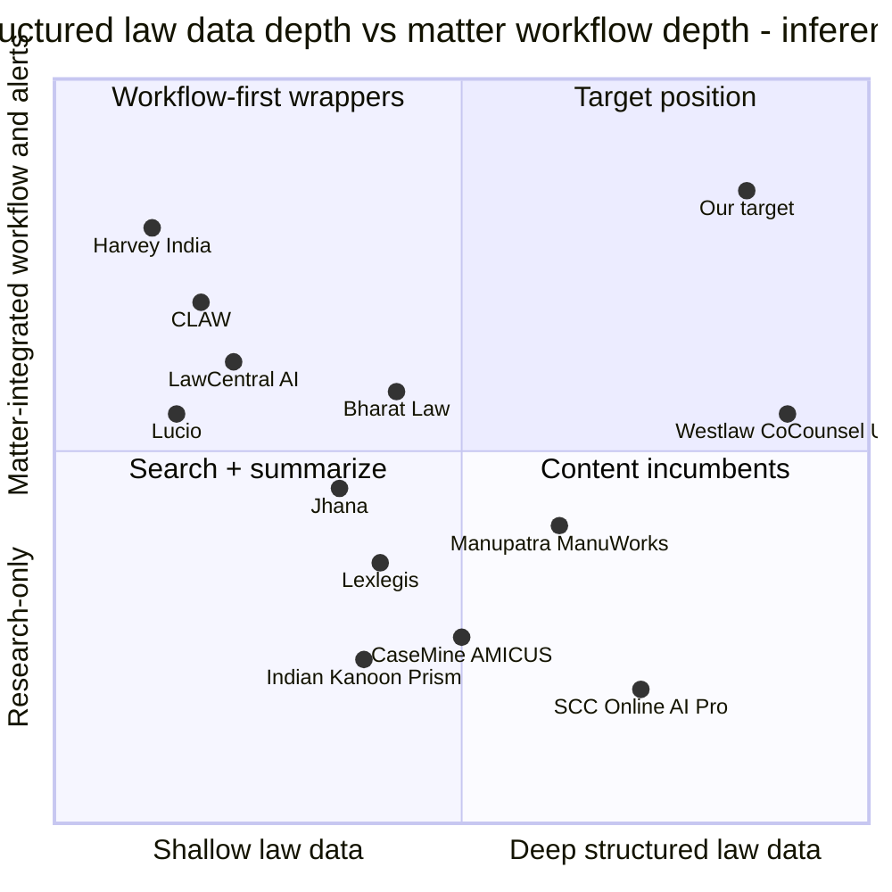

# Competitive Teardown: Indian and Global Legal-AI Platforms (as of 30 Sep 2026)

**Abstract.** This document looks at 20+ legal-AI products that matter to an Indian law-firm buyer in 2026. It asks three questions about each: what it does well, where it fails, and which architectural choices probably explain those failures. It covers Indian research incumbents that have added AI (SCC Online AI Pro, Manupatra AI/ManuWorks, Indian Kanoon Prism, CaseMine AMICUS, LegitQuest), Indian AI-native entrants (Jhana, Bharat.Law, Lexlegis.ai, Lucio, NyaySaathi, CLAW, LawCentral AI), court-side systems (Adalat AI, SUPACE/SUVAS) and global leaders (Harvey, Thomson Reuters CoCounsel/Westlaw, Lexis+ AI/Protégé, vLex Vincent/Clio, Legora, Paxton, Midpage).

Evidence on the Indian products is thin and mostly written by the vendors themselves. No independent evaluation of any Indian legal-AI product was found. The strongest independent evidence is from US tools. The Stanford/Yale preregistered study found that Lexis+ AI and Westlaw AI-Assisted Research hallucinated on 17% and 33% of queries. It traced those errors to naive retrieval, inapplicable authority and reasoning errors [CT-38]. Vals VLAIR (Oct 2025) found that all AI products tested, ChatGPT included, scored within 4 points of each other (74–78%) on US research questions; the legal-AI tools edged ChatGPT overall, mainly on authoritativeness (about +6 points) [CT-39].

Three conclusions follow.
1. Model quality is no longer a differentiator.
2. "Citations retrieved, not generated" is becoming standard in India [CT-16]. It stops fabricated citations but not misgrounded ones.
3. No Indian or global product publicly documents all four of the following:
   - a proposition-level treatment graph for Indian precedent with confidence scores;
   - point-in-time statute resolution, including the IPC→BNS crosswalk;
   - binding-authority reasoning that depends on the forum;
   - propagation from a newly decided case into a firm's active matters.

Those four, together with a partner-firm evaluation flywheel, are the only parts of our design we rate as hard to copy. The biggest single threat is an incumbent content house pairing with a global AI platform, as LexisNexis and Harvey did in the US in June 2025 [CT-34]. Harvey is already deployed firm-wide at two tier-1 Indian firms [CT-26][CT-27], with a reported pilot at a third [CT-20, snippet].

**Spine v1.0 note.** The design implications in §6–§8 use the final spine v1.0 names: `AuthorityView` (not bare AuthorityStatus), the impact broadcast `impact.detected.v1` on `plc.impact.public.v1` matched in each tenant cell by the Impact Matcher, the P9 Privacy Gate, `rights_class`, and the PLC Access API with `PublicResearchQuery` → `PublicEvidenceBundle`. The disposition of each spine change this document proposed is in §7.3.0. In this document "D1–D9" are teardown dimensions (§1.4). Spine decisions are cited as "v1.0 D#", and deployment options as "deployment D1–D4h".

---

## 1. Scope and method

### 1.1 Scope
- **In scope.** Products an Indian firm could buy or use in 2026 for:
  - (a) legal research and citators;
  - (b) drafting, document review and contracts, only where the product also claims Indian-law research;
  - (c) litigation tracking and practice management with AI;
  - (d) court-side AI, as a data and ecosystem signal, not a direct competitor;
  - (e) global platforms operating in India, or setting the architecture pattern Indian buyers will benchmark against.
- **Out of scope.** Pure CLM and contract tools with no Indian-law research (for example SpotDraft, seen in Oct 2025 legal-tech news [CT-54]; not assessed). Consumer legal-help apps. Bloomberg Law was not assessed in depth: we could not verify its current AI features in this pass, and it has no India-specific content.
- **Date of snapshot.** 30 Sep 2026. This market changes monthly. Treat every product fact as dated.

### 1.2 Evidence grades
Each claim carries a reference tag. The reference list grades each source:
- **verified**: we fetched and read it;
- **snippet**: seen only in search results;
- **unverified**: from memory.

On top of that grade, we separate four kinds of claim:

| Label | Meaning | How we use it |
|---|---|---|
| **VC** | Vendor claim, read on the vendor's own page or press release | A fact about positioning. Not proof that the claim is true (for example "zero hallucinations"). |
| **IND** | Independent evidence: peer-reviewed study, benchmark, news report, customer announcement | Main evidence of strengths and failures |
| **COMP** | Written by a competitor (for example Bharat.Law's comparison page) | Treated as biased. Used only as a lead to follow up. |
| **(inference)** | Our architectural reasoning from observable behaviour | Always labelled |

### 1.3 Research limits (stated honestly)
- **No independent Indian evaluation exists** for any Indian legal-AI product, as far as we could find. Every Indian "comparison" we found is vendor-authored or competitor-authored [CT-17]. So Indian "failure" evidence below is mostly structural (what a product cannot do by construction), not measured error rates. Publishing the first credible Indian benchmark is therefore an opportunity for us (§7).
- **User complaints.** Indian user complaints on Reddit, LinkedIn and G2 could not be gathered systematically. The web-search budget ran out mid-research. Global complaint evidence (Harvey) comes from Bloomberg Law reporting [CT-32].
- **Where we could not verify a claim, we say so.** The SCC Online AI Pro price, Harvey's pricing and minimum seats, and the SUPACE/SUVAS status are marked in place. The Buckeye Trust recall was confirmed in the independent review from a Karnataka High Court order [CT-56] (§3.22).

### 1.4 Teardown lens: nine architectural dimensions
Each product is scored against the capabilities our spine makes mandatory, so the teardown maps directly onto phases:

| Dim | Capability | Spine / phase |
|---|---|---|
| D1 | Official-source provenance and daily freshness | P0, `raw.captured.v1` |
| D2 | Paragraph-level anchors: click-to-source at the level of a numbered paragraph | P1, §C anchors |
| D3 | Typed treatment / citator (followed, distinguished, overruled…), ideally at proposition level | P3, `Assertion`, `AuthorityView` (v1.0 D6) |
| D4 | Point-in-time statutes and the IPC/CrPC/IEA → BNS/BNSS/BSA crosswalk | P3/P4, §E time model |
| D5 | Retrieval depth: issue decomposition, agentic multi-step, authority-aware ranking | P5 |
| D6 | Verification layer: existence check vs. semantic support check | P8 |
| D7 | Private matter layer linked to public law, with alerts | P7 Impact Matcher, P4 `impact.detected.v1` broadcast (v1.0 D3) |
| D8 | Deployment and compliance: VPC/on-prem, residency, certifications | P7, cross-cutting (deployments D1–D4h, v1.0 D17) |
| D9 | Published evaluation | P8 |

*Label note:* D1–D9 above are teardown dimensions. They are not spine v1.0 decisions ("v1.0 D#") or deployment names ("deployment D1–D4h", doc 13 §9).

---

## 2. Market map

### 2.1 Segments

| Segment | Players (India) | Players (global, active in India or setting the pattern) | What they own | What they lack (inference unless tagged) |
|---|---|---|---|---|
| **A. Research incumbents + AI overlay** | SCC Online AI Pro [CT-1], Manupatra AI Search / ManuWorks [CT-4][CT-5], Indian Kanoon Prism [CT-7], CaseMine AMICUS/CaseIQ [CT-9][CT-10], LegitQuest research [CT-12] | Westlaw/CoCounsel [CT-36], Lexis+ AI/Protégé [CT-35], vLex Vincent [CT-42], Midpage [CT-46] | Corpus, editorial metadata, installed base | Matter layer; machine-verifiable anchors; published evals |
| **B. AI-native research + drafting (India)** | Bharat.Law [CT-16], Jhana [CT-13], Lexlegis.ai [CT-18], NyaySaathi [CT-21], LawCentral AI [CT-23] | — | Product speed, UX, price | Curated treatment data; coverage depth (e.g. Bharat.Law's homepage names 6 High Courts [CT-16]) |
| **C. AI workspaces (transactional-first)** | Lucio [CT-19] | Harvey [CT-26][CT-29], Legora [CT-44], Paxton [CT-45] | Drafting / review workflow, firm adoption | Indian primary law and citator (none announced for India) |
| **D. Litigation tracking + practice management** | CLAW [CT-22], LegitQuest Patrol/LIBIL [CT-12], Bharat.Law India Courts [CT-16], LawCentral [CT-23] | Clio (+vLex) [CT-41] | Matter data, cause lists, alerts, switching costs | Deep law intelligence; treatment; reasoning |
| **E. Court-side (government / judiciary)** | Adalat AI [CT-24][CT-25], Jhana court automation [CT-13], SUPACE/SUVAS [CT-52, unverified] | — | Judge-side workflows; future digitised records | Not sold to firms. Ecosystem and data signal only. |
| **F. Foundation-model and data-API layer** | — | Anthropic (legal plugins for Claude Cowork, 3 Feb 2026 [CT-44]); Midpage inside Claude/ChatGPT/Perplexity [CT-46]; Vaquill MCP (US-only) [CT-47]; LexisNexis content inside Harvey [CT-34] | Distribution at the assistant layer | Jurisdiction-specific curated data (which they license from others) |

### 2.2 Positioning map (inference, from the evidence in §3)



How to read the map:
- **Bottom right (content incumbents).** Indian content incumbents own the structured data but have no documented matter layer.
- **Top left (workflow-first).** Workflow players such as Harvey, CLAW and LawCentral own the firm's working context but not curated Indian law.
- **Top right.** Nobody in India occupies it with public evidence. The US analogue is Westlaw/CoCounsel, which combines KeyCite with agentic Deep Research [CT-36][CT-37]. Clio+vLex is converging on it from the practice-management side [CT-41].

### 2.3 Market signals that matter for architecture
1. **Tier-1 Indian firms have chosen a global workspace for transactional work.**
   - Shardul Amarchand Mangaldas: firm-wide Harvey across 7 offices (4 Jun 2025), after a year-long evaluation of Indian and international tools [CT-26].
   - AZB & Partners: all offices (10 Sep 2025) [CT-27].
   - Cyril Amarchand Mangaldas: piloting Harvey alongside Lucio [CT-20].
   - Announced use cases: AZB names document review and translation [CT-27]. SAM names drafting and due diligence, **and also "legal research and predictive analysis" and insights for "contentious and advisory matters"** [CT-26]. *(Corrected in the independent review: an earlier draft said no firm named litigation research.)*
   - (inference) Harvey is therefore already *positioned* for research and contentious work at SAM, but no Indian primary-law or citator content partner has been announced (§3.15). The Indian-law **grounding** layer (typed treatment, point-in-time statutes, forum-aware binding) at tier-1 firms is still contested. That layer, not "research" in general, is the wedge.
2. **Incumbents moved late.**
   - SCC Online AI Pro was announced on 26 Jan 2026 as "coming soon" [CT-1] and demoed in April 2026 [CT-2].
   - Manupatra's AI Search appeared by Dec 2025 [CT-4].
   - They are now shipping, and they own the data and the distribution.
3. **The global market is converging on "matter + law" platforms.**
   - Clio's $1B purchase of vLex (closed 10 Nov 2025) [CT-41].
   - LexisNexis licensing content and Shepard's into Harvey [CT-34].
   - Paxton's pitch that matter record, research and work product "live in separate workflows" [CT-45].
   - All three support our P7+P3+P4 thesis. They also show that a well-funded player can assemble the same shape through M&A.
4. **The assistant layer is eating the UI.**
   - Midpage ships its case law and citator inside Claude, ChatGPT and Perplexity, and sells itself as a "legal data supplier" [CT-46].
   - Vaquill exposes US primary law over MCP [CT-47].
   - Anthropic's legal plugins for Claude Cowork (3 Feb 2026: contract review, compliance workflows, legal briefings) turned a model supplier into a competitor of Legora. Implicator reports Thomson Reuters stock fell 16% and RELX 15% in a single day [CT-44, secondary].
   - (inference) Whoever owns the verified, structured Indian-law layer can sell through every assistant. Whoever owns only a chat UI is exposed.

---

## 3. Per-competitor teardown

Every entry uses the same five headings:
- **Facts**: tagged, with VC/IND/COMP grade.
- **Does well.**
- **Fails / gaps**: with evidence.
- **Probable architectural cause**: labelled (inference).
- **Threat to us / what we borrow.**

A dimension scorecard follows in §3.23.

### 3.1 SCC Online AI Pro (EBC / SCC Online), India

**Facts**
- Announced 26 Jan 2026 (Republic Day) as "coming soon" [CT-1, VC].
- Described as "grounded in SCC Online's authoritative legal database", with "clear references to relevant cases, statutes and SCC Online curated material" [CT-1, VC].
- Positioned as "human-led, AI-assisted" and aimed at research, advisory, transactional work, due diligence and regulatory compliance [CT-1, VC].
- The April 2026 webinar demo showed natural-language queries, answers structured as issues → applicable law → analysis → conclusion, and hyperlinked case law and statutory references [CT-2, VC].
- The demo write-up does not mention document upload, languages, limits or pricing [CT-2].
- Microsoft's "AI First Movers" case study says SCC Online built a "conversational agentic generative AI platform" on Azure AI Foundry, the Agent SDK, Cosmos DB, Azure AI Search and Document Intelligence [CT-3, IND-ish: vendor-partner case study].
- **Price is unverified.** A search snippet (a competitor page) gave ₹48,500/user/year + GST as a separate add-on. The fetched page did not contain it [CT-55, unverified].

**Does well**
- The strongest editorial corpus in Indian law. SCC is the reporter most cited for Supreme Court judgments.
- Brand trust among litigators.
- A structured answer format that mirrors how a legal memo is laid out [CT-2].
- Grounding is limited to its own curated corpus [CT-1], so it avoids open-web contamination. Contrast Protégé General AI, which deliberately blends in open-web data [CT-35].

**Fails / gaps**
- Late to market. The AI arrived about 2.5 years after CaseMine AMICUS (Jul 2023) [CT-9].
- No public evaluation.
- No documented paragraph-level verification.
- No documented matter or private-document layer in the demo [CT-2].
- No documented point-in-time statute answering or treatment-aware ranking. Absence of evidence, not evidence of absence.
- Sold as an add-on, which splits the user base between AI and non-AI seats (inference).

**Probable architectural cause (inference)**
- The Azure stack [CT-3] points to a standard enterprise RAG pattern: Azure AI Search (hybrid BM25 + vector + semantic reranker) over chunks, orchestrated by agents.
- That pattern works well on single-issue questions. It tends to show the Stanford failure modes, naive retrieval and inapplicable authority [CT-38], unless SCC's editorial treatment data is wired into ranking as a hard signal.
- Their editorial layer is human-authored prose (notes, headnotes), not a machine-typed graph with confidence scores. Converting it is feasible but slow.

**Threat / borrow**
- **Threat: highest in research.** SCC owns the citation the market writes, "(2017) 10 SCC 1", and the users' habits. (Our P1 must resolve SCC citations as identifiers only: spine §D.)
- Any SCC–Harvey-style content alliance would be the most dangerous move in the market (§6.4).
- **Borrow:** the issues → law → analysis → conclusion output skeleton, which lawyers already accept.

### 3.2 Manupatra AI Search and ManuWorks, India

**Facts**
- A sponsored Bar & Bench piece (18 Dec 2025) describes Manupatra AI Search. It claims a corpus "connected through citations and judicial treatment", can show whether judgments "have been overruled or distinguished", and provides "AI analysis of the 10 most relevant results" [CT-4, VC].
- ManuWorks is described as:
  - an agentic workspace with 240+ purpose-built agents;
  - task assistants for drafting, summarisation, comparison, OCR, translation, timeline extraction and evidence Q&A;
  - tabular (matrix) document review;
  - source-linked outputs with activity logs;
  - a cloud workspace for firms from 20 to 500+ lawyers [CT-5, VC via Legal Technology Hub (LTH)].
- A search snippet claimed SOC 2 Type II, AES-256 and zero retention [snippet only].
- CEO Deepak Kapoor's sponsored Artificial Lawyer piece (2 Apr 2026) argues generic AI fails in India through hallucinated citations, stale law, and not understanding court hierarchy and conflicting precedents [CT-6, VC].

**Does well**
- 25 years of curated metadata: citations, judicial history, cross-references [CT-4].
- The broadest workflow toolset among Indian incumbents [CT-5].
- Explicitly treatment-aware positioning [CT-4].

**Fails / gaps**
- "AI analysis of the 10 most relevant results" [CT-4] is a **search-then-summarise** design. The answer can never be better than top-10 recall. That is the exact failure the Stanford study calls naive retrieval: 47% of Lexis+ AI hallucinations [CT-38].
- A multi-issue notice (limitation + jurisdiction + merits) cannot be covered by ten hits on one query (inference).
- No public pricing, no public evaluation, and only sponsored content.

**Probable architectural cause (inference)**
- An AI layer bolted onto an existing search engine: query → existing ranker → top-k → LLM.
- No issue decomposition and no per-issue coverage accounting.
- "240+ agents" suggests many narrow prompt-chains. Grounding and verification behaviour will vary between agents unless there is one shared verifier, and none is documented. Agent count is a marketing metric, not a quality metric.

**Threat / borrow**
- **Threat: high.** Treatment metadata already exists, the firm install base is large, and ManuWorks already covers the workspace.
- **Borrow:** tabular multi-document review, which lawyers like, and activity logs as a trust feature.
- **Avoid:** a fixed top-k window. P5 must decompose issues and report per-issue `coverage{binding_found, adverse_found, gaps}` (spine §H).

### 3.3 Indian Kanoon Prism, India

**Facts**
- Plans [CT-7, VC]:
  - Free ₹0 ("few Prism credits");
  - Premium ₹5,000/yr + GST (20× credits, 250 court copies/month, 25 alerts, 500 MB);
  - Pro ₹15,000/yr + GST (100× credits, 1,000 copies/month, 100 alerts, 2 GB).
- Credits are "dynamic currency that is usage dependent" [CT-7].
- Tools on all tiers: Know Your Kanoon (research chat), Talk with IK-doc, DocGen Hub, Comparison & Review, Upload and Chat, Case Predict AI, Counter Argument Generator, Moot Court Simulation, Study Buddy [CT-7].
- IK's own training content tells users to "identify inaccuracies, avoid over-reliance, and apply proper verification techniques" [CT-8, VC].
- IK search exposes untyped citation counts, e.g. "cited in 101 documents" for EBC v. D.B. Modak [CT-49].

**Does well**
- Largest free, open-access Indian corpus and default habit for students and litigators.
- Lowest price of entry [CT-7].
- A citation graph ("cites / cited by").
- Advocacy-oriented tools such as the counter-argument generator, which is in the same direction as our P6 opposing-counsel agent.

**Fails / gaps**
- The citation graph is **untyped** as surfaced: counts, not followed/overruled (inference from the search UI [CT-49]). So "is this still good law?" cannot be answered by construction.
- Case outcome prediction on public judgments has known selection bias, because published judgments are not a random sample of disputes (inference).
- Credits are opaque [CT-7].
- A competitor claims "citation reliability concerns" at the free tier [CT-17, COMP, biased].

**Probable architectural cause (inference)**
- A raw court-text corpus with light metadata, a lexical engine, and an LLM layer.
- No editorial treatment layer and no statute versioning.
- Breadth over depth.

**Threat / borrow**
- **Threat: medium.** Price anchor and habit, especially for small firms. Weak on trust at the firm level.
- **Borrow:** the `cites/cited-by` graph as a cheap `CITES` prior for P3, and the counter-argument framing.
- **Watch:** LawCentral AI verifies citations *against Indian Kanoon* [CT-23]. IK is becoming infrastructure for others.

### 3.4 CaseMine (AMICUS, AMICUS Advanced, CaseIQ), India

**Facts**
- AMICUS launched 18 Jul 2023 (sponsored), claiming to be the "first-of-its-kind generative AI system in India", citing sources, covering India/US/UK [CT-9, VC].
- AMICUS AI – Advanced launched 10 Mar 2026. It was evaluated internally across five task categories (research, document analysis, drafting, issue spotting, complex reasoning) and claims "the strongest performance of any model deployed on the platform" [CT-10, VC].
- CaseIQ: upload a petition, brief or order and retrieve relevant precedents and statutes [CT-11, snippet].
- A competitor claims pricing of USD 499–1,499.99/yr and a 100 MB document cap [CT-17, COMP].

**Does well**
- First mover in Indian generative legal AI.
- **Document-as-query** (CaseIQ): this is the correct interaction model for "a notice arrives" and is close to our P6 entry point.
- Multi-jurisdiction common-law coverage.

**Fails / gaps**
- Self-evaluation only; no published method or numbers [CT-10].
- No documented typed-treatment or temporal statute capability found.
- Sponsored-only communications.

**Probable architectural cause (inference)**
- Document-as-query is probably embedding-similarity retrieval ("conceptually relevant" [CT-11]).
- That finds *similar-sounding* cases, not *binding* ones. It is the same gap the brief names: "a legally coherent bundle rather than similar-sounding text".

**Threat / borrow**
- **Threat: medium.**
- **Borrow:** document-as-query UX.
- **Fix:** add forum-aware binding (`binding_on_forum`) and treatment status to its similarity results.

### 3.5 LegitQuest (LIBIL, Patrol, research), India

**Facts**
- LIBIL litigation intelligence: 500M+ legal records, 10,000+ courts and tribunals, 35M companies, 500,000+ new records daily [CT-12, VC].
- Also: Patrol case management with a Gen-AI assistant and alerts; a research database from 1837 onward; the iDraf drafting tool [CT-12].
- Customers named: Accenture, TCS, Amazon.in, Tata Power, plus the Delhi High Court and EPFO. Certifications: ISO 9001:2015, ISO/IEC 20000-1:2018, ISO 27001:2022 [CT-12, VC; re-fetched 30 Sep 2026].

**Does well**
- The deepest *docket/party-level* data of any Indian player we found. It is the nearest analogue to our P0 district-court and eCourts ingestion.
- Productised diligence reports (IPO, FIR checks).

**Fails / gaps**
- AI is described only generically [CT-12].
- The product is focused on diligence and KYC, not strategic litigation reasoning.
- A competitor says it is "over-engineered for litigation" [CT-17, COMP].

**Probable architectural cause (inference)**
- The data model is built around *parties and cases* (for risk checks), not *legal propositions*.

**Threat / borrow**
- **Threat: low–medium** for our core. **High** as a potential data partner or acquirer.
- **Borrow:** its daily-volume ingestion discipline (500k/day claim) as a P0 benchmark.

### 3.6 Jhana ("Neoeconomica by jhana"), India

**Facts**
- Founded 2022, Bengaluru, by three Harvard graduates [CT-50, snippet]. $1.6M seed in Sep 2024, led by Together Fund [CT-14, snippet].
- An earlier product profile [CT-15, snippet] lists:
  - a 16M+ document archive;
  - "Searcher", which runs parallel semantic and Boolean search and auto-detects contradictions or outdated citations;
  - a "Paralegal" agent for arguments, chronologies and risk assessments.
- By Sep 2026 the homepage presents "Neoeconomica by jhana" with [CT-13, VC]:
  - AI-first legal practice management;
  - court automation "filing to judgment" for governments and courts;
  - AI audit services;
  - a lawyer-matching service;
  - a judge dashboard.
- It also claims 650+ judges, the High Courts of Karnataka, Madras, Telangana and Gujarat, 16,150+ lawyers, and 5M+ pages processed weekly [CT-13, VC].

**Does well**
- Court-side penetration, which gives access to real judicial workflows.
- Hybrid semantic + Boolean retrieval, which is the right baseline.
- "Outdated citation" detection as a design goal [CT-15].

**Fails / gaps**
- Small capital base relative to scope [CT-14].
- The Sep 2026 homepage lists five disparate businesses [CT-13]. (inference) That spreads focus away from a deep firm-side research product. It may be a pivot.

**Probable architectural cause (inference)**
- A services-plus-platform model. Depth of the treatment layer is unknown.

**Threat / borrow**
- **Threat: medium** (courts channel).
- **Borrow:** parallel lexical + semantic search; outdated-citation flags.
- **Partnership signal:** court automation will produce cleaner structured orders in future (a P0 source).

### 3.7 Bharat.Law, India

**Facts** [CT-16, VC]
- NyaI™ Research, which claims:
  - "Every claim traces back to a statute, section, or judgment paragraph";
  - "citations are retrieved from the source record, not generated";
  - "0 Fabricated citations — Source-grounded by construction" (homepage "By the numbers").
- Document Intelligence for bundles of 10,000+ pages.
- "India Courts" matter tracking across 15,000+ courts, by case number or CNR, with daily digests and cause-list alerts.
- A Case Workspace.
- Coverage: the homepage names the Supreme Court, **six High Courts** (Bombay, Delhi, Madras, Karnataka, Gauhati, Calcutta), NCLAT and NCDRC for research, and "15,000+ Indian courts integrated" for tracking; 10M+ documents processed. *(Independent review, 30 Sep 2026 re-fetch: an earlier draft recorded "7 High Courts"; the page gives no numeric count.)*
- It also publishes a competitor comparison page (see §5) [CT-17, COMP].

**Does well**
- The closest public statement of our own thesis: paragraph-level provenance plus matter tracking plus a workspace.
- Retrieval-constrained citations remove *fabricated* citations.

**Fails / gaps**
- "Retrieved, not generated" does **not** stop *misgrounding*: a real paragraph cited for a proposition it does not support. Stanford counts misgrounding as hallucination [CT-38].
- No public evidence of typed treatment (overruled, per incuriam), forum-aware binding, or point-in-time statutes.
- Research coverage naming 6 of 25 High Courts [CT-16] is a real gap for litigators outside those states. The 15,000-court claim is for docket tracking, not the research corpus.
- Its "zero fabricated citations" claim is a construction guarantee about *existence*, not *support*.

**Probable architectural cause (inference)**
- Citation-constrained decoding or post-hoc linking to retrieved chunks gives an existence guarantee.
- There is no entailment verifier and no treatment graph.

**Threat / borrow**
- **Threat: medium–high.** Same thesis, fast product, freemium.
- **Borrow:** the "by construction" framing for marketing.
- **Our differentiator:** a support check (P8 entailment against the cited anchor) plus `AuthorityView` badges (v1.0 D6).

### 3.8 Lexlegis.ai, India

**Facts** [CT-18, VC]
- Modules: Ask (research with "shepardised citations"), Interact (document analysis) and Draft. Claims 215 skills in 24 groups and 15+ jurisdictions.
- Published per-user pricing:
  - Starter ₹9,000/month or ₹86,400/yr;
  - Pro ₹12,000/month or ₹1,15,200/yr;
  - Enterprise ₹1,92,000/yr;
  - Enterprise Plus ₹2,88,000/yr.
- Deployment in five modes: managed SaaS, VPC on L&T Vyoma sovereign cloud, VPC on AWS/Azure/GCP, air-gapped on NVIDIA DGX, and full on-premises.
- Compliance badges: ISO/IEC 27001, SOC 2, GDPR, CCPA and "DPDP – India Data Protection" (no certifying body or report named).
- Customers named: KPMG, Dhruva Advisors, Greaves Crompton, Thermax, Aurtus, MyGate, Artha Energy.
- Reliability claim: "Our system is grounded in structured legal data. Responses are generated from validated sources, not speculative patterns", framed as "deterministic outcomes" from proprietary data, fine-tuned models, predefined skills and end-to-end verification. *(Independent review: the literal "no hallucinations" wording recorded in an earlier draft was not found on the 30 Sep 2026 re-fetch.)*

**Does well**
- Proves that Indian enterprise and tax buyers will pay ₹1–3 lakh per seat per year [CT-18].
- Proves that on-prem and air-gapped demand is real enough to productise.
- Tax and advisory focus.

**Fails / gaps**
- Near-absolute reliability framing ("deterministic", "not speculative") has been disproved for far better-resourced products [CT-38].
- A "DPDP" badge placed beside ISO and SOC 2 implies a certification. We know of no vendor-certification scheme under the DPDP Act (inference; to be verified in doc 13).
- No public evaluation.

**Threat / borrow**
- **Threat: medium** in the tax/enterprise segment.
- **Borrow:** the published tiered deployment menu. It supports making P7's deployment options (SaaS / VPC / on-prem; deployments D1–D4h under spine v1.0 D17) a Day-1 contract, not a later add-on.

### 3.9 Lucio, India → global

**Facts**
- An "AI-native legal workspace built by lawyers". $5M led by DeVC (announced Oct 2025).
- 200+ organisations, 3,000+ lawyers, 9 jurisdictions.
- Used for drafting, large-document review, due diligence, research and translation [CT-19, snippet].
- Cyril Amarchand Mangaldas uses Lucio alongside a Harvey pilot [CT-20, snippet]; Z47 (a VC firm) adopted it [CT-19].

**Does well**
- An Indian-built Harvey alternative that has won a tier-1 firm; workflow-first.

**Fails / gaps**
- No public Indian primary-law citator or treatment layer found.
- Research depth depends on external databases. Its funding news mentions building "more integrations with legal databases" [CT-19].

**Threat / borrow**
- **Threat: medium** for firm workspace budgets.
- **Opportunity:** Lucio and Harvey are *integration targets* for our PLC Access API / MCP (§7; spine v1.0 D13).

### 3.10 NyaySaathi, India
- **Facts:** Noida-based. Daily judgment updates with AI Q&A; research across acts, sections, judgments and notifications; AI draft analysis for compliance and issue spotting; document generation; a mobile app with a free trial [CT-21, VC].
- **Assessment (inference):** a small-practice tool. No evidence of a treatment graph, temporal statutes or firm-grade deployment.
- **Threat:** low for B2B multi-seat firms.

### 3.11 CLAW (clawlaw.in), India
- **Facts:** "All-in-one legal case management & litigation software for India" [CT-22, VC]:
  - tracks SC, HC, district courts and "8,200+ tribunals";
  - "AI-powered judgment search across 30 crore+ cases";
  - automated cause lists and WhatsApp alerts;
  - invoicing and client dashboards.
- **Does well:** owns the daily habit (cause list, hearing alerts) and the matter data. This is the switching-cost layer.
- **Gaps (inference):**
  - "30 crore+ cases" is overwhelmingly docket metadata and orders, not a curated judgment corpus.
  - No documented reasoning, treatment or verification.
- **Threat:** medium as a channel owner in solo and small firms.
- **Borrow:** the WhatsApp alert channel (P10). Indian litigators live there.

### 3.12 LawCentral AI, India
- **Facts** [CT-23, VC]:
  - An agent named "Nyra" for research, drafting, matter workspace, cause-list alerts, "hearing window predictions", intake and conflict checks.
  - Research answers "cited and checked" against Indian Kanoon, with a self-reported "95% citation accuracy".
  - Ten Indian languages for document scanning/OCR (English, Hindi, Marathi, Bengali, Tamil, Telugu, Kannada, Malayalam, Gujarati, Punjabi).
  - Claims 500+ firms and 10,000+ advocates.
  - Starter ₹1,000/month (12,000 credits), Pro ₹4,900/month (40,000 credits), Team custom.
  - 18,800+ Acts; case law "across 25 High Courts" plus Supreme and district courts (claim).
- **Does well:** price, breadth for solos, multilingual claim.
- **Gaps:**
  - Verification against a third-party corpus [CT-23] is an existence check that inherits IK's lack of typed treatment (inference).
  - Its trust ceiling is set by someone else's data.
  - By its own number, about 1 citation in 20 is wrong, and no method is published (inference from the 95% claim [CT-23]).
- **Threat:** low–medium (solo segment).

### 3.13 Court-side systems: Adalat AI, SUPACE, SUVAS
- **Adalat AI** [CT-24, VC]:
  - real-time transcription, case-flow management, OCR/document automation, litigant chatbots, judicial research and summarisation;
  - "11 partner states", "6,000+ judges", "20–25% courtroom coverage";
  - serves judges and court staff, not firms.
  - By a memorandum dated 27 Sep 2025, the Kerala High Court directed all trial courts to record depositions primarily with Adalat AI's Malayalam/English legal speech model from 1 Nov 2025. This followed a pilot in four Ernakulam trial courts from 1 Feb 2025 [CT-25]. An earlier report said 4,000+ courtrooms in 9 states [CT-51, snippet].
- **SUPACE** (Supreme Court research assistant, 2021) and **SUVAS** (translation of judgments into regional languages, 2019): *(unverified: from memory; current status not confirmed in this pass)* [CT-52].
- **Implication:**
  - Not competitors.
  - They will change the *inputs* (more machine-readable depositions and orders, more vernacular translations) and the *norms*. Courts are writing AI-use policies; the Kerala HC district-judiciary AI policy of July 2025 is *(unverified)* [CT-53].
  - P0 should monitor them as future sources. P1 must accept official translations as `Expression`s with `lang` keys.

### 3.14 Others noted
- **Vaquill**: a US-only primary-law API (REST, MCP, SQL, vector) with point-in-time snapshots [CT-47, VC]. Its site also publishes India-alternative comparison pages, seen in search results; reliability low. It matters as a *pattern*: legal data sold as an assistant-layer API.
- **BharatLaw.ai**: a different product from Bharat.Law, per Bharat.Law's own page [CT-17]. Not assessed.

### 3.15 Harvey (global; in India since 2025)

**Facts**
- Indian deployments:
  - SAM firm-wide across 7 offices (4 Jun 2025), after a year-long evaluation, with governance protocols for privilege and human oversight. Named uses: drafting, due diligence, legal research and predictive analysis, contentious and advisory matters [CT-26, IND];
  - AZB & Partners, all offices (10 Sep 2025), for document review and translation [CT-27, IND];
  - Cyril Amarchand Mangaldas, pilot [CT-20, snippet].
- A Bengaluru office for engineering, sales and operations was announced 10 Jul 2025. It named PwC, SAM and S&A Law Offices as Indian partners [CT-28, snippet].
- $200M at an $11B valuation (25 Mar 2026) with ">25,000 custom agents" running on the platform [CT-29, VC].
- $550M at $15.5B (9 Sep 2026), alongside "Harvey Tenet", its first post-trained open-weight model (Kimi K3 base, RL post-training on about 1,750 legal task environments), and "Harvey LAB", a Legal Agent Benchmark open-sourced in May 2026 (1,200+ agent tasks, 24 practice areas, 75,000+ expert rubric criteria) [CT-30].
- LexisNexis alliance (18 Jun 2025): Protégé answers inside Harvey grounded in LexisNexis U.S. case law and statutes, plus Shepard's Citations [CT-34].
- ARR: $195M at end-2025 and $300M in May 2026, per Sacra [CT-31, snippet, unverified].
- Pricing: $1,200–2,000+/user/month with a ~25-seat, 12-month floor, per a competitor blog [CT-33, COMP, unverified].

**Does well**
- Enterprise trust, security posture and change management; the chosen tool at India's largest firms.
- A fast agent/workflow builder.
- Licenses authoritative content instead of rebuilding it [CT-34].

**Fails / gaps**
- Critics describe the tech as "mostly legal packaging for large language models" [CT-32, IND reporting of critics].
- A former employee's Reddit post in late Sep 2025 alleged low lawyer usage. The CEO replied with 98% recurring revenue and 77% seat utilisation [CT-32].
- Surveys cited in the same report find AI tools "aren't yet leading to fewer lawyers or dramatically less time" [CT-32].
- **India-specific:** no Indian primary-law or citator partnership was found in our research. AZB's announcement emphasises review and translation [CT-27]. SAM's also names legal research and contentious matters [CT-26]. Without an Indian content partner, those uses must rest on model priors, uploaded documents and the web (inference).

**Probable architectural cause (inference)**
- A general agent platform over frontier models plus licensed content.
- In the US, grounding quality is outsourced to Lexis/Shepard's.
- In India there is no equivalent content partner yet, so Indian-law answers rely on the model's priors plus uploaded documents plus web.

**Threat / borrow**
- **Threat: very high if Harvey signs an Indian content partner (SCC or Manupatra).**
- **Opportunity if we become that partner** (§6.4, §7).
- **Borrow:** firm-wide change management; firm-defined custom workflows.

### 3.16 Thomson Reuters: Westlaw, CoCounsel Legal, Deep Research (global)

**Facts**
- CoCounsel Legal with Deep Research launched 5 Aug 2025 [CT-36]. A 13 Aug 2025 launch date for Westlaw Advantage is *(unverified)*: the press release says only that Deep Research on Westlaw Advantage is integrated into CoCounsel Legal.
- Deep Research generates multi-step research plans, "traces its logic with transparent reasoning" and delivers structured reports with Westlaw and Practical Law citations [CT-36]. KeyCite flags in the output and the ≈10-minute run time ("approximately 10 minutes to complete and verify") come from the secondary engineering summary [CT-37].
- Engineering disclosures [CT-37, secondary summary of a TR talk]:
  - agents specialised by document type (cases, statutes, secondary sources);
  - Westlaw features exposed as agent tools;
  - evaluation by editorial rubrics plus evaluator models calibrated to human judgment plus heavy manual review;
  - the lessons that stopping criteria are hard and context limits bite.
- Stanford: Westlaw AI-Assisted Research answered 41% accurately and hallucinated 33% (v1 preprint; a 42% figure attributed to the JELS version is *(unverified)*). It had the longest answers (≈350 words), and 61% of its hallucinations were reasoning errors [CT-38, IND].

**Does well**
- KeyCite inline in AI output: the pattern our `AuthorityView` badges must copy.
- Agentic planning.
- Editorial rubric evaluation.

**Fails / gaps**
- Pre-agentic AI-AR had a high hallucination rate [CT-38].
- Longer answers carry more claims that can be wrong [CT-38]. Latency is about 10 min [CT-37].

**Architectural cause (partly documented)**
- Single-pass RAG with an LLM synthesising long answers produced reasoning errors. TR's move to agentic plan-execute plus citator flags is its correction [CT-37].

**Borrow**
- Specialisation by document type.
- Citator flags inline.
- Rubrics authored by editors or lawyers (our partner firm).
- Explicit stopping criteria in P6.

### 3.17 LexisNexis: Lexis+ AI and Protégé (global)

**Facts**
- Stanford: Lexis+ AI was 65% accurate, 17% hallucinated and 18% incomplete. Among its hallucinations, naive retrieval accounted for 47%, inapplicable authority 38%, reasoning errors 28% and sycophancy 6% [CT-38, IND].
- Protégé General AI (preview Aug 2025, commercial release Oct 2025, next generation 10 Dec 2025) [CT-35]:
  - multi-model with a "Best Fit" mode (Claude Sonnet 4.5, Claude Sonnet 4, GPT-5.1, GPT-5, GPT-4o, o3);
  - Orchestrator, Legal Research, Web Search and Customer Document Research agents; users choose which sources (own documents, open web, LexisNexis content) are blended;
  - a **Shepard's Citation Agent** that verifies and links any citation the models emit.
- The Harvey alliance cites "Shepard's Knowledge Graph and Point of Law Graph" [CT-34].

**Does well**
- Post-hoc citator verification of every citation.
- A model-agnostic router.
- A knowledge graph behind grounding.

**Fails / gaps**
- Naive retrieval and inapplicable authority dominate its measured hallucinations [CT-38].
- Blending open-web content into legal answers [CT-35] increases the provenance risk surface (inference).

**Borrow**
- The citation-agent pattern: already P8.
- The model router: already the spine's Model Gateway.
- The "Point of Law" idea is analogous to our `Proposition` node, which validates the spine's proposition-level design.

### 3.18 vLex Vincent AI (now Clio)

**Facts**
- Clio completed its $1B acquisition of vLex on 10 Nov 2025 with a $500M Series G at $5B; vLex claims 1B+ documents [CT-41, snippet].
- Vincent offers 20+ pre-built workflows (research, 50-state surveys, jurisdiction comparison, complaint analysis, judge/lawyer profiles) across 100+ countries; **India is not listed** among the named jurisdictions [CT-42, VC].

**Does well**
- Guided workflows instead of open prompts.
- Litigation-intelligence profiles.
- Convergence with practice management through Clio.

**Gap for India**
- No evident Indian depth [CT-42].

**Borrow**
- Workflow templates such as the jurisdiction comparison. The Indian analogue is a cross-High-Court comparison ("how do the Bombay vs Delhi HCs treat X"), which is P5/P6 work.

### 3.19 Legora (global)

**Facts**
- Funding reported at $5.55–5.6B (Series D, Mar/Apr 2026) [CT-43, snippet].
- Revenue figures conflict: $100M ARR in Apr 2026 per Sacra [CT-43, snippet] vs "$600M in six months on $23M in revenue" as of Feb 2026 per Implicator [CT-44]. Treat both as unverified.
- Built on Anthropic's Claude with no proprietary foundation model; ships as a Word sidebar [CT-44, secondary].
- Implicator reports Anthropic released legal plugins for Claude Cowork (contract review, compliance workflows, legal briefings) on 3 Feb 2026 [CT-44].

**Does well**
- Collaboration.
- Word-native UX, which meets lawyers where they draft.

**Fails / risk**
- Supplier–competitor dependency [CT-44].
- No jurisdiction-specific data moat (inference).

**Borrow**
- A Word add-in as a P10 surface.
- **Lesson:** do not let the model supplier be the product; the spine's Model Gateway is right.

### 3.20 Paxton and Midpage (US challengers)
- **Paxton** [CT-45, VC]:
  - states the core problem as "the matter record, legal research, and final work product still live in separate workflows";
  - syncs two ways with the document management system (DMS), Outlook, Word and Claude;
  - SOC 2 / HIPAA; claims 30,000+ attorneys.
  - This is our P7↔P5 thesis, arrived at independently.
- **Midpage** [CT-46, VC]:
  - a citator with negative/caution/neutral treatment signals;
  - "new cases appear within hours";
  - delivered inside Claude, ChatGPT and Perplexity;
  - acts as a "legal data supplier" to five multibillion-dollar organisations;
  - SOC 2 Type II.
  - In VLAIR (Oct 2025) it had 3 no-response failures [CT-39].
- **Lesson:** a small team with a clean corpus and citator can distribute through frontier assistants. The data layer is the product. Reliability (no-response failures) is judged publicly.

### 3.21 Foundation-model providers
- Harvey's move to a post-trained open-weight model ("Tenet", on a Kimi K3 base) [CT-30], and Anthropic's legal plugins for Claude Cowork [CT-44], point in one direction (inference): models are commoditising toward parity on generic legal reasoning.
- VLAIR puts all AI products, ChatGPT included, within 74–78% on US research. ChatGPT scored 80% on the accuracy criterion; legal AI led by about 6 points only on authoritativeness [CT-39].
- **Implication for India:** general models will close the Indian-law reasoning gap. What they cannot do by themselves:
  - resolve Indian citations to canonical Works;
  - know treatment status as of a date;
  - know which statute version applied on the cause-of-action date;
  - know which High Court binds which forum.
- Those are data-and-graph problems, not model problems.

### 3.22 Benchmarks as competitive evidence
- **Stanford/Yale** [CT-38]:
  - 202 preregistered queries;
  - a hallucination counts if the answer is *incorrect or misgrounded*;
  - Ask Practical Law AI was only 19% accurate, with 62% incomplete answers, showing that refusal or incompleteness is a failure mode separate from hallucination.
- **VLAIR legal research (Oct 2025)** [CT-39]:
  - 200 US questions (199 scored) from six firms: Reed Smith, Fisher Philips, McDermott Will & Emery, Ogletree Deakins, Paul Hastings, Paul Weiss;
  - scoring weights: Accuracy 50%, Authoritativeness 40%, Appropriateness 10%;
  - all AI products scored within 4 points of each other (74–78%), ChatGPT included. The report text does not state ChatGPT's exact weighted score (its accuracy-criterion score was 80%) but says legal AI "performed better overall". The lawyer baseline was 69%;
  - multi-jurisdiction questions scored about 14 points lower for every participant **except ChatGPT, which showed no variance**;
  - legal AI beat ChatGPT by 6 points on *authoritativeness*.
  - (inference) The measurable advantage of specialist tools has shrunk to citation authority. That is exactly the layer we are building.
- **VLAIR Feb 2025** evaluated Harvey, CoCounsel, Vincent AI and Oliver across practice tasks. Tasks where AI underperformed lawyers included redlining and EDGAR research [CT-40, partially verified: scores are image-embedded].
- **India:** there is no equivalent. Indian adjudicators have already been caught out by AI-fabricated citations. ITAT Bangalore's 30 Dec 2024 order in *Buckeye Trust v. PCIT* (ITA 1051/Bang/2024) was recalled. The Karnataka High Court recorded that the order "prima facie indicates that it is Artificial intelligence driven", that tribunal members recused after the recall, and it stayed proceedings before the authoring Judicial Member until the President reassigned the appeal (*Buckeye Trust v. Registrar, ITAT*, WP No. 25280 of 2025, 18 Sep 2025, NC: 2025:KHC:37479) [CT-56]. A fresh ITAT order in the same appeal is dated 12 Feb 2026 [CT-48]. Press accounts that the recalled order cited non-existent judgments remain *unverified* here. Design consequence: recalled or AI-tainted orders can enter the PLC (§8.2, §7.3 item 4). IL-TUR and other academic benchmarks exist (P8 covers them), but no commercial-tool evaluation. **A gap we should fill publicly** (§7).

### 3.23 Scorecard (public evidence only)

Key:
- ● documented;
- ◐ claimed or partial;
- ○ no public evidence found (≠ absent);
- n/a not applicable.

Grounded in §3.1–3.20. Scores are our judgement from the cited evidence (inference).

| Product | D1 Provenance/fresh | D2 Para anchors | D3 Typed treatment | D4 Temporal/BNS | D5 Retrieval depth | D6 Verification | D7 Matter layer+alerts | D8 VPC/on-prem | D9 Published eval |
|---|---|---|---|---|---|---|---|---|---|
| SCC Online AI Pro | ◐ curated | ○ | ◐ editorial (not in AI docs) | ○ | ◐ agentic (Azure) | ◐ links | ○ | ○ | ○ |
| Manupatra AI/ManuWorks | ◐ | ○ | ◐ "overruled/distinguished" | ○ | ◐ top-10 summarise | ◐ source-linked | ◐ workspace | ○ | ○ |
| Indian Kanoon Prism | ◐ | ○ | ○ untyped cites | ○ | ◐ | ○ | ◐ alerts | ○ | ○ |
| CaseMine | ◐ | ○ | ○ | ○ | ◐ doc-as-query | ○ | ○ | ○ | ◐ internal |
| LegitQuest | ● volume claim | ○ | ○ | ○ | ○ | ○ | ● Patrol | ○ | ○ |
| Jhana | ◐ | ○ | ◐ outdated-cite flags | ○ | ◐ hybrid | ○ | ◐ | ○ | ○ |
| Bharat.Law | ◐ | ◐ "paragraph" | ○ | ○ | ◐ | ◐ existence | ● 15k courts | ○ | ○ |
| Lexlegis.ai | ○ | ○ | ◐ "shepardised" | ○ | ○ | ◐ claim | ◐ | ● | ○ |
| LawCentral AI | ◐ eCourts | ○ | ○ | ○ | ○ | ◐ vs IK | ● | ○ | ○ |
| CLAW | ● docket | ○ | ○ | ○ | ○ | ○ | ● | ○ | ○ |
| Harvey (India use) | ○ Indian law | ○ | ○ (US via Lexis) | ○ | ● agents | ◐ | ● Vault/workflows | ○ | ◐ own benchmark (LAB, open-sourced) |
| Westlaw/CoCounsel (US) | ● | ● | ● KeyCite | ● | ● Deep Research | ● | ◐ | ○ | ● third-party |
| Lexis+ AI/Protégé (US) | ● | ● | ● Shepard's | ● | ● agents | ● citation agent | ◐ | ○ | ● third-party |

US rows: D2/D4 are long-standing Westlaw/Lexis product features that we did not re-verify in this pass *(unverified)*.

**Reading.**
- No Indian product has public evidence for D3 at typed, proposition level with confidence, for D4, or for D9.
- That is where the architecture must win, and where the claim "better than what exists" can be proven rather than asserted.

---

## 4. Cross-cutting failure patterns and likely architectural causes

Each pattern below appears in at least two products, or is measured independently. Measured causes come from Stanford [CT-38] and VLAIR [CT-39]. The rest are labelled.

| # | Failure pattern | Evidence | Likely architectural cause | Our countermeasure (spine object / phase) |
|---|---|---|---|---|
| F1 | **Naive retrieval.** The right authority is never retrieved, so the answer is built on the wrong material. | Top cause of Lexis+ AI hallucinations (47%) [CT-38]. Manupatra's "AI analysis of the 10 most relevant results" [CT-4] is structurally exposed (inference). | A single query goes to one ranker, then top-k goes to the LLM. There is no issue decomposition and no per-issue recall budget. | P5 issue decomposition, multiple sub-queries per issue, hybrid lexical+dense+graph retrieval, and `EvidenceBundle.coverage.per_issue{binding_found, adverse_found, gaps}`. A gap is surfaced to the user, never papered over. |
| F2 | **Inapplicable authority.** The case is real but does not apply: wrong jurisdiction, overruled, obiter, or from a non-binding court. | 38% of Lexis+ AI hallucinations; 23% for Westlaw [CT-38]. In India this becomes other-state High Court decisions presented as binding, and Supreme Court obiter presented as ratio (inference). | Ranking ignores the authority model, and chunks carry no rhetorical role. | `authority.binding_on_forum` computed from forum and hierarchy rules (Art. 141, bench strength); `rhetorical_role` on each Chunk; `AuthorityView` as a hard rank feature (P2/P3/P5; v1.0 D6 makes AuthorityView the only input for P5 ranking features). |
| F3 | **Reasoning errors in long syntheses.** | 61% of Westlaw hallucinations. Westlaw also gave the longest answers (~350 words) [CT-38]. | The LLM writes a free-form essay, and claims are never checked one by one. | P6 emits `Claim[]`, each with anchors. P8 verifies each claim. Strategic opinions must `depends_on_claim_ids`. Length budget: no ungrounded sentence ships. |
| F4 | **Misgrounding.** A real citation is attached to a proposition it does not support. | Stanford counts misgrounded answers as hallucinations [CT-38]. Indian "retrieved, not generated" designs (Bharat.Law [CT-16]; LawCentral checks against IK [CT-23]) guarantee existence, not support (inference). | Verification checks that a citation *exists*, not that it *entails the claim*. | P8 entailment check at anchor level (`support_type: DIRECT\|INFERENCE`), with `quote` required, and status `UNSUPPORTED/CONTRADICTED`. |
| F5 | **No typed Indian citator.** | Indian Kanoon exposes untyped "cited in N documents" [CT-49]. Incumbents describe treatment as editorial content [CT-4] but show no machine-typed, confidence-scored graph (inference). | Treatment was authored as human notes for human readers, not as data. | P3 `Assertion` with predicate, `confidence`, `evidence[]`, `review_state`, `impact_tier`, and proposition-level treatment (`prp_…`). |
| F6 | **Temporal blindness.** The system answers with today's law for a past cause of action, or mixes IPC and BNS. | No Indian product publicly documents point-in-time statute answering or a first-class old-code/new-code crosswalk (absence of evidence; §3.23). | Statutes are indexed as single current text. | Spine §E `as_of_legal_date`; `expression_key lang@date`; `CORRESPONDS_TO` with the v1.0 D16 `change_type` enum (P3/P5). |
| F7 | **Wrapper fragility and supplier conflict.** | Critics call Harvey "legal packaging for LLMs" [CT-32]. Legora is built on Claude while Anthropic ships legal tools [CT-44]. ChatGPT is at near-parity on US research [CT-39]. | Value sits in prompts and UI, which a model provider can replicate. | Model Gateway (spine §I). Value sits in PLC data, the graph, verification and the matter linkage, none of which a model provider has. |
| F8 | **Matter context disconnected from the law.** | Paxton names it explicitly [CT-45]. Indian research tools show no matter layer; matter tools (CLAW, LawCentral) show no treatment layer (§3.23). | Two different products, two data models, no shared IDs. | TPL references PLC by stable IDs only; `impact.detected.v1` broadcast on `plc.impact.public.v1` → tenant-cell Impact Matcher → `matter.alert.v1` (P4→P7→P10; v1.0 D3). |
| F9 | **Opaque evaluation and absolute claims.** | "Deterministic… not speculative" (Lexlegis [CT-18]), "0 fabricated citations" (Bharat.Law [CT-16]) and a self-reported "95% citation accuracy" (LawCentral [CT-23]) are all unaudited. CaseMine evaluates only internally [CT-10]. Stanford showed "hallucination-free" claims were overstated [CT-38]. | No independent Indian benchmark exists, so claims cost nothing. | P8 public benchmark with the partner firm, using a Stanford-style typology plus VLAIR-style weights (§7). |
| F10 | **Multi-jurisdiction degradation.** | About −14 points on multi-jurisdiction questions for every VLAIR participant except ChatGPT [CT-39]. | Retrieval and synthesis tuned for a single jurisdiction. | Indian equivalent: 25 High Courts plus tribunals. Forum-aware binding, and cross-High-Court conflict detection (`CONFLICTS_WITH`) (P3/P5). |
| F11 | **Incompleteness and refusal as a hidden failure.** | Ask Practical Law AI: 62% incomplete [CT-38]. Counsel Stack and Midpage had no-response failures [CT-39]. | Narrow corpora, plus a timeout or budget with no graceful degradation. | P5 budgets with partial results plus explicit `gaps`. P10 shows "what we could not find" rather than going silent. |
| F12 | **Adoption stalls at juniors; low daily usage.** | Former-employee allegation and the 77% seat-utilisation rebuttal [CT-32]. Surveys show little time saved [CT-32]. | Pull-only chat tools with nothing to trigger use. | Push: matter alerts and daily digests (P10), WhatsApp/Word surfaces [CT-22][CT-44], and outputs (StrategyMemo) that map onto a real work product. |
| F13 | **Credit and usage opacity.** | IK Prism's credits are "dynamic… usage dependent" [CT-7]. LawCentral sells credits [CT-23]. | Variable LLM cost passed straight through to the user. | Per-firm cost envelope; caching of PLC-level artefacts (summaries, treatment) computed once, not per query (P2/P3; doc 13). |
| F14 | **Similarity instead of legal relevance.** | CaseIQ: "conceptually relevant" results [CT-11] (inference on mechanism). | Dense similarity over whole documents or chunks. | Authority-aware fusion, proposition matching, and a legally coherent context bundle (P5). |

**Synthesis.**
- The measured failures (F1–F4) are *retrieval and verification architecture* failures, not model failures.
- The Indian-specific failures (F5, F6, F10) are *data-structure* failures: no typed treatment, no versions, no forum model.
- The adoption failures (F8, F12) are *product-architecture* failures: no matter linkage, pull-only.
- Each one maps to a spine object that already exists. **We do not need a new spine to answer the competition, but we must not cut these objects from the MVP** (see §7.2).

---

## 5. Pricing and go-to-market notes

### 5.1 Public price points

| Product | Price (public) | Unit | Grade |
|---|---|---|---|
| Indian Kanoon Prism | ₹0 / ₹5,000 / ₹15,000 per year + GST | user | VC verified [CT-7] |
| LawCentral AI | ₹1,000 / ₹4,900 per month (12k / 40k credits); Team custom | user | VC verified [CT-23] |
| Lexlegis.ai | ₹86,400 / ₹1,15,200 / ₹1,92,000 / ₹2,88,000 per year | user | VC verified [CT-18] |
| SCC Online AI Pro | ₹48,500/yr + GST as an add-on | user | **unverified** (snippet only) [CT-55] |
| SCC Online base | "~₹18,999/yr" | user | COMP [CT-17] |
| CaseMine | USD 499–1,499.99/yr | user | COMP [CT-17] |
| Manupatra, LegitQuest, Bharat.Law, Jhana, CLAW, NyaySaathi | Demo / not disclosed on pages fetched | — | [CT-12][CT-13][CT-16][CT-21][CT-22] |
| Harvey | $1,200–2,000+/user/month, ~25-seat, 12-month floor | user | COMP, **unverified** [CT-33] |

### 5.2 Go-to-market patterns observed
1. **Top-down at tier-1 firms, with long evaluations.** SAM took a year-long evaluation and set governance protocols (privilege, prompt standards, human oversight) before choosing Harvey [CT-26]. (inference) Expect 6–12-month cycles at the top 20 firms. The buyer is a partner-led AI committee, and security and privilege evidence is table stakes.
2. **Incumbent bundling.**
   - SCC sells AI as an add-on to an existing subscription [CT-1][CT-55].
   - Manupatra folds AI into its platform and ManuWorks [CT-4][CT-5].
   - (inference) Incumbents will price AI to protect the database franchise, and may cut prices to block entrants.
3. **Freemium and credits at the bottom.** IK and LawCentral sell to solo and small firms [CT-7][CT-23].
4. **Courts via state MoUs.** Adalat AI and Jhana win through governments and High Courts [CT-13][CT-24]. Firms are not the buyer.
5. **Global players buy or partner for content.** LexisNexis→Harvey [CT-34]; Clio→vLex [CT-41].

### 5.3 Implications for our pricing and GTM (inference)
- **Price corridor.**
  - Indian enterprise tax/legal buyers pay ₹0.9–2.9 lakh per seat per year (Lexlegis [CT-18]).
  - Global workspaces charge several multiples more (Harvey, unverified [CT-33]).
  - A litigation-intelligence product priced at **₹0.6–1.5 lakh/seat/yr plus a firm-level matter-monitoring fee** sits above research databases and below Harvey. It must be justified by matter alerts and verified memos, not by chat.
  - The number is a hypothesis to test with the design partner (doc 22).
- **Sell alongside Harvey, not against it.** Tier-1 firms have already bought a workspace for transactional work [CT-26][CT-27]. Our wedge is Indian-law litigation intelligence plus matter impact alerts, delivered:
  - (a) in our own terminal;
  - (b) as a data/API layer *inside* Harvey, Lucio or Claude, following Midpage's model [CT-46].
- **Avoid opaque credits** (F13). Use seat + matter pricing with fair-use limits. Our cost structure (PLC artefacts computed once) makes this affordable (doc 13).
- **The trust asset is the benchmark.** In a market where every vendor claims "zero hallucinations", the first independent-grade, published Indian benchmark with a named firm partner is a GTM weapon (§7).

---

## 6. Moat analysis

### 6.1 What is *not* a moat (be honest)

| Claimed advantage | Why it is not a moat | Evidence |
|---|---|---|
| Better LLM / fine-tuned model | General models are near parity on legal research: all AI products, ChatGPT included, within 74–78%, with specialists ahead mainly on authoritativeness [CT-39]. Harvey is itself moving to post-trained open-weight models [CT-30]. | [CT-30][CT-39] |
| Number of agents and workflows | Harvey reports 25,000+ custom agents [CT-29]; Manupatra 240+ [CT-5]. Agents are configuration. | [CT-5][CT-29] |
| Raw corpus size | Indian Kanoon offers a very large corpus nearly free [CT-7]. CLAW claims 30 crore+ indexed judgments and orders [CT-22]. LegitQuest adds 500k records a day [CT-12]. Official portals keep opening up (doc 21). | [CT-7][CT-12][CT-22] |
| "Citations retrieved, not generated" | Already claimed by Bharat.Law [CT-16] and LawCentral [CT-23]. It is also insufficient against misgrounding [CT-38]. | [CT-16][CT-23][CT-38] |
| On-prem / VPC / India residency | Lexlegis already offers SaaS, VPC, air-gapped and on-prem [CT-18]. Table stakes for tier-1 firms. | [CT-18] |
| Chat UI, drafting, digests, WhatsApp alerts | Shipped by many (CLAW WhatsApp [CT-22]; Prism drafting [CT-7]). Copyable in weeks. | [CT-7][CT-22] |
| Old-code↔new-code crosswalk *tables* | Section-correspondence tables are public and widely reproduced (doc 21). The table alone is a feature. | (inference; see doc 21) |

### 6.2 Moat elements, with time-to-copy

Time-to-copy is our estimate (inference). It assumes a competent team and funding, measured to reach *our* quality bar, not a demo. Columns:
- "Startup" = a well-funded Indian startup ($10–20M).
- "Incumbent" = SCC Online or Manupatra.
- "Harvey" = Harvey or a global workspace without an Indian content partner.

| # | Moat element | Why it is hard | Startup | Incumbent | Harvey | Durability |
|---|---|---|---|---|---|---|
| M1 | **Paragraph-anchored, bitemporal PLC with byte-level provenance from official sources** (spine §B–E) | Anchors at 5M+ scale that survive re-parsing (anchor aliases), across 25 High Court formats, bad OCR and vernacular text. Clean title: built from official copies, not a reporter's copyrighted editorial layer (*Eastern Book Co. v. D.B. Modak*, (2008) 1 SCC 1, para 41: copy-edited judgment text is not protected, but the editor's paragraph segregation, internal paragraph numbering and concurring/dissenting annotations are, as are headnotes, footnotes and editorial notes [CT-49]; see doc 21). | 12–18 mo | 6–12 mo (they own curated text) | 18+ mo or buy | Medium |
| M2 | **Proposition-level typed treatment graph** with calibrated confidence, evidence spans, human review for `impact_tier=1` edges, and `AuthorityView` as of any date (v1.0 D6: `status` + `definitive` + `reason_codes` + `binding_on_forum`) | Needs ratio/obiter segmentation, proposition normalisation, and Indian treatment idiom (per incuriam, sub silentio, reference to a larger bench, bench-strength logic). The value is the *verified-edge ledger*, which grows with reviewer-hours and time and cannot be backfilled overnight. Errors are costly and public. | 24+ mo | **9–18 mo** (editorial treatment notes can seed it [CT-4]) | Needs a partner | **High vs startups; medium vs incumbents** |
| M3 | **Point-in-time statutes + IPC/CrPC/IEA→BNS/BNSS/BSA crosswalk carried through the treatment graph** (`CORRESPONDS_TO` at clause level, many-to-many, with the v1.0 D16 `change_type` enum, always `impact_tier` 1) | Versioning Indian statutes needs amendment reconstruction (doc 21). The hard part is not the table but carrying IPC-era treatment to BNS provisions with `change_type` qualifiers, and answering "as of the cause-of-action date". | 6–12 mo | 3–9 mo | 12+ mo | Low alone; **high combined with M2** |
| M4 | **Matter-linked impact propagation**: overruled yesterday → alert on the affected paragraph of today's draft or memo. P4 broadcasts a signed `impact.detected.v1` on the public topic `plc.impact.public.v1`. Each tenant cell's Impact Matcher matches it against the private `matter_dependency` index, and P7 raises `matter.alert.v1` (v1.0 D3). P4 never holds tenant dependency sets. | Needs M1+M2 *and* a tenant-isolated private layer with privilege controls *and* an event backbone. Incumbents are publishers with no matter layer (§3.23). Practice-management tools lack the graph. Once firms load matters, switching costs compound. | 12–18 mo | 12–24 mo (new business: holding privileged client data) | ~12 mo if it gains Indian graph data | **High** |
| M5 | **Partner-firm gold set + feedback flywheel through the P9 Privacy Gate** (P8/P9; v1.0 D9 classes S0–S3, S2 aggregates over k≥5 tenants) | Needs a consented, privilege-safe relationship. Lawyer-authored rubrics, the TR-style editorial evaluation [CT-37], take time. Accepted and rejected arguments feed reranker and treatment training. | 18–36 mo | 12–24 mo | **Could start now with SAM/AZB** [CT-26][CT-27] | Medium–high (execution-dependent; single-firm bias risk) |
| M6 | **Public, reproducible Indian benchmark + verification track record** | Anyone can publish a benchmark. Nobody can backfill a multi-quarter public track record. VLAIR-style third-party audits are the credibility currency [CT-39]. | 6 mo to publish; years to earn | Same | Same | Medium |

### 6.3 Honest verdict
1. **The durable moat is a combination: M2 × M4 × M5.** It rests on a verified treatment ledger, wired into matter-level propagation (the v1.0 D3 impact broadcast matched by each tenant cell's Impact Matcher), and improved by a consented feedback loop that reaches the PLC only through the P9 Privacy Gate (v1.0 D9).
   - Each piece alone is copyable: M2 by incumbents in about 1–1.5 years, M4 by a workspace player in about a year.
   - Nobody in India currently shows public evidence of both (§3.23).
   - Our estimated lead is **18–30 months if we execute**, shrinking to **about 12 months** if an incumbent–workspace alliance forms (§6.4).
2. **What a competitor could copy in six months:**
   - chat and memo UX;
   - document-as-query;
   - drafting;
   - digests and WhatsApp alerts;
   - a BNS crosswalk table;
   - on-prem packaging;
   - "citations retrieved, not generated";
   - surface-level "overruled" flags from existing editorial notes.
   - **None of these should be pitched as the moat.**
3. **The incumbent threat is real and specific.**
   - SCC Online and Manupatra already hold the two hardest inputs to M2: curated treatment notes, and the citation strings the bar uses. They also hold near-universal distribution in Indian firms (inference; installed-base figures not verified).
   - Their structural weaknesses (inference):
     - (a) Their data was authored for human reading, not as reified, confidence-scored assertions, so conversion is a re-engineering project.
     - (b) They have no matter layer, and holding privileged client data is a new business and a new risk for a publisher.
     - (c) Search-then-summarise architectures are already visible [CT-4].
     - (d) Their incentive is to protect subscriptions, which makes an open API or MCP distribution less natural. But LexisNexis did exactly this with Harvey [CT-34], so we cannot rely on it.

### 6.4 Threat scenarios and responses

| Scenario | Likelihood (inference) | Impact | Early signal | Our response |
|---|---|---|---|---|
| **S1. SCC Online or Manupatra × Harvey content alliance**, mirroring LexisNexis–Harvey [CT-34] | Medium–high within 12–24 mo. Harvey is firm-wide at 2 tier-1 Indian firms, with a reported pilot at a third [CT-20][CT-26][CT-27] and has a Bengaluru office [CT-28]. | Severe at tier-1: "grounded Indian answers inside the tool firms already bought" | Joint announcements; Harvey India content hires | Make M4 (matter propagation) and M5 our lead. Offer our PLC Access API/MCP (v1.0 D13; post-MVP) to Harvey, Lucio and Claude first (§7.1). Win the design partner's litigation practice before S1 lands. |
| S2. Incumbent bundles AI free into the base subscription | Medium | Price pressure on research seats | Price-list changes | Do not sell "research chat". Sell matter monitoring and verified memos (M4, M6). |
| S3. Foundation-model assistants plus open Indian data become "good enough" for small firms | High | Bottom of market commoditised | Frontier assistants citing IK / eSCR natively | Skip the solo segment at launch. Sell verification and authority status (`AuthorityView` subset) as an API to those assistants (PLC Access API, v1.0 D13). |
| S4. A well-funded Indian startup (Bharat.Law, Lucio, Jhana) builds typed treatment | Medium | Erodes M2 lead | "Overruled / distinguished" signals in their UIs | Speed on tier-1 edge verification. Publish the benchmark (M6). |
| S5. Government portals publish structured, versioned data (NJDG APIs, a versioned India Code) | Medium | Lowers corpus cost for all | Portal API announcements (doc 21) | Welcome it: it lowers our P0 cost. Our moat sits above the corpus. |

---

## 7. Strategic implications for our design

### 7.1 Design decisions the teardown forces

| # | Implication | Driven by | Phase / spine object |
|---|---|---|---|
| I1 | **Keep proposition-level treatment and `AuthorityView` (v1.0 D6) in the MVP.** Negative treatment with `impact_tier=1` (overruled, per incuriam, reversed, recalled) must have human-reviewed coverage for the partner firm's practice areas at launch. This is M2; without it we are "another Bharat.Law". | F2, F5; §6.3 | P3 `Assertion.impact_tier=1`, `review_state` |
| I2 | **Verification must check support, not existence.** Every `Claim` needs a quote from the anchor and an entailment verdict. "Citations retrieved, not generated" is necessary but is the market's baseline, not our differentiator. | F4; [CT-16][CT-38] | P8 `VerificationReport` (`UNSUPPORTED/CONTRADICTED`) |
| I3 | **Issue decomposition with coverage accounting** instead of a fixed top-k. Show "binding authority found / adverse authority found / gaps" per issue. | F1, F11; [CT-4][CT-38] | P5 `EvidenceBundle.coverage` |
| I4 | **The forum-aware binding model is a first-class ranking feature**, not a label. | F2, F10; [CT-38][CT-39] | P5 `authority.binding_on_forum` (from `AuthorityView`, incl. UNDETERMINED and `binding_basis`) |
| I5 | **Inline citator flags in every output**, following the KeyCite-in-Deep-Research pattern [CT-37] and Shepard's Citation Agent [CT-35]. | F2 | P10 rendering of `AuthorityView` badges; P8 |
| I6 | **Agentic research with explicit stopping criteria and budgets.** TR reports stopping criteria are hard and a comprehensive run takes about 10 min [CT-37]. Offer a fast first answer (P5 synchronous) plus a deep asynchronous run (P6), with a progress view. | F3, F11 | P6 workflow; ResearchQuery `budget` |
| I7 | **Claim-level, length-disciplined outputs.** The longest answers had the most reasoning errors [CT-38]. StrategyMemo sections are `Claim[]`, not prose. | F3 | P6 `Claim`, `StrategyMemo` |
| I8 | **Push, not pull.** Matter alerts, daily digests, WhatsApp and Word surfaces. Adoption evidence says chat alone stalls [CT-32]. Indian litigators already use WhatsApp alerts [CT-22]. Word-native UX wins drafting [CT-44]. | F12 | P10, P7 |
| I9 | **Document-as-query as the primary entry point** ("notice arrives"), as CaseIQ does [CT-11], but ranked by authority rather than similarity. | F14 | P6 intake → P5 |
| I10 | **Publish an Indian legal-AI benchmark** with the partner firm, before or at launch: Stanford typology (correct / incorrect / misgrounded / incomplete) plus VLAIR-style weights (accuracy, authoritativeness, appropriateness), with a held-out split, re-run quarterly. Invite competitors. | F9; [CT-38][CT-39] | P8 eval harness; P9 gold-set |
| I11 | **Clean title.** The PLC text comes only from official or openly licensed sources. Reporter citations are stored as identifiers, never with reporter editorial text, paragraph segregation or paragraph numbering. Reporter pinpoints are resolved per mention (§7.3 item 3). This is needed so we can redistribute via API (I12) without IP risk. | EBC v. Modak, para 41 [CT-49]; spine §D | P0/P1; `rights_class` (adopted, v1.0 D9/D16; §7.3) |
| I12 | **Distribute through others' assistants.** Expose PLC citation resolution, anchor text, an `AuthorityView` subset and a `PublicEvidenceBundle` (answering a `PublicResearchQuery`) over an authenticated API/MCP, following Midpage and Vaquill [CT-46][CT-47] and Lexis inside Harvey [CT-34]. This turns S1/S3 from threats into channels. The private tenant layer (TPL) is never exposed. | §2.3, §6.4 | PLC Access API / MCP, adopted as spine v1.0 D13 (post-MVP; owner P10 BFF) (§7.3) |
| I13 | **Model-agnostic by contract.** Wrapper fragility and supplier–competitor conflict (Legora/Anthropic) are real [CT-44]. Lexis already routes across multiple models [CT-35]. | F7 | Spine §I Model Gateway (no change) |
| I14 | **Deployment menu at launch** (SaaS / VPC / on-prem), because Indian enterprise buyers expect it [CT-18]. It is table stakes, not a moat. Under spine v1.0 D17 the menu is D1 pooled SaaS cell / D2 dedicated cell / D3 customer VPC / D4 on-prem (air-gapped) / D4h on-prem with in-India cloud LLMs. The MVP runs one D2 cell for the design partner on the same code as D1, and the full menu is published at GA. | §6.1 | P7, doc 13 |

### 7.2 What *not* to cut from the MVP (competitive minimums)
1. Typed negative treatment with human review for `impact_tier=1` edges in the partner's practice areas (I1).
2. Claim-level support verification (I2).
3. Per-issue coverage with adverse authority surfaced (I3).
4. At least one matter-alert loop end to end: a new Supreme Court or High Court decision → `impact.detected.v1` (broadcast on `plc.impact.public.v1`) → tenant-cell Impact Matcher → `matter.alert.v1` on a partner matter (M4; v1.0 D3).
5. The benchmark harness (I10).

Without these, the product is feature-equivalent to Bharat.Law or Prism and will lose on price and distribution.

### 7.3 Proposed spine changes (only those needed)

#### 7.3.0 Spine v1.0 conformance (read first; overrides §7.3.1 where they differ)
The principal architect's spine v1.0 decision record ruled on this document's proposals as follows. "v1.0 D#" cites that record.

| # | Proposal | Disposition | What v1.0 fixes |
|---|---|---|---|
| 1 | External read surface "PLC Access API / MCP" | **ACCEPTED as v1.0 D13** (post-MVP) | Owner P10 BFF, backed by P5/P3. Operations: `resolve_citation`, `get_anchor` (incl. the point-in-time anchor form), `authority_status`, and `research(PublicResearchQuery) → PublicEvidenceBundle`. Filtered by `rights_class`, metered, tenant-less. `PublicEvidenceBundle` has no stance and is NEUTRAL only (v1.0 D9). `authority_status` now returns an **`AuthorityView` subset** (v1.0 D6), not a bare AuthorityStatus; the sketch below is updated. |
| 2 | `rights_class` on Manifestation and `raw.captured.v1` | **ACCEPTED as v1.0 D9** (+ D16 raw.captured.v1) | Enum verbatim: OFFICIAL \| OPEN_LICENSED \| THIRD_PARTY_LINK_ONLY \| LICENSED_RESTRICTED \| USER_UPLOADED. It is the runtime filter for any external or API output. |
| 3 | Reporter pinpoints on `CitationMention` | **ACCEPTED-MODIFIED as v1.0 D16** | Carried as `CitationMention.pin{kind, value, cited_anchor}` (plus `resolution_method`, `char_range`, `case_name_as_printed` …). Mapping: `Pinpoint.scheme` → `pin.kind`; `Pinpoint.value` → `pin.value`; `PinpointResolution.target_anchor_id` → `pin.cited_anchor`. This doc's `method` and `confidence` stay proposed sub-fields of `pin`, pending P1 (see §7.3.1 sketch). D16 also adopts the rule this proposal rests on: judgment paragraph anchors use only court-issued numbering, never a reporter's (*EBC v. D.B. Modak*). |
| 4a | Predicate `RECALLS` | **ACCEPTED as v1.0 D7** | Tier-1. The recalled Work's `AuthorityView.status` becomes NEGATIVE, and is `definitive` only after HITL (v1.0 D6). |
| 4b | Work-level `integrity_flags[]` | **NOT RULED in v1.0** (absent from D7/D9/D16; neither accepted nor rejected) | Interim: each flag is expressed as an evidenced Assertion and surfaces through `AuthorityView.reason_codes`. Overlaps to reconcile: `WITHDRAWN_FROM_SOURCE` with `raw.captured.v1` `change_kind` DELETED/SUPPRESSED (v1.0 D16); `CORRIGENDUM_PENDING` with `acquire.requested.v1` reason CORRIGENDUM_SUSPECTED. Open item for P3. |
| — | `ResearchQuery.budget.max_input_tokens` (from §8.2) | **ACCEPTED as v1.0 D9** | `budget` = {latency_ms, max_items, max_cost_usd, max_llm_calls, max_input_tokens}. |

**Renames this document now follows**

| Pre-v1.0 wording in this doc | v1.0 name | Decision |
|---|---|---|
| `AuthorityStatus` as the badge, ranking feature and API payload | `AuthorityView` {subject_id, status, definitive, reason_codes[], status_confidence, status_mode, valid_from/valid_to, binding_on_forum, binding_basis, court_level, bench_strength, treatment_summary, graph_watermark} | D6 |
| "unreviewed possible overruling" shown as CAUTION | status CAUTION + `definitive=false` + reason_code `NEGATIVE_SIGNAL_UNDER_REVIEW` | D6 |
| `weakest_review_state`, `reason_predicates` in `authority_status` | `definitive`, `reason_codes` | D6 |
| "P4 `impact.detected.v1` → P7 `matter.alert.v1`" (direct fan-out) | Impact broadcast on `plc.impact.public.v1` (`tenantid`=null) → tenant-cell **Impact Matcher** (P4-owned `impact-match-core`, run by P7) → `matter.alert.v1` | D3 |
| "privacy-gated feedback" | P9 **Privacy Gate**, classes S0–S3 | D9 |
| "PLC API" | PLC Access API / MCP | D13 |
| limited EvidenceBundle / ResearchQuery for the API | `PublicEvidenceBundle` / `PublicResearchQuery` | D9, D13 |
| `Pinpoint` / `PinpointResolution` | `CitationMention.pin{kind, value, cited_anchor}` | D16 |
| `MatterContext.key_dates.cause_of_action` | `as_of_legal_date_default` / `temporal_context.substantive_event_date`, derived from `procedural_events[]` | D9, D16 |
| "SaaS / VPC / on-prem" | deployments D1 / D2 / D3 / D4 / D4h | D17 |
| `CORRESPONDS_TO` `change_type` (unspecified enum) | v1.0 D16 crosswalk enum (SAME_RENUMBERED … OMITTED) | D16 |

#### 7.3.1 Proposals as submitted (dispositions in §7.3.0)
1. **Add an external read surface: "PLC Access API / MCP"** (owner: P10, backed by P5/P3). *Adopted as v1.0 D13.*
   - Tenant-less, authenticated, metered.
   - Operations: `resolve_citation(raw_text) → work_id + identifier_alias[]`; `get_anchor(anchor_ref) → text, text_hash, source link` (`anchor_ref` = `anchor_id` or the spine §C point-in-time form `wrk_…#frag@YYYY-MM-DD`); `authority_status(work_id|prp_id, as_of) → AuthorityView subset + reason_assertion_ids` (v1.0 D6; was "AuthorityStatus"); `research(PublicResearchQuery) → PublicEvidenceBundle` (public PLC only; `tenant_id`, `matter_id` and `perspective: CLIENT_SIDE` are not allowed).
   - Every response carries anchors and `pipeline_version`. Concrete schemas are in the contract sketch below.
   - *Justification:* the distribution pattern shown by Midpage [CT-46], Vaquill [CT-47] and Lexis-in-Harvey [CT-34]; it is our best response to threat S1/S3 (§6.4).
2. **Add `rights_class` to Manifestation** (and pass it through `raw.captured.v1.data`; *adopted as v1.0 D9/D16*): `OFFICIAL | OPEN_LICENSED | THIRD_PARTY_LINK_ONLY | LICENSED_RESTRICTED | USER_UPLOADED`.
   - P2/P5 must filter by `rights_class` for any external or API response. Text from `THIRD_PARTY_LINK_ONLY` / `LICENSED_RESTRICTED` is never redistributed.
   - *Justification:* I11/I12. External distribution makes redistribution rights a runtime constraint, not only a crawl-time note (`terms_ref`); reporter-editorial IP risk [CT-49].
3. **Extend `CitationMention` with reporter pinpoints** (owner: P1; consumers P3, P8). *Added in the independent review. Adopted in modified form as v1.0 D16 `CitationMention.pin{kind, value, cited_anchor}`.*
   - Indian lawyers pinpoint-cite the reporter's paragraph ("(1992) Supp 3 SCC 217, para 790"). The Supreme Court's own example in *EBC v. D.B. Modak* shows SCC renumbering registry paragraphs 85–92 as paras 790–803 of the combined judgment, and para 41 holds that this numbering and paragraph segregation attract copyright [CT-49].
   - The spine's anchor `p45` is "para 45 as numbered in the judgment" (official copy). A reporter pinpoint therefore often points to a *different* official paragraph. P8's support check silently fails, or checks the wrong paragraph, unless the pinpoint is resolved.
   - Rule: never build or persist a bulk reporter-para → official-para table derived from a reporter's copy. Resolve **per mention** from the citing text itself and store only the official anchor plus the method.
4. **Add predicate `RECALLS` and a Work-level `integrity_flags[]`** (owner: P3; consumers P4, P5, P8). *Added in the independent review. `RECALLS` adopted as v1.0 D7; `integrity_flags[]` not ruled (§7.3.0).*
   - `RECALLS`: the issuing forum withdraws its own order. It sets the recalled Work's `AuthorityView.status` to `NEGATIVE` from the recall date, with `impact_tier=1`; the status is `definitive` only after HITL (v1.0 D6). `SETS_ASIDE` and `REVIEW_OF` do not capture this: they are appellate or review relations, and a recall can happen with no appeal on record.
   - `integrity_flags[]`: `RECALLED | AI_GENERATION_ALLEGED | CORRIGENDUM_PENDING | WITHDRAWN_FROM_SOURCE`. Each flag is set only through an Assertion with evidence, for example the High Court order recording that an ITAT order was "prima facie… Artificial intelligence driven" [CT-56].
   - *Justification:* the Buckeye Trust recall shows AI-tainted adjudicatory output already exists in the Indian corpus. P4 must broadcast `impact.detected.v1` for the recall on `plc.impact.public.v1`. Each tenant cell's Impact Matcher then reaches every matter that depends on the order, and P6 marks affected memos with `strategy.memo.stale.v1` (v1.0 D3/D4).

**Contract sketch for items 1–4** (TypeScript-like; field names reuse spine §C–§H; numeric quotas are **[NOVEL — unvalidated]** starting values):

```ts
type RightsClass = "OFFICIAL" | "OPEN_LICENSED" | "THIRD_PARTY_LINK_ONLY" | "LICENSED_RESTRICTED" | "USER_UPLOADED";

// Item 2 — added to Manifestation and to raw.captured.v1.data (adopted: v1.0 D9/D16)
interface Manifestation { manifestation_id: string; raw_ids: string[]; source_id: string; rights_class: RightsClass; terms_ref: string; }

// Item 1 — PLC Access API / MCP (adopted: v1.0 D13; owner P10 BFF). Tenant-less. Public PLC only.
interface PlcApiEnvelope<T> {
  request_id: string;              // ULID
  pipeline_version: string;        // spine §I
  as_known_at: string;             // transaction time the answer reflects (spine §E)
  rights_filter: RightsClass[];    // text returned only for OFFICIAL | OPEN_LICENSED
  data: T;
}
resolve_citation(raw_text: string): PlcApiEnvelope<{
  work_id?: string; case_id?: string;
  aliases: { scheme: string; value_normalized: string; confidence: number }[];  // identifier_alias subset
  pinpoint_resolution?: PinpointResolution;                                     // item 3
  candidates: { work_id: string; confidence: number }[];
}>;
get_anchor(anchor_ref: string /* anchor_id, or {work_id}#{fragment}@{YYYY-MM-DD} per spine §C */): PlcApiEnvelope<{
  anchor_id: string; text: string; text_hash: string; page: number; bbox: [number, number, number, number];
  source_url: string; rights_class: RightsClass; tombstoned_to?: string;
  is_authoritative_expression: boolean;   // v1.0 D8 anchor read API; MT renditions are never returned as anchor text (v1.0 D16)
  masked: boolean;                        // text is the masked rendition when a doc.redacted.v1 overlay applies (v1.0 D16)
  integrity_flags: string[];              // NOT RULED in v1.0 (§7.3.0 item 4b)
}>;
authority_status(target_id: string /* wrk_… | prp_… */,
                 opts?: { as_known_at?: string; as_of_legal_date?: string; status_mode?: "CURRENT" | "HISTORICAL" })
  // v1.0 D6 date semantics: precedent status at as_known_at in CURRENT mode; statute text/validity at as_of_legal_date
  : PlcApiEnvelope<{                      // an AuthorityView subset (v1.0 D6), not a bare AuthorityStatus
  subject_id: string;
  status: "GOOD" | "CAUTION" | "NEGATIVE" | "PARTIAL_NEGATIVE" | "UNKNOWN";   // enum unchanged (5-valued)
  definitive: boolean;                    // replaces weakest_review_state ("MACHINE" | "PENDING_REVIEW" | "VERIFIED")
  reason_codes: string[];                 // replaces reason_predicates (e.g. ["OVERRULES"]); e.g. NEGATIVE_SIGNAL_UNDER_REVIEW, COVERAGE_GAP
  status_confidence: number; status_mode: "CURRENT" | "HISTORICAL";
  valid_from: string; valid_to?: string; graph_watermark: string;
  reason_assertion_ids: string[];         // evidence detail via a lower-quota call
}>;
research(q: PublicResearchQuery): PlcApiEnvelope<PublicEvidenceBundle>;
// PublicResearchQuery  = ResearchQuery without tenant_id, matter_id, client_role; perspective fixed to NEUTRAL; budget.max_items <= 20;
//                        v1.0 D9 fields also excluded: issue_hints[].client_position, stance_target, personalization_profile_ref,
//                        experiment, residency_policy (no tenant context exists)
// PublicEvidenceBundle = EvidenceBundle without items[].stance (NEUTRAL only, v1.0 D9); items are PLC-only (source_layer PLC);
//                        items[].authority = AuthorityView subset; excerpt only where rights_class ∈ {OFFICIAL, OPEN_LICENSED}
// Quotas per API key per day: authority_status 5,000; research 500; assertion-evidence detail 500.
// Canary assertions (synthetic, never shown in-product) are seeded to detect bulk harvesting of the treatment ledger (§8.2 R8).

// Item 3 — CitationMention extension (P1). v1.0 D16 name: CitationMention.pin{kind, value, cited_anchor};
//   Pinpoint.scheme → pin.kind, Pinpoint.value → pin.value, PinpointResolution.target_anchor_id → pin.cited_anchor;
//   method/confidence below remain proposed sub-fields of pin (not yet ruled)
interface Pinpoint { scheme: "OFFICIAL_PARA" | "NEUTRAL_PARA" | "REPORTER_PARA" | "REPORTER_PAGE"; reporter?: string /* SCC, AIR, … */; value: string; }
interface PinpointResolution {
  target_anchor_id?: string;
  method: "SAME_NUMBERING" | "QUOTE_ALIGN" | "PAGE_SPAN_ALIGN" | "UNRESOLVED";
  confidence: number; // calibrated
}
// CitationMention.parsed.pinpoint?: Pinpoint;  CitationMention.pinpoint_resolution?: PinpointResolution

// Item 4 — Predicate += "RECALLS" (adopted, v1.0 D7);  Work.integrity_flags (NOT RULED in v1.0): ("RECALLED"|"AI_GENERATION_ALLEGED"|"CORRIGENDUM_PENDING"|"WITHDRAWN_FROM_SOURCE")[]
```

**Pinpoint resolution algorithm (item 3)** — [NOVEL — unvalidated] thresholds, to be tuned on the P8 gold set:
1. If `scheme ∈ {OFFICIAL_PARA, NEUTRAL_PARA}` → `SAME_NUMBERING`, confidence 0.98. Neutral-citation judgments carry court-assigned paragraph numbers.
2. If `REPORTER_PARA`/`REPORTER_PAGE` and the citing paragraph quotes the cited judgment (a quoted span of ≥12 tokens within ±2 sentences of the citation) → fuzzy-align the quote against the cited official Expression (token-level local alignment, e.g. `partial_ratio`). Accept the best paragraph if score ≥ 90 **and** it leads the runner-up by ≥ 5 points → `QUOTE_ALIGN`, confidence = calibrated(score, margin).
3. Else, if the reporter page span is known from the citation string alone (for example, the judgment starts at page N and the pinpoint page is M) → map the relative position (M−N)/(length) to a window of official paragraphs → `PAGE_SPAN_ALIGN`, with confidence capped at 0.6, and never used alone for P8 `VERIFIED`.
4. Else `UNRESOLVED`. P10 shows "para as numbered in the reporter; official paragraph not resolved", and P8 must check the claim against the whole Work, not a paragraph.

### 7.4 Watch list (re-check quarterly)

| Signal | Why | Source to monitor |
|---|---|---|
| Any Harvey / Lucio / Legora announcement of Indian primary-law content | Threat S1 | Bar & Bench, Harvey blog [CT-26][CT-28] |
| SCC AI Pro GA, pricing, document upload, matter features | Incumbent convergence on M4 | SCC Online blog [CT-1][CT-2] |
| Manupatra "overruled/distinguished" exposed as data or API | Incumbent convergence on M2 | [CT-4][CT-5] |
| Bharat.Law research coverage beyond the 6 named High Courts; treatment signals | Startup convergence | [CT-16] |
| Any independent Indian legal-AI evaluation | Changes the trust landscape | Academic venues (P8) |
| Court AI policies; Adalat/Jhana court data openness | Inputs and norms | [CT-24][CT-13] |
| Foundation-model legal products (Anthropic, OpenAI) and India data partners | S3 | [CT-44] |

---

## 8. Red-team of the teardown's design implications

*Added in the independent review.* The topic brief (§1–7) does not require a red-team section. The implications in §7 change the spine, however, so they are attacked here against the standard scenarios plus India-specific ones. Numbers marked **[NOVEL — unvalidated]** are starting values for the owning phase to tune. Cost arithmetic is illustrative (inference), not a price quote.

### 8.1 Scenario table

| # | Attack / scenario | What the competitive evidence shows | Gap found in this doc's design implications | Patch (where) |
|---|---|---|---|---|
| R1 | **10M+ documents** (district orders, tribunals) | Competitors advertise volume: CLAW "30 crore+ cases" [CT-22], LegitQuest 500M+ records, 500k/day [CT-12] | Running I1-style typed treatment with a model on every citation mention at 10M+ documents is unaffordable. Illustrative: 10M Works × 15 mentions × 2k tokens = 300B tokens. | Three-tier extraction (P3): (a) `CITES` by RULE for every resolved mention; (b) a small model only for mentions whose cited Work is SC/HC **or** that have a treatment cue within ±1 sentence (overruled, per incuriam, distinguished, doubted, referred to a larger bench, not followed); (c) a frontier model plus HITL only for `impact_tier=1` candidates. Sell a per-court **coverage matrix**, not a document count (§6.1). |
| R2 | **Bad OCR** | ManuWorks and LawCentral advertise OCR [CT-5][CT-23]. No vendor publishes OCR-stratified accuracy. | I2 (support check) and I10 (benchmark) assume clean anchor text. On a garbled scan, entailment can pass on the wrong words or fail on the right ones. | P8: if the anchor's `quality.ocr_conf` < 0.85, a claim cannot reach `VERIFIED` on `DIRECT` support unless the quote is re-OCR'd at higher resolution or confirmed by a human (max `PARTIAL`). P10 falls back to page-image highlighting. I10 reports metrics per `ocr_conf` bucket (≥0.95 / 0.85–0.95 / <0.85). **[NOVEL — unvalidated]** |
| R3 | **Hindi / regional-language judgment** | Multilingual claims are OCR-level (LawCentral: 10 languages [CT-23]) or speech-level (Adalat: Malayalam/English [CT-25]). No vendor shows treatment extraction in Hindi. | A Hindi High Court judgment that distinguishes or doubts an English precedent is invisible to English-only treatment extraction. The memo then misses adverse authority, which is exactly the F2 failure. | I10 benchmark: ≥10% non-English gold items, with per-language scores published. P3: a Hindi treatment-cue lexicon authored with partner reviewers. Machine translations are derived P2 artefacts, **not** `Expression`s: they are MT renditions (public `Chunk.mt` / `aux_text['{lang}-x-mt']`, authoritative=false; v1.0 D8/D16). Claims quote the original-language anchor, with the translation shown alongside and labelled as machine translation; a claim anchored to MT fails P8. Only official translations become `Expression`s, carrying an `authoritative` flag (§3.13). |
| R4 | **Precedent overruled yesterday** | Midpage: "new cases appear within hours" [CT-46]. Incumbents publish no latency. | §7 says "push, not pull" (I8) but sets no freshness SLO, so M4 is unmeasurable. | P0/P4 SLOs **[NOVEL — unvalidated]**: SC/HC judgment parsed ≤ 6 h after it appears on the official site. A candidate negative-treatment assertion (MODEL, `impact_tier=1`) is surfaced as `AuthorityView` status `CAUTION`, `definitive=false`, reason_code `NEGATIVE_SIGNAL_UNDER_REVIEW` (v1.0 D6), with an "unreviewed possible overruling" banner ≤ 1 h after parse. `impact.detected.v1` (lifecycle PROVISIONAL, broadcast on `plc.impact.public.v1`) → tenant-cell Impact Matcher → `matter.alert.v1` ≤ 15 min (v1.0 D3/D5). HITL decision ≤ 1 business day, after which the status becomes definitive. This matches spine §F: tier-1 is not shown as definitive before HITL. |
| R5 | **Recalled / AI-tainted order in the corpus** | Buckeye Trust: an ITAT order recalled, which the Karnataka HC recorded as "prima facie… Artificial intelligence driven" [CT-56] | The spine had no predicate for a same-forum recall and no integrity flag. A recalled order would keep `GOOD` status. | §7.3 item 4 (`RECALLS`, `integrity_flags`). P0: `change_kind=DELETED` on an official source triggers a `WITHDRAWN_FROM_SOURCE` review, never a silent deletion. Under v1.0 D16, DELETED is emitted only after 3 absent sweeps + 404/soft-404, and a takedown is the separate kind `SUPPRESSED`, handled through `doc.redacted.v1`. P4 broadcasts `impact.detected.v1`, and each tenant cell's Impact Matcher reaches every matter that depends on the order (v1.0 D3). |
| R6 | **Prompt-injected input** | Document-as-query is the recommended entry point (I9, from CaseIQ [CT-11]). Distribution through assistants (I12) makes *our* output part of *their* prompt. | An uploaded notice carrying hidden text ("ignore adverse authorities") could suppress the `adverse_found` coverage that I3 promises. API text could carry instructions into third-party agents. | P6 intake strips hidden text (white-on-white, zero-width characters, off-page objects) and passes document content only as quoted data. `coverage.per_issue.adverse_found` is computed by P5 retrieval, **not** by the generating model, and P8 blocks a memo whose adverse section omits items P5 found. The PLC Access API (v1.0 D13) returns text only in typed fields (`text`, `excerpt`), has no free-text "instructions" field, and uses static, versioned MCP tool descriptions. |
| R7 | **Confused user** | Indian Kanoon habit: "cited in 101 documents" [CT-49] read as a quality signal. Reporter pinpoints ("SCC para 790") differ from official numbering [CT-49]. | Users will read citation counts as good law, enter reporter paragraph numbers, and ask "is X good law" for a 2022 cause of action. | P10: citation counts are never shown next to `AuthorityView` badges without a label. When the matter has a substantive event date (`MatterContext.temporal_context.substantive_event_date`, derived from `procedural_events[]`; `key_dates.cause_of_action` is now a derived view, v1.0 D9/D16), `as_of_legal_date` defaults to it (`as_of_legal_date_default`) and the default is shown. Reporter pinpoints are resolved per §7.3 item 3, and the UI says "reporter para; official para unresolved" when resolution fails. |
| R8 | **Moat leakage through our own API** | Lexis licensed Shepard's to Harvey [CT-34]. Midpage supplies data to five large companies [CT-46]. | I12 exposes an `AuthorityView` subset. An incumbent or startup could harvest the verified-edge ledger (M2) through the API and seed its own graph (§6.3). | Quotas and evidence detail at lower quota (§7.3 sketch); synthetic canary assertions to detect harvesting; contract terms banning training and redistribution; status responses carry reason codes (formerly "reason predicates"), not proposition text. Open question: whether I12 should launch before M2 coverage passes the partner's practice areas (§8.R). |
| R9 | **Source outage / format change** | LawCentral verifies against Indian Kanoon [CT-23], so an IK block or format change breaks its verification. | I2/I11 did not say that a third-party aggregator can never be the basis of a `VERIFIED` verdict. | P8 rule: support verdicts must cite an anchor whose Manifestation `rights_class` is `OFFICIAL` or `OPEN_LICENSED` (v1.0 D9). `THIRD_PARTY_LINK_ONLY` can seed discovery only. Every answer carries a per-source freshness stamp ("SC judgments current to <ts>"). P0 runs parser contract tests per source, and an alert fires on a structure-drift score. |
| R10 | **Cost blow-up** | Prism and LawCentral pass cost through as credits [CT-7][CT-23]. TR Deep Research runs about 10 min [CT-37]. | §5.3 proposes flat seat pricing of ₹0.6–1.5 lakh/yr plus deep asynchronous runs (I6) with no per-run budget. | See §8.2. Enforce a per-run token budget in `ResearchQuery.budget` and a pooled firm quota of deep runs. |
| R11 | **Benchmark gaming** | Every vendor makes unaudited claims (F9). I10 invites competitors. | A public gold set will be overfitted within a quarter. | I10: publish the method plus a public dev split. Keep a private held-out split rotated quarterly, with canary items to detect contamination. Report scores on the held-out split only. |
| R12 | **India-specific identifiers** | The HC neutral citation seen in this review is `NC: 2025:KHC:37479` (Karnataka) [CT-56]. | Spine §D `NEUTRAL_HC` says "verify formats". A single regex will miss per-court codes and the `NC:` prefix. | P1: per-High-Court code table (`KHC`, `DHC`, …; v1.0 D16 normalises `NEUTRAL_HC` as court_code|bench_code|year|n|bench_type), parsed as `^(?:NC:\s*)?(\d{4}):([A-Z]{2,6}):(\d+)(?:-[A-Z]+)?$`, with unknown codes routed to review. The table is owned by doc 21. The optional suffix group is **[NOVEL — unvalidated]**. |

### 8.2 Cost arithmetic for R10 (illustrative, inference)

Assumptions, to be replaced from the Model Gateway price table (doc 13): blended $3 per million input tokens and $15 per million output tokens; FX ₹88/$.

| Run type | Input tokens | Output tokens | ≈ Cost per run | Runs per seat-year within a 25% COGS target at ₹1 lakh/seat (₹25,000) |
|---|---|---|---|---|
| Unoptimised agentic deep run (plan, 30–60 tool calls, full-text reads) | 1,000,000 | 50,000 | ≈ ₹330 | ≈ 75 (≈1.5 per week) |
| Budgeted deep run (≤250k input; PLC summaries and treatment precomputed; small model for sub-steps; provider prompt caching where available) | 250,000 | 20,000 | ≈ ₹92 | ≈ 270 |
| Fast synchronous P5 answer | 20,000 | 1,500 | ≈ ₹7 | effectively unlimited under fair use |

Consequences:
- Flat seat pricing works only with a **pooled firm quota of deep runs**, for example 250 runs per seat-year, pooled at firm level **[NOVEL — unvalidated]**.
- `ResearchQuery.budget` must carry `max_input_tokens` (adopted in v1.0 D9). P6 must stop at the budget and return partial results with explicit `gaps` (F11).
- Otherwise §5.3's corridor is not viable for the heaviest users.

### 8.R Independent review findings

**Citation audit.** 32 references were checked against sources. 27 were confirmed by fetch, and one new source was added (CT-56); 5 fetches failed (403) or no source could be found (CT-19, CT-20, CT-41, CT-52, CT-53), and those keep their prior grade. Corrections made:
1. **VLAIR [CT-39].** "ChatGPT 77%" and "within about one point" were unsupported. The report says all AI products scored within 74–78%, legal AI "performed better overall", ChatGPT scored 80% on accuracy, legal AI led by about 6 points on authoritativeness, and the −14-point multi-jurisdiction drop applied to every participant *except* ChatGPT. Fixed in the abstract, §3.21, §3.22, §4 F10 and §6.1.
2. **SAM–Harvey [CT-26].** The claim that announced uses excluded research was wrong: SAM names legal research, predictive analysis and contentious matters. Fixed in §2.3 and §3.15, and the wedge reframed as Indian-law *grounding*.
3. **Harvey in "three tier-1 firms".** Two firm-wide deployments are confirmed; the third is a pilot sourced only from a snippet [CT-20]. Wording fixed.
4. **Bharat.Law [CT-16].** "7 High Courts" is not on the current page, which names six. Fixed in §2.1, §3.7 and §7.4.
5. **Lexlegis [CT-18].** "No hallucinations" and "DPDP certified" were not found verbatim. The page's actual wording and deployment modes are now quoted.
6. **LegitQuest [CT-12].** The named customers were wrong ("HP" is not listed). Corrected.
7. **EBC v. D.B. Modak [CT-49].** The holding was read in the judgment and upgraded to verified (para 41). This produced a **new design gap**, reporter-pinpoint resolution (§7.3 item 3).
8. **Buckeye Trust.** The recall was confirmed through the Karnataka HC order [CT-56, new]. This produced a **new design gap**, the `RECALLS` predicate and `integrity_flags` (§7.3 item 4; `RECALLS` adopted as v1.0 D7, `integrity_flags` not ruled). The "non-existent judgments" detail remains unverified.
9. **Upgraded to verified:** CT-25 (Kerala, now with the memorandum date and pilot history), CT-30 (Harvey Tenet/LAB details), CT-34, CT-35, CT-36. Two items stay unverified: the TR "Westlaw Advantage 13 Aug" date and the Stanford "42% JELS" figure.
10. **LawCentral.** Its self-reported "95% citation accuracy" was added as evidence for F9.

**Design patches.**
- §7.3 gained concrete TypeScript-like contracts for the PLC Access API, `rights_class`, reporter pinpoints and `RECALLS`/`integrity_flags`, plus a pinpoint-resolution algorithm.
- §8.1 R1–R12 add SLOs, OCR and language gating, injection defences, anti-harvesting controls, and a rule that no `VERIFIED` verdict can rest on a third-party source.
- §8.2 shows that the §5.3 price corridor needs pooled deep-run quotas.

**Still open.**
1. Whether per-mention resolution of reporter pinpoints is itself safe under *EBC v. Modak* needs a written legal opinion (doc 21 / doc 23).
2. SUPACE/SUVAS status and the Kerala HC July 2025 AI policy are still unverified.
3. The Clio–vLex, Lucio and CAM–Harvey facts are still snippet-grade.
4. No Indian user-complaint evidence was gathered (§1.3).
5. The sequencing of I12 (API) against M2 coverage is a strategy decision for doc 22.
6. All R-table thresholds and SLOs are unvalidated.
7. Spine v1.0 did not rule on `integrity_flags[]` or on the `method`/`confidence` sub-fields of `CitationMention.pin` (§7.3.0). Both need a P3/P1 decision before the PLC Access API ships.

---

## References

- [CT-1] SCC Online. "SCC Online® AI Pro" (Republic Day announcement). SCC Online Blog, 26 Jan 2026. https://www.scconline.com/blog/post/2026/01/26/scc-online-ai-pro-republic-day-announcement/ — verified
- [CT-2] SCC Online. "Legal Research, Reimagined: SCC Online® AI Pro in Action at Vinsys Webinar." SCC Online Blog, 28 Apr 2026. https://www.scconline.com/blog/post/2026/04/28/scc-online-ai-pro-demo-legal-research-to-reasoning-vinsys/ — verified
- [CT-3] Microsoft India. "AI First Movers: SCC Online." Microsoft, FY26. https://www.microsoft.com/en-in/aifirstmovers/fy26scconline — verified
- [CT-4] Bar & Bench (sponsored, Manupatra). "Why Legal Research demands more than Raw AI." 18 Dec 2025. https://www.barandbench.com/news/why-legal-research-demands-more-than-raw-ai — verified
- [CT-5] Legal Technology Hub. "ManuWorks by Manupatra" vendor profile. https://www.legaltechnologyhub.com/vendors/manuworks-by-manupatra/ — verified
- [CT-6] Kapoor, D. (Manupatra). "Why Native Legal AI is Required for India." Artificial Lawyer (sponsored), 2 Apr 2026. https://artificiallawyer.com/2026/04/02/why-native-legal-ai-is-required-for-india — verified
- [CT-7] Indian Kanoon. "Prism pricing." https://indiankanoon.org/prism/pricing/ — verified
- [CT-8] Indian Kanoon IKademy. "Prism AI for Legal Practice: Mastering Indian Kanoon's Smart Tools." https://indiankanoon.org/ikademy/prism-ai-for-legal-practice-mastering-indian-kanoons-smart-tools/ — verified
- [CT-9] Bar & Bench (sponsored, CaseMine). "CaseMine launches AI-powered legal assistant AMICUS." 18 Jul 2023. https://www.barandbench.com/news/casemine-launches-ai-powered-legal-assistant-amicus — verified
- [CT-10] Bar & Bench. "CaseMine launches 'AMICUS AI – Advanced', its most powerful AI model for legal work." 10 Mar 2026. https://www.barandbench.com/news/casemine-launches-amicus-ai-advanced-its-most-powerful-ai-model-for-legal-work — verified
- [CT-11] Legal Technology Hub. "CaseMine" vendor profile (CaseIQ, Parallel Search). https://www.legaltechnologyhub.com/vendors/casemine/ — snippet
- [CT-12] LegitQuest. Homepage (LIBIL, Patrol, research). https://www.legitquest.com — verified (re-fetched 30 Sep 2026)
- [CT-13] jhana. Homepage ("Neoeconomica by jhana"). https://jhana.ai — verified
- [CT-14] Entrackr. "AI paralegal startup Jhana raises $1.6 Mn in seed round." Sep 2024. https://entrackr.com/2024/09/ai-paralegal-startup-jhana-raises-1-6-mn-in-seed-round — snippet
- [CT-15] Legal Technology Hub. "jhana" vendor profile (Searcher, Paralegal). https://www.legaltechnologyhub.com/vendors/jhana/ — snippet
- [CT-16] Bharat.Law. Homepage (NyaI Research, India Courts). https://bharat.law — verified (re-fetched 30 Sep 2026: names six High Courts; "0 Fabricated citations — Source-grounded by construction")
- [CT-17] Bharat.Law (competitor-authored). "Best AI legal research tools India 2026." https://bharat.law/resources/best-ai-legal-research-tools-india-2026 — verified (biased)
- [CT-18] Lexlegis.ai. Homepage and pricing. https://lexlegis.ai — verified (re-fetched 30 Sep 2026; "no hallucinations" and "DPDP certified" wording not found)
- [CT-19] Business Wire / Entrackr. "Lucio Raises $5M to Build AI Native Workspace for Lawyers." Oct 2025. https://www.businesswire.com/news/home/20251006027921/en/ — snippet
- [CT-20] law.asia. "Cyril Amarchand Mangaldas embarks on an AI-first future." https://law.asia/?p=560564 — snippet
- [CT-21] NyaySaathi. Homepage. https://www.nyaysaathi.com — verified
- [CT-22] CLAW. Homepage. https://www.clawlaw.in — verified
- [CT-23] LawCentral AI. Homepage and pricing. https://www.lawcentral.ai — verified (re-fetched 30 Sep 2026; includes self-reported "95% citation accuracy")
- [CT-24] Adalat AI. Homepage. https://adalat.ai — verified
- [CT-25] Moneylife. "Kerala Becomes 1st State To Make AI-based Witness Recording Mandatory in All Courts." 7 Oct 2025. https://www.moneylife.in/article/kerala-becomes-1st-state-to-make-aibased-witness-recording-mandatory-in-all-courts/78510.html — verified
- [CT-26] Bar & Bench. "Shardul Amarchand Mangaldas announces partnership with Harvey AI." 4 Jun 2025. https://www.barandbench.com/news/corporate/shardul-amarchand-mangaldas-announces-partnership-with-harvey-ai — verified
- [CT-27] Bar & Bench. "AZB & Partners announces adoption of Harvey AI." 10 Sep 2025. https://www.barandbench.com/news/corporate/azb-partners-announces-adoption-of-harvey-ai — verified
- [CT-28] Harvey. "Harvey to Expand Team with New Bengaluru Office." 10 Jul 2025. https://www.harvey.ai/blog/harvey-to-expand-team-with-new-bengaluru-office — snippet
- [CT-29] Harvey. "Harvey raises growth round at $11 billion valuation co-led by GIC and Sequoia." 25 Mar 2026. https://www.harvey.ai/fr-FR/blog/harvey-raises-growth-round-at-dollar11-billion-valuation-co-led-by-gic-and-sequoia — verified
- [CT-30] Unite.ai. "Harvey secures $550M in fresh funding; valuation climbs to $15.5B." 9 Sep 2026. https://www.unite.ai/harvey-secures-550m-in-fresh-funding-valuation-climbs-to-15-5b/ — verified (secondary; Tenet and LAB details)
- [CT-31] Sacra. "Harvey" company profile (ARR estimates). https://sacra.com/c/harvey/ — snippet
- [CT-32] Bloomberg Law. "Harvey's $8 Billion Question: Can AI Startup Match Its Hype." 2025. https://news.bloomberglaw.com/esg/harveys-8-billion-question-can-ai-startup-match-its-hype — verified
- [CT-33] Vaquill (competitor-authored). "Harvey AI Review 2026: Honest Take + What It Really Costs." https://www.vaquill.ai/blog/harvey-ai-review-honest-assessment — snippet (unverified pricing)
- [CT-34] LexisNexis / Harvey. "LexisNexis and Harvey announce strategic alliance…" 18 Jun 2025. https://www.lexisnexis.com/community/pressroom/b/news/posts/lexisnexis-and-harvey-announce-strategic-alliance-to-integrate-trusted-high-quality-ai-technology-and-legal-content-and-develop-advanced-workflows — verified
- [CT-35] LawNext (Ambrogi, B.). "LexisNexis unveils the next generation of its Protégé General AI." 10 Dec 2025. https://www.lawnext.com/2025/12/lexisnexis-unveils-the-next-generation-of-its-protege-general-ai — verified
- [CT-36] Thomson Reuters. "Thomson Reuters launches CoCounsel Legal, transforming legal work with agentic AI and deep research." Press release, 5 Aug 2025. https://www.thomsonreuters.com/en/press-releases/2025/august/thomson-reuters-launches-cocounsel-legal-transforming-legal-work-with-agentic-ai-and-deep-research — verified (no run-time or Westlaw Advantage launch date stated)
- [CT-37] ZenML LLMOps Database. "Agentic AI for Legal Research: Building Deep Research in Westlaw and CoCounsel." https://zenml.io/llmops-database/agentic-ai-for-legal-research-building-deep-research-in-westlaw-and-cocounsel — verified (secondary summary; original speaker/event not attributed; source of the ≈10-minute and KeyCite-flag details)
- [CT-38] Magesh, V., Surani, F., Dahl, M., Suzgun, M., Manning, C.D., Ho, D.E. "Hallucination-Free? Assessing the Reliability of Leading AI Legal Research Tools." arXiv:2405.20362 (v1, 30 May 2024); Journal of Empirical Legal Studies, 2025. https://arxiv.org/html/2405.20362v1 — verified (v1 figures; JELS version not checked)
- [CT-39] Vals AI. "Vals Legal AI Report (VLAIR): Legal Research." 14 Oct 2025. https://vals.ai/industry-reports/vlair-10-14-25 — verified (200 questions, 199 scored; ChatGPT's exact weighted score not stated in text)
- [CT-40] Vals AI. "Vals Legal AI Report", Feb 2025 (hosted by UC Berkeley Law). https://www.law.berkeley.edu/wp-content/uploads/archive/2025/12/VALs-AI-Legal-AI-report-February-2025-.pdf — snippet (scores image-embedded; partially read)
- [CT-41] Clio. "Clio Completes Landmark $1B vLex Acquisition and Announces $500M Series G Funding Round at $5B Valuation." 10 Nov 2025. https://www.clio.com/about/press/clio-completes-landmark-1b-vlex-acquisition-series-g-5b-valuation/ — snippet
- [CT-42] vLex. "Vincent AI." https://vlex.com/vincent-ai — verified
- [CT-43] Pulse 2.0 / Sacra. "Legora: $550 Million Series D At $5.55 Billion Valuation…" Mar 2026. https://pulse2.com/legora-550-million-series-d-at-5-55-billion-valuation-raised-for-collaborative-ai-legal-platform — snippet
- [CT-44] Implicator.ai. "Legora and the 260x question." 2026. https://www.implicator.ai/legora-and-the-260x-question/ — verified (secondary; ARR conflicts with CT-43)
- [CT-45] Paxton. Homepage. https://paxton.ai — verified
- [CT-46] Midpage. Homepage. https://midpage.ai — verified
- [CT-47] Vaquill. Homepage (US primary-law API). https://www.vaquill.ai — verified
- [CT-48] Indian Kanoon search: Buckeye Trust v. PCIT, ITA No. 1051/Bang/2024 (ITAT Bangalore order 30 Dec 2024; later order 12 Feb 2026). https://indiankanoon.org/search/?formInput=Buckeye%20Trust%20ITAT%20Bangalore — verified (existence and dates; recall confirmed via CT-56; "non-existent judgments" detail *unverified*)
- [CT-49] Eastern Book Company & Ors v. D.B. Modak & Anr, (2008) 1 SCC 1; AIR 2008 SC 809 (SC, B.N. Agrawal and P.P. Naolekar JJ., 12 Dec 2007). https://indiankanoon.org/doc/1062099/ — verified (para 41: paragraph segregation, internal paragraph numbering and concurring/dissenting annotations attract copyright; copy-edited judgment text does not; headnotes/footnotes/editorial notes protected)
- [CT-50] Bar & Bench. "Three Harvard graduates are leveraging AI to enhance productivity for lawyers in India" (jhana). https://www.barandbench.com/news/three-harvard-graduates-jhana-ai-lawyers-in-india — snippet
- [CT-51] YourStory. "How Adalat AI is bringing ease to India's overburdened justice system." Jan 2026. https://yourstory.com/socialstory/2026/01/adalat-ai-india-overburdened-justice-system-technology — snippet
- [CT-52] Supreme Court of India. SUPACE (2021) and SUVAS (2019) AI tools. No URL verified. — unverified
- [CT-53] High Court of Kerala. Policy on use of AI tools in the district judiciary (Jul 2025). No URL verified. — unverified
- [CT-54] Artificial Lawyer. "Lucio, Lightbringer, Harvey, Jus Mundi, SpotDraft, LI UK + NY." 10 Oct 2025. https://www.artificiallawyer.com/2025/10/10/lucio-lightbringer-harvey-jus-mundi-spotdraft-li-uk-ny/ — snippet
- [CT-55] Search-result snippet attributing "Rs. 48,500/user/year + 18% GST, separate add-on, Feb 2026 preview" to SCC Online AI Pro (vaquill.ai/alternative/scc-online). The fetched page did not contain the claim. — unverified
- [CT-56] High Court of Karnataka. *Buckeye Trust v. Registrar, Income Tax Appellate Tribunal*, WP No. 25280 of 2025, order of 18 Sep 2025 (M. Nagaprasanna J.), NC: 2025:KHC:37479. https://indiankanoon.org/doc/145492551/ — verified (records recall of ITAT order "prima facie… Artificial intelligence driven")
