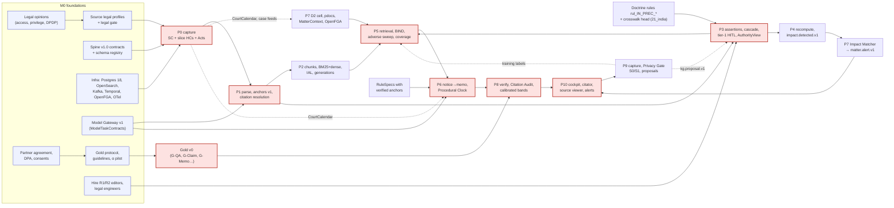
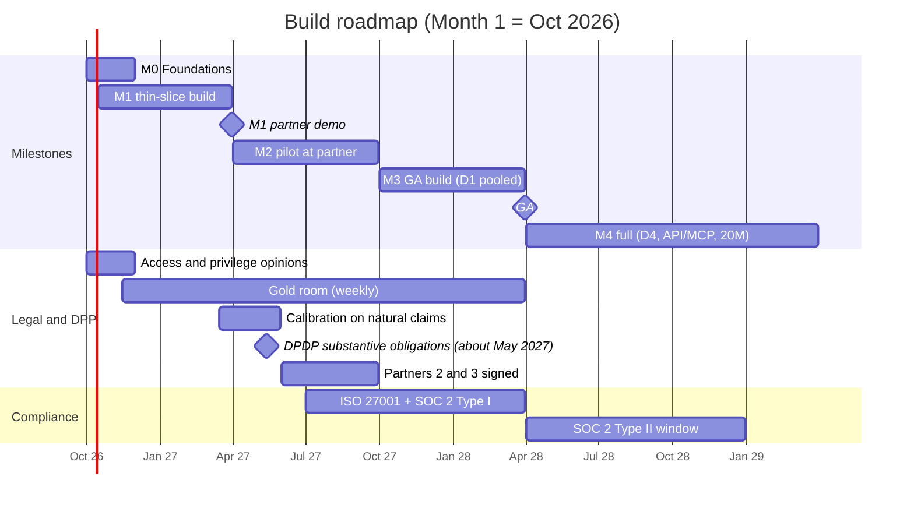

# Build Roadmap: from foundations to a full Indian legal-intelligence platform

**Abstract.** This roadmap turns the phase blueprints (02–12), the cross-cutting design (13), the competitive teardown (20) and the India data study (21) into a sequenced build. There are five milestones. **M0 Foundations** (months 1–2) covers legal opinions, the partner agreements, the gold-set protocol, source legal profiles and infrastructure. **M1 Partner demo** (month 6) is a thin vertical slice through all eleven phases, on a narrow corpus and three matter types. **M2 Pilot** (months 7–12) is daily use on live matters at the design partner, in a D2 dedicated cell. **M3 GA** (month 18) opens D1 pooled SaaS. **M4 Full** (month 30) adds D4 on-prem, the PLC Access API/MCP and the 20M-document corpus. The critical path runs through tier-1 human review and calibrated verification, not through model choice: legal gate → P0 capture → P1 anchors → P3 AuthorityView with human-reviewed tier-1 edges → P5 → P6 → P8 calibration on natural claims → P10. Each milestone has entry and exit criteria, P8 evaluation gates, and the five competitive minimums from 20_competitive_teardown §7.2 as hard gates. The team grows from about 19 FTE to about 70 FTE (estimates). People are about 70% of a 30-month programme cost of about US$8.6–14M (estimate). Corpus-build and run figures come from decisions D18 and D19.1 (figures of record: ≈$0.105 per verified Q&A, ≈$2.16 per strategy memo, ≈$77K/month at S-5M and ≈$89K/month at S-20M for 2,000 seats). The document ends with what not to build early, the schedule risks, the decision points and the kill criteria.

**Conventions.**
- Month 1 = October 2026. This document is dated 30 September 2026.
- "Estimate" marks planning numbers with no external source. "Proposal" marks targets introduced here that the owning phase must confirm.
- Tags such as [XC-4] or [P8-74] point to the reference list of the named phase doc. [RM-n] points to this document's list.
- D1–D21 are the spine v1.0 decisions (01a_spine_decision_record.md; catalogues in 01_master_architecture.md §5–§9). Where a phase doc differs, they win. Deployment names follow D17 (D1 pooled cell, D2 dedicated cell, D3 customer VPC, D4 on-prem/air-gapped, D4h on-prem with in-India cloud LLMs). Design-partner **data classes** are written DC0–DC4 (10_P8 §5.13) so that they never clash with deployment names.
- INR conversions use the **assumed** ₹88/USD rate from 13_cross_cutting §3 (not verified).

**Spine rulings D19–D21 that change this plan** (where each lands):
- **D19.1 cost figures of record** (§4.4): ≈$0.105 per verified Q&A, ≈$2.16 per memo, ≈$77K (S-5M) / ≈$89K (S-20M) per month at 2,000 seats. The uncorrected $0.086/$1.66 are list-price lower bounds only; 08_P6's ≈$2.7/memo is a sensitivity upper bound; 13_cross_cutting is the canonical cost model.
- **D19.8** P1 owns the 10K-document stratified measurement sample in M0 (§3.2 item 6); DP-2 rebases this roadmap on it.
- **D17 / D19.10 sequencing:** MVP/M1 = one D2 cell running the D1 code; the deployment menu D1–D4h is published at GA (M3), with D4/D4h delivered in M4 behind DP-10; the PLC Access API/MCP (D13) ships only after M2 coverage (M4 here, scoped by DP-11).
- **D19.7** the D2 cell reads the shared PLC through the stateless read path, so M0–M2 need no replica. D3/D4/D4h MUST run a local replica with a ≤24 h lag SLO (M3/M4 exit criteria).
- **D19.4** real-time lane admission without tenant knowledge (all impact_tier-1 impacts; larger/constitution-bench `judgment.expected.v1`; public citation footprint for the rest): M1 P4.
- **D19.2** `VerificationReport.degradations[]`, disclosed by P10 next to the answer: M1 P8/P10.
- **D19.3 / D20.3** `doc.redacted.v1` with `redaction.applied.v1` acks from every consumer and the P0 redaction ledger: M2, together with opinion (f).
- **D20.1** court feeds `case.status.observed.v1`, `court.causelist.published.v1`, `court.calendar.published.v1` (P0, tenant-agnostic): M1 for the SC, M2 for the slice HCs.
- **D20.8** doctrine registry `rul_IN_PREC_01..24` (M0 item 7); **D20.16** topic naming `{plane}.{domain}.{event}.v{n}` (M0 contracts).
- **D20.15** erasure path (`erasure.applied.v1` acks → P7 emits `erasure.completed.v1`): M2 P7/P9.
- **D21.1** P5 shows "treatment pending" from the P4 Freshness API and never emits PLC events: M1 P5.
- **D21.7** auto DEADLINES_ONLY job on `matter.document.ingested.v1` (tenant-configurable, default on; trigger dates need lawyer confirmation): M1 P6.

---

## 1. Build principles

The principles are listed in priority order. When two workstreams compete for the same people, the one serving the lower-numbered principle wins.

**1. Thin vertical slice first, then widen.** M1 runs all eleven phases end to end on a narrow corpus (the Supreme Court, three High Courts, about 15 central Acts, the crosswalk head) and three matter types. It completes no single phase. This design carries its risk in the interfaces: anchors persisted across phases (D8), `AuthorityView` as the single status source (D6), broadcast-and-match impact (D3) and the TEC token (D9). A horizontal build finds interface defects in month 10; a slice finds them in month 4. Breadth then means adding courts, Acts, matter types and tenants to a proven pipeline.

**2. Contracts before code.** In M0 the spine v1.0 schemas become JSON Schemas with a registry and consumer-driven contract tests. This includes the lowercase CloudEvents extension names (D2), which "must land before any producer ships" (13_cross_cutting Q13). Every team builds against mocks of its upstream producers from week 3. This is what lets the six tracks in §2.3 run in parallel.

**3. Eval-first.** No component ships without a P8 gate (D11). The gold protocol, the Sentinel suite and the harness (Stanford typology plus VLAIR-style weights; 20_competitive_teardown I10) are M0 deliverables. Gold is itself on the critical path: calibrated bands need about 1,500–2,000 adjudicated *natural* claims (10_P8 §10), which cannot exist before P6 produces claims. First-failing-phase attribution (10_P8 §5.10.5) runs from the first end-to-end run.

**4. Legal gate first.** Nothing is built on an unapproved legal basis:
- No P0 adapter runs without an APPROVED legal profile less than 180 days old (02_P0 §5), and CAPTCHAs are never solved by machine.
- No P6 RuleSpec activates without verified statutory anchors (08_P6 §3.7, §11).
- No tier-1 edge is shown as definitive without human review (D6).
- No external API ships before the `rights_class` filter (D9) and the copyright opinion (21_india Q1).

The M0 legal opinions are therefore on the critical path, not in a parallel "compliance" lane.

**5. Same code for D2 and D1.** Per D17, the MVP is one D2 cell running the D1 code. Tenant IDs, the TEC token, per-tenant OpenFGA stores, indexes and caches, and the Impact Matcher are built in M1 even with one tenant. A honeytoken **canary tenant** lives in the D2 cell from day 1 (13_cross_cutting §10 F7; 09_P7 §7, both [NOVEL — unvalidated]), so isolation is tested before a second real tenant exists. No pilot shortcut may bypass the PEP, the Gateway or the Privacy Gate. GA is a deployment event, not a rewrite.

**6. Trust core at full fidelity, breadth narrow.** Citator badges, click-to-source, claim verification and adverse coverage ship at full fidelity in M1. A thin version "would teach users the wrong habits" (12_P10 §10). Breadth is what gets cut: corpus, matter types, languages, surfaces.

**7. Deterministic before generative.** Deadlines, authority status, binding force, the crosswalk and governing-code logic are rules and data; serving graph facts uses zero LLM calls (D14). They are built and gated before the agents that consume them. They are also the moat (20_competitive_teardown §7): procedural rules, proposition-level treatment and gold sets compound; chat UIs do not.

**8. Measure before scaling.** In M0, P1 measures a 10K-document stratified sample, which rebases every cost figure (13_cross_cutting Q1). P5's per-leg recall monitors run at every 2× corpus growth (07_P5 §11). The expansion from 5M to 20M documents is a gated decision (§7.2), not a default.

**9. Reversible by construction.** The following exist from the first commit, because retrofitting them later means live migrations:
- index generations and aliases (04_P2 §10: "Retrofitting them later means a live migration of a 60M-vector index");
- the bitemporal assertion store;
- reversible identity merges (`identity.merged.v1` / `identity.split.v1`);
- `pipeline_version` lineage (D10).

---

## 2. Component dependency graph and critical path

### 2.1 Dependency graph

Red nodes form the critical path. Dotted edges are feedback or feed edges; they do not gate first delivery.

### 2.2 Critical path (to calibrated pilot)

The durations below are estimates for a team of the size in §4. They assume every downstream team builds against contract mocks from week 3 (principle 2), so each hand-off is an integration step, not a start.

| # | Step | Depends on | Duration (estimate) | Earliest finish |
|---|---|---|---|---|
| 1 | Access opinions (IT Act s.43/ToU, AWS-dataset derivative risk, IK ToU) → legal profiles APPROVED for slice sources | counsel engaged week 1 | 6–8 wks | month 2 |
| 2 | P0 live capture: SC HOT + three HC deltas + India Code/e-Gazette; AWS CC-BY backfill loaded | 1; infra | 6–8 wks (overlaps 1 for dataset loading) | month 3 |
| 3 | P1 anchor protocol v1 **frozen**, judgment parser, citation grammar + resolver on backfill | 2 (backfill only needs the dataset opinion) | 10–12 wks from month 1 | month 3.5 |
| 4 | P3 assertion store, L1+L3 cascade, doctrine rules, `AuthorityView` API; R1/R2 review of the tier-1 head for the slice's practice areas | 3 (consumes P1 output as it streams); editors hired by month 3 | 8–10 wks from month 3 | month 5–5.5 |
| 5 | P5 BIND / G_treatment / adverse sweep on the real `AuthorityView` (built on mocks earlier) | 4; P2 index | 3–4 wks integration, concurrent with 6 | month 6 |
| 6 | P6 S0–S9 on the three workflows with activated RuleSpecs | 5; P7 MatterContext | 3–4 wks integration | month 6 (**M1**) |
| 7 | P8 calibration: adjudicate ≈1,500–2,000 natural claims (≈6 lawyer-minutes per pair, 10_P8 §5.13) + weekly audits | 6 producing claims; gold guidelines at α ≥ 0.80 | 8–10 wks | month 8.5 (bands on) |
| 8 | Pilot hardening; P8 MVP gates met over ≥ 8 weekly audits | 7 | 12–14 wks | month 12 (**M2 exit**) |

**Reading the path.** Each phase doc estimates its own MVP at about 3–6 months (P0 8–10 weeks; P1, P2, P4, P7 3–4 months; P3, P5 4–6 months; P6, P8, P9 about 6 months). Taken one by one, these suggest an MVP around month 6. That holds only for the uncalibrated M1 slice. Several phase MVPs *assume* their upstream exists: P8 assumes P1 anchor roles and the P3 `AuthorityView` (10_P8 §10), and P9 assumes the P3 review queue and the P8 runner (11_P9 §10). Chained, the steps put the full set of phase-§10 MVPs, *calibrated and gated*, at month 12. The roadmap therefore plans for month 12 and treats month 6 as the demo of an honest but uncalibrated slice. Float before M1 is only about 2 weeks, which is why M1 fixes the date and flexes scope (§7.1). Steps 7–8 carry about 2–4 weeks.

**Near-critical paths** (float of 4 weeks or less):
- **Tier-1 human review capacity.** Competitive minimum 1 needs human-reviewed negative treatment for the partner's practice areas. With R2 editors unhired at month 3, step 4 slips one-for-one.
- **Gold construction.** α ≥ 0.80 on support and status labels (10_P8 §5.10.2) gates every calibrated metric. Guideline revisions take about 2–4 weeks each.
- **RuleSpec anchor verification.** Several P6 anchors are still unverified (08_P6 §11 Q1). A workflow whose deadline rules cannot be anchored cannot ship, because the deadline suite is zero-tolerance.

### 2.3 What can be built in parallel

| Track | Scope in M0–M1 | Couples to the critical path at |
|---|---|---|
| **A. PLC data** (P0→P1→P2/P3→P4) | Critical path itself | — |
| **B. Tenant** (P7) | D2 cell, ingestion (PDF/DOCX/EML), pdocs + private anchors, OpenFGA + SSO, KMS/DEKs, audit hash chain, Impact Matcher library (P4-owned `impact-match-core`) | MatterContext → P5/P6 (month 5); Impact Matcher ← P4 (month 5) |
| **C. Intelligence** (P5, P6, P8 checks) | Built against a frozen SC sample from the AWS CC-BY dataset and a *mocked* `AuthorityView`; deterministic checks C0–C3, C5–C10, C12; Procedural Clock + RuleSpec golden tests | real `AuthorityView` (month 5) |
| **D. Product** (P10) | Shell, source viewer (tile + bbox), badge component on the full vocabulary, command bar, alerts inbox, against contract mocks | P8 VerificationReport (month 5) |
| **E. Legal and eval** | Opinions, legal profiles, doctrine registry `rul_IN_PREC_01..22`, binding table, crosswalk head (top ≈150 sections), RuleSpecs, gold guidelines, gold room | legal profiles (month 2); editors (month 3); gold v0 slices (months 4–6) |
| **F. Platform** (XC) | IaC for ap-south-1 + ap-south-2 DR snapshots; Postgres 18, OpenSearch, Kafka (KRaft) + outbox/Debezium, Temporal, OpenFGA; Gateway v1; OTel + Langfuse + OpenLineage; injection controls 1–5 | everything; must lead by about 4 weeks |

P9 is intentionally late. Its MVP needs the P3 queue and the P8 runner. Only the `FeedbackEvent` capture schema and `retrieval.served.v1` logging are built in M1, so logs exist before anyone trains on them (11_P9 §10).

---
## 3. Milestones

### 3.1 Calendar overview

| Milestone | Window | Deployment | Corpus | Users | One-line exit test |
|---|---|---|---|---|---|
| **M0 Foundations** | Months 1–2 (Oct–Nov 2026) | infra + D2 cell template + canary tenant | 10K measurement sample; AWS CC-BY SC dataset loaded | internal | Legal gate green for every M1 source; partner papers signed; gold α pilot run |
| **M1 Partner demo** | Months 3–6 (Dec 2026–Mar 2027) | one D2 cell (the D1 code) | Slice S-M1 (§3.3): SC + 3 HCs + ≈15 central Acts + criminal codes with crosswalk head | partner lawyers in supervised sessions on DC0 questions and ≤5 consented DC2 matters | Three notice→memo workflows, citator, one alert loop and cite-check run end to end; zero-tolerance gates pass |
| **M2 Pilot** | Months 7–12 (Apr–Sep 2027) | same D2 cell | phase-§10 MVP corpus: SC + 5–6 HCs + NCLT/NCLAT/ITAT + ≈50 central Acts (≈1–1.5M works; 04_P2 §10) | 20–40 partner seats on live DC3 opt-in matters (proposal) | P8 MVP-column targets met over ≥ 8 weekly audits; the partner converts to paid |
| **M3 GA** | Months 13–18 (Oct 2027–Mar 2028) | D1 pooled SaaS cell + D2/D3 offers; full deployment menu D1–D4h published (D19.10; D4/D4h delivered in M4) | S-5M core, all 25 HCs (dataset + delta), major tribunals | 5–10 paying firms (proposal) | P8 trust metrics at the m18 column; SOC 2 Type I + ISO 27001; benchmark published |
| **M4 Full** | Months 19–30 (Apr 2028–Mar 2029) | + D4 / D4h on-prem, PLC Access API/MCP | S-20M incl. district orders and state gazettes | ≈2,000 seats (D18/D19.1 planning load) | D4 replicas at eval parity; API live under `rights_class`; phase metrics at the m18 column |

The DPDP marker uses the "about May 2027" commencement of most substantive obligations recorded in 10_P8 §5.13 [P8-74] and 13_cross_cutting §5.8 [XC-36]. The exact day is indicative.

### 3.2 M0 Foundations (months 1–2)

**Entry criteria:** funding for at least M0–M2; spine v1.0 decision record accepted; design-partner letter of intent; founding hires (wave 0, §4.3) in seat.

**Workstreams and deliverables**

1. **Legal opinions** (Indian counsel, commissioned in week 1). Items (a)–(d) block M1. Items (e)–(i) block M2 or M3.

| # | Question | Raised in | Blocks |
|---|---|---|---|
| a | IT Act s.43 and portal ToU for each source class; human-assisted targeted capture; derivative risk of the AWS SC/HC datasets built from CAPTCHA portals | 02_P0 §11, top risk | M1 (Tier A sources) |
| b | Indian Kanoon ToU: retention of fetched text after termination; seeding aliases from "Equivalent citations" | 02_P0 Q11; 21_india Q2 | M1 (gap-fill), M2 (alias T3) |
| c | BSA s.132: whether SaaS vendor staff and processors fall inside the privilege circle; operator-access model; lawful demands served on the platform | 09_P7 Q1; 21_india Q3 | M1 (partner data in the D2 cell) |
| d | DPDP: s.3(c)(ii) for court-published data; the reach of s.17(1)(a); processor/fiduciary roles; the pre-2027 IT Act s.43A/SPDI regime | 13_cross_cutting Q3; 10_P8 Q6; 09_P7 Q2, Q12 | M1 (DPA text), M2 (re-papering before about May 2027) |
| e | Copyright s.52(1)(q)(ii) for statute export; reporter paragraphing (*EBC v D.B. Modak*) | 21_india Q1 | M4 (API); M2 (statute display) |
| f | Intermediary status and masking/RTBF obligations (Delhi HC 2026 directions) | 21_india Q8; 13_cross_cutting Q12 | M2 (PLC redaction SLA) |
| g | BCI rules: advertising/solicitation, co-authorship and case studies, judge pages, client-facing digests | 10_P8 Q6; 12_P10 Q7, Q11; 21_india Q10 | M3 (benchmark publication, marketing) |
| h | Professional-responsibility posture of AI strategy memos and disclaimer wording | 08_P6 Q4 | M2 (memo export appendix) |
| i | Liability framing of a published trust ledger | 10_P8 Q7 | M3 |

2. **Partner papers** (10_P8 §5.13):
   - Design Partnership Agreement (seats, annotation commitment of ≥15 lawyer-hours/week, IP, exit);
   - DPA;
   - Evaluation Data Contribution Schedule (data classes DC0–DC4);
   - annotator notice;
   - written **S0/S1 consent** for the Public Corpus Improvement Programme (11_P9 §5.4: on by default for the design partner, but only with explicit written consent);
   - named R3 panel and steering committee;
   - a draft client-consent template for DC2 matters.

   Also survey the partner's DMS and Office estate. This decides the P7 connector priority and the Word add-in path (09_P7 Q5; 12_P10 Q5).
3. **Source legal profiles.** APPROVED profiles for every M1 source: sci.gov.in judgments, daily orders and cause lists; the three slice HCs; India Code; the central e-Gazette; the AWS CC-BY datasets; the IK API with a spend cap. Each profile records its archived ToU and robots snapshots, `permitted_access_modes` and a kill switch. A profile flips to PROVISIONAL automatically on a new CAPTCHA signature (02_P0 §5).
4. **Gold-set protocol.**
   - Guidelines v0 with worked Indian examples.
   - A 50-item pilot with Krippendorff's α per label family (target ≥ 0.80 on support and status).
   - A Gold Store with a DEV/EXAM/SENTINEL split, canary strings and signed manifests.
   - Sentinel v0 of ≥ 50 items.
   - The perturbation factory's deterministic operators.
   - The harness scaffold with the Stanford typology and VLAIR-style weights (20_competitive_teardown I10).
5. **Infrastructure and contracts** (track F):
   - AWS ap-south-1 accounts via IaC, with ap-south-2 DR snapshots.
   - Postgres 18, OpenSearch, Kafka 4.x KRaft with outbox + Debezium, Temporal, OpenFGA (D1).
   - Gateway v1: `ModelTaskContract`, ≥ 2 qualified endpoints per extraction task, fail-closed `residency_policy` (D1, D15).
   - OTel and self-hosted Langfuse.
   - A D2 cell template with a canary tenant.
   - Spine v1.0 JSON Schemas and contract tests in CI, including the Kafka topic map `{plane}.{domain}.{event}.v{n}` (v1.0 D20.16).
6. **Measurement** (owner P1, v1.0 D19.8). A 10K-document stratified sample (tokens/doc, pages/doc, OCR share, citations/doc, Indic share) rebases the cost model and P3 base rates (13_cross_cutting Q1, Q11; 05_P3 §11 Q4).
7. **Doctrine seed.** Import `rul_IN_PREC_01..24` (the canonical registry, v1.0 D20.8; earlier drafts said 01..22) and the binding table for SC + slice HCs into the P3 registry (D16). Contested rules return UNDETERMINED.

**Exit criteria (end of month 2):**
- (a)–(d) delivered, or explicitly risk-accepted by the founders with interim constraints recorded in the legal profiles.
- Partner papers signed, including S0/S1 consent.
- All M1 legal profiles APPROVED.
- α pilot computed and guidelines v1 scheduled.
- IaC reproducibly builds a D2 cell with its canary tenant.
- Cost model rebased on the measured sample.
- Wave-1 offers accepted (§4.3).

### 3.3 M1 Partner demo (months 3–6): the thin vertical slice

**Entry criteria:** M0 exit; editors (≥ 1 R2, ≥ 2 R1) in seat by the end of month 3; anchor protocol v1 frozen by the middle of month 3.

**Corpus slice S-M1** (exact):
- **Supreme Court.** All judgments in the AWS CC-BY backfill, plus a live delta from sci.gov.in. Daily orders run in the HOT class (p95 ≤ 30 min, 02_P0 §5). A cause-list pronouncement watch emits `judgment.expected.v1`.
- **High Courts (three).** The partner's primary HC plus Delhi and Bombay, chosen because both hear commercial suits on their original side, which W2 needs *(unverified in this pass; confirm with the partner)*. If the partner's primary HC is one of these two, add Madras or Allahabad. Each has a dataset backfill plus an own-site delta. HCs without a live delta carry `backing: DATASET_ONLY` disclosure (02_P0 §10).
- **Tribunals.** None in M1. NCLT, NCLAT and ITAT join in M2 (02_P0 §10).
- **Central Acts** (current consolidated text from India Code, plus e-Gazette amendments since the snapshot):
  - Constitution of India;
  - Negotiable Instruments Act 1881;
  - Code of Civil Procedure 1908;
  - Commercial Courts Act 2015;
  - Limitation Act 1963;
  - General Clauses Act 1897;
  - CGST Act 2017 (for the conditional W3);
  - Arbitration and Conciliation Act 1996;
  - Indian Contract Act 1872;
  - Specific Relief Act 1963;
  - IPC, CrPC and Indian Evidence Act, with BNS, BNSS and BSA.
- **Point-in-time and crosswalk.** Point-in-time versions only for IPC/CrPC/IEA and BNS/BNSS/BSA, manually verified (03_P1 §10). The crosswalk is `CORRESPONDS_TO` for the top ≈150 most-cited IPC/CrPC/IEA sections, human-verified, plus `governing_code()` (21_india MVP). The crosswalk matters to M1 because s.138 NI Act complaints are criminal complaints: procedure after 1 July 2024 is governed by BNSS with the s.531(2)(a) savings for pending matters [P4-49], and electronic bank records engage BSA s.63 [P6-43].
- **Size.** ≈0.5–1M works (estimate, pending the M0 measurement).

**Workflows** (P6 trigger families from 08_P6 §10, narrowed):

| # | Workflow | RuleSpecs activated (verified anchors only; 08_P6 §3.7) | Draft output | Status in M1 |
|---|---|---|---|---|
| W1 | **s.138 NI Act** demand notice or complaint received (client = drawer; mirror flow for payee) | s.138 provisos (b),(c); s.142(1)(b) one-month computation (*Saketh India*); s.142(2) territorial jurisdiction; SC Covid exclusion; Limitation Act ss.4, 12. Not activated: s.143A, s.147 (unverified) | reply to notice | **committed** |
| W2 | **Commercial suit** summons/plaint → written-statement strategy | CPC O.VIII r.1 as amended for commercial disputes (120-day outer limit, *SCG Contracts*); CCA s.12A (*Patil Automation*; its prospective date is unverified, so shown as ASSUMED); Limitation Act Sch. Art. 113 | para-wise written-statement grid | **committed** |
| W3 | **GST SCN** under CGST s.74A | s.74A(7) order window; s.74A(8)/(9) 60-day payment windows. Not activated: the s.107 appeal window and s.169 service (unverified) | SCN reply skeleton | **conditional**: activated only if P3/21_india anchor the missing rules and the partner practises indirect tax. Otherwise replaced by an Arbitration s.34 challenge, whose s.34(3) anchor is verified |

**The four demonstrated capabilities.**
1. **Notice→memo** for W1–W3: steps S0–S9 in STANDARD mode, early-streamed deadlines with one-click date confirmation, adverse authorities pinned, and a VerificationReport per claim.
2. **Citator badges** at full vocabulary with provenance and the binding chip, on the authority page, evidence cards and memos. Tier-1 negative edges are human-reviewed (R1+R2, two-person rule for SC) for the *practice-area head*. That head is every negative-treatment, direct-history or validity candidate whose cited work is among the most-cited authorities in the W1–W3 statutes; the cut-off is sized to editor capacity (≈100–300 tier-1 items/day with 3–5 editors, 05_P3 §5.14). Everything else shows CAUTION with `definitive=false`, never hidden (D6).
3. **One end-to-end alert loop**: new SC or slice-HC decision → P0 → P1 → P3 `graph.delta.v1` → P4 `impact.detected.v1` (PROVISIONAL, then CONFIRMED after HITL) → P7 Impact Matcher in the D2 cell → `matter.alert.v1` → P10 inbox and email, with retraction parity. This is shown two ways:
   - a time-travel drill replaying ≥ 20 historical overrulings and reversals against seeded demo matters (P4 matter-level alert recall ≥ 95% in time-travel drills, 06_P4 §7 item 8 and §9);
   - at least one live event during the demo window, if one occurs.
4. **Cite-check**: P8 Citation Audit on an uploaded DOCX/PDF (an own draft or an incoming order) for SC/HC citations. It checks existence, resolution, status at date, quote match and binding for the forum. The Word add-in follows in M2.

**Per-phase scope at M1**

| Phase | M1 scope (narrower than the phase's §10 MVP) |
|---|---|
| P0 | Sources as in S-M1. Temporal + Postgres + S3; httpx/warcio adapters with WARC-fixture CI; `nfp` change detection; outbox → Kafka; legal gate; mass-change breakers. `raw.captured.v1` with the D16 fields incl. `rights_class`. CourtCalendar for SC + slice HCs as `court.calendar.published.v1` (feeds the P6 clock). Case-status/cause-list feed for SC only (`case.status.observed.v1`, `court.causelist.published.v1`; v1.0 D20.1). `judgment.expected.v1` records (`jex_`). |
| P1 | Born-digital path + one self-hosted OCR-VLM + Tesseract second reader. Judgment parser (header, opinions, paragraphs, footnotes, `ord`). Anchor protocol v1 **frozen** (D8, D16 grammar). Citation grammar for SCC, SCC OnLine, AIR, SCR, INSC, DHC/Bombay neutral, SCALE, JT, Cri LJ; resolver + STUB works. Statute hierarchy parser. English + Hindi text layers. Quality gates + review UI. Tenant-mode `ParseRequest`. |
| P2 | Chunk invariants I1–I5, deterministic headers, BM25 (exact/light/Hindi). One dense embedder: the bake-off winner if ready, else Qwen3-Embedding-4B base (D1) flagged provisional. OpenSearch with generations and aliases **from day 1**. IAL. TPL index for the partner. |
| P3 | Postgres bitemporal assertion store. Predicates CITES, POSITIVE, DISTINGUISHES, OVERRULES(_IN_PART), PER_INCURIAM, REFERS_TO_LARGER_BENCH, direct history, INTERPRETS, CORRESPONDS_TO (head). Doctrine rules for SC + slice HCs. `AuthorityView` API. Cascade L1 + L3 + HITL; R1/R2 queues. SC 4-business-hour SLA for hard negatives. |
| P4 | Kafka + outbox, RT lane (admission per v1.0 D19.4: every impact_tier-1 impact and larger/constitution-bench `judgment.expected.v1`; public citation footprint for the rest), DLQ. Status recompute at depth 1. Impact kinds STATUS, DIRECT_HISTORY, PROVISION_TEXT. Lifecycle PROVISIONAL/CONFIRMED/RETRACTED. `impact-match-core` v1. Freshness API. Time-travel drill harness. |
| P5 | Intents I1–I4, I6, I7. Legs LEX + DENSE + BIND + G_treatment + crosswalk + opponent-cited. Hand-tuned weighted RRF. Off-the-shelf bge-reranker-v2-m3, gated vs no-rerank. Mandatory adverse sweep with attestation. Per-issue coverage and sufficiency. `/revalidate`. "Treatment pending" from the P4 Freshness API (v1.0 D21.1). |
| P6 | W1–W3 as above. S0–S9 with one T1 family and a different family for the Bench. One rebuttal round. English memos; Hindi triggers flagged for translation. Manual REVERIFY. Auto DEADLINES_ONLY job on `matter.document.ingested.v1` (v1.0 D21.7). |
| P7 | D2 cell + canary tenant. Ingestion of PDF, DOCX, EML/MSG. pdocs + private anchors. MatterContext v1 with lawyer-confirmed facts, dates and `procedural_events[]`. OpenFGA matter/team walls + SSO. Per-tenant KMS key + per-matter DEKs. Audit hash chain. Impact Matcher. Hearings by manual entry. |
| P8 | Deterministic checks C0–C3, C3b, C5–C10, C12. Off-the-shelf small checker + one heterogeneous judge. Statuses and section gates (tier-1 deadline sections BLOCK). Citation Audit. L0/L1 gates. `degradations[]` on every report (v1.0 D19.2). **No calibrated bands yet**: statuses only, labelled "uncalibrated preview". |
| P9 | `FeedbackEvent` capture (explicit actions + reason chips) and `retrieval.served.v1` into the tenant store. No Privacy Gate releases yet; editors triage flags by hand. |
| P10 | S2 Matter cockpit (streamed memo, deadlines), S3 Research, S4 Authority page, S5 Source viewer (click-to-source), S7 Alerts inbox + email. Citation Audit upload screen. Interaction log. Degradation disclosure next to every answer (v1.0 D19.2) and "status current to <law_current_to>" (D20.12). |
| XC | Gateway v1 in production. Injection controls 1–5 incl. hidden-text detection. Per-tenant caches and keys. OTel traces across P5/P6/P8. |

**Exit criteria (end of month 6):**
- **Zero-tolerance invariants** (10_P8 §5.11) pass on the slice:
  - Sentinels 100%;
  - deadline suite 100% for every activated RuleSpec;
  - bad-law leakage 0;
  - fabricated anchors displayed 0;
  - canary-tenant hits 0;
  - anchor stability ≥ 99.5%.
- Every other metric is **reported with confidence intervals but not gated**. The gold is still thin at this point (§5).
- All five competitive minimums demonstrated (§3.8).
- P0 freshness measured for 2 weeks at SC HOT p95 ≤ 30 min.
- Gold on hand: G-Memo 20, G-Deadline 300, Sentinels 200, G-Temporal 150, G-Crosswalk 200, G-QA ≥ 150, G-Audit ≥ 150.
- Steering committee records a go/no-go decision for the pilot (§7.2, DP-6).

### 3.4 M2 Pilot at the partner (months 7–12)

**Entry criteria:**
- M1 exit and a go decision.
- DPA re-papered to DPDP-ready terms before the about-May-2027 commencement (month 8).
- Pilot seat list (20–40 seats, proposal) and D3 matter-level opt-ins signed by responsible partners.
- External penetration test of the D2 cell passed.
- Weekly 100-claim audit staffed (10_P8 §5.12).

**Scope.** Complete each phase's §10 MVP (table in §3.7). Additions beyond M1:
- corpus widened to SC + 5–6 HCs + NCLT/NCLAT/ITAT + ≈50 central Acts;
- court tracking for SC, the partner's primary HC and district courts via P0 CNR feeds;
- Word add-in v1.1 (cite-check, insert authority, living citations; 12_P10 §10);
- the S1 Today screen and the 06:30 IST digest;
- WhatsApp MINIMAL alerts;
- calibrated display bands from about month 8.5;
- the Privacy Gate for S0/S1, with `kg.proposal.v1` into P3 and the urgent bad-law path;
- a global reranker trained on gold plus LLM-judge labels (11_P9 §10);
- the full crosswalk (≈1,059 new-code sections, ≈540 reviewer-hours one-time; 05_P3 §5.14, 21_india §10.2).

**Exit criteria (end of month 12):**
- The P8 MVP-column targets in §3.9 are met over ≥ 8 consecutive weekly audits.
- Fewer than one false severity-1 alert in the quarter (06_P4 top risk).
- Hearing-date accuracy ≥ 99.5% (09_P7 §9).
- Adoption: ≥ 60% of pilot seats weekly-active for the last 8 weeks, and ≥ 1 memo or cite-check per active seat per week (proposal; replaces 13_cross_cutting's usage assumptions with P10 telemetry, Q9).
- The partner signs a paid renewal (founding-customer pricing, 10_P8 §5.13).
- Partners 2 and 3 are signed (DP-7).

### 3.5 M3 GA: D1 pooled SaaS (months 13–18)

**Entry criteria:**
- M2 exit.
- ISO/IEC 27001 and SOC 2 Type I audits in progress; 13_cross_cutting §5.8 targets both "by GA".
- Onboarding consent screen live, with S0/S1 **off** by default for new tenants (11_P9 §5.4).
- ≥ 2 qualified in-India endpoints per P6 role for IN_ONLY tenants (13_cross_cutting top risk; D15). If not, those tenants get a declared reduced mode (§7.2, DP-9).

**Scope:**
- D1 pooled cell with the cell router.
- D2 (reads the shared PLC through the stateless read path; a local replica is optional) and D3 (customer VPC with a mandatory local PLC replica fed by signed daily deltas, replica lag ≤ 24 h; v1.0 D19.7; 13_cross_cutting §9).
- The deployment menu D1–D4h is published (v1.0 D19.10); D4/D4h are delivered in M4 behind DP-10.
- S-5M core corpus: all 25 HCs by dataset backfill and delta, major tribunals, and state gazettes for the partners' states.
- P6 trigger set widened to arbitration s.34, consumer complaints and BNSS bail/default-bail clocks, each gated on anchors. BNSS s.187(3) carries its contested reading (08_P6 §3.7).
- Automatic impact-driven REVERIFY.
- Exclusionary walls; BYOK.
- Statute timeline and crosswalk explorer.
- Per-residency quality scores published by P8 (D15).
- Open Indian verification benchmark published from DC0, subject to opinion (g) and partner consent (20_competitive_teardown I10).

**Exit criteria (end of month 18):**
- 5–10 paying firms (proposal).
- P8 trust metrics at the m18 column, and every M2 gate holding per tenant cohort.
- Crosswalk coverage 100% before GA of the criminal module (21_india §10.3).
- ISO 27001 certificate and SOC 2 Type I report issued.
- Zero cross-tenant canary hits since D1 opened.

### 3.6 M4 Full (months 19–30)

**Scope:**
- D4 on-prem/air-gapped with signed daily PLC bundles and open-weight models, plus the D4h variant (D17). Reference sizing: 1× 8×H100-class node for generation, 2× L40S-class for retrieval (13_cross_cutting §9).
- PLC Access API/MCP: `resolve_citation`, `get_anchor`, `authority_status`, `research` → PublicEvidenceBundle; `rights_class`-filtered and metered (D13).
- S-20M corpus incl. district orders, with parse-depth profiles (03_P1 §5).
- The full P3 ontology and depth-2 recompute.
- Monotone LambdaMART with IPS once traffic allows (07_P5, 11_P9).
- Hindi and major regional languages for source and output.
- S2 aggregates, if the privacy analysis clears them.
- SOC 2 Type II, 6–9 months after Type I (13_cross_cutting §5.8).

**Exit criteria:**
- D4 replicas byte-identical to SaaS at a given `index_generation` (Merkle-verified), so P8 results transfer. Replica lag ≤ 24 h for D4/D4h (v1.0 D19.7; the earlier ≤ 48 h target is superseded).
- Per-leg recall monitors hold at every 2× growth step to 20M.
- Phase quality metrics at the P8 m18 column.
- API metering and the `rights_class` filter pass a legal audit.

### 3.7 Per-phase scope by milestone (M2–M4)

M1 scope is in §3.3. M2 is each doc's §10 "MVP" column; M4 is its "Full" column; M3 is the GA subset, chosen by what D1 multi-tenancy and paying customers require.

| Phase | M2 Pilot (phase-§10 MVP) | M3 GA additions | M4 Full additions |
|---|---|---|---|
| **P0** | SC HOT; 6–8 HCs own-site delta; NCLT (allowed paths), NCLAT, ITAT; IK gap-fill capped; SC pronouncement watch; `acquire.requested.v1` for UNRESOLVED_CITATION; court feeds for the slice HCs (v1.0 D20.1); `doc.redacted.v1` producer + redaction ledger joining `redaction.applied.v1` acks, with `purge_sla` breach alarms (D19.3, D20.3) | All 25 HCs; tribunals and regulators; `source.health.v1` → P8/P10; reconciliation ledger; capture console (human-assisted, logged); fixture-gated LLM repair | e-Jagriti browser mode; state gazettes; signed WACZ + Merkle roots; on-prem feed; MoU feeds as they materialise |
| **P1** | 5 HCs; RR model on public data + 150-judgment gold; alias-seeded resolver; review UI; EN + HI | Third reader for critical-token consensus; IC-OCR-Bench internal; tribunal grammars; impact-weighted review queue | All 22 scheduled languages (progressively); native Indic RR/NER; round-trip point-in-time for all central + major state Acts; Constitution history |
| **P2** | 3-way embedder bake-off winner; LLM case cards (SC/HC reportable), verified; nightly reconciliation; redaction runbook; `redaction.applied.v1` acks (serving ≤1 h, derived ≤24 h; D19.3) | ap-south-2 DR snapshots; split indexes by doc_type; per-tier TPL clusters; automated promotion gate; automated redaction purge with SLO | Indian fine-tuned embedder; learned-sparse arm if ≥ 2 pts; MT shadow; on-prem package; small-install pgvector |
| **P3** | ~50 central Acts; doctrine rules B0–B2, B4–B6, B9–B14; propositions for Constitution Benches and 3+ judge SC benches; L2 once gold ≥ 3k; partner editors | Full role ladder and SLAs; reliance risk; circuit breakers; HC-wide tier-1 coverage for GA practice areas | Full ontology (RELIES_ON, CONFLICTS_WITH miner, ATTESTS, PRECEDENT_CARRIES_TO, IN_FORCE_IN); corpus-wide propositions; signed snapshots |
| **P4** | SC + 5 HCs + NCLAT ledger; impact kinds + TEXT_CORRECTED, IDENTITY_REMAPPED; runbook campaigns with shadow + diff; manual commencements | Depth-2 recompute; UPDATED coalescing; storm automation; impact dry-run gate; severity calibrated on partner feedback | Crosswalk carry-over; automatic COMMENCES and ordinance-lapse timers; prospective applicability; on-prem signed bundles |
| **P5** | I9 added; C1/C2/C4 caches; G1–G8 guards; 300-issue gold, trap suites | Tuned per-slice fusion weights; fine-tuned Qwen3 reranker; perspective-flip stance; Hindi cue lexicon | PPR and proposition legs; HyDE (DEEP); monotone LambdaMART with IPS; online interleaving; 1,500-issue gold |
| **P6** | Three trigger families; ≈40 RuleSpecs; SC + 5 HC calendars; drafts for all three | Arbitration, consumer, BNSS bail clocks; heterogeneous T1 for Advocate/Opponent; automatic REVERIFY; DEEP mode | 300+ RuleSpecs; all HC/district calendars; firm playbooks; Hindi and regional output; on-prem open-weight T1 (quality-flagged) |
| **P7** | Court tracking (SC + primary HC + district via CNR); legal hold + manual purge with lineage sweep; India-region ZDR routes + one self-hosted fallback; erasure aggregation: `erasure.applied.v1` acks → P7 emits `erasure.completed.v1` (v1.0 D20.15, D21.3) | D1/D3 cell router; exclusionary walls; break-glass; BYOK; DPDP request workflow; erasure certificates | D4 with full model pack; HYOK; PST/WhatsApp/XLSX/audio ingestion; DMS connectors; privilege-log export |
| **P8** | Pooled isotonic calibration, 3 bands; 100 audits/week; gold v0 complete; L2 manual | Stratified calibration + conformal thresholds; trust ledger per tenant; automated L2; ≥ 300 audits/week across consenting tenants | `minicheck-in` (EN+HI); C11 coherence; cross-lingual judge; academic DC0 partner; self-maintaining gold at Year-1 sizes |
| **P9** | S0/S1 gate with ledger; proposals + urgent bad-law path; TENANT_PRIVATE eval; USER/MATTER memory; lineage + erasure cascade | Micro-review; alert feedback; auto outcome tracking via CNR; per-tenant regression dashboards | S2 aggregates (k ≥ 5, DP noise) if cleared; IPS LTR; PRACTICE_GROUP/FIRM memory with KM approval; opt-in LoRA after bake-off |
| **P10** | S1 Today; 06:30 digest; watchlists; WhatsApp MINIMAL; PWA triage; Word add-in v1.1 | Statute timeline/diff, crosswalk explorer; KM dashboards; storm analytics; native push/SMS fallback | PLC Access API/MCP; graph view; Hindi digest; memo→draft tracked changes; client-facing digests (after opinion g) |
| **XC** | DPDP-ready controls; CERT-In 6-h incident runbooks, 180-day in-India logs [XC-38]; honeytoken canaries | ISO 27001 + SOC 2 Type I; shadow/canary automation; red-team CI corpus (500+ docs) | SOC 2 Type II; ISO 27701; learned routers; distillation to self-hosted bulk models; B/C topologies |

### 3.8 Competitive minimums as hard gates

20_competitive_teardown §7.2 names five capabilities "without [which] the product is feature-equivalent to Bharat.Law or Prism". A milestone cannot exit if any of them regresses.

| Minimum | M1 demo | M2 pilot | M3 GA | M4 |
|---|---|---|---|---|
| 1. Typed negative treatment, tier-1 human-reviewed, in partner practice areas | Slice practice-area head (W1–W3 statutes) | All partner practice areas; SC + 5–6 HCs | All GA practice areas; all 25 HCs at the head | Corpus-wide head by exposure |
| 2. Claim-level support verification | Statuses, uncalibrated | Calibrated bands (ECE ≤ 0.05) | Per-stratum calibration | Cross-lingual |
| 3. Per-issue coverage with adverse authority | Adverse sweep + attestation; coverage shown | AAR ≥ 0.75 gated | Non-inferior per slice | AAR ≥ 0.90 |
| 4. One matter-alert loop, end to end | Drill ≥ 95% + ≥ 1 live event if available | Live on all pilot matters; seeded-event recall 100% | All tenants, incl. D3 replicas | D4 bundles |
| 5. Benchmark harness (Stanford typology + VLAIR weights) | Internal harness | Quarterly re-runs, sealed EXAM | Published subset | Re-run quarterly with invited competitors |
| (+) `rights_class` on every raw object | From the first capture | enforced | enforced | the API filter uses it |

### 3.9 P8 evaluation gates by milestone

P8 publishes MVP (m6) and Full (m18) target columns (10_P8 §9). This roadmap applies the **MVP column at M2 exit** (month 12), because natural claims only appear at month 6 on the critical path. It applies the **Full column at M3** for P8's own trust metrics, and at **M4** for phase quality metrics, because M3 adds courts, languages and tenants that reset every slice.

| Gate | M1 | M2 exit | M3 GA | M4 |
|---|---|---|---|---|
| Zero-tolerance: Sentinels 100%, deadlines 100%, bad-law leakage 0, fabricated anchors 0, canary hits 0, anchor stability ≥ 99.5% | required | required | required | required |
| Realised false-verify (PPI 95% upper bound) | not claimed (no bands) | VT2 ≤ 3%, VT1 ≤ 1% | VT2 ≤ 2%, VT1 ≤ 0.5% | same, per residency |
| Perturbation recall | wrong_case ≥ 0.99; misquote 1.0; status/era/jurisdiction swaps ≥ 0.98 | + wrong_pinpoint_hard ≥ 0.85; role_swap ≥ 0.85; dissent_swap ≥ 0.95 | wrong_pinpoint_hard ≥ 0.93; role_swap ≥ 0.93; swaps ≥ 0.995 | same |
| False-block / withheld / BLOCK | reported | ≤ 6% / ≤ 15% / ≤ 5% | ≤ 3% / ≤ 8% / ≤ 2% | same |
| Calibration | — | ECE ≤ 0.05 pooled | ≤ 0.05 per stratum (≥ 300 labels) | same |
| Citation Audit | reported | recall ≥ 0.90 (NOT_FOUND/NAME_MISMATCH ≥ 0.98), precision ≥ 0.80 | recall ≥ 0.95, precision ≥ 0.90 | + tribunal schemes |
| P3 | reported | negative-treatment recall ≥ 0.95 (queue level); AuthorityStatus on G-Temporal ≥ 0.97; crosswalk ≥ 0.98; false red flags < 1% (21_india) | same across GA courts | ≥ 0.98 / ≥ 0.995 |
| Which-code (21_india §10.3) | reported | ≥ 97% on ≥ 100 scenarios; 0 confident UNDETERMINED | same | same |
| P5 | reported | nDCG@10 ≥ 0.55; BAR ≥ 0.85; AAR ≥ 0.75; as-of ≥ 0.98; Hindi gap ≤ 0.15 | non-inferior per slice | ≥ 0.70; ≥ 0.95; ≥ 0.90; —; ≤ 0.07 |
| P6 | deadlines 100% | issue recall ≥ 0.85; adverse binding coverage ≥ 0.80; first-pass verification ≥ 0.80; ≥ 40% prefer-or-tie | non-inferior | first-pass ≥ 0.90 |
| P4 / P7 / P10 | drill recall ≥ 95%; click-to-source ≥ 99.9% | seeded-event recall 100%; impact→alert p95 ≤ 15 min; hearing dates ≥ 99.5%; alert precision ≥ 0.8 (sev 1–2) | + appropriate-reliance ≥ 0.9 | same |

Every row is also subject to D11 non-inferiority: the one-sided 95% paired-bootstrap bound must be ≥ −δ_s, with δ_s = max(1 pt, 2·SE_diff,s), over rolling 3-release windows.

---
## 4. Team plan

### 4.1 Roles

| Role | Owns | Phases |
|---|---|---|
| CTO / principal architect | spine, decision record, cross-phase contracts | all |
| Crawler/data engineers | adapters, legal gate, freshness SLOs (≈100 adapters need 1.5–2 FTE of upkeep, 02_P0 §5) | P0 |
| NLP/ML engineers | OCR, RR, citation resolution, treatment cascade, embeddings/reranking, checker/calibrator | P1–P3, P5, P8, P9 |
| Backend/stream engineers | assertion store, Kafka/outbox, Temporal, IAL, recompute, eval platform | P2–P4, P8, P9 |
| LLM/agent engineers | Gateway contracts, P6 agents, per-family prompt variants | P6, XC |
| Security/privacy engineers | OpenFGA, TEC, keys, isolation canaries, injection defences, erasure | P7, XC |
| Frontend + designer; SRE/platform | cockpit, citator, source viewer, Word add-in; IaC, DR, observability, cell router, D3/D4 packaging | P10; XC |
| **Head of Legal** (advocate) | legal-gate sign-off, opinions, doctrine registry, R3 liaison | P0, P3 |
| **Legal engineers** (advocates who can specify software) | RuleSpecs + golden tests, crosswalk, gold guidelines, adjudication ops | P3, P6, P8 |
| **R1 analysts** (law graduates) / **R2 senior editors** (advocates) | tier-2 audits and routine tier 1, P1 review queue / SC and larger-bench tier 1, crosswalk, doctrine relabels; two-person rule (05_P3 §5.10) | P1, P3 |
| **Annotators** (supervised NLU students, hourly) | G-Claim first pass, perturbation spot checks (10_P8 §5.13) | P8 |
| **Indic language reviewers** (bilingual lawyers) | Hindi gold slices (15% of G-QA), IC-OCR-Bench, MT-proposed treatment edges held PENDING_REVIEW (21_india §10.2) | P1, P3, P8 |
| Privacy/DPO counsel; partner success; later sales, support, compliance | DPA and consents, Privacy Gate lint; DPP operations; onboarding; SOC 2/ISO | P7, P9, P10 |

The R3 panel (partner-firm counsel) is part-time and not our headcount.

### 4.2 FTE by phase and quarter (estimates)

Q4'26 = months 1–3. The last column averages months 19–30. The plan excludes the CEO, finance and admin.

| Track | Q4'26 | Q1'27 | Q2'27 | Q3'27 | Q4'27 | Q1'28 | M4 avg |
|---|---|---|---|---|---|---|---|
| P0 acquisition | 1.5 | 2 | 2 | 2.5 | 3 | 3 | 3 |
| P1 parsing | 1.5 | 2.5 | 2.5 | 2.5 | 2.5 | 2.5 | 3 |
| P2 indexing | 0.5 | 1 | 1.5 | 1.5 | 2 | 2 | 2 |
| P3 graph | 1.5 | 2 | 2.5 | 2.5 | 2.5 | 2.5 | 3 |
| P4 propagation | 0.5 | 1 | 1.5 | 1.5 | 2 | 2 | 2 |
| P5 retrieval | 0.5 | 1.5 | 2 | 2 | 2 | 2 | 2.5 |
| P6 reasoning | 0.5 | 1.5 | 2 | 2 | 2.5 | 2.5 | 3 |
| P7 workspace | 1 | 1.5 | 2 | 2.5 | 3 | 3 | 4 |
| P8 verification/eval | 1 | 2 | 2.5 | 2.5 | 2.5 | 2.5 | 3 |
| P9 feedback | 0 | 0.5 | 1.5 | 2 | 2 | 2 | 2 |
| P10 product surface | 1 | 2 | 2.5 | 3 | 3.5 | 3.5 | 4.5 |
| XC platform/SRE/security/Gateway | 1.5 | 2 | 2.5 | 3 | 4 | 4 | 5 |
| **Engineering subtotal** | **11** | **19.5** | **25** | **27.5** | **31.5** | **31.5** | **37** |
| Head of Legal | 1 | 1 | 1 | 1 | 1 | 1 | 1 |
| Legal engineers | 1.5 | 2.5 | 3 | 3.5 | 4 | 4 | 5 |
| R2 senior editors | 1 | 2 | 2 | 2 | 3 | 3 | 3 |
| R1 legal analysts | 1 | 3 | 3 | 3 | 4 | 4 | 5 |
| Annotators (FTE-equivalent) | 0.5 | 3 | 4 | 4 | 3 | 3 | 3 |
| Indic language reviewers | 0 | 0.5 | 1 | 1 | 1.5 | 1.5 | 3 |
| Privacy/DPO counsel | 0.25 | 0.25 | 0.5 | 0.5 | 0.5 | 0.5 | 1 |
| **Legal and data-ops subtotal** | **5.25** | **12.25** | **14.5** | **15** | **17** | **17** | **21** |
| CTO, product + design, partner/customer success, sales, compliance | 3 | 3.5 | 4.5 | 5.5 | 7.5 | 9 | 12 |
| **Total** | **≈19** | **≈35** | **≈44** | **≈48** | **≈56** | **≈58** | **≈70** |

**Cross-checks against the phase docs.** The rows are consistent with the phase MVP team estimates: P1 1 ML + 2 backend; P8 2 ML + 1 backend + 0.5 legal engineer; P9 2 backend + 1 ML + 0.5 privacy/legal; P3 3–5 R1/R2 editors. P8's 3,000–3,500 Year-1 gold lawyer-hours are ≈2 FTE-years at ≈1,700 productive hours each (estimate), covered by the annotator and R1 rows plus the partner's ≈15 hours/week. Tier-1 HITL at ≈100–300 items/day (05_P3 §5.14) fits the R1+R2 rows only with exposure-prioritised queues; exceeding that is a decision trigger (DP-5, K-4).

Partner-firm time sits outside this table: ≈15 lawyer-hours/week in the MVP (10_P8 §10) plus the R3 panel.

### 4.3 Hiring order

| Wave | When | Hires | Why this order |
|---|---|---|---|
| 0 (founding) | month 0–1 | CTO; Head of Legal; eval lead (P8); platform lead; data-acquisition lead; NLP lead; product/design lead; partner-success manager | legal-gate-first and eval-first: the two gates everything else passes through |
| 1 | months 1–3 | P1 ML + 2 backend; P3 backend; search engineer; 2 frontend; LLM/Gateway engineer; security engineer; 1 legal engineer; 1 R2; 1 R1 | critical path (P1→P3) and the parallel tracks; the first editors must be reviewing by month 3 |
| 2 | months 3–6 | 2 R1; 1 R2; annotator cohort (4–6 part-time students); 0.5 Hindi reviewer; P5 ranking ML; P4 stream engineer; P7 backend; P8 ML; 2nd legal engineer | gold and tier-1 volume ramp before the pilot |
| 3 | months 6–12 | P9 backend + ML; Word add-in developer; SRE; privacy engineer; 2nd Hindi reviewer; tax/tribunal legal engineer; compliance manager (0.5) | pilot operations, Privacy Gate, DPDP |
| 4 | months 12–18 | 2 sales/solutions; 2 onboarding/support; crawler engineers for all 25 HCs; R1 + R2 | D1 GA |
| 5 | months 18–30 | D4 packaging/on-prem support (2); Indic ML; regional-language reviewers (chosen by the HCs customers use); API/MCP platform engineer; legal engineers for 300+ RuleSpecs | M4 |

The schedule assumes Indian notice periods of about 60–90 days for experienced engineers *(estimate; unverified)*. Wave-1 offers therefore go out in M0 week 2.

### 4.4 Budget (30 months; USD, ex-GST)

**People (estimates).** Fully loaded annual cost per FTE:
- **Engineering, blended senior-heavy: $50–80K** (₹44–70 lakh). Anchor: ML engineer CTC in Bengaluru has a 75th percentile of ₹35.9 lakh and a 90th of ₹54.9 lakh, excluding variable pay and benefits [RM-1]. About 25% overhead is added (estimate).
- **Legal and data-ops, blended: $23–40K.** R1 at ≈$10–16K, editors and legal engineers at ≈$30–55K, students hourly. Anchor: a published Indian law-firm associate scale runs from ₹16.2 lakh (Band 1) to ₹36.45 lakh (Band 4) [RM-2]. 13_cross_cutting uses $700/reviewer-month for R1-type review (its Q4), at the bottom of this range.
- **Product/GTM/leadership, blended: $70–130K.**

| Cost line | Year 1 (M0–M2; Oct 26–Sep 27) | Year 2 (M3 + early M4) | H1 Year 3 (M4 finish) | Basis |
|---|---|---|---|---|
| Engineering | $1.04–1.66M (20.75 FTE-yr) | $1.71–2.74M (34.25) | $0.93–1.48M (18.5) | §4.2 × rates (estimate) |
| Legal and data ops | $0.27–0.47M (11.75) | $0.44–0.76M (19) | $0.24–0.42M (10.5) | same |
| Product/GTM/leadership | $0.29–0.54M (4.1) | $0.71–1.32M (10.1) | $0.42–0.78M (6) | same |
| **People subtotal** | **$1.6–2.7M** | **$2.9–4.8M** | **$1.6–2.7M** | |
| Corpus build, LLM cascade | ≈$20–30K (≈1–1.5M works, pro-rata) | ≈$60–70K (to S-5M; D18 total ≈$90K) | ≈$270K (to S-20M; D18 total ≈$360K) | **D18** (build figures unchanged by D19.1); all-premium would be $285K / $1.14M |
| Reprocessing campaigns | ≈$40–80K | ≈$0.2–0.4M (3–6 re-runs at S-5M) | ≈$0.2–0.4M | 13_cross_cutting §3.5; 06_P4 cost ($41–285K per full 5M re-run) |
| Run: pilot (one D2 cell + PLC pipeline + eval + GPUs) | ≈$25–45K/month → $0.3–0.54M | — | — | estimate from 13_cross_cutting §9 (D2/D3, formerly B: $8–15K/tenant), 02_P0 ($2–5K/month compute), 10_P8 ($1.6–3.3K/month GPU) |
| Run: D1 at scale | — | ramp to ≈$77K/month at 2,000 seats and S-5M; ≈$0.4–0.65M for the year (estimate: 40–70% of steady state) | ≈$89K/month at S-20M → ≈$0.53M | **D18 / D19.1** (figures of record) |
| Other: counsel opinions; ISO/SOC audits; pen tests; IK gap-fill ($9–35K/yr, 02_P0); paid partner annotation hours; D4 reference lab (8×H100 at E2E list ≈₹15 lakh/month [XC-26], ~6 months) | ≈$0.15–0.3M | ≈$0.15–0.3M | ≈$0.15–0.2M | estimate |
| **Programme total** | **≈$2.1–3.7M** | **≈$3.7–6.2M** | **≈$2.8–4.1M** | **≈$8.6–14M over 30 months** |

Per-unit serving costs of record (v1.0 D19.1; 13_cross_cutting §3.4) are **≈$0.105 per verified Q&A and ≈$2.16 per strategy memo** (tokenizer-corrected). The uncorrected D18 values, ≈$0.086 and ≈$1.66, are list-price lower bounds only, and 08_P6's ≈$2.7/memo is a sensitivity upper bound. At the figures of record, pilot LLM serving for 40 seats (200 Q&As + 4 memos per seat-month) is ≈$1.2K/month (≈$1K at the lower bounds): the pilot's run cost is infrastructure and evaluation, not tokens. From GA, serving is ≈78% of monthly run cost at S-5M (≈$60K of ≈$77K; 13_cross_cutting Q9). The seat-usage assumptions behind it must be replaced with P10 telemetry within 90 days of GA (Q9).

---
## 5. Design-partner programme timeline

This timeline follows the programme in 10_P8 §5.13: data classes DC0–DC4 (renamed from D0–D4 in 10_P8 so they do not clash with the D17 deployment names), gold room, consent instruments and incentives. It also follows the P9 consent model (11_P9 §5.4). Consent milestones are marked **C#** and gold milestones **G#**.

| Month | Gold construction | Feedback loop activation | Consent and governance |
|---|---|---|---|
| 1–2 (M0) | Guidelines v0; 50-item pilot; α per label family; Gold Store with EXAM seal and canary strings; Sentinel v0 | none (no product) | **C1** Design Partnership Agreement + DPA + Contribution Schedule. **C2** written S0/S1 consent. **C3** annotator notice. R3 panel named. Steering committee chartered (monthly). Ethics review (opinion g) commissioned |
| 3 | Calibration workshop; guidelines v1; weekly 2-hour gold room (3–4 lawyers) starts; G-Deadline authored with legal engineers | — | **C4** client-consent template for DC2 approved by the partner GC and our counsel |
| 4–6 (M1) | **G1** by month 6: G-Memo 20, G-Deadline 300, G-Temporal 150, G-Crosswalk 200, Sentinels 200, G-QA ≥ 150, G-Audit ≥ 150, G-Treat ≥ 500; monthly α reports | `FeedbackEvent` + `retrieval.served.v1` captured in supervised sessions; DC1 adjudications of our outputs on public queries | **C5** first DC2 client consents: target 5 closed matters by month 6 (10_P8 §10). Quarterly consent re-confirmation starts (month 5) |
| 7–9 (M2) | Natural-claim adjudication (G-Claim 2,000) → **bands on by about month 8.5**. **G2** gold v0 complete by month 9 (G-QA 300; G-Treat 1,000); weekly 100-claim PPI audit | **Stage 1 (month 7):** Privacy Gate S0/S1 live, S1 with its 72-h delay (11_P9 top risk); `kg.proposal.v1` → P3; urgent bad-law path; `feedback.resolved.v1` fan-out; auto TENANT_PRIVATE eval cases | **C6** DC3 matter-level opt-ins by responsible partners (live matters). **C7** DPDP re-papering complete before the about-May-2027 commencement (month 8). Partner 2 in negotiation |
| 10–12 (M2) | G-Claim → 4,000; G-QA → 500; first verification nudges (≤ 1 per memo) | **Stage 2 (month 10):** global reranker trained on gold + LLM-judge labels (11_P9 §10); severity priors recalibrated on alert feedback (06_P4 §11 Q5); used-in-filing and manual outcome capture | **C8** partners 2 and 3 signed by months 9–12 (10_P8 top-risk mitigation); their gold rooms start on DC0 only |
| 13–18 (M3) | Year-1 sizes by month 15: G-QA 800, G-Claim 8,000, G-Temporal 500, G-Crosswalk 500, G-Deadline 800, G-Memo 60, G-Treat 3,000; stratified calibration; EXAM rotation 20%/quarter | **Stage 3:** micro-review; per-tenant regression dashboards; ≥ 300 audits/week across consenting tenants | **C9** consent for co-authorship and publication of the open benchmark subset (after opinion g). **C10** new-tenant consent screen with defaults off |
| 19–30 (M4) | Self-maintaining gold (auto temporal traps from definitive negatives); academic DC0 partner | **Stage 4 (conditional):** S2 aggregates (k ≥ 5, DP noise) after a formal privacy analysis; IPS LTR once traffic suffices (not before 12–18 months, 11_P9 Q3) | Annual DC2 consent review; audit rights exercised by partners |

**Invariants across all months.**
- Vendor staff never see DC2/DC3 content. Annotation Studio runs inside the tenant plane.
- DC4 raw privileged documents are never used for global evaluation or training.
- Withdrawing consent triggers removal of derived items and retraining exclusions through P9's unlearning path (10_P8 §5.13).

**Incentives on the same clock:** free seats in M1–M2 and founding pricing from M2 exit; free Citation Audit of the partner's filings from M1; firm-private eval dashboards from month 9; paid annotation hours; a seat on the steering committee.

---

## 6. What NOT to build early, and why

| Do not build before… | Item | Why (source) |
|---|---|---|
| M4, and only with ≥ 2 signed LOIs | **D4 on-prem/air-gapped** with open-weight T1 | Generation needs an 8×H100-class node (≈$48K/month rental equivalent in Mumbai) and it is support-heavy (13_cross_cutting §9). Open-weight T1 may fail the P6 gate (08_P6 §11 Q6). Public evidence shows top firms accepting vendor-hosted tools, so on-prem "may be a PSU/government niche" (09_P7 Q6). D4h and D3 cover most demand earlier |
| M4 | **PLC Access API/MCP** | Needs opinions (b) and (e), metering and a proven `rights_class` filter (D13, 21_india Q1). The field itself is built from the first capture |
| M3/M4 | All 25 HCs at live delta, district orders at full parse depth, state gazettes | Adapter maintenance scales with adapter count (1.5–2 FTE for ≈100 adapters, 02_P0 §5). The district long tail explodes parse cost (03_P1 §5). Dataset backfill with `DATASET_ONLY` disclosure is honest in the meantime |
| M4 | All 22 languages; native Indic RR/NER; Hindi output drafts | No training data yet; Indic legal MT quality is unmeasured (08_P6 Q5). Translate for analysis only, with anchors on the original (D8) |
| M3 (reranker), M4 (LTR) | Fine-tuned reranker/embedder; monotone LambdaMART; IPS; interleaving; learned router | Needs ~1,500 graded issues and traffic (07_P5 §11; 11_P9 Q3). Generations make later swaps cheap (04_P2 §10) |
| M4 or never | Tenant LoRA adapters; S2 DP aggregates | Value unproven (11_P9 Q6); ε/k are placeholders (Q5). Leak risk is critical (11_P9 top risk) |
| never, by default | A graph database as system of record | D1: Postgres plus an in-memory CSR projection. Graph DBs only as analytics exports, revisited on P3 §5.13 triggers |
| M3 | Automatic memo REVERIFY; DEEP mode; heterogeneous Advocate/Opponent families | Manual REVERIFY is enough for pilot volumes. The benefit of heterogeneity for legal strategy is unproven (08_P6 Q9) and must be A/B-tested first |
| M3+ | Depth-2 propagation; prospective/conditional applicability | Prospective scope extraction is not yet reliable (06_P4 Q1). MVP returns UNCERTAIN and asks for the date |
| never | Win probabilities; judicial analytics; judge pages beyond list-only | No outcome data; ordinal strength only (08_P6 Q3). BCI and Bar sensitivity (12_P10 Q7). Judge pages are list-only and need review before launch |
| after opinion (g) | Client-facing digests; public case studies naming the partner | Possible BCI advertising/solicitation rules (12_P10 Q11; 10_P8 Q6) |
| M2 | Browser-mode sources, capture console, signed WACZ, reconciliation ledger | A manual weekly check and logged engineer fetches suffice at slice scale (02_P0 §10) |

---
## 7. Schedule risks, decision points and kill criteria

### 7.1 Schedule risks

| # | Risk | Hits | Early warning | Mitigation / buffer |
|---|---|---|---|---|
| S1 | Access opinions late or adverse (IT Act s.43, ToU, AWS-dataset derivative risk) | M1 | opinion (a) not received by week 6 | Commission in week 1. Fallback ladder: dataset + IK + MoU track + human-assisted capture (02_P0). DP-1 |
| S2 | WAF/CAPTCHA blocks on SC/HC portals (Akamai 403s seen from non-Indian egress, 02_P0) | M1–M2 | yield alerts; `source.health.v1` DEGRADED | India-region static egress; whitelisting requests; `DATASET_ONLY` disclosure; never evade |
| S3 | Hiring lag for ML/search engineers and R2 editors | M1 | wave-1 acceptances below 70% by month 2 (proposal) | Offers in M0 week 2; contract R2 editors from the partner's alumni network; scope, not date, flexes at M1 |
| S4 | Partner lawyer time falls short (Y1 needs ≈3,000–3,500 lawyer-hours, 10_P8) | M2 | < 80% of committed gold-room hours for 4 weeks | Supervised students for first passes; perturbation factory; paid hours; start partner 2 early. DP-5 |
| S5 | Anchor protocol churn after the freeze breaks memos and gold | M1–M2 | canary shows > 0.5% anchors changed (03_P1) | Freeze in month 3; alias/tombstone only; release blocked by the anchor-stability gate |
| S6 | Unverified procedural anchors block RuleSpecs (08_P6 §11 Q1) | M1 | W3 anchors still unverified at month 4 | W3 is conditional by design; s.34 swap-in has verified anchors |
| S7 | Official crosswalk table not located or licensed (05_P3 Q2; 21_india Q6) | M2–M3 | no BPR&D/NCRB table by month 6 | MODEL/EDITORIAL rows stay PENDING; two-editor verification at ≈540 reviewer-hours; criminal-module GA gated on 100% coverage |
| S8 | DPDP commencement (about May 2027) mid-pilot | M2 | re-papering not signed by month 7 | Privacy counsel from M0; design already avoids needing the s.17(1)(a) exemption for eval (10_P8 §5.13) |
| S9 | Model price/availability shocks, e.g. Gemini 3.8 Flash doubling on 1 Jan 2027 [XC-4] during backfill | M1–M3 | Gateway $/1K-chars dashboards | ≥ 2 qualified endpoints per task; cascade re-optimised by config (13_cross_cutting §3.3) |
| S10 | No in-India Claude; IN_ONLY tenants get a weaker mix (D15) | M3 | per-residency P8 scores diverge | Qualify Bedrock `in.`, Azure southindia, self-hosted Sarvam/Qwen before GA. DP-9 |
| S11 | Base rates or corpus shape off by 2× (13_cross_cutting Q1; 05_P3 Q4) | M1–M4 | M0 measurement | Linear rebasing; parse-depth profiles; OCR gate skips Tier B/C on garbage text |
| S12 | Tier-1 review load exceeds editor capacity in big-judgment weeks | M1–M3 | queue age > SLA for 2 weeks | CAUTION shown immediately (an SLA breach delays certainty, not the warning, 05_P3 Q5); exposure-weighted priority; K-4 |
| S13 | D4 demand distorts the roadmap (09_P7 top risk) | M2–M3 | sales asks for on-prem before GA | DP-10 gate; D3/D4h offered instead |
| S14 | Competitive: an SCC Online/Manupatra content alliance with Harvey ("medium–high within 12–24 mo", 20_competitive_teardown §6.4 S1); incumbents copy the treatment graph in 9–18 months (§6.2) | M3 | watch-list signals (20 §7.4, quarterly) | Protect M1–M2 dates for minimums 1 and 4; accelerate the API only after DP-11 |

Buffer policy: the M1 date is fixed and its scope is flexible; W3 is the first thing cut. M2 carries about 2–4 weeks of float (§2.2). M3 is planned with about 4 weeks (estimate).

### 7.2 Decision points

| ID | When | Decision | Evidence | Options |
|---|---|---|---|---|
| DP-1 | M0 exit (month 2) | Source access posture | opinions (a), (b); WAF tests from India egress | proceed / datasets + IK + MoU only / change slice HCs |
| DP-2 | month 2 | Rebase cost and staffing | 10K-doc measurement | keep / re-budget if > 1.5× plan (proposal) |
| DP-3 | month 3 | Cascade vs mid-tier for treatment | cheap model ≥ 95% of premium macro-F1, ECE ≤ 0.05 (13_cross_cutting §3.5) | cascade / raise ε / mid-tier (≈$110–142K at S-5M) |
| DP-4 | months 3–4 | Dense embedder | P2 bake-off on IL-PCSR, IL-PCR, partner gold (hybrid Recall@100) | winner / lexical + graph first, dense later |
| DP-5 | month 4 | Gold feasibility | α ≥ 0.80; partner hours ≥ 80% of commitment; editor queue within SLA | continue / add paid annotators and partner 2 now / narrow the tier-1 head |
| DP-6 | month 6 (M1) | Enter the pilot? | §3.3 exit; steering committee | go / extend M1 one quarter / pilot without memos (research + citator + alerts + cite-check) |
| DP-7 | month 9 | Second and third partners | signed agreements | proceed / delay GA by a quarter |
| DP-8 | month 12 (M2) | GA investment | §3.4 exit; renewal signed | fund M3 / narrow the product / stop (K-1) |
| DP-9 | month 15 | IN_ONLY readiness | ≥ 2 qualified IN endpoints per P6 role | full / declared reduced mode (deadlines + research + issues, 08_P6 Q6) |
| DP-10 | month 18 | Build D4 | ≥ 2 signed LOIs priced for support (proposal); D4h uptake | build D4 / D4h only |
| DP-11 | months 18–20 | PLC API/MCP scope | opinions (b), (e); `rights_class` audit | full / citations + status only |
| DP-12 | each 2× growth to 20M | Corpus expansion | per-leg recall monitors; cost per doc vs plan | expand / pause and fix |

### 7.3 Kill criteria

These are pre-committed, so they are not re-litigated under schedule pressure.

| ID | Trigger | Action |
|---|---|---|
| K-1 | At month 12: < 30% of pilot seats weekly-active for 8 consecutive weeks **and** the partner declines paid renewal (proposal) | Stop GA spend. Re-scope around the used surfaces before M3 |
| K-2 | Realised VT1 false-verify > 2× the MVP target (> 2%) after two recalibration cycles | Withdraw the "verified" band from memos. Ship research + citator + alerts + cite-check only until fixed |
| K-3 | By month 4, no lawful route to ≥ 3 HCs at ≤ 24 h freshness | Drop the HC freshness claim. Position on SC + tribunals + the matter workspace. Stop scaling crawlers |
| K-4 | Tier-1 queue > 2× editor capacity for 4 weeks (e.g. > 600 items/day) | Narrow definitive negatives to SC + the partner's HC. Everything else stays CAUTION/non-definitive |
| K-5 | > 1 false severity-1 alert in a quarter (06_P4 target) | Disable machine-detected severity 1. Severity 1 only after HITL |
| K-6 | Any cross-tenant or cross-wall canary hit | Sev-1 incident. Freeze onboarding and releases until root cause and fix are verified (zero tolerance, 10_P8 §5.11) |
| K-7 | A RuleSpec produces a wrong deadline in production | Per-rule kill switch. Two-person re-review of the rule family (08_P6 critical risk) |
| K-8 | Bench simulator or judge pages judged to be judicial analytics by the Bar/partner review | Remove the feature (12_P10 Q7) |

---

## References

External sources consulted for this document (all other facts are cited to the phase docs and their reference tags):

- [RM-1] Hyring. "Machine Learning Engineer Salary in Bengaluru" (Hyring India Salary Model 2026; updated 20 Jun 2026). https://hyring.com/jobseeker-toolkit/salary/machine-learning-engineer-salary-in-bengaluru — verified
- [RM-2] Bar & Bench. "Spice Route Legal announces associate salary scales for 2024." 10 Oct 2023. https://www.barandbench.com/news/spice-route-legal-announces-associate-salary-scales-2024 — verified

Internal sources: 02_P0 … 12_P10 (§10 and §11 of each), 13_cross_cutting (§3, §5.8, §9, §11), 20_competitive_teardown (§7), 21_india_specific_legal_data (§10), the spine v1.0 decision record D1–D21 (01a_spine_decision_record.md; 01_master_architecture.md), and the P8 Design Partner Program (10_P8 §5.13). Tags such as [XC-4], [XC-26], [XC-36], [XC-38], [P4-49], [P6-43] and [P8-74] resolve in those documents' reference lists.
