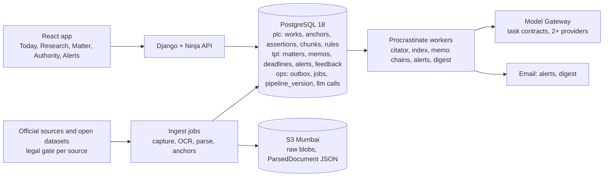

# 00 — MVP Spec: Corporate-Law Intelligence for One Partner Firm

**Status:** v1.0, 1 October 2026 (law as at this date).

**Assumptions:**
- **Team:** a technical founder, 1 full-stack engineer, and partner-firm lawyers at about 5 hours a week. The brief left the team blank; this is its own example.
- **Target:** partner lawyers using the product on real work within 4–5 months.
- **Plan:** 20 weeks.

**Reads with:** the blueprint (docs 00–25). This spec reuses its decisions and does not redesign them.

| Doc | Content |
|---|---|
| [01](01_corporate_corpus_and_sources.md) | Corpus and sources |
| [02](02_workflows_and_rules.md) | Workflows and rules |
| [03](03_data_model_and_contracts.md) | Data model and contracts |
| [04](04_stack_and_infra.md) | Stack and cost |
| [05](05_build_plan.md) | Build plan |
| [06](06_test_set_plan.md) | Gold set |
| [07](07_partner_firm_questions.md) | Partner questions |
| [08](08_cut_list_and_upgrade_path.md) | Cut list and upgrade path |
| [09](09_first_two_weeks.md) | First two weeks |

---

## 1. Summary

**What we build.** One deployment for one Indian corporate-law firm, covering **all 11 capabilities** of the product, over a **corporate-law corpus of about 175K documents**:
- Supreme Court;
- NCLAT;
- NCLT (IBC orders, through IBBI's mirror);
- Delhi and Bombay HC company, commercial and arbitration matters, plus the partner's HC;
- SEBI orders;
- SAT and CCI (thin);
- 16 Acts and about 60 rules and regulations;
- MCA, SEBI, IBBI and RBI feeds.

Corpus details are in [01](01_corporate_corpus_and_sources.md) §0.2 and §6.1. We make it buildable in two ways, and **never by dropping a capability**:
1. **Narrow the corpus** to corporate law, with IBC first.
2. **Simplify the infrastructure.** One Postgres database replaces Kafka, Temporal, OpenSearch and OpenFGA, with the same schemas and event names.

**Timeline:**

| Week | Milestone |
|---|---|
| 4 | First working demo: IBC research answers pinned to paragraphs |
| 8 | Notice → deadlines on a closed partner matter |
| 14 | Real work with 2–3 lawyers |
| 18 | All 11 capabilities live |
| 20 | Go/no-go scorecard |

**The arithmetic is tight.**
- **Capacity:** 29 engineer-weeks.
- **Planned scope:** 28 engineer-weeks, after cutting scope (not quality).
- **Realistic P50:** 21–22 weeks.
- What slips first, and what never slips, is fixed in [05](05_build_plan.md) §2.

**Cost.**
- **Running cost:** about **$2,000 a month (≈ ₹1.77 lakh)**: infrastructure ≈ $1,240 and models ≈ $750.
- **One-time backfill:** **≈ $5.9K–$7.9K**. Human review of treatments is extra.

See [04](04_stack_and_infra.md) §4.

**What the research changed in the brief.** Details are in [02](02_workflows_and_rules.md) §6 and [01](01_corporate_corpus_and_sources.md) §0.3.
1. **IBC (Amendment) Act 2026.** The 14-day period in s.7(4) dates from 2016. The change in force from 26.05.2026 is s.7(5): the Tribunal now "**shall** admit" (it used to be "may"), and no other ground for rejection is allowed. This legislatively closes the *Vidarbha* discretion. The same notification made information-utility filing **mandatory before a s.9 petition** (s.215(3)). Several further provisions are enacted but not in force, beyond the four the brief listed.
2. **Corporate Laws (Amendment) Bill 2026.** The joint committee reported on **3 Aug 2026**. The Bill is not passed: watchlist only.
3. **NCLT Rules fix no reply period.** r.37 says only "before the date of hearing", so reply dates are **order-set** and must be confirmed by a lawyer.
4. **Replaced instruments.** CCI (General) Regulations 2009 → 2024; FEMA compounding Rules 2000 → 2024. SEBI's new Settlement Regulations 2026 are approved but **not notified**.
5. **Source facts:**
   - NCLT Companies Act orders have **no open bulk route**.
   - The open SC dataset is the reported subset only.
   - SAT's site is effectively dark.
   - India Code moved to `indiacode.gov.in`; its full-Act PDF is the canonical text.
   - Indian Kanoon prints un-notified text as if in force, so it is **unsafe as a point-in-time source**.

**Top risks.** All are in §8.
- Lawful access to NCLT and SC material: we need a counsel opinion.
- Postgres keyword ranking (no BM25), tested in week 8.
- Statute text not yet re-anchored to the official source.
- Too little review time for the citator.
- A 3% schedule buffer.

## 2. What never gets cut

1. **Blueprint contracts, built at full fidelity from day 1** ([08](08_cut_list_and_upgrade_path.md) §1; [03](03_data_model_and_contracts.md) §7):
   - the paragraph anchor grammar v1.1, including private and schedule anchors;
   - `ParsedDocument`;
   - `identifier_alias` with trust tiers;
   - the bitemporal `Assertion` ledger with evidence and provenance;
   - `AuthorityView` (with `definitive` and `reason_codes`);
   - `EvidenceBundle`, `Claim` and `VerificationReport`;
   - `rights_class` and `provenance_tier`;
   - `pipeline_version` lineage;
   - index generations and aliases;
   - the Model Gateway (`ModelTaskContract`, `LLMCallRecord`);
   - the CloudEvents envelope and event names.
2. **Deadlines are rule-based only.** Every RuleSpec is either anchored to a statutory provision that a researcher read, or marked TO VERIFY. A rule computes dates only when it is ACTIVE, which requires all three of:
   - re-anchoring to the official text;
   - sign-off by a partner lawyer;
   - green golden vectors.

   The LLM may *extract* a trigger date, with a quote, for a lawyer to confirm. It never computes a deadline ([02](02_workflows_and_rules.md) §0–§2).
3. **Zero-tolerance gates** ([06](06_test_set_plan.md) §6):
   - the deadline suite at 100%;
   - no bad-law leaks on sentinels;
   - no fabricated anchors shown;
   - "enacted but not in force" and "Bill, not law" answered correctly 100% of the time.
4. **Honest statuses.**
   - A machine-detected negative treatment shows as CAUTION with `definitive=false`. It is never hidden and never shown as definitive (D6).
   - Confidence is shown as **"uncalibrated preview"**: verification statuses plus deterministic bands, with no probabilities (D9).
   - Every answer shows "law current to <date>" and discloses any degradation (D19.2).
5. **Legal gate.** No source runs without an approved legal profile, and no CAPTCHA is ever solved by a machine ([01](01_corporate_corpus_and_sources.md) D2).
6. **Untrusted documents stay data.** Opposing-party uploads carry `trust_label`. Extraction runs without tools and is validated by exact substring. No uploaded text can steer the workflow (13; 09_P7).

## 3. The corporate-law slice

| Forum or instrument | MVP route | Status |
|---|---|---|
| Supreme Court | Open SCR dataset (reported, ≈ 35K); homepage "latest" widget delta; INSC gap list for cited non-reported judgments | Non-reported judgments since 2023 are a known gap (01 R-2) |
| NCLAT | Display-board judgments and daily orders, via a session-token POST with no CAPTCHA | Depends on counsel opinion Q1.4 |
| NCLT | **IBBI order mirror** (31,792 NCLT IBC orders; 5,700 NCLAT; 844 SC; 612 HC), marked "not certified copies"; about a third need OCR; NCLT cause lists | Companies Act NCLT orders: **no open route**. Partner uploads plus a registry request (07 Q2.1) |
| Delhi and Bombay HC (+ the partner's HC) | Open HC dataset, near-daily for Delhi and Bombay, filtered to company, commercial and arbitration case types (≈ 45K + 22K) | `DATASET_ONLY` disclosure; own-site deltas after the MVP |
| SEBI / SAT / CCI | SEBI orders (24.4K in scope) + RSS; SAT thin (site 503; SEBI's mirror ends 2015); CCI optional (2.7K) | Permission emails in week 1 |
| Statutes | 16 Acts and about 60 rules and regulations from India Code PDFs (canonical) and regulator consolidations | **Point-in-time versions** for the IBC and the CIRP and Liquidation Regulations; current text with "law current to" elsewhere |
| Feeds | MCA notifications and circulars, SEBI circulars, IBBI circulars, RBI FEMA master directions, e-Gazette, PRS bill tracking | MCA returned 403 from the sandbox, so it is tested from India in week 1 |

**Size.** ≈ 175K documents, ≈ 1.9M pages, ≈ 0.8B tokens, ≈ 200–300 new documents a day. LLM enrichment is limited to ≈ 60–70K high-value documents ([01](01_corporate_corpus_and_sources.md) §6.1).

**Point-in-time test case.** The IBC (Amendment) Act 2026 (Act 6 of 2026; S.O. 2625(E) in force from 26.05.2026) is modelled provision by provision. Each provision is IN FORCE from 26.05.2026 or ENACTED, NOT IN FORCE ([02](02_workflows_and_rules.md) Part A §8). Its test suite is zero-tolerance.

## 4. Capability-by-capability scope

Every capability is in the MVP. "Thin" says exactly how thin; "Grows" says how it comes back without a rewrite.

### 4.1 Research Q&A, every claim pinned to a paragraph
- **In:**
  - Questions in English over the corpus.
  - Intents: citation lookup, provision lookup, research question, "cases interpreting provision X".
  - Hybrid retrieval: Postgres full-text + pgvector + a binding-authority filter + treatment expansion. The results go through rank fusion and an API reranker.
  - Answers are `Claim[]`, each claim with an anchor and an exact quote, verified before display: deterministic checks, plus a judge from a second provider.
  - A mandatory contrary-authority sweep, with "searched X, found no adverse authority" stated explicitly.
  - Click-to-source highlighting in a PDF viewer.
  - `as_of_legal_date` respected for the IBC.
- **Thin:**
  - No graph-ranking (PPR), HyDE or learned ranking.
  - Rank-fusion weights are hand-tuned.
  - The reranker is off the shelf.
  - Keyword ranking has no BM25 (04 §2.3).
- **Out:** Hindi; questions over district-court material.
- **Grows:** new index generations and an alias swap (08 §2, §6).
- **Options weighed:** (a) OpenSearch from day 1, at the blueprint's fidelity but with an extra cluster to run; (b) Postgres full-text + pgvector behind the same Index Access Layer. **Chose (b):** one database for two engineers. The week-8 test on partner queries decides whether to move to a BM25 extension or OpenSearch.
- **Acceptance:** G-QA, G-Claim (no fabricated anchors), G-Authority/Adverse (06 §5).

### 4.2 Authority status / citator: still good law? binds this forum?
- **In:**
  - Assertion ledger populated with:
    - citations (CITES);
    - **direct history** linked through appeal chains (NCLT → NCLAT → SC case numbers);
    - treatment (POSITIVE, DISTINGUISHES, DOUBTS, OVERRULES(_IN_PART), REFERS_TO_LARGER_BENCH, PER_INCURIAM) on citations to the **curated head**, the ≈ 300–500 most-cited and workflow-critical authorities;
    - statute events (AMENDS family, COMMENCES).
  - `AuthorityView` badges and binding-for-forum for SC, NCLAT, NCLT, the HCs and SAT, using the blueprint doctrine rules: Art. 141; HC superintendence; tribunal coordinate benches.
  - **NCLAT → NCLT binding is shown as `contested=true`** until a verified authority is recorded. The blueprint's table row 11 is a "structural inference". An NCLAT ruling reported by LiveLaw says stare decisis applies to both tribunals, but that is snippet-level only and is to be verified: [link](https://www.livelaw.in/ibc-cases/insolvency-and-bankruptcy-code-2016-nclat-nclt-190736).
- **Thin:**
  - Only the curated head gets reviewed treatment. The founder reviews tier-1 negatives in that head, with a partner lawyer for disputes.
  - Everything else is machine-detected: CAUTION, `definitive=false`.
  - Treatment is at work level, except for propositions extracted for the head.
  - No IBBI order is treated as a certified copy; each carries an "uncertified copy" badge.
- **Out:** a corpus-wide reviewed citator; proposition-level treatment everywhere.
- **Grows:** a part-time reviewer (05 §6) widens the head. A trained classifier comes after ≥ 3K adjudicated treatments (08 §5).
- **Options weighed:**
  - (a) Review everything: ≈ 5,400 tier-1 reviews at backfill, 2.5–6 reviewer-months.
  - (b) Show only unreviewed machine labels: violates D6.
  - (c) **Review the head and show the rest as honest CAUTION. Chosen.**
- **Acceptance:** sentinels with 0 leaks; G-Cite status checks.

### 4.3 Notice or petition → strategy memo
- **In:**
  - A deterministic job chain (S0 intake → S1 extraction → S2 deadlines → S3 issues → S4 per-issue evidence bundles, including the contrary sweep → S5 advocate claims → S6 one opposing-counsel pass + rebuttal → S7 evidence checklist → S8 composition → S9 verification).
  - The memo sections are the brief's eight core outputs plus uncertainties (02 §4).
  - Every adverse binding or persuasive item must be disposed of: distinguish, concede, or argue inapplicable. Otherwise the memo cannot PASS.
  - **3 triggers in full mode.** Default ranking: the IBC pack, arbitration, then s.241–242. The partner re-ranks in week 1.
  - Every other trigger runs in **general mode**, with the banner "no deadline guarantee".
- **Thin:**
  - Same model family for advocate and opponent.
  - No bench assessor.
  - No DEEP mode.
  - Manual "re-verify" button instead of automatic re-verification of living memos.
- **Out:** judge analytics; win probabilities (never).
- **Grows:**
  - A 4th trigger in week 19 (rules already drafted).
  - A bench assessor behind an A/B test.
  - Automatic re-verification on alerts (08 §6).
- **Options weighed:** (a) free-form multi-agent chat; (b) **a fixed job chain with hard budgets (the blueprint's choice). Chosen**, because it is cheaper to test, reproducible and auditable. (c) A single-prompt memo was rejected: no per-claim verification.
- **Acceptance:** G-Issue/Opponent, G-Adverse, G-Claim, G-Memo review on gold matters.

### 4.4 Deadlines and limitation (Procedural Clock)
- **In:**
  - A deterministic engine over RuleSpecs with nature HARD, CONDONABLE (with or without cap), DIRECTORY, ORDER-SET or PRACTICE.
  - Shared conventions (02 §3): General Clauses Act s.9; Limitation Act s.4 only for the base period; months by corresponding date; GCA s.10 for offices.
  - Manually seeded court calendars.
  - Lawyer confirmation of every trigger date.
  - A computed-by trace for each deadline.
  - Deadlines flow into the matter calendar and alerts.
- **Rules available now** (02 §1):
  - **IBC:** s.8(2) 10 days; s.9(1) earliest filing; s.61(2) 30 + 15; s.62 45 + 15; Art. 137 limitation; s.10A bar.
  - **Companies Act:** s.421(3) 45 + 45; s.423 60 + 60; RD appeal 60 days (HARD).
  - **SEBI:** settlement 60 days (HARD since 14.01.2022); SAT appeal 45 days (no cap); s.15Z 60 + 60.
  - **Arbitration:** s.34(3) 3 months + 30 days "but not thereafter"; s.37 60 days for commercial disputes.
  - **Commercial suits:** written statement forfeited after 120 days.
  - **Other:** FEMA; CCI; NI Act s.138.
- **Activation:** only after re-anchoring to India Code or Gazette text from an Indian network (the research sandbox could not reach them) and partner sign-off.
- **Thin:** activated rules only for the 3 full-mode triggers; general mode lists "statutory periods that may apply", uncomputed; calendars are entered manually.
- **Out:** automatic calendar feeds; district courts.
- **Grows:** promoting a trigger costs about 2–3 engineer-days and 1–2 lawyer-hours (02 §1); P0 calendar feeds land in the same table.
- **Options weighed:**
  - (a) LLM-computed deadlines: rejected by rule.
  - (b) A rules engine with no lawyer confirmation: rejected, because the trigger date is the commonest error (01 R-9: upload lag is misread as the order date).
  - (c) **A rules engine plus confirmed trigger dates. Chosen.**
- **Acceptance:** G-Deadline at 100% on activated rules.

### 4.5 Matter workspace
- **In:**
  - Upload of PDF (native or scanned), DOCX, EML and ZIP.
  - Tenant-mode parsing into private anchors (`pdoc_…/v1#p3`).
  - Extraction of parties (with CIN or PAN when present), dates with event types, amounts and the opponent's claims, each with an exact quote.
  - One-click lawyer confirmation. Only CONFIRMED facts count as record facts.
  - Timeline view.
  - Matter membership and roles, plus a `restricted` flag.
  - Audit log.
- **Thin:**
  - App-level permissions instead of OpenFGA.
  - Provider-managed encryption at rest instead of per-matter keys. This is a real reduction, flagged for the partner's security review (03 §8).
- **Out:** PST, WhatsApp, XLSX and audio; DMS connectors; Hindi.
- **Grows:** 08 §7; the `authz.can()` choke point is replaced by OpenFGA.
- **Options weighed:** (a) OpenFGA from day 1; (b) **one choke-point function over membership tables. Chosen**: one firm, with a clean swap later.
- **Acceptance:** G-Extract precision and recall per field.

### 4.6 Drafting help
- **In:**
  - DOCX export of a **reply skeleton**: header, preliminary objections with anchors, prayer, list of documents.
  - A **para-wise grid**: one row per paragraph of the incoming document, with an admit/deny/not-within-knowledge suggestion, linked memo claims and supporting anchors.
  - Trigger-specific skeletons for the full-mode triggers (02 Parts A–D).
- **Thin:** the firm's DOCX styles once provided (07 Q7.1); no clause library; no tracked changes.
- **Out:** Word add-in.
- **Grows:** an Office.js add-in (12_P10).
- **Options weighed:** (a) Word add-in first: higher adoption, but about 2 extra engineer-weeks. (b) **DOCX export. Chosen**: it fits the budget, and the add-in is the first re-entry item (08 §9).
- **Acceptance:** export used on gold matters; lawyer review of 5 grids.

### 4.7 Cite-check of our drafts and incoming orders
- **In:**
  - Upload of DOCX or PDF.
  - Extraction of case citations (SCC, AIR, SCR, INSC, HC neutral, NCLT/NCLAT case numbers) and statute citations.
  - Checks: exists, resolves, status as of the document date, binding for the forum, quote match, pinpoint, and provision in force on the document date (IBC 2026 traps).
  - Output is a `CitationAuditReport` with click-to-source.
- **Thin:** a citation outside the corpus is reported as **"not in MVP corpus"**, never as "wrong". A pinpoint match by page-span alone is never VERIFIED (D19.6).
- **Out:** in-Word cite-check.
- **Grows:** the add-in; an Indian Kanoon gap-fill once counsel clears it.
- **Options weighed:**
  - (a) Existence only, which is the market baseline and misses misgrounding.
  - (b) **Existence + status + quote + pinpoint + in-force. Chosen.**
- **Acceptance:** G-Cite seeded-error detection and false-flag rate.

### 4.8 Alerts: a new judgment, amendment or notification affects a live matter
- **In:**
  - A matter dependency index: authorities and provisions cited in memos, cite-checks and drafts; parties (name or CIN); case numbers.
  - Impact rows from new assertions: a reversal or negative treatment of a dependency; an amendment, commencement or notification touching a dependency provision; a new order in a watched case.
  - Matching inside the tenant scope, preserving the broadcast-and-match semantics (D3) even in one database.
  - Lifecycle PROVISIONAL → CONFIRMED → RETRACTED; the email and the in-app alert are updated in place.
  - The explanation quotes the anchors.
- **Thin:**
  - Depth-1 matching only.
  - Nightly AuthorityView recomputation.
  - No storm automation.
  - Corporate-law sources only.
- **Out:** WhatsApp, push, SMS.
- **Grows:** depth-2 propagation and automatic memo re-verification (08 §5–§6).
- **Options weighed:**
  - (a) Alerts only for direct history.
  - (b) **Direct history + reviewed negatives + amendments and notifications. Chosen**, because amendments drive most corporate-law alerts (e.g. the IBC 2026 notification).
  - (c) Everything machine-detected: alert fatigue.
- **Acceptance:** G-Alert time-travel drill (recall target 0.9) and the false-alert rate.

### 4.9 Daily corporate-law digest and watchlists
- **In:**
  - A 06:30 IST email plus an in-app page.
  - Contents: new SC, NCLAT, NCLT/IBBI and HC corporate decisions; MCA, SEBI, IBBI and RBI circulars and notifications; gazette commencements; bill tracker (the Corporate Laws (Amendment) Bill 2026 always labelled **BILL, not law**).
  - Deterministic per-user ranking by watches.
  - Watch types: STATUTE/PROVISION, TOPIC (saved query), PARTY (company name or CIN), COURT/forum.
  - One-line summaries are non-citable (`sum_`) and link to anchors.
- **Thin:** English only; no per-user LLM; no team watchlists.
- **Out:** judge watches (list-only pages come later; outcome statistics never).
- **Grows:** 12_P10.
- **Options weighed:** (a) LLM-written digest per user, which costs more and is harder to verify; (b) **one public edition, ranked per user. Chosen** (the blueprint's design).
- **Acceptance:** a first digest by week 17; precision feedback by thumbs.

### 4.10 Hearing / cause-list tracking
- **In:**
  - Manual entry of hearing dates per matter (forum, bench, item number, purpose).
  - Reminders, an ICS export, and a "court day" list on Today.
  - Next-date capture when an order in a watched case is ingested.
- **Thin:** SC, HC and SAT hearings are manual; no CNR sync.
- **Out:** eCourts feeds behind CAPTCHAs.
- **Grows:** source feeds (D20.1), and human-assisted capture if counsel clears it (07 Q1.6).
- **Options weighed:** (a) **manual entry only. Chosen for the protected plan.** (b) Manual entry plus parsing of the open NCLT/NCLAT cause-list PDFs against case numbers the firm enters (01 §6.2). This costs about 0.3 extra engineer-weeks, so it is a **week-19 stretch item** ([05](05_build_plan.md) week 19). It will be the first add-on if any buffer remains.
- **Acceptance:** hearings for all pilot matters entered and reminded.

### 4.11 Feedback capture
- **In:**
  - Accept, reject, correct and reason chips on claims, evidence items, badges, deadlines, alerts and digest items.
  - "Used in filing" marker.
  - `FeedbackEvent` and `retrieval.served` logs, tenant-only.
  - Weekly founder triage. A correction to a public-law fact becomes a review task.
- **Thin:** no learning loop, Privacy Gate or reranker training.
- **Grows:** 11_P9, once at least 2 firms exist.
- **Options weighed:** (a) train from day 1, which is premature with too little data; (b) **log now, learn later. Chosen.**
- **Acceptance:** feedback widgets on every surface; ≥ 50 events in the pilot.

## 5. Trigger types and modes

All 20 candidate trigger IDs from the brief have researched rule packs: IBC, Companies Act/LLP, SEBI/SAT, competition, FEMA, arbitration, commercial suits, contract notices and NI Act s.138 ([02](02_workflows_and_rules.md) §1, Parts A–D). The partner ranks them in week 1 (07 Q2).
- The **top 3 run in full mode**: active rules, trigger templates, reply skeleton, and 5–6 gold matters each.
- The **rest run in general mode**: no deadline guarantee; applicable periods listed but not computed.
- **Default ranking:** IBC pack → arbitration → s.241–242 → SEBI.
- **Caveat on s.241–242:** this trigger relies on NCLAT, SC and HC material plus partner-supplied NCLT orders, because NCLT Companies Act orders have no open route.

## 6. Architecture (simplified, same contracts)

| Blueprint component | MVP equivalent (same schema and event names) | Why this one (options) | Upgrade |
|---|---|---|---|
| Kafka + Debezium | Postgres outbox + Procrastinate | Kafka for 200–300 docs a day is operational overhead with no benefit | Outbox relay to Kafka (08 §2) |
| Temporal | Resumable job chains with idempotency keys | DBOS was the runner-up; Temporal's cluster is too much for two people | Wrap steps as activities |
| OpenSearch | Postgres FTS + pgvector `halfvec` HNSW behind the Index Access Layer | ParadeDB is AGPL; pg_textsearch can't run on RDS (04 §2.3) | Index Access Layer backend swap at the week-8 test or at ~10M vectors |
| OpenFGA | `authz.can()` + membership + restricted flag + RLS | One firm | OpenFGA tuples |
| Tenant cells | One deployment, `tenant_id` on every `tpl` row, `plc`/`tpl` schemas | — | RLS + partitions for a pooled deployment |
| Calibrated bands | "Uncalibrated preview" statuses and deterministic bands | Calibration needs ≈ 1.5–2K adjudicated claims | Isotonic/conformal calibration |

**Stack:** Python 3.13 + Django 5.2 LTS, React 19 + TypeScript, RDS PostgreSQL 18 with pgvector, S3, Procrastinate, Voyage embeddings and reranker, Amazon Textract (English), and Anthropic, OpenAI and Google behind the gateway. Residency stays a partner question (07 Q3).

## 7. Plan and cost (summary)

- **Plan:** see [05](05_build_plan.md).
  - Weeks 1–4: platform, IBC corpus, Q&A demo.
  - Weeks 5–8: citator, matter workspace, Procedural Clock.
  - Weeks 9–13: memo, verification, cite-check, feedback, hardening.
  - **Week 14: pilot.**
  - Weeks 15–18: triggers 2–3, drafting, alerts, digest, watchlists, hearings, corpus breadth.
  - Weeks 19–20: fixes and go/no-go.
- **Lawyer time:** ≈ 56–60 of the budgeted ≈ 100 hours ([05](05_build_plan.md) §7).
- **Cost:** see [04](04_stack_and_infra.md) §4.
  - **≈ $2,008 a month**: infra $1,238, models $750, OCR and embeddings $20.
  - **Per unit:** ≈ $0.137 per Q&A, ≈ $2.95 per memo, ≈ $0.215 per cite-check. This is above the blueprint because verification uses a second model family.
  - **One-time:** ≈ $5.9K–$7.9K. Run bulk enrichment before 31.12.2026, when one model's price doubles.
  - **Treatment review:** $1.8K–$8.6K of reviewer time.

## 8. Red-team: could this team build it, and where does it break?

| Attack | Finding | Response |
|---|---|---|
| Is 20 weeks real? | 29 engineer-weeks of capacity against 28 planned leaves a 3% buffer; P50 is 21–22 weeks | Slip order is fixed: trigger 3 to general mode, then SAT/CCI corpus, then watch types. Zero-tolerance gates never slip (05 §2). A second engineer gives 4 triggers and a ≈ 20% buffer (05 §5). |
| The founder's 40% non-engineering time | Gold set ≈ 95–110 h, legal profiles, rule re-anchoring, review of the head | A part-time law-graduate reviewer (05 §6) recovers ≈ 2 weeks; recommended, not assumed |
| Access is blocked or ruled unlawful | NCLT Companies Act orders, SC search and SAT are CAPTCHA-gated; permission policies at SEBI, CCI, Delhi HC, NCLT and NCLAT | Counsel opinion by week 3. Profiles stay PROVISIONAL. IBC-first corpus via the IBBI mirror. Partner uploads. Never solve CAPTCHAs. |
| Deadline wrong | Errors come from rules (anchoring), facts (trigger date) or calendars | Re-anchor plus sign-off; lawyer-confirmed trigger dates; manual calendars with the raw date and weekday shown; 100% golden vectors |
| "Overruled yesterday" | No pronouncement watch; nightly recompute; CAPTCHA on SC search | SC widget polled every 30 minutes; NCLAT warm polling; "law current to" on every answer; time-travel drill |
| Bad OCR on IBBI copies (about one-third image-only) | Quotes may not match | `ocr_conf` per anchor; low-confidence anchors cannot back tier-1 claims; "uncertified copy" badge |
| Hindi order or notice | Out of scope | Flagged `lang_unsupported` and excluded from answers, with a banner (08 §3) |
| Prompt injection in an opponent's petition | Hidden text could steer the workflow | trust labels; tool-free extraction; exact-substring validation; hidden-text flag on PDFs; deterministic workflow |
| Keyword ranking without BM25 fails | Retrieval misses | Week-8 test against a BM25 reference on partner queries; triggers defined in 04 §2.3 |
| Law changes mid-pilot (Corporate Laws Bill passed; SEBI 2026 Settlement Regs notified) | Rules go stale | Gazette and PRS watch; the point-in-time machinery built for the IBC is reused; RuleSpec versions use `valid_from` |
| A confused user treats a CAUTION badge as a ruling | Over-reliance | Badges state machine-detected vs verified; memos list withheld and unverified items; export only VERIFIED/PARTIAL |

## 9. Final check

| Question | Answer |
|---|---|
| Are all 11 capabilities in the MVP, each with a defined scope? | **Yes.** §4.1–§4.11, each with In, Thin, Out, Grows, Options and Acceptance. |
| Could the stated team build it in the stated time? | **Just.** 28 planned vs 29 available engineer-weeks; P50 is 21–22 weeks; the slip order and sensitivities are in [05](05_build_plan.md) §1–§5. With a second engineer it is comfortable. |
| Is every deadline rule anchored or explicitly marked "to verify"? | **Yes.** Every rule in [02](02_workflows_and_rules.md) carries VERIFIED-PRIMARY, VERIFIED-SECONDARY or TO VERIFY, with quoted text. Only re-anchored, signed-off rules activate. The consolidated open list is 02 §5. |
| Does every simplification keep the blueprint's contracts? | **Yes, except where noted.** [03](03_data_model_and_contracts.md) §7 maps each contract to its implementation and upgrade path. The deliberate reductions are listed in 03 §8: no BM25; shared database for public and tenant planes; no per-matter keys; uncalibrated confidence. |
| Is every legal or factual claim cited or marked unverified? | **Yes.** The research docs (01, 02, 04) carry tagged references (`verified`/`snippet`/`unverified`). This spec cites them by section. Snippet-level items (e.g. NCLAT stare decisis, the COVID exclusion) are labelled as such. |
