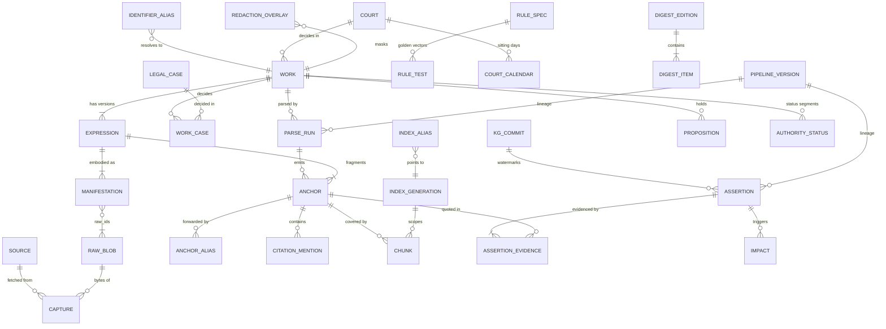

# MVP 03: Data Model and Contracts (one PostgreSQL database)

**Scope.** This document is the MVP data model for the corporate-law design-partner deployment. It covers every table: its purpose, concise DDL, the blueprint contract it implements, what is simplified and the upgrade path. It keeps the blueprint's *contracts*: identifiers, the anchor grammar, object shapes, event names and envelope fields. It replaces the blueprint's *infrastructure* (Kafka, Temporal, OpenFGA, OpenSearch, per-tenant cells) with one PostgreSQL 18 database, a Postgres job queue and application-level permissions. Stack choices and costs are in [04_stack_and_infra.md](04_stack_and_infra.md).

**Normative sources.**
- [01_master_architecture.md](../01_master_architecture.md): §5 (IDs, anchor EBNF, aliases), §6 (events), §7 (objects), §9 (APIs).
- [01a_spine_decision_record.md](../01a_spine_decision_record.md): rulings D1–D23.
- Phase DDL that this document condenses: 03_P1 §2.3, 05_P3 §5.3, 04_P2 §2.2, 08_P6 §5.4–5.5, 09_P7 §2.3 and 12_P10 §2.3.

Where this document and the blueprint differ on a *shape*, the blueprint wins and this document is the bug.

---

## 0. Sizing assumptions (used for every capacity number below)

| Assumption | Value |
|---|---|
| Deployment | One partner firm (corporate practice), one D2-style dedicated deployment (D17); `ten_` = 1 |
| Users | 15–30 lawyers |
| Load | 50–150 research queries/day; 5–20 strategy memos/week; 20–60 active matters |
| Public corpus | ~100–200K documents. Covers: SC corporate/IBC/arbitration subset; NCLAT; NCLT IBC orders via IBBI; Delhi, Bombay and partner-HC company/commercial/arbitration subsets; SAT/SEBI/CCI orders; ~20 Acts + ~20 Rules/Regulations; MCA/SEBI/IBBI/RBI-FEMA circulars |
| Anchors | ~3–5M paragraph/provision anchors |
| Currency | ₹88 = $1 |

| Table | Rows (planning estimate) | Notes |
|---|---|---|
| `plc.anchor` | 3–5M | text kept in-row (~0.6–1 KB) → 3–5 GB |
| `plc.chunk` (per live generation) | 1.5–5M | sized at 5M; `halfvec(1024)` ≈ 2 KB/row → ~10 GB heap + ~11–13 GB HNSW (04 §2.4) |
| `plc.citation_mention` | ~1–1.6M | 150K docs × ~8 mentions |
| `plc.assertion` | ~1.5–2.5M versions | CITES + treatment + provision edges |
| `tpl.*` | < 1M rows in total | 20–60 matters, a few thousand private documents |
| `ops.llm_call_record` | ~30–60K/month | partitioned monthly |
| `ops.event_outbox` | ~0.5–1M/month during backfill, ~50K/month steady | 90-day retention |

---

## 1. Conventions

1. **Three schemas, one database.**
   - `plc`: the Public Legal Corpus. It has no `tenant_id`, and no row may reference a tenant ID (09_P7 §2.3.4 invariant).
   - `tpl`: the tenant plane. **Every row carries `tenant_id NOT NULL`.** FORCE ROW LEVEL SECURITY is on (§6).
   - `ops`: events, jobs, Model Gateway and lineage. `tenant_id` is nullable and paired with `dataclass`.

   Separate DB roles enforce the boundary:
   - `plc_writer` cannot read `tpl`.
   - `app_rw` reads `plc` and reads/writes `tpl` under RLS.
   - `worker` has `BYPASSRLS` but must set `app.purpose`.

   This keeps D3's rule (PLC never learns tenant interest) inside one database.
2. **IDs** follow the 01 §5.2 registry exactly (`prefix_` + 26-char Crockford ULID, ASCII). They are minted in the application and checked by a coarse `CHECK`. Registries keep their mnemonics (`crt_IN_SC`, `rul_IN_PREC_07`). The only content address is `sha256:`.
3. **Anchors.** The full EBNF (01 §5.3, grammar v1.1 per D22.2) is implemented once, in `anchor_lib` (Python, property-tested against every 01 §5.3 example). The library also enforces semantic constraints A1–A8 and computes `canonical_key()`. The DB adds coarse regex `CHECK`s so that malformed strings cannot be stored:
   ```sql
   -- public_anchor | provision_ref | pit_ref   (coarse; anchor_lib is authoritative)
   CREATE DOMAIN public_anchor_ref AS text CHECK (VALUE ~
     '^wrk_[0-9A-HJKMNP-TV-Z]{26}(/[a-z]{2,3}(\.r[1-9][0-9]*|@[0-9]{4}-[0-9]{2}-[0-9]{2}(~IN(-[A-Z]{2,3})?)?)?)?#[a-z0-9][A-Za-z0-9.\-]*(@[0-9]{4}-[0-9]{2}-[0-9]{2}(~IN(-[A-Z]{2,3})?)?)?$');
   -- private_anchor: pdoc_…/v2[.mt-en|.ht-en]#[att1/]fragment
   CREATE DOMAIN private_anchor_ref AS text CHECK (VALUE ~
     '^pdoc_[0-9A-HJKMNP-TV-Z]{26}/v[1-9][0-9]*(\.(mt|ht)-[a-z]{2,3})?#(att[1-9][0-9]*/)?[A-Za-z0-9.:\-]+$');
   CREATE DOMAIN any_anchor_ref AS text CHECK (VALUE ~ '^(wrk|pdoc)_[0-9A-HJKMNP-TV-Z]{26}[/#]');
   ```
4. **Time.** Legal (valid) time is `daterange valid_period` `[from, to)`. System (belief) time is `tstzrange tx_period` `[recorded_at, superseded_at)`. "Current" means `upper_inf(tx_period)`. `as_known_at = K` reads use `tx_period @> K` (05_P3 §5.3).
5. **Lineage.** Every derived row carries `pipeline_version`, a FK to `ops.pipeline_version` in the D10 form.
6. **Durable records store anchors, never `chunk_id`s** (D8, 04_P2 R1). They also store `quote_selector`, so records can be re-anchored (01 §5.5-7).
7. **JSON vs columns.** A field becomes a column when we filter, join or constrain on it. Everything else stays in `jsonb` under its blueprint name, so a later split into services can serialise rows straight into the 01 §7 interfaces.
8. **Extensions** (all on the RDS PostgreSQL 18 extension list; see 04 §2.3): `vector`, `btree_gist`, `pg_trgm`, `unaccent`, `pg_partman`.

```sql
CREATE EXTENSION vector; CREATE EXTENSION btree_gist; CREATE EXTENSION pg_trgm; CREATE EXTENSION unaccent;
CREATE SCHEMA plc; CREATE SCHEMA tpl; CREATE SCHEMA ops;
```

---

## 2. ER overview

### 2.1 Public plane (`plc`) and index/lineage



### 2.2 Tenant plane (`tpl`) and operations (`ops`)

```mermaid
erDiagram
  TENANT ||--o{ APP_USER : "employs"
  TENANT ||--o{ MATTER : "owns"
  MATTER ||--o{ MATTER_MEMBER : "grants"
  APP_USER ||--o{ MATTER_MEMBER : "holds"
  MATTER ||--o| ETHICAL_WALL : "walled by"
  MATTER ||--o{ PDOC : "contains"
  PDOC ||--|{ PDOC_VERSION : "versions"
  PDOC_VERSION ||--o{ PRIVATE_ANCHOR : "fragments"
  MATTER ||--o{ PROCEDURAL_EVENT : "records"
  MATTER ||--o{ HEARING : "listed on"
  MATTER ||--o{ DEADLINE : "tracks"
  MATTER ||--o{ MATTER_DEPENDENCY : "depends on public ids"
  MATTER ||--o{ MATTER_ALERT : "receives"
  MATTER ||--o{ MATTER_CONTEXT_SNAPSHOT : "versioned as"
  MATTER ||--o{ RESEARCH_QUERY : "asks"
  RESEARCH_QUERY ||--o| EVIDENCE_BUNDLE : "answered with"
  JOB_CHAIN ||--|{ JOB_STEP : "runs"
  JOB_CHAIN ||--o| STRATEGY_MEMO : "publishes"
  STRATEGY_MEMO ||--|{ CLAIM : "sections"
  STRATEGY_MEMO ||--o{ DRAFT_ARTIFACT : "drafts"
  CLAIM ||--o{ CLAIM_VERIFICATION : "checked in"
  VERIFICATION_REPORT ||--|{ CLAIM_VERIFICATION : "contains"
  MATTER ||--o{ CITATION_AUDIT_REPORT : "audits"
  APP_USER ||--o{ WATCHLIST : "owns"
  WATCHLIST ||--|{ WATCH_RULE : "contains"
  WATCH_RULE ||--o{ WATCH_HIT : "fires"
  APP_USER ||--o{ USER_DIGEST : "receives"
  APP_USER ||--o{ FEEDBACK_EVENT : "gives (pseudonymised)"
  CONSENT_RECORD ||--o{ FEEDBACK_EVENT : "stamped on"
  EVENT_OUTBOX ||--o{ EVENT_INBOX : "processed by consumers"
  MODEL_TASK_CONTRACT ||--o{ LLM_CALL_RECORD : "executed as"
  MODEL_ENDPOINT ||--o{ LLM_CALL_RECORD : "served by"
```



---

## 3. Tables

Every group below ends with the same four notes: **Contract** (blueprint section/ruling) · **Simplified** · **Upgrade**.

### 3.1 Lineage: `ops.pipeline_version`

```sql
CREATE TABLE ops.pipeline_version (           -- one row per distinct D10 tuple; referenced by every derived row
  pipeline_version text PRIMARY KEY,          -- canonical D10 string: component@semver|model_id|snapshot|endpoint_region|prompt_hash
  component text NOT NULL, semver text NOT NULL,
  model_id text, model_snapshot text, endpoint_region text, prompt_hash text,
  code_sha text NOT NULL, created_at timestamptz NOT NULL DEFAULT now());
```

- **Contract:** D10 (`pipeline_version` = component@semver + model_id + model_snapshot + endpoint_region + prompt_hash); 01 §11.4.
- **Simplified:** OpenLineage is not deployed. Lineage is a SQL join: `parse_run → anchor → chunk → assertion → claim → verification_report`.
- **Upgrade:** emit OpenLineage run events from the job chain (§5) without changing the key.

### 3.2 Sources and raw captures (P0)

```sql
CREATE TABLE plc.source (                     -- registry of crawled/ingested portals
  source_id text PRIMARY KEY,                 -- e.g. IBBI_NCLT_ORDERS, SCI_JUDGMENTS, NCLAT, BHC_COMM, SEBI_ORDERS, INDIACODE, MCA_CIRC
  name text NOT NULL, base_url text, provenance_tier text NOT NULL,   -- OFFICIAL_PRIMARY|OFFICIAL_AGGREGATOR|OPEN_DATASET|LICENSED_THIRD_PARTY|PARTNER_CONTRIBUTED
  default_rights_class text NOT NULL,         -- OFFICIAL|OPEN_LICENSED|THIRD_PARTY_LINK_ONLY|LICENSED_RESTRICTED|USER_UPLOADED (D9)
  terms_ref text, hotness text CHECK (hotness IN ('HOT','WARM','COOL')), schedule_cron text, enabled boolean DEFAULT true);
CREATE TABLE plc.raw_blob (                   -- content-addressed bytes in S3 (Object Lock)
  raw_id text PRIMARY KEY CHECK (raw_id ~ '^sha256:[0-9a-f]{64}$'),
  storage_uri text NOT NULL, byte_size bigint NOT NULL, content_type text, first_seen_at timestamptz NOT NULL);
CREATE TABLE plc.capture (                    -- one fetch observation = the raw.captured.v1 payload
  capture_id text PRIMARY KEY,                -- cap_
  raw_id text NOT NULL REFERENCES plc.raw_blob, source_id text NOT NULL REFERENCES plc.source,
  source_record_key text NOT NULL, url text, fetched_at timestamptz NOT NULL,
  change_kind text NOT NULL CHECK (change_kind IN ('NEW','CHANGED','UNCHANGED','DELETED','REAPPEARED','METADATA_CHANGED','SUPPRESSED')),
  prior_raw_id text, source_metadata jsonb NOT NULL DEFAULT '{}',   -- as published, never "corrected"
  rights_class text NOT NULL, provenance_tier text NOT NULL, fetch_context jsonb, flags jsonb, crawl_run_id text);
CREATE INDEX ON plc.capture (source_id, source_record_key, fetched_at DESC);
CREATE TABLE plc.source_health (              -- source.health.v1 history; latest row per source feeds Freshness
  source_id text REFERENCES plc.source, observed_at timestamptz,
  status text CHECK (status IN ('OK','DEGRADED','DOWN','BLOCKED')), freshness_lag_p95_min int,
  last_success_at timestamptz, coverage_estimate real, expected_pending int, incident_id text,
  PRIMARY KEY (source_id, observed_at));
```

- **Contract:** `raw.captured.v1` (01 §6.3; D16); `source.health.v1` (01 §6.4); `rights_class` and `provenance_tier` (D9, D20.14).
- **Simplified:**
  - There is no WARC capture and no `norm_fingerprint`/`near_dup_hint` machinery. Near-duplicate detection is a simhash column computed in the parser.
  - Crawl runs are Procrastinate periodic tasks, not Temporal schedules.
  - There are no access-mode adapters beyond OPEN and PARTNER_CONTRIBUTED.
- **Upgrade:** add `warc jsonb` and `norm_fingerprint` columns; move captures to the P0 service once the source count is greater than ~30.

### 3.3 Work identity, expressions, aliases (P1)

```sql
CREATE TABLE plc.court (                      -- court/bench-seat registry (crt_ mnemonics) + hierarchy for binding_on_forum
  court_id text PRIMARY KEY,                  -- crt_IN_SC, crt_IN_NCLAT, crt_IN_NCLT_MUM, crt_IN_HC_BOM, crt_IN_SAT …
  level text NOT NULL CHECK (level IN ('SC','HC','TRIBUNAL_APPELLATE','TRIBUNAL','DISTRICT','REGULATOR')),
  parent_ids text[] NOT NULL DEFAULT '{}', territory text, binding_scope_tags text[] NOT NULL,   -- e.g. {ALL_INDIA} | {STATE:IN-MH} | {TRIBUNAL:NCLT-ALL}
  valid_period daterange NOT NULL DEFAULT '[1950-01-26,)', meta jsonb);
CREATE TABLE plc.work (                       -- FRBR Work; P1 is the sole writer of identity (D20.4)
  work_id text PRIMARY KEY CHECK (work_id ~ '^wrk_[0-9A-HJKMNP-TV-Z]{26}$'),
  work_type text NOT NULL,                    -- JUDGMENT|FINAL_ORDER|INTERIM_ORDER|ACT|RULE|REGULATION|NOTIFICATION|CIRCULAR|CONSTITUTION|…
  status text NOT NULL CHECK (status IN ('ACTIVE','PROVISIONAL','STUB','EXPECTED','MERGED')),
  merged_into text REFERENCES plc.work, court_id text REFERENCES plc.court, decision_date date, title text,
  bench_strength smallint, access_restriction jsonb,          -- {name_search_suppressed[], masked_expression_required, court_prohibition} (D16)
  integrity_flags text[] NOT NULL DEFAULT '{}',               -- single writer = kg module (D23.4)
  created_at timestamptz NOT NULL DEFAULT now());
CREATE INDEX work_title_trgm ON plc.work USING gin (title gin_trgm_ops);
CREATE TABLE plc.legal_case (
  case_id text PRIMARY KEY, court_id text REFERENCES plc.court, case_type text, number text, year int,
  cnr text UNIQUE, diary_no text, status text, merged_into text);
CREATE TABLE plc.work_case (work_id text REFERENCES plc.work, case_id text REFERENCES plc.legal_case,
  role text CHECK (role IN ('LEAD','CONNECTED','TAGGED')), PRIMARY KEY (work_id, case_id));
CREATE TABLE plc.expression (                 -- language/corrigendum (judgment) or lang@date~territory (statute) version
  work_id text REFERENCES plc.work, expression_key text,
  lang text NOT NULL, rev int, valid_from date, valid_to date, territory text,
  authoritative boolean NOT NULL, derived boolean NOT NULL DEFAULT false,
  verification text CHECK (verification IN ('ROUNDTRIP_OK','UNVERIFIED')), translation_of text,
  authority_basis text CHECK (authority_basis IN ('ORIGINAL','OLA_S7_HC_TRANSLATION','COURT_PUBLISHED_TRANSLATION','OFFICIAL_CONSOLIDATION','RECONSTRUCTED')),
  PRIMARY KEY (work_id, expression_key));
CREATE TABLE plc.manifestation (
  manifestation_id text PRIMARY KEY, work_id text NOT NULL, expression_key text NOT NULL,
  source_id text REFERENCES plc.source, url text, raw_ids text[] NOT NULL,
  rights_class text NOT NULL, provenance_tier text NOT NULL,
  first_seen timestamptz, withdrawn_at timestamptz, suppressed_at timestamptz,
  FOREIGN KEY (work_id, expression_key) REFERENCES plc.expression);
CREATE TABLE plc.identifier_alias (           -- natural keys → targets, with trust tiers
  scheme text NOT NULL,                       -- NEUTRAL_INSC|NEUTRAL_HC|SCC|AIR|SCC_ONLINE|CNR|SC_DIARY_NO|CASE_NO|INDIA_CODE_ACT_ID|GAZETTE_ID|IBBI_ORDER_ID…
  value_normalized text NOT NULL, target_id text NOT NULL, confidence real NOT NULL, source text NOT NULL,
  trust_tier text NOT NULL CHECK (trust_tier IN ('T0','T1','T2','T3','T4')),
  status text NOT NULL CHECK (status IN ('PENDING','ACTIVE','CONFLICT','REJECTED','SUPERSEDED')),
  first_seen timestamptz NOT NULL, evidence jsonb NOT NULL DEFAULT '{}',
  CHECK (scheme NOT IN ('URL','CITATION_STRING')),           -- request-only schemes are never stored (01 §5.4)
  PRIMARY KEY (scheme, value_normalized, target_id));
CREATE UNIQUE INDEX alias_one_active ON plc.identifier_alias (scheme, value_normalized) WHERE status = 'ACTIVE';
CREATE TABLE plc.identity_merge_ledger (      -- identity.merged.v1 / identity.split.v1 source of truth
  event_id text PRIMARY KEY, kind text CHECK (kind IN ('WORK','CASE','ALIAS')), op text CHECK (op IN ('MERGE','SPLIT')),
  from_id text NOT NULL, to_id text NOT NULL, reason text, confidence real, reversible_until timestamptz, recorded_at timestamptz NOT NULL);
```

- **Contract:**
  - 01 §5.1 (FRBR levels, Work status, `access_restriction`, `integrity_flags`).
  - 01 §5.4 `identifier_alias` (one ACTIVE row per `(scheme, value)`; trust tiers T0–T4; "a third-party alias never overrides a T0 alias"; frozen merges on conflicting clusters).
  - D16, D19.5, D20.4.
- **Simplified:**
  - The merge rule "T3/T4 never overrides T0" is enforced in `alias_service.upsert()` with a test, not with a DB trigger.
  - Union-find cluster freezing is a `CONFLICT` status plus a review task.
  - The `court` table doubles as P3's court registry; there are no separate `bnc_`/`jdg_` tables (coram stays in ParsedDocument `metadata.coram`).
- **Upgrade:** add `bench`/`judge` tables once judge watches matter; partition `identifier_alias` by scheme beyond ~50M rows.

### 3.4 ParsedDocument and anchors (P1)

**ParsedDocument stays exactly the 01 §7.1 JSON object.** It is written gzip-compressed to S3 at `parsed/{work_id}/{expression_key}/{parse_id}.json.gz`; private documents go to `tpl/{tenant}/{matter}/parsed/{pdoc_id}/{pver}.json.gz` under SSE-KMS. Postgres holds the run record and one row per anchor.

```sql
CREATE TABLE plc.parse_run (                  -- one parse = one doc.parsed.v1
  parse_id text PRIMARY KEY CHECK (parse_id ~ '^par_[0-9A-HJKMNP-TV-Z]{26}$'),   -- par_ (D20.5), never prs_
  raw_ids text[] NOT NULL, manifestation_id text REFERENCES plc.manifestation,
  work_id text NOT NULL REFERENCES plc.work, work_id_status text CHECK (work_id_status IN ('RESOLVED','PROVISIONAL')),
  expression_key text NOT NULL, doc_type text NOT NULL,
  parsed_doc_uri text NOT NULL, parsed_doc_sha256 text NOT NULL,
  quality jsonb NOT NULL,                     -- {ocr_conf, structure_conf, rr_mean_conf, lang[], gate, gate_reasons[], hidden_text_flags[], …}
  gate text NOT NULL CHECK (gate IN ('PASS','FLAGGED','QUARANTINED')),
  anchor_changes jsonb NOT NULL,              -- {preserved, aliased, tombstoned, new}
  supersedes_parse_id text REFERENCES plc.parse_run, rights_class text NOT NULL, provenance_tier text NOT NULL,
  pipeline_version text NOT NULL REFERENCES ops.pipeline_version, cost_usd numeric(10,5), created_at timestamptz NOT NULL);
CREATE TABLE plc.anchor (                     -- the unit every claim traces to; never deleted, never reused
  anchor_id public_anchor_ref PRIMARY KEY,    -- wrk_…/en#p45 | wrk_…/en@2016-12-01#sec-7.1
  work_id text NOT NULL REFERENCES plc.work, expression_key text NOT NULL, fragment text NOT NULL,
  node_type text NOT NULL, number_as_printed text, numbering text CHECK (numbering IN ('EXPLICIT','SYNTHETIC')),
  text text NOT NULL,                         -- unmasked original; reads apply plc.redaction_overlay (masked rendition)
  text_hash text NOT NULL,                    -- xxh3 of normalised text
  quote_prefix text, quote_suffix text,       -- quote_selector
  spans jsonb NOT NULL DEFAULT '[]',          -- [{page, bbox[4], char_range[2]}]
  rhetorical_role jsonb,                      -- {label, fine, confidence, source}
  speaker text, opinion_role text CHECK (opinion_role IN ('MAJORITY','CONCURRING','DISSENT','REFERENCE_ORDER','UNKNOWN')),
  ocr_conf real, lang text NOT NULL, is_authoritative_expression boolean NOT NULL,
  state text NOT NULL DEFAULT 'LIVE' CHECK (state IN ('LIVE','TOMBSTONED')), forward_to text,
  first_parse_id text NOT NULL, last_parse_id text NOT NULL);
CREATE INDEX ON plc.anchor (work_id, expression_key);
CREATE TABLE plc.anchor_alias (old_anchor text, new_anchor text,
  method text CHECK (method IN ('NUM_EQ','HASH_EQ','NW_ALIGN','SPLIT','MERGE','RENUMBER','GRAMMAR_V11')),
  confidence real, parse_id text, recorded_at timestamptz NOT NULL, PRIMARY KEY (old_anchor, new_anchor));
CREATE TABLE plc.citation_mention (           -- cm_; resolution result of CitationMention (01 §7.1)
  mention_id text PRIMARY KEY, parse_id text NOT NULL REFERENCES plc.parse_run, citing_work_id text NOT NULL,
  anchor_id text NOT NULL, raw_text text NOT NULL, mention_kind text NOT NULL, scheme text, normalized text,
  pin jsonb,                                  -- {kind, value, cited_anchor, method SAME_NUMBERING|QUOTE_ALIGN|PAGE_SPAN_ALIGN|UNRESOLVED, confidence}
  resolved_target_id text, resolution_confidence real, resolution_method text,
  temporal_check text CHECK (temporal_check IN ('OK','CITED_AFTER_CITING','UNKNOWN')));
CREATE INDEX ON plc.citation_mention (resolved_target_id);
CREATE TABLE plc.redaction_overlay (          -- doc.redacted.v1 data; canonical field list 01 §7.13
  overlay_id text PRIMARY KEY,                -- ovl_
  work_id text NOT NULL, expression_key text,
  scope text CHECK (scope IN ('WORK','EXPRESSION','ANCHOR_SPANS')),
  kind text CHECK (kind IN ('SUPPRESS_ALL','MASK_SPANS','NAME_SEARCH_SUPPRESSED','COURT_PROHIBITION')),
  spans jsonb NOT NULL DEFAULT '[]', legal_basis jsonb NOT NULL, ordered_by text, effective_at timestamptz NOT NULL,
  purge_sla jsonb NOT NULL, valid_period daterange NOT NULL, tx_period tstzrange NOT NULL,
  review_state text CHECK (review_state IN ('PENDING_REVIEW','VERIFIED')));
CREATE TABLE plc.redaction_ack (overlay_id text REFERENCES plc.redaction_overlay,
  consumer text,                              -- P1|P2|P3|P5|P7|P10 module names; one deployment = one "cell"
  applied_at timestamptz NOT NULL, generations_purged text[], PRIMARY KEY (overlay_id, consumer));
```

- **Contract:**
  - 01 §5.3 anchor grammar, unchanged, including private anchors and grammar v1.1 `sch-1.ord-8.rule-1` (D22.2).
  - 01 §5.5 stability rules: tombstone + `forward_to`; `anchor_alias`; the 0.5% release canary.
  - 01 §7.1 ParsedDocument; §9.2 Anchor Read API fields; D8, D16, D19.6, D20.3.
- **Simplified:**
  - Anchor text is kept in the row (the blueprint keeps it only in ParsedDocument), so the Anchor Read API and P8 quote checks need no S3 read.
  - There is no hash partitioning.
  - `StatuteMention`/`AmendmentInstruction` live only inside ParsedDocument; their results surface as `CITES_PROVISION`/`AMENDS` assertions.
  - Redaction acks come from in-process consumers.
- **Upgrade:** partition `anchor` by `HASH(work_id)` beyond ~50M rows; serve the Anchor Read API from its own service with the same paths (01 §9.2).

### 3.5 Index generations, aliases and chunks (P2)

```sql
CREATE TABLE ops.index_generation (           -- immutable, versioned projection of anchors into retrieval units
  index_family text NOT NULL CHECK (index_family IN ('plc_chunks','tpl_chunks')), generation text NOT NULL,   -- 'g1','g2',…
  chunker_version text NOT NULL REFERENCES ops.pipeline_version, embed_model text NOT NULL, embed_dims int NOT NULL,
  fts_config text NOT NULL,                   -- e.g. 'legal_en' (english_stem + simple for citations/sections)
  state text NOT NULL CHECK (state IN ('BUILDING','SHADOW','LIVE','RETIRED','ROLLED_BACK')),
  eval_report_uri text, gate_decision_id text, created_at timestamptz NOT NULL, promoted_at timestamptz, rollback_deadline timestamptz,
  PRIMARY KEY (index_family, generation));
CREATE TABLE ops.index_alias (                -- the alias swap = promotion; readers resolve family → generation here
  index_family text PRIMARY KEY, generation text NOT NULL, previous_generation text, swapped_at timestamptz NOT NULL,
  FOREIGN KEY (index_family, generation) REFERENCES ops.index_generation);
CREATE TABLE plc.chunk (                      -- P2 Chunk (01 §7.2) incl. lexical + dense representations
  chunk_id text NOT NULL, index_generation text NOT NULL, work_id text NOT NULL, expression_key text NOT NULL,
  anchor_ids text[] NOT NULL, anchor_first text NOT NULL, anchor_last text NOT NULL,
  chunk_kind text NOT NULL, rhetorical_role text, opinion_role text, context_header text NOT NULL, text text NOT NULL, text_hash text NOT NULL,
  court_id text, court_level text, bench_strength smallint, decision_date date, doc_type text NOT NULL,
  binding_scope_tags text[] NOT NULL DEFAULT '{}', cited_work_ids text[] NOT NULL DEFAULT '{}', cited_provision_anchors text[] NOT NULL DEFAULT '{}',
  valid_from date, valid_to date, in_force boolean, trust_label text NOT NULL DEFAULT 'PLC_OFFICIAL', rights_class text NOT NULL,
  quality jsonb NOT NULL, body jsonb NOT NULL,       -- remaining Chunk fields verbatim
  tsv tsvector NOT NULL,                       -- built with the generation's fts_config
  embedding halfvec NOT NULL,                  -- untyped; HNSW uses an expression cast per generation
  doc_seq bigint NOT NULL, pipeline_version text NOT NULL REFERENCES ops.pipeline_version,
  PRIMARY KEY (index_generation, chunk_id)) PARTITION BY LIST (index_generation);
-- per generation (example g1, voyage-4-large @1024):
CREATE TABLE plc.chunk_g1 PARTITION OF plc.chunk FOR VALUES IN ('g1');
ALTER TABLE plc.chunk_g1 ALTER COLUMN embedding SET STORAGE PLAIN;   -- keep ~2 KB vectors out of TOAST
CREATE INDEX ON plc.chunk_g1 USING hnsw ((embedding::halfvec(1024)) halfvec_cosine_ops) WITH (m = 16, ef_construction = 64);
CREATE INDEX ON plc.chunk_g1 USING gin (tsv);
CREATE INDEX ON plc.chunk_g1 USING gin (binding_scope_tags);
CREATE INDEX ON plc.chunk_g1 (work_id);
CREATE TABLE tpl.private_chunk (              -- tenant chunks: separate table + own HNSW graph (never a shared ANN graph with a filter)
  tenant_id text NOT NULL, matter_id text NOT NULL, chunk_id text NOT NULL, index_generation text NOT NULL,
  pdoc_id text NOT NULL, pver text NOT NULL, anchor_ids private_anchor_ref[] NOT NULL,
  text text NOT NULL, trust_label text NOT NULL, privilege_class text NOT NULL, tsv tsvector NOT NULL, embedding halfvec NOT NULL,
  pipeline_version text NOT NULL, PRIMARY KEY (tenant_id, index_generation, chunk_id));
CREATE INDEX ON tpl.private_chunk USING hnsw ((embedding::halfvec(1024)) halfvec_cosine_ops) WHERE index_generation = 'g1';
CREATE TABLE plc.summary (                    -- sum_: case cards for digest/doc cards; NEVER support for a claim
  summary_id text PRIMARY KEY, work_id text NOT NULL, expression_key text NOT NULL, level text NOT NULL,
  scope_anchor_ids text[] NOT NULL, fields jsonb, sentences jsonb NOT NULL,   -- [{text, support_anchor_ids[], entailment, checks}]
  review_state text NOT NULL, pipeline_version text NOT NULL REFERENCES ops.pipeline_version, recorded_at timestamptz NOT NULL);
```

**Index Access Layer (IAL).** A Python module exposes `search(IndexQuery) → IndexHit[]`, `get_chunks`, `get_neighbours` and `embed_query` (01 §7.4, §9.3). It resolves `index_alias` and then runs one SQL query per leg:
- lexical: `tsv @@ websearch_to_tsquery(...)` ranked by `ts_rank_cd`;
- dense: `ORDER BY embedding::halfvec(1024) <=> $q` with `hnsw.iterative_scan = relaxed_order` for filtered queries.

It returns raw, uncalibrated scores; fusion belongs to the retrieval module (P5). Promotion means:
1. shadow-evaluate on the gold set;
2. write the `index_alias` row and emit `index.generation.promoted.v1` in the same transaction;
3. keep the old partition until `rollback_deadline`.

- **Contract:**
  - 01 §7.2 Chunk; generation-scoped `chunk_id` (D8).
  - `index.generation.promoted.v1` (01 §6.4; D4); `binding_scope_tags` (D21.2).
  - `Summary` is non-citable (D9).
  - The IAL is the only path to indexes (D1).
- **Simplified:**
  - OpenSearch is replaced by Postgres FTS + pgvector in the same row. FTS ranking is not BM25 (no IDF); see 04 §2.3.
  - There is no learned-sparse leg and no MT shadow text (English-only MVP).
  - Tenant isolation uses a separate table and graph instead of per-tenant indexes.
- **Upgrade:** swap the IAL backend to OpenSearch or a pg_textsearch/BM25 replica (04 §2.3). Callers keep the `IndexQuery`/`IndexHit` shapes unchanged.

### 3.6 Knowledge graph: bitemporal assertion ledger, propositions, authority (P3)

```sql
CREATE TABLE plc.predicate (code text PRIMARY KEY,      -- CITES, FOLLOWS, DISTINGUISHES, OVERRULES, REVERSES, AFFIRMS, APPROVES, DOUBTS,
  family text NOT NULL, domain text[] NOT NULL, range text[] NOT NULL,   -- REFERS_TO_LARGER_BENCH, HOLDS, INTERPRETS, CITES_PROVISION, AMENDS,
  default_tier smallint NOT NULL, negative_severity smallint NOT NULL DEFAULT 0);   -- SUBSTITUTES, INSERTS, OMITS, COMMENCES, STRIKES_DOWN, RECALLS …
CREATE TABLE plc.kg_commit (                  -- one row per KG-writer transaction; graph_watermark is monotonic
  graph_watermark bigserial PRIMARY KEY, committed_at timestamptz NOT NULL DEFAULT now(),
  cause_kind text NOT NULL CHECK (cause_kind IN ('EXTRACTION','HUMAN_REVIEW','RECOMPUTE','SCHEDULED','RETRACTION','PROPOSAL','IDENTITY')),
  cause_ref text NOT NULL, extraction_run_id text);      -- xtr_
CREATE TABLE plc.assertion (                  -- every edge is a reified, provenanced, bitemporal claim
  assertion_id text NOT NULL,                 -- asr_; one id per version
  logical_key bytea NOT NULL,                 -- sha256(subject|predicate|object|proposition|citing_anchor)
  version int NOT NULL, subject_id text NOT NULL, predicate text NOT NULL REFERENCES plc.predicate, object_id text NOT NULL,
  proposition_id text, citing_anchor text, cited_anchor text,          -- hot qualifiers promoted to columns
  qualifiers jsonb NOT NULL DEFAULT '{}',     -- {speaker, opinion_role, effect, effective_from, conditions[], change_type, territory, issue_ids[], proposal_ids[]}
  valid_period daterange NOT NULL, tx_period tstzrange NOT NULL,
  confidence real NOT NULL CHECK (confidence BETWEEN 0 AND 1),        -- MVP: uncalibrated (see note)
  method jsonb NOT NULL,                      -- {kind RULE|MODEL|HUMAN|IMPORT, name, version, prompt_hash?}
  pipeline_version text NOT NULL REFERENCES ops.pipeline_version,
  review_state text NOT NULL CHECK (review_state IN ('MACHINE','PENDING_REVIEW','VERIFIED','REJECTED','QUARANTINED')),
  impact_tier smallint NOT NULL CHECK (impact_tier IN (1,2,3)),
  justification jsonb NOT NULL,               -- {kind EXTRACTED|DERIVED|ATTESTED|HUMAN|IMPORT, rule_id?, from_assertion_ids[]}
  extraction_run_id text, graph_watermark bigint NOT NULL REFERENCES plc.kg_commit,
  PRIMARY KEY (assertion_id),
  EXCLUDE USING gist (logical_key WITH =, tx_period WITH &&));          -- never two believed versions of one claim
CREATE INDEX asr_obj_cur ON plc.assertion (object_id, predicate) WHERE upper_inf(tx_period);
CREATE INDEX asr_subj_cur ON plc.assertion (subject_id, predicate) WHERE upper_inf(tx_period);
CREATE INDEX ON plc.assertion USING gist (valid_period);
CREATE TABLE plc.assertion_evidence (         -- evidence[]: anchors + spans + quote hashes
  assertion_id text REFERENCES plc.assertion, ord smallint, anchor_id text NOT NULL, span int4range, quote_hash text NOT NULL,
  role text NOT NULL CHECK (role IN ('PRIMARY','CONTEXT','ATTESTATION','OFFICIAL_TABLE')), PRIMARY KEY (assertion_id, ord));
CREATE INDEX ON plc.assertion_evidence (anchor_id);        -- P4 re-verification when an anchor is TEXT_CHANGED/TOMBSTONED
CREATE TABLE plc.proposition (                -- prp_: ratio/obiter held by a work (01 §7.6)
  proposition_id text PRIMARY KEY, source_work_id text NOT NULL REFERENCES plc.work,
  kind text CHECK (kind IN ('RATIO','OBITER')), opinion_role text CHECK (opinion_role IN ('MAJORITY','CONCURRING')),
  text_norm text NOT NULL, anchor_ids text[] NOT NULL, provision_anchor_ids text[] NOT NULL DEFAULT '{}',
  law_declared text DEFAULT 'NORMAL', issue_ids text[] NOT NULL DEFAULT '{}', canonical_group text,
  confidence real NOT NULL, review_state text NOT NULL, tx_period tstzrange NOT NULL);
CREATE TABLE plc.provision_version (          -- point-in-time statute resolution (A3)
  provision_ref text NOT NULL,                -- wrk_…#sec-7.1 (expression-independent)
  territory text NOT NULL DEFAULT 'IN', valid_period daterange NOT NULL, expression_key text NOT NULL, anchor_id text NOT NULL,
  text_hash text NOT NULL, validity text NOT NULL DEFAULT 'VALID' CHECK (validity IN ('VALID','STRUCK_DOWN','READ_DOWN','STAYED','NOT_IN_FORCE')),
  lga_ids text[], PRIMARY KEY (provision_ref, territory, valid_period WITHOUT OVERLAPS));   -- PG18 temporal key
CREATE TABLE plc.authority_status (           -- materialised status segments; written ONLY by the kg writer (authority-core)
  subject_id text NOT NULL, status_mode text NOT NULL CHECK (status_mode IN ('CURRENT','HISTORICAL')),
  valid_period daterange NOT NULL, tx_period tstzrange NOT NULL,
  status text NOT NULL CHECK (status IN ('GOOD','CAUTION','NEGATIVE','PARTIAL_NEGATIVE','UNKNOWN')),
  definitive boolean NOT NULL, reason_codes text[] NOT NULL, reason_assertion_ids text[] NOT NULL,
  status_confidence real NOT NULL, doctrine_version text NOT NULL, graph_watermark bigint NOT NULL,
  EXCLUDE USING gist (subject_id WITH =, status_mode WITH =, valid_period WITH &&, tx_period WITH &&));
CREATE TABLE plc.review_task (                -- rvw_: HITL queue (tier-1 treatments, alias conflicts, quarantine, RuleSpec review)
  task_id text PRIMARY KEY, kind text NOT NULL, target_ids text[] NOT NULL, priority real NOT NULL, sla_due timestamptz,
  required_reviews smallint NOT NULL DEFAULT 1, state text NOT NULL, decisions jsonb NOT NULL DEFAULT '[]', created_at timestamptz NOT NULL);
```

**AuthorityView is a function over the ledger, not a stored object.** The writer module `kg.authority_core` (a deterministic Python port of the `rul_IN_PREC_*` doctrine rules, D20.8) recomputes `authority_status` segments in the same transaction that changes the assertions it depends on. Each segment stores `reason_assertion_ids` and `graph_watermark`, so it is always explainable from, and rebuildable out of, `plc.assertion`. Callers read only through the function below (create `plc.binding_on_forum()` first; it is described after the function):

```sql
CREATE TYPE plc.authority_view AS (            -- field-for-field 01 §7.7
  subject_id text, status text, definitive boolean, reason_codes text[], reason_assertion_ids text[],
  status_confidence real, status_mode text, valid_from date, valid_to date,
  binding_on_forum text, binding_basis jsonb,   -- {rule_ids[], authority_anchor_ids[], contested, conflict?}
  court_level text, court_id text, bench_strength smallint, decision_date date,
  treatment_summary jsonb, graph_watermark bigint);
CREATE FUNCTION plc.authority_view(p_ids text[], p_forum text, p_as_of_legal_date date,
                                   p_as_known_at timestamptz DEFAULT now(), p_mode text DEFAULT 'CURRENT')
RETURNS SETOF plc.authority_view LANGUAGE sql STABLE AS $$
  SELECT s.subject_id, s.status, s.definitive,
         s.reason_codes || coalesce(w.integrity_flags,'{}'),        -- integrity flags surface as reason codes (D19.5)
         s.reason_assertion_ids, s.status_confidence, s.status_mode,
         lower(s.valid_period), upper(s.valid_period),
         b.binding_on_forum, b.basis, c.level, w.court_id, w.bench_strength, w.decision_date,
         (SELECT jsonb_object_agg(predicate, n) FROM (SELECT predicate, count(*) n FROM plc.assertion a
            WHERE a.object_id = s.subject_id AND upper_inf(a.tx_period) AND a.review_state <> 'REJECTED' GROUP BY predicate) t),
         s.graph_watermark
  FROM plc.authority_status s
  LEFT JOIN plc.work w ON w.work_id = s.subject_id
  LEFT JOIN plc.court c ON c.court_id = w.court_id
  LEFT JOIN LATERAL plc.binding_on_forum(w.court_id, w.bench_strength, p_forum) b ON true   -- court-hierarchy rules, contested → UNDETERMINED
  WHERE s.subject_id = ANY(p_ids) AND s.status_mode = p_mode
    AND s.valid_period @> p_as_of_legal_date AND s.tx_period @> p_as_known_at $$;
```

`plc.binding_on_forum()` is a small PL/pgSQL function over `plc.court.parent_ids`/`binding_scope_tags` (SC → ALL_INDIA; NCLAT → NCLT-ALL; HC → its state; coequal benches → PERSUASIVE).

Display rules preserved:
- "Under review" = `CAUTION` + `definitive=false` + `NEGATIVE_SIGNAL_UNDER_REVIEW` (D6).
- `COVERAGE_GAP` sets `definitive=false`. A `GOOD` status degrades to `UNKNOWN` only beyond the per-source threshold (72 h HOT / 7 d WARM-COOL; D20.12), computed from `plc.source_health`.

- **Contract:**
  - 01 §7.5 Assertion (D7): `logical_key`, `version`, `justification`, `evidence`, `method`, `review_state`, `impact_tier`, `valid_*`/`recorded_at`/`superseded_at` (as ranges), `graph_watermark`.
  - 01 §7.6 Proposition.
  - 01 §7.7 AuthorityView, with `definitive` and `reason_codes` (D6, D20.12, D21.8). "AuthorityView is the ONLY input to badges, ranking features and P8 status checks" (D6).
  - `commit_status_batch` single-writer rule (D4, D20.17): only `kg.writer` writes `authority_status`.
- **Simplified:**
  - There is no partition-by-family and no in-memory CSR graph projection or PPR. Citator traversals are recursive CTEs, depth ≤ 2.
  - `confidence`/`status_confidence` are **uncalibrated** in MVP. They are stored, but the UI shows them as "uncalibrated preview" and they never gate anything on their own.
  - Tier-1 assertions (negative treatment, validity, commencement) stay `PENDING_REVIEW` and `definitive=false` until a human verifies them. Review volume is a staffing line in 04 §4.
  - The predicate set is the corporate-law subset; there is no criminal-code crosswalk (`CORRESPONDS_TO` rows are not created).
- **Upgrade:** partition `assertion` by `family` (05_P3 §5.3); add the CSR projection behind the Graph Query API (01 §9.1); add calibration once the gold set supports it (ECE ≤ 0.05 gate, 13 §4.6).

### 3.7 Change propagation and freshness (P4)

```sql
CREATE TABLE plc.impact (                     -- impact.detected.v1 payload, updated by new versions (never in place)
  impact_id text NOT NULL, impact_version int NOT NULL,
  lifecycle text NOT NULL CHECK (lifecycle IN ('PROVISIONAL','CONFIRMED','UPDATED','RETRACTED')),
  supersedes_impact_id text, change_kind text NOT NULL, cause_kind text NOT NULL, text_awaited boolean NOT NULL DEFAULT false,
  trigger_delta_ids bigint[] NOT NULL,        -- graph_watermarks (kg_commit) that caused it
  root jsonb NOT NULL, trigger_authority jsonb, affected jsonb NOT NULL, affected_count int NOT NULL,   -- closure inline (corpus is small)
  temporal_scope jsonb NOT NULL, severity smallint NOT NULL CHECK (severity IN (1,2,3)), significance real,
  verification jsonb NOT NULL, explanation jsonb NOT NULL,   -- deterministic template, no LLM
  coalesce_key text NOT NULL, graph_watermark bigint NOT NULL, doctrine_version text NOT NULL, p4_logic_version text NOT NULL,
  created_at timestamptz NOT NULL, PRIMARY KEY (impact_id, impact_version));
CREATE TABLE plc.source_court (source_id text REFERENCES plc.source, court_id text REFERENCES plc.court, PRIMARY KEY (source_id, court_id));
CREATE VIEW plc.freshness AS                  -- Freshness (01 §7.14) per court: law_current_to = min over the court's sources
  SELECT c.court_id, min(h.last_success_at) AS law_current_to, max(h.observed_at) AS capture_frontier,
         (SELECT max(committed_at) FROM plc.kg_commit) AS propagation_frontier,
         bool_or(h.status <> 'OK') AS degraded
  FROM plc.court c JOIN plc.source_court sc USING (court_id)
  JOIN LATERAL (SELECT * FROM plc.source_health x WHERE x.source_id = sc.source_id ORDER BY observed_at DESC LIMIT 1) h ON true
  GROUP BY c.court_id;
```

- **Contract:** `impact.detected.v1` (01 §6.3; D5, D3) on `plc.impact.public.v1`; Freshness (01 §7.14; D9); severity-1 rule (D5).
- **Simplified:**
  - There is no manifest (closures ≤ 2,000 IDs at this corpus size).
  - `datasig` is null because the matcher runs in-process (§4). Ed25519 signing is kept in the library, unused.
  - `stage_lag`, `known_gaps` and `completeness_basis` are reported as `HEURISTIC`.
- **Upgrade:** move to the P4 service and sign broadcasts once there are ≥2 deployments (D3).

### 3.8 Tenant, users, permissions, consent, audit (P7)

```sql
CREATE TABLE tpl.tenant (tenant_id text PRIMARY KEY, name text NOT NULL, deployment_mode text NOT NULL DEFAULT 'D2',
  residency_policy text NOT NULL DEFAULT 'ANY' CHECK (residency_policy IN ('IN_ONLY','IN_PREFERRED','ANY')),   -- partner decision; router honours it
  llm_policy jsonb NOT NULL DEFAULT '{}', idp jsonb NOT NULL,          -- {kind GOOGLE|ENTRA, tenant_or_domain}
  created_at timestamptz NOT NULL);
CREATE TABLE tpl.app_user (tenant_id text NOT NULL REFERENCES tpl.tenant, user_id text NOT NULL,     -- usr_
  email text NOT NULL, display_name text, idp_subject text NOT NULL UNIQUE,
  firm_role text NOT NULL CHECK (firm_role IN ('ADMIN','PARTNER','SENIOR_ASSOCIATE','ASSOCIATE','PARALEGAL','KM_LAWYER','EDITOR')),
  active boolean NOT NULL DEFAULT true, PRIMARY KEY (tenant_id, user_id));
CREATE TABLE tpl.matter (tenant_id text NOT NULL, matter_id text NOT NULL,                          -- mat_
  client_matter_no text, title text NOT NULL, client_role text NOT NULL,   -- PETITIONER|RESPONDENT|APPELLANT|PLAINTIFF|DEFENDANT|APPLICANT|NOTICEE|ADVISORY|OTHER
  forum jsonb, jurisdiction_state text, status text NOT NULL DEFAULT 'ACTIVE',
  residency_policy text, walled boolean NOT NULL DEFAULT false, legal_hold boolean NOT NULL DEFAULT false,
  context_version bigint NOT NULL DEFAULT 0, membership_version bigint NOT NULL DEFAULT 0,
  created_at timestamptz NOT NULL, closed_at timestamptz, PRIMARY KEY (tenant_id, matter_id));
CREATE TABLE tpl.matter_member (tenant_id text NOT NULL, matter_id text NOT NULL, user_id text NOT NULL,
  role text NOT NULL CHECK (role IN ('LEAD','MEMBER','VIEWER')), granted_by text NOT NULL,
  granted_at timestamptz NOT NULL, revoked_at timestamptz, PRIMARY KEY (tenant_id, matter_id, user_id, granted_at));
CREATE TABLE tpl.ethical_wall (tenant_id text NOT NULL, wall_id text NOT NULL, matter_id text NOT NULL,
  basis text NOT NULL, created_by text NOT NULL, created_at timestamptz NOT NULL, PRIMARY KEY (tenant_id, wall_id));
CREATE TABLE tpl.wall_exclusion (tenant_id text NOT NULL, wall_id text NOT NULL, user_id text NOT NULL,   -- screened lawyers: deny-first
  PRIMARY KEY (tenant_id, wall_id, user_id));
CREATE TABLE tpl.actor_pseudonym (tenant_id text NOT NULL, user_id text NOT NULL, actor_ref text NOT NULL UNIQUE,   -- act_
  PRIMARY KEY (tenant_id, user_id));
CREATE TABLE tpl.consent_record (tenant_id text NOT NULL, consent_snapshot_id text NOT NULL,                 -- cns_ (D21.16)
  level text NOT NULL CHECK (level IN ('TENANT','PRACTICE_GROUP','MATTER','CLIENT','ACTOR')), level_ref text,
  flags jsonb NOT NULL, evidence jsonb NOT NULL, valid_from timestamptz NOT NULL, revoked_at timestamptz,
  PRIMARY KEY (tenant_id, consent_snapshot_id));
CREATE TABLE tpl.audit_event (tenant_id text NOT NULL, audit_id text NOT NULL,                              -- adt_ (hash-chained)
  at timestamptz NOT NULL, actor text NOT NULL, action text NOT NULL, object_ref text, matter_id text,
  decision text CHECK (decision IN ('ALLOW','DENY')), detail jsonb, prev_hash bytea, row_hash bytea NOT NULL,
  PRIMARY KEY (tenant_id, audit_id));
```

- **Contract:** P7 tenant/matter schema (09_P7 §2.3.1); TEC fields (01 §7.12) are carried as the in-process `ExecutionContext`; ConsentRecord (01 §7.25; D21.16); `adt_` audit (D12); residency policy (D9, D15).
- **Simplified:**
  - OpenFGA is replaced by membership + firm roles + wall exclusions (§6).
  - The TEC is not a signed token. It is a request-scoped object carrying `{tenant, user, matter_scope, purpose, llm_policy, residency_policy, trace}`, and it is stamped into `llm_call_record` and `audit_event`.
  - There is no per-matter DEK (`data_key_ref`). Data at rest is protected by RDS/S3 KMS encryption with one tenant key.
- **Upgrade:**
  - OpenFGA: matter membership maps 1:1 to tuples, and the wall to a deny relation.
  - A signed TEC, once services split.
  - Per-matter envelope encryption for `text` columns of private anchors (09_P7 §5.9).

### 3.9 Matter workspace and MatterContext (P7)

```sql
CREATE TABLE tpl.pdoc (tenant_id text NOT NULL, matter_id text NOT NULL, pdoc_id text NOT NULL,              -- pdoc_
  family_id text, parent_pdoc_id text, doc_type text NOT NULL, provenance text NOT NULL,
  trust_label text NOT NULL CHECK (trust_label IN ('TENANT_CLIENT_DOC','TENANT_OPPOSING_DOC','TENANT_CORRESPONDENCE','TENANT_WORK_PRODUCT','TENANT_COURT_RECORD')),
  privilege_class text NOT NULL, privilege_state text NOT NULL DEFAULT 'SUGGESTED',
  title text, doc_date date, received_on date, current_version text, created_by text NOT NULL, created_at timestamptz NOT NULL,
  tombstoned_at timestamptz, PRIMARY KEY (tenant_id, pdoc_id));
CREATE TABLE tpl.pdoc_version (tenant_id text NOT NULL, pdoc_id text NOT NULL, pver text NOT NULL CHECK (pver ~ '^v[1-9][0-9]*$'),
  raw_sha256 text NOT NULL, storage_uri text NOT NULL, mime text, parsed_doc_uri text, quality jsonb,
  gate text CHECK (gate IN ('PASS','FLAGGED','QUARANTINED')), pipeline_version text REFERENCES ops.pipeline_version,
  created_at timestamptz NOT NULL, PRIMARY KEY (tenant_id, pdoc_id, pver));
CREATE TABLE tpl.private_anchor (tenant_id text NOT NULL, anchor_id private_anchor_ref NOT NULL,             -- pdoc_…/v1#p12
  pdoc_id text NOT NULL, pver text NOT NULL, rendition text CHECK (rendition IS NULL OR rendition LIKE 'ht-%'),   -- mt- renditions are never anchors (A5)
  fragment text NOT NULL, text text NOT NULL, text_hash text NOT NULL, quote_prefix text, quote_suffix text,
  spans jsonb NOT NULL DEFAULT '[]', ocr_conf real, privilege_class text NOT NULL, PRIMARY KEY (tenant_id, anchor_id));
CREATE TABLE tpl.matter_case_link (tenant_id text NOT NULL, matter_id text NOT NULL, case_id text,
  scheme text NOT NULL, value_normalized text NOT NULL, role text NOT NULL, track boolean NOT NULL DEFAULT true,
  PRIMARY KEY (tenant_id, matter_id, scheme, value_normalized));
CREATE TABLE tpl.procedural_event (tenant_id text NOT NULL, matter_id text NOT NULL, event_id text NOT NULL,
  event_type text NOT NULL,                   -- controlled vocab plc.procedural_event_type (owned by the rules registry, D21.7)
  vocab_version text NOT NULL, date date NOT NULL, certainty text NOT NULL CHECK (certainty IN ('EXACT','DEEMED','ESTIMATED')),
  alt_dates date[], anchor any_anchor_ref, confirmed_by text, source text NOT NULL CHECK (source IN ('EXTRACTED','LAWYER')),
  PRIMARY KEY (tenant_id, matter_id, event_id));
CREATE TABLE tpl.fact (tenant_id text NOT NULL, matter_id text NOT NULL, fact_id text NOT NULL,              -- fct_
  event_date date, date_precision text, statement text NOT NULL,
  asserted_by text CHECK (asserted_by IN ('CLIENT','OPPONENT','COURT','THIRD_PARTY','FIRM')),
  status text NOT NULL CHECK (status IN ('PROPOSED','CONFIRMED','DISPUTED','REJECTED')),
  anchors text[] NOT NULL DEFAULT '{}', contradicted_by text[], confirmed_by text, PRIMARY KEY (tenant_id, fact_id));
CREATE TABLE tpl.issue (tenant_id text NOT NULL, matter_id text NOT NULL, issue_id text NOT NULL,            -- iss_
  text text NOT NULL, status text NOT NULL CHECK (status IN ('PROPOSED','CONFIRMED','REJECTED')), origin text,
  governing_anchors text[] NOT NULL DEFAULT '{}', PRIMARY KEY (tenant_id, issue_id));
CREATE TABLE tpl.opponent_claim (tenant_id text NOT NULL, matter_id text NOT NULL, claim_id text NOT NULL,   -- opc_
  text text NOT NULL, anchors text[] NOT NULL, issue_ids text[] NOT NULL DEFAULT '{}', cited_public_ids text[] NOT NULL DEFAULT '{}',
  PRIMARY KEY (tenant_id, claim_id));
CREATE TABLE tpl.matter_dependency (          -- private inverted index for impact matching (D3); PLC never sees it
  tenant_id text NOT NULL, matter_id text NOT NULL, public_id text NOT NULL,
  match_key text NOT NULL,                    -- anchor_lib.canonical_key(): expression key stripped (A6)
  as_of_legal_date date, kind text NOT NULL CHECK (kind IN ('OWN_CASE','CITED_IN_OUR_DRAFT','CITED_BY_OPPONENT','IN_MEMO_FAVOURABLE','IN_MEMO_ADVERSE','GOVERNING_PROVISION','WATCHED')),
  weight real, source_ref text NOT NULL, added_at timestamptz NOT NULL, PRIMARY KEY (tenant_id, matter_id, public_id, kind));
CREATE INDEX ON tpl.matter_dependency (tenant_id, match_key);
CREATE TABLE tpl.hearing (tenant_id text NOT NULL, matter_id text NOT NULL, hearing_id text NOT NULL,       -- hrg_
  case_id text, date date NOT NULL, court_no text, item_no text, bench text, purpose text,
  source text NOT NULL DEFAULT 'MANUAL' CHECK (source IN ('MANUAL','CAUSE_LIST','ECOURTS','SC')), source_ref text,
  status text NOT NULL DEFAULT 'LISTED' CHECK (status IN ('LISTED','HEARD','ADJOURNED','NOT_REACHED','CANCELLED')),
  next_date date, entered_by text NOT NULL, observed_at timestamptz NOT NULL, PRIMARY KEY (tenant_id, hearing_id));
CREATE TABLE tpl.matter_context_snapshot (    -- MatterContext (01 §7.11), frozen per context_version for job inputs
  tenant_id text NOT NULL, matter_id text NOT NULL, context_version bigint NOT NULL, context_hash text NOT NULL,
  body jsonb NOT NULL, created_at timestamptz NOT NULL, PRIMARY KEY (tenant_id, matter_id, context_version));
```

**MatterContext** is built by `workspace.build_matter_context(matter_id)`. The function assembles the 01 §7.11 shape:
- the raw record: `procedural_events[]`, `documents[]`, `fact_timeline[]`, `issues[]` (CONFIRMED only), `opponent_claims[]`, `deadlines[]`, `case_links[]`;
- the derived views `key_dates` and `temporal_context`;
- `privilege_flags` (walled, basis; outbound bloom = an exact-match set at this size);
- `access_policy` (`authz_token` = `membership_version`; `llm_policy`).

Any write to those tables bumps `matter.context_version`. Jobs pin a snapshot by `(context_version, context_hash)`.

- **Contract:** 09_P7 §2.3.2–2.3.7; MatterContext (D9, D16); private anchors (D8, D21.17); `matter_dependency` and `match_key` (D3, A6); `hearing` (`hrg_`).
- **Simplified:**
  - **Hearings are entered manually** (`source='MANUAL'`). `case.status.observed.v1`/`court.causelist.published.v1` are reserved and not consumed.
  - Private text is stored in plaintext columns, not as `text_enc bytea`.
  - There are no `private_assertion` (`pasr_`) overlay edges. Their roles are covered by `matter_dependency` + `opponent_claim` + claims.
  - There are no pdoc renditions table or MT renditions (English-only).
- **Upgrade:** add `private_assertion` when the matter graph view ships; ingest cause lists through P0 feeds into the same `hearing` table (`source='CAUSE_LIST'`).

### 3.10 Procedural rules: RuleSpec (`prs_`), calendars, Deadline, maintainability (P6)

```sql
CREATE TABLE plc.procedural_event_type (code text, vocab_version text, description text NOT NULL,   -- e.g. DEMAND_NOTICE_DELIVERED_S8, ORDER_PRONOUNCED, AWARD_RECEIVED
  PRIMARY KEY (code, vocab_version));
CREATE TABLE plc.rule_spec (                  -- versioned, anchored, bitemporal procedural rule (08_P6 §5.5.1)
  rule_id text NOT NULL CHECK (rule_id ~ '^prs_[0-9A-HJKMNP-TV-Z]{26}$'), version text NOT NULL,
  code text NOT NULL,                         -- IBC.S8.DISPUTE_REPLY, ACA.34.SET_ASIDE_WINDOW …
  valid_period daterange NOT NULL, tx_period tstzrange NOT NULL,
  trigger_event text NOT NULL, vocab_version text NOT NULL,
  body jsonb NOT NULL,                        -- {applies_when, period, computation{exclude_first_day, month_convention, court_closure_rollover},
                                              --  extension, output{window_kind,label}, interpretation_variants[], chain}
  nature text NOT NULL CHECK (nature IN ('HARD','CONDONABLE','DIRECTORY','PRACTICE')), condonation_cap jsonb,
  statutory_anchors text[] NOT NULL, case_anchors text[] NOT NULL DEFAULT '{}', operative_words text NOT NULL, source_urls text[] NOT NULL,
  verification_status text NOT NULL CHECK (verification_status IN ('VERIFIED_PRIMARY','VERIFIED_SECONDARY','TO_VERIFY_WITH_PARTNER')),
  review_state text NOT NULL CHECK (review_state IN ('DRAFT','VERIFIED','RETIRED')), reviewed_by text, reviewed_at timestamptz,
  PRIMARY KEY (rule_id, version),
  CHECK (review_state <> 'VERIFIED' OR (verification_status <> 'TO_VERIFY_WITH_PARTNER' AND reviewed_by IS NOT NULL
         AND cardinality(statutory_anchors) > 0)));
CREATE TABLE plc.rule_test (rule_id text, version text, test_no int, input jsonb NOT NULL, expected jsonb NOT NULL,
  PRIMARY KEY (rule_id, version, test_no), FOREIGN KEY (rule_id, version) REFERENCES plc.rule_spec);
CREATE TABLE plc.trigger_profile (            -- which triggers get full rules vs "general mode" (no deadline guarantee)
  trigger_type text PRIMARY KEY, mode text NOT NULL CHECK (mode IN ('FULL','GENERAL')), rule_codes text[] NOT NULL DEFAULT '{}',
  partner_rank smallint, notes text);
CREATE TABLE plc.court_calendar (             -- cal_: CourtCalendar; manual entry/upload in MVP
  calendar_id text NOT NULL, court_id text NOT NULL REFERENCES plc.court, year int NOT NULL, version int NOT NULL,
  holidays date[] NOT NULL, vacations daterange[] NOT NULL DEFAULT '{}', sitting_days_rule text NOT NULL,
  source_ref text NOT NULL, review_state text NOT NULL, valid_from date NOT NULL, PRIMARY KEY (calendar_id, version));
CREATE TABLE tpl.deadline (                   -- ddl_: P6 Deadline + P7 lifecycle in one row
  tenant_id text NOT NULL, matter_id text NOT NULL, deadline_id text NOT NULL,
  rule_id text, rule_code text, rule_version text,   -- NULL ⇒ lawyer-entered, labelled "not computed"
  label text NOT NULL, kind text NOT NULL CHECK (kind IN ('LIMITATION','STATUTORY_REPLY','COURT_ORDERED','COMPLIANCE','INTERNAL','MANUAL')),
  calendar_ref jsonb, trigger_event jsonb, computed_date date, due_on date NOT NULL,
  window_kind text, hard_limit date, extendable text CHECK (extendable IN ('NO','CONDONABLE','COURT_DISCRETION')),
  statutory_anchors text[] NOT NULL DEFAULT '{}', trace jsonb NOT NULL DEFAULT '[]', sensitivity jsonb NOT NULL DEFAULT '[]',
  interpretation_variant text,
  status text CHECK (status IN ('CONFIRMED_INPUTS','ASSUMED_INPUTS','UNCERTAIN_CALENDAR','CONTESTED_RULE')),
  lifecycle text NOT NULL DEFAULT 'PROPOSED' CHECK (lifecycle IN ('PROPOSED','CONFIRMED','DONE','WAIVED','MISSED')),
  owner text, reminders jsonb, created_at timestamptz NOT NULL, PRIMARY KEY (tenant_id, deadline_id),
  CHECK (rule_id IS NOT NULL OR kind = 'MANUAL'),
  CHECK (lifecycle <> 'CONFIRMED' OR status = 'CONFIRMED_INPUTS' OR kind = 'MANUAL'));
CREATE TABLE tpl.maintainability_check (tenant_id text NOT NULL, matter_id text NOT NULL, check_id text NOT NULL,   -- mck_
  rule_id text NOT NULL, rule_version text NOT NULL, question text NOT NULL,
  result text NOT NULL CHECK (result IN ('SATISFIED','NOT_SATISFIED','UNKNOWN','NOT_APPLICABLE')),
  facts_used jsonb NOT NULL, anchors text[] NOT NULL, explanation_claim_id text, PRIMARY KEY (tenant_id, check_id));
```

The **Procedural Clock** (`rules.compute(rule, events, forum, calendar)`, 08_P6 §5.5.2) is pure Python. The registry CI runs every `rule_test` golden vector. A DB trigger on `tpl.deadline` inserts refuses any `rule_id` whose `(rule_id, rule_version)` is not `review_state='VERIFIED'`, so **an unverified rule can never produce a user-visible deadline**. That is the brief's rule 1 enforced in the schema. `GENERAL`-mode triggers produce a memo with no computed deadline and a banner.

- **Contract:** Deadline (01 §7.16; D9), RuleSpec `prs_` (D12, D20.5; 08_P6 §5.5.1), MaintainabilityCheck `mck_` (D21.5), CourtCalendar `cal_` (D16, D20.1), event vocabulary ownership (D21.7), contested readings → one Deadline per variant (`CONTESTED_RULE`).
- **Simplified:**
  - Calendars are entered manually, not taken from the P0 feed.
  - RuleSpecs live in the same DB as public data (`plc`) instead of a separate registry service. They are seeded from the rules research files.
- **Upgrade:** a P0 calendar feed (`court.calendar.published.v1` from a crawler instead of the admin form); RuleSpec registry release gating via the D11 gate.

### 3.11 Research, evidence, strategy memo, claims, drafts (P5/P6)

```sql
CREATE TABLE tpl.research_query (tenant_id text NOT NULL, query_id text NOT NULL,             -- qry_; ResearchQuery (01 §7.8)
  matter_id text, user_id text NOT NULL, text text NOT NULL, mode text NOT NULL CHECK (mode IN ('QUICK','STANDARD','DEEP')),
  as_of_legal_date date NOT NULL, as_known_at timestamptz NOT NULL, forum jsonb, perspective text NOT NULL,
  stance_target text NOT NULL DEFAULT 'BOTH', request jsonb NOT NULL,      -- remaining ResearchQuery fields (filters, issue_hints, budget…)
  answer jsonb,                              -- {sections[], claim_ids[]} — rendered only after verification
  verification_report_id text, created_at timestamptz NOT NULL, PRIMARY KEY (tenant_id, query_id));
CREATE TABLE tpl.evidence_bundle (tenant_id text NOT NULL, bundle_id text NOT NULL,           -- evb_; EvidenceBundle (01 §7.9)
  query_id text NOT NULL, as_of_legal_date date NOT NULL, as_known_at timestamptz NOT NULL,
  index_generation text NOT NULL, graph_watermark bigint NOT NULL, pipeline_version text NOT NULL REFERENCES ops.pipeline_version,
  issues jsonb NOT NULL, items jsonb NOT NULL, coverage jsonb NOT NULL, warnings jsonb NOT NULL DEFAULT '[]', searched jsonb NOT NULL,
  trace_id text NOT NULL, created_at timestamptz NOT NULL, PRIMARY KEY (tenant_id, bundle_id));
CREATE TABLE tpl.strategy_memo (tenant_id text NOT NULL, memo_id text NOT NULL,               -- mem_; StrategyMemo (01 §7.17)
  matter_id text NOT NULL, job_id text NOT NULL, trigger_pdoc_id text NOT NULL, context_version bigint NOT NULL,
  as_of_legal_date jsonb NOT NULL, as_known_at timestamptz NOT NULL, law_current_to date, graph_watermark bigint NOT NULL,
  sections jsonb NOT NULL,                    -- {opponent_claims:[clm_…], issues:[…], favourable_authorities, adverse_authorities, … uncertainties}
  issue_table jsonb, adverse_accountability jsonb NOT NULL DEFAULT '[]',
  verification jsonb NOT NULL,                -- {report_id, gate, section_gates, withheld_sections, degradations}
  status text NOT NULL CHECK (status IN ('DRAFT','VERIFIED','PARTIAL','STALE')),
  dependency_ids text[] NOT NULL, pipeline_version jsonb NOT NULL, trace_id text NOT NULL, generated_at timestamptz NOT NULL,
  PRIMARY KEY (tenant_id, memo_id));
CREATE TABLE tpl.claim (tenant_id text NOT NULL, claim_id text NOT NULL,                      -- clm_; Claim (01 §7.15)
  owner_kind text NOT NULL CHECK (owner_kind IN ('MEMO','ANSWER','DRAFT')), owner_id text NOT NULL, section text,
  text text NOT NULL, claim_type text NOT NULL CHECK (claim_type IN ('LEGAL_PROPOSITION','RECORD_FACT','PROCEDURAL','STRATEGIC_OPINION')),
  support jsonb NOT NULL,                     -- [{anchor_id, quote, span, support_type DIRECT|INFERENCE, computed_ref? ddl_|mck_}]
  contrary jsonb NOT NULL DEFAULT '[]', confidence real, depends_on_claim_ids text[] NOT NULL DEFAULT '{}',
  issue_ids text[] NOT NULL DEFAULT '{}', origin_role text, revision_of text, strength text, assumptions text[],
  PRIMARY KEY (tenant_id, claim_id),
  CHECK (claim_type = 'STRATEGIC_OPINION' OR jsonb_array_length(support) > 0));
CREATE TABLE tpl.draft_artifact (tenant_id text NOT NULL, draft_id text NOT NULL,             -- drf_; DraftArtifact (01 §7.18)
  matter_id text NOT NULL, memo_id text, template_id text NOT NULL, lang text NOT NULL DEFAULT 'en',
  blocks jsonb NOT NULL,                      -- [{block_id, text, claim_ids[], kind GROUNDED|BOILERPLATE|LAWYER_TODO}]
  status text NOT NULL CHECK (status IN ('DRAFT','VERIFIED','APPROVED_FOR_EXPORT','STALE')),
  verification_report_id text, approved_by text, approved_at timestamptz, PRIMARY KEY (tenant_id, draft_id),
  CHECK (status <> 'APPROVED_FOR_EXPORT' OR approved_by IS NOT NULL));
```

Claim rules that cannot be expressed as a `CHECK` are enforced by the verifier and by `claims.validate()`:
- a LEGAL_PROPOSITION needs ≥1 `wrk_` support anchor;
- PROCEDURAL needs `computed_ref` + a statutory anchor;
- `sum_` and `mt-` never count as support;
- `TENANT_COURT_RECORD`/`ht-` may support RECORD_FACT only.

- **Contract:** 01 §7.8, §7.9, §7.15, §7.17, §7.18; D9, D21.5, D21.12, D21.13, D21.17; the strategy job API paths (01 §9.5) are kept, backed by §5 job chains.
- **Simplified:**
  - Bundles and memo sections are `jsonb` documents with key columns.
  - There is no `PublicEvidenceBundle` (the PLC Access API is post-MVP, D13).
  - Personalization profile refs are always null (P9 personalization is deferred).
- **Upgrade:** normalise `claim.support` into a `claim_support` table if anchor-level analytics are needed; `retrieval.served.v1` already carries the impression log.

### 3.12 Verification and cite-check (P8)

```sql
CREATE TABLE tpl.verification_report (tenant_id text NOT NULL, report_id text NOT NULL,       -- vr_; VerificationReport (01 §7.19)
  request_id text NOT NULL, subject jsonb NOT NULL,          -- {kind MEMO_SECTION|ANSWER|DRAFT|EXPORT|REVERIFY, id, section?}
  as_of_legal_date date NOT NULL, as_known_at timestamptz NOT NULL, graph_watermark bigint NOT NULL,
  anchor_generation text NOT NULL, verifier_version text NOT NULL REFERENCES ops.pipeline_version,
  gate text NOT NULL CHECK (gate IN ('PASS','PARTIAL','BLOCK')), section_gates jsonb, gate_reasons text[] NOT NULL DEFAULT '{}',
  withheld_claim_ids text[] NOT NULL DEFAULT '{}', withheld_sections text[] NOT NULL DEFAULT '{}',
  coverage jsonb NOT NULL, degradations jsonb NOT NULL DEFAULT '[]',   -- [{kind BUDGET|SOURCE_STALE|MODEL_FALLBACK|RESIDENCY_FALLBACK|INDEX_LAG|COVERAGE_GAP, detail, affected_claim_ids[]}]
  calibration_state text NOT NULL DEFAULT 'UNCALIBRATED_PREVIEW' CHECK (calibration_state IN ('UNCALIBRATED_PREVIEW','CALIBRATED')),
  context_warnings text[], supersedes_report_id text, signature text NOT NULL, created_at timestamptz NOT NULL,
  PRIMARY KEY (tenant_id, report_id));
CREATE TABLE tpl.claim_verification (tenant_id text NOT NULL, report_id text NOT NULL, claim_id text NOT NULL,
  claim_hash text NOT NULL,
  status text NOT NULL CHECK (status IN ('VERIFIED','PARTIAL','UNSUPPORTED','CONTRADICTED','BAD_LAW','UNVERIFIABLE')),
  display_band text NOT NULL CHECK (display_band IN ('VERIFIED','VERIFIED_WITH_CAVEAT','CHECK','WITHHELD')),
  calibrated_confidence real,                 -- NULL while calibration_state = UNCALIBRATED_PREVIEW
  confidence_stratum text NOT NULL DEFAULT 'UNCALIBRATED_PREVIEW',
  warrant jsonb NOT NULL,                     -- {exists, quote_exact, pinpoint_support, role_ok, status_ok, binding_ok, temporal_ok, numeric_ok, attribution_ok}
  checks jsonb NOT NULL, reason_codes text[] NOT NULL DEFAULT '{}', narrowed_text text, suggested_anchor_ids text[],
  authority_snapshot jsonb, human_review jsonb, PRIMARY KEY (tenant_id, report_id, claim_id),
  CHECK (calibrated_confidence IS NULL OR confidence_stratum <> 'UNCALIBRATED_PREVIEW'));
CREATE TABLE tpl.citation_audit_report (tenant_id text NOT NULL, audit_id text NOT NULL,      -- aud_; CitationAuditReport (01 §7.20)
  request_id text NOT NULL, matter_id text, pdoc_id text, parsed_doc_uri text NOT NULL,
  purpose text NOT NULL CHECK (purpose IN ('OWN_DRAFT','OPPONENT_FILING','LOWER_COURT_ORDER','OTHER')),
  as_of_legal_date date NOT NULL, graph_watermark bigint NOT NULL, verifier_version text NOT NULL,
  mentions jsonb NOT NULL,                    -- [{mention_id, raw_text, anchor_id, kind, resolved_target_id, findings[], reason_codes[], status_at_doc_date, status_today, evidence_anchor_ids[], coverage_basis}]
  summary jsonb NOT NULL, truncated boolean NOT NULL DEFAULT false, signature text NOT NULL, created_at timestamptz NOT NULL,
  PRIMARY KEY (tenant_id, audit_id));
```

**Uncalibrated preview bands.** The four ordinal `display_band` values keep the blueprint enum, but in MVP they come from deterministic warrant rules, not from calibrated error rates:

| Band | Rule |
|---|---|
| VERIFIED | all warrant fields PASS/NA |
| VERIFIED_WITH_CAVEAT | any WARN, none FAIL |
| CHECK | any UNKNOWN, or status ∈ {PARTIAL, UNVERIFIABLE} |
| WITHHELD | any FAIL, or status ∈ {UNSUPPORTED, CONTRADICTED, BAD_LAW} |

The UI must render every band with the suffix "uncalibrated preview" while `calibration_state='UNCALIBRATED_PREVIEW'`. It never prints a percentage.

The gate aggregation is the blueprint rule (D9, D21.6):
- a tier-1 failure BLOCKs that section, and the memo becomes PARTIAL with `withheld_sections`;
- BLOCK only when no section is displayable or a memo-level integrity failure occurs;
- export requires gate ≠ BLOCK.

Reports are signed with an Ed25519 key held in AWS Secrets Manager.

- **Contract:** 01 §7.19 (statuses incl. UNVERIFIABLE; gate PASS|PARTIAL|BLOCK; `degradations[]` D19.2), §7.20; reason-code registry owned by P8 (D21.8: MT_ANCHOR, LOCATOR_ONLY_ANCHOR, SUMMARY_AS_SUPPORT, UNCONFIRMED_FACT, RESIDENCY_NO_QUALIFIED_ENDPOINT…).
- **Simplified:** there is no calibration and no HITL queue routing beyond a `human_review.required` flag shown to the lawyer. The word add-in `CiteCheckReport` (`cck_`) is deferred, and cite-check runs from the web UI write `aud_` directly.
- **Upgrade:** fill `calibrated_confidence` and flip `calibration_state` per stratum once the gold set reaches the D11 sample sizes.

### 3.13 Alerts, watches, notifications, digest (P7/P10)

```sql
CREATE TABLE tpl.matter_alert (tenant_id text NOT NULL, alert_id text NOT NULL,               -- alr_; matter.alert.v1 (01 §6.3)
  matter_id text NOT NULL,
  alert_kind text NOT NULL CHECK (alert_kind IN ('AUTHORITY_CHANGE','NEW_ORDER','HEARING_LISTED','HEARING_CHANGED','DEADLINE_DUE',
                                                 'DEADLINE_PROPOSED','DOCUMENT_RECEIVED','SYNC_STALE','WALL_VIOLATION_ATTEMPT')),
  severity smallint NOT NULL CHECK (severity IN (1,2,3)), impact_id text, impact_version int, lifecycle text,
  source_event_id text NOT NULL, dedupe_key text NOT NULL, subject_ids text[] NOT NULL, definitive boolean NOT NULL,
  revision int NOT NULL DEFAULT 1, supersedes_alert_id text, requires_ack boolean NOT NULL, due_at timestamptz,
  recipients text[] NOT NULL, explanation jsonb NOT NULL, polarity text, sensitivity text NOT NULL DEFAULT 'STANDARD',
  updated_at timestamptz NOT NULL, PRIMARY KEY (tenant_id, alert_id), UNIQUE (tenant_id, dedupe_key));   -- updated in place by revision
CREATE TABLE tpl.watchlist (tenant_id text NOT NULL, watchlist_id text NOT NULL,              -- wl_
  owner_kind text NOT NULL CHECK (owner_kind IN ('USER','TEAM','MATTER')), owner_ref text NOT NULL, name text NOT NULL,
  delivery jsonb NOT NULL,                    -- DeliveryPolicy subset: in_app + email (IMMEDIATE|DIGEST_ONLY|OFF), quiet_hours
  paused_until timestamptz, created_at timestamptz NOT NULL, PRIMARY KEY (tenant_id, watchlist_id));
CREATE TABLE tpl.watch_rule (tenant_id text NOT NULL, rule_id text NOT NULL, watchlist_id text NOT NULL,   -- wr_
  kind text NOT NULL CHECK (kind IN ('WORK','PROVISION','CASE','COURT','PARTY','ADVOCATE','TOPIC','REGULATOR_FEED')),
  target_id text, match_key text, topic_query jsonb, triggers text[] NOT NULL, filters jsonb, min_severity int NOT NULL DEFAULT 3,
  last_watermark bigint, state text NOT NULL DEFAULT 'ACTIVE', PRIMARY KEY (tenant_id, rule_id));
CREATE INDEX ON tpl.watch_rule (tenant_id, target_id);
CREATE TABLE tpl.watch_hit (tenant_id text NOT NULL, hit_id text NOT NULL, rule_id text NOT NULL,          -- wh_
  cause_event_id text NOT NULL, subject_id text NOT NULL, trigger text NOT NULL, severity int NOT NULL, why jsonb NOT NULL,
  created_at timestamptz NOT NULL, PRIMARY KEY (tenant_id, hit_id), UNIQUE (tenant_id, rule_id, cause_event_id, subject_id));
CREATE TABLE tpl.notification (tenant_id text NOT NULL, notification_id text NOT NULL,        -- ntf_; drives alert.state.v1
  recipient text NOT NULL, ref_kind text NOT NULL, ref_id text NOT NULL, channel text NOT NULL CHECK (channel IN ('IN_APP','EMAIL')),
  state text NOT NULL, attempts jsonb NOT NULL DEFAULT '[]', requires_ack boolean NOT NULL, revision int NOT NULL DEFAULT 1,
  created_at timestamptz NOT NULL, PRIMARY KEY (tenant_id, notification_id));
CREATE TABLE plc.digest_edition (edition_id text PRIMARY KEY CHECK (edition_id ~ '^dig_'),     -- dig_20261001
  cutoff_at timestamptz NOT NULL, law_current_to date, items_uri text, n_items int NOT NULL, coverage jsonb NOT NULL, published_at timestamptz);
CREATE TABLE plc.digest_item (item_id text PRIMARY KEY, edition_id text NOT NULL REFERENCES plc.digest_edition,   -- dgi_
  kind text NOT NULL, subject_id text NOT NULL, headline text NOT NULL, summary_id text, verification jsonb,
  badge jsonb NOT NULL, tags jsonb NOT NULL, notability jsonb NOT NULL, anchors text[] NOT NULL);
CREATE TABLE tpl.user_digest (tenant_id text NOT NULL, user_digest_id text NOT NULL,          -- udg_
  edition_id text NOT NULL, user_id text NOT NULL, sections jsonb NOT NULL, impression_id text NOT NULL,
  sent_at timestamptz, opened_at timestamptz, PRIMARY KEY (tenant_id, user_digest_id), UNIQUE (tenant_id, edition_id, user_id));
```

- **Contract:** `matter.alert.v1` (D5): `dedupe_key` = hash(impact_id | source_event_id, matter_id); update in place; retractions reach every channel; D23.5 (de-dup on `dedupe_key` only). Watch tables follow 12_P10 §2.3.2; digest follows `digest.edition.published.v1` and DigestItem/UserDigest (12_P10 §2.3.4).
- **Simplified:**
  - Channels are in-app + email only (no WhatsApp/SMS/push).
  - There are no JUDGE/BENCH/ISSUE watch kinds and no precision-demotion learning.
  - Court-mode holds are off.
  - Digest items whose summary gate is BLOCK are headline-only, as in the blueprint.
- **Upgrade:** add channels through `channel_binding` (`chb_`) and JUDGE/BENCH watches once the `jdg_`/`bnc_` registries exist.

### 3.14 Feedback (P9)

```sql
CREATE TABLE tpl.feedback_event (tenant_id text NOT NULL, feedback_id text NOT NULL,          -- fb_; FeedbackEvent (01 §7.10)
  matter_id text, actor_role text NOT NULL, actor_ref text NOT NULL,          -- act_ pseudonym, never usr_/email
  target_kind text NOT NULL, target_id text NOT NULL,                          -- anchors, never chunk ids
  action text NOT NULL, reason_code text, payload jsonb NOT NULL DEFAULT '{}',
  privilege_class text NOT NULL, share_scope text NOT NULL DEFAULT 'TENANT_ONLY',
  context jsonb NOT NULL,                     -- {query_id, trace_id, impression_id, position, surface, as_of_legal_date, ranker_version, memo_id}
  consent_snapshot_id text NOT NULL, recorded_at timestamptz NOT NULL, client_ts timestamptz,
  resolution jsonb,                           -- feedback.resolved.v1 outcome (LOCAL_ONLY | ACCEPTED …) for "what happened to my flag"
  PRIMARY KEY (tenant_id, feedback_id),
  CHECK (target_kind <> 'ITEM' OR target_id !~ '^chk_'));
```

- **Contract:** 01 §7.10 (D9, D21.10); `feedback.recorded.v1`/`feedback.resolved.v1`; `consent_snapshot_id` stamped server-side (D21.16).
- **Simplified:**
  - There is no Privacy Gate and no `kg.proposal.v1`. Feedback never leaves the tenant. Flags of public defects (FLAG_BAD_LAW, FLAG_WRONG_CITATION, FLAG_PARSE_ERROR) create a `plc.review_task` with **no tenant reference**, only the public IDs, written by an internal editor after triage.
  - There is no learning-to-rank; feedback feeds the gold set manually.
- **Upgrade:** the Privacy Gate (11_P9) when a second tenant exists. Until then the D2/E5 rule is met by construction, because no tenant-caused event is emitted on `plc.*`.

### 3.15 Model Gateway: ModelTaskContract, endpoints, LLMCallRecord, gold sets

```sql
CREATE TABLE ops.model_task_contract (        -- ModelTaskContract (01 §7.23); source of truth = YAML in repo, synced at deploy
  task_id text PRIMARY KEY,                   -- 'p5.answer_synthesis@1', 'p3.treatment_classify@1', 'p8.claim_entailment@1' …
  owner_phase text NOT NULL, input_schema jsonb NOT NULL, output_schema jsonb NOT NULL,
  max_input_chars int NOT NULL, max_output_tokens int NOT NULL,
  data_class_max text NOT NULL CHECK (data_class_max IN ('PUBLIC','TENANT_CONFIDENTIAL','PRIVILEGED')),
  allowed_trust_labels text[] NOT NULL, tools_allowed text[] NOT NULL DEFAULT '{}',
  eval jsonb NOT NULL,                        -- {gold_set_id, metric, promote_threshold, slices[], sentinel_suites[], noninferiority{…}, slice_thresholds}
  latency_slo_ms jsonb, batch_ok boolean NOT NULL, determinism jsonb NOT NULL, escalation jsonb, prompt_variants jsonb NOT NULL);
CREATE TABLE ops.model_endpoint (             -- ModelEndpoint (13 §4.2)
  endpoint_id text PRIMARY KEY,               -- 'anthropic.claude-sonnet-5-5@global', 'openai.gpt-5-mini@global', 'google.gemini-3.8-flash@global'
  provider text NOT NULL, model_id text NOT NULL, model_snapshot text NOT NULL,
  processing_geo text NOT NULL, storage_geo text, zdr boolean NOT NULL, data_class_max text NOT NULL,
  price jsonb NOT NULL, limits jsonb NOT NULL, health text NOT NULL DEFAULT 'UP',
  qualified_tasks jsonb NOT NULL DEFAULT '{}');   -- {task_id: {score, slices, qualified_at, eval_run_id}}
CREATE TABLE ops.llm_call_record (            -- LLMCallRecord (01 §7.24): every attempt, incl. repairs/escalations
  call_id text NOT NULL, trace_id text NOT NULL, task_id text NOT NULL, endpoint_id text NOT NULL,
  pipeline_version text NOT NULL, tenant_id text, matter_id text,
  dataclass text NOT NULL, residency text NOT NULL, processing_geo text NOT NULL, purpose text,
  input_chars int NOT NULL, output_chars int NOT NULL, tokens_in int NOT NULL, tokens_out int NOT NULL, cache_read_tokens int NOT NULL DEFAULT 0,
  usd numeric(10,6) NOT NULL, latency_ms int NOT NULL, schema_valid boolean NOT NULL, repaired boolean NOT NULL, escalated_from text,
  inputs_ref text NOT NULL, outputs_ref text NOT NULL,   -- s3://…/llm/{tenant|plc}/{yyyy}/{mm}/{call_id}.{in|out}.json.gz (SSE-KMS); never inline
  created_at timestamptz NOT NULL DEFAULT now(), PRIMARY KEY (call_id, created_at)) PARTITION BY RANGE (created_at);   -- monthly via pg_partman
CREATE TABLE ops.eval_case (eval_case_id text PRIMARY KEY, gold_set_id text NOT NULL, version int NOT NULL,   -- evc_ / gld_
  split text NOT NULL, task text NOT NULL, strata jsonb NOT NULL, input jsonb NOT NULL, expected jsonb NOT NULL,
  provenance jsonb NOT NULL, depends_on_ids text[] NOT NULL DEFAULT '{}', stale boolean NOT NULL DEFAULT false);
CREATE TABLE ops.eval_run (run_id text PRIMARY KEY, candidate jsonb NOT NULL, metrics jsonb NOT NULL,          -- evr_
  gate_decision text NOT NULL CHECK (gate_decision IN ('PROMOTE','REJECT','WAIVED')), sentinel_failures jsonb, created_at timestamptz NOT NULL);
```

`gateway.run(task_id, payload, ctx)` performs these steps:
1. Filter endpoints with `task_id ∈ qualified_tasks`, then `data_class_max`, then residency (fail-closed for IN_ONLY), then health and budget.
2. Order by IN-first for IN_PREFERRED, then batch capability, then expected cost.
3. Call, validate against `output_schema`, allow one repair and at most one escalation hop (13 §4.3).
4. Write one `llm_call_record` per attempt. A fallback writes `MODEL_FALLBACK`/`RESIDENCY_FALLBACK` into the caller's degradations.

Every task must have **≥2 qualified endpoints from different providers** before it serves users.

- **Contract:** D1 (Gateway only path to models), 01 §7.23–7.24, §10.5; 13 §4.2–4.7; D11 gate policy; D19.2 degradations; D19.9 consumers.
- **Simplified:**
  - The Gateway is an in-process library, not a service.
  - The D11 gate runs on small gold sets (≈150–300 items per task) with the paired bootstrap but wide δ. Results are "preview qualified".
  - There is no 7-day shadow; the canary is "staff only for 3 days".
- **Upgrade:** extract to a service with the same tables; enforce the full D11 window once gold sets reach target size.

### 3.16 Events and jobs: outbox, inbox, job chains

```sql
CREATE TABLE ops.event_outbox (               -- CloudEvents 1.0 envelope + D2 extensions, written in the producer's transaction
  id text NOT NULL,                           -- ULID; (source, id) unique
  specversion text NOT NULL DEFAULT '1.0', type text NOT NULL,          -- 'doc.parsed.v1' (01 §6.2 names, unchanged)
  source text NOT NULL,                       -- 'p1/parser@0.4.2'
  time timestamptz NOT NULL, subject text, datacontenttype text NOT NULL DEFAULT 'application/json',
  dataschema text NOT NULL, tenantid text, dataclass text NOT NULL CHECK (dataclass IN ('PUBLIC','TENANT_CONFIDENTIAL','PRIVILEGED')),
  traceparent text, causationid text, idempotencykey text NOT NULL, schemaversion text NOT NULL, datasig text,
  data jsonb NOT NULL,
  topic text NOT NULL,                        -- E7 topic string, e.g. plc.doc.parsed.v1 | plc.impact.public.v1 | tpl.ten_….matter.alert.v1
  partition_key text NOT NULL, lane text CHECK (lane IN ('rt','bulk')),
  created_at timestamptz NOT NULL DEFAULT now(), dispatched_at timestamptz,
  PRIMARY KEY (source, id),
  CHECK ((dataclass = 'PUBLIC') = (tenantid IS NULL)),                  -- E4 routing as a constraint
  CHECK (topic LIKE CASE WHEN tenantid IS NULL THEN 'plc.%' ELSE 'tpl.' || tenantid || '.%' END));
CREATE INDEX outbox_pending ON ops.event_outbox (created_at) WHERE dispatched_at IS NULL;
CREATE TABLE ops.event_subscription (consumer text, type text, handler text NOT NULL, lane text, enabled boolean NOT NULL DEFAULT true,
  PRIMARY KEY (consumer, type));
CREATE TABLE ops.event_inbox (                -- E2 consumer inbox, written in the SAME transaction as the side effect
  consumer text NOT NULL, idempotencykey text NOT NULL, payload_hash bytea NOT NULL, event_id text NOT NULL, processed_at timestamptz NOT NULL,
  PRIMARY KEY (consumer, idempotencykey));
CREATE TABLE ops.event_parked (consumer text, event_id text, reason text NOT NULL,     -- IDEMPOTENCY_KEY_REUSE, max retries (DLQ)
  parked_at timestamptz NOT NULL, PRIMARY KEY (consumer, event_id));
CREATE TABLE ops.job_chain (                  -- durable multi-step job (replaces Temporal workflows); job_ for strategy jobs
  job_id text PRIMARY KEY, kind text NOT NULL,                -- STRATEGY_MEMO|DEADLINES_ONLY|BACKFILL|REPROCESS|CITE_AUDIT|DIGEST
  tenant_id text, matter_id text, idempotency_key text NOT NULL UNIQUE,
  status text NOT NULL CHECK (status IN ('RUNNING','WAITING_HITL','PUBLISHED','FAILED','CANCELLED')),
  request jsonb NOT NULL, budget jsonb NOT NULL, spent jsonb NOT NULL DEFAULT '{}', current_step text,
  context_version bigint, as_known_at timestamptz, created_at timestamptz NOT NULL, finished_at timestamptz);
CREATE TABLE ops.job_step (
  job_id text REFERENCES ops.job_chain, step text NOT NULL, attempt int NOT NULL DEFAULT 1,
  status text NOT NULL CHECK (status IN ('PENDING','RUNNING','WAITING','DONE','FAILED','SKIPPED')),
  step_key text NOT NULL,                     -- hash(step, input_hashes, pipeline_version) → deterministic replay
  input_hashes text[] NOT NULL, output jsonb, output_ref text, pipeline_version text, procrastinate_job_id bigint,
  heartbeat_at timestamptz, started_at timestamptz, finished_at timestamptz, error jsonb,
  PRIMARY KEY (job_id, step, attempt));
CREATE TABLE ops.job_signal (job_id text REFERENCES ops.job_chain, signal text NOT NULL   -- confirm_dates|confirm_issues|approve_draft|cancel
  CHECK (signal IN ('confirm_dates','confirm_issues','approve_draft','cancel')),
  payload jsonb NOT NULL, received_at timestamptz NOT NULL, consumed_at timestamptz, PRIMARY KEY (job_id, signal, received_at));
-- Procrastinate's own tables (procrastinate_jobs, procrastinate_periodic_defers, procrastinate_events, …) are created by its Django migrations.
```

- **Contract:** 01 §6.1 envelope, E1–E4, E7 topic strings; 01 §6.2 event names; D2, D4, D20.16; P6 job API and human gates (01 §9.5; 08_P6 §5.4).
- **Simplified:** see §4–§5.
- **Upgrade:** a Debezium outbox router or a poller → Kafka. `event_outbox` is already the Debezium outbox shape (aggregate = `partition_key`, type, payload), so producers do not change.

---

## 4. Events on the Postgres outbox (instead of Kafka)

**Mechanics.**
1. **Publish.** A producer inserts into `ops.event_outbox` in the same transaction as its state change. A trigger issues `pg_notify('outbox', topic)`.
2. **Fan-out.** The dispatcher (a Procrastinate worker task woken by NOTIFY, with a 2-second periodic sweep) reads pending rows `FOR UPDATE SKIP LOCKED`. For each enabled `(consumer, type)` subscription it defers one Procrastinate job `deliver(consumer, source, id)` with:
   - `lock = consumer || ':' || partition_key`, which gives **per-partition-key ordering**, the same guarantee Kafka gives;
   - `queue = lane` (`rt` and `bulk` have separate worker pools, so bulk work can never starve real-time work).

   It then sets `dispatched_at`.
3. **Consume.** The handler runs its side effect and inserts `ops.event_inbox(consumer, idempotencykey, payload_hash)` in one transaction:
   - a duplicate key with the same hash is a no-op;
   - a duplicate key with a different hash parks the event as `IDEMPOTENCY_KEY_REUSE` (E2).
4. **Retry/DLQ.** Procrastinate retries with exponential backoff mirroring `.retry.{5m,1h,6h}`. After the last attempt the job is `failed` and the event is parked. `ops.v_dead_letters` lists them, and an admin action re-defers.
5. **Replay.** The outbox is kept for 90 days. A consumer replays by re-deferring deliveries for a time window; idempotent inboxes make this safe.

**Event set in MVP** (names, payloads and envelope unchanged from 01 §6.2–6.4):

| Event | Producer module → consumers | Status |
|---|---|---|
| `raw.captured.v1` | ingest → parse, propagate | active |
| `source.health.v1` | ingest → propagate, surface | active |
| `acquire.requested.v1` | parse (UNRESOLVED_CITATION) → ingest | active (no MATTER_WATCH reason) |
| `doc.parsed.v1` | parse → index, kg, propagate, workspace, surface | active |
| `identity.merged.v1` / `identity.split.v1` | parse → index, kg, workspace, verify, surface | active (rare, manual) |
| `doc.redacted.v1` / `redaction.applied.v1` | ops/legal → all modules → ledger | active (manual) |
| `doc.indexed.v1`, `index.generation.promoted.v1` | index → retrieve, verify, surface | active |
| `graph.delta.v1` | kg → index (`binding_scope_tags`), propagate, verify caches, surface | active (one per `doc.parsed.v1`, D4) |
| `impact.detected.v1` (topic `plc.impact.public.v1`) | propagate → workspace Impact Matcher, rules, surface | active, unsigned |
| `reprocess.requested.v1` | ops/propagate → parse, index, kg | active |
| `court.calendar.published.v1` | admin form → rules | active (manual source) |
| `digest.edition.published.v1` | surface-public → surface-tenant | active |
| `pdoc.parsed.v1`, `matter.document.ingested.v1` | parse(tenant), workspace → reason, surface | active (auto DEADLINES_ONLY job, D21.7) |
| `matter.alert.v1`, `alert.state.v1` | workspace, surface → surface, feedback | active |
| `strategy.memo.published.v1` / `.stale.v1` | reason → workspace, surface | active |
| `verification.completed.v1`, `retrieval.served.v1` | verify, retrieve → feedback | active (IDs and codes only, never text) |
| `feedback.recorded.v1`, `feedback.resolved.v1`, `interaction.logged.v1` | surface → feedback → surface | active (LOCAL_ONLY outcomes) |
| `model.endpoint.candidate.v1`, `eval.run.completed.v1` | gateway ↔ verify | active |
| `judgment.expected.v1`, `case.status.observed.v1`, `court.causelist.published.v1`, `source.recheck.requested.v1`, `kg.proposal.v1`, `kg.proposal.resolved.v1`, `training.dataset.published.v1`, `eval.case.*`, `erasure.*` | — | **reserved**: schemas registered, not emitted (erasure handled by runbook) |

---

## 5. Durable multi-step jobs (instead of Temporal)

A **job chain** is a `job_chain` row plus ordered `job_step` rows. Each step is one Procrastinate task. The rule that makes the chain resumable is:

> A step commits its output **and** defers the next step **in one transaction**.

Procrastinate's Django connector runs `defer` on Django's own database connection, so the enqueue is atomic with the ORM writes (see 04 §2.2). As a result, a crash leaves either "step done + next queued" or "step not done".

**Strategy memo chain** (08_P6 §5.2):

| Step | Work |
|---|---|
| 1 | `extract_trigger` (pdoc → TriggerProfile, procedural events PROPOSED) |
| 2 | `wait_confirm_dates` (WAITING; non-blocking for the rest, blocking for CONFIRMED deadlines) |
| 3 | `compute_deadlines` (Procedural Clock, deterministic) |
| 4 | `frame_issues` |
| 5 | `research_issue[i]` (fan-out: one step per issue, `lock = job_id`) |
| 6 | `adverse_search` |
| 7 | `advocate` · `opponent` · `bench` (two model families) |
| 8 | `assemble_memo` |
| 9 | `verify_sections` (P8) |
| 10 | `publish` (outbox: `strategy.memo.published.v1`) |
| 11 | optional `draft` → `wait_approve_draft` |

**Mechanics.**
- **Replay and idempotency.** Before running, a step looks up `step_key`; if a DONE row with the same key exists (same inputs, same `pipeline_version`), it reuses the output. This gives the blueprint's audit replay ("why did the memo say X last Tuesday").
- **Human gates.** `POST /p6/v1/jobs/{job_id}/signals/{confirm_dates|confirm_issues|approve_draft}` inserts `ops.job_signal` and defers the waiting step. Paths are unchanged from 01 §9.5; they are a DB signal instead of a Temporal signal.
- **Budgets.** `budget`/`spent` are updated per step from `llm_call_record.usd`. When a budget is exhausted the step emits `uncertainties` claims and a `BUDGET` degradation; it never loops silently.
- **Stalls.** A step heartbeats every 30 s. A reaper re-defers RUNNING steps with stale heartbeats (Procrastinate's stalled-job retry), bounded by `attempt ≤ 3`.

**Upgrade path.** Each step is already an idempotent activity keyed by `step_key`, so porting to Temporal (or DBOS, 04 §2.2) means replacing the chain runner, not the steps.

---

## 6. Authorization (instead of OpenFGA)

**Model.**
- Firm role on `tpl.app_user`.
- Matter membership in `tpl.matter_member` (LEAD/MEMBER/VIEWER, revocable, versioned by `membership_version`).
- An ethical wall: `matter.walled` + `tpl.ethical_wall` + `tpl.wall_exclusion`.

**Policy, deny-first, evaluated by `authz.check(user, action, object)`:**
1. Inactive user → DENY.
2. The user is in a `wall_exclusion` for the object's matter → DENY, plus a `WALL_VIOLATION_ATTEMPT` alert to the matter lead and an audit row.
3. Matter-scoped object (pdoc, anchor, memo, claim, deadline, hearing, alert, matter research): ALLOW if the user is an active member with a role that permits the action:
   - VIEWER reads;
   - MEMBER also writes;
   - LEAD also manages members and approves exports.
   - Firm ADMIN can manage membership but **cannot read walled matter content** without membership.
4. Tenant-scoped objects (own research without a matter, watchlists, digests): owner only. Team watchlists are visible to the team.
5. Public (`plc`) objects: any active user.

**Backstop.** FORCE RLS on every `tpl` table with matter scope. The app sets `app.tenant_id`, `app.user_id` and `app.purpose` per transaction:

```sql
ALTER TABLE tpl.pdoc ENABLE ROW LEVEL SECURITY; ALTER TABLE tpl.pdoc FORCE ROW LEVEL SECURITY;
CREATE POLICY pdoc_member ON tpl.pdoc USING (
  tenant_id = current_setting('app.tenant_id')
  AND tpl.can_read_matter(matter_id, current_setting('app.user_id')));   -- SECURITY DEFINER: membership ∧ ¬wall_exclusion
```

Workers run as `worker` (BYPASSRLS) only inside job chains whose `ExecutionContext.purpose` and `matter_scope` are logged. Retrieval over `tpl.private_chunk` always filters on `matter_id IN (allowed matters)`, computed once per request; listing truncation never applies at this scale.

**Upgrade to OpenFGA (D1):**
- tuples `matter:{id}#lead|member|viewer@user:{id}`;
- `wall:{id}#excluded@user:{id}` with a `but not` rewrite;
- `check`/`list_objects` replace `authz.check`;
- RLS stays as the backstop.

The migration is a one-off export of `matter_member`/`wall_exclusion`.

---

## 7. Blueprint contract → MVP implementation → upgrade path

| Blueprint contract | MVP implementation | Upgrade path |
|---|---|---|
| Anchor grammar v1.1 incl. private anchors (01 §5.3; D8, D22.2) | `anchor_lib` (full EBNF + A1–A8) + coarse `CHECK` domains | none needed; shared library |
| Anchor stability (01 §5.5) | tombstones, `anchor_alias`, NUM_EQ→HASH_EQ→NW alignment, 0.5% canary in CI | unchanged |
| ParsedDocument (01 §7.1; D16) | identical JSON in S3 + `parse_run` + `anchor` rows | add partitioning |
| `identifier_alias` + trust tiers (01 §5.4; D16) | table + one-ACTIVE unique index + upsert rules in code | DB-level trust trigger |
| FRBR identity, `rights_class`, `provenance_tier` (D9, D20.14) | `work`/`expression`/`manifestation`, `rights_class` on manifestation, parse_run, chunk; excerpt/export filter | unchanged |
| Bitemporal Assertion ledger with evidence/provenance/review_state/impact_tier (01 §7.5; D7) | `plc.assertion` + `assertion_evidence` + `kg_commit` watermark; EXCLUDE on `(logical_key, tx_period)` | partition by family; CSR projection |
| Proposition (01 §7.6) | `plc.proposition` | unchanged |
| AuthorityView (01 §7.7; D6, D20.12) | `plc.authority_view()` over `authority_status` segments, single writer `authority_core` | Graph Query API service (01 §9.1) |
| `pipeline_version` lineage (D10) | `ops.pipeline_version` FK on every derived row | OpenLineage events |
| Index generations + aliases (04_P2; D4, D8) | `ops.index_generation`/`index_alias`, list-partitioned `plc.chunk`, alias swap + promotion event | IAL backend → OpenSearch/BM25 |
| OpenSearch BM25 + k-NN (D1) | Postgres FTS (`ts_rank_cd`) + pgvector HNSW `halfvec` | 04 §2.3 triggers |
| EvidenceBundle (01 §7.9; D9) | `tpl.evidence_bundle` (jsonb items, key columns pinned) | unchanged |
| MatterContext (01 §7.11) | built from P7 tables; frozen in `matter_context_snapshot` | service API `GET …/context` |
| Claim / VerificationReport (01 §7.15, §7.19) | `tpl.claim`, `verification_report`, `claim_verification`; UNVERIFIABLE kept; gate PASS/PARTIAL/BLOCK | calibration fills `calibrated_confidence` |
| Calibrated display bands (D9) | same 4 bands from deterministic warrant rules, labelled "uncalibrated preview" | per-stratum calibration (D11) |
| Deadline + RuleSpec `prs_` (01 §7.16; 08_P6 §5.5) | `tpl.deadline`, `plc.rule_spec` with nature + verification status; DB trigger blocks unverified rules | registry service + P0 calendars |
| StrategyMemo, DraftArtifact, CitationAuditReport (01 §7.17, §7.18, §7.20) | tables of the same shape; export gate in DB | unchanged |
| FeedbackEvent (01 §7.10) | `tpl.feedback_event` (+ `act_` pseudonyms, `cns_`) | Privacy Gate, `kg.proposal.v1` |
| `matter.alert.v1` (D5) | `tpl.matter_alert`, in-place revisions, `dedupe_key` unique | unchanged |
| Watch / digest edition (12_P10) | `watchlist`/`watch_rule`/`watch_hit`, `digest_edition`/`digest_item`/`user_digest` | more channels/kinds |
| Hearing / cause-list tracking (09_P7) | `tpl.hearing`, manual entry | P0 cause-list feed into the same table |
| CloudEvents envelope + event catalogue (01 §6; D2, D4) | `ops.event_outbox` columns = envelope; names, topics, partition keys unchanged | Debezium/poller → Kafka |
| Transactional outbox + idempotent inbox (E2) | outbox + `ops.event_inbox` in the consumer's transaction | unchanged |
| rt/bulk lanes, retry + DLQ topics (E7) | Procrastinate queues `rt`/`bulk`, retry backoff, `event_parked` | Kafka topics |
| Temporal durable workflows (D1) | `job_chain`/`job_step`/`job_signal` on Procrastinate | Temporal or DBOS |
| OpenFGA ReBAC + walls (D1) | membership + roles + wall exclusions + FORCE RLS | OpenFGA tuples |
| TEC signed token (01 §7.12) | in-process `ExecutionContext`, logged | signed TEC per service hop |
| Per-tenant cells (D17) | one deployment; `tenant_id` on every `tpl` row; `plc` has none | schema/DB per tenant (D1 pooled) |
| Model Gateway, ModelTaskContract, LLMCallRecord (01 §7.23–7.24; 13 §4) | in-process gateway + `ops.model_task_contract`/`model_endpoint`/`llm_call_record` | Gateway service |
| Residency fail-closed (D15) | router enforces `residency_policy`; tenant default `ANY` pending partner decision | provision IN endpoints (Bedrock `in.`, Azure southindia) |
| Privacy Gate, E5 (D2; 11_P9) | not built; no tenant-caused `plc.*` events exist | build before tenant #2 |
| `datasig` signed broadcast (E6) | column kept, null | sign once there are ≥2 deployments |

---

## 8. Contracts that were hard to keep (and how this design handles them)

1. **BM25 lexical ranking.** Postgres FTS ranking "do[es] not use any global information" (no IDF) and must read each matching `tsvector`. The *contract* (`IndexHit.score_raw`, uncalibrated) still holds, but recall quality and latency are the main MVP technical risk. The mitigations are:
   - a recall-oriented lexical leg;
   - `websearch_to_tsquery` with AND semantics;
   - exact identifier lookups via `identifier_alias`;
   - a cross-encoder reranker.

   The upgrade trigger is in 04 §2.3.
2. **Plane separation inside one database (D3, E4, E5).** PLC and TPL now share a server. It is held by:
   - separate schemas and roles (`plc_writer` cannot read `tpl`);
   - the `CHECK` that ties `dataclass` to `tenantid` and topic;
   - the rule that no tenant-caused event is emitted on `plc.*`.

   A code bug can still join across schemas, which an "air gap" cannot. A CI query-lint rejects `plc` writes that reference `tpl` relations.
3. **Per-matter envelope encryption and the signed TEC.** Both are dropped in favour of KMS-at-rest + RLS. This is a real reduction in defence-in-depth for privileged text, accepted for one firm and flagged for the partner's security review.
4. **Calibrated confidence (D9, D11).** It cannot be honest without a large gold set. The shapes stay; values are labelled "uncalibrated preview" and never drive gates.
5. **Tier-1 HITL (D6, D23.1).** "Definitive only after human review" is kept. The consequence is that many negative treatments will display as `CAUTION`, non-definitive, until reviewed. The reviewer hours are a staffing cost (04 §4.3).
6. **Signed broadcasts and cross-cell acks (E6, D22.4).** These have no meaning in one deployment. The columns are kept null so they can be turned on later.
7. **Per-key ordering at Kafka semantics.** This is emulated with Procrastinate locks (`consumer:partition_key`). It is correct at this volume, but it serialises hot keys. Hot keys are rare, except `graph.delta.v1` on popular subjects, where coalescing is acceptable.
