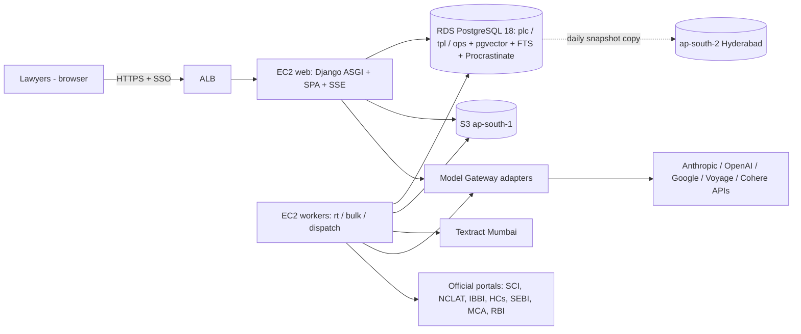

# MVP 04: Stack, Infrastructure and Monthly Cost (partner scale)

**Scope.** This document chooses the simplified stack for the corporate-law MVP. For each choice it compares at least two options and picks one. It then prices the result at design-partner scale: a monthly run cost and a one-time backfill cost, in INR and USD, with formulas.

The data model these choices serve is [03_data_model_and_contracts.md](03_data_model_and_contracts.md). The blueprint's full-scale choices (D1: Kafka, Temporal, OpenSearch, OpenFGA, self-hosted embedders) and its cost model (13_cross_cutting §3–§4) are the reference points. Prices tagged `verified` from 13_cross_cutting were retrieved 30 Sep 2026 and are reused unchanged; anything new was re-checked on 1 Oct 2026.

**Source tags.**
- `verified` means the primary page or the AWS Price List file was fetched and read.
- `snippet` means search-result text only.
- `estimate` means our assumption.

Every reference is listed in §7.

---

## 0. Decisions at a glance

| Concern | MVP choice | Runner-up | Upgrade trigger |
|---|---|---|---|
| Backend | **Python 3.13 + Django 5.2 LTS** (+ Django Ninja typed API) | FastAPI + SQLAlchemy | none expected; split services by module later |
| Frontend | **React 19 + TypeScript + Vite 7 SPA**; PDF.js source viewer | Next.js | — |
| Job queue / workflows | **Procrastinate 3.10** (Postgres) + own job-chain tables (03 §5) | DBOS Transact 3.2 | chains > ~15 steps or cross-service → Temporal/DBOS |
| Event bus | **Postgres transactional outbox** + Procrastinate delivery (03 §4) | — | ≥2 deployments or >50 events/s → Kafka via Debezium |
| Lexical search | **PostgreSQL 18 built-in FTS** (`websearch_to_tsquery`, `ts_rank_cd`) behind the IAL | pg_textsearch (BM25, PostgreSQL licence) on self-managed PG | lexical Recall@100 gap > 5 pts vs a BM25 reference, or lexical p95 > 1.5 s |
| Vector search | **pgvector HNSW on `halfvec(1024)`** in the same DB | OpenSearch k-NN | > ~10M vectors or p95 > 300 ms |
| Embeddings | **API: voyage-4-large @1024** (bake-off vs voyage-law-2 and Kanon 2 in weeks 3–4) | Kanon 2 Embedder | partner requires in-India processing for private docs → Azure southindia `text-embedding-3-large` for the private index |
| Reranker | **API: Voyage rerank-2.5**; Cohere Rerank 4 as second endpoint | self-hosted bge-reranker-v2-m3 / Qwen3-Reranker-4B | volume ×50 or residency |
| OCR (English) | **Amazon Textract DetectDocumentText, Mumbai** | Mistral OCR 4 (batch) | Hindi/regional scope → Indic-capable OCR |
| LLMs | **Thin in-house Model Gateway** over official SDKs; Anthropic + OpenAI + Google qualified (≥2 per task) | LiteLLM as transport | — |
| Object store | **S3 ap-south-1** (Object Lock for raw, SSE-KMS for tenant data) | MinIO on the VM | — |
| Auth | **Firm SSO via django-allauth** (Google or Microsoft Entra, single tenant) | WorkOS | 2nd firm or SAML/SCIM requirement |
| Hosting | **AWS Mumbai: RDS PostgreSQL 18 + 2 EC2 + ALB + S3** | single EC2 VM running everything | — |
| Backups / DR | RDS PITR (14 d) + daily snapshot copy to ap-south-2 + S3 versioning | pgBackRest to S3 | GA → Multi-AZ |
| Observability | JSON logs → CloudWatch; `ops.llm_call_record` dashboards; Langfuse optional | self-hosted Langfuse from day 1 | > 1 engineer debugging prompts daily |

**Cost headline** (mid scenario, ex-GST):
- **≈ $2,010/month (≈ ₹1.77 lakh)**: infra ≈ $1,240 + model usage ≈ $770.
- **One-time backfill ≈ $5.9K–$7.9K (≈ ₹5.2–7.0 lakh)** including a 30% re-run contingency.
- Human review of tier-1 treatments is extra: $1.8K–$8.6K of reviewer time (§4.4).

---

## 1. Sizing assumptions and derived volumes

| Input (given) | Value |
|---|---|
| Firm | one partner firm, corporate practice; 15–30 lawyer users |
| Research Q&A | 50–150 queries/day |
| Strategy memos | 5–20/week |
| Active matters | 20–60 |
| Corpus | ~100–200K documents; ~3–5M paragraph anchors |
| FX | ₹88 = $1 |

| Derived (our assumptions, `estimate`) | Low | Mid | High | Formula |
|---|---|---|---|---|
| Q&A per month | 1,100 | 2,200 | 3,300 | queries/day × 22 working days |
| Memos per month | 22 | 54 | 87 | memos/week × 4.33 |
| Cite-checks per month | 30 | 60 | 90 | assumed ≈ 1 per active matter per month |
| Drafts per month | 40 | 75 | 110 | ≈ 1 per memo + standalone requests |
| Delta documents per month (in scope) | 3,000 | 4,500 | 6,000 | NCLT orders dominate; plus SC/NCLAT/HC/SEBI/SAT/CCI/circulars |
| Backfill documents | 150,000 | 150,000 | 200,000 | central case 150K |
| Pages per document (backfill / delta) / OCR share | 8 / 6 / 30% | 8 / 6 / 30% | 8 / 6 / 30% | 13 §2.2 used 4 pages and 30% for a blended corpus; tribunal orders are longer |
| Body tokens per document (backfill / delta) | 4,000 / 3,000 | same | same | SC ≈ 5.3K (13 §2.1); NCLT orders shorter |
| Vectors (chunks) | 3M | 5M | 5M | sized for the brief's 3–5M |

---

## 2. Choices

### 2.1 Language and framework

| Option | Fit | Ops/build cost | Verdict |
|---|---|---|---|
| **A. Python 3.13 + Django 5.2 LTS + Django Ninja; React/TS SPA** | Python owns PDF/OCR/NLP. Django gives migrations, sessions, SSO (allauth) and the **admin**, which serves as the internal review consoles for free: tier-1 review tasks, RuleSpec registry, alias conflicts, court calendars, gold sets. Procrastinate ships a Django contrib (§2.2). 5.2 is LTS with security fixes to April 2028 [R1] | lowest for 2 engineers | **chosen** |
| B. Python + FastAPI + SQLAlchemy/Alembic; React/TS | async-native and light, but no admin, auth or migrations bundled; FastAPI is still 0.x (0.136.x in 2026) [R2] | +2–3 weeks of plumbing | runner-up |
| C. TypeScript end-to-end (NestJS + Graphile Worker) | one language, but the document-processing ecosystem lives in Python, so we would end up with two backends | high | rejected |

**Frontend.** React 19 + TypeScript + Vite 7 SPA [R3], TanStack Query, PDF.js for click-to-source (page + bbox highlight from `anchor.spans`), and SSE for streamed answers and memo progress (01 §9.10 paths). API types are generated from Django Ninja's OpenAPI with `openapi-typescript`.
- Next.js was rejected: SSR buys nothing behind SSO and adds a second server runtime.
- HTMX was rejected for the main UI: the PDF viewer and streaming memo need a rich client. Django admin covers the internal consoles.

**Process layout.** One monorepo with module packages mirroring the phases (`ingest`, `parse`, `index`, `kg`, `propagate`, `retrieve`, `reason`, `workspace`, `verify`, `feedback`, `surface`, `gateway`, `anchor_lib`, `rules`). It deploys as two process types:
- `web`: Django ASGI under Uvicorn, serving API, SSE and the built SPA;
- `worker`: Procrastinate workers on queues `rt`, `bulk` and `dispatch`.

Module boundaries follow the blueprint phases, so extracting a service later is a move, not a rewrite.

### 2.2 Postgres-backed job queue and durable jobs

| Option | Language fit | Key facts | Verdict |
|---|---|---|---|
| **Procrastinate** | Python | MIT; PostgreSQL-backed; sync and async; "periodic tasks, retries, arbitrary task locks"; Django integration [R4]. Release 3.10.0 on 23 Sep 2026 [R5]. The Django connector "doesn't use a pool, but instead uses the Django connection", so a `defer()` inside `transaction.atomic()` commits or rolls back with the ORM writes. That is exactly the outbox/job-chain guarantee we need [R6]. LISTEN/NOTIFY is not supported on the Django connector [R6], so workers use the psycopg connector | **chosen** |
| DBOS Transact | Python | MIT; "lightweight durable workflows built on top of Postgres": checkpointed steps, durable queues, cron, notifications with timeouts; 3.2.0 on 29 Sep 2026 [R7] | runner-up; best fit if job chains outgrow 03 §5 |
| PgQueuer | Python | SKIP LOCKED + LISTEN/NOTIFY job queue [R8] | viable; no Django contrib, smaller community |
| PGMQ | SQL extension (Python client) | SQS-like visibility timeout + archive; PostgreSQL licence; PG 14–18 [R9]. **Not on the RDS extension list** [R10] (SQL-only install possible) | rejected: a message queue, not a worker framework |
| Hand-rolled `FOR UPDATE SKIP LOCKED` | any | ~200 lines, but we would own retries, locks, cron and stall detection | rejected |
| River / Graphile Worker | Go / Node | strong transactional queues [R11] | wrong language |

**How it is used:**
- the outbox dispatcher fans out to per-consumer jobs, with `lock = consumer:partition_key` for per-key ordering (03 §4);
- job chains replace Temporal (03 §5);
- periodic tasks run crawls, digest composition, freshness and deadline reminders.

### 2.3 Lexical search

| Option | Ranking | Licence / availability | Ops | Verdict |
|---|---|---|---|---|
| **PostgreSQL 18 FTS** (GIN on `tsvector`, `websearch_to_tsquery`, `phraseto_tsquery`/`<->`, `ts_rank_cd`) | Not BM25. The docs state "the ranking functions do not use any global information" and "ranking can be expensive since it requires consulting the `tsvector` of each matching document" [R12]. Phrase search works (`<->`) [R12] | core Postgres; runs on RDS | none | **chosen for MVP** |
| ParadeDB `pg_search` | BM25 | "ParadeDB Community is licensed under the GNU Affero General Public License v3.0" [R13]. Not on the RDS extension list [R10] | self-managed Postgres or a ParadeDB logical replica | rejected: AGPL review + leaves RDS |
| Tiger Data `pg_textsearch` | BM25 with fast top-k; v1.0 GA 3 Apr 2026 under the PostgreSQL licence [R14]; supports PostgreSQL 17 and 18; latest v1.4.0 [R15] | needs `shared_preload_libraries` and is not on RDS [R10][R15]. "Cannot evaluate phrases directly" (no positions) [R15] | self-managed Postgres | **upgrade path #1** |
| Single-node OpenSearch | BM25 + phrase + k-NN (the blueprint's D1 engine) | Apache-2.0; separate JVM service | second datastore, sync via outbox; ≈ $110/month for an r7g.xlarge EC2 node [R20] + EBS | **upgrade path #2** (and the full-scale target) |

**Why FTS is acceptable for the MVP:**
1. The lexical leg is recall-oriented. Final order comes from fusion + a cross-encoder reranker (§2.6), which reduces the cost of missing IDF.
2. Exact lookups (neutral citations, SCC cites, case numbers, "s.7 IBC") go through `identifier_alias` and provision anchors, not FTS.
3. At 50–150 queries/day, a 0.5–1.5 s lexical leg fits the STANDARD budget (5 s, 01 §9.4).

**Implementation:**
- a custom text-search configuration `legal_en`: English stemming for prose; a `simple` dictionary for section numbers, citation tokens and Latin maxims;
- weighted vectors: `setweight(context_header,'A') || text`;
- pre-filter by court/date/doc_type before ranking, and cap candidates at 200.

**Upgrade trigger.** It is measured in week 8 on the partner gold set (~150 queries). We run pg_textsearch offline on a copy of the chunk table. If its Recall@100 beats FTS by > 5 points, or FTS p95 > 1.5 s, we move to Option H-B (§2.11: self-managed PG 18 on EC2 with pg_textsearch, phrase checks via a `<->` post-filter) or add OpenSearch. Both sit behind the IAL, so callers do not change (03 §3.5).

### 2.4 Vector search and sizing

**Choice.** Use pgvector in the same RDS database.
- RDS PostgreSQL 18.6 ships **pgvector 0.8.2** [R10]. Upstream is 0.8.6 [R16].
- `halfvec` can be indexed "up to 4,000 dimensions" (vs 2,000 for `vector`) [R16].
- Iterative index scans (since 0.8.0) fix over-filtering when filters are applied after the HNSW scan [R16].

We store an untyped `halfvec` and build a per-generation **expression index** `(embedding::halfvec(1024))`, the pattern documented upstream [R16]. Embedder changes then become new partitions (03 §3.5).

**Sizing (formulas; `estimate` until measured on the backfill):**
```
bytes_per_vector     = 2·d + 8                       (halfvec)            → d = 1024: 2,056 B
heap_vectors(N)      ≈ N · 2.06 KB                                         → 3M: 6.2 GB · 5M: 10.3 GB
hnsw_index(N, m=16)  ≈ N · (2,056 + 2m·6 B neighbour TIDs + ~150 B overhead) ≈ N · 2.4 KB
                                                                          → 3M: 7.2 GB · 5M: 12 GB
working_set          ≈ hnsw_index + hot heap + FTS GIN (~1–1.5 KB/chunk) → 5M: ≈ 25–30 GB
re-embed cut-over    = 2 × (heap_vectors + hnsw_index) while two generations coexist
```

**Instance choice.** `db.r8g.2xlarge` (8 vCPU, 64 GiB) keeps 5M × 1024-d fully cached with room for a second generation during a re-embed. `db.r8g.xlarge` (32 GiB, half the price) is enough for ≤ 3M vectors at 1024-d, or 5M at 512-d. voyage-4-large supports 512-d output [R18]; we test 512 vs 1024 in the bake-off.

**Build settings.** `maintenance_work_mem = 8GB` (the upstream recommendation is that the graph fits in it [R16]), `max_parallel_maintenance_workers = 7`, `m = 16`, `ef_construction = 64`. At query time: `hnsw.ef_search = 100`, `hnsw.iterative_scan = relaxed_order` for filtered queries.

**Alternatives.** OpenSearch k-NN (blueprint D1) and a dedicated vector DB were rejected at this size: two stores and sync for a few million vectors.

### 2.5 Embeddings

| Option | Price / spec | Notes | Verdict |
|---|---|---|---|
| **voyage-4-large (API)** | $0.12/M tokens; 32K context; dims 256/512/1024/2048; float/int8/binary [R17][R18]. First 200M tokens free; Batch API −33% [R17] | strong general model, flexible dims | **default** |
| voyage-law-2 (API) | $0.12/M; 16K context; 1024-d float only [R17][R18] | legal-tuned but an older generation | bake-off |
| Kanon 2 Embedder (Isaacus API) | $0.35/M tokens [R19] | vendor reports #1 on the Massive Legal Embedding Benchmark (MLEB) and a 16,384-token context `snippet` [R19b] | bake-off; pick if it wins on our gold set |
| OpenAI text-embedding-3-large on Azure **southindia** (Standard regional) | $0.13/M (OpenAI list) | in-India processing for this model is verified in 13 [XC-8] | fallback for the **private** index if the partner requires in-India processing |
| Self-hosted Qwen3-Embedding-4B (blueprint D1) | GPU always-on for query embedding: g6.xlarge (L4) $0.9664/h ≈ $705/month [R20] | > 100× the API spend at this volume | rejected for MVP |

**Bake-off plan (weeks 3–4).** Embed a 10K-document stratified sample with three models (~50M tokens ≈ $30). Score hybrid Recall@100 and nDCG@10 on ~150 partner-written queries. The winner becomes generation `g1`.

The public corpus is `PUBLIC` data. Query text and private documents are tenant data, so endpoint `data_class_max` and the tenant's residency policy decide what goes where. **This is a partner question, not a design constraint** (D15 facts are in 13 §4.4). Because the private index has its own embedding generation, the two indexes may use different models.

### 2.6 Reranker

| Option | Price / spec | Verdict |
|---|---|---|
| **Voyage rerank-2.5 (API)** | $0.05/M tokens; rerank-2.5-lite $0.02/M [R17] | **primary** |
| Cohere Rerank 4 Fast / Pro (API) | $2.00 / $2.50 per 1,000 searches (≤100 docs of ≤500 tokens) `snippet` [R21] | **second qualified endpoint** |
| Self-hosted bge-reranker-v2-m3 | Apache-2.0, 0.6B params, 512-token max [R22]; GPU ≈ $705/month always-on [R20] | upgrade if volume or residency demands |
| Self-hosted Qwen3-Reranker-4B | Apache-2.0, 4B params, 32K context [R23] | upgrade path |

Per query: 3 sub-queries × 100 candidates × ~350 tokens + query tokens ≈ 114K tokens ≈ **$0.006**.

### 2.7 OCR for scanned orders (English only)

| Option | Price | Notes | Verdict |
|---|---|---|---|
| **Amazon Textract `DetectDocumentText` (async), Mumbai** | **$1.50 per 1,000 pages** for 0–1M pages/month, $0.60 beyond [R24] | in-region (client scans stay in India); returns LINE/WORD bounding boxes for `anchor.spans`; no GPU ops; English is supported, Indic scripts are not [13 XC-24] | **chosen** |
| Mistral OCR 4 | $4/1K pages; $2/1K via Batch `snippet` [R25] | strong layout/markdown output; processed outside India | second engine for low-confidence pages (PUBLIC docs only) |
| Self-hosted olmOCR (7B VLM) | ≈ $176 per million pages of GPU time [13 XC-25] | cheapest at scale, but GPU operations | post-MVP / Indic phase |

The pipeline uses the PDF text layer first and OCRs only pages that fail the text-layer test. Pages with `ocr_conf < 0.80` are flagged so that no tier-1 assertion is mined from garbage text (13 §3.2 OCR gate).

### 2.8 LLM access through a thin Model Gateway

**Design.** This is 13 §4.8 option C: an in-process `gateway` package with contracts in the repo (`ops.model_task_contract`), official provider SDKs as adapters, routing as in 13 §4.3, and one `ops.llm_call_record` per attempt (03 §3.15). LiteLLM may be used as a transport adapter, never as the contract layer.

**Qualified providers (≥2 per task, different families where the blueprint requires it):**

| Task (examples) | Primary | Second qualified | Notes |
|---|---|---|---|
| Bulk enrichment: metadata QA, treatment classification, statute-mention fallback | Gemini 3.8 Flash (batch) | gpt-5-mini (batch) | escalation (~12%) to Claude Opus 5.5 batch; tier-1 dual-provider (Opus 5.5 + gpt-6.1-sol) then human (D14) |
| Query routing / decomposition | gpt-5-mini | Claude Haiku 4.5 | — |
| Answer synthesis (Q&A) | Claude Sonnet 5.5 | gpt-6.1-sol | — |
| Memo: advocate, bench | Claude Opus 5.5 | gpt-6.1-sol | opponent role always on a **different family** from the advocate (D14) |
| Memo: opponent | gpt-6.1-sol | Gemini 3.1 Pro | — |
| Verification (P8 entailment, misrepresentation) | gpt-5-mini; tier-1 checks gpt-6.1-sol | Gemini 3.8 Flash / Gemini 3.1 Pro | verifier family ≠ generator family (01 §10.4) |
| Case cards, digest items | Gemini 3.8 Flash | Claude Haiku 4.5 | entailment-checked; non-citable (`sum_`) |

**Prices** (13 §3.1, `verified` 30 Sep 2026; Claude prices reconfirmed in Anthropic's model table [R26]):

| Model | Input / output per MTok | Notes |
|---|---|---|
| Claude Opus 5.5 | $4 / $20 | cache reads $0.20 |
| Claude Sonnet 5.5 | $2 / $10 | cache reads $0.20 |
| Claude Haiku 4.5 | $1 / $5 | — |
| gpt-6.1-sol | $2 / $10 | — |
| gpt-5-mini | $0.25 / $2 | — |
| Gemini 3.8 Flash | $0.75 / $3.75 to 31 Dec 2026, then $1.50 / $7.50 | — |
| Gemini 3.1 Pro | $2 / $12 | — |

Batch is −50% at all three providers. The Claude 4.7+ tokenizer counts ≈ 1.3× more tokens [13 XC-1].

**Residency.**
- The router implements `residency_policy` fail-closed (D15).
- The tenant default is `ANY` until the partner decides. It is a **partner question; we do not design around it**.
- If the partner chooses `IN_ONLY` for tenant data, the tenant-task endpoints switch to Bedrock `in.` GPT-5.6 and Azure southindia deployments (13 §4.4). Claude would then serve only PUBLIC tasks. Cost changes by roughly ±10%; the bigger work is re-qualification on the gold set.

### 2.9 Object storage

| Option | Verdict |
|---|---|
| **S3 ap-south-1**: Standard $0.025/GB-month (first 50 TB), Standard-IA $0.0138 [R27] | **chosen** |
| MinIO on the app VM | rejected: we would own durability |

**Buckets:**
- `raw/`: versioned, Object Lock governance mode, content-addressed `sha256`;
- `parsed/`: ParsedDocument JSON, rebuildable;
- `tenant/`: SSE-KMS with the tenant CMK; private uploads, private ParsedDocuments, LLM input/output payloads (`inputs_ref`/`outputs_ref`), 180-day lifecycle on LLM payloads;
- `backups/`.

Footprint: ~150K PDFs × ~400 KB ≈ 60 GB raw + ~45 GB parsed JSON + private documents ≈ 250 GB in year 1 `estimate`.

### 2.10 Authentication (firm SSO)

| Option | Cost | Verdict |
|---|---|---|
| **django-allauth** with the built-in Microsoft (Entra/Graph) and Google providers [R28] | free | **chosen** |
| WorkOS SSO | $125 per connection per month (first tier) `snippet` [R29] | runner-up if the partner insists on SAML + SCIM |
| AWS Cognito federation | another moving part for one IdP | rejected |

**Configuration:**
- Entra app registration as **single-tenant**, `tenant: "organizations"` per the allauth docs [R28], plus a server-side check that the ID token's `tid` equals the partner's tenant. For Google, check the `hd` claim.
- MFA is enforced at the IdP.
- Sessions last 12 h, so IdP de-provisioning takes effect within a working day. Users are pre-provisioned by the firm admin (no self-signup).

### 2.11 Hosting

| Option | What runs where | Monthly (infra only) | Pros / cons | Verdict |
|---|---|---|---|---|
| **H-A. AWS Mumbai (ap-south-1), small managed set-up** | RDS PostgreSQL 18 `db.r8g.2xlarge` Single-AZ; EC2 `m8g.xlarge` (web); EC2 `c7g.2xlarge` (workers); ALB; S3 | ≈ $1,240 (§4.2); lean variant with `db.r8g.xlarge` ≈ $840 | managed PITR, patching and KMS; Textract and Bedrock in-region; but no BM25 extension on RDS | **chosen** |
| H-B. Single EC2 VM in Mumbai | `r8g.2xlarge` ($0.33032/h ≈ $241/month [R20]) running PG 18 + pgvector 0.8.6 + pg_textsearch + app + workers in Docker; pgBackRest → S3 | ≈ $330 | cheapest; BM25 possible; but a single point of failure and the 2-person team owns DB ops | fallback / BM25 upgrade route |
| H-C. Indian VPS (e.g. DigitalOcean BLR1 8 vCPU/32 GB) | everything on one droplet | $192–252 `snippet` [R30] | cheapest, in India; weaker IAM/KMS/audit tooling for privileged client data; no in-region OCR/LLM adjacency | rejected |

**Network.**
- One VPC; RDS in private subnets.
- Web and worker instances in public subnets with security groups (ingress only from the ALB) and an S3 gateway endpoint. **No NAT gateway** saves ≈ $40+/month.
- Deployment: Terraform + Docker Compose on EC2, released from GitHub Actions through SSM.
- During the backfill only: 2 extra `c7g.4xlarge` workers for ~3 weeks.



### 2.12 Backups and disaster recovery

| Item | MVP setting | Target |
|---|---|---|
| Database | RDS automated backups with point-in-time restore, 14-day retention. Daily snapshot copied to ap-south-2. Monthly snapshot kept 12 months. Backup storage beyond the free allocation is $0.095/GB-month [R31] | RPO ≤ 5 min (PITR; AWS documents ~5-minute log upload granularity, `unverified`); RTO ≤ 4 h (restore + DNS) |
| Objects | S3 versioning; Object Lock on `raw/`; replication of `tenant/` to ap-south-2 | RPO ≤ 15 min for tenant objects |
| Rebuildability | ParsedDocuments, chunks, embeddings and assertions are re-derivable from `raw/` + `ops.pipeline_version` | full rebuild ≈ the one-time backfill cost (§4.4) |
| Drills | quarterly restore into a scratch instance; run the anchor canary and 20 gold queries against it | — |

Single-AZ is a deliberate MVP trade-off. Multi-AZ costs +$794/month [R31] and becomes the default at GA or if the partner's IT asks for it.

### 2.13 Observability (minimal)

| Signal | Implementation |
|---|---|
| Logs | `structlog` JSON to CloudWatch Logs (Mumbai: $0.67/GB ingested, Standard class [R32]). Bodies of TENANT_CONFIDENTIAL/PRIVILEGED payloads are never logged (13 §7.4); only IDs and hashes |
| Traces | W3C `traceparent` from the browser request → `ExecutionContext` → `event_outbox.traceparent` → `job_step` → `llm_call_record.trace_id`. OpenTelemetry SDK optional |
| Model calls | `ops.llm_call_record` (03 §3.15). Django-admin dashboards: $/day and $/1K source chars per task, schema-failure and repair rate, fallback count, p95 latency |
| Alarms | outbox lag > 5 min; failed/parked jobs > 0; source health DOWN > 24 h; RDS free memory < 10%; daily LLM spend > 2× trailing average |
| LLM tracing UI (optional) | **Langfuse self-hosted**: MIT core; needs Postgres, Redis/Valkey, ClickHouse and S3 [R33]; ≈ $40/month on a `t4g.large` + EBS `estimate`. Langfuse Cloud regions are EU, US, Japan and HIPAA-US `snippet` [R34]. That would move prompts out of India, so it is not the default |

---

## 3. What the stack deliberately does not include (vs blueprint D1)

| Not included | Why |
|---|---|
| Kafka/MSK, Debezium | the outbox already has the Debezium shape (03 §3.16) |
| Temporal | job chains (03 §5) |
| OpenSearch | FTS + pgvector behind the IAL |
| OpenFGA | membership + walls + RLS (03 §6) |
| Self-hosted GPU models | APIs are 100×+ cheaper at this volume |
| Langfuse/ClickHouse, OpenLineage | optional (§2.13) |
| DR warm standby | snapshot copies only |
| Multi-AZ | Single-AZ in MVP (§2.12) |

Each has its upgrade trigger in §0.

---

## 4. Costs (USD list prices, ex-GST; INR at ₹88/$)

### 4.1 Price sheet used

| Item | Price | Tag |
|---|---|---|
| RDS PostgreSQL `db.r8g.2xlarge` / `db.r7g.2xlarge` (64 GiB), Single-AZ, Mumbai | $1.088/h (Multi-AZ $2.176/h) | verified [R31] |
| RDS PostgreSQL `db.r8g.xlarge` (32 GiB), Single-AZ | $0.544/h | verified [R31] |
| RDS gp3 storage; backup beyond free | $0.131/GB-month; $0.095/GB-month | verified [R31] |
| EC2 Mumbai | `m8g.xlarge` $0.12832/h; `c7g.2xlarge` $0.1963/h; `c7g.4xlarge` $0.3926/h; `r8g.2xlarge` $0.33032/h; `r7g.xlarge` $0.1502/h; `g6.xlarge` $0.9664/h | verified [R20] |
| EBS gp3; ALB | $0.0912/GB-month; $0.0239/ALB-hour | verified [R20] |
| S3 Standard | $0.025/GB-month | verified [R27] |
| CloudWatch Logs | $0.67/GB ingested | verified [R32] |
| Textract DetectDocumentText (async), Mumbai | $1.50/1K pages (≤1M/month), $0.60 beyond | verified [R24] |
| Voyage voyage-4-large / rerank-2.5 | $0.12 / $0.05 per M tokens | verified [R17] |
| LLMs | §2.8 table | verified (13 §3.1) [R26] |

### 4.2 Per-unit formulas (list prices; Claude 5.5 token counts × 1.3; × 1.15 retry/repair/escalation overhead per 13 §3.4)

```
QA   = 1.15 × [ route(gpt-5-mini: 2K in, 0.4K out)                       $0.0013
              + rerank(114K tok × $0.05/M)                                $0.0057
              + synth(Sonnet 5.5: 30K in, 2K out, ×1.3)                   $0.1040
              + verify(gpt-5-mini: 12 claims × 1.5K in / 0.15K out)       $0.0081 ]   = $0.137 per answer

MEMO = 1.15 × [ notice extraction (Sonnet 5.5: 40K in, 4K out, ×1.3)       $0.156
              + research: 6 issues × 3 retrievals × $0.007                 $0.126
              + advocate+bench (Opus 5.5: 130K uncached + 390K cache-read in, 52K out incl. thinking)  $1.638
              + opponent (gpt-6.1-sol: 60K in, 8K out)                     $0.200
              + verify (gpt-6.1-sol 150K/10K + gpt-5-mini 90K/9K)          $0.441
              + deadlines (Procedural Clock, deterministic)                $0     ]   = $2.95 per memo

CITE_CHECK = 1.15 × [ mention extraction fallback (Haiku 4.5: 20K/2K) + 40 mentions × gpt-5-mini (2.5K/0.2K)
                      + 20% escalation to Sonnet 5.5 + OCR of 50 pages × 30% ]                 = $0.215 per filing
DRAFT      = 1.15 × [ Sonnet 5.5 (35K in, 5K out, ×1.3) + gpt-5-mini check (15K/1.5K) ]        = $0.187 per draft
DIGEST     = 30 cards/day × 30 days × [ Gemini 3.8 Flash 2027 price (8K/0.8K) + gpt-5-mini check ] = $17.4 per month
ENRICH(doc)= cheap pass (Gemini 3.8 Flash batch) on in = T+1,500+C·1,500+ρ·3,000, out = 600+C·150+ρ·800
           + 12% escalation of the citation/proposition part to Opus 5.5 batch (×1.3)          (13 §3.2 formula)
             delta: T=3,000, C=6, ρ=0.15, 2027 Flash price → $0.0211 per doc
             backfill: T=4,000, C=8, ρ=0.20 → $0.0165 (2026 Flash price) / $0.0270 (2027 price) per doc
OCR(month) = (delta_docs × 6 pages × 30% + 3,000 private pages) × $1.50/1K   (delta orders are shorter than the backfill mix)
EMBED(month)= delta_docs × 3,000 tok × 1.25 × $0.12/M + query/private embeddings (~$1)
```

Two things to note:
- **The memo line dominates per unit.** Opus 5.5 output (including adaptive-thinking tokens) is 55% of a memo's cost. Lowering `effort` on the bench role is the first lever.
- The blueprint's figures of record ($0.105/Q&A, $2.16/memo, D19.1) are 2026 SaaS-scale numbers. Ours are higher per unit because we verify with a second family and run more agent roles per memo.

### 4.3 Monthly run cost

| Line | Formula | Low | **Mid** | High |
|---|---|---|---|---|
| RDS PostgreSQL 18 instance | $/h × 730 (low: `db.r8g.xlarge`; mid/high: `db.r8g.2xlarge`) | $397 | **$794** | $794 |
| RDS storage gp3 | 400 GB × $0.131 | $52 | **$52** | $52 |
| RDS backup storage beyond free | ~100 GB × $0.095 | $10 | **$10** | $10 |
| EC2 web (`m8g.xlarge`) | $0.12832 × 730 | $94 | **$94** | $94 |
| EC2 workers (`c7g.2xlarge`) | $0.1963 × 730 | $143 | **$143** | $143 |
| EBS (2 × 100 GB gp3) | 200 × $0.0912 | $18 | **$18** | $18 |
| ALB | $0.0239 × 730 + ~$6 LCU | $23 | **$23** | $23 |
| S3 (≈250 GB + requests) | 250 × $0.025 + ~$2 | $8 | **$8** | $8 |
| DR (snapshot copies + replication to ap-south-2) | `estimate` | $40 | **$40** | $40 |
| CloudWatch (≈10 GB logs + alarms) | 10 × $0.67 + metrics | $25 | **$25** | $25 |
| Secrets Manager, KMS, Route 53, SES | `estimate` | $15 | **$15** | $15 |
| Internet egress | ~130 GB `estimate` | $15 | **$15** | $15 |
| **Infra subtotal** | | **$841** | **$1,238** | **$1,238** |
| Research Q&A | QA × queries/month | $151 (1,100) | **$301** (2,200) | $452 (3,300) |
| Strategy memos | MEMO × memos/month | $65 (22) | **$159** (54) | $256 (87) |
| Cite-checks | CITE_CHECK × n | $6 (30) | **$13** (60) | $19 (90) |
| Drafting | DRAFT × n | $8 (40) | **$14** (75) | $21 (110) |
| Daily digest | DIGEST | $17 | **$17** | $17 |
| Delta enrichment (KG cascade on new docs) | ENRICH × delta docs | $63 (3,000) | **$95** (4,500) | $127 (6,000) |
| Eval gate and regression runs | ~300 gold items × ~4 runs + memo evals `estimate` | $150 | **$150** | $150 |
| **Model usage subtotal** | | **$460** | **$750** | **$1,042** |
| OCR (delta + private scans) | OCR(month) | $13 | **$17** | $21 |
| Embeddings (delta + queries + private) | EMBED(month) | $2 | **$3** | $4 |
| **Total per month (USD)** | | **$1,316** | **$2,008** | **$2,305** |
| **Total per month (INR)** | × 88 | **₹1.16 lakh** | **₹1.77 lakh** | **₹2.03 lakh** |

In the mid case this is ≈ $80 (≈ ₹7,000) per lawyer-user per month at 25 users. Infrastructure is ~60% of the total, so the lean variant (`db.r8g.xlarge`, valid while vectors ≤ 3M@1024 or 5M@512) is the first saving: −$397/month.

### 4.4 One-time backfill (150K documents; 200K in brackets)

| Line | Formula | USD |
|---|---|---|
| OCR | 150K × 8 pages × 30% = 360K pages × $1.50/1K | $540 [$720] |
| KG/metadata enrichment cascade | 150K × ENRICH(backfill). Run **before 31 Dec 2026** at the current Gemini 3.8 Flash price; after that the price doubles [13 XC-4] | $2,477 [$3,303]; 2027 price: $4,047 [$5,396] |
| Case cards + proposition extraction (SC, NCLAT, reportable HC ≈ 30K docs) | 30K × Sonnet 5.5 batch (10K in, 1.5K out, ×1.3) = 30K × $0.0227 | $682 [$909] |
| Embeddings | 150K × 4,000 × 1.25 = 750M tokens × $0.12/M (first 200M free on the standard API; batch −33%) | $60–90 [$80–120] |
| Embedding bake-off | 50M tokens × (0.12 + 0.12 + 0.35) | $30 |
| Temporary parse/OCR workers | 2 × `c7g.4xlarge` × 504 h × $0.3926 | $396 |
| Gold-set bootstrapping and first gate runs | `estimate` | $300 |
| **Subtotal** | | **$4,515** (2026 price) / **$6,085** (2027 price) |
| Contingency: one partial re-run after a parser/prompt fix (13 §3.5 reprocessing) | +30% | +$1,355 / +$1,826 |
| **Total one-time** | | **≈ $5,870 (₹5.2 lakh)** / **≈ $7,910 (₹7.0 lakh)**; 200K docs ≈ +33% |
| *Separate: human review of tier-1 treatment edges* | 150K × 8 mentions × 3% negative × 15% prioritised ≈ 5,400 reviews at 40–100 reviews/reviewer-day (D23.1) = 54–135 reviewer-days ≈ 2.5–6.1 reviewer-months × $700–1,400 | **$1.8K–$8.6K (₹1.6–7.6 lakh)** of legal-reviewer time |

### 4.5 Sensitivities and exclusions

| Item | Effect |
|---|---|
| GST at 18% | excluded throughout (also on reverse-charge imports of API services) |
| Usage ×2 | model usage roughly ×2 (+$750/month mid); infrastructure is unchanged |
| Partner chooses IN_ONLY for tenant data | tenant tasks move to Bedrock `in.` GPT-5.6 / Azure southindia. Prices are similar ($2/$12 plus a 10% regional uplift for newer OpenAI models; no ×1.3 tokenizer factor), so ≈ ±10%; re-qualification effort is the real cost (D15) |
| Multi-AZ RDS | +$794/month |
| Self-hosted Langfuse | +~$40/month |
| Memo effort settings | each +10K Opus output tokens per memo adds ≈ $0.23 per memo |
| Excluded | engineers, legal-reviewer salaries, domain and email costs, any paid data licences (none assumed: official sources only) |

---

## 5. Upgrade triggers (single list)

1. **Lexical quality/latency** fails the §2.3 test → H-B with pg_textsearch, or OpenSearch behind the IAL.
2. **Vectors > ~10M or a second embedder generation** pushes the working set past 64 GiB → `db.r8g.4xlarge`, or OpenSearch k-NN.
3. **A second firm** → Privacy Gate, OpenFGA, signed TEC, per-tenant schema/cell (03 §7), WorkOS/SAML if required.
4. **Job chains need cross-service steps, long timers or > ~15 steps** → DBOS or Temporal (03 §5).
5. **Event volume > ~50/s sustained or multiple deployments** → Kafka via Debezium on the existing outbox.
6. **Residency decision = IN_ONLY** → provision IN endpoints and re-run Gateway qualification before onboarding the change.
7. **GA** → Multi-AZ, warm standby in ap-south-2, Langfuse/ClickHouse.

---

## 6. Risks specific to the stack

| Risk | Mitigation |
|---|---|
| FTS ranking without IDF lowers lexical precision | reranker + fusion; measured gate in week 8 (§2.3) |
| RDS pgvector (0.8.2) lags upstream (0.8.6) | we only depend on 0.8.0 features (halfvec HNSW, iterative scans) |
| Procrastinate Django connector has no LISTEN/NOTIFY | workers use the psycopg connector; web-side `defer` uses the Django connector, so it stays transactional |
| One database = one blast radius | PITR, snapshot copies, schema/role separation (03 §1), query-lint in CI |
| Price changes (Gemini Flash 2027 step-up) | the Gateway re-routes on price (13 §4.7); the delta line already uses 2027 prices |

---

## 7. References

| ID | Source | Tag |
|---|---|---|
| R1 | Django 6.0 release notice; 5.2 LTS security support to April 2028. https://www.djangoproject.com/weblog/2025/dec/03/django-60-released/ | snippet |
| R2 | FastAPI 0.136.x in 2026, still pre-1.0. https://pepy.tech/project/fastapi | snippet |
| R3 | Vite 7 announcement. https://vite.dev/blog/announcing-vite7 | snippet |
| R4 | Procrastinate README (MIT; PostgreSQL; Django integration; periodic tasks, retries, locks). https://github.com/procrastinate-org/procrastinate | verified |
| R5 | Procrastinate releases (3.10.0, 23 Sep; 3.9.0, 20 Jun; 3.8.1, 8 Apr). https://github.com/procrastinate-org/procrastinate/releases | verified |
| R6 | Procrastinate Django connector source ("uses the Django connection"; "listen/notify is not supported with Django connector"). https://github.com/procrastinate-org/procrastinate/blob/main/procrastinate/contrib/django/django_connector.py | verified |
| R7 | DBOS Transact (PyPI): 3.2.0, 29 Sep 2026, MIT, durable workflows/queues on Postgres. https://pypi.org/project/dbos/ | verified |
| R8 | PgQueuer (PyPI). https://pypi.org/project/PgQueuer/ | snippet |
| R9 | PGMQ README (PostgreSQL licence, v1.10.0, PG 14–18). https://github.com/tembo-io/pgmq | verified |
| R10 | Extension versions for Amazon RDS for PostgreSQL (PG 18.6: pgvector 0.8.2; pg_partman, pg_cron, pg_trgm, btree_gist, unaccent listed; pg_search, pg_textsearch, pgmq absent). https://docs.aws.amazon.com/AmazonRDS/latest/PostgreSQLReleaseNotes/postgresql-extensions.html | verified (WebFetch reading of the table) |
| R11 | River (Go) https://brandur.org/river; Graphile Worker (Node) https://worker.graphile.org | snippet |
| R12 | PostgreSQL 18 docs, "Controlling Text Search" (ranking uses no global information; ranking must consult each matching `tsvector`; `<->` phrase operator). https://www.postgresql.org/docs/18/textsearch-controls.html | verified |
| R13 | ParadeDB README ("licensed under the GNU Affero General Public License v3.0"). https://github.com/paradedb/paradedb | verified |
| R14 | "pg_textsearch v1.0" (PostgreSQL.org news, 3 Apr 2026; Postgres licence). https://www.postgresql.org/about/news/pg_textsearch-v10-3264 | verified |
| R15 | pg_textsearch README (PostgreSQL 17 and 18; `shared_preload_libraries`; "cannot evaluate phrases directly"; v1.4.0). https://github.com/timescale/pg_textsearch | verified |
| R16 | pgvector README (v0.8.6; halfvec indexable to 4,000 dims; `maintenance_work_mem`; iterative scans since 0.8.0; expression-cast indexes). https://github.com/pgvector/pgvector | verified |
| R17 | Voyage AI pricing (voyage-4-large $0.12, voyage-4 $0.06, voyage-law-2 $0.12, rerank-2.5 $0.05, rerank-2.5-lite $0.02 per M tokens; 200M free tokens; Batch −33%). https://docs.voyageai.com/docs/pricing | verified |
| R18 | Voyage embeddings (context lengths, dimensions, dtypes). https://docs.voyageai.com/docs/embeddings | verified |
| R19 | Isaacus pricing (Kanon 2 Embedder $0.35/M tokens). https://isaacus.com/pricing | verified |
| R19b | Kanon 2 Embedder MLEB claim and 16,384-token context (vendor; AWS Marketplace listing). https://aws.amazon.com/marketplace/pp/prodview-lquokmsovgpsm | snippet |
| R20 | AWS Price List API, EC2 ap-south-1 (on-demand Linux; EBS gp3; ALB), retrieved 1 Oct 2026. https://pricing.us-east-1.amazonaws.com/offers/v1.0/aws/AmazonEC2/current/ap-south-1/index.csv | verified |
| R21 | Cohere Rerank 4 pricing ($2.00 / $2.50 per 1K searches). https://developer.puter.com/tutorials/cohere-api-pricing/ | snippet |
| R22 | BAAI/bge-reranker-v2-m3 model card (Apache-2.0; 0.6B; 512 tokens). https://huggingface.co/BAAI/bge-reranker-v2-m3 | verified |
| R23 | Qwen/Qwen3-Reranker-4B model card (Apache-2.0; 4B; 32K). https://huggingface.co/Qwen/Qwen3-Reranker-4B | verified |
| R24 | AWS Price List API, Textract ap-south-1 ("USD 1.50 per 1,000 Pages for AsyncTextPagesProcessed … 0-1M"; $0.60 at 1M+), retrieved 1 Oct 2026. https://pricing.us-east-1.amazonaws.com/offers/v1.0/aws/AmazonTextract/current/ap-south-1/index.json | verified |
| R25 | Mistral OCR 4 pricing ($4/1K pages; $2/1K batch). https://tech-insider.org/mistral-ocr-4-launch-2026/ | snippet |
| R26 | Anthropic pricing (13 XC-1, retrieved 30 Sep 2026); reconfirmed against the Claude API model table (Opus 5.5 $4/$20, Sonnet 5.5 $2/$10, Haiku 4.5 $1/$5; cache reads $0.20). https://platform.claude.com/docs/en/about-claude/pricing. OpenAI (13 XC-3) https://developers.openai.com/api/docs/pricing; Gemini (13 XC-4) https://ai.google.dev/gemini-api/docs/pricing | verified (30 Sep 2026) |
| R27 | AWS Price List API, S3 ap-south-1 (Standard $0.025/GB first 50 TB; Standard-IA $0.0138). https://pricing.us-east-1.amazonaws.com/offers/v1.0/aws/AmazonS3/current/ap-south-1/index.json | verified |
| R28 | django-allauth Microsoft provider docs (built-in Microsoft Graph provider; `"tenant": "organizations"`; Entra via OpenID Connect). https://docs.allauth.org/en/latest/socialaccount/providers/microsoft.html | verified |
| R29 | WorkOS SSO pricing ($125 per connection per month, first tier). https://ssojet.com/blog/workos-pricing-at-scale-50-100-200-connections | snippet |
| R30 | DigitalOcean 8 vCPU/32 GB droplets in BLR1 ($192–$317/month). https://pcr.cloud-mercato.com/providers/digitalocean/flavors/s-8vcpu-32gb | snippet |
| R31 | AWS Price List API, RDS ap-south-1 (PostgreSQL `db.r8g/r7g.2xlarge` Single-AZ $1.088/h, Multi-AZ $2.176/h; `db.r8g.xlarge` $0.544/h; gp3 $0.131/GB-month; backup $0.095/GB-month), retrieved 1 Oct 2026. https://pricing.us-east-1.amazonaws.com/offers/v1.0/aws/AmazonRDS/current/ap-south-1/index.json | verified |
| R32 | AWS Price List API, CloudWatch ap-south-1 ($0.67 per GB custom logs, Standard class). https://pricing.us-east-1.amazonaws.com/offers/v1.0/aws/AmazonCloudWatch/current/ap-south-1/index.json | verified |
| R33 | Langfuse self-hosting (Postgres, Redis/Valkey, ClickHouse, S3). https://langfuse.com/self-hosting. MIT core and minimum sizing: https://langwatch.ai/blog/langfuse-vs-langsmith | verified (components) / snippet (licence, sizing) |
| R34 | Langfuse data regions (EU, US, Japan, HIPAA). https://langfuse.com/security/data-regions | snippet |
| 13 XC-* | Prices and facts reused from [13_cross_cutting.md](../13_cross_cutting.md) §3.1/§4.4 (retrieved 30 Sep 2026): XC-1/3/4 model prices, XC-8 Azure southindia regional models, XC-24 Textract languages, XC-25 olmOCR | verified (as recorded there) |
| RDS PG 18 | "Amazon RDS for PostgreSQL now supports major version 18" (Nov 2025; pgvector 0.8.1 at launch). https://aws.amazon.com/about-aws/whats-new/2025/11/amazon-rds-postgresql-major-version-18 | snippet |
